# 2020年吉林省公务员录用考试《行测》试题（网友回忆版）

> 资料分析 · 10 题 · 吉林 2020

## 材料 1

        2019年6月，全国发行地方政府债券8996亿元，同比增长，环比增长。其中，发行一般债券3178亿元，同比减少，环比增长，发行专项债券5818亿元，同比增长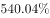，环比增长；按用途划分，发行新增债券7170亿元，同比增长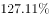，环比增长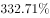，发行置换债券和再融资债券1826亿元，同比减少，环比增长。

        2019年6月，地方政府债券平均发行期限11.1年，其中新增债券10.4年，置换债券和再融资债券13.4年；地方政府债券平均发行利率，其中新增债券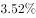，置换债券和再融资债券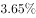。

        2019年1至6月，全国发行地方政府债券28372亿元，同比增长。其中，发行一般债券12858亿元，同比增长，发行专项债券15514亿元，同比增长；按用途划分，发行新增债券21765亿元，同比增长，发行置换债券和再融资债券6607亿元，同比减少。

        2019年1至6月，地方政府债券平均发行期限9.3年，其中一般债券11.2年，专项债券7.8年；地方政府债券平均发行利率，其中一般债券，专项债券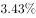。

        2019年全国地方政府债务限额为240774.3亿元。其中，一般债务限额133089.22亿元，专项债务限额107685.08亿元。截至2019年6月末，全国地方政府债务余额205477亿元，其中，一般债务118397亿元，专项债务87080亿元。

### 第 1 题　qid 2616092 · 综合

2019年6月，全国发行的地方政府债券比2018年6月多约：

- **A**. 6151亿元
- **B**. 5953亿元
- **C**. 3653亿元　✅
- **D**. 3043亿元

**答案**：C

**官方解析**

根据题干“2019年6月，······比2018年6月多约”，判定本题为增长量计算问题。定位文字材料第一段“2019年6月，全国发行地方政府债券8996亿元，同比增长”。根据公式：增长量。代入数据，2019年6月，全国发行的地方政府债券的同比增长量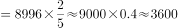亿元，与C项最接近。

故正确答案为C。

---

### 第 2 题　qid 2616095 · 综合

2018年1至5月，全国发行地方政府债券约：

- **A**. 23029亿元
- **B**. 19376亿元
- **C**. 14109亿元
- **D**. 8766亿元　✅

**答案**：D

**官方解析**

根据题干“2018年1至5月······约”，定位材料第一段“2019年6月，全国发行地方政府债券8996亿元，同比增长”，第三段“2019年1至6月，全国发行地方政府债券28372亿元，同比增长”，可判定本题为基期和差问题。根据公式：基期量，可知2018年1至5月，全国发行地方政府债券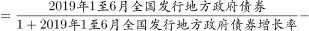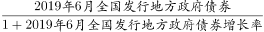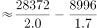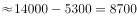亿元，与D项最接近。

故正确答案为D。

---

### 第 3 题　qid 2616097 · 比重

2018年1至6月，发行一般债券的占比较发行专项债券的占比约：

- **A**. 
低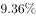

- **B**. 
低

- **C**. 
高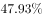
　✅
- **D**. 
高

**答案**：C

**官方解析**

根据题干“2018年1至6月······占比约”，结合材料时间，可判定本题为基期比重问题。结合文字资料第三段“2019年1至6月，全国发行地方政府债券28372亿元，同比增长。其中，发行一般债券12858亿元，同比增长，发行专项债券15514亿元，同比增长”。代入公式：基期量和比重，可得所求比重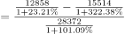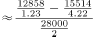，与C项最接近。

故正确答案为C。

---

### 第 4 题　qid 2616100 · 综合

2018年6月，发行置换债券和再融资债券约为：

- **A**. 3157亿元
- **B**. 2186亿元　✅
- **C**. 1657亿元
- **D**. 1386亿元

**答案**：B

**官方解析**

根据题干“2018年6月”，结合选项单位与材料时间，可判定本题为基期计算问题。根据文字材料第一段“（2019年6月）发行置换债券和再融资债券1826亿元，同比减少”。结合公式：基期量可得，2018年6月发行置换债券和再融资债券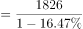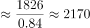亿元，与B项最接近。

故正确答案为B。

---

### 第 5 题　qid 2616101 · 综合

不能从上述资料推出的是：

- **A**. 截至2019年6月末，地方政府一般债务余额和专项债务余额都控制在限额之内
- **B**. 2019年1至6月，地方政府一般债券的平均发行利率高于专项债券0.1个百分点
- **C**. 2019年5月，地方政府新增债券的平均发行期限比置换债券和再融资债券短　✅
- **D**. 2019年地方一般债务限额比专项债务限额多25404.14亿元

**答案**：C

**官方解析**

A项：定位文字材料最后一段“2019年······一般债务限额133089.22亿元，专项债务限额107685.08亿元。截至2019年6月末······一般债务118397亿元，专项债务87080亿元”，由于118397亿元133089.22亿元、87080亿元107685.08亿元，说明都控制在限额之内，正确；

B项：定位文字材料第四段“2019年1至6月，······其中一般债券，专项债券”，则一般债券平均发行利率专项债券平均发行利率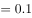个百分点，正确；

C项：定位文字材料第二段“2019年6月，······其中新增债券10.4年，置换债券和再融资债券13.4年”，只有2019年6月的年份数据，无法计算出2019年5月的数据，故无法推出，错误；

D项：定位文字材料最后一段“2019年······其中，一般债务限额133089.22亿元，专项债务限额107685.08亿元”，一般债务限额专项债务限额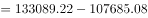亿元，正确。

本题为选非题，故正确答案为C。

---

## 材料 2

        截至2018年底，中国人工智能市场规模约为238.2亿元，同比增长率达到。从中国人工智能企业地域分布情况来看，北京企业数量最多，企业数量为368家；其次为广东，人工智能企业数量为185家；排名第三的是上海，数量为131家。

### 第 6 题　qid 2616074 · 综合

截至2017年底，中国人工智能市场规模约为：

- **A**. 141.1亿元
- **B**. 152.1亿元　✅
- **C**. 156.1亿元
- **D**. 164.1亿元

**答案**：B

**官方解析**

定位柱形图1可得，2017年中国人工智能市场规模约为152.1亿元。

故正确答案为B。

注：若本题没有发现柱形图1的数据，直接看到文字材料，可以按照求解基期量计算。根据文字材料“截至2018年底，中国人工智能市场规模约为238.2亿元，同比增长率达到”，可得2017年中国人工智能市场规模约为亿元，与B项最接近。

---

### 第 7 题　qid 2616075 · 增长

2017年中国人工智能市场规模同比增长率与2015年相比约：

- **A**. 减少了13.3个百分点
- **B**. 增加了13.3个百分点
- **C**. 减少了15.4个百分点
- **D**. 增加了15.4个百分点　✅

**答案**：D

**官方解析**

根据题干“2017年······同比增长率与2015年相比”，可判定本题为一般增长率问题。定位柱形图1，2017年和2016年中国人工智能市场规模分别为152.1亿元和100.6亿元，则2017年中国人工智能市场规模同比增长率约为，2015年和2014年中国人工智能市场规模分别为70.2亿元和51.7亿元，则2015年中国人工智能市场规模同比增长率约为，故2017年中国人工智能市场规模同比增长率与2015年相比约增加了，即增加了15.9个百分点，与D项最接近。

故正确答案为D。

---

### 第 8 题　qid 2616077 · 增长

2015至2018年，中国人工智能市场规模同比增长率最高的年份是：

- **A**. 2015年
- **B**. 2016年
- **C**. 2017年
- **D**. 2018年　✅

**答案**：D

**官方解析**

根据题干“····同比增长率最高···”，可判定本题为一般增长率的比较问题。定位材料图1可知每一年的现期量与基期量，代入增长率公式：

2015年：；

2016年：；

2017年：；

2018年： 定位文字材料，截至2018年底，中国人工智能市场规模约为238.2亿元，同比增长率达到。

比较可知，2018年增长率最高。

故正确答案为D。

---

### 第 9 题　qid 2616148 · 综合

图2中排名第二的省（市），其人工智能企业数量的个数约是排名后四位的数量之和的多少倍？

- **A**. 11.3
- **B**. 12.3　✅
- **C**. 12.8
- **D**. 13.3

**答案**：B

**官方解析**

根据题干“···约是···的多少倍”，可判定本题为现期倍数计算问题。定位图2可得：排名第二的省（市）是广东，其人工智能企业数量为185个，排名后四位的为广西、重庆、河南、辽宁，其人工智能企业数量依次为1个、3个、5个、6个。因此所求倍数。

故正确答案为B。

---

### 第 10 题　qid 2616099 · 综合

下列说法正确的是：

- **A**. 
截至2018年底，中国人工智能市场规模每年同比增长率都超过

- **B**. 
截至2018年底，中国人工智能企业地域分布情况中，广东企业数量最多

- **C**. 
截至2018年底，中国人工智能企业北京企业数量不超过上海企业数量的

- **D**. 
截至2018年底，福建人工智能企业的数量等于河南、天津、广西三省企业数量之和
　✅

**答案**：D

**官方解析**

A项：定位图1，2015年中国人工智能市场规模同比增长率为，错误；

B项：定位文字材料，截至2018年底，中国人工智能企业地域分布中，北京企业数量最多，而非广东，错误；

C项：定位文字材料，截至2018年底，北京企业数量368家，上海企业数量131家，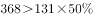，错误；

D项：定位图2，截至2018年底，福建人工智能企业数为16家，河南、天津和广西分别为5家、10家和1家，，福建人工智能企业数量等于河南、天津、广西三省企业数量之和，正确。

故正确答案为D。

---
