# 2020年四川下半年公务员录用考试《行测》试题（网友回忆版）

> 资料分析 · 15 题 · 四川 2020

## 材料 1

        2015年国民经济和社会发展统计公报。公报显示，全年全国居民人均可支配收入21966元，比上年增长，增长率下降1.2个百分点。按常住地分，2015年城镇居民人均可支配收入31195元，比上年增长，增长率比2014年下降0.8个百分点；农村居民人均可支配收入11422元，比上年增长，增长率比2014年下降2.3个百分点。全年农村居民人均纯收入为10772元。全国农民工人均月收入3072元，比上年增长。全国居民人均消费支出15712元，比上年增长。按常住地分，城镇居民人均消费支出21392元，增长，农村居民人均消费支出9223元，增长。2015年，全国参加城镇职工基本养老保险人数35361万人，比上年末增加1236万人，比2013年末增加3133万人；参加城乡居民基本养老保险人数50472万人，增加365万人，比2013年末增加772万人；参加城镇基本医疗保险人数66570万人，增加6823万人，比2013年末增加9525万人。其中，参加职工基本医疗保险人数28894万人，增加598万人；参加城镇居民基本医疗保险人数37675万人，增加6225万人。参加失业保险人数17326万人。参加工伤保险人数21404万人，增加765万人，其中参加工伤保险的农民工7489万人，增加127万人。参加生育保险人数17769万人，增加730万人。

### 第 1 题　qid 2725466 · 平均数

2013年，城镇居民人均可支配收入约为多少万元？

- **A**. 1.9
- **B**. 2.2
- **C**. 2.6　✅
- **D**. 3

**答案**：C

**官方解析**

根据题干“2013年，城镇居民人均可支配收入······”，结合材料时间为2015年，可判定本题为间隔基期问题。定位材料第一段“按常住地分，2015年城镇居民人均可支配收入31195元，比上年增长，增长率比2014年下降0.8个百分点”，则2014年城镇居民人均可支配收入同比增速为，根据间隔增长率计算公式：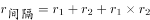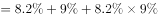，则2013年城镇居民人均可支配收入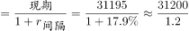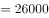元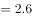万元，对应C项。

故正确答案为C。

---

### 第 2 题　qid 2725470 · 增长

2015年，下列指标中同比增长最快的是：

- **A**. 全国农民工人均月收入
- **B**. 城镇居民人均消费支出
- **C**. 农村居民人均可支配收入
- **D**. 农村居民人均消费支出　✅

**答案**：D

**官方解析**

根据题干“同比增长最快······”，且材料中已知相关增长率，可判断本题为直接找数问题。由文字材料可得：全国农民工人均月收入同比增速为，城镇居民人均消费支出同比增速为，农村居民人均可支配收入同比增速为，农村居民人均消费支出同比增速为。故同比增长最快的是农村居民人均消费支出。

故正确答案为D。

---

### 第 3 题　qid 2725476 · 增长

2014年，参加城镇职工基本养老保险人数比上年同期增长了：

- **A**. 0.044
- **B**. 0.049
- **C**. 0.054
- **D**. 0.059　✅

**答案**：D

**官方解析**

根据题干“2014年······比上年同期增长了”，结合选项都没有单位，可判定本题为一般增长率计算问题。定位材料可得，2015年，全国参加城镇职工基本养老保险人数35361万人，比上年末增加1236万人，比2013年末增加3133万人。则2014年全国参加城镇职工基本养老保险人数为万人，2013年为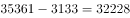万人。所求增长率。

故正确答案为D。

---

### 第 4 题　qid 2725479 · 综合

2014年，参加城镇居民基本医疗保险的人数约占当年参加城镇基本医疗保险人数的：

- **A**. 0.59
- **B**. 0.53　✅
- **C**. 0.42
- **D**. 0.36

**答案**：B

**官方解析**

根据题干“2014年······约占······的”，结合材料时间为2015年，可判定本题为基期比重计算问题。定位材料可得，（2015年）参加城镇基本医疗保险人数66570万人，增加6823万人，······其中······参加城镇居民基本医疗保险人数37675万人，增加6225万人。则所求比重为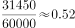，与B项最接近。

故正确答案为B。

---

### 第 5 题　qid 2725485 · 综合

能够从上述资料中推出的是：

- **A**. 
2014年参加工伤保险人数多于参加生育保险人数
　✅
- **B**. 
2015年参加失业保险的人数比上年增长以上

- **C**. 
2015年城乡居民基本养老保险人数同比增量高于2014年

- **D**. 
2015年城镇居民人均消费支出金额不到人均可支配收入的

**答案**：A

**官方解析**

A项：定位材料最后两句“（2015年）参加工伤保险人数21404万人，增加765万人······参加生育保险人数17769万人，增加730万人”。根据，可得2014年参加工伤保险人数为万人；2014年参加生育保险人数为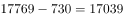万人。故2014年参加工伤保险人数多于参加生育保险人数，正确；

B项：定位材料“（2015年）参加失业保险人数17326万人”。只给出现期量，故无法得出2015年比上年的增长率，错误；

C项：定位材料“（2015年）参加城乡居民基本养老保险人数50472万人，增加365万人，比2013年末增加772万人”。可得2015年城乡居民基本养老保险人数同比增量为365万人，2014年城乡居民基本养老保险人数为（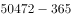）万人，2013年人数为（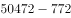）万人，故2014年城乡居民基本养老保险人数同比增量为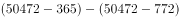万人。即2015年同比增量低于2014年，错误；

D项：定位材料“2015年城镇居民人均可支配收入31195元······城镇居民人均消费支出21392元”。可得元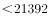元，故2015年城镇居民人均消费支出金额高于人均可支配收入的，错误。

故正确答案为A。

---

## 材料 2

        截止2017年末，全国就业人员77640万人，比上年末增加37万人；其中城镇就业人员42462万人，比上年末增加1034万人。全国就业人员中，第一产业就业人员占；第二产业就业人员占；第三产业就业人员占。2017年全国农民工总量28652万人，比上年增加481万人，其中外出农民工17185万人。

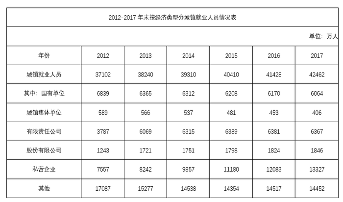

### 第 6 题　qid 2725301 · 综合

2017年末，全国第一产业就业人员约为多少万人?

- **A**. 11465
- **B**. 11963
- **C**. 20465
- **D**. 20963　✅

**答案**：D

**官方解析**

根据题干“2017年末，全国第一产业就业人员······”，结合材料给了2017年末全国就业人员的人数以及第一产业就业人员所占的比重，可判定本题为现期比重问题。定位文字材料可得：2017年末，全国就业人员77640万人，第一产业就业人员占。根据现期比重公式：部分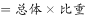，代入数据可得：第一产业就业人员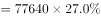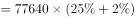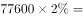万人，与D项最接近。

故正确答案为D。

---

### 第 7 题　qid 2725302 · 增长

2012-2017年，下列经济类型中，全国城镇就业人员增速最快的是：

- **A**. 私营企业　✅
- **B**. 有限责任公司
- **C**. 国有单位
- **D**. 股份有限公司

**答案**：A

**官方解析**

根据题干“2012-2017年······增速最快的是”，可判定本题为一般增长率问题。定位表格材料可得：A项，2012年为7557万人，2017年为13327万人；B项，2012年为3787万人，2017年为6367万人；C项，2012年为6839万人，2017年为6064万人；D项，2012年为1243万人，2017年为1846万人。根据一般增长率公式：增长率，代入公式可得：A项：增长率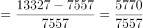；B项：增长率；C项：增长率；D项：增长率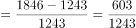；观察可以发现，其中A、B两项明显大于，C项为负数，D项低于，所以排除C、D两项，只需要比较A、B两项：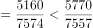，即A项B项，所以A项增速最快。

故正确答案为A。

---

### 第 8 题　qid 2725306 · 综合

2017年末，国有单位和城镇集体单位城镇就业人员约占全国城镇就业人员的：

- **A**. 

- **B**. 

　✅
- **C**. 

- **D**. 

**答案**：B

**官方解析**

根据题干“2017年末······约占······”，结合表格材料给出的2017年末按经济类型分城镇就业人员情况，可判定本题为现期比重问题。定位表格材料可得，2017年末城镇就业人员42462万人，其中，国有单位城镇就业人员6064万人，城镇集体单位城镇就业人员406万人。2017年末，国有单位和城镇集体单位城镇就业人员约占全国城镇就业人员的比重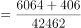。

故正确答案为B。

---

### 第 9 题　qid 2725309 · 比重

2012-2016年，我国第三产业就业人员占全国就业人员比例最大的年份是：

- **A**. 2013年
- **B**. 2014年
- **C**. 2015年
- **D**. 2016年　✅

**答案**：D

**官方解析**

根据题干“2012-2016年，······占······”，结合表格材料给出2012-2016年末第三产业就业人员和全国就业人员的数据，可判定本题为现期比重问题。定位表格可得，2013-2016年末全国就业人员分别为：76977万人、77253万人、77451万人、77603万人，第三产业就业人员分别为：29636万人、31364万人、32839万人、33757万人。可得：

2013年第三产业就业人员占全国就业人员的比例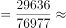；

2014年第三产业就业人员占全国就业人员的比例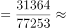；

2015年第三产业就业人员占全国就业人员的比例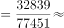；

2016年第三产业就业人员占全国就业人员的比例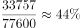。

比较可知，所求占比最大的是2016年。

故正确答案为D。

---

### 第 10 题　qid 2725312 · 综合

能够从上述资料中推出的是：

- **A**. 
2012-2017年，全国有限责任公司城镇就业人员逐年递增

- **B**. 
2016年，全国第二产业就业人员比2012年减少超过1000万人

- **C**. 
2017年，外出农民工约占全国农民工总量的以上

- **D**. 
2013-2017年，全国城镇就业人员数量增长最多的年份是2013年
　✅

**答案**：D

**官方解析**

A项：定位表格材料可知，2012年-2017年全国有限责任公司城镇就业人员数量，其中2015年为6389万人，2016年为6381万人，2017年为6367万人，2015-2017年逐年递减，错误；

B项：定位表格材料可知，2016年与2012年全国第二产业就业人员数量分别为22350万人、23241万人，则2016年全国第二产业就业人员比2012年减少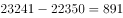万人，未超过1000万人，错误；

C项：定位文字材料可知，2017年全国农民工总量28652万人，其中外出农民工17185万人。则2017年外出农民工约占全国农民工总量的比重为，非以上，错误；

D项：定位表格材料可知，2012年-2017年全国城镇就业人员数量。则各年份城镇就业人员数量增长：2013年，万人；2014年，万人；2015年，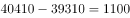万人；2016年，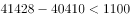万人；2017年，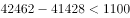万人。所以2013年全国城镇就业人员数量增长最多，正确。

故正确答案为D。

---

## 材料 3

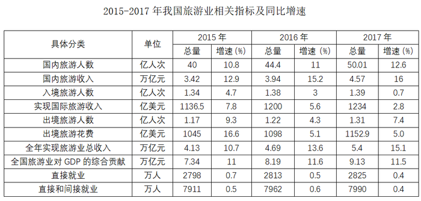

### 第 11 题　qid 2725323 · 增长

2015-2017年，相关指标中，3年增长率均超过的有几个：

- **A**. 2
- **B**. 3
- **C**. 4　✅
- **D**. 5

**答案**：C

**官方解析**

定位表格材料可得，3年增长率均超过的指标有国内旅游人数、国内旅游收入、全年实现旅游业总收入、全国旅游业对GDP的综合贡献，共4个指标。

故正确答案为C。

关于本题题干，我们搜集到两个考生回忆的版本：①3年增长率超过的有几个；②3年增长率均超过的有几个。小粉笔经过对比分析后，认为第一个理解有一定歧义，第二个版本表述更严谨，且与选项设置更契合。故采取了第二个版本录入题库并进行解析。

---

### 第 12 题　qid 2725324 · 增长

2015、2016、2017年，3年旅游总收入同比增量均值：

- **A**. 不到4000亿
- **B**. 4000-6000亿　✅
- **C**. 6000-8000亿
- **D**. 超过8000亿

**答案**：B

**官方解析**

根据题干“3年······同比增量均值”，可判定本题为年均增长量问题。定位表格材料可知，2015年旅游总收入为4.13万亿元，增速为，2017年旅游总收入为5.4万亿元，可知2014年旅游总收入为万亿元。根据年均增长量，故3年旅游总收入同比增量均值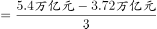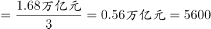亿元，结合选项在4000-6000亿元之间。

故正确答案为B。

---

### 第 13 题　qid 2725325 · 平均数

2017年，国内旅游平均每人次创造收入比2015年：

- **A**. 增长小于100元　✅
- **B**. 增长大于100元
- **C**. 减少小于100元
- **D**. 减少大于100元

**答案**：A

**官方解析**

根据题干“2017年，国内旅游平均每人次创造收入比2015年”，结合选项：增长/减少单位，可判定本题为平均数的增长量问题。定位表格材料可知：2017年国内旅游收入为4.57万亿元，国内旅游人数为50.01亿人次；2015年国内旅游收入为3.42万亿元，国内旅游人数为40亿人次。代入公式：平均数的增长量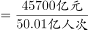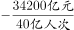元，即增长小于100元。

故正确答案为A。

---

### 第 14 题　qid 2725326 · 平均数

2014-2017年，出境旅游平均人次花费最多的年份是：

- **A**. 2014
- **B**. 2015
- **C**. 2016　✅
- **D**. 2017

**答案**：C

**官方解析**

根据题干“2014-2017年，出境旅游平均人次花费最多的年份是”，可判定本题为现期平均数问题。

方法一：定位表格数据，出境旅游平均人次花费，根据基期平均数公式：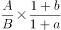，则2014年出境旅游平均人次花费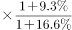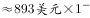；

2015年出境旅游平均人次花费：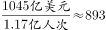美元；

2016年出境旅游平均人次花费：美元；

2017年出境旅游平均人次花费：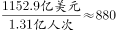美元。

因此2016年出境旅游平均人次花费最多。

方法二：根据出境旅游平均人次花费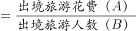，定位表格数据，可查找到对应分子A（旅游花费）和分母B（旅游人次）的具体量与增长率，可判定本题为两期平均数比较问题。根据两期平均数结论：分子（旅游花费）的增长率分母（人次）的增长率，平均数上升；反之，下降。

则：2015年旅游花费增长率；旅游人次增长率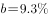，，因此2015年平均数2014年平均数；

2016年旅游花费增长率；旅游人次增长率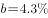，，因此2016年平均数2015年平均数；

2017年旅游花费增长率；旅游人次增长率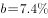，，因此2017年平均数2016年平均数；

综上可得，2016年出境旅游平均人次花费最多。

故正确答案为C。

---

### 第 15 题　qid 2725327 · 综合

能够从上述资料中推出的是：

- **A**. 
2016年，入境旅游人数增速比2015年降低1.7个百分点
　✅
- **B**. 
2017年，旅游业直接就业占直接和间接就业比重不到

- **C**. 
2015-2017年，全国旅游业对GDP的贡献同比增速逐年增大

- **D**. 
2015-2017年，每年出境花费同比增速均高于国际旅游收入同比增速

**答案**：A

**官方解析**

A项：定位表格可得，2015年入境旅游人数增速为，2016年入境旅游人数增速为，则2016年入境旅游人数增速比2015年降低个百分点，正确；

B项：定位表格可得，2017年直接就业人数2825万人，直接和间接就业人数7990万人，则2017年旅游业直接就业占直接和间接就业比重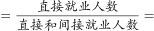，错误；

C项：定位表格可得，2015-2017年，全国旅游业对GDP的贡献同比增速分别为、、，2017年增速低于2016年，则不是逐年增大，错误；

D项：定位表格可得，2015-2017年，出境旅游花费同比增速分别为、、，国际旅游收入同比增速分别为、、，其中2016年出境旅游花费同比增速（）2016年国际旅游收入同比增速（），错误。

故正确答案为A。

本题的A项，关于1.7的表述，我们搜集到“1.7个百分点”和“”两个考生回忆版本。考虑到增速本身是相对量指标，根据统计习惯和以往的命题方式，小粉笔认为第一种表述更符合题目本意，否则本题就没有正确答案了。故我们选择第一种进行录入并进行解析。

---
