# 2020年四川省公务员考试《行测》试题（网友回忆版）

> 资料分析 · 15 题 · 四川 2020

## 材料 1

        据调查，全国各院校毕业五年的大学生（以下统称为毕业生）薪酬排名前十的情况如下：

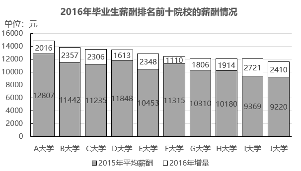

### 第 1 题　qid 2578797 · 平均数

资料中2016年毕业生平均薪酬最高的院校，其毕业生平均薪酬约是平均薪酬最低院校的：

- **A**. 1.1倍
- **B**. 1.3倍　✅
- **C**. 1.5倍
- **D**. 1.7倍

**答案**：B

**官方解析**

根据题干“2016年······约是······的”，结合材料时间为2016年，选项为倍数，可判定本题为现期倍数问题。定位柱状图可得，2016年平均薪酬最高的是A大学，薪酬为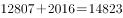元；平均薪酬最低的是J大学，薪酬为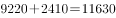元。则2016年毕业生平均薪酬最高的院校是最低院校的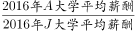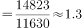倍。

故正确答案为B。

---

### 第 2 题　qid 2578798 · 增长

2016年语言类大学平均薪酬排名第二的院校，其毕业生平均薪酬同比增长约为：

- **A**. 

　✅
- **B**. 

- **C**. 

- **D**. 

**答案**：A

**官方解析**

根据题干“2016年······同比增长约为”，结合选项为百分数，可判定本题为一般增长率问题。定位表格可得，2016年语言类大学平均薪酬排名第二的院校是G院校。定位柱状图可得，G院校2015年平均薪酬为10310元，2016年增量为1806元，则其毕业生平均薪酬同比增长率，只有A项符合。

故正确答案为A。

---

### 第 3 题　qid 2578799 · 增长

图中有几所院校毕业生2016年平均薪酬同比增速低于：

- **A**. 0
- **B**. 1　✅
- **C**. 2
- **D**. 3

**答案**：B

**官方解析**

由题干“有几所院校毕业生2016年平均薪酬同比增速低于”，可判定本题为一般增长率问题。定位柱状图可得各院校2015年毕业生平均薪酬及2016年同比增量，代入公式：增长率，可分别计算各院校平均薪酬增长率，再与进行大小比较即可。

A院校：；B院校：；C院校：；D院校：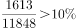；E院校：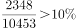；F院校：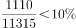；G院校：；H院校：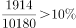；I院校：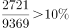；J院校：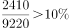。计算可知，只有F院校，即共计1所院校毕业生2016年平均薪酬同比增速低于。

故正确答案为B。

---

### 第 4 题　qid 2578802 · 平均数

假设资料中的各个院校毕业生人数相同，2016年各专业类型毕业生平均薪酬，从高到低排序为：

- **A**. 
工科语言财经综合

- **B**. 
财经工科综合语言

- **C**. 
工科综合财经语言
　✅
- **D**. 
综合工科财经语言

**答案**：C

**官方解析**

根据题干“2016年各专业类型毕业生平均薪酬······”，可判定本题为现期平均数问题。定位表格可知，工科类院校有A、H共2所、财经类院校有B、I、J共3所、综合类院校有C、D、F共3所、语言类院校有E、G共2所，各专业类型毕业生平均薪酬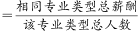。

定位柱状图数据可得2016年各院校类型平均薪酬，由题干条件“设资料中的各个院校毕业生人数相同”，设各个毕业院校毕业生人数为1，则工科类（A、H）的平均薪酬为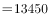元，财经类（B、I、J）平均薪酬为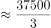元，综合类（C、D、F）平均薪酬为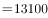元，语言类（E、G）平均薪酬为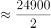元。

所以平均薪酬从高到低依次为工科综合财经语言。

故正确答案为C。

---

### 第 5 题　qid 2578808 · 综合

关于资料中十所院校的情况，能够从上述资料推出的是：

- **A**. 北京的院校占总数的一半以下
- **B**. 综合类院校的数量和工科院校一样多
- **C**. 毕业生薪酬排名第9的院校薪酬增速最快　✅
- **D**. 毕业生薪酬排名第5的院校2015年同样排名第5

**答案**：C

**官方解析**

A项：定位表格可得，北京的院校有A、F、G、I、J共五所，占院校总数的比重为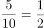，即北京的院校占十所院校的一半，错误；

B项：定位表格可得，综合类院校有C、D、F共三所，工科类有A、H共两所，两类院校数量不一致，错误；

C项：定位柱状图可得，2016年毕业生薪酬排名第9的院校为I院校，根据增长率进行比较：在A-I九所院校中，I院校同比增量最大、基期量最小，则这九所院校中I院校同比增速最快；比较I、J两所院校增速，I院校增速为，J院校为，即I院校同比增速也快于J院校。所以I院校是毕业生薪酬增速最快的，正确；

D项：定位柱状图可得，2016年毕业生薪酬排名第5的院校为E院校，其2015年毕业生薪酬在十所大学中排名第6，错误。

故正确答案为C。

---

## 材料 2

        2018年上半年，全国移动互联网累计流量达266亿GB，同比增长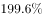；其中通过手机上网的流量达到262亿GB，同比增长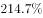。

### 第 6 题　qid 2578809 · 比重

2018年上半年，全国通过非手机设备上网的移动互联网接入流量占同期移动互联网累计接入流量的比重在以下哪个范围内？

- **A**. 
不到

- **B**. 
~之间
　✅
- **C**. 
~之间

- **D**. 
超过

**答案**：B

**官方解析**

根据题干“2018年上半年，······占······的比重······”，可判定本题为现期比重问题。定位文字材料可得：2018年上半年，全国移动互联网累计流量为266亿GB，其中通过手机设备上网的流量为262亿GB。则通过非手机设备上网的移动互联网接入流量为亿GB，其占同期移动互联网累计接入流量的比重为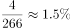，在~之间。

故正确答案为B。

---

### 第 7 题　qid 2578811 · 综合

2017年下半年，全国移动互联网累计接入流量约是上半年的多少倍?

- **A**. 1.8　✅
- **B**. 2.0
- **C**. 2.7
- **D**. 3.4

**答案**：A

**官方解析**

根据题干“2017年下半年······是上半年······的多少倍”，结合材料数据时间是2018年上半年，可判定本题为基期倍数问题。定位文字材料可得：2018年上半年，全国移动互联网累计流量达266亿GB，同比增长；定位柱状图可得：2017年7~12月全国移动互联网接入流量依次为19.7、21.7、24、27.9、29.8、33.9亿GB。根据基期公式：，则2017年上半年全国移动互联网累计流量为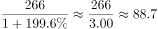亿GB；2017年下半年全国移动互联网接入流量为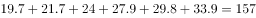亿GB。故2017年下半年全国移动互联网累计接入流量约是上半年的倍。

故正确答案为A。

---

### 第 8 题　qid 2578812 · 综合

2018年3月，全国移动互联网接入户数约为多少亿户?

- **A**. 12.4
- **B**. 12.7
- **C**. 13.0　✅
- **D**. 13.3

**答案**：C

**官方解析**

根据题干“2018年3月，全国移动互联网接入户数约为······”，结合材料中给出2018年3月全国移动互联网接入流量和户均全国移动互联网接入流量可知：全国移动互联网接入户数，可判定本题为现期平均数问题。定位图形材料可得：2018年3月，全国移动互联网接入流量为42.8亿GB，户均全国移动互联网接入流量为3.29GB/户。则全国移动互联网接入户数亿户。

故正确答案为C。

---

### 第 9 题　qid 2578813 · 平均数

2018年上半年，户均移动互联网接入流量环比增长以上的月份有几个？

- **A**. 1
- **B**. 2　✅
- **C**. 3
- **D**. 4

**答案**：B

**官方解析**

根据题干“······环比增长以上的月份有······”，可判定本题为一般增长率问题。由增长率公式：增长率，可得，若“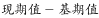”，则增长率超过。定位图形材料：1月：；2月：；3月：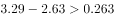；4月：；5月：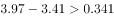；6月：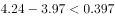，只有3月和5月户均移动互联网接入流量环比增长以上。

故正确答案为B。

---

### 第 10 题　qid 2578814 · 综合

无法从上述资料中推出的是：

- **A**. 
2017年12月移动互联网接入流量较上月增长以上

- **B**. 
2018年上半年通过非手机移动设备上网的流量同比增长超过2倍
　✅
- **C**. 
2018年第二季度移动互联网接入流量比第一季度增长40亿GB以上

- **D**. 
2017年6月-2018年6月，户均移动互联网日接入流量超过0.1GB/户的月份仅有4个

**答案**：B

**官方解析**

A项：定位图形材料可得：2017年11月，移动互联网接入流量为29.8亿GB；2017年12月，移动互联网接入流量为33.9亿GB。则增长率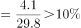，正确；

B项：定位文字材料可得：全国移动互联网累计流量的同比增长率为，通过手机上网的流量的同比增长率为。由于“非手机移动设备上网的流量手机移动设备上网的流量移动互联网流量”，根据混合增长率口诀“混合居中”可知，2018年上半年通过非手机移动设备上网的流量同比增长率小于全国移动互联网流量的同比增长率，未超过2倍，错误；

C项：定位柱状图，2018年1-6月移动互联网接入流量分别为35.3亿GB、33.6亿GB、42.8亿GB、45.2亿GB、52.7亿GB、56.7亿GB，根据公式：增长量现期量基期量，则所求二季度一季度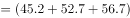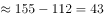亿GB，正确；

D项：定位折线图，根据公式：户均移动互联网日接入流量，可知户均移动互联网日接入流量超过0.1GB/户的月份有4个，分别为2018年3月（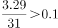GB/户），2018年4月（GB/户），2018年5月（GB/户），2018年6月（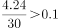GB/户），正确。

本题为选非题，故正确答案为B。

---

## 材料 3

        2017年，S市服务业小微样本企业总体实现营业收入105.39亿元，同比增长 ，比2016年回落了15.7个百分点，户均实现营业收入510.63万元。

        2017年，S市服务业小微样本企业总体资产938.58亿元，同比增长 ，增速比2016年下降0.9个百分点，户均资产4547.40万元。分门类看，除房地产业，交通运输、仓储和邮政业，教育业资产总计比2016年分别下降、和外，其他行业资产总计同比均有不同程度的增长。

        2017年，S市服务业小微样本企业总体营业税金及附加为1.09亿元，同比下降；缴纳增值税2.30亿元，同比增长，户均缴纳增值税11.16万元。

        2017年，S市服务业小微样本企业总体应付职工薪酬19.28亿元，比2016年增长。户均应付职工薪酬93.50万元。从业人员人数29028人，人均年薪酬6.64万元，比2016年增加0.60万元。

### 第 11 题　qid 2578803 · 综合

2017年，S市服务业小微样本企业共有多少户?

- **A**. 不到3000户　✅
- **B**. 3000~4000户之间
- **C**. 4001~5000户之间
- **D**. 超过5000户

**答案**：A

**官方解析**

根据题干“2017年，S市服务业小微样本企业······户”，结合材料给出2017年总体营业收入及户均营业收入，可判定本题为现期平均数计算问题。定位文字材料第一段，“2017年，S市服务业小微样本企业总体实现营业收入105.39亿元······户均实现营业收入510.63万元”。根据平均数计算公式：户数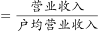，故2017年S市服务业小微样本企业户数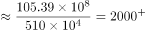户，不到3000户。

故正确答案为A。

---

### 第 12 题　qid 2578804 · 平均数

2017年，S市服务业小微样本企业平均每万元资产实现营业收入比2015年：

- **A**. 
增长了不到

- **B**. 
增长了以上
　✅
- **C**. 
下降了不到

- **D**. 
下降了以上

**答案**：B

**官方解析**

根据题干“2017年，······平均每······比2015年”，且选项为增长/下降百分数，可判定本题为平均数的增长率结合间隔增长率计算问题。定位文字材料第一段，“2017年，S市服务业小微样本企业总体实现营业收入105.39亿元，同比增长，比2016年回落了15.7个百分点”；定位文字材料第二段，“2017年，S市服务业小微样本企业总体资产938.58亿元，同比增长，增速比2016年下降0.9个百分点”。平均每万元资产实现营业收入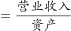，平均数增长率。先根据间隔增长率公式：计算和，则营业收入的间隔增长率；总体资产的间隔增长率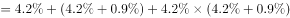。代入公式计算，在B项范围之内。

故正确答案为B。

---

### 第 13 题　qid 2578805 · 平均数

如S市服务业小微样本企业数量为固定值，问2017年S市服务业小微样本企业户均比上年少缴纳营业税金及附加多少万元？

- **A**. 1.1
- **B**. 2.2　✅
- **C**. 3.3
- **D**. 4.4

**答案**：B

**官方解析**

根据题干“2017年······户均比上年少······多少万元”，可判定本题为平均数的增长量计算问题。定位材料第三段可得“2017年，S市服务业小微样本企业总体营业税金及附加为1.09亿元，同比下降”；结合题干“S市服务业小微样本企业数量为固定值”，再结合本篇材料第1题可知，小微样本企业数量为2066户。根据户均缴纳营业税金及附加，所以2017年S市服务业小微样本企业户均比上年少缴纳营业税金及附加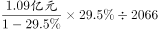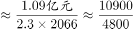万元万元，对应B项。

故正确答案为B。

---

### 第 14 题　qid 2578806 · 综合

S市服务业小微样本企业2016年从业人员总数最接近以下哪个数字？

- **A**. 26565
- **B**. 27001
- **C**. 29205　✅
- **D**. 35015

**答案**：C

**官方解析**

根据题干“S市服务业小微样本企业2016年从业人员总数······”，结合材料时间为2017年，并给出总体职工薪酬及人均年薪，从业人员数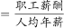，可判定本题为基期平均数计算问题。定位文字材料第四段可得，“2017年，S市服务业小微样本企业总体应付职工薪酬19.28亿元，比2016年增长······人均年薪酬6.64万元，比2016年增加0.60万元”，根据基期量，S市服务业小微样本企业2016年从业人员总数人，对应C项。

故正确答案为C。

---

### 第 15 题　qid 2578807 · 综合

能够从上述资料中推出的是：

- **A**. 
2016年，S市服务业小微样本企业缴纳营业增值税超过营业税金及附加的2倍

- **B**. 
2017年，S市服务业小微样本企业总体应付职工薪酬同比增加2亿多元

- **C**. 
2017年，除房地产业外，S市其他服务业小微样本企业总体资产同比增速高于
　✅
- **D**. 
2017年，S市服务业小微样本企业平均每万元营业收入缴纳营业税金及附加高于上年水平

**答案**：C

**官方解析**

A项：定位文字材料第三段可得，2017年，S市服务业小微样本企业总体营业税金及附加为1.09亿元（B），同比下降（b）；缴纳增值税2.30亿元（A），同比增长（a）。 根据基期倍数公式：，则所求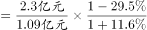倍。错误；

B项：定位文字材料第四段可得，“2017年，S市服务业小微样本企业总体应付职工薪酬19.28亿元，比2016年增长”。根据增长量，则所求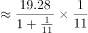亿元。错误；

C项：定位文字材料第二段可得，“2017年，S市服务业小微样本企业总体资产938.58亿元，同比增长······除房地产业······资产总计比2016年分别下降······”。可知S市服务业小微样本企业总体资产增长率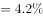，房地产业增长率，所以其他服务业小微样本企业总体资产增长率总体增长率（）房地产业（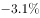）。正确；

D项，定位文字材料第三段可得，2017年，S市服务业小微样本企业总体营业税金及附加······同比下降（a）；定位文字材料第一段可得，“2017年，S市服务业小微样本企业总体实现营业收入······同比增长（b）”。平均每万元营业收入缴纳营业税及附加，根据两期平均数结论，，平均数低于上年水平。错误。

故正确答案为C。

---
