# 2020年国家公务员录用考试《行测》题（副省级网友回忆版）

> 资料分析 · 20 题 · 国考 2020

## 材料 1

### 第 1 题　qid 2448399 · 综合

2018年中国在线旅游收入约占旅游业总收入的：

- **A**. 

- **B**. 

- **C**. 

- **D**. 

　✅

**答案**：D

**官方解析**

根据题干“2018年······占······的”结合选项为百分数，可判定本题为现期比重问题。定位表格材料可知，2018年旅游业总收入为5.97万亿元，2018年在线旅游收入亿元万亿元。代入公式：比重。

故正确答案为D。

---

### 第 2 题　qid 2448408 · 增长

2017年中国在线旅游收入同比约增长多少万亿元？

- **A**. 0.15　✅
- **B**. 0.20
- **C**. 0.25
- **D**. 0.30

**答案**：A

**官方解析**

根据题干“2017年···同比约增长···万亿元”，可判定本题为增长量计算问题。定位表格可知，中国在线旅游收入，根据表格可得，2017年在线旅游收入；2016年在线旅游收入。代入公式：增长量。

故正确答案为A。

---

### 第 3 题　qid 2448412 · 比重

中国在线旅游收入中，2014年占中国旅游业总收入比重高于上年水平的包括：

- **A**. 仅在线交通预订
- **B**. 在线交通预订、在线住宿预订、在线度假旅游预订　✅
- **C**. 仅在线交通预订、在线住宿预订
- **D**. 仅在线交通预订、在线度假旅游预订

**答案**：B

**官方解析**

根据题干“···2014年占···比重高于上年水平的包括”可判定本题为两期比重问题。

方法一：根据两期比重结论，部分增长率大于总体增长率则比重同比上升，即高于上年水平。定位表格可知2013年、2014年中国旅游业总收入和在线旅游收入各部分的相关数据。利用公式“增长率”可得，总体增长率即中国旅游业总收入增长率；增长率即在线交通预订收入增长率；增长率即在线住宿预订收入增长率；增长率即在线度假旅游预订收入增长率。因此，满足条件的有在线交通预订，；在线住宿预订，；在线度假旅游预订，。

方法二：根据表格中2013年、2014年中国旅游业总收入和在线旅游收入各部分的相关数据，利用公式“比重”可得，2013年、2014年在线交通预订收入占中国旅游业总收入的比重分别、，，即比重高于上年水平；

2013年、2014年在线住宿预订收入占中国旅游业总收入的比重分别、，，即比重高于上年水平；

2013年、2014年在线度假旅游预订收入占中国旅游业总收入的比重分别、，则，即比重高于上年水平。

故满足条件的有在线交通预订、在线住宿预订、在线度假旅游预订。

故正确答案为B。

---

### 第 4 题　qid 2448416 · 增长

以下折线图反映了2014～2018年间哪项收入同比增量的变化趋势？

- **A**. 在线住宿预订
- **B**. 旅游业总体
- **C**. 在线度假旅游预订　✅
- **D**. 在线交通预订

**答案**：C

**官方解析**

根据题干“······同比增量的变化趋势”，可判定本题为增长量比较问题。

A项：定位表格第四列数据可得：“2013年~2018年在线住宿预订收入依次为412.10亿元、547.45亿元、862.57亿元、1251.42亿元、1586.19亿元、1881.49亿元”，根据公式：增长量=现期量-基期量，则2014-2018年在线住宿预订收入同比增量依次为2014年：547.45-412.10547-412=135亿元、2015年：862.57-547.45863-547=316亿元、2016年：1251.42-862.571251-863=388亿元；2017年：1586.19-1251.421586-1251=335亿元；2018年：1881.49-1586.191881-1586=295亿元。2017年比2015年增长量大，即折线图中第4个点应比第2个点高，与题干折线图矛盾，排除A项。

B项：定位表格第二列数据可得：“2013年~2018年旅游业总体收入依次为2.95万亿元、3.38万亿元、4.13万亿元、4.69万亿元、5.40万亿元、5.97万亿元”，则2014-2018年旅游业总体收入同比增量依次为2014年：3.38-2.95=0.43万亿元、2015年：4.13-3.38=0.75万亿元、2016年：4.69-4.13=0.56万亿元、2017年：5.40-4.69=0.71万亿元、2018年：5.97-5.40=0.57万亿元。2015年增长量最大，即折线图中第2个点应该最高，与题干折线图矛盾，排除B项。

C项：定位表格第五列数据可得：“2013年~2018年在线度假旅游预订收入依次为244.20亿元、347.58亿元、549.97亿元、757.40亿元、947.47亿元、1051.81亿元”，则2014-2018年在线度假旅游预订收入同比增量依次为2014年：347.58-244.20348-244=104亿元、2015年：549.97-347.58550-348=202亿元、2016年：757.40-549.97757-550=207亿元、2017年：947.47-757.40947-757=190亿元、2018年：1051.81-947.471052-947=105亿元。满足题干折线图趋势。

D项：定位表格第三列数据可得：“2013年~2018年在线交通预订收入依次为1519.67亿元、2271.57亿元、3325.15亿元、5385.42亿元、6389.65亿元、6820.95亿元”，则2014-2018年在线交通预订收入同比增量依次为2014年：2271.57-1519.672272-1520=752亿元、2015年：3325.15-2271.573325-2272=1053亿元、2016年：5385.42-3325.155385-3325=2060亿元、2017年：6389.65-5385.426390-5385=1005亿元、2018年：6820.95-6389.656821-6390=431亿元。2018年增长量较2014年小很多，即折线图中第5个点应比第1个点低很多，与题干折线图矛盾，排除D项。

故正确答案为C。

---

### 第 5 题　qid 2448424 · 综合

能够从上述资料中推出的是：

- **A**. 2014～2018年，中国旅游业总收入超过25万亿元
- **B**. 2014～2016年，中国旅游业总收入同比增速逐年递增
- **C**. 2016年中国在线交通预订收入同比增速快于上年水平　✅
- **D**. 如保持2018年同比增量，中国在线住宿预订收入将在2023年首超3000亿元

**答案**：C

**官方解析**

A项：定位表格第二列数据可得：“2014年~2018年旅游业总体收入依次为3.38万亿元、4.13万亿元、4.69万亿元、5.40万亿元、5.97万亿元”，故题干所求总收入，错误。

B项：根据本篇第4题计算数据可得：“2014年~2016年中国旅游业总收入增长量分别为0.43万亿元、0.75万亿元、0.56万亿元”，代入公式：增长率，则，，两者比较分子大分母小，明显，即2016年增速下降，错误。

C项：根据本篇第4题计算数据可得：“2015年、2016年中国在线交通预订收入增长量分别约为1053亿元、2060亿元”，代入公式：增长率 ，，，明显，即2016年增速快于2015年，正确。

D项：根据本篇第4题计算数据可得：“2018年中国在线住宿预订收入增长量约为295亿元”，代入公式：现期量，，年，向上取整，需要4年，故在年住宿预订收入已超过3000亿元，错误。

故正确答案为C。

---

## 材料 2

 

### 第 6 题　qid 2448541 · 增长

2016～2018年，全国茶叶产量之和比2013～2015年产量之和增加了：

- **A**. 100～150万吨之间　✅
- **B**. 不到100万吨
- **C**. 超过200万吨
- **D**. 150～200万吨之间

**答案**：A

**官方解析**

根据题干“···比···增加了”，结合选项带单位，可判定本题为增长量计算问题。定位图形材料，可知2013-2018年各年份全国茶叶产量。根据公式：增长量=现期量-基期量，则题干所求为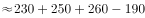万吨，在100~150万吨之间。

故正确答案为A。

---

### 第 7 题　qid 2448543 · 增长

2007～2018年间，全国茶园面积首次超过200万公顷的年份，当年茶园单位面积茶叶产量比上年：

- **A**. 
下降了以上

- **B**. 
下降了不到

- **C**. 
增加了以上

- **D**. 
增加了不到
　✅

**答案**：D

**官方解析**

根据题干“···单位面积茶叶产量比上年”，结合选项为下降/增加，可判定本题为平均数的增长率计算问题。定位图形材料，可知2007-2018年全国茶园面积首次超过200万公顷的年份为2011年。2011年全国茶园面积为205.6万公顷、产量为160.8万吨；2010年面积为193.2万公顷、产量为146.3万吨。根据公式：增长率，可以算得：2011年全国茶叶产量的增长率，茶园面积的增长率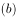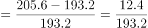；根据公式：平均数的增长率，则题干所求为 ，即增加了不到10%，对应D项。

故正确答案为D。

---

### 第 8 题　qid 2448544 · 综合

2018年全国产茶省份中，有几个省份的茶园单位面积茶叶产量高于1吨/公顷？

- **A**. 5　✅
- **B**. 4
- **C**. 7
- **D**. 6

**答案**：A

**官方解析**

根据题干“······有几个省份的单位面积茶叶产量高于1吨/公顷”，可判定本题为现期平均数的计算问题。定位表格材料，可知2018年全国产茶省份的产量和面积。根据公式：单位面积产量，若单位面积茶叶产量高于1吨/公顷，即产量数值（吨数）大于面积数值（公顷数）的省份，查找表中数据，共有5个省份符合要求，分别为福建、山东、湖北、湖南、广东。

故正确答案为A。

---

### 第 9 题　qid 2448545 · 综合

2018年茶园面积最大的4个省份中，茶叶产量也是全国前4名的省份有几个？

- **A**. 3　✅
- **B**. 4
- **C**. 1
- **D**. 2

**答案**：A

**官方解析**

定位表格材料，可以得到全国产茶省份茶园面积及茶叶产量。2018年茶园面积最大的4个省份分别是贵州（45.62万公顷）、云南（44.45万公顷）、四川（36.34万公顷）、湖北（29.93万公顷）；茶叶产量全国前4名的省份分别是福建（40.16万吨）、云南（39.81万吨）、湖北（31.45万吨）、四川（29.50万吨）。由此可以看出，2018年茶园面积最大的4个省份中，茶叶产量也是全国前4名的省份有湖北、四川、云南3个。
故正确答案为A。

---

### 第 10 题　qid 2448546 · 综合

能够从上述资料中推出的是：

- **A**. 2018年全国茶叶产量比9年前翻了一番
- **B**. 2018年全国茶园面积最小的产茶省份，单位面积产量也最低
- **C**. 2008～2010年，全国茶园面积同比增速逐年持续下降　✅
- **D**. 2018年湖南、湖北的茶园面积占全国茶园总面积的两成以上

**答案**：C

**官方解析**

A项：定位图形材料，2018年全国茶叶产量为261.6万吨；9年前即2009年全国茶叶产量为135.1万吨。可计算出2018年全国茶叶产量约是9年前的倍，翻了不到一番。错误；

B项：定位表格材料，2018年全国茶园面积最小的产茶省份是海南（0.24万公顷），单位面积产量吨/公顷。而甘肃的单位面积产量吨/公顷，甘肃的单位面积产量（吨/公顷）＜海南的单位面积产量（0.25吨/公顷）。可以看出2018年全国茶园面积最小的产茶省份海南，其单位面积产量不是最低。错误；

C项：定位图形材料，可以得到2007~2010年全国茶园面积。根据增长率，可计算出2008～2010年，全国茶园面积同比增速如下：

2008年增速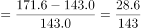；

2009年增速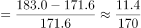；

2010年增速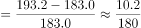。

可以看出，2008～2010年，全国茶园面积同比增速逐年持续下降。正确；

D项：定位表格材料，2018年湖南、湖北的茶园面积分别为16.89万公顷、29.93万公顷。定位图形材料，2018年全国茶园总面积为293.1万公顷。根据比重，可计算出2018年湖南、湖北的茶园面积占全国茶园总面积的，非两成以上。错误。

故正确答案为C。

---

## 材料 3

### 第 11 题　qid 2448422 · 比重

2018年中国进出口贸易总额为4.62万亿美元，其中集成电路进出口贸易额占比：

- **A**. 超过10个百分点
- **B**. 在5～10个百分点之间　✅
- **C**. 在1～5个百分点之间
- **D**. 不到1个百分点

**答案**：B

**官方解析**

根据题干所求“2018年······其中······占比”，可判定本题为现期比重问题。定位表格材料可得，2018年中国集成电路进口金额3120.6亿美元、出口金额846.4亿美元。，根据公式：，则所求比重且明显高于5%，在B项范围内。

故正确答案为B。

---

### 第 12 题　qid 2448425 · 综合

2012～2015年，中国集成电路产业累计销售额在以下哪个范围内？

- **A**. 不到1万亿元
- **B**. 在1～1.1万亿元之间
- **C**. 在1.1～1.2万亿元之间　✅
- **D**. 超过1.2万亿元

**答案**：C

**官方解析**

定位统计图可得，2013~2015年中国集成电路产业销售额分别为：2508.5亿元、3015.4亿元、3609.8亿元，2013年中国集成电路产业销售额同比增长16.2%。根据公式：，则。则2012~2015年中国集成电路产业累计销售额，在C项范围内。

故正确答案为C。

---

### 第 13 题　qid 2448434 · 增长

2013～2018年间中国集成电路产业销售额增速最高的年份，当年集成电路进口金额同比约增加：

- **A**. 

- **B**. 

- **C**. 

　✅
- **D**. 

**答案**：C

**官方解析**

根据题干所求“······当年······同比约增加”，结合选项为百分数，可判定本题为一般增长率问题。定位统计图观察折线部分可知， “2013~2018年间中国集成电路产业销售额增速最高的年份”，为2017年（）。定位表格材料可得，2017年集成电路进口金额2017年为2601.4亿美元，2016年为2270.7亿美元。根据公式：，则与C项最接近。

故正确答案为C。

---

### 第 14 题　qid 2448448 · 平均数

2018年中国平均每块集成电路出口单价比上年：

- **A**. 
下降了以上

- **B**. 
上升了以上

- **C**. 
下降了以内

- **D**. 
上升了以内
　✅

**答案**：D

**官方解析**

根据题干“2018年中国平均每块集成电路出口单价比上年”，结合选项为“”，可判定本题为平均数的增长率问题。定位表格数据可知，2017年中国集成电路出口金额为668.8亿美元，出口数量为2043.5亿块；2018年中国集成电路出口金额为846.4亿美元，出口数量为2171.0亿块。

方法一：根据公式：，，则，即上升了以内。

方法二：根据公式：，则2018年中国集成电路出口金额增长率（a），出口数量增长率（b）。根据公式：平均数的增长率，则题干所求为，即上升了30%以内，对应D项。

故正确答案为D。

---

### 第 15 题　qid 2448460 · 综合

关于中国集成电路产业销售及进出口状况，能够从上述资料中推出的是：

- **A**. 2016～2017年，月均进出口总量超过450亿块　✅
- **B**. 2016年销售额同比增量低于上年水平
- **C**. 2015～2018年，进口量和进口额均逐年上升
- **D**. 2014～2018年，出口总量超过1万亿块

**答案**：A

**官方解析**

A项：定位表格数据，2016年中国集成电路进口数量为3425.5亿块，出口数量为1810.1亿块，2017年进口数量为3770.1亿块，出口数量为2043.5亿块。代入公式：，正确；

B项：定位图形数据，2016年中国集成电路产业销售额为4335.5亿人民币；2015年销售额为3609.8亿人民币；2014年销售额为3015.4亿人民币。根据公式：，则，，即2016年销售额同比增量高于上年，错误；

C项：定位表格数据，2015年-2018年中国集成电路进口金额分别为2300.0亿美元，2270.7亿美元，2601.4亿美元，3120.6亿美元，其中2016年下降，并非逐年上升，错误；

D项：定位表格数据，2014年-2018年中国集成电路出口总量分别为1535.2亿块，1827.7亿块，1810.1亿块，2043.5亿块，2171.0亿块。，错误。

故正确答案为A。

---

## 材料 4

        2018年前三季度，S省社会物流总额35357.26亿元，同比增长，增速比上半年放缓0.7个百分点。其中，工业品物流总额16636.15亿元，同比增长，增速比上半年放缓2.1个百分点；外部流入（含进口）货物物流总额17357.31亿元，同比增长，增速比上半年加快0.8个百分点；农产品物流总额875.06亿元，同比增长，增速比上半年加快0.5个百分点；单位与居民物品物流总额457.86亿元，同比增长，增速比上半年放缓3个百分点；再生资源物流总额30.88亿元，同比下降，降幅比上半年扩大4.3个百分点。

        2018年前三季度，S省物流相关行业实现总收入1912.8亿元，同比增长。其中：运输环节收入1321.9亿元，同比增长；保管环节收入226.2亿元，同比增长；邮政业收入82.8亿元，同比增长；配送、加工、包装业收入98.8亿元，同比增长。

        2018年前三季度，S省社会物流总费用2682.1亿元，同比增长，比上半年放缓0.9个百分点。其中：物流运输环节总费用1854.6亿元，同比增长；保管环节总费用612.4亿元，同比增长；管理环节总费用214.9亿元，同比增长。

### 第 16 题　qid 2448575 · 增长

2018年前三季度，S省工业品物流总额同比增量约为同期社会物流总额同比增量的：

- **A**. 
超过

- **B**. 
之间

- **C**. 
之间

- **D**. 
不到
　✅

**答案**：D

**官方解析**

根据题干所求“2018年前三季度……约为……”，结合选项“”，可判定此题为现期比重问题。定位文字材料第一段“2018年前三季度，S省社会物流总额35357.26亿元，同比增长，……。其中，工业品物流总额16636.15亿元，同比增长”。根据，亿元，亿元，根据公式：比重，在D项范围内。

故正确答案为D。

---

### 第 17 题　qid 2448576 · 比重

在工业品物流、外部流入（含进口）货物物流、农产品物流、单位与居民物品物流和再生资源物流中，2018年前三季度物流总额占社会物流总额的比重高于上年水平的有几类？

- **A**. 4
- **B**. 3　✅
- **C**. 2
- **D**. 1

**答案**：B

**官方解析**

根据题干所求“2018年前三季度……占……比重高于上年”，可判定本题为两期比重问题。根据两期比重的结论：当部分增长率a总体增长率b时，可判定比重上升。定位文字材料第一段“2018年前三季度，S省社会物流总额35357.26亿元，同比增长。其中，工业品物流…同比增长；外部流入（含进口）货物物流…同比增长；农产品物流…同比增长；单位与居民物品物流…同比增长；再生资源物流…同比下降”。即总体增长率，其中满足“部分增长率a&gt;b（）”的有：外部流入（含进口）货物物流（）、农产品物流（）、单位与居民物品物流（），共3类。

故正确答案为B。

---

### 第 18 题　qid 2448577 · 平均数

2018年前三季度，平均每万元社会物流总额产生的物流费用比上年同期：

- **A**. 
上升了不到

- **B**. 
上升了以上

- **C**. 
下降了不到
　✅
- **D**. 
下降了以上

**答案**：C

**官方解析**

根据题干所求“2018年前三季度，平均每……比上年同期……”，结合选项为“上升下降”，可判定本题为平均数的增长率，根据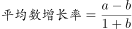，其中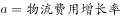，。定位文字材料第一、三段“2018年前三季度，S省社会物流总额35357.26亿元，同比增长”，“2018年前三季度，S省社会物流总费用2682.1亿元，同比增长”，代入公式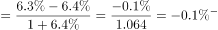，即下降了不到。

故正确答案为C。

---

### 第 19 题　qid 2448578 · 增长

将2018年前三季度S省物流相关行业不同类型的收入按照同比增量从高到低排列，以下正确的是：

- **A**. 
运输收入保管收入邮政业收入配送、加工、包装业收入
　✅
- **B**. 
运输收入配送、加工、包装业收入邮政业收入保管收入

- **C**. 
运输收入保管收入配送、加工、包装业收入邮政业收入

- **D**. 
运输收入邮政业收入配送、加工、包装业收入保管收入

**答案**：A

**官方解析**

根据题干“将2018年前三季度······同比增量从高到低排列······”，可判定本题为增长量比较问题。定位文字资料第二段：2018年前三季度，······运输环节收入1321.9亿元，同比增长；保管环节收入226.2亿元，同比增长；邮政业收入82.8亿元，同比增长；配送、加工、包装业收入98.8亿元，同比增长。观察数据可知，保管收入和配送、加工、包装业收入的增长率相同，那么现期量大的，增长量大，即保管收入的增长量＞配送、加工、包装业收入的增长量，结合选项可排除B、D项；根据公式：，则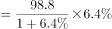；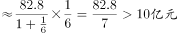，即邮政业收入的增长量配送、加工、包装业收入的增长量，排除C项。

故正确答案为A。

---

### 第 20 题　qid 2448579 · 综合

关于2018年前三季度S省物流情况，能够从上述资料中推出的是：

- **A**. 
农产品物流总额同比增长了100多亿元

- **B**. 
物流运输环节收入同比增量高于该环节费用同比增量

- **C**. 
外部流入（含进口）货物物流总额占社会物流总额的一半以上

- **D**. 
配送、加工、包装业收入占物流相关行业总收入的比重超过
　✅

**答案**：D

**官方解析**

A项：定位文字材料第一段可知，2018年前三季度，农产品物流总额875.06亿元，同比增长。根据公式：增长量=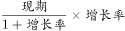，则农产品物流总额增长量=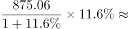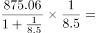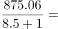亿元，错误；

B项：定位文字材料第二段和第三段可知，运输环节收入1321.9亿元，同比增长；物流运输环节总费用1854.6亿元，同比增长；根据增长量比较口诀“大大则大”可知，物流运输环节总费用现期量大，增长率大，则增长量也大，错误；

C项：定位文字材料第一段可知，2018年前三季度，S省社会物流总额35357.26亿元，外部流入（含进口）货物物流总额17357.31亿元。根据公式：比重=，则所求比重=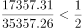，错误；

D项：定位文字材料第二段可知，2018年前三季度，S省物流相关行业实现总收入1912.8亿元，其中，配送、加工、包装业收入98.8亿元。根据公式：比重=，则所求比重=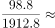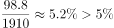，正确。

故正确答案为D。

---
