# 2020年国家公务员录用考试《行测》题（地市级网友回忆版）

> 资料分析 · 20 题 · 国考 2020

## 材料 1

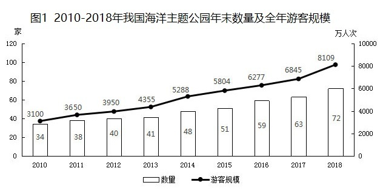

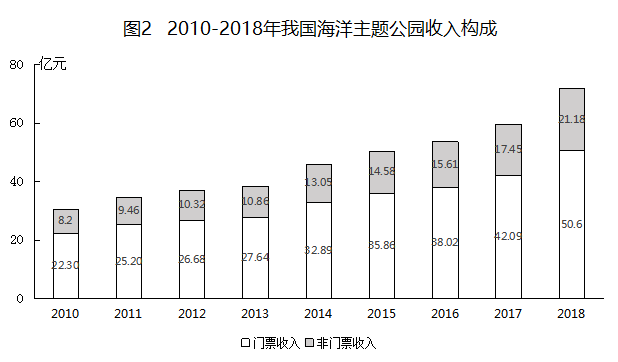

### 第 1 题　qid 2448389 · 平均数

2018年我国平均每家海洋主题公园全年游客规模比2010年：

- **A**. 减少了30万人次以上
- **B**. 增加了30万人次以上
- **C**. 减少了30万人次以内
- **D**. 增加了30万人次以内　✅

**答案**：D

**官方解析**

根据题干“2018年······平均每家······比2010年”，结合选项为增加/减少多少万人次，可判定本题为平均数的增长量问题。定位图1，可知2010年、2018年我国海洋主题公园年末数量及全年游客规模。根据公式：平均数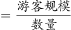，则所求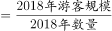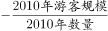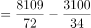，符合D选项的范围。

故正确答案为D。

---

### 第 2 题　qid 2448392 · 平均数

已知2011年初～2018年末我国所有开业的海洋主题公园都持续营业，则该期间我国平均约多长时间新开一家海洋主题公园？

- **A**. 两个半月　✅
- **B**. 两个月
- **C**. 三个半月
- **D**. 三个月

**答案**：A

**官方解析**

根据题干“2011年初~2018年末······平均约多长时间新开一家海洋主题公园”可判定本题为现期平均数问题。定位图1，2018年末主题公园数量为72，2011年初（即2010年末）主题公园数量为34，则一共新开了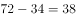家主题公园。2011年初~2018年末共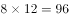个月，则所求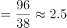月/家，即平均两个半月会开一家新的主题公园。

故正确答案为A。

---

### 第 3 题　qid 2448403 · 增长

2011～2018年间，我国海洋主题公园非门票收入同比增速超过的年份有几个？

- **A**. 5　✅
- **B**. 6
- **C**. 3
- **D**. 4

**答案**：A

**官方解析**

根据题干“2011~2018年间······同比增速超过······”可判定本题为一般增长率问题。定位图2，可知2010-2018年每年我国海洋主题公园非门票收入。根据公式：增长率，即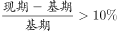，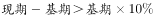，代入数据可得：

2011年：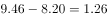，符合；

2012年：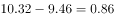，不符合；

2013年：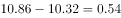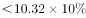，不符合；

2014年：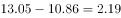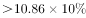，符合；

2015年：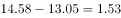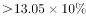，符合；

2016年：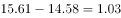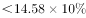，不符合；

2017年：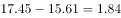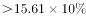，符合；

2018年：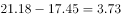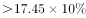，符合。

综上，符合题干条件的年份一共有5个。

故正确答案为A。

---

### 第 4 题　qid 2448407 · 平均数

2016年我国海洋主题公园平均每名游客创造的门票收入比非门票收入多约多少元？

- **A**. 42
- **B**. 48
- **C**. 30
- **D**. 36　✅

**答案**：D

**官方解析**

根据题干“2016年······平均······多约多少元”，判定本题为现期平均数问题。定位图1可知，2016年我国海洋主题公园游客规模为6277万人次，定位图2可知，2016年我国海洋主题公园门票收入和非门票收入分别为38.02亿元、15.61亿元。则题干所求为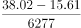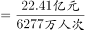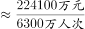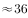元。

故正确答案为D。

---

### 第 5 题　qid 2448411 · 综合

关于我国海洋主题公园状况，能够从上述资料中推出的是：

- **A**. 2013～2017年间累计游客规模超3亿人次
- **B**. 2013年平均每家海洋主题公园的门票收入高于上年水平　✅
- **C**. 2011～2018年间，年末公园数量同比增量和游客规模同比增量最大的年份不是同一个
- **D**. 2014年海洋主题公园总收入比上年增长了8亿多元

**答案**：B

**官方解析**

A项：定位图1，可知2013-2017年我国海洋主题公园的游客规模分别为4355万人次、5288万人次、5804万人次、6277万人次、6845万人次。则2013-2017年累计游客规模为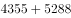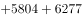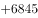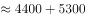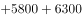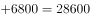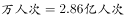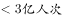，错误；

B项：定位图1，可知2013年和2012年我国海洋主题公园数量分别为41家、40家；定位图2，可知2013年和2012年我国海洋主题公园门票收入分别为27.64亿元、26.68亿元。则2013年平均每家海洋主题公园的门票收入为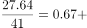，2012年为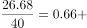，故2013年高于2012年，正确；

C项：定位图1，可知2011~2018年间，年末公园数量同比增量和游客规模同比增量最大的年份都是2018年，错误； 

D项：定位图2，可知2014年海洋主题公园的门票收入和非门票收入分别为32.89亿元、13.05亿元，2013年的门票收入和非门票收入分别为27.64亿元、10.86亿元，则2014年的总收入比2013年增长了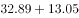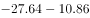，错误。

故正确答案为B。

---

## 材料 2

### 第 6 题　qid 2448422 · 比重

2018年中国进出口贸易总额为4.62万亿美元，其中集成电路进出口贸易额占比：

- **A**. 超过10个百分点
- **B**. 在5～10个百分点之间　✅
- **C**. 在1～5个百分点之间
- **D**. 不到1个百分点

**答案**：B

**官方解析**

根据题干所求“2018年······其中······占比”，可判定本题为现期比重问题。定位表格材料可得，2018年中国集成电路进口金额3120.6亿美元、出口金额846.4亿美元。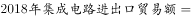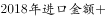，根据公式：，则所求比重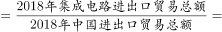且明显高于5%，在B项范围内。

故正确答案为B。

---

### 第 7 题　qid 2448425 · 综合

2012～2015年，中国集成电路产业累计销售额在以下哪个范围内？

- **A**. 不到1万亿元
- **B**. 在1～1.1万亿元之间
- **C**. 在1.1～1.2万亿元之间　✅
- **D**. 超过1.2万亿元

**答案**：C

**官方解析**

定位统计图可得，2013~2015年中国集成电路产业销售额分别为：2508.5亿元、3015.4亿元、3609.8亿元，2013年中国集成电路产业销售额同比增长16.2%。根据公式：，则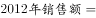。则2012~2015年中国集成电路产业累计销售额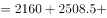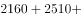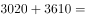，在C项范围内。

故正确答案为C。

---

### 第 8 题　qid 2448434 · 增长

2013～2018年间中国集成电路产业销售额增速最高的年份，当年集成电路进口金额同比约增加：

- **A**. 

- **B**. 

- **C**. 

　✅
- **D**. 

**答案**：C

**官方解析**

根据题干所求“······当年······同比约增加”，结合选项为百分数，可判定本题为一般增长率问题。定位统计图观察折线部分可知， “2013~2018年间中国集成电路产业销售额增速最高的年份”，为2017年（）。定位表格材料可得，2017年集成电路进口金额2017年为2601.4亿美元，2016年为2270.7亿美元。根据公式：，则与C项最接近。

故正确答案为C。

---

### 第 9 题　qid 2448448 · 平均数

2018年中国平均每块集成电路出口单价比上年：

- **A**. 
下降了以上

- **B**. 
上升了以上

- **C**. 
下降了以内

- **D**. 
上升了以内
　✅

**答案**：D

**官方解析**

根据题干“2018年中国平均每块集成电路出口单价比上年”，结合选项为“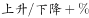”，可判定本题为平均数的增长率问题。定位表格数据可知，2017年中国集成电路出口金额为668.8亿美元，出口数量为2043.5亿块；2018年中国集成电路出口金额为846.4亿美元，出口数量为2171.0亿块。

方法一：根据公式：，，则，即上升了以内。

方法二：根据公式：，则2018年中国集成电路出口金额增长率（a），出口数量增长率（b）。根据公式：平均数的增长率，则题干所求为，即上升了30%以内，对应D项。

故正确答案为D。

---

### 第 10 题　qid 2448460 · 综合

关于中国集成电路产业销售及进出口状况，能够从上述资料中推出的是：

- **A**. 2016～2017年，月均进出口总量超过450亿块　✅
- **B**. 2016年销售额同比增量低于上年水平
- **C**. 2015～2018年，进口量和进口额均逐年上升
- **D**. 2014～2018年，出口总量超过1万亿块

**答案**：A

**官方解析**

A项：定位表格数据，2016年中国集成电路进口数量为3425.5亿块，出口数量为1810.1亿块，2017年进口数量为3770.1亿块，出口数量为2043.5亿块。代入公式：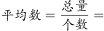，正确；

B项：定位图形数据，2016年中国集成电路产业销售额为4335.5亿人民币；2015年销售额为3609.8亿人民币；2014年销售额为3015.4亿人民币。根据公式：，则，，即2016年销售额同比增量高于上年，错误；

C项：定位表格数据，2015年-2018年中国集成电路进口金额分别为2300.0亿美元，2270.7亿美元，2601.4亿美元，3120.6亿美元，其中2016年下降，并非逐年上升，错误；

D项：定位表格数据，2014年-2018年中国集成电路出口总量分别为1535.2亿块，1827.7亿块，1810.1亿块，2043.5亿块，2171.0亿块。，错误。

故正确答案为A。

---

## 材料 3

### 第 11 题　qid 2448399 · 综合

2018年中国在线旅游收入约占旅游业总收入的：

- **A**. 

- **B**. 

- **C**. 

- **D**. 

　✅

**答案**：D

**官方解析**

根据题干“2018年······占······的”结合选项为百分数，可判定本题为现期比重问题。定位表格材料可知，2018年旅游业总收入为5.97万亿元，2018年在线旅游收入亿元万亿元。代入公式：比重。

故正确答案为D。

---

### 第 12 题　qid 2448408 · 增长

2017年中国在线旅游收入同比约增长多少万亿元？

- **A**. 0.15　✅
- **B**. 0.20
- **C**. 0.25
- **D**. 0.30

**答案**：A

**官方解析**

根据题干“2017年···同比约增长···万亿元”，可判定本题为增长量计算问题。定位表格可知，中国在线旅游收入，根据表格可得，2017年在线旅游收入；2016年在线旅游收入。代入公式：增长量。

故正确答案为A。

---

### 第 13 题　qid 2448412 · 比重

中国在线旅游收入中，2014年占中国旅游业总收入比重高于上年水平的包括：

- **A**. 仅在线交通预订
- **B**. 在线交通预订、在线住宿预订、在线度假旅游预订　✅
- **C**. 仅在线交通预订、在线住宿预订
- **D**. 仅在线交通预订、在线度假旅游预订

**答案**：B

**官方解析**

根据题干“···2014年占···比重高于上年水平的包括”可判定本题为两期比重问题。

方法一：根据两期比重结论，部分增长率大于总体增长率则比重同比上升，即高于上年水平。定位表格可知2013年、2014年中国旅游业总收入和在线旅游收入各部分的相关数据。利用公式“增长率”可得，总体增长率即中国旅游业总收入增长率；增长率即在线交通预订收入增长率；增长率即在线住宿预订收入增长率；增长率即在线度假旅游预订收入增长率。因此，满足条件的有在线交通预订，；在线住宿预订，；在线度假旅游预订，。

方法二：根据表格中2013年、2014年中国旅游业总收入和在线旅游收入各部分的相关数据，利用公式“比重”可得，2013年、2014年在线交通预订收入占中国旅游业总收入的比重分别、，，即比重高于上年水平；

2013年、2014年在线住宿预订收入占中国旅游业总收入的比重分别、，，即比重高于上年水平；

2013年、2014年在线度假旅游预订收入占中国旅游业总收入的比重分别、，则，即比重高于上年水平。

故满足条件的有在线交通预订、在线住宿预订、在线度假旅游预订。

故正确答案为B。

---

### 第 14 题　qid 2448416 · 增长

以下折线图反映了2014～2018年间哪项收入同比增量的变化趋势？

- **A**. 在线住宿预订
- **B**. 旅游业总体
- **C**. 在线度假旅游预订　✅
- **D**. 在线交通预订

**答案**：C

**官方解析**

根据题干“······同比增量的变化趋势”，可判定本题为增长量比较问题。

A项：定位表格第四列数据可得：“2013年~2018年在线住宿预订收入依次为412.10亿元、547.45亿元、862.57亿元、1251.42亿元、1586.19亿元、1881.49亿元”，根据公式：增长量=现期量-基期量，则2014-2018年在线住宿预订收入同比增量依次为2014年：547.45-412.10547-412=135亿元、2015年：862.57-547.45863-547=316亿元、2016年：1251.42-862.571251-863=388亿元；2017年：1586.19-1251.421586-1251=335亿元；2018年：1881.49-1586.191881-1586=295亿元。2017年比2015年增长量大，即折线图中第4个点应比第2个点高，与题干折线图矛盾，排除A项。

B项：定位表格第二列数据可得：“2013年~2018年旅游业总体收入依次为2.95万亿元、3.38万亿元、4.13万亿元、4.69万亿元、5.40万亿元、5.97万亿元”，则2014-2018年旅游业总体收入同比增量依次为2014年：3.38-2.95=0.43万亿元、2015年：4.13-3.38=0.75万亿元、2016年：4.69-4.13=0.56万亿元、2017年：5.40-4.69=0.71万亿元、2018年：5.97-5.40=0.57万亿元。2015年增长量最大，即折线图中第2个点应该最高，与题干折线图矛盾，排除B项。

C项：定位表格第五列数据可得：“2013年~2018年在线度假旅游预订收入依次为244.20亿元、347.58亿元、549.97亿元、757.40亿元、947.47亿元、1051.81亿元”，则2014-2018年在线度假旅游预订收入同比增量依次为2014年：347.58-244.20348-244=104亿元、2015年：549.97-347.58550-348=202亿元、2016年：757.40-549.97757-550=207亿元、2017年：947.47-757.40947-757=190亿元、2018年：1051.81-947.471052-947=105亿元。满足题干折线图趋势。

D项：定位表格第三列数据可得：“2013年~2018年在线交通预订收入依次为1519.67亿元、2271.57亿元、3325.15亿元、5385.42亿元、6389.65亿元、6820.95亿元”，则2014-2018年在线交通预订收入同比增量依次为2014年：2271.57-1519.672272-1520=752亿元、2015年：3325.15-2271.573325-2272=1053亿元、2016年：5385.42-3325.155385-3325=2060亿元、2017年：6389.65-5385.426390-5385=1005亿元、2018年：6820.95-6389.656821-6390=431亿元。2018年增长量较2014年小很多，即折线图中第5个点应比第1个点低很多，与题干折线图矛盾，排除D项。

故正确答案为C。

---

### 第 15 题　qid 2448424 · 综合

能够从上述资料中推出的是：

- **A**. 2014～2018年，中国旅游业总收入超过25万亿元
- **B**. 2014～2016年，中国旅游业总收入同比增速逐年递增
- **C**. 2016年中国在线交通预订收入同比增速快于上年水平　✅
- **D**. 如保持2018年同比增量，中国在线住宿预订收入将在2023年首超3000亿元

**答案**：C

**官方解析**

A项：定位表格第二列数据可得：“2014年~2018年旅游业总体收入依次为3.38万亿元、4.13万亿元、4.69万亿元、5.40万亿元、5.97万亿元”，故题干所求总收入，错误。

B项：根据本篇第4题计算数据可得：“2014年~2016年中国旅游业总收入增长量分别为0.43万亿元、0.75万亿元、0.56万亿元”，代入公式：增长率，则，，两者比较分子大分母小，明显，即2016年增速下降，错误。

C项：根据本篇第4题计算数据可得：“2015年、2016年中国在线交通预订收入增长量分别约为1053亿元、2060亿元”，代入公式：增长率 ，，，明显，即2016年增速快于2015年，正确。

D项：根据本篇第4题计算数据可得：“2018年中国在线住宿预订收入增长量约为295亿元”，代入公式：现期量，，年，向上取整，需要4年，故在年住宿预订收入已超过3000亿元，错误。

故正确答案为C。

---

## 材料 4

        2018年，B市新经济实现增加值10057.4亿元，比上年增长，占全市地区生产总值的比重为，比上年提高0.4个百分点。全年全市新设立的企业中，信息服务业、科技服务业企业合计达到70661家，占比为，注册资本达到7311.4亿元，同比增长。

        2018年，B市高技术产业实现增加值6976.8亿元，比上年增长，占地区生产总值的比重为，比上年提高0.2个百分点。战略性新兴产业实现增加值4893.4亿元，增长，占地区生产总值的比重为，比上年提高0.1个百分点。信息产业实现增加值4940.7亿元，增长，占地区生产总值的比重为，比上年提高0.9个百分点。

        2018年，B市高技术服务业完成投资507.8亿元，同比增长。其中，信息服务业投资增长，科技服务业投资增长。

        2018年，B市限额以上批发零售业网上零售额达到2632.9亿元，比上年增长，占全市零售额比重为，对全市零售额增长的贡献率（限额以上批发零售业网上零售额同比增量在全市零售额同比增量中占的比重）达到。限额以上住宿餐饮企业通过公共网络实现的餐费收入为124.7亿元，比上年增长，对全市餐费收入增长的贡献率达到。

        2018年，B市高新技术示范区规模以上高新技术企业实现技术收入10629.4亿元，比上年增长，占高新技术示范区规模以上高新技术企业总收入的比重为，比上年提高1.8个百分点。

### 第 16 题　qid 2448499 · 平均数

2018年B市平均每家新设立的信息服务业、科技服务业企业注册资本：

- **A**. 在1000~1100万元之间　✅
- **B**. 超过1100万元
- **C**. 不到900万元
- **D**. 在900~1000万元之间

**答案**：A

**官方解析**

由题干“2018年···平均每家···注册资本”，结合材料时间2018年，可判定本题为现期平均数计算问题。定位文字材料第一段，“全年全市新设立的企业中，信息服务业、科技服务业企业合计达到70661家，占比为，注册资本达到7311.4亿元，同比增长”。可得：，在A选项的范围。

故正确答案为A。

---

### 第 17 题　qid 2448500 · 综合

第二段中（X）处应填入的数值最可能是：

- **A**. 15.0
- **B**. 13.7
- **C**. 17.6
- **D**. 16.3　✅

**答案**：D

**官方解析**

由题干“第二段中（X）处应填入的数值最可能是”，结合材料“占地区生产总值的比重为”，可判定本题为现期比重计算问题。定位文字材料第二段，“2018年，B市高技术产业实现增加值6976.8亿元，比上年增长，占地区生产总值的比重为，比上年提高0.2个百分点。战略性新兴产业实现增加值4893.4亿元，增长，占地区生产总值的比重为，比上年提高0.1个百分点。信息产业实现增加值4940.7亿元，增长，占地区生产总值的比重为，比上年提高0.9个百分点。”。代入公式“ ”可得：2018年，B市地区生产总值亿元，代入公式“”可得：2018年，信息产业实现增加值占地区生产总值的比重，

与D项最接近。

---

### 第 18 题　qid 2448501 · 增长

2018年，B市零售额同比增长了：

- **A**. 超过600亿元
- **B**. 400~600亿元之间
- **C**. 200~400亿元之间　✅
- **D**. 不到200亿元

**答案**：C

**官方解析**

由题干“2018年，···同比增长了”，结合选项带单位“亿元”，可判定本题为增长量计算问题。定位文字材料第四段，“2018年，B市限额以上批发零售业网上零售额达到2632.9亿元，比上年增长，占全市零售额比重为，对全市零售额增长的贡献率（限额以上批发零售业网上零售额同比增量在全市零售额同比增量中占的比重）达到”。根据，可计算出限额以上批发零售业网上零售额增长量；又根据公式，可计算2018年，，在C项范围内。

故正确答案为C。

---

### 第 19 题　qid 2448503 · 综合

2018年，B市高新技术示范区规模以上高新技术企业月均收入在以下哪个范围内？

- **A**. 超过5500亿元
- **B**. 4500~5500亿元之间　✅
- **C**. 3500~4500亿元之间
- **D**. 不到3500亿元

**答案**：B

**官方解析**

由题干“2018年，···月均···”，结合材料时间2018年，可判定本题为现期平均数计算问题。定位文字材料最后一段，“2018年，B市高新技术示范区规模以上高新技术企业实现技术收入10629.4亿元，比上年增长，占高新技术示范区规模以上高新技术企业总收入的比重为，比上年提高1.8个百分点。”。根据，可得B市高新技术示范区规模以上高新技术企业月均收入亿元，在B项范围内。

故正确答案为B。

---

### 第 20 题　qid 2448504 · 综合

能够从上述资料中推出的是：

- **A**. 2018年B市地区生产总值超过35000亿元
- **B**. 2017年B市高新技术示范区规模以上高新技术企业非技术收入是技术收入的5倍多　✅
- **C**. 2018年B市战略性新兴产业增加值占新经济增加值的比重高于上年水平
- **D**. 2018年B市高技术服务业完成投资比上年增长了100亿元以上

**答案**：B

**官方解析**

A项：定位文字材料第一段，“2018年，B市新经济实现增加值10057.4亿元，比上年增长，占全市地区生产总值的比重为，比上年提高0.4个百分点。”。根据，可计算出2018年B市地区生产总值。错误；

B项：定位文字材料最后一段，“2018年，B市高新技术示范区规模以上高新技术企业实现技术收入10629.4亿元，比上年增长，占高新技术示范区规模以上高新技术企业总收入的比重为，比上年提高1.8个百分点。”。2017年，；则。由于总体量相同，可直接用比重计算。则2017年B市高新技术示范区规模以上高新技术企业非技术收入是技术收入的倍。正确；

C项：定位文字材料第一、二段，“2018年，B市新经济实现增加值10057.4亿元，比上年增长，······。2018年，······战略性新兴产业实现增加值4893.4亿元，增长，占地区生产总值的比重为，比上年提高0.1个百分点。”。根据两期比重比较的结论，战略性新兴产业增加值的增长率a（）新经济增加值的增长率b（），可判定比重低于上年水平，而非高于。错误；

D项：定位文字材料第三段，“2018年，B市高技术服务业完成投资507.8亿元，同比增长。”根据，可计算出2018年B市高技术服务业完成投资比上年增长。错误。

故正确答案为B。

---
