# 2020年山东省公务员录用考试《行测》试题（网友回忆版）

> 资料分析 · 15 题 · 山东 2020

## 材料 1

        2016年国产工业机器人销量继续增长，全年累计销售29144台，较上年增长，增速较上年提升。

        从机械结构看，2016年国产多关节机器人销量首次超过万台，为11756台，增速已连续两年超过，占国产工业机器人总销量的，比上年提高12.9个百分点。坐标机器人仍是国产工业机器人销量第一的机型，2016年销售12830台，占销售总量的比重为，比上年回落3.5个百分点，连续两年占比回落。工厂用AGV机器人销量超过2100台，同比增长。并联机器人销售增长。而SCARA机器人和圆柱坐标机器人的销售则出现超过的下降。

        从应用领域看，2016年搬运与上下料仍是国产工业机器人的首要应用领域，全年销售1.65万台，同比增长，增速放缓，占国产工业机器人销售总量的；焊接和钎焊机器人销售0.51万台，同比增长；装配与拆卸机器人销售0.37万台，同比增长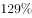。此外涂层与胶封机器人的销售也实现了的增长，特别是其中的喷漆上釉机器人销量增长了，而洁净室机器人和加工机器人的销售量均出现了同比下降。

       从应用行业看，3C行业和电气设备行业销量均超过5000台，分列第一第二位，特别是电气设备行业，同比大幅增长3倍有余。汽车行业销量同比增长；非金属矿物制品业销量同比增长。此外，在家具、服装、烟草等消费品制造行业的机器人消费量均翻番。

### 第 1 题　qid 2571789 · 增长

2016年国产工业机器人累计销售量较上年约增加了多少万台？

- **A**. 0.20
- **B**. 0.31
- **C**. 0.42　✅
- **D**. 0.53

**答案**：C

**官方解析**

根据题干“2016年······较上年约增加······万台”，可判定本题为增长量计算问题。定位文字材料第一段，“2016······，全年累计销售29144台，较上年增长”，故2016年国产工业机器人累计销售量的同比增长量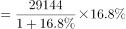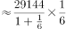台万台 。

故正确答案为C。

---

### 第 2 题　qid 2571801 · 综合

以下饼图中，最能准确反映2015年不同机械结构的国产工业机器人销量分布状况的是（白色：多关节机器人、斜线：坐标机器人、黑色：其他机器人）：

- **A**. 

- **B**. 

　✅
- **C**. 

- **D**. 

**答案**：B

**官方解析**

根据材料时间为2016年及题干“最能准确反映2015年······分布状况的是”，可判定本题为基期比重问题。定位文字材料第二段，“2016年国产多关节机器人······占国产工业机器人总销量的，比上年提高12.9个百分点。坐标机器人······占销售总量的比重为，比上年回落3.5个百分点”。可得，2015年国产多关节机器人（白色部分）占国产工业机器人总销量的比重为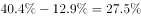，坐标机器人（斜线部分）所占比重为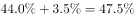，其他机器人（黑色部分）占比为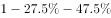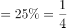，只有B项满足黑色部分占比为。

故正确答案为B。

---

### 第 3 题　qid 2571805 · 比重

2016年装配与拆卸机器人销量占国产工业机器人总销量的比重比上年约：

- **A**. 下降了2个百分点
- **B**. 下降了6个百分点
- **C**. 提升了2个百分点
- **D**. 提升了6个百分点　✅

**答案**：D

**官方解析**

根据题干“2016年······占······比重比上年······”，结合选项为百分点，可判定本题为两期比重计算问题。定位文字材料第一段，“2016年国产工业机器人······，全年累计销售29144台，较上年增长”，定位文字材料第三段，“2016年······装配与拆卸机器人销售0.37万台，同比增长”。代入公式，两期比重差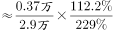，即提升了约6.5个百分点，与D项最接近。

故正确答案为D。

---

### 第 4 题　qid 2571812 · 比重

下列指标中，2015、2016连续两年均实现增长的是：
①国产多关节机器人销量
②搬运与上下料机器人销量
③圆柱坐标机器人销量
④并联机器人销量占总销量的比例

- **A**. ​①②　✅
- **B**. ​①③
- **C**. ②④
- **D**. ③④

**答案**：A

**官方解析**

①定位文字材料第二段，“······2016年国产多关节机器人销量······增速已连续两年超过······”，可得国产多关节机器人销量2015、2016连续两年均实现增长，正确；

②定位文字材料第三段，“······2016年搬运与上下料······机器人······同比增长，增速放缓······”，即2015年增长率大于，可得搬运与上下料机器人销量2015、2016连续两年均实现增长，正确；

③定位文字材料第二段，“······圆柱坐标机器人的销售则出现超过的下降”，可得2016年圆柱坐标机器人销量下降，错误；

④定位文字材料第二段，“······并联机器人销售增长······”，材料只有2016年数据，无法得知2015年并联机器人销量占总销量的比例相比2014年的变化情况，错误。

故正确答案为A。

---

### 第 5 题　qid 2571815 · 综合

关于2016年国产工业机器人销售状况，能够从上述资料中推出的是：

- **A**. 工厂用AGV机器人销量较上年增加了500多台
- **B**. 焊接和钎焊机器人销量占总销量的2成以上
- **C**. 3C、汽车行业销量占总销量比重均同比上升
- **D**. 电气设备行业销售增量超过3000台　✅

**答案**：D

**官方解析**

A项：定位文字材料第二段，工厂用AGV机器人销量超过2100台，同比增长。因此增长量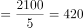台，但无法推出500多台，错误；

B项：定位文字材料第一、三段，2016年国产工业机器人······全年累计销售29144台······2016年······焊接和钎焊机器人销售0.51万台，可得焊接和钎焊机器人销量占总销量的比重为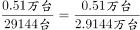，不到两成，错误；

C项：定位文字材料第一、四段，“国产工业机器人······较上年增长······3C行业和电气设备······特别是电气设备行业，同比大幅增长3倍有余”。未给出3C行业增长量（率）或者2015年销量相关的数据，故无法判定其占比变化，错误；

D项：定位文字材料第四段，“电气设备行业销量均超过5000台······特别是电气设备行业，同比大幅增长3倍有余”，可得电气设备行业销售增量台，超过3000台，正确。

故正确答案为D。

---

## 材料 2

        截至2017年底，我国共有30个省（区、市）投产了747个生物质发电项目，并网装机容量1476.2万千瓦（不含自备电厂），年发电量794.5亿千瓦时。其中农林生物质发电项目271个，累计并网装机700.9万千瓦，年发电量397.3亿千瓦时；生活垃圾焚烧发电项目339个，累计并网装机725.3万千瓦，年发电量375.2亿千瓦时；沼气发电项目137个，累计并网装机50.0万千瓦，年发电量22.0亿千瓦时。

        2017年，全国生物质发电替代化石能源约2500万吨标煤，减排二氧化碳约6500万吨，农林生物质发电共计处理农林废弃物约5400万吨；垃圾焚烧发电共计处理城镇生活垃圾约10600万吨，约占全国垃圾清运量的。

### 第 6 题　qid 2571717 · 增长

2011～2017年间，我国生物质发电年末装机容量同比增速最快的年份是：

- **A**. 2011年　✅
- **B**. 2013年
- **C**. 2014年
- **D**. 2017年

**答案**：A

**官方解析**

根据题干所求“······同比增速最快的年份是”，可判定本题为一般增长率比较问题。定位图形材料可知每一年的现期值和基期值，根据公式：增长率，代入公式可得：2011年：；2013年：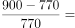；2014年：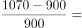；2017年：。

故正确答案为A。

---

### 第 7 题　qid 2571719 · 综合

“十二五”（2011～2015年）期间，我国生物质发电总量在以下哪个范围内？

- **A**. 小于1700亿千瓦时
- **B**. 1700～2000亿千瓦时　✅
- **C**. 2000～2300亿千瓦时
- **D**. 大于2300亿千瓦时

**答案**：B

**官方解析**

定位图形材料可知“十二五”（2011-2015年）期间我国生物质发电量分别为315、315、383、417、519亿千瓦时，相加为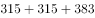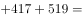亿千瓦时，即在1700～2000亿千瓦时之间。

故正确答案为B。

---

### 第 8 题　qid 2571721 · 平均数

2017年平均每个农林生物质发电项目的年发电量约是沼气发电项目的多少倍？

- **A**. 3
- **B**. 5
- **C**. 9　✅
- **D**. 17

**答案**：C

**官方解析**

根据题干“2017年······是······多少倍”，结合材料中时间为2017年，可判定本题为现期倍数问题。定位文字材料第一段，其中农林生物质发电项目271个，年发电量397.3亿千瓦时；沼气发电项目137个，年发电量22.0亿千瓦时，代入平均数计算公式：平均数。每个农林生物质发电项目的年发电量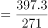；每个沼气发电项目的年发电量，所求倍数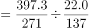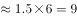。

故正确答案为C。

---

### 第 9 题　qid 2571725 · 比重

以下饼图中，能准确反映2017年末我国农林生物质发电项目（斜线）、生活垃圾焚烧发电项目（白色）和沼气发电项目（黑色）装机容量占全国生物质发电装机容量比重的是：

- **A**. 

　✅
- **B**. 
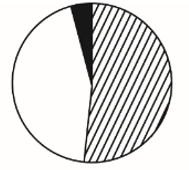

- **C**. 

- **D**. 

**答案**：A

**官方解析**

根据题干“以下饼图中，能准确反映2017年······占······比重的是”，结合材料中时间为2017年，可判定本题为现期比重问题。定位文字材料第一段，截至2017年底，我国共有30个省（区、市）投产了747个生物质发电项目，并网装机容量1476.2万千瓦（不含自备电厂）。其中农林生物质发电项目271个，累计并网装机700.9万千瓦；生活垃圾焚烧发电项目339个，累计并网装机725.3万千瓦；沼气发电项目137个，累计并网装机50.0万千瓦。因此，农林生物质发电项目装机容量比重为，观察图形，可排除B、D两项，同时生活垃圾焚烧发电项目装机容量大于农林生物质发电项目，故其占比也大于农林生物质发电项目，观察图形，可排除C项。

故正确答案为A。

---

### 第 10 题　qid 2571728 · 综合

关于全国生物质发电状况，能够从上述资料中推出的是：

- **A**. 2017年全国垃圾清运量超过3亿吨
- **B**. 如用化石能源发电，每吨标煤会产生3吨以上的二氧化碳排放
- **C**. 2017年末我国生物质发电每万千瓦并网装机容量全年发电量在5000到10000千瓦时之间
- **D**. 如保持2017年同比增量不变，“十三五”（2016～2020年）生物质发电总量将超过4500亿千瓦时　✅

**答案**：D

**官方解析**

A项：定位文字材料第二段，垃圾焚烧发电共计处理城镇生活垃圾约10600万吨，约占全国垃圾清运量的，则2017年全国垃圾清运量为万吨3亿吨，错误；

B项：定位文字材料第二段，2017年，全国生物质发电替代化石能源约2500万吨标煤，减排二氧化碳约6500万吨，则每吨标煤所产生的二氧化碳排放为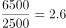吨3吨，错误；

C项：定位文字材料第一段，截至2017年底，我国共有30个省（区、市）投产了747个生物质发电项目，并网装机容量1476.2万千瓦（不含自备电厂），年发电量794.5亿千瓦时。则每万千瓦并网装机容量全年发电量为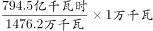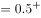亿千瓦时，不在5000-10000千瓦时之间，错误；

D项：定位图形材料，2016年生物质发电量为634亿千瓦时，2017年生物质发电量为795亿千瓦时，2017年生物质发电量增量为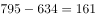亿千瓦时。因此，在保持2017年同比增量不变的情况下，2018年发电量为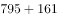亿千瓦时，2019年发电量为亿千瓦时，2020年发电量为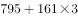亿千瓦时；2016～2020年发电总量为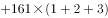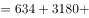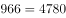亿千瓦时4500亿千瓦时，正确。

故正确答案为D。

---

## 材料 3

        2017年全国海洋生产总值77611亿元，比上年增长，海洋生产总值占国内生产总值的。

        2017年，J省海洋生产总值为7217亿元，比上年增长，海洋生产总值占地区生产总值的，2017年，全省沿海沿江港口完成货物吞吐量20.4亿吨，同比增长；集装箱吞吐量1698.8万标箱，同比增长。

        2017年，J省造船完工量为1412.4万载重吨，同比下降；新承订单量为1393.4万载重吨，同比增长；手持订单量为3662.3万载重吨，同比下降，分别占全国份额的、和。

        2017年，J省沿海三市接待国内游客10558.01万人次，同比增长；接待入境过夜旅游者27.65万人次，同比增长。

        2017年，J省实现海水养殖产量93.1万吨，同比增长；海洋捕捞产量53万吨，同比下降；远洋渔业产量2.9万吨，同比增长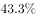。

        2017年，J省海工装备产值同比增长。全省沿海地区风电装机容量达到589.7万千瓦，同比增长；海上风电装机容量达到162.5万千瓦，同比增长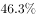。2017年，全省完成海水淡化产量1.31万吨，同比增长。

### 第 11 题　qid 2571729 · 增长

2017年J省海洋生产总值同比每增长1个百分点，当年其海洋生产总值约增加：

- **A**. 66亿元　✅
- **B**. 72亿元
- **C**. 726亿元
- **D**. 776亿元

**答案**：A

**官方解析**

方法一：根据题干“2017年······约增加”，结合选项带单位，可判定本题为增长量计算问题。定位材料第二段，“2017年，J省海洋生产总值为7217亿元，比上年增长”，则2016年J省海洋生产总值亿元。故2017年J省海洋生产总值同比每增长1个百分点，当年其海洋生产总值约增加亿元，与A项最接近。

方法二：2017年J省海洋生产总值的增长量为亿元。即增长9.2个百分点对应的增长量为600亿元，则每增长1个百分点，当年其海洋生产总值约增加亿元，与A项最接近。

故正确答案为A。

---

### 第 12 题　qid 2571732 · 比重

2017年J省海洋生产总值占全国的比重比上年：

- **A**. 上升了约0.2个百分点　✅
- **B**. 上升了约2个百分点
- **C**. 下降了约0.2个百分点
- **D**. 下降了约2个百分点

**答案**：A

**官方解析**

根据题干中“2017年······占······比重比上年”，可以判定本题为两期比重问题。定位文字材料第一段和第二段，“2017年全国海洋生产总值77611亿元，比上年增长”，“2017年，J省海洋生产总值为7217亿元，比上年增长”。代入公式，两期比重差，即上升了约0.19个百分点，与A项最接近。

故正确答案为A。

---

### 第 13 题　qid 2571737 · 增长

2017年J省海洋经济中，以下产业增速由高到低排序正确的是：

- **A**. 沿海沿江港口完成货物吞吐量、造船业新承订单量、海上风电装机容量
- **B**. 海上风电装机容量、沿海沿江港口完成货物吞吐量、沿海三市接待国内游客数量
- **C**. 海水养殖产量、海上风电装机容量、远洋渔业产量
- **D**. 海上风电装机容量、远洋渔业产量、沿海沿江港口完成货物吞吐量　✅

**答案**：D

**官方解析**

定位文字材料可得，沿海沿江港口完成货物吞吐量增速造船业新承订单量增速，A项错误；沿海沿江港口完成货物吞吐量增速沿海三市接待国内游客数量增速，B项错误；海水养殖产量增速海上风电装机容量增速，C项错误；海上风电装机容量增速远洋渔业产量增速沿海沿江港口完成货物吞吐量增速，D项正确。

故正确答案为D。

---

### 第 14 题　qid 2571742 · 综合

2016年J省海水养殖产量约为海洋捕捞产量的：

- **A**. 0.6倍
- **B**. 0.8倍
- **C**. 1.6倍　✅
- **D**. 1.8倍

**答案**：C

**官方解析**

根据题干“2016年······约为······的”，且选项为倍数，结合材料时间2017年，可判定本题为基期倍数问题。定位文字材料第五段，“2017年，J省实现海水养殖产量93.1万吨，同比增长；海洋捕捞产量53万吨，同比下降”，则2016年J省海水养殖产量约为海洋捕捞产量的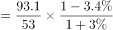倍。

故正确答案为C。

---

### 第 15 题　qid 2571746 · 综合

下列选项中，能够从上述资料中推出的是：

- **A**. 2016年，J省造船工业新承订单量高于其造船完工量
- **B**. 2017年，J省海上风电装机容量占沿海地区风电装机容量的比重高于上年水平　✅
- **C**. 2017年，J省沿海三市平均每天接待入境过夜旅游者近0.8万人次
- **D**. 2017年，J省沿海沿江港口完成集装箱吞吐量较上年增长了100多万标箱

**答案**：B

**官方解析**

A项：定位材料第三段，“2017年，J省造船完工量为1412.4万载重吨，同比下降；新承订单量为1393.4万载重吨，同比增长”，则2016年J省造船完工量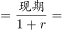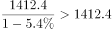，2016年新承订单量，故2016年新承订单量低于其造船完工量，错误；

B项：定位材料最后一段，“2017年······全省沿海地区风电装机容量······同比增长；海上风电装机容量······同比增长”，即部分增长率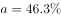，总体增长率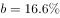，则。根据两期比重结论，当部分增长率总体增长率时，可判定比重上升，正确；

C项：定位材料第四段，“2017年，J省沿海三市······接待入境过夜旅游者27.65万人次，同比增长”，则2017年J省沿海三市平均每天接待入境过夜旅游者为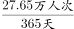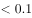万人次，错误；

D项：定位材料第二段，“2017年，全省沿海沿江港口完成······集装箱吞吐量1698.8万标箱，同比增长”，则2017年J省沿海沿江港口完成集装箱吞吐量较上年的增长量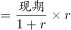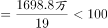万，错误。

故正确答案为B。

---
