# 2020年广东省公务员录用考试《行测》试题（乡镇卷）（网友回忆版）

> 资料分析 · 15 题 · 广东 2020

## 材料 1

        近年来，我国大力推动农村互联网建设，目前已初步建成融合、泛在、安全、绿色的宽带网络环境，基本实现“城市光纤到楼到户，农村宽带进乡入村”。2019年，我国已建成全球最大规模光纤和移动通信网络，行政村通光纤和4G比例均超过。调查显示，截至2020年3月，我国网民规模为9.04亿人，其中农村网民规模为2.55亿人，较2018年12月增长，城镇网民规模为6.49亿人，占网民整体的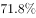，较2018年12月增长4200万。

        我国农村地区互联网普及率为，较2018年12月提升7.8个百分点，其余年份详情如下： 

### 第 1 题　qid 2604234 · 综合

2020年3月，农村网民规模约占我国网民整体的（    ）。

- **A**. 

- **B**. 

- **C**. 

　✅
- **D**. 

**答案**：C

**官方解析**

方法一：根据题干“2020年3月，······约占······的”，结合选项为百分数，可判定本题为现期比重计算问题。定位文字材料第一段可得，截至2020年3月，我国网民规模为9.04亿人，其中农村网民规模为2.55亿人，则所求比重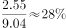，与C项最接近。

方法二：定位文字材料第一段可得，截至2020年3月，······城镇网民规模为6.49亿人，占网民整体的。则农村网民规模所占比重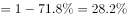。

故正确答案为C。

---

### 第 2 题　qid 2604236 · 增长

如果按照2018年12月到2020年3月的城镇网民规模月均增长量估算，2020年12月，城镇网民规模约为（    ）亿人。

- **A**. 6.49
- **B**. 6.74　✅
- **C**. 6.99
- **D**. 7.24

**答案**：B

**官方解析**

根据题干“如果按照······月均增长量估算，2020年12月······约为（    ）亿人”，可判定本题为现期计算问题。定位文字材料第一段可得，截至2020年3月，我国城镇网民规模为6.49亿人，······较2018年12月增长4200万。2020年3月与2018年12月的月份差为15个月，到2020年12月还有9个月，则所求现期量为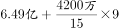亿人，与B项最接近。

故正确答案为B。

---

### 第 3 题　qid 2604241 · 增长

与2011年12月相比，2020年3月农村网民规模增长了约（     ）。

- **A**. 

- **B**. 
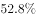

- **C**. 
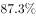
　✅
- **D**. 
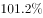

**答案**：C

**官方解析**

根据题干“与2011年12月相比，2020年3月农村网民规模增长了约”，结合选项为百分数，可判定本题为一般增长率计算问题。定位统计图查找可得，2020年3月农村网民规模为2.55亿人，2012年12月农村网民规模为1.56亿人，同比增长。则2011年12月农村网民规模为亿人，与2011年12月相比，2020年3月农村网民规模增长了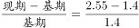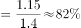，与C项最接近。

故正确答案为C。

---

### 第 4 题　qid 2604246 · 综合

下列选项中，城镇地区互联网普及率与农村相差最大的是（    ）。

- **A**. 2015年
- **B**. 2016年
- **C**. 2017年
- **D**. 2018年　✅

**答案**：D

**官方解析**

定位折线图可得：2015-2018年城镇地区互联网普及率分别为、、、，农村地区互联网普及率分别为、、、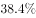。则城镇地区互联网普及率与农村地区互联网普及率相差：2015年：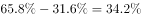，2016年：，2017年：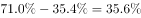，2018年：，即相差最大的为2018年，相差36.2个百分点。

故正确答案为D。

---

### 第 5 题　qid 2604254 · 综合

根据以上资料，下列说法正确的是（    ）。

- **A**. 
截至2020年3月，农村人口约为7亿

- **B**. 
2019年农村网民规模同比增长率约为

- **C**. 
2013-2018年，我国城镇地区互联网普及率的增幅逐年提升

- **D**. 
2013-2018年，我国农村网民规模每年均较上一年有所增长
　✅

**答案**：D

**官方解析**

A项：定位文字材料第一段可知：截至2020年3月，农村网民规模为2.55亿人；定位文字材料第二段可知：我国农村地区互联网普及率为，根据公式：，则农村人口约为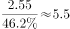亿，错误；

B项：材料所给信息为2020年3月与2018年12月的相关数据，信息不全，无法求出2019年农村网民规模的同比增长率，错误；

C项：定位折线图可知，2016年城镇地区互联网普及率的增幅，即增长3.3个百分点；2017年城镇地区互联网普及率的增幅，即增长1.9个百分点，故2017年城镇地区互联网普及率的增幅小于2016年的，错误；

D项：定位柱状图可得：2012-2018年我国农村网民规模分别为1.56、1.77、1.78、1.95、2.01、2.09、2.22亿人，每年均较上一年有所增长，正确。

故正确答案为D。

---

## 材料 2

        2019年我国农民工规模继续扩大，总量达到29077万人，同比增长。其中，本地农民工11652万人，比上年增加82万人；外出农民工17425万人，比上年增加159万人。外出农民工中，在省内就业的农民工9917万人，比上年增加245万人；跨省流动农民工7508万人，比上年减少86万人。

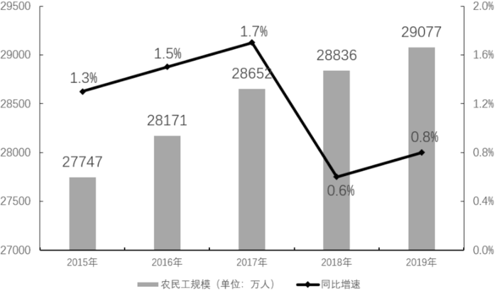

        从收入看，农民工集中就业的六大行业月均收入均稳定增长。2019年农民工月均收入约4000元；其中外出农民工月均收入4427元，比上年增加320元；本地农民工月均收入3500元，比上年增加160元。分区域看，在东部地区就业的农民工月均收入4222元，比上年增长；在中部地区就业的农民工月均收入3794元，比上年增长；在西部地区就业的农民工月均收入3723元，比上年增长；在东北地区就业的农民工月均收入3469元，同比增长。

### 第 6 题　qid 2604282 · 增长

2014-2019年，我国农民工规模增加了约（    ）。

- **A**. 

- **B**. 

- **C**. 

　✅
- **D**. 

**答案**：C

**官方解析**

根据题干“2014-2019年，······增加了约”，结合选项为百分数，可判定本题为增长率计算问题。定位柱状图，2015年我国农民工总量为27747万人，同比增长，2019年为29077万人，则2014年我国农民工总量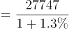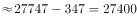万人。则2019年相对于2014年的增长率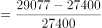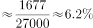。

故正确答案为C。

---

### 第 7 题　qid 2604291 · 综合

2018年，省内就业农民工的数量约占外出农民工的（    ）。

- **A**. 

- **B**. 

- **C**. 

　✅
- **D**. 

**答案**：C

**官方解析**

根据题干“2018年，······占······的”，结合材料时间为2019年，可判定本题为基期比重问题。定位文字材料第一段，2019年外出农民工17425万人，比上年增加159万人。外出农民工中，在省内就业的农民工9917万人，比上年增加245万人。则2018年省内就业农民工的数量约占外出农民工的比重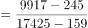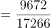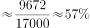，与C项最接近。

故正确答案为C。

---

### 第 8 题　qid 2604294 · 增长

2019年，下列行业中农民工月均收入同比增加最多的是（    ）。

- **A**. 制造业
- **B**. 建筑业　✅
- **C**. 批发和零售业
- **D**. 交通运输仓储邮政业

**答案**：B

**官方解析**

根据题干“2019年，······增加最多的是”，可判定本题为增长量比较问题。定位表格，根据公式：增长量可得，2019年，选项各行业中农民工月均收入同比增量分别为：

A项：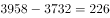元；

B项：元；

C项：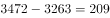元；

D项：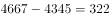元。

对比可得，B项建筑业增加最多。

故正确答案为B。

---

### 第 9 题　qid 2604298 · 综合

2018年，我国农民工在各区域的月均收入从高到低是（    ）。

- **A**. 
西部地区中部地区东北地区东部地区

- **B**. 
中部地区东部地区东北地区西部地区

- **C**. 
东部地区西部地区东北地区中部地区

- **D**. 
东部地区中部地区西部地区东北地区
　✅

**答案**：D

**官方解析**

根据文字材料第二段可得，2019年，东部地区就业的农民工月均收入4222元，同比增长；中部地区就业的农民工月均收入3794元，同比增长；西部地区就业的农民工月均收入3723元，同比增长；东北地区就业的农民工月均收入3469元，同比增长。则2018年，各区域农民工的月均收入分别为：

东部地区：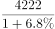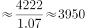元；

中部地区：元；

西部地区：元；

东北地区：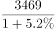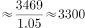元。

则从高到低是：东部地区中部地区西部地区东北地区，D项满足题干要求。

故正确答案为D。

---

### 第 10 题　qid 2604301 · 综合

根据以上资料，下面说法不正确的是（    ）。

- **A**. 2018年农民工月均收入达4100元　✅
- **B**. 2019年，不同行业的农民工的年收入差距可能在1.2万元以上
- **C**. 2019年，外出农民工月均收入同比增速高于本地农民工
- **D**. 2015-2019年间，农民工规模同比增速最小的是2018年

**答案**：A

**官方解析**

A项：根据文字材料第二段，2019年农民工月均收入约4000元；其中外出农民工月均收入同比增加320元；本地农民工月均收入同比增加160元。则2019年农民工月均收入同比有所增加，2018年农民工月均收入应不到4000元，错误；

B项：根据表格材料可得，2019年，交通运输仓储邮政业的农民工月均收入为4667元，住宿餐饮业的农民工月均收入为3289元，二者月均收入差值为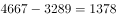元，年收入差值为元，差距超过1.2万元，正确；

C项：根据文字材料第二段可得，2019年，外出农民工月均收入4427元，同比增加320元；本地农民工月均收入3500元，同比增加160元。外出农民工月均收入同比增长；本地农民工月均收入同比增长，前者高于后者，正确；

D项：定位图形材料可得，2015-2019年，农民工规模同比增速依次为、、、、，同比增速最小的是2018年，正确。

本题为选非题，故正确答案为A。

---

## 材料 3

        2019年全国农村网络零售额从2014年的1800亿元增加至逾1.7万亿元，占全国网络零售总额的，较上年略有提升；同比增长，高于全国网络零售总额增长率2.6个百分点。

        分地区看，东、中、西部和东北地区农村网络零售额分别占全国农村网络零售额的、、和，同比增长分别为、、和。

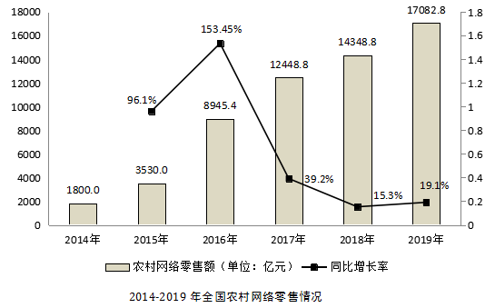

        2019年，电子商务进农村综合示范工作聚焦脱贫攻坚和乡村振兴，取得了阶段性成果。全国832个贫困县实现网络零售额1489.9亿元，同比增长，全国农产品网络零售额高达3975亿元，同比增长，其中，水果、肉禽蛋、奶类同比增速排名前三，分别为、和，生鲜农产品网络零售额持续高速增长，潜力不断释放。

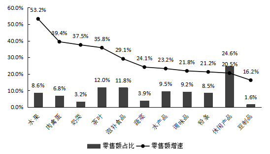

### 第 11 题　qid 2604273 · 平均数

2014-2019年间，全国农村网络零售额平均每年增长约（    ）亿元。

- **A**. 2183.3
- **B**. 2547.1
- **C**. 3056.6　✅
- **D**. 3820.7

**答案**：C

**官方解析**

根据题干“2014-2019年间，全国农村网络零售额平均每年增长约······亿元”，可判定本题为年均增长量计算问题。定位第一个图形材料可得：2014年，全国农村网络零售额为1800亿元；2019年，全国农村网络零售额为17082.8亿元，代入公式：年均增长量，则2014-2019年间，全国农村网络零售额的年均增长量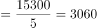亿元，C项最为接近。

故正确答案为C。

---

### 第 12 题　qid 2604285 · 比重

2018年，东、中、西部和东北地区农村网络零售额占全国农村网络零售额的比重分别为（    ）。

- **A**. 
，，，
　✅
- **B**. 
，，，

- **C**. 
，，，

- **D**. 
无法判断

**答案**：A

**官方解析**

根据题干“2018年，东、中、西部和东北地区······占······比重分别为”，结合资料提供了2019年各地区的比重，可判定本题为基期比重计算问题。定位文字材料第一段“2019年全国农村网络零售额······同比增长”、第二段“分地区看，东、中、西部和东北地区农村网络零售额分别占全国农村网络零售额的、，和，同比增长分别为，，和”。根据两期比重结论可知：2019年东部地区农村网络零售额的增长速度（）全国农村网络零售额的增长速度（），则2019年东部占比（）2018年东部占比，即2018年东部占比，观察选项，只有A项符合要求。

故正确答案为A。

---

### 第 13 题　qid 2604296 · 增长

2019年，全国农产品网络零售额同比增长率较全国网络零售总额同比增长率高约（    ）个百分点。

- **A**. 7.9
- **B**. 10.5　✅
- **C**. 11.9
- **D**. 13.5

**答案**：B

**官方解析**

定位文字材料第三段“2019年······全国农产品网络零售额······同比增长”、第一段“2019年全国农村网络零售额······同比增长，高于全国网络零售总额增长率2.6个百分点”，可知2019年，全国农产品网络零售额同比增长率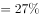，全国网络零售总额同比增长率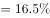，则2019年，全国农产品网络零售额同比增长率较全国网络零售总额同比增长率高约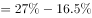个百分点。

故正确答案为B。

---

### 第 14 题　qid 2604299 · 综合

2019年全国各类农产品中，网络零售额排名前三的农产品零售额合计约为（    ）亿元。

- **A**. 277.1
- **B**. 739.4
- **C**. 1073.3
- **D**. 1935.8　✅

**答案**：D

**官方解析**

根据“2019年全国各类农产品中······合计约为······”，结合资料统计图中给定占比，可判定本题为现期比重问题。定位第二个图形材料，由于总体值一定，占比越高，则零售额越高，因此网络零售额排名前三的农产品分别为休闲产品、茶叶、滋补食品，对应零售额占比分别为、、。定位文字材料第三段，可知2019年全国农产品网络零售额为3975亿元。根据公式，，则2019年全国各类农产品中，网络零售额排名前三的农产品零售额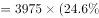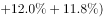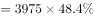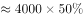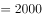亿元，D项最为接近。

故正确答案为D。

---

### 第 15 题　qid 2604302 · 综合

根据以上资料，下列说法正确的是（    ）。

- **A**. 
2014-2019年，农村网络零售额增长了10倍

- **B**. 
2019年，平均每个贫困县网络零售额超2亿元

- **C**. 
2018年，全国农村网络零售额约占全国网络零售总额的

- **D**. 
2019年水产品占全国农产品网络零售额的比重较2018年有所下降
　✅

**答案**：D

**官方解析**

A项：定位第一个图形材料可知，2014年全国农村网络零售额为1800亿元，2019年为17082.8亿元。根据公式，增长率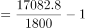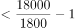，因此增长了不到9倍，错误；

B项：定位文字材料第三段，2019年全国832个贫困县实现网络零售额1489.9亿元，则平均每个贫困县网络零售额为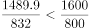亿元，错误；

C项：定位文字材料第一段，2019年全国农村网络零售额从2014年的1800亿元增加至逾1.7万亿元，占全国网络零售总额的，较上年略有提升，可知2018年占比低于，不到，错误；

D项：定位文字材料第三段，2019年全国农产品网络零售额高达3975亿元，同比增长，定位第二个图形材料，2019年全国水产品网络零售额同比增速为，根据两期比重结论：部分增长率（）总体增长率（），则2019年水产品占全国农产品网络零售额的比重较2018年有所下降，正确。

故正确答案为D。 

---
