# 2020年广东省公务员录用考试《行测》试题（县级卷）（网友回忆版）

> 资料分析 · 15 题 · 广东 2020

## 材料 1

        社会保险包括了养老保险，工伤保险，医疗生育保险等，是社会保障体系的重要组成部分。其在整个社会保障体系中居于核心地位，社会保险是一种缴费型的社会保障，资金主要由用人单位和劳动者缴纳（一般而言，各类社会保险的缴纳费用缴费基数缴纳比例），政府财政给予补贴并承担最终责任。

        在经历了一段时间的摸索后，我国的社会保障制度在上世纪90年代进入了创新式的改革、发展时期。1995年3月1日，国务院发出《关于深化企业职工养老保险制度改革的通知》，确定了社会统筹与个人账户相结合的养老保险制度，职工基本养老保险制度在全国范围内正式实行统账结合模式。

        近年来，随着我国经济发展出现一系列新形式新情况，企业对进一步降低社保费率的呼声较强，党中央、国务院提出新的要求。2019年《政府工作报告》明确提出，各地可将养老保险单位缴费比例降至。2019年，B市率先降低养老保险单位缴费比例。预计今后每年可减轻该市企业社保费缴费负担超百亿元。

### 第 1 题　qid 2696535 · 平均数

一般来说，社保管理部门会根据当地上一年社会平均工资来确定当年的社保缴费基数上限，两者比值相对固定。下列选项中，B市这一比值与其他年份差别最大的是（    ）。

- **A**. 1999年　✅
- **B**. 2004年
- **C**. 2014年
- **D**. 2019年

**答案**：A

**官方解析**

根据题干“······B市这一比值与其他年份差别最大的是”，可判定本题为比值比较问题。定位表格可知，B市历年的社会平均工资和社保缴费基数上限，则各选项两者比值如下：1999年：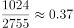，2004年：，2014年：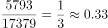，2019年：。因此B市这一比值与其他年份差别最大的是1999年。

故正确答案为A。

【备注】本题对于题干的理解存在争议点：比值比较的年份是仅选项涉及的四个年份进行比较，还是与表中所有年份进行比较。小粉笔根据题干中“下列选项中······”，倾向于按照选项四个年份进行比较。

---

### 第 2 题　qid 2696550 · 比重

根据行业的风险性质不同，工伤保险缴费的比例也不同。假如B市某企业所属行业类别的工伤保险缴费比例一直为（职工个人不缴纳工伤保险费用），在按照工伤基数下限为其员工缴纳工伤保险的情况下，2019年每名员工缴纳的工伤保险金额约为10年前的（    ）倍。

- **A**. 1.46
- **B**. 2.27
- **C**. 3.41　✅
- **D**. 4.23

**答案**：C

**官方解析**

根据题干“······2019年······约为10年前······倍”，可判定本题为现期倍数问题。定位表格可知，B市2009年工伤基数下限为1490元/月，2019年工伤基数下限为5080元/月；由题干可知，工伤保险缴费比例一直为。根据文字材料第一段：各类社会保险的缴纳费用缴费基数缴纳比例，可得2019年每名员工缴纳的工伤保险金额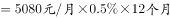，2009年每名员工缴纳的工伤保险金额，因此题干所求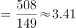倍。

故正确答案为C。

---

### 第 3 题　qid 2696552 · 平均数

在B市某企业工作的小王，2019年月平均工资为10161元，如果该企业将养老保险缴费基数下限调整为小王的实际月平均工资，则该企业全年将增加支出约（    ）元。

- **A**. 1084
- **B**. 5058
- **C**. 9032
- **D**. 13006　✅

**答案**：D

**官方解析**

根据题干“······全年将增加支出约······元”，可判定本题为增长量计算问题。定位表格可知，B市2019年养老基数下限为3387元/月，单位缴纳比例为。根据公式：增长量现期量基期量，因此该企业全年将增加支出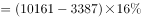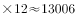元。

故正确答案为D。

---

### 第 4 题　qid 2696566 · 增长

以下最有可能符合B市1998-2018年社会平均工资增长率变化情况的曲线是（    ）。

- **A**. 
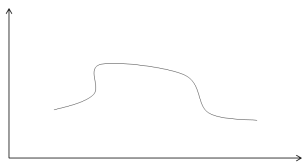

- **B**. 

　✅
- **C**. 
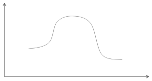

- **D**. 
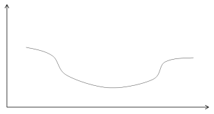

**答案**：B

**官方解析**

根据题干“······1998-2018年······社会平均工资增长率变化情况······”，可判定本题为一般增长率比较问题。定位表格可知，B市1993年、1998年、2003年、2008年、2013年、2018年的社会平均工资分别为377元/月、1024元/月、2004元/月、3726元/月、5793元/月、8467元/月。因为倍数关系明显，只需要比较即可。因此1993~1998年：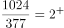，1998-2003年：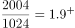，2003-2008年：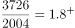，2008-2013年：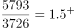，2013-2018年：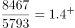，即1998-2018年社会平均工资增长率呈逐渐下降的趋势，对比选项各曲线，只有B项符合。

故正确答案为B。

（备注：本篇第一题提到“社保管理部门会根据当地上一年社会平均工资来确定当年的社保缴费基数上限”，因此表格中的社会平均工资应该对应上一年的数值）

---

### 第 5 题　qid 2696567 · 综合

如果B市社保缴费基数，每5年调整一次，则根据上述资料，以下说法正确的是（    ）。

- **A**. 1994-2019年，B市城镇人员养老保险缴纳基数下限与上年社会平均工资的比值逐渐缩小
- **B**. 1994-2019年，B市城镇人员养老保险的企业缴纳比例和个人缴纳比例逐渐降低
- **C**. 2004-2019年，B市城镇人员的工伤和医疗生育保险缴纳基数下限始终不低于养老基数下限　✅
- **D**. 2009-2019年，B市城镇人员与农业户口人员的各项保险缴纳差距逐渐缩小

**答案**：C

**官方解析**

A项：定位表格可知，历年B市城镇人员养老保险缴纳基数下限与上年社会平均工资，则两者比值如下：1994年：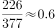，1999年：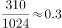，2004年：，2009年：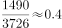，2009年的比值2004年，并非逐渐缩小，错误；

B项：定位表格可知，B市城镇人员养老保险的个人缴纳比例1994年为，1999年为，增加了，并非逐渐降低，错误；

C项：定位表格可知，2004-2019年B市城镇人员的养老、工伤和医疗生育保险缴纳基数下限，2004年：元/月，2009年：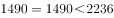元/月，2014年：元/月，2019年：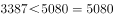元/月，即工伤和医疗生育保险缴纳基数下限始终不低于养老基数下限，正确；

D项：材料中未提及农业户口人员的各项保险缴纳情况，无法推出，错误。

故正确答案为C。

---

## 材料 2

        2019年我国农民工规模继续扩大，总量达到29077万人，同比增长。其中，本地农民工11652万人，比上年增加82万人；外出农民工17425万人，比上年增加159万人。外出农民工中，在省内就业的农民工9917万人，比上年增加245万人；跨省流动农民工7508万人，比上年减少86万人。

        从收入看，农民工集中就业的六大行业月均收入均稳定增长。2019年农民工月均收入约4000元；其中外出农民工月均收入4427元，比上年增加320元；本地农民工月均收入3500元，比上年增加160元。分区域看，在东部地区就业的农民工月均收入4222元，比上年增长；在中部地区就业的农民工月均收入3794元，比上年增长；在西部地区就业的农民工月均收入3723元，比上年增长；在东北地区就业的农民工月均收入3469元，同比增长。

### 第 6 题　qid 2604282 · 增长

2014-2019年，我国农民工规模增加了约（    ）。

- **A**. 

- **B**. 

- **C**. 

　✅
- **D**. 

**答案**：C

**官方解析**

根据题干“2014-2019年，······增加了约”，结合选项为百分数，可判定本题为增长率计算问题。定位柱状图，2015年我国农民工总量为27747万人，同比增长，2019年为29077万人，则2014年我国农民工总量万人。则2019年相对于2014年的增长率。

故正确答案为C。

---

### 第 7 题　qid 2604291 · 综合

2018年，省内就业农民工的数量约占外出农民工的（    ）。

- **A**. 

- **B**. 

- **C**. 

　✅
- **D**. 

**答案**：C

**官方解析**

根据题干“2018年，······占······的”，结合材料时间为2019年，可判定本题为基期比重问题。定位文字材料第一段，2019年外出农民工17425万人，比上年增加159万人。外出农民工中，在省内就业的农民工9917万人，比上年增加245万人。则2018年省内就业农民工的数量约占外出农民工的比重，与C项最接近。

故正确答案为C。

---

### 第 8 题　qid 2604294 · 增长

2019年，下列行业中农民工月均收入同比增加最多的是（    ）。

- **A**. 制造业
- **B**. 建筑业　✅
- **C**. 批发和零售业
- **D**. 交通运输仓储邮政业

**答案**：B

**官方解析**

根据题干“2019年，······增加最多的是”，可判定本题为增长量比较问题。定位表格，根据公式：增长量可得，2019年，选项各行业中农民工月均收入同比增量分别为：

A项：元；

B项：元；

C项：元；

D项：元。

对比可得，B项建筑业增加最多。

故正确答案为B。

---

### 第 9 题　qid 2604298 · 综合

2018年，我国农民工在各区域的月均收入从高到低是（    ）。

- **A**. 
西部地区中部地区东北地区东部地区

- **B**. 
中部地区东部地区东北地区西部地区

- **C**. 
东部地区西部地区东北地区中部地区

- **D**. 
东部地区中部地区西部地区东北地区
　✅

**答案**：D

**官方解析**

根据文字材料第二段可得，2019年，东部地区就业的农民工月均收入4222元，同比增长；中部地区就业的农民工月均收入3794元，同比增长；西部地区就业的农民工月均收入3723元，同比增长；东北地区就业的农民工月均收入3469元，同比增长。则2018年，各区域农民工的月均收入分别为：

东部地区：元；

中部地区：元；

西部地区：元；

东北地区：元。

则从高到低是：东部地区中部地区西部地区东北地区，D项满足题干要求。

故正确答案为D。

---

### 第 10 题　qid 2604301 · 综合

根据以上资料，下面说法不正确的是（    ）。

- **A**. 2018年农民工月均收入达4100元　✅
- **B**. 2019年，不同行业的农民工的年收入差距可能在1.2万元以上
- **C**. 2019年，外出农民工月均收入同比增速高于本地农民工
- **D**. 2015-2019年间，农民工规模同比增速最小的是2018年

**答案**：A

**官方解析**

A项：根据文字材料第二段，2019年农民工月均收入约4000元；其中外出农民工月均收入同比增加320元；本地农民工月均收入同比增加160元。则2019年农民工月均收入同比有所增加，2018年农民工月均收入应不到4000元，错误；

B项：根据表格材料可得，2019年，交通运输仓储邮政业的农民工月均收入为4667元，住宿餐饮业的农民工月均收入为3289元，二者月均收入差值为元，年收入差值为元，差距超过1.2万元，正确；

C项：根据文字材料第二段可得，2019年，外出农民工月均收入4427元，同比增加320元；本地农民工月均收入3500元，同比增加160元。外出农民工月均收入同比增长；本地农民工月均收入同比增长，前者高于后者，正确；

D项：定位图形材料可得，2015-2019年，农民工规模同比增速依次为、、、、，同比增速最小的是2018年，正确。

本题为选非题，故正确答案为A。

---

## 材料 3

        2019年，广东规模以上工业企业用水量39.54亿立方米，分水种看，自来水用水量最大，达35.67亿立方米，占全部用水量的；地表淡水用水量2.52亿立方米，地下淡水0.03亿立方米，其他水1.32亿立方米。分地区看，珠三角地区用水量达29.85亿立方米，占比超。

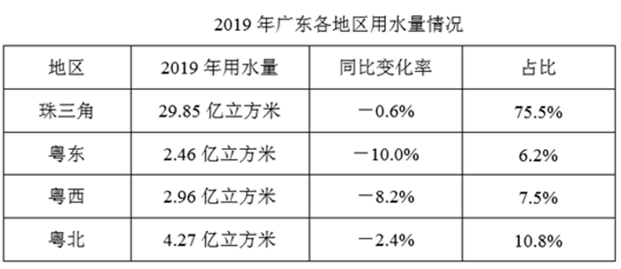

        2019年，广东规模以上工业企业重复用水量为147.10亿立方米，比上年增长，重复用水率提高到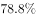（注：重复用水率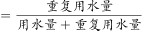）。分行业看，重复用水量主要集中在电力、冶金和石油石化行业。其中，电力行业重复用水量为50.72亿立方米，比上年下降，占全省规模以上工业企业全部重复用水量的；冶金行业重复用水量为40.82亿立方米，增长，占全部重复用水量的；石油石化行业重复用水量为32.12亿立方米，增长，占全部重复用水量的。

        整体而言，在全省规模以上工业企业中，重复用水量普及面窄且重复用水率较低的问题值得关注。有重复用水的企业只有3573家，只占全省规模以上工业企业的，说明九成多企业无重复用水。重复用水量超过1000万立方米以上的企业88家，仅占重复用水量的，主要集中在石油化工、电厂和钢铁厂等少数大型企业中，重复用水应用领域明显较窄。

### 第 11 题　qid 2606258 · 综合

2019年广东规模以上工业企业用水量中，地表与地下淡水量约占：

- **A**. 

- **B**. 

　✅
- **C**. 

- **D**. 

**答案**：B

**官方解析**

根据题干“2019年···约占”，结合选项为百分比，可判定本题为现期比重问题。定位文字材料第1段可得：2019年，广东规模以上工业企业用水量39.54亿立方米，地表淡水用水量2.52亿立方米，地下淡水0.03亿立方米。因此地表与地下淡水量的占比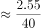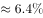。

故正确答案为B。

---

### 第 12 题　qid 2606259 · 综合

与2018年相比，2019年广东规模以上工业企业用水量：

- **A**. 减少了约0.8亿立方米　✅
- **B**. 增加了约1.8亿立方米
- **C**. 减少了约2.8亿立方米
- **D**. 增加了约3.8亿立方米

**答案**：A

**官方解析**

根据题干“与2018年相比，2019年···”，结合选项中有减少和增加，且带有单位，可判定本题为增长量计算问题。定位表格材料，可得2019年广东各地区用水量和同比变化率。根据公式，增长量，则与2018年相比广东各地区用水量变化情况为：珠三角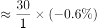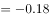，粤东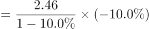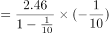，粤西，粤北。因此与2018年相比，2019年广东规模以上工业企业用水量约减少了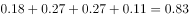亿立方米，与A项最接近。

故正确答案为A。

---

### 第 13 题　qid 2606260 · 综合

2018年广东规模以上企业重复用水率约为：

- **A**. 

　✅
- **B**. 

- **C**. 

- **D**. 
无法判断

**答案**：A

**官方解析**

根据题干“2018年···重复用水率约为”，结合材料公式可知重复利用率为比重且材料时间为2019年，可判定本题为基期比重问题。

方法一：定位文字材料第2段可知：2019年，广东规模以上工业企业重复用水量为147.10亿立方米，比上年增长，则2018年重复用水量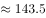亿立方米。根据上一题（97题）可知，2019年用水量39.54亿立方米比2018年减少0.8亿立方米，则2018年用水量现期增长量亿立方米。所以根据材料所给公式：重复用水率重复用水量（用水量重复用水量），则2018年广东规模以上企业重复用水率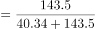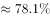，A项最接近。

方法二：定位文字材料第2段中可知，“2019年···重复用水率提高到”，说明2018年的重复用水率低于，只有A项符合。

故正确答案为A。

---

### 第 14 题　qid 2606261 · 综合

2018年电力、冶金和石油石化行业以外的其他行业的重复用水量约占广东规模以上工业企业重复用水量的：

- **A**. 

- **B**. 

　✅
- **C**. 

- **D**. 

**答案**：B

**官方解析**

根据题干“2018年······约占······”，结合选项为百分比，可判定本题为基期比重问题。定位文字材料第二段，可知2018年重复用水量；2018年电力、冶金和石油石化行业的重复用水量分别为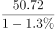，，。因此2018年电力、冶金和石油石化行业以外的其他行业的重复用水量占比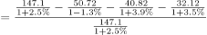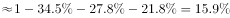，B项最为接近。

故正确答案为B。

---

### 第 15 题　qid 2606262 · 综合

根据以上资料，下列有关2019年广东省规模以上工业企业重复用水情况正确的是：

- **A**. 
全省约有规模以上工业企业4.3万家

- **B**. 
有重复用水的企业的平均重复用水量约为41.2万立方米

- **C**. 
重复用水量超过1000万立方米的企业的平均重复用水量约为1.8亿立方米

- **D**. 
电力行业的重复用水率不可能低于
　✅

**答案**：D

**官方解析**

A项：定位文字材料第三段可知：有重复用水的企业只有3573家，只占全省规模以上工业企业的，可推出全省规模以上工业企业=万，错误；

B项：定位文字材料第二和第三段可知：2019年，广东规模以上工业企业重复用水量为147.10亿立方米；有重复用水的企业只有3573家。因此有重复用水的企业的平均重复用水量万立方米万立方米，错误；

C项：定位文字材料第二和第三段可知：2019年，广东规模以上工业企业重复用水量为147.10亿立方米；重复用水量超过1000万立方米的企业88家，仅占重复用水量的。因此重复用水量超过1000万立方米的企业的平均重复用水量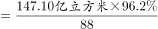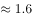亿立方米亿立方米，错误；

D项：定位文字材料第一和第二段可知：2019年，广东规模以上工业企业用水量39.54亿立方米，电力行业重复用水量为50.72亿立方米。因为电力行业的用水量小于广东规模以上工业企业用水量39.54亿立方米，所以电力行业的重复用水率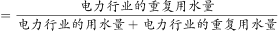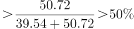，正确。

故正确答案为D。

---
