# 2020年广西自治区公务员录用考试《行测》试题（网友回忆版）

> 资料分析 · 10 题 · 广西 2020

## 材料 1

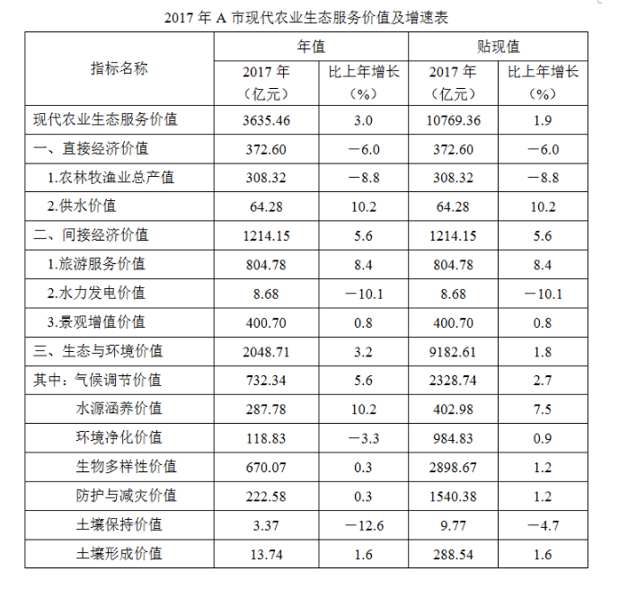 

### 第 1 题　qid 2616084 · 综合

2016年，A市旅游服务价值年值比农林牧渔业总产值年值多：

- **A**. 494.46亿元
- **B**. 462.79亿元
- **C**. 441.85亿元
- **D**. 404.35亿元　✅

**答案**：D

**官方解析**

根据题干“2016年，······比······多”，结合材料时间“2017年”，可判定本题为基期作差问题。定位表格材料可得：“2017年，A市旅游服务价值年值为804.78亿元，同比增长；农林牧渔业总产值年值为308.32亿元，同比增长”。根据：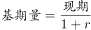，列式：2016年A市旅游服务价值年值比农林牧渔业总产值年值多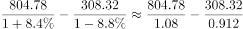 亿元，所求结果与D项最接近。

故正确答案为D。

---

### 第 2 题　qid 2616071 · 比重

2016年，A市直接经济价值年值占现代农业生态服务价值年值的比重为：

- **A**. 
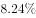

- **B**. 
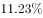
　✅
- **C**. 

- **D**. 

**答案**：B

**官方解析**

根据题干“2016年，······占······的比重为”，结合材料时间“2017年”，可判定本题为基期比重问题。定位表格材料可得：2017年直接经济价值年值为372.60亿元，比上年增长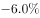，现代农业生态服务价值年值为3635.46亿元，比上年增长。故2016年A市直接经济价值年值占现代农业生态服务价值年值的比重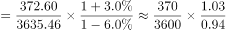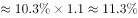，所求结果与B项最接近。

故正确答案为B。

---

### 第 3 题　qid 2616080 · 比重

能够正确描述2017年A市间接经济价值年值中三个指标占比的统计图是：

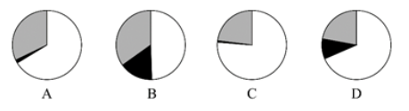 

- **A**. A　✅
- **B**. B
- **C**. C
- **D**. D

**答案**：A

**官方解析**

方法一：根据题干“······2017年······占比······”，结合材料时间“2017年”，可判定本题为现期比重问题。定位表格材料可得：2017年间接经济价值年值为1214.15亿元，旅游服务价值年值为804.78亿元，水力发电价值年值为8.68亿元，景观增值价值年值为400.70亿元。旅游服务价值年值占比为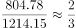，即大于、小于，说明第一个扇形的圆心角大于、小于，结合选项排除B、C两项；景观增值价值年值占比为，说明最后一个扇形的圆心角大于，结合选项排除D项。

方法二：旅游服务价值年值与景观增值价值年值比例为，说明第一个扇形的面积约为第三个扇形面积的2倍，结合选项排除B、C、D三项。

故正确答案为A。

---

### 第 4 题　qid 2616093 · 综合

2017年A市生态与环境价值中，年值、贴现值较上年均有所上升的指标有：

- **A**. 6个
- **B**. 5个　✅
- **C**. 4个
- **D**. 3个

**答案**：B

**官方解析**

根据题干“2017年······较上年均有所上升的······”，可知2017年A市生态与环境价值中“年值、贴现值”的增速都为正（即增长率大于0），即表明较上年均有所上升。定位表格可知：2017年A市生态与环境价值中，年值、贴现值同比增长率都为正的指标有：“气候调节价值（、）、水源涵养价值（、）、生物多样性价值（、）、防护与减灾价值（、）、土壤形成价值（、）”，共5个。

故正确答案为B。

---

### 第 5 题　qid 2616096 · 综合

能够从上述资料中推出的是：

- **A**. 2016年A市气候调节价值年值超过700亿元
- **B**. 2017年A市现代农业生态服务价值年值增长率、贴现值增长率最低的是同一个指标
- **C**. 2017年A市生态与环境价值贴现值超过直接经济价值贴现值、间接经济价值贴现值之和的5倍　✅
- **D**. 2017年A市气候调节价值与水源涵养价值的年值之和超过生态与环境价值中其余指标的年值之和

**答案**：C

**官方解析**

A项：定位表格，2017年A市气候调节价值年值为732.34，比上年增长，则2016年A市气候调节价值年值为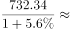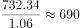亿元，没有超过700亿元，错误。

B项：定位表格，2017年A市现代农业生态服务价值年值增长率最低的是土壤保持价值，增长率为，贴现值增长率最低的是水力发电价值，增长率为，非同一个指标，错误。

C项：定位表格，2017年A市生态与环境价值贴现值为9182.61亿元，直接经济价值贴现值为372.60亿元、间接经济价值贴现值为1214.15亿元，则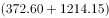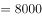，而，正确。

D项：定位表格，2017年A市气候调节价值年值为732.34，水源涵养价值年值为287.78，两个指标年值之和为：亿元；生态与环境价值年值为2048.71，生态与环境价值其余指标的年值之和为：亿元，1020.12亿元1028.59亿元，则2017年A市气候调节价值与水源涵养价值的年值之和小于生态与环境价值中其余指标的年值之和，错误。

故正确答案为C。

---

## 材料 2

        2019年6月，全国发行地方政府债券8996亿元，同比增长，环比增长。其中，发行一般债券3178亿元，同比减少，环比增长，发行专项债券5818亿元，同比增长，环比增长；按用途划分，发行新增债券7170亿元，同比增长，环比增长，发行置换债券和再融资债券1826亿元，同比减少，环比增长。

        2019年6月，地方政府债券平均发行期限11.1年，其中新增债券10.4年，置换债券和再融资债券13.4年；地方政府债券平均发行利率，其中新增债券，置换债券和再融资债券。

        2019年1至6月，全国发行地方政府债券28372亿元，同比增长。其中，发行一般债券12858亿元，同比增长，发行专项债券15514亿元，同比增长；按用途划分，发行新增债券21765亿元，同比增长，发行置换债券和再融资债券6607亿元，同比减少。

        2019年1至6月，地方政府债券平均发行期限9.3年，其中一般债券11.2年，专项债券7.8年；地方政府债券平均发行利率，其中一般债券，专项债券。

        2019年全国地方政府债务限额为240774.3亿元。其中，一般债务限额133089.22亿元，专项债务限额107685.08亿元。截至2019年6月末，全国地方政府债务余额205477亿元，其中，一般债务118397亿元，专项债务87080亿元。

### 第 6 题　qid 2616100 · 综合

2018年6月，发行置换债券和再融资债券约为：

- **A**. 3157亿元
- **B**. 2186亿元　✅
- **C**. 1657亿元
- **D**. 1386亿元

**答案**：B

**官方解析**

根据题干“2018年6月”，结合选项单位与材料时间，可判定本题为基期计算问题。根据文字材料第一段“（2019年6月）发行置换债券和再融资债券1826亿元，同比减少”。结合公式：基期量可得，2018年6月发行置换债券和再融资债券亿元，与B项最接近。

故正确答案为B。

---

### 第 7 题　qid 2616092 · 综合

2019年6月，全国发行的地方政府债券比2018年6月多约：

- **A**. 6151亿元
- **B**. 5953亿元
- **C**. 3653亿元　✅
- **D**. 3043亿元

**答案**：C

**官方解析**

根据题干“2019年6月，······比2018年6月多约”，判定本题为增长量计算问题。定位文字材料第一段“2019年6月，全国发行地方政府债券8996亿元，同比增长”。根据公式：增长量。代入数据，2019年6月，全国发行的地方政府债券的同比增长量亿元，与C项最接近。

故正确答案为C。

---

### 第 8 题　qid 2616097 · 比重

2018年1至6月，发行一般债券的占比较发行专项债券的占比约：

- **A**. 
低

- **B**. 
低

- **C**. 
高
　✅
- **D**. 
高

**答案**：C

**官方解析**

根据题干“2018年1至6月······占比约”，结合材料时间，可判定本题为基期比重问题。结合文字资料第三段“2019年1至6月，全国发行地方政府债券28372亿元，同比增长。其中，发行一般债券12858亿元，同比增长，发行专项债券15514亿元，同比增长”。代入公式：基期量和比重，可得所求比重，与C项最接近。

故正确答案为C。

---

### 第 9 题　qid 2616101 · 综合

不能从上述资料推出的是：

- **A**. 截至2019年6月末，地方政府一般债务余额和专项债务余额都控制在限额之内
- **B**. 2019年1至6月，地方政府一般债券的平均发行利率高于专项债券0.1个百分点
- **C**. 2019年5月，地方政府新增债券的平均发行期限比置换债券和再融资债券短　✅
- **D**. 2019年地方一般债务限额比专项债务限额多25404.14亿元

**答案**：C

**官方解析**

A项：定位文字材料最后一段“2019年······一般债务限额133089.22亿元，专项债务限额107685.08亿元。截至2019年6月末······一般债务118397亿元，专项债务87080亿元”，由于118397亿元133089.22亿元、87080亿元107685.08亿元，说明都控制在限额之内，正确；

B项：定位文字材料第四段“2019年1至6月，······其中一般债券，专项债券”，则一般债券平均发行利率专项债券平均发行利率个百分点，正确；

C项：定位文字材料第二段“2019年6月，······其中新增债券10.4年，置换债券和再融资债券13.4年”，只有2019年6月的年份数据，无法计算出2019年5月的数据，故无法推出，错误；

D项：定位文字材料最后一段“2019年······其中，一般债务限额133089.22亿元，专项债务限额107685.08亿元”，一般债务限额专项债务限额亿元，正确。

本题为选非题，故正确答案为C。

---

### 第 10 题　qid 2616173 · 增长

2019年1至6月，全国发行地方政府债券同比增量绝对值排序正确的是：

- **A**. 
新增债券专项债券置换债券和再融资债券一般债券
　✅
- **B**. 
新增债券置换债券和再融资债券一般债券专项债券

- **C**. 
专项债券新增债券置换债券和再融资债券一般债券

- **D**. 
置换债券和再融资债券专项债券一般债券新增债券

**答案**：A

**官方解析**

根据题干“······同比增量绝对值排序正确的是”，可判定本题为增长量的比较问题。定位文字材料第三段可得，2019年1至6月······发行一般债券12858亿元，同比增长，发行专项债券15514亿元，同比增长；······发行新增债券21765亿元，同比增长，发行置换债券和再融资债券6607亿元，同比减少。

根据增长量比较“大大则大”的原则，新增债券（21765亿元）专项债券（15514亿元）一般债券（12858亿元），新增债券的同比增速（）专项债券的同比增速（）一般债券的同比增速（），且由于三者都是同比增长，则同比增量绝对值的排序为：新增债券专项债券一般债券，只有A项符合。

故正确答案为A。

---
