# 2020年度浙江省党政机关选调应届优秀大学毕业生《行测》题（网友回忆版）

> 资料分析 · 10 题 · 浙江 2020

## 材料 1

        2018年1-11月，我国互联网和相关服务业发展态势良好，业务收入保持较快增长，盈利状况基本稳定。分领域看，网络销售、影音直播等应用深受用户欢迎，市场规模稳步扩大，网络生活服务市场活跃。

一、总体运行情况

        1-11月，我国规模以上互联网和相关服务企业（简称互联网企业）完成业务收入8518亿元，同比增长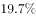，增速较1-10月提高1.7个百分点，与去年同期基本持平。主要省份保持良好增长态势，互联网业务收入总量居前三位的广东、上海、北京互联网业务收入分别增长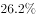、和。

二、分业务运行情况

（一）信息服务业务

        1-11月，信息服务收入达7615亿元，同比增长，其中，电子商务平台收入3212亿元，同比增长；网络游戏（包括客户端游戏、手机游戏、网页游戏等）业务收入1628亿元，同比增长。

（二）互联网数据中心业务

        1-11月，互联网企业完成互联网数据中心业务收入137亿元，同比增长；截至11月末，部署的服务器数量达138万台，同比增长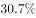。

（三）互联网接入业务

        1-11月，互联网企业完成互联网接入业务收入129亿元，同比下降，降幅较上半年和前三季度分别收窄6.9个和5个百分点。

三、移动应用程序（APP）数量情况

        我国市场上移动互联网应用数量小幅增长。截至11月底，我国市场上监测到的移动应用为447万款。11月份，我国第三方应用商店与苹果应用商店中新上架14.3万款移动应用。截至11月底，我国本土第三方应用商店移动应用数量超过266万款，苹果商店（中国区）移动应用数量超过181万款。

        截至11月底，游戏类应用数量为137.6万款。生活服务类应用规模达54万款，排名第二。排名第三和第四的分别是电子商务类应用和主题壁纸类应用，规模分别为42万款和37.1万款。在市场热点类应用当中，以物流企业应用、货运运输服务应用和具有自有物流服务能力的电子商城为代表的智慧物流类应用数量超过2.4万款；而提供二维码扫码、转账等金融支付功能的网络支付类应用数量约为2.5万款。

        截至11月底，第三方应用商店分发累计数量超过1.75万亿次。游戏类、系统工具类、影音播放类、社交通讯类、日常工具类、生活服务类和金融类应用下载量均超过千亿次，分别为3014亿次、2892亿次、2264亿次、1911亿次、1212亿次、1143亿次和1911亿次，其中游戏类、系统工具类和影音播放类应用下载量均突破两千亿次。其余各类应用中，下载总量超过500亿次的应用还有电子商务类（999亿次）、资讯阅读类（931亿次）和主题壁纸类（754亿次）。

### 第 1 题　qid 2456363 · 综合

2017年1-11月，我国互联网企业完成业务收入约为多少亿元？

- **A**. 6900
- **B**. 7100　✅
- **C**. 7300
- **D**. 7500

**答案**：B

**官方解析**

由题干“2017年1-11月，我国互联网企业完成业务收入···”，结合材料时间是2018年1-11月，可判定本题为基期量计算问题。定位文字材料第二段，“（2018年）1-11月，我国规模以上互联网和相关服务企业（简称互联网企业）完成业务收入8518亿元，同比增长···”。根据公式：基期量，可计算出2017年1-11月，我国互联网企业完成业务收入约为：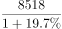亿元。

故正确答案为B。

---

### 第 2 题　qid 2456370 · 比重

2018年1-11月，信息服务收入占互联网企业业务收入比重约为：

- **A**. 

- **B**. 

- **C**. 

- **D**. 
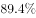
　✅

**答案**：D

**官方解析**

由题干“2018年1-11月，···占···比重约为”，结合材料时间是2018年1-11月，可判定本题为现期比重计算问题。定位文字材料第二段，“（2018年）1-11月，我国规模以上互联网和相关服务企业（简称互联网企业）完成业务收入8518亿元，···”；定位文字材料第三段，“（2018年）1-11月，信息服务收入达7615亿元，···”。根据公式：比重，可计算出2018年1-11月，信息服务收入占互联网企业收入比重约为：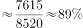，与D项最接近。

故正确答案为D。

---

### 第 3 题　qid 2456373 · 综合

2018年前三季度，互联网企业完成互联网接入业务收入降幅较上半年：

- **A**. 收窄1.9个百分点　✅
- **B**. 收窄11.9个百分点
- **C**. 扩大1.9个百分点
- **D**. 扩大11.9个百分点

**答案**：A

**官方解析**

定位文字材料第五段，“（2018年）1-11月，互联网企业完成互联网接入业务收入···，同比下降17.8%，降幅较上半年和前三季度分别收窄6.9个和5个百分点”。可计算出2018年前三季度降幅；上半年降幅。由此可知，2018年前三季度，互联网企业完成互联网接入业务收入降幅较上半年：，即收窄1.9个百分点。 

故正确答案为A。

---

### 第 4 题　qid 2456378 · 综合

根据上述资料，以下说法不正确的是：

- **A**. 
截至2018年11月底，至少七个类别应用下载量超过千亿次

- **B**. 
2018年1-11月，互联网业务收入同比增长率：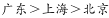 
　✅
- **C**. 
截至2018年11月底，移动应用程序（APP）数量方面，游戏类应用领先

- **D**. 
截至2018年11月底，排名前三的APP数量之和占移动应用程序总量的一半以上

**答案**：B

**官方解析**

A项：定位文字材料最后一段，“截至（2018年）11月底，第三方应用商店···。游戏类、系统工具类、影音播放类、社交通讯类、日常工具类、生活服务类和金融类应用下载量均超过千亿次，分别为···。其余各类应用中，下载总量超过500亿次的应用还有电子商务类（999亿次）、资讯阅读类（931亿次）和主题壁纸类（754亿次）。”可以看出，截至2018年11月底，共有游戏类······金融类，七个类别应用下载量超过千亿次。这仅仅是第三方应用商店的七类，还包括其他应用商店的，所以“至少七类”，正确；

B项：定位文字材料第二段，“（2018年）1-11月，…互联网业务收入总量居前三位的广东、上海、北京互联网业务收入分别增长、和。”可知2018年1-11月，互联网业务收入同比增长率，错误；

C项：定位文字材料倒数第二段，“截至（2018年）11月底，游戏类应用数量为137.6万款。生活服务类···54万款，排名第二。”可知，截至（2018年）11月底，移动应用程序（APP）数量方面，，故游戏类应用领先，正确；

D项：定位文字材料倒数第二段，截至（2018年）11月底，游戏类应用数量为137.6万款。生活服务类排名第二为54万款。电子商务类应用排名第三为42万款。定位文字材料倒数第三段，截至（2018年）11月底，我国市场上监测到的移动应用为447万款。根据公式：比重，可计算出截至2018年11月底，排名前三的APP数量之和占移动应用程序总量的比重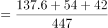，即一半以上，正确。

本题为选非题，故正确答案为B。

---

### 第 5 题　qid 2456379 · 综合

根据上述资料，以下说法不正确的是：

- **A**. 截至2017年11月末，互联网企业部署的服务器数量超过100万台
- **B**. 2017年1-11月，互联网数据中心业务收入少于互联网接入业务
- **C**. 截至2018年11月底，应用下载量：系统工具类＞金融类＞日常工具类＞电子商务类
- **D**. 2018年1-11月，信息服务收入的同比增长率高于其所有子业务收入的同比增长率　✅

**答案**：D

**官方解析**

A项：定位文字材料第四段，“···截至（2018年）11月末，部署的服务器数量达138万台，同比增长。”。根据公式：基期量，可计算出截至2017年11月末，互联网企业部署的服务器数量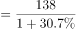万台。即超过100万台，正确；

B项：定位文字材料第四段，“（2018年）1-11月，互联网企业完成互联网数据中心业务收入137万元，同比增长”；定位文字材料第五段，“（2018年）1-11月，互联网企业完成互联网接入业务收入129亿元，同比下降···”。根据公式：基期量，可计算出2017年1-11月，互联网数据中心业务收入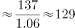亿元；互联网接入业务收入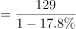亿元。故前者少于后者，正确；

C项：定位文字材料最后一段，“截至（2018年）11月底······游戏类、系统工具类、影音播放类、社交通讯类、日常工具类、生活服务类和金融类应用下载量均超过千亿次，分别为3014亿次、2892亿次、2264亿次、1911亿次、1212亿次、1143亿次和1911亿次···。其余各类应用中，下载总量超过500亿次的应用还有电子商务类（999亿次）、···”。可知，截至2018年11月底，应用下载量：系统工具类（2892亿次）金融类（1911亿次）日常工具类（1212亿次）电子商务类（999亿次）。正确；

D项：定位文字材料第三段，“（2018年）1-11月，信息服务收入达7615亿元，同比增长，其中，电子商务平台收入3212亿元，同比增长；网络游戏（包括客户端游戏、手机游戏、网页游戏等）业务收入1628亿元，同比增长”，材料中虽然未给出其他子业务收入情况，但根据混合增长率的结论：总体的增长率大小居于所有部分增长率中间范围。可知，2018年1-11月，信息服务收入的同比增长率是居于所有子业务中间范围的，故不会高于其所有子业务收入的同比增长率。错误。

本题为选非题，故正确答案为D。

---

## 材料 2

        2017年，我国技术市场交易额稳步增长，全年共签订各类技术合同36.8万项，成交金额13424.2亿元，比上年分别增长和。

        2017年全国共成交1000万元以上重大技术合同13358项，同比增长；成交额10281.4亿元，同比增长。重大技术合同中涉及各类知识产权的合同，成交5561项，成交金额为4121.7亿元。其中，技术秘密为主要交易形式，成交2959项，成交额2239.6亿元，居第一位；专利技术合同成交1291项，成交额1258.5亿元，居第二位。

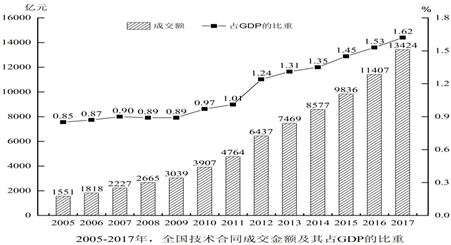

### 第 6 题　qid 2456364 · 平均数

2016年，平均每项技术合同成交金额约为：

- **A**. 330万元
- **B**. 356万元　✅
- **C**. 365万元
- **D**. 385万元

**答案**：B

**官方解析**

根据题干“2016年，平均每项技术合同成交金额约为”，可判定本题为基期平均数问题。定位文字材料第一段可知，“2017年，全年共签订各类技术合同36.8万项，比上年增长”；定位图形材料可知，2016年全国技术合同成交金额为11407亿元。根据公式：平均数；基期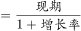，可得所求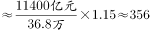万元。

故正确答案为B。

---

### 第 7 题　qid 2456366 · 增长

2008-2017年，全国技术合同成交金额同比上涨最快的年份是：

- **A**. 2008年
- **B**. 2010年
- **C**. 2012年　✅
- **D**. 2017年

**答案**：C

**官方解析**

根据题干“2008-2017年，······同比上涨最快的年份是”，可判定本题为一般增长率的比较问题。定位图形材料可知，2007-2012年全国技术合同成交金额依次为2227亿元、2665亿元、3039亿元、3907亿元、4764亿元、6437亿元；定位文字材料第一段可知，2017年成交金额比上年增长。代入公式：增长率，则选项年份的增长率分别为：

2008年：增长率；

2010年：增长率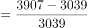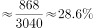；

2012年：增长率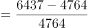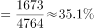；

2017年：增长率。则全国技术合同成交金额同比上涨最快的年份是2012年。

故正确答案为C。

---

### 第 8 题　qid 2456382 · 比重

2016年，1000万元以上重大技术合同数量占全国各类技术合同的比例在：

- **A**. 
以内
　✅
- **B**. 
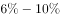之间

- **C**. 
之间

- **D**. 
以上

**答案**：A

**官方解析**

根据题干“2016年，······占······的比例”，可判定本题为基期比重问题。定位文字材料第一、二段可知，2017年，全年共签订各类技术合同36.8万项，比上年增长；2017年全国共成交1000万元以上重大技术合同13358项，同比增长。代入公式：基期比重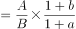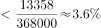，故所求在以内。

故正确答案为A。

---

### 第 9 题　qid 2456387 · 综合

2005-2017年间，我国GDP总量突破50万亿的年份有几个？

- **A**. 4
- **B**. 5
- **C**. 6　✅
- **D**. 7

**答案**：C

**官方解析**

根据题干“2005-2017年间，我国GDP总量突破50万亿的年份有几个”，结合材料给出各年份全国技术合同成交金额占GDP的比重，可判定本题为现期比重问题。定位图形材料，可知2005-2017年全国技术合同成交金额及其占GDP的比重，代入公式：总体万亿，化简得，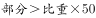万亿，即：万亿，则2005-2017年情况如下：

2005年：1551亿万亿；

2006年：1818亿万亿；

2007年：2227亿万亿；

2008年：2665亿万亿；

2009年：3039亿万亿；

2010年：3907亿万亿；

2011年：4764亿万亿；

2012年：6437亿万亿；

2013年：7469亿万亿；

2014年：8577亿万亿；

2015年：9836亿万亿；

2016年：11407亿万亿；

2017年：13424亿万亿；

故我国GDP总量突破50万亿的年份为2012-2017年，共6年。

故正确答案为C。

备注：结合常识可知，我国GDP总量逐年上升，故算出2012年GDP大于50万亿时，之后年份便可不必计算。

---

### 第 10 题　qid 2456391 · 综合

能够从上述资料中推出的是：

- **A**. 
2005-2017年，全国技术合同成交金额占GDP的比重逐年上升

- **B**. 
2006-2017年，全国技术合同成交金额同比增长超千万的年份有8个

- **C**. 
2017年，1000万元以上重大技术合同中，专利技术合同平均每项成交额超过1个亿

- **D**. 
2017年，1000万元以上重大技术合同中，涉及各类知识产权的合同项数和成交金额均超过
　✅

**答案**：D

**官方解析**

A项：定位图形材料可知，2007年和2008年，全国技术合同成交金额占GDP的比重分别为和，比重下降，并非逐年上升，错误；

B项：定位图形材料可知，2005年-2017年，全国技术合同成交金额。根据公式：增长量，且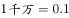亿可知，2006-2017年，每年的全国技术合同成交金额均超过0.1亿，即均超过千万，共12个年份，错误；

C项：定位文字材料第二段可知，专利技术合同成交1291项，成交额1258.5亿元，代入公式：平均数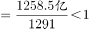亿，错误；

D项：定位文字材料第二段可知，2017年全国共成交1000万元以上重大技术合同13358项，成交额10281.4亿元，重大技术合同中涉及各类知识产权的合同，成交5561项，成交金额为4121.7亿元。代入公式：比重，则合同项数的比重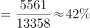；成交金额的比重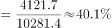，两者均超过，正确。

故正确答案为D。

---
