# 2020年新疆公务员录用考试《行测》试题（网友回忆版）

> 资料分析 · 15 题 · 新疆 2020

## 材料 1

        2014年，全国房地产开发投资95036亿元，比上年增长，增速比2013年回落9.3个百分点。其中，住宅投资64352亿元，增长。

        2014年，全国商品房销售面积120649万平方米，比上年下降，降幅比1—11月份收窄0.6个百分点，2013年为增长；商品房销售额76292亿元，下降，降幅比1—11月份收窄1.5个百分点，2013年为增长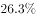。

        2014年，东部地区商品房销售面积54756万平方米，比上年下降，降幅比1—11月份收窄1.3个百分点；销售额43607亿元，下降，降幅收窄2.1个百分点。中部地区商品房销售面积33824万平方米，下降，降幅收窄0.4个百分点；销售额16558亿元，增长，1—11月份为下降。西部地区商品房销售面积32068万平方米，增长，增速回落0.6个百分点；销售额16127亿元，增长，增速回落0.6个百分点。

### 第 1 题　qid 2662243 · 综合

2012年全国房地产开发投资额为多少亿元？

- **A**. 71790.8　✅
- **B**. 67835.2
- **C**. 31248.1
- **D**. 24156.3

**答案**：A

**官方解析**

由题干“2012年全国房地产开发投资额为多少亿元”，结合材料时间为2014年，可判定本题为间隔基期计算问题。定位材料第一段，“2014年，全国房地产开发投资95036亿元，比上年增长，增速比2013年回落9.3个百分点。”根据间隔增长率公式可得，2014年比2012年全国房地产开发投资的增长率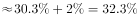，则2012年全国房地产开发投资额为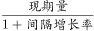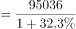亿元，与A项最接近。

故正确答案为A。

---

### 第 2 题　qid 2662245 · 增长

2014年，全国商品房销售面积比上年减少多少万平方米？

- **A**. 10004.7
- **B**. 9923.5　✅
- **C**. 9014.2
- **D**. 8799.3

**答案**：B

**官方解析**

由题干“2014年······比上年减少多少万平方米”，可判定本题为增长量计算问题。定位文字材料第二段，“2014年，全国商品房销售面积120649万平方米，比上年下降”，根据增长量，2014年全国商品房销售面积增长量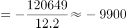万平方米，即减少量约为9900万平方米，与B项最接近。

故正确答案为B。

---

### 第 3 题　qid 2662248 · 综合

2013年西部地区商品房销售价格为：

- **A**. 3694元/平方米
- **B**. 4674元/平方米
- **C**. 4888元/平方米　✅
- **D**. 5008元/平方米

**答案**：C

**官方解析**

由题干“2013年······商品房销售价格······”，结合材料时间是2014年，可判定本题为基期平均数问题。定位材料第三段，“2014年······西部地区商品房销售面积32068万平方米（B），增长（b）； 销售额16127亿元（A），增长（a）”，根据基期平均数公式：，可计算出2013年西部地区商品房销售价格为：元/平方米，与C项最为接近。

故正确答案为C。

---

### 第 4 题　qid 2662250 · 比重

2013年，东部地区住宅投资占投资额的比重约为：

- **A**. 

- **B**. 

　✅
- **C**. 

- **D**. 

**答案**：B

**官方解析**

由题干“2013年······的比重”，结合材料时间是2014年，可判定本题为基期比重问题。定位统计表材料，2014年东部地区住宅投资额为35477亿元（A），增速为（a）； 总投资额为52941亿元（B），增速为（b）。根据基期比重公式：，可得2013年东部地区住宅投资占投资额的比重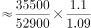。

故正确答案为B。

---

### 第 5 题　qid 2662252 · 综合

能够从上述资料中推出的是：

- **A**. 2013年东部地区的商品房销售额超过50000亿元
- **B**. 2014年我国东部地区住宅投资额低于中、西部地区之和
- **C**. 2014年我国东部地区房地产投资额是西部地区的3倍多
- **D**. 2014年住宅投资占房地产开发投资的比重不到七成　✅

**答案**：D

**官方解析**

A项：定位材料第三段可知，“2014年，东部地区商品房······销售额43607亿元，下降”，根据基期量，可得2013年东部地区的商品房销售额亿元，错误；

B项：定位表格可知，2014年东部地区住宅投资额为35477亿元，而中部地区住宅投资额为14552亿元，西部地区住宅投资额为14323亿元。 ，所以2014年东部地区住宅投资额高于中、西部地区之和，错误；

C项：定位表格可知，2014年东部地区房地产投资额为52941亿元，而西部地区房地产投资额为21433亿元。  ，所以2014年二者的倍数关系不到3倍，错误；

D项：定位材料第一段，“2014年，全国房地产开发投资95036亿元，······其中，住宅投资64352亿元，增长。”，也就是不到七成，正确。

故正确答案为D。

---

## 材料 2

        2018年N省规模以上工业增加值比上年增加，增速比上年提高4.0个百分点。其中，新产品增长强劲。石墨及碳素制品增长，单晶硅增长1.2倍，多晶硅增长，汽车增长。

        1—11月，N省规模以上工业企业实现利润总额达到1332.8亿元，同比增长，同期全国平均水平为。其中，制造业利润474.48亿元，同比增长。规模以上工业企业主营业务收入利润率为，同比提高0.3个百分点，也高于全国平均水平4.1个百分点。

### 第 6 题　qid 2662198 · 综合

2018年1—11月，N省制造业利润额约占规模以上工业企业实现利润总额的：

- **A**. 

- **B**. 

　✅
- **C**. 

- **D**. 

**答案**：B

**官方解析**

根据题干“2018年1—11月，······占······”，且选项为“”，结合材料时间为2018年，可判定本题为现期比重问题。定位文字材料第二段“（2018年）1—11月，N省规模以上工业企业实现利润总额达到1332.8亿元，同比增长，······其中，制造业利润474.48亿元”，根据公式：，则2018年1—11月，N省制造业利润额约占规模以上工业企业实现利润总额的比重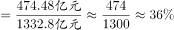，与B项最接近。

故正确答案为B。

---

### 第 7 题　qid 2662206 · 平均数

2018年1—11月，全国规模以上工业企业主营业务收入利润率平均水平为：

- **A**. 

- **B**. 

- **C**. 

　✅
- **D**. 

**答案**：C

**官方解析**

定位文字材料第二段“（2018年）1—11月，N省······规模以上工业企业主营业务收入利润率为，同比提高0.3个百分点，也高于全国平均水平4.1个百分点。”则2018年1—11月，全国规模以上工业企业主营业务收入利润率平均水平为。

故正确答案为C。

---

### 第 8 题　qid 2662223 · 增长

将N省2018年规模以上工业新产品按增加值增速从高到低排序，正确的是：

- **A**. 
单晶硅多晶硅石墨及碳素制品汽车
　✅
- **B**. 
单晶硅石墨及碳素制品多晶硅汽车

- **C**. 
汽车石墨及碳素制品多晶硅单晶硅

- **D**. 
单晶硅石墨及碳素制品汽车多晶硅

**答案**：A

**官方解析**

定位文字材料第一段“2018年······石墨及碳素制品增长，单晶硅增长1.2倍，多晶硅增长，汽车增长”可得，N省2018年规模以上工业新产品按增加值增速从高到低排序为：单晶硅（）多晶硅（）石墨及碳素制品（）汽车（）。

故正确答案为A。

---

### 第 9 题　qid 2662229 · 比重

2013—2018年间，N省GDP中第二产业增加值占比过半的年份有几个？

- **A**. 1
- **B**. 2
- **C**. 3　✅
- **D**. 4

**答案**：C

**官方解析**

根据题干“N省GDP中第二产业增加值占比······”，可判定本题为现期比重问题。N省GDP中第二产业增加值占比过半，即GDP中第二产业增加值第一产业增加值第三产业增加值，定位柱状图，可得：

2013年：第二产业增加值9104.08亿元第一产业增加值1575.76亿元第三产业增加值6236.66亿元，符合；

2014年：第二产业增加值9119.79亿元第一产业增加值1627.85亿元第三产业增加值7022.55亿元，符合；

2015年：第二产业增加值9000.58亿元第一产业增加值1617.42亿元第三产业增加值7213.51亿元，符合；

2016年：第二产业增加值8553.63亿元第一产业增加值1637.39亿元第三产业增加值7937.08亿元，不符合；

其中，2017年与2018年第三产业增加值均大于第二产业，不符合。

则2013—2018年间，N省GDP中第二产业增加值占比过半的年份有2013年、2014年、2015年，共3个。

故正确答案为C。

---

### 第 10 题　qid 2662230 · 综合

不能从上述资料中推出的是：

- **A**. 
2016年N省GDP同比增量高于2015年水平

- **B**. 
2017年，N省规模以上工业增加值增速超过
　✅
- **C**. 
2018年1—11月，N省规模以上工业企业中，非制造业企业利润同比正增长

- **D**. 
2016—2018年，N省累计GDP低于2013—2015年水平

**答案**：B

**官方解析**

A项：定位统计图，可知2016年N省GDP同比增量2016年GDP值2015年GDP值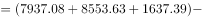亿元；2015年N省GDP同比增量2015年GDP值2014年GDP值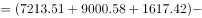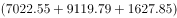亿元，故2016年N省GDP同比增量高于2015年水平，正确；

B项：定位文字材料第一段“2018年N省规模以上工业增加值比上年增加，增速比上年提高4.0个百分点。”则2017年N省规模以上工业增加值增速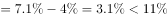，错误；

C项：定位文字材料第二段“1—11月，N省规模以上工业企业实现利润总额达到1332.8亿元，同比增长······其中，制造业利润474.48亿元，同比增长”，可得非制造业企业利润大于制造业利润。根据混合增长率判定口诀：混合后居中，偏向基数大，可知：非制造业企业利润同比增速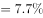，故非制造业企业利润同比正增长，正确；

D项：定位统计图，2016—2018年N省累计GDP2016年GDP2017年GDP2018年GDP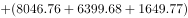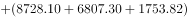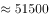亿元；2013—2015年N省累计GDP2013年GDP2014年GDP2015年GDP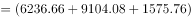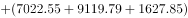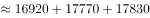亿元，故2016—2018年，N省累计GDP低于2013—2015年水平，正确。

本题为选非题，故正确答案为B。

---

## 材料 3

        2018年，M省进出口总值达到1034.4亿元，比上年增长。其中，出口378.6亿元，增长；M省加工贸易进出口总值比上年增长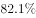。与“一带一路”沿线国家贸易保持快速增长，其中对蒙古国、越南、德国、荷兰进出口分别比上年增长、1.4倍、和。全省实际利用外资31.6亿美元，比上年增长。

        煤、锯材、铜矿砂为进口值前三的商品，三者合计占同期进口总值的；钢材、机电产品、农产品为出口值前三的商品，三者合计占同期出口总值的。2018年M省对“一带一路”沿线国家外贸进出口699.3亿元，增长，占同期外贸进出口总值的。其中对蒙古国外贸进出口327.7亿元，增长。

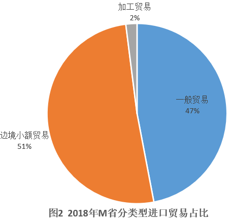

### 第 11 题　qid 2662196 · 综合

2018年，M省进口总值为：

- **A**. 330.9亿元
- **B**. 378.6亿元
- **C**. 655.8亿元　✅
- **D**. 657.9亿元

**答案**：C

**官方解析**

定位文字材料第一段：“2018年，M省进出口总值达到1034.4亿元，比上年增长。其中，出口378.6亿元，增长。”由进口出口进出口，可得2018年，M省进口总值为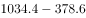亿元。

故正确答案为C。

---

### 第 12 题　qid 2662200 · 增长

2018年下列“一带一路”沿线国家中，与M省贸易额同比增速最快的是：

- **A**. 蒙古国
- **B**. 荷兰
- **C**. 德国
- **D**. 越南　✅

**答案**：D

**官方解析**

定位文字材料第一段：与“一带一路”沿线国家贸易保持快速增长，其中对蒙古国、越南、德国、荷兰进出口分别比上年增长、1.4倍、和。可知对越南贸易增长1.4倍，即增长率为，是四国中增速最快的国家。

故正确答案为D。

---

### 第 13 题　qid 2662201 · 综合

2017年M省对“一带一路”沿线国家外贸进出口总值为多少亿元？

- **A**. 509.2
- **B**. 610.2　✅
- **C**. 699.3
- **D**. 819.3

**答案**：B

**官方解析**

根据题干“2017年······为多少亿元”，结合材料所给时间为2018年，可判定本题为基期计算问题。定位文字材料第二段可得：2018年M省对“一带一路”沿线国家外贸进出口699.3亿元，增长。根据公式：基期，则2017年M省对“一带一路”沿线国家外贸进出口总值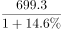亿元，与B项最接近。

故正确答案为B。

---

### 第 14 题　qid 2662208 · 综合

2018年M省边境小额贸易中，进口额约是出口额的多少倍？

- **A**. 6
- **B**. 8
- **C**. 11　✅
- **D**. 13

**答案**：C

**官方解析**

根据题干“2018年······是······的多少倍”，结合材料所给时间为2018年，可判定本题为现期倍数问题。定位文字材料第一段可得：2018年，M省进出口总值达到1034.4亿元，其中，出口378.6亿元，则2018年进口额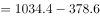亿元；定位饼状图可得：2018年M省分类型出口贸易中，边境小额贸易占比为；M省分类型进口贸易中，边境小额贸易占比为。根据公式：部分总体比重，则2018年边境小额贸易出口额亿元，进口额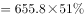亿元，故所求倍数倍。

故正确答案为C。

---

### 第 15 题　qid 2662212 · 综合

关于2018年M省进出口情况，不能从上述资料中推出的是：

- **A**. 
进口总值同比增速低于

- **B**. 
对蒙古国外贸进出口总值低于对“一带一路”沿线国家外贸进出口总值的一半

- **C**. 
外贸出口中边境小额贸易与加工贸易所占比例相等

- **D**. 
钢材、机电产品、农产品三者合计出口额超过240亿元
　✅

**答案**：D

**官方解析**

A项：定位文字材料第一段，2018年M省进出口总值达到1034.4亿元，比上年增长，其中，出口378.6亿元，增长；根据“混合居中原则”，进出口总值的增长率介于进口增长率和出口增长率之间，故进口总值同比增速小于，正确。

B项：定位文字材料第二段，2018年M省对“一带一路”沿线国家外贸进出口为699.3亿元，蒙古国外贸进出口为327.7亿元，则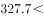，正确。

C项：定位图1，2018年M省分类型出口贸易占比中，边境小额贸易与加工贸易占比均为，故两者所占比例相等，正确。

D项：定位文字材料第二段，钢材、机电产品、农产品三者合计占同期出口总值的，定位文字材料第一段，2018年M省出口总值378.6亿元，因此三者合计出口额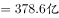，错误。

本题为选非题，故正确答案为D。

---
