# 2020年江苏省公务员录用考试《行测》题（A类）（网友回忆版）

> 资料分析 · 20 题 · 江苏 2020

## 材料 1

        新中国成立70年来，我国人口由1949年末的5.4亿人增加到2018年末的近14亿人。其中，从1949年末到1970年末，我国人口由5.4亿人增加到8.3亿人；1971年末至1980年末，全国人口由8.5亿人增加到9.9亿人；20世纪80年代，全国人口由1981年末的10.0亿人增加到1990年末的11.4亿人；1991年以来，我国人口增长率稳步下降，最终在左右的增速上保持平稳。1991-2018年，我国人口年均增加878万人，自2001年以来年均增加711万人。

        1953年末全国16-59岁劳动年龄人口为3.10亿人，1964年末为3.53亿人，1982年、1990年、2000年和2010年四次人口普查数据显示，我国劳动年龄人口分别为5.67亿人、6.99亿人、8.08亿人和9.16亿人。在2012年末我国劳动年龄人口总量达到峰值9.22亿人后增量由正转负，2018年末为8.97亿人。

        新中国成立之初，全国的人口都是文盲。1982年末全国高中及以上受教育程度人口占总人口的，1990年末占，2000年末占，2010年末达到，2018年末提高到。1982年末大专及以上受教育程度人口仅占总人口的，1990年末为，2000年末为，2010年末为，2018年末达到。

### 第 1 题　qid 2452562 · 增长

1981-1990年这十年，全国人口总增长率是

- **A**. 

- **B**. 
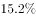
　✅
- **C**. 

- **D**. 

**答案**：B

**官方解析**

根据题干“1981-1990年这十年，全国人口总增长率是”，且选项均为百分数，可判定本题为一般增长率问题。定位文字资料第一段“1971年末至1980年末，全国人口由8.5亿人增加到9.9亿人；20世纪80年代，全国人口由1981年末的10.0亿人增加到1990年末的11.4亿人”。题干求得是1981-1990年这十年，因此现期是1990年，基期是1980年，代入公式：增长率，则题干所求。

故正确答案为B。

---

### 第 2 题　qid 2452609 · 增长

用、、分别表示四次人口普查间的全国劳动年龄人口年均增长率，下列关系正确的是

- **A**. 
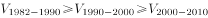
　✅
- **B**. 

- **C**. 

- **D**. 

**答案**：A

**官方解析**

根据题干“······年均增长率······”，且选项为排序，可判定本题为年均增长率的比较问题。定位文字资料第二段“1982年、1990年、2000年和2010年四次人口普查数据显示，我国劳动年龄人口分别为5.67亿人、6.99亿人、8.08亿人和9.16亿人”。1990-2000年与2000-2010年年份差相同，可直接利用比较。1990-2000年：；2000-2010年：；由于分子大、分母小的分数值大，故，则，排除B项。因为1982-1990年的年份差少于1990-2000年，且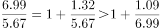，所以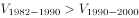。因此。

故正确答案为A。

---

### 第 3 题　qid 2452612 · 综合

2000年末全国人口为

- **A**. 11.6亿人
- **B**. 12.1亿人
- **C**. 12.6亿人　✅
- **D**. 13.1亿人

**答案**：C

**官方解析**

根据题干“2000年末全国人口为”，结合资料所给时间为2018年，可判定本题为基期量的计算问题。定位文字资料第一段“新中国成立70年来，我国人口由1949年末的5.4亿人增加到2018年末的近14亿人······自2001年以来年均增加711万人”，则2000年末全国人口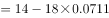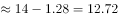亿人，与C项最接近。

故正确答案为C。

---

### 第 4 题　qid 2452613 · 比重

全国大专及以上受教育程度人口占总人口比重提高最多的时期是

- **A**. 1981-1990年
- **B**. 1991-2000年
- **C**. 2001-2010年　✅
- **D**. 2011-2018年

**答案**：C

**官方解析**

定位文字资料第三段“1982年末大专及以上受教育程度人口仅占总人口的，1990年末为，2000年末为，2010年末为，2018年末达到”。选项各时间段全国大专及以上受教育程度人口占总人口比重如下：

A项：1981-1990年：资料没有给出1980年末大专及以上受教育程度的人口占总人口的比重，无法计算1981-1990年比重提高的百分点，但一定低于1990年末的比重1.4%，即1.4个百分点。

B项：1991-2000年：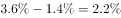，即2.2个百分点。

C项：2001-2010年：，即5.3个百分点。

D项：2011-2018年：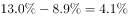，即4.1个百分点。

则比重提高最多的时期是2001-2010年。

故正确答案为C。

---

### 第 5 题　qid 2452616 · 综合

从上述资料不能推出的是

- **A**. 
2015年我国人口比上年增加711万人
　✅
- **B**. 
2013-2018年我国劳动年龄人口总量逐年减少

- **C**. 
2018年末我国劳动年龄人口占总人口的比重高于

- **D**. 
2018年末我国受教育程度为高中的人口多于2010年末

**答案**：A

**官方解析**

A项：定位文字资料第一段“1991-2018年，我国人口年均增加878万人，自2001年以来年均增加711万人”。年均增加711万人不代表每年都增加711万人，则无法推断2015年我国人口比上年增加多少，错误。

B项：定位文字资料第二段“在2012年末我国劳动年龄人口总量达到峰值9.22亿人，后增量由正转负，2018年末为8.97亿人”。增量由正转负，则2012年之后我国劳动年龄人口总量逐年减少，正确。

C项：定位文字资料第一、二段可知，2018年末我国总人口近14亿人，劳动年龄人口为8.97亿人，则比重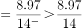，正确。

D项：定位文字资料第三段“1982年末全国高中及以上受教育程度人口占总人口的······2010年末达到，2018年末提高到。1982年末大专及以上受教育程度人口仅占总人口的······2010年末为，2018年末达到”，则2010年末高中人口占总人口的比重为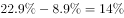，2018年末为。定位文字资料第一段，“1991年以来，我国人口增长率稳步下降，最终在左右的增速上保持平稳”，则2010年末到2018年末我国总人口平稳上升，即2018年末的总人口多于2010年末，同时2018年末我国受教育程度为高中的人口占总人口的比重高于2010年末，因此2018年末我国受教育程度为高中的人口多于2010年末，正确。

本题为选非题，故正确答案为A。

---

## 材料 2

        2019年1-10月，江苏民航机场旅客吞吐量4901万人次，同比增长，增速比华东地区（六省一市）高6.2个百分点，比上海高9.7个百分点，比浙江高5.7个百分点，比山东高4.4个百分点，比福建高8.7个百分点，比江西高6.9个百分点，与安徽持平。

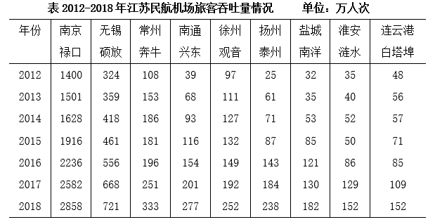

### 第 6 题　qid 2452566 · 增长

2019年1-10月，江苏民航机场旅客吞吐量同比增加

- **A**. 398万人次
- **B**. 435万人次
- **C**. 579万人次　✅
- **D**. 657万人次

**答案**：C

**官方解析**

根据题干“2019年1-10月······同比增加”，且选项带单位，可判定本题为增长量计算问题。定位文字资料“2019年1-10月，江苏民航机场旅客吞吐量4901万人次，同比增长”，根据公式：，则题干所求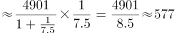万人次，与C项最接近。

故正确答案为C。

---

### 第 7 题　qid 2452571 · 增长

2013-2018年江苏9个民航机场中旅客吞吐量逐年增加的机场个数是

- **A**. 6个
- **B**. 7个　✅
- **C**. 8个
- **D**. 9个

**答案**：B

**官方解析**

定位表格资料可得2013-2018年江苏9个民航机场每年旅客吞吐量情况。由表格数据可得，旅客吞吐量逐年增加的机场是南京禄口、无锡硕放、南通兴东、徐州观音、扬州泰州、盐城南洋、连云港白塔埠，共7个。
故正确答案为B。

---

### 第 8 题　qid 2452576 · 增长

2019年1-10月，华东地区民航机场旅客吞吐量同比增速最慢的省（市）是

- **A**. 上海　✅
- **B**. 江西
- **C**. 福建
- **D**. 山东

**答案**：A

**官方解析**

根据题干“2019年1—10月······同比增速最慢的省（市）是”，可判定本题为一般增长率比较问题。定位文字资料“2019年1-10月，江苏民航机场旅客吞吐量4901万人次，同比增长，增速······比上海高9.7个百分点······比山东高4.4个百分点，比福建高8.7个百分点，比江西高6.9个百分点”，则2019年1-10月，选项中各省（市）民航机场旅客吞吐量的同比增速分别为：A项，上海为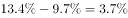；B项，江西为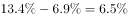；C项，福建为；D项，山东为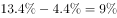。同比增速最慢的是上海。

故正确答案为A。

---

### 第 9 题　qid 2452582 · 增长

2013-2018年江苏9个民航机场中旅客吞吐量年均增速最快的机场是

- **A**. 南京禄口
- **B**. 南通兴东
- **C**. 扬州泰州　✅
- **D**. 盐城南洋

**答案**：C

**官方解析**

根据题干“2013—2018年······年均增速最快的机场是”，可判定本题为年均增长率比较问题。根据公式：，年份差（）相同，比较年均增速大小只需比较。定位表格资料可知，2012年南京禄口民航机场旅客吞吐量为1400万人次，2018年为2858万人次；2012年南通兴东民航机场旅客吞吐量为39万人次，2018年为277万人次；2012年扬州泰州民航机场旅客吞吐量为25万人次，2018年为238万人次；2012年盐城南洋民航机场旅客吞吐量为32万人次，2018年为182万人次。选项中各机场2013-2018年旅客吞吐量的分别为：A项，南京禄口为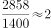；B项，南通兴东为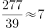；C项，扬州泰州为；D项，盐城南洋为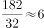。旅客吞吐量年均增速最快的机场是扬州泰州。

故正确答案为C。

---

### 第 10 题　qid 2452588 · 综合

从上述资料中能够推出的是

- **A**. 2019年1-10月安徽民航机场旅客吞吐量在华东地区同比增加最多
- **B**. 2018年南京禄口民航机场旅客吞吐量大于江苏其他8个民航机场之和　✅
- **C**. 2019年1-10月上海民航机场旅客吞吐量占华东地区的比重同比有所提高
- **D**. 2013-2018年常州奔牛民航机场旅客吞吐量年均增量比连云港白塔埠的多2倍多

**答案**：B

**官方解析**

A项：定位文字资料，华东地区中除江苏外，其余省市仅给出2019年1-10月民航机场旅客吞吐量同比增速与江苏民航机场同比增速的关系，无法推出同比增长量的大小关系，错误。

B项：定位表格资料可知各民航机场2018年旅客吞吐量数据。南京禄口民航机场为2858万人次，其余8个民航机场旅客吞吐量之和为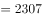万人次，因此2018年南京禄口民航机场旅客吞吐量大于江苏其他8个民航机场之和，正确。

C项：定位文字资料“2019年1-10月，江苏民航机场旅客吞吐量4901万人次，同比增长，增速比华东地区（六省一市）高6.2个百分点，比上海高9.7个百分点”，则华东地区同比增速为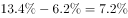，上海同比增速为，根据两期比重比较结论，部分增长率（）整体增长率（），比重同比下降，错误。

D项：定位表格资料可知，2012年常州奔牛民航机场旅客吞吐量为108万人次，2018年为333万人次；2012年连云港白塔埠民航机场旅客吞吐量为48万人次，2018年为152万人次。根据公式：年均增长量，2013-2018年常州奔牛民航机场旅客吞吐量年均增量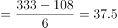万人次，连云港白塔埠民航机场旅客吞吐量年均增量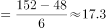万人次，前者比后者多倍，错误。

故正确答案为B。

---

## 材料 3

        2019年2月中下旬，某市统计局随机抽取2000名在该市居住半年以上的18～65周岁居民，就其2019年春节期间的消费情况进行了调查。调查结果显示：与上年春节相比，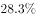的受访居民消费支出有所增加，的受访居民消费支出基本持平。

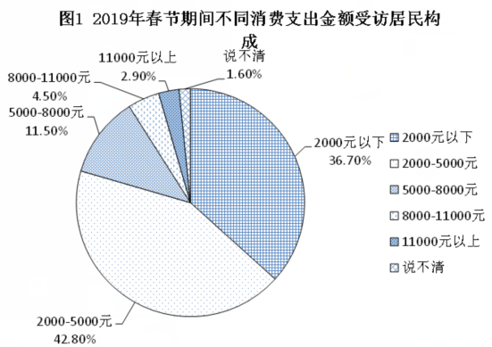                                                     

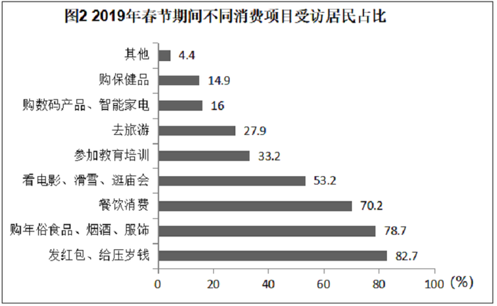                                                                          

### 第 11 题　qid 2452646 · 综合

受访居民中，2019年春节期间消费支出多于上年的人数与少于上年的人数相差：

- **A**. 274人
- **B**. 292人　✅
- **C**. 594人
- **D**. 886人

**答案**：B

**官方解析**

根据题干“受访居民中······人数相差”，结合文字材料“的受访居民消费支出有所增加，的受访居民消费支出基本持平”，可判定本题为现期比重问题。2019年春节期间消费支出少于上年的人数占比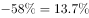，消费支出多于上年的人数消费支出少于上年的人数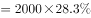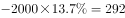人。

故正确答案为B。

---

### 第 12 题　qid 2452647 · 综合

2019年春节期间有“餐饮消费”的受访居民中，一定有人：

- **A**. 参加教育培训　✅
- **B**. 去旅游
- **C**. 购保健产品
- **D**. 购数码产品、智能家电

**答案**：A

**官方解析**

根据题干“2019年······受访居民中······”，结合选项为不同消费项目，可判定本题为现期比重问题。定位图2，2019年春节期间不同消费项目中有“消费餐饮”的受访居民占比为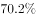；结合选项，受访居民参加教育培训的占比为，二者占比之和为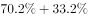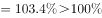，超过整体，说明二者之间必然有交集，也就是说，春节期间有“餐饮消费”的受访居民中，一定有人参加教育培训。

故正确答案为A。

---

### 第 13 题　qid 2452648 · 综合

2019年春节期间消费支出在2000元以下的受访居民中，“发红包、给压岁钱”的至少占

- **A**. 

- **B**. 

- **C**. 

- **D**. 

　✅

**答案**：D

**官方解析**

根据题干“2019年······至少占”，结合选项为百分数，可判定本题为现期比重问题。定位图1可知春节期间消费支出在2000元以下的受访居民占比为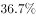，则消费支出在2000元以下的受访居民人数为人；定位图2可知“发红包、给压岁钱”的受访居民占比为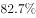，则“发红包、给压岁钱”的受访居民人数为人，因为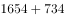人，证明消费支出在2000元以下的受访居民与发红包、给压岁钱的受访居民有交集，所以消费支出在2000元以下的受访居民中，“发红包、给压岁钱”的人数至少为人，所求。

故正确答案为D。

---

### 第 14 题　qid 2452649 · 综合

2019年春节期间消费支出在5000元以上的受访居民人数有可能是：

- **A**. 320人
- **B**. 388人　✅
- **C**. 420人
- **D**. 456人

**答案**：B

**官方解析**

根据题干“2019年······受访居民人数······”，可判断本题为现期比重问题。定位文字资料可知受访居民人数为2000人。定位图1可得，5000~8000元、8000~11000元、11000元以上的人数占受访居民的比重分别为、和，根据公式：部分，可得该部分受访市民人数为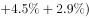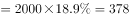人。说不清的人数占受访居民的比重为，人数为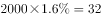人，故消费支出在5000元以上的受访居民人数应大于或等于378人且小于或等于人。结合选项，只有B项388人在此范围内。

故正确答案为B。

---

### 第 15 题　qid 2452651 · 综合

关于2019年春节期间消费，从上述资料中能够推出的是：

- **A**. 
“购年俗食品、烟酒、服饰”的受访居民中没有人消费支出超过8000元

- **B**. 
消费支出与上年基本持平的受访居民中有16人消费支出为2000-5000元

- **C**. 
受访居民中去“看电影、滑雪、逛庙会”的比“参加教育培训”的多400人
　✅
- **D**. 
至少有的受访居民同时选择“购保健产品”“购数码产品、智能家电”和“去旅游”

**答案**：C

**官方解析**

A项：定位图2可知，“购年俗食品、烟酒、服饰”的受访居民占比为；定位图1可知，消费支出超过8000元，一定包括消费支出8000~11000元和11000元以上，表示“说不清”的受访居民也有可能有人的消费支出超过8000元，他们的占比分别为、、，三者占比之和为；“购年俗食品、烟酒、服饰”的受访居民和消费支出可能超过8000元受访居民占比之和至多为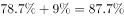，小于整体，所以二者之间可能没有交集，故不能确定“购年俗食品、烟酒、服饰”的受访居民中有没有人消费支出超过8000元，错误。

B项：定位文字资料可知，的受访居民消费支出与上年基本持平；定位图1可知消费支出为2000~5000元的受访者占比为，因为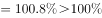，所以二者有交集，可以确定消费支出与上年基本持平的受访居民中有消费支出为2000~5000元的人，但无法确定具体人数，错误.

C项：定位图2可知，受访居民中去“看电影、滑雪、逛庙会”的占比为，受访居民中“参加教育培训”的占比为，二者人数相差人，正确.

D项：定位图2可知，“购保健产品”的受访居民占比为，“购数码产品、智能家电”的受访居民占比为，“去旅游”的受访居民占比为，三者占比之和为，故三者之间可能没有交集，无法确定关系，错误。

故正确答案为C。

---

## 材料 4

        2019年上半年，全国快递业务量完成277.5亿件，同比增长25.7%；业务收入完成3396.7亿元，同比增长23.7%。6月份，全国快递业务量完成54.6亿件，同比增长29.1%；业务收入完成643.2亿元，同比增长26.5%。

        2019年6月，国家邮政局和各省（区、市）邮政管理局接到消费者对快递服务问题申诉42840件，环比下降0.3%，同比下降10.1%；处理的申诉中，有效申诉量1479件，环比下降5.7%，同比下降68.5%。

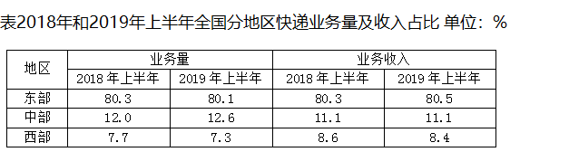

### 第 16 题　qid 2452581 · 增长

2019年上半年，全国异地快递业务量同比增长（  ）

- **A**. 24.9%
- **B**. 29.7%
- **C**. 33.8%　✅
- **D**. 36.1%

**答案**：C

**官方解析**

根据题干“2019年上半年······同比增长”，结合选项是百分数，可判定本题为一般增长率计算问题。定位图形资料可得，2019年上半年全国异地快递业务量为220.4亿件，2018年上半年全国异地快递业务量为164.7亿件，根据公式：增长率，所求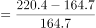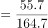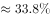。

故正确答案为C。

---

### 第 17 题　qid 2452590 · 增长

2019年上半年，快递业务收入同比增长最快、最慢的地区分别是（  ）

- **A**. 东部地区、中部地区
- **B**. 东部地区、西部地区　✅
- **C**. 中部地区、东部地区
- **D**. 中部地区、西部地区

**答案**：B

**官方解析**

根据题干“2019年上半年······同比增长最快、最慢······”，可判定本题为一般增长率比较问题。设2019年上半年全国快递业务总收入为A，2018年上半年全国快递业务总收入为B，定位文字资料第一段可知，2019年上半年全国快递业务收入同比增长23.7%，即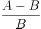=23.7%；定位表格资料可得2018年上半年、2019年上半年各地区快递业务收入占比，结合公式：部分=整体×比重，增长率，可得各地区快递业务收入同比增长率如下：

东部地区：增长率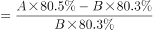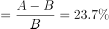，即东部地区快递业务收入增长率大于23.7%；

中部地区：增长率；

西部地区：增长率，即西部地区快递业务收入增长率小于23.7%。

故快递业务收入同比增长最快的地区为东部地区，最慢的地区为西部地区。

故正确答案为B。

---

### 第 18 题　qid 2452595 · 综合

2018年上半年，中部地区快递业务收入为（  ）

- **A**. 236.1亿元
- **B**. 285.3亿元
- **C**. 304.8亿元　✅
- **D**. 377.0亿元

**答案**：C

**官方解析**

根据题干“2018年上半年······收入为”，结合资料时间为2019年，可判定本题为基期计算问题。定位文字资料第一段可得，2019年上半年全国快递业务收入完成3396.7亿元，同比增长，根据公式：，2018年上半年全国快递业务收入为亿元；定位表格资料可得，中部地区2018年上半年业务收入占比为，根据公式：部分=整体×比重，2018年上半年中部地区快递业务收入为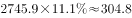亿元。

故正确答案为C。

---

### 第 19 题　qid 2452599 · 综合

2018年6月，国家邮政局和各省（区、市）邮政管理局处理的快递服务有效申诉量为（  ）

- **A**. 1479件
- **B**. 2568件
- **C**. 3159件
- **D**. 4695件　✅

**答案**：D

**官方解析**

根据题干“2018年6月······有效申诉量为”，结合资料时间为2019年，可判定本题为基期计算问题。定位文字资料第二段可得，2019年6月，国家邮政局和各省（区、市）邮政管理局处理的快递服务有效申诉量1479件，同比下降68.5%，根据公式：，故所求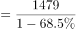件。

故正确答案为D。

---

### 第 20 题　qid 2452601 · 综合

从上述资料不能推出的是（  ）

- **A**. 2019年上半年，东部地区快递业务平均每件收入同比增加　✅
- **B**. 2019年上半年，全国同城快递业务量的比重同比降低
- **C**. 2019年上半年，西部地区快递业务量和快递业务收入的比重都同比降低
- **D**. 2019年5月，国家邮政局和各省（区、市）邮政管理局接到消费者对快递服务问题申诉不足44000件

**答案**：A

**官方解析**

A项：定位文字资料第一段可知，2019年上半年，全国快递业务量完成277.5亿件，同比增长；业务收入完成3396.7亿元，同比增长；定位表格资料可知东部地区业务量及业务收入占比。根据公式：平均每件收入，2019年上半年东部地区快递业务平均每件收入为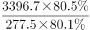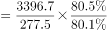元；2018年上半年东部地区快递业务平均每件收入为=≈元，故2019年上半年，东部地区快递业务平均每件收入同比降低，错误。

B项：定位图形资料可知，2019年上半年同城快递业务量为50.8亿件，2018年上半年同城快递业务量为50.9亿件，则同城快递业务量增速为=；定位文字资料第一段可得，2019年上半年，全国快递业务量同比增长；根据两期比重比较方法可知，，，即，故比重同比降低，正确。

C项：定位表格资料可知，西部地区2019年上半年、2018年上半年业务量占比分别为、，2019年上半年、2018年上半年业务收入占比分别为、，故西部地区快递业务量和快递业务收入的比重都同比降低，正确。

D项：定位文字资料第二段可知，2019年6月，国家邮政局和各省（区、市）邮政管理局接到消费者对快递服务问题申诉42840件，环比下降。根据公式：，2019年5月接到消费者对快递服务问题申诉件，由于远小于，所以件，正确。

本题为选非题，故正确答案为A。

---
