# 2020年江苏省公务员录用考试《行测》题（C类）（网友回忆版）

> 资料分析 · 20 题 · 江苏 2020

## 材料 1

        新中国成立70年来，我国人口由1949年末的5.4亿人增加到2018年末的近14亿人。其中，从1949年末到1970年末，我国人口由5.4亿人增加到8.3亿人；1971年末至1980年末，全国人口由8.5亿人增加到9.9亿人；20世纪80年代，全国人口由1981年末的10.0亿人增加到1990年末的11.4亿人；1991年以来，我国人口增长率稳步下降，最终在左右的增速上保持平稳。1991-2018年，我国人口年均增加878万人，自2001年以来年均增加711万人。

        1953年末全国16-59岁劳动年龄人口为3.10亿人，1964年末为3.53亿人，1982年、1990年、2000年和2010年四次人口普查数据显示，我国劳动年龄人口分别为5.67亿人、6.99亿人、8.08亿人和9.16亿人。在2012年末我国劳动年龄人口总量达到峰值9.22亿人后增量由正转负，2018年末为8.97亿人。

        新中国成立之初，全国的人口都是文盲。1982年末全国高中及以上受教育程度人口占总人口的，1990年末占，2000年末占，2010年末达到，2018年末提高到。1982年末大专及以上受教育程度人口仅占总人口的，1990年末为，2000年末为，2010年末为，2018年末达到。

### 第 1 题　qid 2452562 · 增长

1981-1990年这十年，全国人口总增长率是

- **A**. 

- **B**. 

　✅
- **C**. 

- **D**. 

**答案**：B

**官方解析**

根据题干“1981-1990年这十年，全国人口总增长率是”，且选项均为百分数，可判定本题为一般增长率问题。定位文字资料第一段“1971年末至1980年末，全国人口由8.5亿人增加到9.9亿人；20世纪80年代，全国人口由1981年末的10.0亿人增加到1990年末的11.4亿人”。题干求得是1981-1990年这十年，因此现期是1990年，基期是1980年，代入公式：增长率，则题干所求。

故正确答案为B。

---

### 第 2 题　qid 2452609 · 增长

用、、分别表示四次人口普查间的全国劳动年龄人口年均增长率，下列关系正确的是

- **A**. 

　✅
- **B**. 

- **C**. 

- **D**. 

**答案**：A

**官方解析**

根据题干“······年均增长率······”，且选项为排序，可判定本题为年均增长率的比较问题。定位文字资料第二段“1982年、1990年、2000年和2010年四次人口普查数据显示，我国劳动年龄人口分别为5.67亿人、6.99亿人、8.08亿人和9.16亿人”。1990-2000年与2000-2010年年份差相同，可直接利用比较。1990-2000年：；2000-2010年：；由于分子大、分母小的分数值大，故，则，排除B项。因为1982-1990年的年份差少于1990-2000年，且，所以。因此。

故正确答案为A。

---

### 第 3 题　qid 2452612 · 综合

2000年末全国人口为

- **A**. 11.6亿人
- **B**. 12.1亿人
- **C**. 12.6亿人　✅
- **D**. 13.1亿人

**答案**：C

**官方解析**

根据题干“2000年末全国人口为”，结合资料所给时间为2018年，可判定本题为基期量的计算问题。定位文字资料第一段“新中国成立70年来，我国人口由1949年末的5.4亿人增加到2018年末的近14亿人······自2001年以来年均增加711万人”，则2000年末全国人口亿人，与C项最接近。

故正确答案为C。

---

### 第 4 题　qid 2452613 · 比重

全国大专及以上受教育程度人口占总人口比重提高最多的时期是

- **A**. 1981-1990年
- **B**. 1991-2000年
- **C**. 2001-2010年　✅
- **D**. 2011-2018年

**答案**：C

**官方解析**

定位文字资料第三段“1982年末大专及以上受教育程度人口仅占总人口的，1990年末为，2000年末为，2010年末为，2018年末达到”。选项各时间段全国大专及以上受教育程度人口占总人口比重如下：

A项：1981-1990年：资料没有给出1980年末大专及以上受教育程度的人口占总人口的比重，无法计算1981-1990年比重提高的百分点，但一定低于1990年末的比重1.4%，即1.4个百分点。

B项：1991-2000年：，即2.2个百分点。

C项：2001-2010年：，即5.3个百分点。

D项：2011-2018年：，即4.1个百分点。

则比重提高最多的时期是2001-2010年。

故正确答案为C。

---

### 第 5 题　qid 2452616 · 综合

从上述资料不能推出的是

- **A**. 
2015年我国人口比上年增加711万人
　✅
- **B**. 
2013-2018年我国劳动年龄人口总量逐年减少

- **C**. 
2018年末我国劳动年龄人口占总人口的比重高于

- **D**. 
2018年末我国受教育程度为高中的人口多于2010年末

**答案**：A

**官方解析**

A项：定位文字资料第一段“1991-2018年，我国人口年均增加878万人，自2001年以来年均增加711万人”。年均增加711万人不代表每年都增加711万人，则无法推断2015年我国人口比上年增加多少，错误。

B项：定位文字资料第二段“在2012年末我国劳动年龄人口总量达到峰值9.22亿人，后增量由正转负，2018年末为8.97亿人”。增量由正转负，则2012年之后我国劳动年龄人口总量逐年减少，正确。

C项：定位文字资料第一、二段可知，2018年末我国总人口近14亿人，劳动年龄人口为8.97亿人，则比重，正确。

D项：定位文字资料第三段“1982年末全国高中及以上受教育程度人口占总人口的······2010年末达到，2018年末提高到。1982年末大专及以上受教育程度人口仅占总人口的······2010年末为，2018年末达到”，则2010年末高中人口占总人口的比重为，2018年末为。定位文字资料第一段，“1991年以来，我国人口增长率稳步下降，最终在左右的增速上保持平稳”，则2010年末到2018年末我国总人口平稳上升，即2018年末的总人口多于2010年末，同时2018年末我国受教育程度为高中的人口占总人口的比重高于2010年末，因此2018年末我国受教育程度为高中的人口多于2010年末，正确。

本题为选非题，故正确答案为A。

---

## 材料 2

根据以下资料，回答116～120题

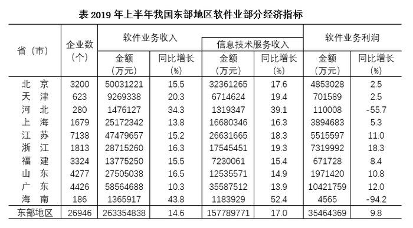 

### 第 6 题　qid 2452705 · 综合

2019年上半年，东部地区软件业务收入利润率是

- **A**. 

　✅
- **B**. 
 

- **C**. 
 

- **D**. 

**答案**：A

**官方解析**

根据题干“2019年上半年······利润率是”，可判定本题为现期比重问题。定位表格最后一行可得，2019年上半年我国东部地区软件业务利润为35464369万元，软件业务收入为263354838万元。根据公式：利润率，可得所求利润率，与A项最接近。

故正确答案为A。

---

### 第 7 题　qid 2452711 · 综合

下列图形中，对2019年上半年东部地区各省（市）软件业务收入构成表示正确的是

- **A**. A
- **B**. B　✅
- **C**. C
- **D**. D

**答案**：B

**官方解析**

根据题干“······2019年上半年······收入构成······”，结合选项均为饼形图，可判定本题为现期比重问题。定位表格资料可得2019年上半年东部地区软件业务总收入以及各省（市）软件业务收入。根据公式：比重，可知分母一致，分子越大，比重越大。分别分析各个选项。

A项：图中北京占比大于广东，但在表格资料中，北京（50031221万元）广东（58564688万元），错误。

C项：图中江苏占比大于北京，但在表格资料中，江苏（47479657万元）北京（50031221万元），错误。

D项：图中北京、江苏和山东三个省（市）的总和占东部地区的比重超过，但在表格资料中，北京、江苏和山东三个省（市）的总和占东部地区的比重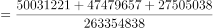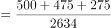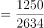，错误。

故正确答案为B。

---

### 第 8 题　qid 2452709 · 平均数

2019年上半年，东部地区各省（市）软件企业的软件业务平均利润的最大值是

- **A**. 2320万元
- **B**. 2355万元
- **C**. 4038万元　✅
- **D**. 4969万元

**答案**：C

**官方解析**

根据题干“2019年上半年······平均利润······”，可判定本题为现期平均数问题。定位表格资料可知2019年上半年我国东部地区各省（市）软件业务利润及企业数，根据公式：，可得2019年上半年我国东部地区各省（市）软件企业平均利润：北京，万元；天津，万元；河北，万元；上海，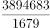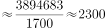万元；江苏，=1000万元；浙江，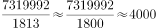万元；福建，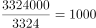万元；山东，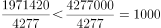万元；广东，；海南，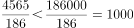万元。可得浙江的最大，且与C项最接近。

故正确答案为C。

---

### 第 9 题　qid 2452707 · 增长

东部地区各省(市)中，2019年上半年软件业务收入占地区软件业务总收入的比重同比提高的有

- **A**. 5个
- **B**. 6个
- **C**. 7个
- **D**. 8个　✅

**答案**：D

**官方解析**

根据题干“······2019年上半年······占······比重同比提高的有”，可判定本题为两期比重问题。定位表格资料可知2019年上半年我国东部地区各省（市）软件业务收入同比增长率（a）、东部地区软件业务总收入同比增长率（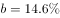），根据两期比重结论“若 ，则比重同比提高”，满足题干要求的有北京（）、天津（）、河北（）、江苏（）、浙江（）、福建（）、山东（）、海南（），共8个省（市）。

故正确答案为D。

---

### 第 10 题　qid 2452713 · 综合

关于2019年上半年东部地区软件业的发展情况，从上述资料不能推出的是

- **A**. 江苏信息技术服务收入同比增加额多于浙江
- **B**. 软件业务收入同比增加最多的省（市）是广东　✅
- **C**. 江苏软件企业数是三个直辖市企业数总和的1.3倍
- **D**. 所有省（市）的信息技术服务收入同比增速都在两位数以上

**答案**：B

**官方解析**

A项：定位表格资料可知，2019年上半年江苏信息技术服务收入为26631665万元，同比增长；浙江信息技术服务收入为17545451万元，同比增长。根据公式：增长量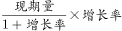，可得江苏信息技术服务收入增加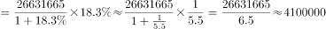万元，浙江信息技术服务收入增加万元，江苏多于浙江，正确。

B项：定位表格资料可知2019年上半年东部地区各省（市）软件业务收入及同比增长率，根据公式：增长量，可得广东软件业务收入同比增长量万元，北京软件业务收入同比增长量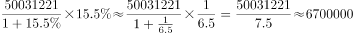万元，广东软件业务收入同比增长量低于北京，错误。

C项：定位表格资料可知，江苏软件企业数为7138个，三个直辖市（北京、天津、上海）软件企业数总和为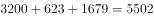个，所求倍数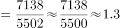，正确。

D项：定位表格资料可知2019年上半年东部地区各省（市）信息技术服务收入同比增速均大于，即同比增速都在两位数以上，正确。

本题为选非题，故正确答案为B。

---

## 材料 3

        某研究机构从全国随机抽取10个市的儿童家长，对其进行“我国儿童校外生活状况”的问卷调查，回收有效问卷15000份。调查结果显示：对儿童校外生活表示“很重视”的家长占以上，表示“很满意”或“比较满意”的占；上学日，儿童日平均使用电子产品用时43.2分钟，其中利用电子产品学习用时13.9分钟，看动画等娱乐用时16.6分钟；周末，乡镇儿童日平均使用电子产品用时108.2分钟，市区儿童88.4分钟。

### 第 11 题　qid 2452775 · 比重

在该次调查中，市区儿童占被调查儿童的比重是

- **A**. 

- **B**. 

- **C**. 

　✅
- **D**. 

**答案**：C

**官方解析**

根据题干“······占······比重是”，可判定本题为现期比重问题。定位图形资料可知，周末儿童平均使用电子产品的时间为96.3分钟；定位文字资料可知，周末，乡镇儿童日平均使用电子产品用时108.2分钟，市区儿童88.4分钟。利用线段法求解乡镇和市区儿童的数量比为。乡镇和市区儿童的数量之比，乡镇儿童占7.9份，市区儿童占11.9份，则市区儿童占被调查儿童的比重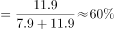。

故正确答案为C。

---

### 第 12 题　qid 2452777 · 平均数

儿童周末用于外出游玩、玩耍和锻炼的日平均用时总和比做作业的多

- **A**. 66.2分钟
- **B**. 82.0分钟
- **C**. 87.0分钟　✅
- **D**. 92.1分钟

**答案**：C

**官方解析**

定位图形资料可知，儿童周末用于外出游玩、玩耍和锻炼的日平均用时分别为118.3分钟、49.9分钟、34.7分钟，用于做作业的日平均用时为115.9分钟。则儿童周末用于外出游玩、玩耍和锻炼的日平均用时总和比做作业的多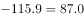分钟。

故正确答案为C。

---

### 第 13 题　qid 2452780 · 比重

对儿童校外生活表示“很满意”或“比较满意”的家长中，表示“很重视”的家长占比可能是

- **A**. 

- **B**. 
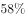

- **C**. 

- **D**. 

　✅

**答案**：D

**官方解析**

根据题干“······占比······”，可判定本题为现期比重问题。定位文字资料可知，对儿童校外生活表示“很重视”的家长占以上，表示“很满意”或“比较满意”的占。对儿童校外生活表示“很重视”的家长占比大于，则不是很重视的占比小于，若不是很重视的家长均表示“很满意”或“比较满意”，则在表示“很满意”或“比较满意”的家长中，不是很重视的家长占比应小于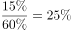，则表示“很重视”的家长占比应大于，只有D项满足。

故正确答案为D。

---

### 第 14 题　qid 2452781 · 平均数

儿童周末校外活动日平均用时是上学日日均用时2倍以上的活动类型有

- **A**. 2类
- **B**. 3类　✅
- **C**. 4类
- **D**. 5类

**答案**：B

**官方解析**

根据题干“······是······2倍以上的活动类型有”，可判定本题为倍数比较问题，所求活动类型应满足：周末日平均用时&gt;上学日日平均用时×2。定位图形资料，满足上述条件的活动类型有：外出游玩，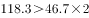；使用电子产品，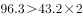；社会学习，。共3类。

故正确答案为B。

---

### 第 15 题　qid 2452784 · 综合

从上述调查资料中能够推出的是

- **A**. 
对儿童校外生活表示“很重视”的家长不足12000人

- **B**. 
市区儿童日平均使用电子产品的用时不及乡镇儿童的

- **C**. 
乡镇儿童上学日利用电子产品看动画等娱乐的平均用时17.3分钟

- **D**. 
儿童上学日利用电子产品学习的用时不足使用电子产品用时的三分之一
　✅

**答案**：D

**官方解析**

A项：定位文字资料“回收有效问卷15000份······对儿童校外生活表示“很重视”的家长占以上”，则所求家长人数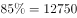人，超过12000人，错误。

B项：结合文字资料和图形资料，资料仅给出周末乡镇儿童与市区儿童使用电子产品的日平均用时，以及全部儿童上学日与周末日平均用时，无法推出市区儿童与乡镇儿童的日平均使用电子产品的用时，错误。

C项：文字资料仅给出上学日全部儿童利用电子产品看动画等娱乐的日平均用时，无法推出乡镇儿童的日平均用时，错误。

D项：定位文字资料可知，上学日，儿童日平均使用电子产品用时43.2分钟，其中利用电子产品学习用时13.9分钟，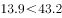，正确。

故正确答案为D。

---

## 材料 4

        2018年末，全国共有各类文物机构10160个，比上年末增加229个。其中，文物保护管理机构3550个，占；博物馆4918个，占。全国文物机构从业人员16.26万人，比上年末增加0.11万人。其中，高级职称占，中级职称占。全国文物机构拥有文物藏品4960.61万件，比上年末增长。其中，博物馆文物藏品3754.25万件，文物商店文物藏品751.40万件。

图  2010—2018年全国文物机构及其从业人员情况

### 第 16 题　qid 2452733 · 综合

2018年末全国文物机构从业人员中，不具备中高级职称的有

- **A**. 12.46万人
- **B**. 13.22万人　✅
- **C**. 14.89万人
- **D**. 15.28万人

**答案**：B

**官方解析**

根据题干“2018年末······中，不具备中高级职称的有”，结合资料给出全部从业人员数及中高级职称人数占比，可判定本题为现期比重问题。定位文字资料可得，2018年末，全国文物机构从业人员16.26万人，其中，高级职称占，中级职称占。根据公式：部分=整体×比重，不具备中高级职称的有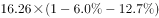万人，与B项最接近。

故正确答案为B。

---

### 第 17 题　qid 2452735 · 比重

2018年末全国博物馆文物藏品、文物商店文物藏品占全国文物机构文物藏品的比重之差为

- **A**. 53.6个百分点
- **B**. 55.2个百分点
- **C**. 60.5个百分点　✅
- **D**. 66.3个百分点

**答案**：C

**官方解析**

根据题干“2018年末······占全国文物机构文物藏品的比重之差为”结合资料时间为2018年末，可判定本题为现期比重问题。定位文字资料可得，2018年末，全国文物机构拥有文物藏品4960.61万件，其中，博物馆文物藏品3754.25万件，文物商店文物藏品751.40万件。根据公式：比重，可得所求比重差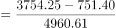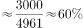，即60个百分点，与C项最接近。

故正确答案为C。

---

### 第 18 题　qid 2452736 · 增长

2011-2018年全国文物机构数增加最多的年份是

- **A**. 2011年
- **B**. 2013年　✅
- **C**. 2015年
- **D**. 2017年

**答案**：B

**官方解析**

根据题干“2011-2018年······增加最多的年份是”，可判定本题为增长量比较问题。定位图形资料可得2010-2018年全国文物机构数，根据公式：增长量现期量基期量，计算出各项年份文物机构数的增长量，进行比较即可。

A项：2011年，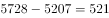个。

B项：2013年，个。

C项：2015年，个。

D项：2017年，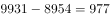个。

综上可知，2013年全国文物机构数增加最多。

故正确答案为B。

---

### 第 19 题　qid 2452737 · 增长

2011-2018年全国文物机构从业人员年均增加

- **A**. 7516人　✅
- **B**. 7821人
- **C**. 8106人
- **D**. 8738人

**答案**：A

**官方解析**

根据题干“2011-2018年······年均增加”，结合选项为“数值单位”，可判定本题为年均增长量计算问题。定位图形资料可得，2010年全国文物机构从业人员数为102471人，2018年为162600人。根据公式：年均增长量，可得2011-2018年全国文物机构从业人员年均增加为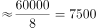人，与A项最接近。

故正确答案为A。

---

### 第 20 题　qid 2452738 · 综合

从上述材料不能推出的是

- **A**. 2011-2018年全国文物机构数呈逐年增加的态势
- **B**. 2018年末全国博物馆数量比文物保护管理机构数量多
- **C**. 2017年末全国文物机构从业人员比上年末增加1100人　✅
- **D**. 2018年末全国文物机构拥有文物藏品比上年末增加100多万件

**答案**：C

**官方解析**

A项：定位图形资料可知，2011-2018年全国文物机构数逐年增加，正确。

B项：定位文字资料可得，2018年末，全国文物保护管理机构3550个，博物馆4918个，博物馆数量多于文物保护管理机构数量，正确。

C项：定位图形资料可得，2017年末全国文物机构从业人员数为161500人，2016年末为151430人，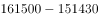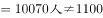人，错误。

D项：定位文字资料可得，2018年末全国文物机构拥有文物藏品4960.61万件，比上年末增长。根据公式：增长量，可得所求增长量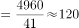万件，正确。

本题为选非题，故正确答案为C。

---
