# 2020年浙江公务员考试《行测》（A类）试题（网友回忆版）

> 资料分析 · 15 题 · 浙江 2020

## 材料 1

        2017年1-4月，T地区批发和零售业商品销售总额为15220亿元，同比增长，其中，限额以上商品销售额达到11107亿元，同比增长；4月份，T地区批发和零售业商品销售总额和限额以上商品销售额分别为3339亿元和2554亿元。

### 第 1 题　qid 2579778 · 综合

2017年一季度，T地区月均批发和零售业商品销售额约为多少亿元？

- **A**. 2851
- **B**. 3960　✅
- **C**. 4591
- **D**. 11881

**答案**：B

**官方解析**

根据题干“2017年一季度，T地区月均······约为多少亿元”，结合材料时间为2017年1-4月及4月，可判定本题为现期平均数计算问题。定位文字材料可得，2017年1-4月，T地区批发和零售业商品销售总额为15220亿元，4月份，T地区批发和零售业商品销售总额为3339亿元。则2017年一季度，T地区月均批发和零售业商品销售额约为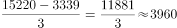亿元。

故正确答案为B。

---

### 第 2 题　qid 2579779 · 增长

2017年4月，T地区限额以上商品批发业销售额同比增速约比当年一季度：

- **A**. 高0.5个百分点
- **B**. 低0.1个百分点
- **C**. 低0.4个百分点
- **D**. 低0.9个百分点　✅

**答案**：D

**官方解析**

根据题干“2017年4月，······同比增速约比······”，结合选项为高低百分点，材料给出2017年1-3月及1-4月具体销售额与同比增速，可判定本题为混合增长率问题。定位表格可得，2017年1-3月T地区限额以上商品批发业销售额为7913亿元，同比增速为，1-4月份销售额为10251亿元，同比增速为。根据“混合居中不正中”可知，2017年4月份其同比增速应小于，可排除A、B项。现期量近似代替基期量比较大小，2017年4月份销售额为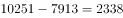亿元亿元，可知其2017年1-4月份的同比增速更接近于2017年1-3月份的同比增速，即2017年4月份同比增速与的距离应大于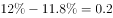个百分点，则2017年4月份其同比增速应小于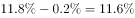。因此2017年4月，T地区限额以上商品批发业销售额同比增速约比当年一季度低个百分点以上，只有D项符合。

故正确答案为D。

---

### 第 3 题　qid 2579782 · 增长

2017年1-4月，不同所有制企业限额以上商品销售额同比增量由小到大排序正确的是：

- **A**. 国有企业、外商及港澳台商企业、民营企业　✅
- **B**. 外商及港澳台商企业、国有企业、民营企业
- **C**. 国有企业、民营企业、外商及港澳台商企业
- **D**. 外商及港澳台商企业、民营企业、国有企业

**答案**：A

**官方解析**

根据题干“2017年1-4月······同比增量由小到大排序······”，结合材料时间为2017年，可判定本题为增长量比较问题。定位表格材料可得：2017年1-4月国有企业限额以上商品销售额为4964亿元，同比增长率为；民营企业限额以上商品销售额为5333亿元，同比增长率为；外商及港澳台商企业限额以上商品销售额为810亿元，同比增长率为。国有企业限额以上商品销售额的增长量亿元；民营企业限额以上商品销售额的增长量亿元；外商及港澳台商企业限额以上商品销售额的增长量亿元。则2017年1-4月，不同所有制企业限额以上商品销售额同比增量由小到大排序为：国有企业、外商及港澳台商企业、民营企业。

故正确答案为A。

---

### 第 4 题　qid 2579789 · 比重

以下哪个饼图最符合2017年4月T地区限额以上商品销售额中不同规模的企业销售额占比关系？

- **A**. 
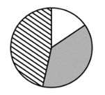
　✅
- **B**. 

- **C**. 
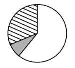

- **D**. 
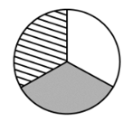

**答案**：A

**官方解析**

根据题干“······2017年4月······占比关系”，结合材料时间为2017年，可判定本题为现期比重问题。定位表格材料可得：

2017年1-4月大型企业限额以上商品销售额为1811亿元，1-3月其限额以上商品销售额为1381亿元，可知2017年4月份大型企业限额以上商品销售额为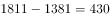亿元；

2017年1-4月中型企业限额以上商品销售额为4498亿元，1-3月其限额以上商品销售额为3533亿元，可知2017年4月份中型企业限额以上商品销售额为亿元；

2017年1-4月小微型企业限额以上商品销售额为4798亿元，1-3月其限额以上商品销售额为3639亿元，可知2017年4月份小微型企业限额以上商品销售额为亿元。

可知2017年4月T地区限额以上商品销售额中：小微型企业中型企业大型企业，排除B、C两项，又因为小微型企业和中型企业明显比大型企业大，排除D项。

故正确答案为A。

---

### 第 5 题　qid 2579790 · 综合

关于2017年T地区限额以上商品销售额，能够从资料中推出的是：

- **A**. 4月批发业及零售业销售额均低于一季度月均数值
- **B**. 一季度，外商及港澳台商企业销售额同比增长100亿元以上
- **C**. 一季度，小微型企业销售额同比增量超过大型企业和中型企业之和　✅
- **D**. 1-4月，限额以上商品销售额占批发和零售业商品销售总额的比重较上年同期有所提升

**答案**：C

**官方解析**

（以下解析中的描述均省略了T地区限额以上商品这个前提。）

A项：定位表格材料，2017年1-4月批发业销售额为10251亿元，1-3月销售额为7913亿元，则4月份销售额为亿元，一季度月均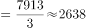亿元，4月份销售额低于一季度月均数值；2017年1-4月零售业销售额为856亿元，1-3月销售额为640亿元，则4月份销售额为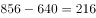亿元，一季度月均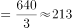亿元，4月份销售额高于一季度月均数值，错误；

B项：定位表格材料，2017年1-3月外商及港澳台商企业销售额为614亿元，同比增长率为，则2017年一季度，外商及港澳台商企业销售额同比增长量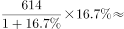亿元亿元，错误；

C项：定位表格材料，2017年1-3月小微型企业销售额为3639亿元，同比增长率为，所以小微型企业销售额同比增长量亿元；2017年1-3月中型企业销售额为3533亿元，同比增长率为，所以中型企业销售额同比增长量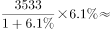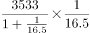亿元；2017年1-3月大型企业销售额为1381亿元，同比增长率为，所以大型企业销售额同比增长量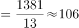亿元；故大、中型企业同比增长量之和为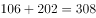亿元小微型企业销售额同比增长量485.2亿元，即小微型企业销售额同比增量超过大型企业和中型企业之和，正确；

D项：定位文字材料，2017年1-4月，T地区批发和零售业商品销售总额为15220亿元，同比增长，其中，限额以上商品销售额达到11107亿元，同比增长。则，，，根据两期比重比较结论，比重较上年同期有所下降，错误。

故正确答案为C。

---

## 材料 2

        2017年，全球对清洁能源的投资为3335亿美元，同比增长，但仍低于2015年的历史峰值3485亿美元。中国的清洁能源投资占全球清洁能源总投资的，占亚太地区清洁能源投资的。

        从主要清洁能源类型看，2017年全球对风能的投资为1070亿美元，风电新增装机容量52.5GW，同比下降；累计装机容量达到539.1GW，同比增长。2017年全球对光伏的投资为1608亿美元，同比增长；光伏新增装机容量99.1GW，同比增长；累计装机容量达到404.5GW。其中，亚太地区新增装机容量73.7GW，累计装机容量221.3GW。（累计装机容量不含报废机器的装机容量）

### 第 6 题　qid 2579803 · 综合

2017年，亚太地区的清洁能源投资约为多少亿美元？

- **A**. 1034
- **B**. 1334
- **C**. 1879　✅
- **D**. 2368

**答案**：C

**官方解析**

根据题干“2017年，亚太地区的清洁能源投资约为······”，结合材料中给出2017年中国的清洁能源投资占全球及亚太地区清洁能源投资的比重，可判定本题为现期比重问题。定位文字材料第一段可得：2017年，全球对清洁能源的投资为3335亿美元，中国的清洁能源投资占全球清洁能源总投资的，占亚太地区清洁能源投资的。根据比重公式：比重，则中国的清洁能源投资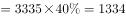亿美元，亚太地区的清洁能源投资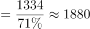亿美元，与C项最接近，C项当选。

故正确答案为C。

---

### 第 7 题　qid 2579806 · 增长

2009-2017年，风电与光伏累计装机容量总计同比增加100GW以上的年份有几个？

- **A**. 2
- **B**. 3　✅
- **C**. 4
- **D**. 5

**答案**：B

**官方解析**

根据题干“······同比增加100GW以上······”，可判定本题为增长量计算问题。定位柱状图，可得2008年-2017年风电与光伏累计装机容量。根据增长量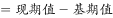，则风电与光伏累计装机容量总计同比增加100GW以上的年份有2015年：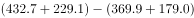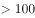GW；2016年：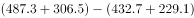GW；2017年：GW，共3个年份。

故正确答案为B。

---

### 第 8 题　qid 2579807 · 比重

2017年，亚太地区光伏新增装机容量占全球比重比其累计装机容量占全球比重：

- **A**. 低10个百分点以内
- **B**. 低10个百分点以上
- **C**. 高10个百分点以内
- **D**. 高10个百分点以上　✅

**答案**：D

**官方解析**

根据题干“2017年，······占······比重”，并且问题时间和材料一致，可判定本题为现期比重问题。定位文字材料第二段可得：2017年全球光伏新增装机容量99.1GW，累计装机容量达到404.5GW，亚太地区新增装机容量73.7GW，累计装机容量221.3GW。故亚太地区光伏新增装机容量占全球比重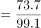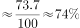，亚太地区光伏累计装机容量占全球比重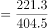。，所以2017年亚太地区光伏新增装机容量占全球比重比其累计装机容量占全球比重高10个百分点以上，D项当选。

故正确答案为D。

---

### 第 9 题　qid 2579811 · 增长

以下哪个折线图最符合2009-2012年全球光伏累计装机容量同比增速的变化趋势？

- **A**. 

　✅
- **B**. 

- **C**. 

- **D**. 

**答案**：A

**官方解析**

根据题干“同比增速的变化趋势”，可判定本题为一般增长率问题。定位柱状图可得：2008-2012年全球光伏累计装机容量分别为：15.8、23.2、40.3、70.5、100.5。根据增长率，可得2009-2012年全球光伏累计装机容量同比增速分别为：、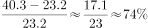、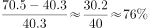、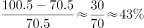。所以2010年和2011年两年增速对应的第二个点和第三个点是折线图中最高的两个点，只有A项满足，A项当选。

故正确答案为A。

---

### 第 10 题　qid 2579813 · 综合

根据资料，下列可以推出的是：

- **A**. 2017年全球对风能投资的同比增速
- **B**. 2016年全球对清洁能源投资的同比增速　✅
- **C**. 2017年亚太地区对光伏投资的同比增量
- **D**. 2008年全球风电累计装机容量的同比增速

**答案**：B

**官方解析**

A项：定位文字材料第二段可得：2017年全球对风能的投资为1070亿美元，风电新增装机容量52.5GW，同比下降。只有全球对风能投资的现期量，无法计算增长率，错误；

B项：定位文字材料第一段可得：2017年，全球对清洁能源的投资为3335亿美元，同比增长，但仍低于2015年的历史峰值3485亿美元。故2016年全球对清洁能源投资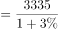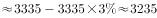亿美元。则2016年全球对清洁能源投资的同比增速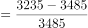，可以推出，正确；

C项：定位文字材料第二段可得：2017年全球对光伏的投资为1608亿美元，同比增长。材料只给出全球对光伏的投资，并未给出亚太地区对光伏投资的相应数据，无法计算增长量，错误；

D项：定位柱状图可得：2008年全球风电累计装机容量为120.7GW，并未给出2007年的数据或同比增量，故无法计算2008年的增长率，错误。

故正确答案为B。

---

## 材料 3

        2018年，从险种来看，财产险业务原保险保费收入10770.08亿元，同比增长；人身险原保险保费收入27246.54亿元，其中寿险业务原保险保费收入20722.86亿元，同比下降；健康险业务原保险保费收入5448.13亿元，同比增长；意外险业务原保险保费收入1075.55亿元，同比增长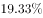。从保费收入结构来看，人身险、财产险的保费占比与上年相比趋于稳定。

### 第 11 题　qid 2579797 · 增长

与2011年相比，2018年中国保险行业原保险保费收入约增长了：

- **A**. 
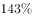

- **B**. 
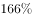
　✅
- **C**. 

- **D**. 
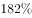

**答案**：B

**官方解析**

根据题干“与2011年相比，2018年······约增长了”，结合选项为百分数，可判定本题为一般增长率问题。定位柱状图1可得，2018年我国保险行业原保险保费收入为3.80万亿元，2011年为1.43万亿元。根据公式“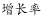”，则所求增长率，B项满足。

故正确答案为B。

---

### 第 12 题　qid 2579798 · 增长

2014～2017年，中国保险行业原保险保费收入同比增速最高的年份是：

- **A**. 2014年
- **B**. 2015年
- **C**. 2016年　✅
- **D**. 2017年

**答案**：C

**官方解析**

根据题干“2014～2017年，······同比增速最高的年份是”，可判定本题为一般增长率的比较问题。定位柱状图1，结合公式“”，可得我国保险行业原保险保费收入各年的增长率分别为：

2014年：；

2015年：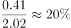；

2016年：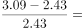；

2017年：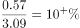；

对比可得，2016年的同比增速最高。

故正确答案为C。

---

### 第 13 题　qid 2579800 · 增长

2018年，下列险种中，原保险保费收入同比增长额最大的是：

- **A**. 财产险业务
- **B**. 寿险业务
- **C**. 意外险业务
- **D**. 健康险业务　✅

**答案**：D

**官方解析**

根据题干“······收入同比增长额最大的是”，可判定本题为增长量比较问题。定位文字材料可知，2018年寿险业务原保险保费收入20722.86亿元，同比下降，收入下降，排除B项。

2018年意外险业务原保险保费收入1075.55亿元，同比增长，2018年健康险业务原保险保费收入5448.13亿元，同比增长。根据增长量比较结论“现期量大，增长率大，则增长额大”可得，健康险业务原保险保费收入增长额意外险业务原保险保费收入增长额，排除C项。

根据公式“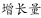”，可得2018年财产险业务原保险保费收入增长额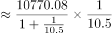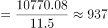亿元；

2018年健康险业务原保险保费收入增长额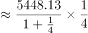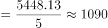亿元；

故原保险保费收入增长额最大的为健康险业务，对应D项。

故正确答案为D。

---

### 第 14 题　qid 2579802 · 综合

2011-2018年，人身险原保险保费收入高于财产险1万亿元以上的年份有几个？

- **A**. 1
- **B**. 2
- **C**. 3　✅
- **D**. 4

**答案**：C

**官方解析**

根据题干“2011-2018年，人身险原保险保费收入高于财产险1万亿元以上的年份有几个”，结合材料所给2011年-2018年中国保险行业原保险保费收入及人身险、财产险原保险保费收入占比，判定本题为现期比重问题。定位两个柱状图，根据公式：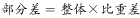，可知：所求差值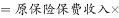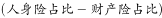。

2011年差值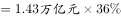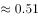万亿元；

2012年差值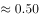万亿元；

2013年差值万亿元；

2014年差值万亿元；

2015年差值万亿元；

2016年差值万亿元。

又因2017年、2018年原保险保费收入均大于2016年（3.09万亿元），比重差不小于2016年比重差（），则2017年、2018年差值均大于2016年差值（1.36万亿元），故人身险原保险保费收入高于财产险1万亿元以上的年份有2016年、2017年、2018年，对应C项。

故正确答案为C。

---

### 第 15 题　qid 2579809 · 综合

根据资料，下列可以推出的是：

- **A**. 
2018年，人身险原保险保费收入同比增速超过
　✅
- **B**. 
2011～2018年，财产险业务原保险保费收入均不超过1万亿元

- **C**. 
2018年，意外险业务原保险保费收入比上年增长了200多亿元

- **D**. 
2011～2018年，中国保险行业原保险保费收入总计超过20万亿元

**答案**：A

**官方解析**

A项：定位柱状图可知，2017年中国保险行业原保险保费收入为3.66万亿元，人身险占比为，根据公式“部分=整体×比重”可得，2017年人身险原保险保费收入万亿元；定位文字材料部分可知，2018年人身险原保险保费收入为27246.54亿元，即约为2.72万亿元，根据公式，所求，正确；

B项：定位柱状图可知，2011～2018年中国保险行业原保险保费收入及财产险占比，根据公式“部分=整体×比重”可得，2018年财产险业务原保险保费收入万亿元万亿元，错误；

C项：定位文字材料可知，2018年，意外险业务原保险保费收入1075.55亿元，同比增长，则2018年意外险业务原保险保费收入比上年增长的量亿元，并非增长200多亿元，错误；

D项：定位柱状图可知，2011～2018年中国保险行业原保险保费收入，则收入总计万亿元万亿元，错误。

故正确答案为A。

---
