# 2020年海南公务员录用考试《行测》试题（网友回忆版）

> 资料分析 · 10 题 · 海南 2020

## 材料 1

        截至2018年底，中国人工智能市场规模约为238.2亿元，同比增长率达到。从中国人工智能企业地域分布情况来看，北京企业数量最多，企业数量为368家；其次为广东，人工智能企业数量为185家；排名第三的是上海，数量为131家。

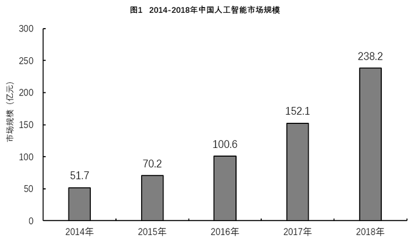

### 第 1 题　qid 2616148 · 综合

图2中排名第二的省（市），其人工智能企业数量的个数约是排名后四位的数量之和的多少倍？

- **A**. 11.3
- **B**. 12.3　✅
- **C**. 12.8
- **D**. 13.3

**答案**：B

**官方解析**

根据题干“···约是···的多少倍”，可判定本题为现期倍数计算问题。定位图2可得：排名第二的省（市）是广东，其人工智能企业数量为185个，排名后四位的为广西、重庆、河南、辽宁，其人工智能企业数量依次为1个、3个、5个、6个。因此所求倍数。

故正确答案为B。

---

### 第 2 题　qid 2616077 · 增长

2015至2018年，中国人工智能市场规模同比增长率最高的年份是：

- **A**. 2015年
- **B**. 2016年
- **C**. 2017年
- **D**. 2018年　✅

**答案**：D

**官方解析**

根据题干“····同比增长率最高···”，可判定本题为一般增长率的比较问题。定位材料图1可知每一年的现期量与基期量，代入增长率公式：

2015年：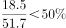；

2016年：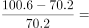；

2017年：；

2018年： 定位文字材料，截至2018年底，中国人工智能市场规模约为238.2亿元，同比增长率达到。

比较可知，2018年增长率最高。

故正确答案为D。

---

### 第 3 题　qid 2616075 · 增长

2017年中国人工智能市场规模同比增长率与2015年相比约：

- **A**. 减少了13.3个百分点
- **B**. 增加了13.3个百分点
- **C**. 减少了15.4个百分点
- **D**. 增加了15.4个百分点　✅

**答案**：D

**官方解析**

根据题干“2017年······同比增长率与2015年相比”，可判定本题为一般增长率问题。定位柱形图1，2017年和2016年中国人工智能市场规模分别为152.1亿元和100.6亿元，则2017年中国人工智能市场规模同比增长率约为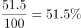，2015年和2014年中国人工智能市场规模分别为70.2亿元和51.7亿元，则2015年中国人工智能市场规模同比增长率约为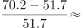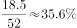，故2017年中国人工智能市场规模同比增长率与2015年相比约增加了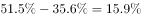，即增加了15.9个百分点，与D项最接近。

故正确答案为D。

---

### 第 4 题　qid 2616074 · 综合

截至2017年底，中国人工智能市场规模约为：

- **A**. 141.1亿元
- **B**. 152.1亿元　✅
- **C**. 156.1亿元
- **D**. 164.1亿元

**答案**：B

**官方解析**

定位柱形图1可得，2017年中国人工智能市场规模约为152.1亿元。

故正确答案为B。

注：若本题没有发现柱形图1的数据，直接看到文字材料，可以按照求解基期量计算。根据文字材料“截至2018年底，中国人工智能市场规模约为238.2亿元，同比增长率达到”，可得2017年中国人工智能市场规模约为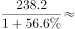亿元，与B项最接近。

---

### 第 5 题　qid 2616098 · 增长

若按照2018年同比增长率，到2019年底中国人工智能市场规模约为：

- **A**. 363亿元
- **B**. 371亿元
- **C**. 373亿元　✅
- **D**. 383亿元

**答案**：C

**官方解析**

根据题干“按照2018年同比增长率，到2019年底···约为”，材料给出的是2018年的数据，可判定本题为现期计算问题。定位文字材料：截至2018年底，中国人工智能市场规模约为238.2亿元，同比增长率达到。根据公式：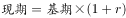，可得2019年底中国人工智能市场规模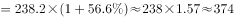亿元，与C项最为接近。

故正确答案为C。

---

## 材料 2

        2019年5月，全国12358价格监管平台受理价格举报、投诉、咨询共计37576件，同比下降，环比下降。其中，价格举报4192件，环比下降；价格投诉2059件，环比下降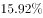；价格咨询31325件，环比下降。平台受理量排名前十的省（市）依次是北京（5786件）、江苏（3528件）、上海（2499件）、重庆（2486件）、河南（2469件）、陕西（2440件）、浙江（2321件）、天津（1571件）、福建（1483件）、广西（1309件）。平台受理量行业分布如下表所示：

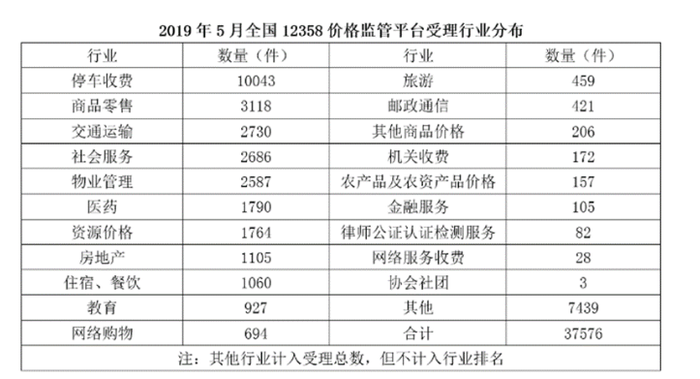

### 第 6 题　qid 2616168 · 综合

2019年4月，平台受理的价格咨询比价格举报约多：

- **A**. 26146件
- **B**. 27133件
- **C**. 28627件　✅
- **D**. 29614件

**答案**：C

**官方解析**

根据题干“2019年4月······比······多”，结合材料时间为2019年5月，可判定本题为基期和差问题。定位文字材料可得，“2019年5月······价格举报4192件，环比下降······价格咨询31325件，环比下降”，则2019年4月，平台受理的价格咨询比价格举报多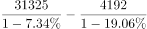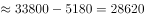件，与C项最接近。

故正确答案为C。

---

### 第 7 题　qid 2616169 · 综合

2019年5月，平台受理量排名第二的省（市）约是排名第九的省（市）的多少倍？

- **A**. 1.4
- **B**. 2.4　✅
- **C**. 3.7
- **D**. 4.4

**答案**：B

**官方解析**

根据题干“2019年5月，······是······的多少倍”，结合材料时间为2019年5月，可判定本题为现期倍数问题。定位文字材料可得，2019年5月，平台受理量排名第二的省（市）为江苏（3528件），排名第九的省（市）为福建（1483件），则2019年5月，平台受理量排名第二的省（市）约是排名第九的省（市）的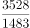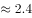倍。

故正确答案为B。

---

### 第 8 题　qid 2616170 · 比重

2019年5月，平台受理量排名前五的行业占受理总数的比重约为：

- **A**. 
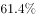

- **B**. 

　✅
- **C**. 
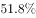

- **D**. 

**答案**：B

**官方解析**

根据题干“2019年5月，······占······的比重约为”，结合材料时间为2019年5月，可判定本题为现期比重问题。定位文字材料，“2019年5月，全国12358价格监管平台受理价格举报、投诉、咨询共计37576件······”；定位表格材料，可得平台受理量排名前五的行业分别为停车收费（10043件），商品零售（3118件），交通运输（2730件），社会服务（2686件），物业管理（2587件），则2019年5月，平台受理量排名前五的行业占受理总数的比重为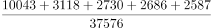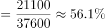，与B项最接近。    

故正确答案为B。

---

### 第 9 题　qid 2616171 · 综合

2019年5月，邮政通信行业的受理量比房地产业约少：

- **A**. 

- **B**. 

- **C**. 
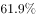
　✅
- **D**. 

**答案**：C

**官方解析**

根据题干“2019年5月，······比······约少”，结合选项为百分数，可判定本题为增长率计算问题。定位表格材料，可得邮政通信行业和房地产业的受理量分别为421件和1105件，代入增长率公式，增长率，与C项最接近。

故正确答案为C。

---

### 第 10 题　qid 2616249 · 综合

2018年5月，平台受理价格举报、投诉、咨询总数约为：

- **A**. 26706件
- **B**. 34376件
- **C**. 41433件
- **D**. 63366件　✅

**答案**：D

**官方解析**

根据题干“2018年5月······总数约为”，结合材料时间为2019年5月，判定本题为基期计算问题。定位文字材料可得，2019年5月，平台受理价格举报、投诉、咨询总数共计37576件，同比下降。根据公式基期量可得，2018年5月平台受理价格举报、投诉、咨询总数约为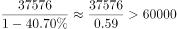件，只有D项满足。

故正确答案为D。

---
