# 2020年深圳市考公务员录用考试《行测2》试题（网友回忆版）

> 资料分析 · 15 题 · 深圳市考 2020

## 材料 1

        2018年，某市实现地区生产总值24221.98亿元，比上年增长。其中，第一产业增加值22.09亿元，增长；第二产业增加值9961.95亿元，增长；第三产业增加值14237.94亿元，增长。现代产业中，现代服务业增加值10090.59亿元，增长；先进制造业增加值6564.83亿元，增长；高技术制造业增加值6131.20亿元，增长。四大支柱产业中，金融业增加值3067.21亿元，增长；物流业增加值2541.58亿元，增长；文化及相关产业（规模以上）增加值1560.52亿元，增长；高新技术产业增加值8296.63亿元，增长。七大战略性新兴产业增加值合计9155.18亿元，比上年增长，占地区生产总值比重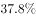。其中，新一代信息技术产业增加值4772.02亿元，增长；数字经济产业增加值1240.73亿元，增长；高端装备制造产业增加值1065.82亿元，增长；绿色低碳产业增加值990.73亿元，增长；海洋经济产业增加值421.69亿元，下降；新材料产业增加值365.61亿元，增长；生物医药产业增加值298.58亿元，增长。

        全市年末常住人口1302.66万人，其中常住户籍人口454.70万人，增长，占常住人口比重；常住非户籍人口847.97万人，增长，占比重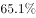。年末城镇登记失业率为。全年居民消费价格比上年上涨。全年完成一般公共预算收入3538.41亿元，比上年增长。其中税收收入2899.60亿元，增长。一般公共预算支出4282.54亿元，下降。

### 第 1 题　qid 2730982 · 增长

2017年，该市三大产业增加值同比增速最快的是：

- **A**. 第一产业
- **B**. 第二产业
- **C**. 第三产业
- **D**. 无法判断　✅

**答案**：D

**官方解析**

定位文字材料第一段，材料中没有给出2017年三大产业增加值同比增速的相关数据，故无法判定2017年同比增速的大小。
故正确答案为D。

---

### 第 2 题　qid 2730983 · 增长

2018年，下列产业对该市地区生产总值增长的贡献率最大的是：

- **A**. 第三产业
- **B**. 现代服务业
- **C**. 文化及相关产业（规模以上）
- **D**. 高新技术产业　✅

**答案**：D

**官方解析**

根据题干“2018年，······对······贡献率最大的是”，结合材料时间为2018年，可判定本题为现期比重问题。根据公式：增长贡献率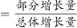，总体增长量均为该市地区生产总值增长量，则本题只需比较部分增长量的大小即可。定位文字材料第一段可知，第三产业增加值14237.94亿元，增长；现代服务业增加值10090.59亿元，增长；文化及相关产业（规模以上）增加值1560.52亿元，增长；高新技术产业增加值8296.63亿元，增长。根据增长量比较“大大则大”原则，文化及相关产业（规模以上）增加值及同比增速均为最小，则其增长量最小，排除C项。根据公式：增长量，则第三产业增加值的增长量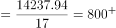亿元；现代服务业增加值的增长量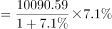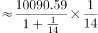亿元；高新技术产业增加值的增长量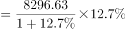亿元。故高新技术产业增加值的增长量最大，对该市地区生产总值增长的贡献率最大。

故正确答案为D。

---

### 第 3 题　qid 2730984 · 增长

2018年，从产业增加值的同比增量看，该市七大战略性新兴产业中，高端装备制造产业和（    ）最接近。

- **A**. 新一代信息技术产业
- **B**. 数字经济产业
- **C**. 绿色低碳产业　✅
- **D**. 生物医药产业

**答案**：C

**官方解析**

根据题干“从产业增加值的同比增量看，······高端装备制造产业和（    ）最接近”，可判定本题为增长量计算问题。定位文字材料第一段可知，高端装备制造产业增加值1065.82亿元，增长；新一代信息技术产业增加值4772.02亿元，增长；数字经济产业增加值1240.73亿元，增长；绿色低碳产业增加值990.73亿元，增长；生物医药产业增加值298.58亿元，增长。根据公式：增长量，各产业增加值的同比增量如下： 

高端装备制造产业增加值：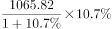亿元；

新一代信息技术产业增加值：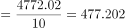亿元；

数字经济产业增加值：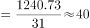亿元；

绿色低碳产业增加值：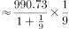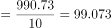亿元；

生物医药产业增加值：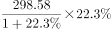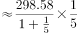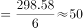亿元。

则高端装备制造产业增加值的同比增量与绿色低碳产业增加值的同比增量最接近。

故正确答案为C。

注：考试时，通过观察比较数据，可知“高端装备制造产业增加值”与“绿色低碳产业增加值”的现期量与同比增速均是最接近的，可直接猜C项。

---

### 第 4 题　qid 2730985 · 增长

2018年，该市年末常住人口同比增长约：

- **A**. 

- **B**. 

　✅
- **C**. 

- **D**. 

**答案**：B

**官方解析**

根据题干“2018年，该市年末常住人口同比增长约”，结合选项为百分数，且材料给出该市2018年末该市常住户籍人口与常住非户籍人口的增长率，可判定本题为混合增长率问题。定位文字材料第二段，2018年，全市年末常住人口1302.66万人，其中常住户籍人口454.70万人，增长，占常住人口比重；常住非户籍人口847.97万人，增长，占比重。根据“混合后居中，偏向基期大的（一般用现期量代替基期量计算）”，可得：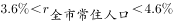，结合选项，排除A、C两项；由于常住户籍人口数（454.70万人）常住非户籍人口数（847.97万人），可得：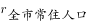更接近常住非户籍人口的增长率（），即，只有B项在范围内。

故正确答案为B。

---

### 第 5 题　qid 2730986 · 综合

根据上文，下列说法正确的是：

- **A**. 2018年，该市第二产业增加值占地区生产总值比重同比下降
- **B**. 2017年，该市四大支柱产业中，物流业增加值最大
- **C**. 2018年，该市年末城镇登记失业人口29.96万人
- **D**. 2018年，该市一般公共预算收入中，非税收收入同比负增长　✅

**答案**：D

**官方解析**

A项：定位文字材料第一段，“2018年，某市实现地区生产总值24221.98亿元，比上年增长。其中，······第二产业增加值9961.95亿元，增长”，根据两期比重比较的结论：若部分增长率整体增长率，比重上升；反之下降。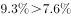，因此第二产业增加值占地区生产总值比重同比上升，错误。

B项：定位文字材料第一段，2018年“四大支柱产业中，金融业增加值3067.21亿元，增长；物流业增加值2541.58亿元，增长；文化及相关产业（规模以上）增加值1560.52亿元，增长；高新技术产业增加值8296.63亿元，增长”。根据基期量，2017年四大支柱产业增加值分别为：

2017年金融业增加值：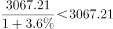亿元；

2017年物流业增加值：亿元；

2017年文化及相关产业（规模以上）增加值：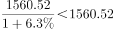亿元；

2017年高新技术产业增加值：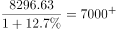亿元。

比较可知，2017年该市四大支柱产业中，高新技术产业增加值最大，错误。

C项：定位文字材料第二段，根据城镇登记失业率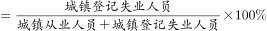，材料并未给出城镇从业人员的数据，故无法推出城镇登记失业人数，错误。

D项：定位文字材料第二段，2018年“全年完成一般公共预算收入3538.41亿元，比上年增长。其中税收收入2899.60亿元，增长”，根据线段法“距离与量成反比（一般用现期量代替基期量计算）”，可知，即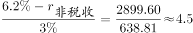，解得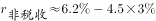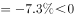，即非税收收入同比负增长，正确。

故正确答案为D。

---

## 材料 2

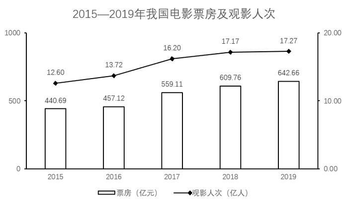

### 第 6 题　qid 2730989 · 平均数

若电影票房按“观影人次平均票价”计算，则2019年电影平均票价比2015年：

- **A**. 高2.2元　✅
- **B**. 高3.9元
- **C**. 低2.2元
- **D**. 低3.9元

**答案**：A

**官方解析**

根据题干“2019年电影平均票价比2015年”，结合选项：高/低单位，可判定本题为平均数的增长量问题。定位统计图一可知：2019年票房收入为642.66亿元，观影人次为17.27亿人次；2015年票房收入为440.69亿元，观影人次为12.60亿人次。代入平均票价可得：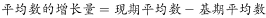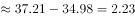元，与A项最接近。

故正确答案为A。

---

### 第 7 题　qid 2730990 · 增长

2016-2019年，电影票房同比增幅最低的年份，当年观影人次的同比增幅为：

- **A**. 

- **B**. 

- **C**. 

　✅
- **D**. 

**答案**：C

**官方解析**

根据题干“当年观影人次的同比增幅”，结合选项为，可判定本题为一般增长率计算问题。定位统计图一，已知2016~2019年电影票房收入，根据公式：增长率，可知各年份电影票房增长率如下：

2016年：；

2017年：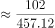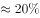；

2018年：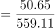；

2019年：。

则2016年电影票房同比增幅最低，结合统计图一，2015、2016年的观影人次分别为12.60亿人、13.72亿人，故2016年的观影人次的同比增幅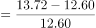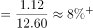，与C项最接近。

故正确答案为C。

---

### 第 8 题　qid 2730991 · 增长

2016-2019年，上映电影数同比增幅超过的年份有（    ）个。

- **A**. 1
- **B**. 2　✅
- **C**. 3
- **D**. 4

**答案**：B

**官方解析**

根据题干“······同比增幅超过······”，可判定本题为一般增长率问题。定位统计图二可知上映电影数进口电影国产电影，可知各年份上映电影数：2015年为；2016年为；2017年为；2018年为；2019年为；根据公式：增长率，同比增幅超过，即现期量。2016年：，满足；2017年上映电影数较上年下降，排除；2018年：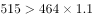，满足；2019年：，排除。因此2016-2019年，上映电影数同比增幅超过的年份有2个。

故正确答案为B。

---

### 第 9 题　qid 2730993 · 综合

2016-2019年，下列指标中，与下方折线图的变化趋势最相符的是：

- **A**. 上映国产电影数
- **B**. 电影观影人次同比增量　✅
- **C**. 电影平均票价
- **D**. 上映进口电影数同比增量

**答案**：B

**官方解析**

A项：定位统计图二可得2016-2019年我国每一年上映的国产电影数量，发现2017年的355部2016年的381部，与折线图趋势不符，排除；

B项：定位统计图一的折线图可得2015-2019年我国每一年的观影人次，根据增长量，可得2016-2019年的增长量分别为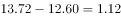，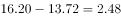，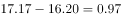，，与折线图趋势一致，当选；

C项：定位统计图一可得2016-2019年我国每一年的票房和观影人次，根据平均票价，可得2016-2019年平均票价分别为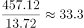元/人，元/人，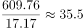元/人，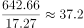元/人，发现2019年的平均票价是最高的，与折线图趋势不符，排除；

D项：定位统计图二可得2015-2019年我国每一年上映的进口电影数量，根据增长量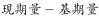，可得2016-2019年的增长量分别为，，，，发现2018年的增长量132016年的增长量10，折线图中第一个点高于第三个点，排除。

故正确答案为B。

备注：折线图中第一点与第三点的高度差别不明显，第二、三点之间的高度差明显大于第三、四点之间的高度差，故排除D项。

---

### 第 10 题　qid 2730994 · 综合

根据上图，下列说法正确的是：

- **A**. 2015—2019年，上映电影数与电影票房的变化趋势一致
- **B**. 2016—2019年，观影人次同比增长最快的一年，其电影票房及上映电影数均同比增长最快
- **C**. 2015—2019年，上映电影平均票房均超1亿元/部
- **D**. 2015—2019年，当年电影票房超过五年年均电影票房的年份有3个　✅

**答案**：D

**官方解析**

A项：定位统计图一、二，发现2017年电影票房增加，而2017年上映的电影总数下降，变化趋势不一致，错误；

B项：定位统计图一，根据公式：增长率，可知2016-2019年观影人次增长率依次为：；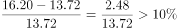；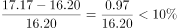；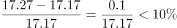，观影人次同比增长最快的为2017年。定位统计图二，观察发现2017年上映电影数同比减少，故上映电影数同比增长率为最低的一年，不满足电影票房及上映电影数均同比增长最快，错误；

C项：定位统计图一、二，可得2015-2019年票房数以及电影数量，根据公式：平均票房，可得2015-2019年每年的平均票房依次为：；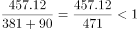；；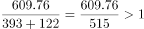；，没有均超1亿元/部，错误；

D项：定位统计图一，可得2015-2019年票房数，根据年均票房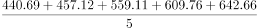，超过540的有3个，正确。

故正确答案为D。

---

## 材料 3

### 第 11 题　qid 2730465 · 增长

2012-2018年，国家财政支出同比增速最快的年份是：

- **A**. 2018年
- **B**. 2015年　✅
- **C**. 2014年
- **D**. 2012年

**答案**：B

**官方解析**

根据题干“2012-2018年，······同比增速最快的年份是”，可判定本题为一般增长率计算问题。定位统计表材料，可知2011-2018年国家财政支出。根据公式：增长率，可知选项各年份的增长率如下：

2018年：；

2015年：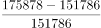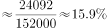；

2014年：；

2012年：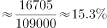。

则同比增速最快的年份是2015年。

故正确答案为B。

---

### 第 12 题　qid 2730466 · 综合

2011-2018年，国家财政赤字的变化趋势为：

- **A**. 不断缩小
- **B**. 与国家财政收入的变化趋势相反
- **C**. 不断扩大　✅
- **D**. 先扩大后缩小

**答案**：C

**官方解析**

财政赤字是指财政支出超过财政收入的部分，即财政赤字财政支出财政收入。定位统计表材料，可知2011-2018年国家财政收入和国家财政支出。则各年份的财政赤字如下：

2011年：亿元；

2012年：亿元；

2013年：亿元；

2014年：亿元；

2015年：亿元；

2016年：亿元；

2017年：亿元；

2018年：亿元。

则2011-2018年，国家财政赤字的变化趋势为不断扩大。

故正确答案为C。

---

### 第 13 题　qid 2730467 · 增长

2018年，上表所列国家税收收入的税种中，按税收收入同比增速从高到低排序，正确的是：

- **A**. 
企业所得税国内增值税个人所得税国内消费税关税

- **B**. 
个人所得税企业所得税国内增值税国内消费税关税
　✅
- **C**. 
企业所得税个人所得税国内增值税关税国内消费税

- **D**. 
个人所得税国内消费税企业所得税国内增值税关税

**答案**：B

**官方解析**

根据题干“2018年······同比增速从高到低排序······”，可判定本题为一般增长率计算问题。定位统计表材料，可知2017年及2018年选项各税种的税收收入。根据公式：增长率，表中各税种的增长率如下：

国内增值税：；

国内消费税：；

关税：；

个人所得税：；

企业所得税：。

则按税收收入同比增速从高到低排序为：个人所得税企业所得税国内增值税国内消费税关税。

故正确答案为B。

---

### 第 14 题　qid 2730468 · 增长

2011-2016年，中央税收收入年均增速约为：

- **A**. 

　✅
- **B**. 

- **C**. 

- **D**. 

**答案**：A

**官方解析**

根据题干“2011-2016年，······年均增速约为”，可判定本题为年均增长率计算问题。定位统计表材料，可知2011年及2016年中央税收收入分别为48632亿元、65669亿元。根据年均增长率计算公式，，因此。因，所以，，只有A项满足。

故正确答案为A。

---

### 第 15 题　qid 2730469 · 增长

根据上表，下列说法正确的有（    ）个。
（1）2011-2018年，中央财政支出占国家财政支出比重逐年降低
（2）2011-2018年，地方财政收入均超过6万亿元
（3）与2011年相比，2018年中央财政收入的增幅小于国家财政收入的增幅

- **A**. 3
- **B**. 2
- **C**. 1　✅
- **D**. 0

**答案**：C

**官方解析**

（1）定位统计表，可知2011年-2018年中央及国家财政支出。2011年占比为；2012年占比为；2013年占比为；2014年占比为，不满足逐年降低趋势，错误。

（2）定位统计表，可知2011年-2018年中央及国家财政收入。地方财政收入国家财政收入中央财政收入，2011年地方财政收入为亿元万亿元，不满足均超过，错误。

（3）定位统计表，可知2011年中央及国家财政收入分别为51327亿元、103874亿元；2018年中央及国家财政收入分别为85456亿元、183360亿元。中央财政收入增幅为，国家财政收入增幅为，中央财政收入的增幅小于国家财政收入的增幅，正确。

因此只有（3）表述正确。

故正确答案为C。

---
