# 2020年湖南公务员考试《行测》试题（网友回忆版）

> 资料分析 · 15 题 · 湖南 2020

## 材料 1

### 第 1 题　qid 2578512 · 综合

与上个月相比较，2月份职工人数变动幅度最大的是：

- **A**. 甲车间　✅
- **B**. 乙车间
- **C**. 丙车间
- **D**. 丁车间

**答案**：A

**官方解析**

根据题干“······变动幅度最大的是”，可判定本题为一般增长率问题。定位表一，可得甲、乙、丙、丁4个车间1月份的职工人数分别为500、600、300、200，2月份的职工人数分别为550、580、320、200。变动幅度比较大小，比较增长率的绝对值即可。根据增长率=，可得甲、乙、丙、丁4个车间职工人数的环比增速分别为，，，，甲车间职工人数的变动幅度最大。

故正确答案为A。

---

### 第 2 题　qid 2578872 · 综合

与上月相比较，2月份工资总额变动率最大的车间是：

- **A**. 甲车间
- **B**. 乙车间
- **C**. 丙车间　✅
- **D**. 丁车间

**答案**：C

**官方解析**

根据题干“······2月份工资总额变动率最大”，可判定本题为一般增长率比较问题。根据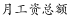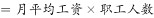，定位材料表格可得：

甲车间2月工资总额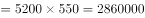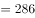万元，1月工资总额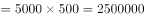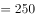万元 ，根据公式：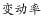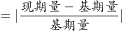可知，甲车间工资总额变动率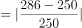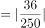；

乙车间2月工资总额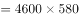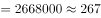万元，1月工资总额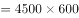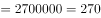万元，乙车间工资总额变动率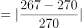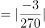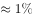；

丙车间2月工资总额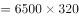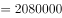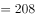万元，1月工资总额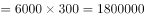万元，丙车间工资总额变动率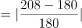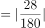；

丁车间2月工资总额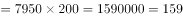万元，1月工资总额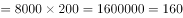万元，丁车间工资总额变动率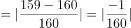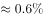。

工资总额变动率最大的是丙车间。

故正确答案为C。

---

### 第 3 题　qid 2578871 · 综合

2月工资总额与产值比率最大的车间：

- **A**. 甲车间
- **B**. 乙车间
- **C**. 丙车间　✅
- **D**. 丁车间

**答案**：C

**官方解析**

根据题干“······与······比率最大的车间”，结合材料2月的职工人数、月平均工资及各车间产值，可判定本题为比值比较问题。根据，定位材料可得：

甲车间2月工资总额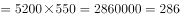万元，工资总额与产值比率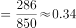；

乙车间2月工资总额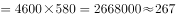万元，工资总额与产值比率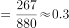；

丙车间2月工资总额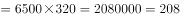万元，工资总额与产值比率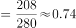；

丁车间2月工资总额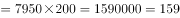万元，工资总额与产值比率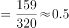， 工资总额与产值比率最大的为丙车间。

备注：本题将单位换算统一，比较时直接列式比较即可。

故正确答案为C。

---

### 第 4 题　qid 2578898 · 增长

与上月相比，2月份工厂的总产值增长了百分之几？

- **A**. 28
- **B**. 32
- **C**. 41　✅
- **D**. 48

**答案**：C

**官方解析**

根据题干“与上月相比，2月份工厂的总产值增长了百分之几”，结合选项为百分数，可以判定本题为一般增长率的计算问题。根据表二可知，1月公司各车间的总产值之和为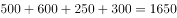，2月公司各车间的总产值之和为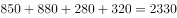。根据一般增长率计算公式：，可得与上月相比，2月份工厂的总产值增长了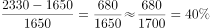，与C项最接近。

故正确答案为C。

---

### 第 5 题　qid 2578893 · 综合

能够从上述资料中推出的是：

- **A**. 1月份人均产值最大的是乙车间
- **B**. 除丙车间外，2月份各车间的人均产值都有所上升
- **C**. 2月份丁车间的人均产值低于整个集团公司的人均产值
- **D**. 与上个月相比较，整个集团公司的工资增长率低于产值增长率　✅

**答案**：D

**官方解析**

A项：根据，由表一和表二可知，1月甲车间人均产值，乙车间人均产值，丙车间人均产值，丁车间人均产值，故1月份人均产值最大的是丁车间，错误；

B项：由表一和表二可知2月份甲车间人均产值， 2月份乙车间人均产值，2月份丙车间人均产值，2月份丁车间人均产值，结合A项可得, 2月份各车间的人均产值都有所上升，错误；

C项：由表一和表二可知2月份整个集团人均产值，结合B项可得2月份丁车间的人均产值（1.6）高于整个集团公司的人均产值（1.4），错误；

D项：由107题解题过程可知2月份整个集团工资总额万元，1月份整个集团工资总额万元，故增长率为。由109题可知整个集团的产值增长率为，故与上个月相比较，整个集团公司的工资增长率低于产值增长率，正确。

故正确答案为D。

注：B项题干没有明确说明是同比上升还是环比上升，从材料出发倾向于环比上升，而同比上升无数据。因此，无论从何种角度理解此项均错误。

---

## 材料 2

### 第 6 题　qid 2578810 · 比重

妇幼出院人数占4所三甲医院妇科和儿科出院总数比重最小的是：

- **A**. 甲医院　✅
- **B**. 乙医院
- **C**. 丙医院
- **D**. 丁医院

**答案**：A

**官方解析**

根据题干“妇幼出院人数占4所三甲医院妇科和儿科出院总数比重最小······”，可判定本题为现期比重问题，其中部分量为各医院的“妇幼出院人数”，总体量为“4所三甲医院妇科和儿科出院总数”。因总体量相同，故只需比较部分量的大小关系即可。

定位表格，4所医院的妇幼出院人数分别为：甲医院：人；乙医院：人；丙医院：人；丁医院：人。对比可得，甲医院的人数最少，则占比最小。

故正确答案为A。

---

### 第 7 题　qid 2578815 · 综合

该市三甲医院外科的治愈率在以下哪个范围内：

- **A**. 

- **B**. 

- **C**. 

- **D**. 
以上
　✅

**答案**：D

**官方解析**

方法一：根据题干“······的治愈率在以下哪个范围”，结合“治愈率”，可判定本题为现期比重问题。定位表格可得该市三甲医院外科的治愈人数和出院人数，则所求治愈率，D项满足。

方法二：4所医院的外科的治愈率分别为：、、、，因每个医院的外科治愈率均大于，则总体治愈率也一定大于，D项满足。

故正确答案为D。

---

### 第 8 题　qid 2578880 · 综合

儿科治愈率高于外科治愈率的医院是：

- **A**. 甲医院
- **B**. 乙医院　✅
- **C**. 丙医院
- **D**. 丁医院

**答案**：B

**官方解析**

根据题干“儿科治愈率高于外科治愈率”，由治愈率，可判定本题为现期比重比较问题。定位表格儿科和外科数据可得：

甲医院：儿科治愈率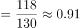&lt;外科治愈率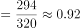；

乙医院：儿科治愈率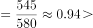外科治愈率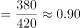；

丙医院：儿科治愈率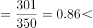外科治愈率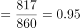；

丁医院：儿科治愈率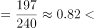外科治愈率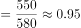；

根据结果可知乙医院满足要求。

故正确答案为B。

---

### 第 9 题　qid 2578829 · 综合

治愈率最低的科室是:

- **A**. 内科　✅
- **B**. 外科
- **C**. 妇科
- **D**. 儿科

**答案**：A

**官方解析**

方法一：根据题干“治愈率最低······”，结合“”，可判定本题为现期比重问题。定位表格可得4个科室对应的治愈人数和出院人数，则4个科室的治愈率分别为：

内科：；

外科：，根据本篇材料第二题可得其治愈率为；

妇科：；

儿科：；

对比可得，内科的治愈率最低。

方法二：在4所医院中，内科的治愈率分别为：、、、。则总体治愈率低于；

外科的治愈率，根据本篇材料第二题可得其为；

妇科的治愈率分别为：、、、。则总体治愈率高于；

儿科的治愈率分别为：、、、。则总体治愈率高于；

对比可得，内科治愈率最低。

故正确答案为A。

---

### 第 10 题　qid 2578891 · 综合

下列说法正确的是：

- **A**. 与其他医院相比，甲医院的总体治愈率最低　✅
- **B**. 乙医院的总体治愈率最高，原因是该医院妇科和儿科的出院人数最多
- **C**. 与其他医院相比，内科治愈率最高的是丙医院
- **D**. 丁医院的儿科治疗水平高于其他医院

**答案**：A

**官方解析**

A项：根据，定位表格最后一行，甲、乙、丙、丁医院总体治愈率分别为：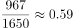、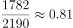、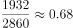、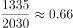；根据结果可知甲医院的总体治愈率最低，正确；

B项：由A项医院总体治愈率比较结果可知，乙医院的总体治愈率最高；根据 ，分数比较大小，并不是只看分子或分母的大小，所以治愈率高并非仅由出院人数决定，应由治愈人数和出院人数共同决定，错误；

C项：根据，定位表格数据第一行，甲、乙、丙、丁医院内科治愈率分别为：、、、；根据结果可知内科治愈率最高的是丁医院，错误；

D项：“儿科治疗水平”的高低即比较“儿科治愈率”的大小。根据，定位表格数据倒数第二行，甲、乙、丙、丁医院儿科治愈率分别为：、、、；根据结果可知儿科治愈率最高的是乙医院，错误。

故正确答案为A。

---

## 材料 3

        2019年全国房地产开发投资132194亿元，比上年增长，增速比上年加快0.4个百分点。其中，住宅投资97071亿元，增长，增速比上年加快0.5个百分点。2019年，全国商品房销售面积171558万平方米，比上年下降。其中，住宅销售面积增长，办公楼销售面积下降，商业营业用房销售面积下降。商品房销售额159725亿元，增长，增速比上年回落5.7个百分点。其中，住宅销售额增长，办公楼销售额下降，商业营业用房销售额下降。

### 第 11 题　qid 2578897 · 增长

2018年全国房地产开发投资比上年增长：

- **A**. 48114亿元
- **B**. 11427亿元
- **C**. 10436亿元　✅
- **D**. 10278亿元

**答案**：C

**官方解析**

根据题干“2018年······比上年增长”，结合选项数据带单位，可判定本题为增长量计算问题。定位文字材料第一段“2019年全国房地产开发投资132194亿元，比上年增长，增速比上年加快0.4个百分点”，故2018年全国房地产开发投资金额亿元，2018年全国房地产开发投资同比增长率，因此2018年全国房地产开发投资比上年增长金额亿元，最接近C项。

故正确答案为C。

---

### 第 12 题　qid 2578921 · 综合

与2018年相比，2019年全国商品房销售均价约：

- **A**. 增长580元　✅
- **B**. 增长710元
- **C**. 下降580元
- **D**. 下降710元

**答案**：A

**官方解析**

根据题干“与2018年相比，2019年······均价约”，结合选项为，可判定本题为平均数的增长量计算问题。定位文字材料第一段“2019年，全国商品房销售面积171558万平方米，比上年下降······商品房销售额159725亿元，增长”，商品房销售均价，代入平均数的增长量公式：元，最接近A项。

故正确答案为A。

---

### 第 13 题　qid 2578937 · 比重

2019年全国住宅投资占房地产开发投资比重排名第二的地区是：

- **A**. 东部地区
- **B**. 中部地区
- **C**. 西部地区
- **D**. 东北地区　✅

**答案**：D

**官方解析**

根据题干“2019年······占······比重”，材料时间为2019年，可判定本题为现期比重问题。定位表一，可知四个地区的住宅投资额和房地产开发投资额。根据公式：比重，可得东部地区比重，中部地区比重，西部地区比重，东北地区比重，故比重排名第二的地区是东北地区。

故正确答案为D。

---

### 第 14 题　qid 2578938 · 综合

2018年房地产投资额最多的地区约为排名第二地区的：

- **A**. 2.0倍
- **B**. 2.5倍　✅
- **C**. 3.0倍
- **D**. 3.5倍

**答案**：B

**官方解析**

根据题干“2018年······约为······的”，结合材料时间为2019年，可判定本题为基期倍数问题。定位表一，可知2019年各地区的房地产投资额及增长率。根据基期量，可得2018年东部地区房地产投资额亿元，中部地区房地产投资额亿元，西部地区房地产投资额亿元，东北地区房地产投资额亿元。故2018年房地产投资额最多的地区为东部地区，排名第二的地区为西部地区，则倍数。

故正确答案为B。

---

### 第 15 题　qid 2578892 · 综合

根据上述材料可以推出：

- **A**. 2019年商品房销售均价东北地区高于中部地区　✅
- **B**. 2018年东部地区商品房销售面积比西部地区约多3000万平方米
- **C**. 2018年住宅投资占房地产开发投资比重最低的地区是东部地区
- **D**. 如果2017年全国商品房销售均价要与2018年持平，其销售面积应达到163055万平方米

**答案**：A

**官方解析**

A项：定位表二可知，2019年东北地区商品房销售均价亿元/万平方米，中部地区商品房销售均价亿元/万平方米亿元/万平方米，东北地区高于中部地区，正确；

B项：定位表二可知，2018年东部地区商品房销售面积万平方米，2018年西部地区商品房销售面积万平方米，万平方米，错误；

C项：定位表一可知，2019年四个地区住宅投资和房地产开发投资额及增长率，结合118题可知，东部地区比重，西部地区比重，可知2018年东部地区比重；2018年西部地区比重，西部地区占比显然更低，错误；

D项：定位表二可知，2018年全国商品房销售均价亿元/万平方米；定位文字材料可知，2019年全国商品房销售额159725亿元，增长，增速比上年回落5.7个百分点，则2017年全国商品房销售额亿元，若保持2018年和2017年的商品房销售均价不变，则2017年的销售面积应为万平方米，错误。

故正确答案为A。

---
