# 2020年重庆市选调优秀大学生到基层工作考试《行测》题

> 资料分析 · 10 题 · 选调 2020

## 材料 1

        据国家统计局测算，妇女就业规模继续扩大。2016年全国女性就业人员占全社会就业人员的比重为43.1%，超过《中国妇女发展纲要（2011-2020年）》规定的40%的目标。

        女职工的合法权益得到进一步维护，为减少和解决女职工在工作中因生理特点造成的特殊困难发挥了积极作用。2016年，执行《女职工劳动保护特别规定》的企业比重明显提高，达73%，比2010年提高18个百分点。

        农村贫困妇女人数大幅度减少，基本实现应保尽保。按照年人均收入2300元的农村贫困标准计算，2016年全国农村贫困人口为4335万人，比2010年减少1.2亿人，其中约一半为女性。2016年农村贫困妇女享受“低保”及农村特困人员人数占全国农村女性贫困人口的比重为38%，比2010年提高4.1个百分点。

        女性生育保障水平有明显提高。《女职工劳动保护特别规定》发布以来，女职工在产假、怀孕流产等各个特殊时期的保护有了明确的规定，女性参加生育保险的人数迅速增加。2016年，女性参加生育保险的人数达8020万人，比2010年增长49%。

        享有基本社会保障的女性人数增加。2016年，全国参加基本养老保险人数8.9亿人，其中女性3.5亿人；参加城镇职工基本养老保险人数3.8亿人，其中女性1.8亿人，占比为46.6%；2016年，参加城乡居民基本养老保险人数5.1亿人，其中女性超过1.7亿人。女性参加失业保险和工伤保险的人数增加，2016年，全国参加失业保险的人数超过1.8亿人，其中女性7551万人，分别比2010年增加4713万人和2402万人，增长35%和47%；参加工伤保险人数2.2亿人，其中女性8129万人，分别增长35%和43%。

### 第 1 题　qid 4678658 · 比重

2016年全国女性就业人员占比超《中国妇女发展纲要（2011-2020年）》多少个百分点？

- **A**. 4.1
- **B**. 3.1　✅
- **C**. 18
- **D**. 2.1

**答案**：B

**官方解析**

定位材料第一段：2016年全国女性就业人员占全社会就业人员的比重为43.1%，超过《中国妇女发展纲要（2011-2020年）》规定的40%的目标。则2016年全国女性就业人员占比-《中国妇女发展纲要（2011-2020年）》规定占比=43.1%-40%=3.1%，即3.1个百分点。
故正确答案为B。

---

### 第 2 题　qid 4678665 · 综合

2010年全国农村贫困妇女人数约为多少万人？

- **A**. 4335
- **B**. 7356
- **C**. 2494
- **D**. 8168　✅

**答案**：D

**官方解析**

根据题干“2010年全国农村贫困妇女人数约为多少万人”，结合材料时间为2016年，且材料中给出2010年全国农村贫困人口中贫困妇女占比，可判定本题为基期比重问题。定位文字材料第三段可知：2016年全国农村贫困人口为4335万人，比2010年减少1.2亿人，其中约一半为女性，则2010年全国农村贫困人口=4335+12000=16335万人。根据公式：部分=整体×比重，则2010年全国农村贫困妇女人数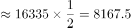万人，与D项最接近。

故正确答案为D。

备注：材料第三段中“其中约一半为女性”可有两种理解：①2016年全国农村贫困人口中女性占比约为一半；②2010年全国农村贫困人口中女性占比约为一半；本题只能按照第二种理解，否则无法计算。

---

### 第 3 题　qid 4678668 · 综合

2010年农村贫困妇女享受“低保”及农村特困人员人数约为多少万人？

- **A**. 6564
- **B**. 8020
- **C**. 2494
- **D**. 2769　✅

**答案**：D

**官方解析**

根据题干“2010年农村贫困妇女享受‘低保’及农村特困人员人数约为多少万人”，结合材料时间为2016年，且材料中给出相应比重，可判定本题为基期比重问题。定位文字材料第三段可知：2016年农村贫困妇女享受“低保&quot;及农村特困人员人数占全国农村女性贫困人口的比重为38%，比2010年提高4.1个百分点。则2010年农村贫困妇女享受“低保&quot;及农村特困人员人数占全国农村女性贫困人口的比重=38%-4.1%=33.9%，结合本篇资料第2题可知：2010年全国农村贫困妇女人数约为8168万人，故所求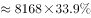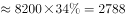万人，与D项最接近。

故正确答案为D。

---

### 第 4 题　qid 4678669 · 综合

2016年参加城镇职工基本养老保险的男性约占全国参加基本养老保险人数的：

- **A**. 46.6%
- **B**. 38.3%
- **C**. 22.5%　✅
- **D**. 35%

**答案**：C

**官方解析**

根据题干“2016年······占······”，结合材料时间为2016年，可判定本题为现期比重问题。定位文字材料最后一段可知：2016年，全国参加基本养老保险人数8.9亿人，其中女性3.5亿人；参加城镇职工基本养老保险人数3.8亿人，其中女性1.8亿人。则参加城镇职工基本养老保险的男性人数=3.8-1.8=2亿人，根据公式：比重，则2016年参加城镇职工基本养老保险的男性约占全国参加基本养老保险人数的比重，与C项最接近。

故正确答案为C。

---

### 第 5 题　qid 4678673 · 比重

按2016年参加四种保险的女性占比从大到小排列，正确的顺序为：

- **A**. 城镇职工基本养老保险，城乡居民基本养老保险，失业保险，工伤保险
- **B**. 城镇职工基本养老保险，失业保险，城乡居民基本养老保险，工伤保险
- **C**. 城镇职工基本养老保险，失业保险，工伤保险，城乡居民基本养老保险　✅
- **D**. 失业保险，城镇职工基本养老保险，工伤保险，城乡居民基本养老保险

**答案**：C

**官方解析**

定位材料最后一段可知：2016年，参加城镇职工基本养老保险人数3.8亿人，其中女性1.8亿人，占比为46.6%；参加城乡居民基本养老保险人数5.1亿人，其中女性超过1.7亿人；全国参加失业保险的人数超过1.8亿人，其中女性7551万人；参加工伤保险人数2.2亿人，其中女性8129万人。则2016年，参加四种保险的女性占比分别为：

城镇职工基本养老保险：46.6%；

城乡居民基本养老保险：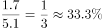；

失业保险：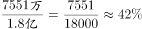；

工伤保险：。

则从大到小为：城镇职工基本养老保险&gt;失业保险&gt;工伤保险&gt;城乡居民基本养老保险，对应C项。

故正确答案为C。

---

## 材料 2

### 第 6 题　qid 4678699 · 比重

该省年初金融机构人民币贷款余额占存款余额的比重约为：

- **A**. 73.1%　✅
- **B**. 80.5%
- **C**. 90.3%
- **D**. 95.1%

**答案**：A

**官方解析**

根据题干“年初······占······比重约为”，可判定本题为基期比重问题。定位表格材料可知：本月金融机构人民币贷款余额为87478.20亿元，比年初增加8608.8亿元；本月金融机构人民币存款余额为119919.39亿元，比年初增加12046.4亿元。根据公式：基期比重，可得所求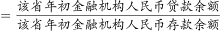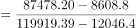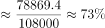，与A项最接近。

故正确答案为A。

---

### 第 7 题　qid 4678701 · 增长

该省本月金融机构人民币存贷款的下列项目中，余额比年初增加最少的是：

- **A**. 境内存款中的非金融企业存款
- **B**. 境内住户贷款中的短期贷款
- **C**. 金融机构人民币贷款
- **D**. 非金融企业及机关团体贷款中的各项垫款　✅

**答案**：D

**官方解析**

根据题干“······比年初增加最少”，结合表格所给数据，可判定本题为直接找数问题。定位表格材料可知：境内存款中的非金融企业存款增长量为6113.7亿元；境内住户贷款中的短期贷款增长量为70.3亿元；金融机构人民币贷款增长量为8608.8亿元；非金融企业及机关团体贷款中的各项垫款增长量为8.1亿元，故选项中，余额比年初增加最少的是非金融企业及机关团体贷款中的各项垫款（8.1亿元）。
故正确答案为D。

---

### 第 8 题　qid 4678705 · 比重

该省本月下列项目在金融机构人民币存款余额中的占比较年初增长最小的是：

- **A**. 境内存款
- **B**. 住户存款　✅
- **C**. 非金融企业存款
- **D**. 广义政府存款

**答案**：B

**官方解析**

根据题干“在······中的占比较······增长最小”，可判定本题为两期比重问题。定位表格可知：本月金融机构人民币存款余额为119919.39亿元，比年初增加12046.4亿元；本月境内存款为119629.80亿元，比年初增加12021.0亿元；本月住户存款为43313.71亿元，比年初增加2750.7亿元；本月非金融企业存款为45047.05亿元，比年初增加6113.7亿元；本月广义政府存款为23861.36亿元，比年初增加3118.0亿元。

方法一：根据公式：比重可得，境内存款占比较年初增长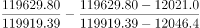，即0.004个百分点；住户存款占比较年初增长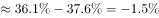，即-1.5个百分点；非金融企业存款占比较年初增长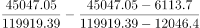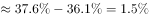，即1.5个百分点；广义政府存款占比较年初增长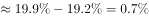，即0.7个百分点；比较可知-1.5个百分点最小，所以该省本月在金融机构人民币存款余额中的占比较年初增长最小的是住户存款。

方法二：根据两期比重结论：部分增长率（a）＞整体增长率（b），则比重上升；部分增长率（a）＜整体增长率（b），则比重下降；部分增长率（a）=整体增长率（b），则比重不变。可得本月金融机构人民币存款余额的增长率，境内存款的增长率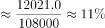，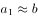，则比重不变，即两期比重增长近似为零；住户存款的增长率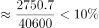，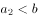，则比重下降，即两期比重增长为负数；非金融企业存款的增长率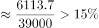，，则比重上升，即两期比重增长为正数；广义政府存款的增长率，，说明比重上升，即两期比重增长为正数，比较可得负数一定最小，即该省本月在金融机构人民币存款余额中的占比较年初增长最小的是住户存款。

故正确答案为B。

---

### 第 9 题　qid 4678708 · 综合

该省本月金融机构人民币境内住户存贷款之差相比年初约：

- **A**. 减少了1329亿元　✅
- **B**. 增加了1329亿元
- **C**. 减少了1903亿元
- **D**. 增加了1903亿元

**答案**：A

**官方解析**

根据题干“······相比年初约”，结合选项“增加了/减少了······亿元”，可判定本题为增长量计算问题。定位表格材料可知：本月住户存款为43313.71亿元，比年初增加2750.7亿元；本月住户贷款为24279.75亿元，比年初增加4079.6亿元。根据公式：增长量=现期量-基期量，可得所求=（43313.71-24279.75）-[（43313.71-2750.7）-（24279.75-4079.6）]=2750.7-4079.6=-1328.9亿元，即减少了1328.9亿元，与A项最接近。
故正确答案为A。

---

### 第 10 题　qid 4678711 · 增长

该省本月非银行业金融机构贷款余额同比增长：

- **A**. 10.5%
- **B**. 10.0%
- **C**. 9.5%
- **D**. 不知道　✅

**答案**：D

**官方解析**

根据题干“······同比增长”，结合选项为百分数，可判定本题为增长率计算问题。定位表格材料可知：本月非银行业金融机构贷款余额为3.17亿元，比年初增加0.3亿元。但是未给出同比（上年相同月份）数据，故无法求解其同比增长率。 
故正确答案为D。

---
