# 2020年陕西省公务员考试《行测》试题（网友回忆版）

> 资料分析 · 20 题 · 陕西 2020

## 材料 1

        2019年全国房地产开发投资132194亿元，比上年增长，增速比上年加快0.4个百分点。其中，住宅投资97071亿元，增长，增速比上年加快0.5个百分点。2019年，全国商品房销售面积171558万平方米，比上年下降。其中，住宅销售面积增长，办公楼销售面积下降，商业营业用房销售面积下降。商品房销售额159725亿元，增长，增速比上年回落5.7个百分点。其中，住宅销售额增长，办公楼销售额下降，商业营业用房销售额下降。

### 第 1 题　qid 2578242 · 增长

2018年全国房地产开发投资比上年增长：

- **A**. 

- **B**. 

- **C**. 

- **D**. 

　✅

**答案**：D

**官方解析**

根据题干“2018年全国房地产开发投资比上年增长”，结合选项为百分数，可判定本题为一般增长率问题。定位文字材料“2019年全国房地产开发投资······，比上年增长，增速比上年加快0.4个百分点”，可得2018年全国房地产开发投资的增长率。

故正确答案为D。

---

### 第 2 题　qid 2578246 · 增长

2019年全国房地产开发投资增长最快的地区是：

- **A**. 东部地区
- **B**. 中部地区
- **C**. 西部地区　✅
- **D**. 东北地区

**答案**：C

**官方解析**

定位表一可知，2019年各地区房地产开发投资额的增长率分别为：东部地区；中部地区；西部地区；东北地区，则2019年全国房地产开发投资增长最快的地区是西部地区。

故正确答案为C。

---

### 第 3 题　qid 2578488 · 比重

2019年全国住宅投资在房地产开发投资中的比重约为：

- **A**. 

　✅
- **B**. 

- **C**. 

- **D**. 

**答案**：A

**官方解析**

根据题干“2019年······在······中的比重约为”且材料时间为2019年，可判定此题为现期比重问题。定位文字材料“2019年全国房地产开发投资132194亿元······住宅投资97071亿元”，根据公式：比重，则2019年全国住宅投资在房地产开发投资中的比重，首位商7，与A项最接近。

故正确答案为A。

---

### 第 4 题　qid 2578489 · 增长

2019年全国商品房销售面积同比下降幅度最大的地区是：

- **A**. 东部地区
- **B**. 中部地区
- **C**. 西部地区
- **D**. 东北地区　✅

**答案**：D

**官方解析**

定位表二，可知2019年东部地区商品房销售面积同比下降，中部地区商品房销售面积同比下降，西部地区商品房销售面积同比上升，东北地区商品房销售面积同比下降。西部地区商品房销售面积同比上升，可排除；其余三个地区商品房销售面积同比下降幅度最大的是东北地区。

故正确答案为D。

---

### 第 5 题　qid 2578507 · 综合

根据上述材料可以推出：

- **A**. 与上一年相比，2019年全国住宅投资和住宅销售面积均有增长　✅
- **B**. 与上一年相比，2019年全国商品房销售面积和销售额均有下降
- **C**. 与上一年相比，2019年全国住宅销售额和办公楼销售额均有增长
- **D**. 与上一年相比，2019年东北地区商品房销售面积和销售额均有下降

**答案**：A

**官方解析**

A项：定位文字材料“2019年全国房地产······住宅投资······增长······住宅销售面积增长”，可知与上一年相比，2019年全国住宅投资和住宅销售面积均有增长，正确；

B项：定位文字材料“2019年，全国商品房销售面积······比上年下降，······商品房销售额······增长”，可知与上一年相比，2019年全国商品房销售面积下降，销售额上升，错误；

C项：定位文字材料“2019年······住宅销售额增长，办公楼销售额下降”，可知与上一年相比，全国住宅销售额上升，办公楼销售额下降，错误；

D项：定位表二，可知2019年东北地区商品房销售面积增长率为，销售额增长率为，可知与上一年相比，东北地区商品房销售面积下降，销售额上升，错误。

故正确答案为A。

---

## 材料 2

### 第 6 题　qid 2578512 · 综合

与上个月相比较，2月份职工人数变动幅度最大的是：

- **A**. 甲车间　✅
- **B**. 乙车间
- **C**. 丙车间
- **D**. 丁车间

**答案**：A

**官方解析**

根据题干“······变动幅度最大的是”，可判定本题为一般增长率问题。定位表一，可得甲、乙、丙、丁4个车间1月份的职工人数分别为500、600、300、200，2月份的职工人数分别为550、580、320、200。变动幅度比较大小，比较增长率的绝对值即可。根据增长率=，可得甲、乙、丙、丁4个车间职工人数的环比增速分别为，，，，甲车间职工人数的变动幅度最大。

故正确答案为A。

---

### 第 7 题　qid 2578513 · 平均数

与上个月相比较，2月份平均工资增长速度最快的车间是：

- **A**. 甲车间
- **B**. 乙车间
- **C**. 丙车间　✅
- **D**. 丁车间

**答案**：C

**官方解析**

根据题干“······增长速度最快的车间是”，可判定本题为一般增长率问题。定位表一，可得甲、乙、丙、丁4个车间1月份的平均工资分别为5000、4500、6000、8000，甲、乙、丙、丁4个车间2月份的平均工资分别为5200、4600、6500、7950。根据增长率=，可得甲、乙、丙、丁4个车间的环比增速分别为，，，，丙车间增长速度最快。

故正确答案为C。

---

### 第 8 题　qid 2578475 · 综合

对C集团公司1-2月份的产值贡献率最大的是：

- **A**. 甲车间
- **B**. 乙车间　✅
- **C**. 丙车间
- **D**. 丁车间

**答案**：B

**官方解析**

根据题干“对C集团公司1-2月份的产值贡献率最大的是”，因，可判定本题为现期比重问题。定位表二，可得：

甲车间贡献率；

乙车间贡献率；

丙车间贡献率；

丁车间贡献率；

根据结果可知乙车间贡献率最高。

方法二：

根据产值贡献率，总产值不变的情况下，车间产值越大，则贡献率越高，本题1-2月总产值是一个定值，因此1-2月产值最高的车间，贡献率最大，观察表二的数据和柱状图高度，能看出乙车间1-2月产值最高，因此乙车间贡献率最大。

故正确答案为B。

---

### 第 9 题　qid 2578478 · 增长

与上个月相比较，C集团公司2月份的总产值增长额是：

- **A**. 520万元
- **B**. 650万元
- **C**. 680万元　✅
- **D**. 710万元

**答案**：C

**官方解析**

根据题干“与上个月相比较······2月份的总产值增长额是”，结合选项带单位，可判定本题为增长量计算问题。定位材料表二，可得：C集团公司各车间1月份的产值分别为500、600、250、300，2月份的产值分别为850、880、280、320。 故C集团公司2月份总产值的环比增长量万元。 

故正确答案为C。

---

### 第 10 题　qid 2578893 · 综合

能够从上述资料中推出的是：

- **A**. 1月份人均产值最大的是乙车间
- **B**. 除丙车间外，2月份各车间的人均产值都有所上升
- **C**. 2月份丁车间的人均产值低于整个集团公司的人均产值
- **D**. 与上个月相比较，整个集团公司的工资增长率低于产值增长率　✅

**答案**：D

**官方解析**

A项：根据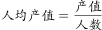，由表一和表二可知，1月甲车间人均产值，乙车间人均产值，丙车间人均产值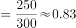，丁车间人均产值，故1月份人均产值最大的是丁车间，错误；

B项：由表一和表二可知2月份甲车间人均产值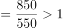， 2月份乙车间人均产值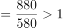，2月份丙车间人均产值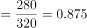，2月份丁车间人均产值，结合A项可得, 2月份各车间的人均产值都有所上升，错误；

C项：由表一和表二可知2月份整个集团人均产值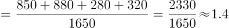，结合B项可得2月份丁车间的人均产值（1.6）高于整个集团公司的人均产值（1.4），错误；

D项：由107题解题过程可知2月份整个集团工资总额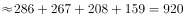万元，1月份整个集团工资总额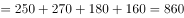万元，故增长率为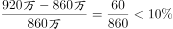。由109题可知整个集团的产值增长率为，故与上个月相比较，整个集团公司的工资增长率低于产值增长率，正确。

故正确答案为D。

注：B项题干没有明确说明是同比上升还是环比上升，从材料出发倾向于环比上升，而同比上升无数据。因此，无论从何种角度理解此项均错误。

---

## 材料 3

### 第 11 题　qid 2578828 · 综合

在4个城市中，就业地和居住地最不匹配的是：

- **A**. 甲　✅
- **B**. 乙
- **C**. 丙
- **D**. 丁

**答案**：A

**官方解析**

定位图一可得，甲、乙、丙、丁四个城市的平均通勤距离分别为11.1公里、9.1公里、8.7公里、8.1公里。平均通勤距离最大的城市为甲市（11.1公里），则就业地和居住地最不匹配的是甲市。
注：平均通勤距离指居住地与就业地直线距离的平均值，能够反映就业地和居住地的匹配程度，距离越大，越不匹配。
故正确答案为A。

---

### 第 12 题　qid 2578505 · 平均数

平均通勤距离超过了四个城市平均值的有：

- **A**. 一个城市　✅
- **B**. 两个城市
- **C**. 三个城市
- **D**. 四个城市

**答案**：A

**官方解析**

由题干“平均通勤距离超过了四个城市平均值的有”，默认时间为现期，可判定此题为现期平均数问题。定位图一可得， 甲、乙、丙、丁四个城市的平均通勤距离分别为：11.1公里、9.1公里、8.7公里、8.1公里，则四个城市平均通勤距离的平均值为公里。因此，平均通勤距离超过了四个城市平均值的只有甲市（11.1公里），数量为一个。

故正确答案为A。

---

### 第 13 题　qid 2578516 · 综合

如果5公里内可采用步行或自行车等绿色出行方式上班，超过半数的通勤人口可以采用绿色出行方式上班的城市有：

- **A**. 甲市和乙市
- **B**. 甲市和丙市
- **C**. 乙市和丁市
- **D**. 丙市和丁市　✅

**答案**：D

**官方解析**

定位图二可得，甲、乙、丙、丁四个城市的5公里通勤比重分别为：、、、。则根据题干可知，5公里通勤距离可以采用绿色出行方式上班，超过半数（比重大于）的城市有丙市（）和丁市（）。

故正确答案为D。

---

### 第 14 题　qid 2578522 · 比重

通勤人口被轨道交通覆盖的比重最大的城市是：

- **A**. 甲市
- **B**. 乙市
- **C**. 丙市　✅
- **D**. 丁市

**答案**：C

**官方解析**

定位图二可得，甲、乙、丙、丁四个城市的轨道交通覆盖比重分别为：、、、，则通勤人口被轨道交通覆盖的比重最大的城市是丙市（）。

故正确答案为C。

---

### 第 15 题　qid 2578526 · 综合

关于四个城市通勤的公共交通情况，下列说法正确的是：

- **A**. 甲市公共交通服务能力最强但是轨道覆盖通勤最差
- **B**. 甲市公共交通服务能力最弱并且轨道覆盖通勤最差　✅
- **C**. 乙市公共交通服务能力最强但是轨道覆盖通勤一般
- **D**. 丁市公共交通服务能力最强并且轨道覆盖通勤最好

**答案**：B

**官方解析**

A项：定位图二可得，甲市45分钟公交服务能力占比为，为四个城市中占比最低的，即公共交通服务能力最弱，错误；

B项：定位图二可得，甲市45分钟公交服务能力占比为，为四个城市中占比最低的，即公共交通服务能力最弱；轨道覆盖通勤比重为，为四个城市中比重最低的，即轨道覆盖通勤最差，正确；

C项：定位图二可得，乙市45分钟公交服务能力占比为，小于丙市（）与丁市（），即公共交通服务能力不是最强的，错误；

D项：定位图二可得，丁市轨道覆盖通勤比重为，小于乙市（）与丙市（），即轨道覆盖通勤不是最好的，错误。

故正确答案为B。

---

## 材料 4

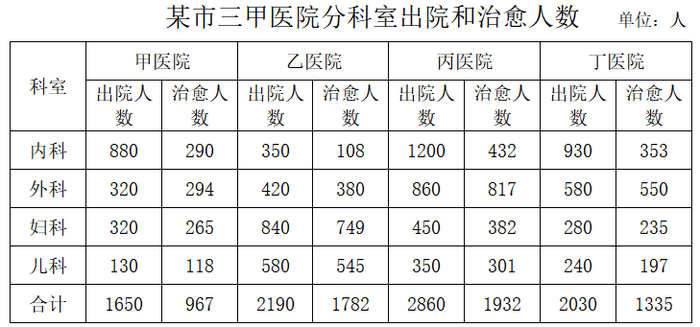

### 第 16 题　qid 2578810 · 比重

妇幼出院人数占4所三甲医院妇科和儿科出院总数比重最小的是：

- **A**. 甲医院　✅
- **B**. 乙医院
- **C**. 丙医院
- **D**. 丁医院

**答案**：A

**官方解析**

根据题干“妇幼出院人数占4所三甲医院妇科和儿科出院总数比重最小······”，可判定本题为现期比重问题，其中部分量为各医院的“妇幼出院人数”，总体量为“4所三甲医院妇科和儿科出院总数”。因总体量相同，故只需比较部分量的大小关系即可。

定位表格，4所医院的妇幼出院人数分别为：甲医院：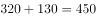人；乙医院：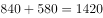人；丙医院：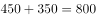人；丁医院：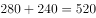人。对比可得，甲医院的人数最少，则占比最小。

故正确答案为A。

---

### 第 17 题　qid 2578815 · 综合

该市三甲医院外科的治愈率在以下哪个范围内：

- **A**. 
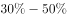

- **B**. 

- **C**. 
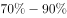

- **D**. 
以上
　✅

**答案**：D

**官方解析**

方法一：根据题干“······的治愈率在以下哪个范围”，结合“治愈率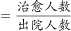”，可判定本题为现期比重问题。定位表格可得该市三甲医院外科的治愈人数和出院人数，则所求治愈率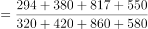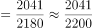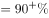，D项满足。

方法二：4所医院的外科的治愈率分别为：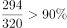、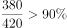、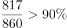、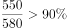，因每个医院的外科治愈率均大于，则总体治愈率也一定大于，D项满足。

故正确答案为D。

---

### 第 18 题　qid 2578817 · 综合

外科治愈率最高的医院是：

- **A**. 甲医院
- **B**. 乙医院
- **C**. 丙医院　✅
- **D**. 丁医院

**答案**：C

**官方解析**

根据题干“外科治愈率最高······”，结合“”，可判定本题为现期比重问题。定位表格可得4所医院中外科的治愈人数和出院人数，则可得4所医院的外科治愈率分别为：

甲：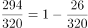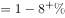；

乙：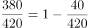；

丙：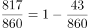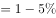；

丁：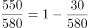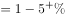；

对比可得，在丙医院中，1减去的值最小，则所得值最大，治愈率最高。

故正确答案为C。

---

### 第 19 题　qid 2578829 · 综合

治愈率最低的科室是:

- **A**. 内科　✅
- **B**. 外科
- **C**. 妇科
- **D**. 儿科

**答案**：A

**官方解析**

方法一：根据题干“治愈率最低······”，结合“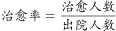”，可判定本题为现期比重问题。定位表格可得4个科室对应的治愈人数和出院人数，则4个科室的治愈率分别为：

内科：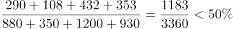；

外科：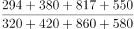，根据本篇材料第二题可得其治愈率为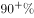；

妇科：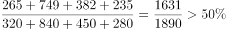；

儿科：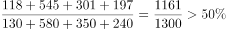；

对比可得，内科的治愈率最低。

方法二：在4所医院中，内科的治愈率分别为：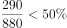、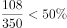、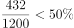、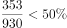。则总体治愈率低于；

外科的治愈率，根据本篇材料第二题可得其为；

妇科的治愈率分别为：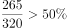、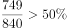、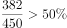、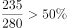。则总体治愈率高于；

儿科的治愈率分别为：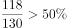、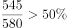、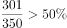、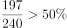。则总体治愈率高于；

对比可得，内科治愈率最低。

故正确答案为A。

---

### 第 20 题　qid 2578830 · 综合

下列说法正确的是：

- **A**. 甲医院的总体治愈率最低，说明甲医院的治疗水平低于其它三所医院　✅
- **B**. 乙医院的总体治愈率高于其他三所医院的原因是该医院妇科和儿科的出院人数最多
- **C**. 丙医院的内科治愈率低于本院的其它科室, 说明内科治疗水平低于本院其它科室
- **D**. 丁医院儿科的治疗水平高于其他三所医院

**答案**：A

**官方解析**

A项：甲、乙、丙、丁4所医院的总体治愈率分别为：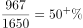，，，，因此，甲医院的总体治愈率最低，治疗水平应低于其他三所医院。正确；

B项：由A项医院总体治愈率比较结果可知，乙医院的总体治愈率最高；根据 ，分数比较大小，并不是只看分子或分母的大小，所以治愈率高并非仅由出院人数决定，应由治愈人数和出院人数共同决定，说法错误，排除；

C项：丙医院中，内科与其他科室的治愈率分别为：，，，，因此内科治愈率低于其他科室。但与另外3所医院对比发现，另外3所医院的内科治愈率也均低于，且低于其他科室，因此内科治愈率低是普遍情况，不能说明治疗水平低于其他科室。说法错误，排除；

D项：丁医院的儿科治愈率，甲医院的儿科治愈率。同为儿科，丁医院的治愈率低于甲医院，不能说明丁医院的儿科治疗水平高。说法错误，排除；

故正确答案为A。

---
