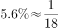
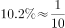
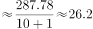
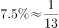

# 2020年青海省公务员录用考试《行测》试题（B卷）（网友回忆版）

> 资料分析 · 15 题 · 青海 2020

## 材料 1

        截至2018年底，中国人工智能市场规模约为238.2亿元，同比增长率达到。从中国人工智能企业地域分布情况来看，北京企业数量最多，企业数量为368家；其次为广东，人工智能企业数量为185家；排名第三的是上海，数量为131家。

### 第 1 题　qid 2616074 · 综合

截至2017年底，中国人工智能市场规模约为：

- **A**. 141.1亿元
- **B**. 152.1亿元　✅
- **C**. 156.1亿元
- **D**. 164.1亿元

**答案**：B

**官方解析**

定位柱形图1可得，2017年中国人工智能市场规模约为152.1亿元。

故正确答案为B。

注：若本题没有发现柱形图1的数据，直接看到文字材料，可以按照求解基期量计算。根据文字材料“截至2018年底，中国人工智能市场规模约为238.2亿元，同比增长率达到”，可得2017年中国人工智能市场规模约为亿元，与B项最接近。

---

### 第 2 题　qid 2616075 · 增长

2017年中国人工智能市场规模同比增长率与2015年相比约：

- **A**. 减少了13.3个百分点
- **B**. 增加了13.3个百分点
- **C**. 减少了15.4个百分点
- **D**. 增加了15.4个百分点　✅

**答案**：D

**官方解析**

根据题干“2017年······同比增长率与2015年相比”，可判定本题为一般增长率问题。定位柱形图1，2017年和2016年中国人工智能市场规模分别为152.1亿元和100.6亿元，则2017年中国人工智能市场规模同比增长率约为，2015年和2014年中国人工智能市场规模分别为70.2亿元和51.7亿元，则2015年中国人工智能市场规模同比增长率约为，故2017年中国人工智能市场规模同比增长率与2015年相比约增加了，即增加了15.9个百分点，与D项最接近。

故正确答案为D。

---

### 第 3 题　qid 2616098 · 增长

若按照2018年同比增长率，到2019年底中国人工智能市场规模约为：

- **A**. 363亿元
- **B**. 371亿元
- **C**. 373亿元　✅
- **D**. 383亿元

**答案**：C

**官方解析**

根据题干“按照2018年同比增长率，到2019年底···约为”，材料给出的是2018年的数据，可判定本题为现期计算问题。定位文字材料：截至2018年底，中国人工智能市场规模约为238.2亿元，同比增长率达到。根据公式：，可得2019年底中国人工智能市场规模亿元，与C项最为接近。

故正确答案为C。

---

### 第 4 题　qid 2616148 · 综合

图2中排名第二的省（市），其人工智能企业数量的个数约是排名后四位的数量之和的多少倍？

- **A**. 11.3
- **B**. 12.3　✅
- **C**. 12.8
- **D**. 13.3

**答案**：B

**官方解析**

根据题干“···约是···的多少倍”，可判定本题为现期倍数计算问题。定位图2可得：排名第二的省（市）是广东，其人工智能企业数量为185个，排名后四位的为广西、重庆、河南、辽宁，其人工智能企业数量依次为1个、3个、5个、6个。因此所求倍数。

故正确答案为B。

---

### 第 5 题　qid 2616099 · 综合

下列说法正确的是：

- **A**. 
截至2018年底，中国人工智能市场规模每年同比增长率都超过

- **B**. 
截至2018年底，中国人工智能企业地域分布情况中，广东企业数量最多

- **C**. 
截至2018年底，中国人工智能企业北京企业数量不超过上海企业数量的

- **D**. 
截至2018年底，福建人工智能企业的数量等于河南、天津、广西三省企业数量之和
　✅

**答案**：D

**官方解析**

A项：定位图1，2015年中国人工智能市场规模同比增长率为，错误；

B项：定位文字材料，截至2018年底，中国人工智能企业地域分布中，北京企业数量最多，而非广东，错误；

C项：定位文字材料，截至2018年底，北京企业数量368家，上海企业数量131家，，错误；

D项：定位图2，截至2018年底，福建人工智能企业数为16家，河南、天津和广西分别为5家、10家和1家，，福建人工智能企业数量等于河南、天津、广西三省企业数量之和，正确。

故正确答案为D。

---

## 材料 2

        2019年5月，全国12358价格监管平台受理价格举报、投诉、咨询共计37576件，同比下降，环比下降。其中，价格举报4192件，环比下降；价格投诉2059件，环比下降；价格咨询31325件，环比下降。平台受理量排名前十的省（市）依次是北京（5786件）、江苏（3528件）、上海（2499件）、重庆（2486件）、河南（2469件）、陕西（2440件）、浙江（2321件）、天津（1571件）、福建（1483件）、广西（1309件）。平台受理量行业分布如下表所示：

### 第 6 题　qid 2616249 · 综合

2018年5月，平台受理价格举报、投诉、咨询总数约为：

- **A**. 26706件
- **B**. 34376件
- **C**. 41433件
- **D**. 63366件　✅

**答案**：D

**官方解析**

根据题干“2018年5月······总数约为”，结合材料时间为2019年5月，判定本题为基期计算问题。定位文字材料可得，2019年5月，平台受理价格举报、投诉、咨询总数共计37576件，同比下降。根据公式基期量可得，2018年5月平台受理价格举报、投诉、咨询总数约为件，只有D项满足。

故正确答案为D。

---

### 第 7 题　qid 2616168 · 综合

2019年4月，平台受理的价格咨询比价格举报约多：

- **A**. 26146件
- **B**. 27133件
- **C**. 28627件　✅
- **D**. 29614件

**答案**：C

**官方解析**

根据题干“2019年4月······比······多”，结合材料时间为2019年5月，可判定本题为基期和差问题。定位文字材料可得，“2019年5月······价格举报4192件，环比下降······价格咨询31325件，环比下降”，则2019年4月，平台受理的价格咨询比价格举报多件，与C项最接近。

故正确答案为C。

---

### 第 8 题　qid 2616169 · 综合

2019年5月，平台受理量排名第二的省（市）约是排名第九的省（市）的多少倍？

- **A**. 1.4
- **B**. 2.4　✅
- **C**. 3.7
- **D**. 4.4

**答案**：B

**官方解析**

根据题干“2019年5月，······是······的多少倍”，结合材料时间为2019年5月，可判定本题为现期倍数问题。定位文字材料可得，2019年5月，平台受理量排名第二的省（市）为江苏（3528件），排名第九的省（市）为福建（1483件），则2019年5月，平台受理量排名第二的省（市）约是排名第九的省（市）的倍。

故正确答案为B。

---

### 第 9 题　qid 2616170 · 比重

2019年5月，平台受理量排名前五的行业占受理总数的比重约为：

- **A**. 

- **B**. 

　✅
- **C**. 

- **D**. 

**答案**：B

**官方解析**

根据题干“2019年5月，······占······的比重约为”，结合材料时间为2019年5月，可判定本题为现期比重问题。定位文字材料，“2019年5月，全国12358价格监管平台受理价格举报、投诉、咨询共计37576件······”；定位表格材料，可得平台受理量排名前五的行业分别为停车收费（10043件），商品零售（3118件），交通运输（2730件），社会服务（2686件），物业管理（2587件），则2019年5月，平台受理量排名前五的行业占受理总数的比重为，与B项最接近。    

故正确答案为B。

---

### 第 10 题　qid 2616172 · 综合

能够从上述资料推出的是：

- **A**. 
2018年5月，平台受理价格举报数量多于价格投诉数量

- **B**. 
2019年5月，平台受理价格咨询数量环比下降幅度最大

- **C**. 
2019年5月，平台受理教育行业数量不超过旅游行业的2倍

- **D**. 
2019年5月，平台受理量排名前三的省（市）占总数的比重低于
　✅

**答案**：D

**官方解析**

A项：定位文字材料“2019年5月，······价格举报4192件，环比下降；价格投诉2059件，环比下降”，已知现期量、环比增长率，无法求同比基期量，A项无法推出，错误；

B项：定位文字材料“2019年5月，······价格举报4192件，环比下降；价格投诉2059件，环比下降；价格咨询31325件，环比下降”，平台受理数量环比下降幅度最大的为价格举报，并非价格咨询，错误；

C项：定位表格材料“2019年5月，平台受理教育行业数量为927件，受理旅游行业数量为459件”，927件（件），即平台受理教育行业数量超过旅游行业的2倍，错误；

D项：定位文字材料“2019年5月，全国12358价格监管平台受理价格举报、投诉、咨询共计37576件······平台受理量排名前十的省（市）依次是北京（5786件）、江苏（3528件）、上海（2499件）······”前三的省（市）为北京（5786件）、江苏（3528件）、上海（2499件），合计11813件，则2019年5月，平台受理量排名前三的省（市）占总数的比重为，低于，正确。

故正确答案为D。

---

## 材料 3

 

### 第 11 题　qid 2616071 · 比重

2016年，A市直接经济价值年值占现代农业生态服务价值年值的比重为：

- **A**. 

- **B**. 

　✅
- **C**. 

- **D**. 

**答案**：B

**官方解析**

根据题干“2016年，······占······的比重为”，结合材料时间“2017年”，可判定本题为基期比重问题。定位表格材料可得：2017年直接经济价值年值为372.60亿元，比上年增长，现代农业生态服务价值年值为3635.46亿元，比上年增长。故2016年A市直接经济价值年值占现代农业生态服务价值年值的比重，所求结果与B项最接近。

故正确答案为B。

---

### 第 12 题　qid 2616080 · 比重

能够正确描述2017年A市间接经济价值年值中三个指标占比的统计图是：

 

- **A**. A　✅
- **B**. B
- **C**. C
- **D**. D

**答案**：A

**官方解析**

方法一：根据题干“······2017年······占比······”，结合材料时间“2017年”，可判定本题为现期比重问题。定位表格材料可得：2017年间接经济价值年值为1214.15亿元，旅游服务价值年值为804.78亿元，水力发电价值年值为8.68亿元，景观增值价值年值为400.70亿元。旅游服务价值年值占比为，即大于、小于，说明第一个扇形的圆心角大于、小于，结合选项排除B、C两项；景观增值价值年值占比为，说明最后一个扇形的圆心角大于，结合选项排除D项。

方法二：旅游服务价值年值与景观增值价值年值比例为，说明第一个扇形的面积约为第三个扇形面积的2倍，结合选项排除B、C、D三项。

故正确答案为A。

---

### 第 13 题　qid 2616084 · 综合

2016年，A市旅游服务价值年值比农林牧渔业总产值年值多：

- **A**. 494.46亿元
- **B**. 462.79亿元
- **C**. 441.85亿元
- **D**. 404.35亿元　✅

**答案**：D

**官方解析**

根据题干“2016年，······比······多”，结合材料时间“2017年”，可判定本题为基期作差问题。定位表格材料可得：“2017年，A市旅游服务价值年值为804.78亿元，同比增长；农林牧渔业总产值年值为308.32亿元，同比增长”。根据：，列式：2016年A市旅游服务价值年值比农林牧渔业总产值年值多 亿元，所求结果与D项最接近。

故正确答案为D。

---

### 第 14 题　qid 2616093 · 综合

2017年A市生态与环境价值中，年值、贴现值较上年均有所上升的指标有：

- **A**. 6个
- **B**. 5个　✅
- **C**. 4个
- **D**. 3个

**答案**：B

**官方解析**

根据题干“2017年······较上年均有所上升的······”，可知2017年A市生态与环境价值中“年值、贴现值”的增速都为正（即增长率大于0），即表明较上年均有所上升。定位表格可知：2017年A市生态与环境价值中，年值、贴现值同比增长率都为正的指标有：“气候调节价值（、）、水源涵养价值（、）、生物多样性价值（、）、防护与减灾价值（、）、土壤形成价值（、）”，共5个。

故正确答案为B。

---

### 第 15 题　qid 2616150 · 增长

下列A市的指标中，2017年同比增量最多的是：

- **A**. 气候调节价值年值　✅
- **B**. 水源涵养价值年值
- **C**. 水源涵养价值贴现值
- **D**. 生物多样性价值贴现值

**答案**：A

**官方解析**

根据题干“······2017年同比增量最多的是”，可判定本题为增长量比较问题。定位表格材料可得，气候调节价值年值为732.34亿元，增长率为，增长量，水源涵养价值年值为287.78，增长率为，增长量，水源涵养价值贴现值为402.98，增长率为，增长量，生物多样性价值贴现值为2898.67，增长率为，增长量，所以增长量最大为38.5，是气候调节价值年值。

故正确答案为A。

---
