# 2021年上海市公务员录用考试《行测》题（B类）（网友回忆版）

> 资料分析 · 4 题 · 上海 2021

## 材料 1

        近年来，各地方政府响应国务院《关于加快推进“互联网政务服务”工作的指导意见》，纷纷推出工作方案，共同促进全国一体化在线政务服务平台的建设。图1为2017年12月-2020年3月我国在线政务服务用户规模，图2为2016年6月-2019年12月我国政府网站数量，截至2019年12月国务院部门及其内设、垂直管理机构912个，省级及以下行政单位13562个。

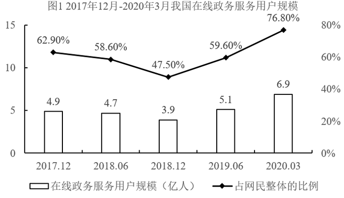

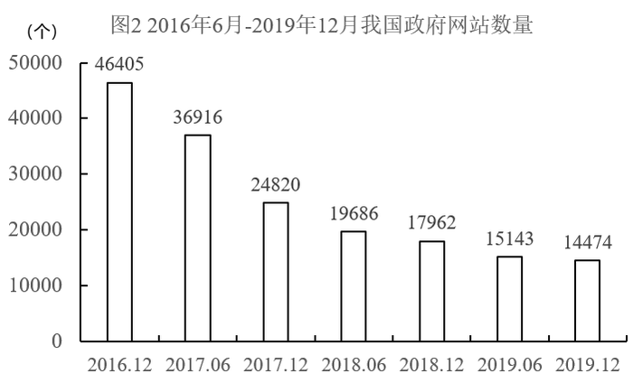

### 第 1 题　qid 2732740 · 增长

2018年12月我国网民数量同比：

- **A**. 
减少了

- **B**. 
增加了

- **C**. 
减少了

- **D**. 
增加了
　✅

**答案**：D

**官方解析**

根据题干“2018年12月······同比”，结合选项为减少/增加百分数，可判定本题为一般增长率计算问题。定位图1可知，2017年12月我国在线政务服务用户规模为4.9亿人，占网民整体的比例为；2018年12月我国在线政务服务用户规模为3.9亿人，占网民整体的比例为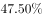。根据公式：整体和增长率，2018年12月我国网民数量同比增加了，D项最接近。

故正确答案为D。

---

## 材料 2

        截至2019年底，广东省常住人口11521万人，比上年底增加175万人。其中，男性6022.03万人、女性5498.97万人，人口密度为641人/平方公里。2019年底，全省城镇化率（城镇常住人口占常住人口的比重）为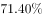，同比提高0.70个百分点。其中，珠三角九市的城镇化率为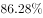。

### 第 2 题　qid 2731605 · 增长

2016-2019年，有        年珠三角九市人口密度同比增量超过了20人/平方公里。

- **A**. 1
- **B**. 2
- **C**. 3
- **D**. 4　✅

**答案**：D

**官方解析**

根据题干“······同比增量超过了20人/平方公里”，可判定本题为增长量比较问题。定位表格材料可得∶2015-2019年珠三角九市的人口密度分别为1073、1095、1123、1150、1177。

代入公式∶增长量现期基期，可得，

2016年，；

2017年，；

2018年，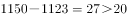；

2019年，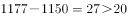。

有4个年份符合。

故正确答案为D。

---

### 第 3 题　qid 2731618 · 增长

以下        中的柱状图能准确反映2016-2019年间粤港澳大湾区年末常住人口同比增量的变化趋势。

- **A**. 

　✅
- **B**. 
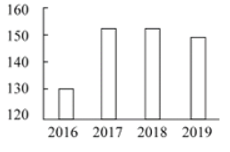

- **C**. 

- **D**. 
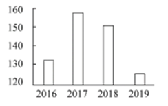

**答案**：A

**官方解析**

根据题干“同比增量的变化趋势”，结合选项为柱状图，可判定本题为增长量比较问题。定位表格材料，可知2015-2019年的年末人口，根据增长量现期基期，可以得到：

2016年增长量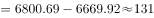，

2017年增长量，

2018年增长量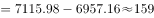，

2019年增长量。观察数据可得2018年的增长量最大，排除C、D两项；结合刻度2018年增长量更靠近160，排除B项。

故正确答案为A。

---

## 材料 3

        上海市生活垃圾分类工作实施以来，在居民分类、垃圾分类处置、全过程分类体系、配套制度规范以及社会宣传等方面都取得了显著成效。下图为上海市垃圾分类年度日均完成量及2020年目标，下表为上海市垃圾分类回收处理量。

### 第 4 题　qid 2731510 · 增长

2019年日均可回收物回收量同比年增长率，与日均湿垃圾分出量同比年增长率相差约：

- **A**. 
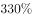

- **B**. 

　✅
- **C**. 
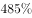

- **D**. 
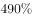

**答案**：B

**官方解析**

根据题干“2019年······同比年增长率，与······同比年增长率相差约”，可判定本题为一般增长率计算问题。定位柱状图可知，2019年、2018年日均可回收物回收量分别为4049吨、761吨；2019年、2018年日均湿垃圾分出量分别为7453吨、3947吨。根据公式，增长率，可得2019年日均可回收物回收量同比年增长率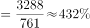 ，2019年日均湿垃圾分出量同比年增长率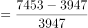。两者同比年增长率相差，与B项最为接近。

故正确答案为B。

---
