# 2021年北京市公务员录用考试《行测》题（乡镇卷）（网友回忆版）

> 资料分析 · 20 题 · 北京 2021

## 材料 1

### 第 1 题　qid 2742287 · 综合

2014年该地区私有云市场规模和公有云市场规模之比最接近以下哪一项？

- **A**. 1：4
- **B**. 4：1
- **C**. 1：3
- **D**. 3：1　✅

**答案**：D

**官方解析**

根据题干“2014年······之比······”，可判定本题为比值计算问题。定位条形图可得，2014年该地区私有云和公有云市场规模分别为216.8亿元、70.2亿元。则2014年该地区私有云市场规模和公有云市场规模之比约为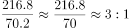。

故正确答案为D。

---

### 第 2 题　qid 2742291 · 综合

根据预测，2021年该地区云计算整体市场规模最接近以下哪个数字？

- **A**. 1300亿元
- **B**. 1700亿元
- **C**. 2300亿元　✅
- **D**. 2900亿元

**答案**：C

**官方解析**

定位条形图可得，2021年该地区私有云和公有云市场规模分别为961.9亿元、1297.8亿元。则2021年该地区云计算整体市场规模约为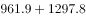亿元。

故正确答案为C。

---

### 第 3 题　qid 2742294 · 增长

根据资料中所给数据和预测，2014-2022年间该地区公有云市场规模同比增速超过的年份有几个？

- **A**. 6
- **B**. 5
- **C**. 4　✅
- **D**. 3

**答案**：C

**官方解析**

根据题干“2014-2022年间······同比增速超过的年份有几个”，可判定本题为一般增长率问题。定位条形图，根据公式增长率可得，2014-2022年间该地区公有云市场规模同比增速分别为：2014年，，不满足；2015年，，不满足；2016年，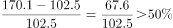，满足；2017年，，满足；2018年，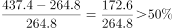，满足；2019年，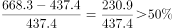，满足；2020年，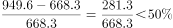，不满足；2021年，，不满足；2022年，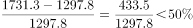，不满足。故该地区公有云市场规模同比增速超过的年份有2016年、2017年、2018年、2019年，共4个年份。

故正确答案为C。

---

### 第 4 题　qid 2742301 · 增长

根据预测，2022年该地区云计算市场整体规模同比增长：

- **A**. 

- **B**. 

　✅
- **C**. 
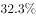

- **D**. 

**答案**：B

**官方解析**

根据题干“2022年······同比增长”，结合选项为百分数，可判定本题为一般增长率计算问题。定位条形图可得： 2022年该地区云计算市场整体规模预测数值为亿元，2021年该地区云计算市场整体规模预测数值为亿元，则2022年该地区云计算市场整体规模同比增长率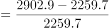，与B项最为接近。

故正确答案为B。

---

### 第 5 题　qid 2742304 · 综合

根据材料中所给数据和预测，能够从上述资料中推出的是：

- **A**. 
2022年该地区公有云和私有云市场规模差距将超过500亿元
　✅
- **B**. 
2020年该地区公有云市场规模将首次超过私有云市场规模

- **C**. 
2019-2022年该地区私有云市场规模同比增量逐年递减

- **D**. 
2022年该地区私有云市场规模较2017年将增长以上

**答案**：A

**官方解析**

A项：定位条形图，2022年预测该地区公有云和私有云分市场规模别为1731.3亿元、1171.6亿元，则市场规模差距亿元500亿元，正确；

B项：定位条形图，2019年该地区公有云和私有云市场规模分别为668.3亿元、644.2亿元，公有云市场规模已经超过私有云市场规模，错误；

C项：定位条形图，2019-2021年，该地区私有云市场规模分别为644.2亿元、787.8亿元、961.9亿元，则2020年该地区私有云市场规模同比增量亿元；2021年该地区私有云市场规模同比增量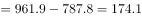亿元，同比增量并非逐年递减，错误；

D项：定位条形图，2017年、2022年该地区私有云市场规模分别为426.8亿元、1171.6亿元，增长率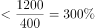，增长不足，错误。

故正确答案为A。

---

## 材料 2

### 第 6 题　qid 2742283 · 综合

2018年华北地区风力发电年末累计装机容量约占全国的：

- **A**. 

- **B**. 

- **C**. 

　✅
- **D**. 

**答案**：C

**官方解析**

根据题干“2018年······约占······”，结合材料给的是2011～2018年的数据，可判定本题为现期比重问题。定位表格材料最后一列，2018年华北地区风力发电年末累计装机容量为6076.6万千瓦，根据表格数据，2018年全国风力发电年末累计装机容量为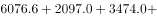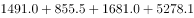万千瓦，因此2018年华北地区风力发电年末累计装机容量约占全国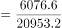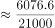。

故正确答案为C。

---

### 第 7 题　qid 2742286 · 增长

2012～2018年间，东北地区风力发电年末累计装机容量同比增速超过的年份有多少个？

- **A**. 2　✅
- **B**. 3
- **C**. 4
- **D**. 5

**答案**：A

**官方解析**

根据题干“······同比增速超过的年份有多少个”，可判定本题为一般增长率问题。定位表格材料第三行，可得2011～2018年东北地区风力发电年末累计装机容量，根据公式：增长率，则2012～2018年东北地区风力发电年末累计装机容量同比增速分别为：

2012年：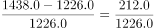，符合；

2013年：，符合；

2014年：，不符合；

2015年：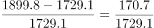，不符合；

2016年：，不符合；

2017年：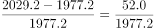，不符合；

2018年：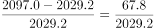，不符合。

因此符合的有2012年、2013年这两个年份。

故正确答案为A。

---

### 第 8 题　qid 2742290 · 增长

2014年末～2018年末，西部地区（含西南和西北）风力发电累计装机容量年均增长：

- **A**. 不到800万千瓦
- **B**. 在800～850万千瓦之间
- **C**. 在850～900万千瓦之间　✅
- **D**. 超过900万千瓦

**答案**：C

**官方解析**

根据题干“2014～2018年末······年均增长”，结合选项有具体单位，可判定本题为年均增长量问题。定位表格材料倒数两行，可得2014年末西部地区（含西南和西北）风力发电累计装机容量为万千瓦，2018年末西部地区（含西南和西北）风力发电累计装机容量为万千瓦。根据公式：年均增长量，年份差为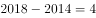。则2014年末～2018年末，西部地区（含西南和西北）风力发电累计装机容量年均增长量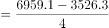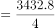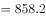万千瓦。

故正确答案为C。

---

### 第 9 题　qid 2742293 · 增长

2012～2018年间华中地区风力发电年末累计装机容量同比增速最快的一年，当年年末华东地区风力发电累计装机容量同比增量约是华南地区的多少倍？

- **A**. 2.6
- **B**. 3.5　✅
- **C**. 4.1
- **D**. 5.1

**答案**：B

**官方解析**

根据题干“2012～2018年间······同比增速最快的一年······是······的多少倍”，结合材料所给时间为2011~2018年，可判定本题为现期倍数问题。根据公式：增长率，可得2012～2018年间华中地区风力发电年末累计装机容量同比增速分别为：2012年，；2013年，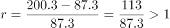；2014年，；2015年，；2016年，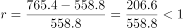；2017年，；2018年，；故2012～2018年间华中地区风力发电年末累计装机容量同比增速最快的一年为2013年。定位表格材料第四行可得：2013年末华东地区风力发电累计装机容量同比增量万千瓦，定位表格材料倒数第三行可得：2013年年末华南地区风力发电累计装机容量同比增量万千瓦，故华东地区风力发电累计装机容量同比增量约是华南地区的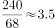倍。

故正确答案为B。

---

### 第 10 题　qid 2742296 · 综合

能够从上述资料中推出的是：

- **A**. 2014年全国风力发电年末累计装机容量同比增量最大的地区是华北
- **B**. 2017年华北地区风力发电年末累计装机容量同比增长了一成以上
- **C**. 华中和华南地区风力发电年末累计装机容量之和在2015年末首次超过1000万千瓦
- **D**. 如保持2018年末同比增速，2020年华中地区风力发电年末累计装机容量将高于东北　✅

**答案**：D

**官方解析**

A项：定位表格材料第二行，可知2014年华北地区风力发电年末累计装机容量同比增量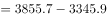万千瓦；定位表格材料最后一行，可知2014年西北地区风力发电年末累计装机容量同比增量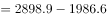万千瓦，西北大于华北，故2014年全国风力发电年末累计装机容量同比增量最大的地区并非是华北，错误；

B项：定位表格材料第二行，可知2017年华北地区风力发电年末累计装机容量为5532.1万千瓦，2016年为5030.1万千瓦。代入公式：增长率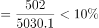，故2017年华北地区风力发电年末累计装机容量同比增长了不到一成（），错误；

C项：定位表格材料第五、六行，可知2015年末，华中地区风力发电年末累计装机容量为558.8万千瓦，华南地区风力发电年末累计装机容量为427.3万千瓦。则2015年末华中和华南地区风力发电年末累计装机容量之和为万千瓦，不足1000万千瓦，错误；

D项：定位表格材料第五行，可知2018年华中地区风力发电年末累计装机容量为1491.0万千瓦，2017年为1082.4万千瓦，代入公式：增长率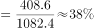，若保持2018年末同比增速（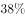），则2020年华中地区风力发电年末累计装机容量万千瓦；定位表格材料第三行，可知2018年东北地区风力发电年末累计装机容量为2097.0万千瓦，2017年为2029.2万千瓦，代入公式：增长率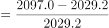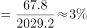，若保持2018年末同比增速（），则2020年东北地区风力发电年末累计装机容量＜2100×1.1=2310万千瓦＜2850万千瓦。故如保持2018年末同比增速，2020年华中地区风力发电年末累计装机容量将高于东北，正确。

故正确答案为D。

---

## 材料 3

        2018年全球茶叶产量585.6万吨，同比增长约，中国茶叶产量261.6万吨，同比增长0.7万吨。2018年，中国茶叶国内销售量为191万吨，同比增长，国内销售总额为2661亿元，出口量为36.5万吨，同比增长，出口总额为17.89亿美元（合人民币120亿元），同比增长（？）。

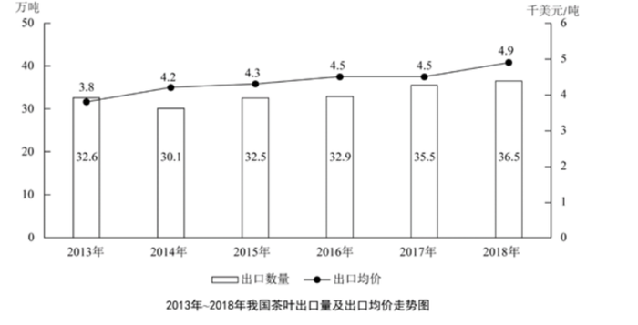

### 第 11 题　qid 2742305 · 比重

2018年中国茶叶产量占全球茶叶产量的比重与2017年相比：

- **A**. 上升了约1个百分点
- **B**. 上升了约10个百分点
- **C**. 下降了约1个百分点　✅
- **D**. 下降了约10个百分点

**答案**：C

**官方解析**

根据题干“2018年······占······的比重与2017年相比”，可判定本题为两期比重计算问题。定位文字材料可得，2018年全球茶叶产量585.6万吨（），同比增长约（），中国茶叶产量261.6万吨（），同比增长0.7万吨。则2018年中国茶叶产量同比增速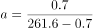，2018年与2017年相比，中国茶叶产量占全球茶叶产量的比重差为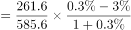，即下降了约1个百分点。

故正确答案为C。

---

### 第 12 题　qid 2742308 · 综合

设中国茶叶国内销售量和出口量与当年中国茶叶产量的比值分别为和，则2018年的和值与2017年分别相比：

- **A**. 
两者均下降

- **B**. 
两者均上升
　✅
- **C**. 
只有值上升

- **D**. 
只有值上升

**答案**：B

**官方解析**

根据题干“设······与······的比值分别为和，则2018年的和值与2017年分别相比”，可判定本题为比值比较问题。定位文字材料可得，2018年中国茶叶产量261.6万吨，同比增长0.7万，中国茶叶国内销售量为191万吨，同比增长（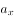），出口量为36.5万吨，同比增长（）。根据本篇材料第1题的计算结果可知，2018年中国茶叶产量同比增速，根据两期比重结论，当时，比重上升，2018年茶叶国内销售量增速（）和出口量增速（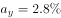）均高于茶叶产量增速（），可知2018年中国茶叶国内销售量和出口量与当年中国茶叶产量的比值均高于上年同期，即2018年的、值与2017年相比均有所上升。

故正确答案为B。

---

### 第 13 题　qid 2742312 · 综合

资料中“（？）”处应当填入的数值最可能是以下哪一个？

- **A**. 

　✅
- **B**. 

- **C**. 

- **D**. 

**答案**：A

**官方解析**

根据题干“资料中‘（？）’处应当填入的数值最可能是以下哪一个”，结合材料可知？处为同比增速，可判定本题为一般增长率计算问题。定位文字材料及图形材料可得，2018年，中国茶叶出口总额为17.89亿美元，2017年茶叶出口量为35.5万吨，出口均价4.5千美元/吨。则2017年出口总额为，2018年出口总额同比增速为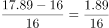。

故正确答案为A。

---

### 第 14 题　qid 2742314 · 综合

2016-2018年我国茶叶月均出口量约比2013-2015年间高多少万吨？

- **A**. 3.2
- **B**. 1.5
- **C**. 0.8
- **D**. 0.3　✅

**答案**：D

**官方解析**

由题干“······月均出口量约比······高多少”，结合材料时间，可判定本题为现期平均数问题。定位图形材料，2016-2018年我国茶叶出口量分别是32.9万吨、35.5万吨、36.5万吨，则2016-2018年月均出口量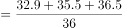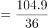万吨；2013-2015年我国茶叶出口量分别是32.6万吨、30.1万吨、32.5万吨，则2013-2015年月均出口量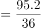万吨。故2016-2018年我国茶叶月均出口量约比2013-2015年间高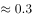万吨。

故正确答案为D。

---

### 第 15 题　qid 2742319 · 综合

能够从上述资料中推出的是：

- **A**. 
2018年全球茶叶产量同比增长了20万吨以上

- **B**. 
2014-2018年间中国茶叶出口均价增速最快的年份，出口量也为正增长

- **C**. 
2017年中国茶叶出口总额同比增长了不到
　✅
- **D**. 
2018年国内销售的茶叶平均价格超过120元/市斤

**答案**：C

**官方解析**

A项：定位文字材料，2018年全球茶叶产量585.6万吨，同比增长约，根据增长量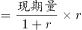，2018年全球茶叶产量增长量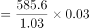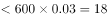万吨，不到20万吨，错误；

B项：定位图形材料，2013-2018年我国茶叶出口均价分别是3.8千美元/吨、4.2千美元/吨、4.3千美元/吨、4.5千美元/吨、4.5千美元/吨、4.9千美元/吨。则2014年-2018年出口均价的增长率分别是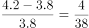，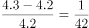，，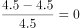，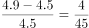，比较可得2014年增速最快，根据图形材料可知，2013年茶叶出口量是32.6万吨，2014年是30.1万吨，故2014年出口量为负增长，错误；

C项：定位图形材料，2016年和2017年的茶叶出口量分别是32.9万吨和35.5万吨，2016年和2017年的茶叶均价都是4.5千美元/吨，则2016年和2017年出口总额分别是（）千美元和（）千美元，2017年中国茶叶出口总额的同比增长率，即增长率不到，正确；

D项：定位文字材料，2018年，中国茶叶国内销售量为191万吨，同比增长，国内销售总额为2661亿元，根据平均价格，可得我国茶叶国内销售的平均价格万元/吨，，元/市斤，则2018年国内销售的茶叶平均价格不到120元/市斤，错误。

故正确答案为C。

---

## 材料 4

        2016年全国女性就业人员占全社会就业人员的比重为，其中城镇单位女性就业人员6518万人，比2010年增加1656万人。

        2016年公有制企事业单位中女性专业技术人员1480万人，比2010年增加211万人，所占比重达，提高2.8个百分点；其中女性高级专业技术人员161万人，比2010年增加59.3万人，所占比重，提高3个百分点。

        2016年企业董事会中女职工董事占职工董事的比重为，企业监事会中女职工监事占职工监事的比重为，比2010年分别提高7.2和4.9个百分点；企业职工代表大会中女性代表比重为，略低于2010年0.3个百分点。

        2016年女性参加生育保险的人数达8020万人，比2010年增长。2016年，参加城镇职工基本医疗保险的女性1.4亿人，比2011年增长；参加城镇居民基本医疗保险的女性1.9亿人，比2011年增长了1.5倍。

        2016年全国参加城镇职工基本养老保险人数3.8亿人，其中女性1.8亿人，占比比2010年提高3个百分点；2016年，参加城乡居民基本养老保险人数5.1亿人，其中女性超过1.7亿人。

        2016年全国参加失业保险的人数超过1.8亿人，其中女性7551万人，分别比2010年增加4713万人和2402万人，增长约和；参加工伤保险人数2.2亿人，其中女性8129万人，分别比2010年增加5728万人和2429万人，增长约和。

### 第 16 题　qid 2742310 · 增长

2010-2016年全国城镇单位女性就业人员年均增加约多少万人？

- **A**. 207
- **B**. 237
- **C**. 276　✅
- **D**. 331

**答案**：C

**官方解析**

根据题干“2010-2016年······年均增加约······万人”，可判定本题为年均增长量计算问题。定位文字材料第一段可得：2016年城镇单位女性就业人员6518万人，比2010年增加1656万人。根据公式：年均增长量，可得2010-2016年全国城镇单位女性就业人员年均增加万人，对应C项。

故正确答案为C。

---

### 第 17 题　qid 2742315 · 比重

2016年公有制企事业单位中，高级专业技术人员占专业技术人员的比重约为：

- **A**. 

- **B**. 

　✅
- **C**. 

- **D**. 

**答案**：B

**官方解析**

根据题干“2016年······占······的比重······”，可判定本题为现期比重计算问题。定位文字材料第二段可得：2016年公有制企事业单位中女性专业技术人员1480万人，占比；其中女性高级专业技术人员161万人，占比。根据公式：整体，可得高级专业技术人员，专业技术人员。根据公式：比重，可得高级专业技术人员占专业技术人员的比重，对应B项。

故正确答案为B。

---

### 第 18 题　qid 2742317 · 增长

2016年参加城镇职工和城镇居民基本医疗保险的女性比2011年增长了约多少倍？

- **A**. 0.7　✅
- **B**. 1.2
- **C**. 1.7
- **D**. 2.2

**答案**：A

**官方解析**

根据题干“2016年参加城镇职工和城镇居民基本医疗保险的女性比2011年增长了约······”，结合材料中分别给出了2016年参加城镇职工和城镇居民基本医疗保险的女性相对于2011年的增速，可判定本题为混合增长率问题。定位文字材料第四段可得：2016年，参加城镇职工基本医疗保险的女性1.4亿人，比2011年增长；参加城镇居民基本医疗保险的女性1.9亿人，比2011年增长了1.5倍。根据公式：基期量，可得2011年参加城镇职工基本医疗保险的女性人数亿人，2011年参加城镇居民基本医疗保险的女性人数亿人。根据“混合后居中”可得：，结合选项，排除C、D两项；根据“偏向基期量较大的”，结合2011年参加城镇职工基本医疗保险的女性人数（亿人）2011年参加城镇居民基本医疗保险的女性人数（亿人），可得：更接近参加城镇职工基本医疗保险的女性人数增长率（），即，即0.215倍倍，只有A项符合。

故正确答案为A。

备注：两个增长率差别大，不能近似用现期量代替基期量估算。

---

### 第 19 题　qid 2742320 · 增长

如2017年及以后年份同比增量保持不变，同比增量按照2011-2016年间同比增量的平均值计算，全国参加失业保险的女性将在哪年超过1.2亿人？

- **A**. 2024
- **B**. 2026
- **C**. 2028　✅
- **D**. 2030

**答案**：C

**官方解析**

根据题干“······同比增量保持不变，······将在哪年超过······”，结合选项时间为2016年以后的时间，可判定本题为现期追赶问题。定位文字材料最后一段可得：2016年全国参加失业保险的人数超过1.8亿人，其中女性7551万人，分别比2010年增加4713万人和2402万人。且“同比增量按照2011-2016年间同比增量的平均值计算”， 故包括2011年的同比增量，2011-2016年间同比增量（即6年）的平均值为万人。假设年后全国参加失业保险的女性超过1.2亿人。根据公式：现期量，可得，解得，则过12年超过1.2亿人，即全国参加失业保险的女性将在年超过1.2亿人。

故正确答案为C。

---

### 第 20 题　qid 2742322 · 综合

能够从上述资料中推出的是：

- **A**. 
2016年全国参加工伤保险的人中，女性占比低于2010年水平

- **B**. 
2010年全国参加城镇职工基本养老保险的人中，女性占比低于

- **C**. 
2010年女职工董事占职工董事的比重高于女职工监事占职工监事的比重

- **D**. 
2010年公有制企业事业单位中男性高级专业技术人员不到210万人
　✅

**答案**：D

**官方解析**

A项：定位文字材料最后一段可知，“2016年全国参加工伤保险人数2.2亿人，其中女性8129万人，分别比2010年增加······，增长约（b）和（a）”。根据两期比重比较结论：若部分增长率（a）＞整体增长率（b），则比重上升。43%（a）＞35%（b），即2016年全国参加工伤保险的人中，女性占比高于2010年水平，错误；

B项：定位文字材料第五段可知，“2016年全国参加城镇职工基本养老保险人数3.8亿人，其中女性1.8亿人，占比比2010年提高3个百分点”。则2016年全国参加城镇职工基本养老保险的人中，女性占比为，故2010年全国参加城镇职工基本养老保险的人中，女性占比为，错误；

C项：定位文字材料第三段可知，“2016年企业董事会中女职工董事占职工董事的比重为，企业监事会中女职工监事占职工监事的比重为，比2010年分别提高7.2和4.9个百分点”。则2010年女职工董事占职工董事的比重；女职工监事占职工监事的比重。可以看出，即2010年女职工董事占职工董事的比重低于女职工监事占职工监事的比重，错误；

D项：定位文字材料第二段可知，“2016年公有制企事业单位中女性专业技术人员1480万人，······其中女性高级专业技术人员161万人，比2010年增加59.3万人，所占比重，提高3个百分点”。由此可知2010年高级专业技术人员总人数为万人，2010年男性高级专业技术人员万人万人，正确。

故正确答案为D。

---
