# 2021年四川下半年公务员录用考试《行测》试题（网友回忆版）

> 资料分析 · 15 题 · 四川 2021

## 材料 1

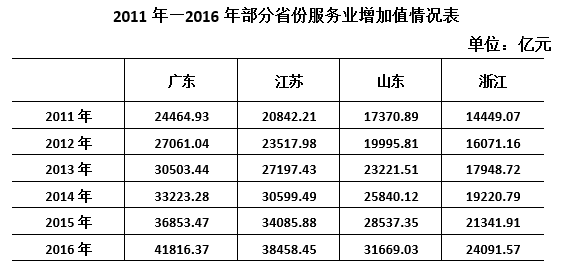 

### 第 1 题　qid 4658498 · 增长

2011—2016年，资料中所列省份服务业增加值年均增量最大的是：

- **A**. 广东
- **B**. 江苏　✅
- **C**. 山东
- **D**. 浙江

**答案**：B

**官方解析**

根据题干“······年均增量最大的是”，可判定本题为年均增长量问题。定位统计表可知，广东省、江苏省、山东省、浙江省2011年服务业增加值分别为24464.93亿元、20842.21亿元、17370.89亿元、14449.07亿元，2016年服务业增加值分别为41816.37亿元、38458.45亿元、31669.03亿元、24091.57亿元。根据年均增长量公式：年均增长量，则2011—2016年各省份服务业增加值年均增量为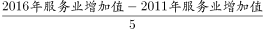。

年份差相同均为5，因此只需要比较各省份2016年服务业增加值与2011年服务业增加值的差值即可：广东=41816.37-24464.93=17351.44亿元；江苏=38458.45-20842.21=17616.24亿元；山东=31669.03-17370.89=14298.14亿元；浙江=24091.57-14449.07=9642.5亿元，差值最大的是江苏，即可知服务业增加值年均增量最大的是江苏。

故正确答案为B。

---

### 第 2 题　qid 4658501 · 增长

2013—2016年间，山东省服务业增加值同比增速最快的年份是：

- **A**. 2013年　✅
- **B**. 2014年
- **C**. 2015年
- **D**. 2016年

**答案**：A

**官方解析**

根据题干“······同比增速最快的年份是”，可判定本题为一般增长率比较问题。定位表格可知，2012—2016年山东省服务业增加值分别为19995.81亿元、23221.51亿元、25840.12亿元、28537.35亿元、31669.03亿元。根据公式：增长率，可得2013—2016年山东省服务业增加值同比增速分别为：

2013年：；

2014年：；

2015年：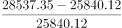；

2016年：。

综上可知，2013—2016年间，山东省服务业增加值同比增速最快的年份是2013年。

故正确答案为A。

---

### 第 3 题　qid 4658503 · 比重

2016年，广东省服务业增加值占表中四省服务业增加值之和的比重：

- **A**. 不到25%
- **B**. 在25%—28%之间
- **C**. 在28%—32%之间　✅
- **D**. 高于32%

**答案**：C

**官方解析**

根据题干“2016年······占······的比重”，结合材料时间为2016年，可判定本题为现期比重问题。定位统计表可得：2016年广东、江苏、山东、浙江服务业增加值分别为41816.37亿元、38458.45亿元、31669.03亿元、24091.57亿元。根据公式：比重，则2016年广东省服务业增加值占表中四省服务业增加值之和的比重为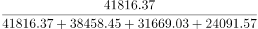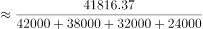，在C项范围内。

故正确答案为C。

---

### 第 4 题　qid 4658504 · 比重

2016年，江苏、浙江两省GDP分别为76086亿元和46485亿元，江苏省当年服务业增加值占GDP的比重比浙江省：

- **A**. 高不到3个百分点
- **B**. 高3个百分点以上
- **C**. 低不到3个百分点　✅
- **D**. 低3个百分点以上

**答案**：C

**官方解析**

根据题干“2016年······占······的比重······”，结合材料时间为2016年，可判定本题为现期比重问题。定位表格材料可知，2016年江苏、浙江两省服务业增加值分别为38458.45亿元和24091.57亿元。结合题干给出“2016年，江苏、浙江两省GDP分别为76086亿元和46485亿元”，根据公式：比重，则江苏省2016年服务业增加值占GDP的比重为，浙江省的比重为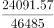，两者差值为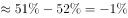，即低1个百分点，在C项范围内。

故正确答案为C。

---

### 第 5 题　qid 4658505 · 综合

能够从上述资料中推出的是：

- **A**. 2011—2015年，江苏省服务业累计增加值超过15万亿元
- **B**. 2012—2014年，浙江省服务业增加值同比增量每年均超过1500亿元
- **C**. 2015年，表中四省服务业增加值总量较上年增加了一成以上　✅
- **D**. 2016年，山东省服务业增加值超过广东省的80%

**答案**：C

**官方解析**

A项：定位统计表可知：2011—2015年江苏省服务业增加值分别为：20842.21亿元、23517.98亿元、27197.43亿元、30599.49亿元、34085.88亿元。故2011—2015年江苏省服务业累计增加值=20842.21+23517.98+27197.43+30599.49+34085.8821000+24000+27000+31000+34000=137000亿元＜150000亿元，错误；

B项：定位统计表可知：2011—2014年浙江省服务业增加值分别为：14449.07亿元、16071.16亿元、17948.72亿元、19220.79亿元。根据公式：增长量=现期量-基期量，则2012—2014年的同比增量分别为：2012年：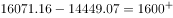亿元＞1500亿元；2013年：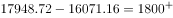亿元＞1500亿元；2014年：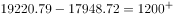亿元＜1500亿元，错误；

C项：定位统计表可知：广东、江苏、山东、浙江四个省份2014年的服务业增加值分别为：33223.28亿元、30599.49亿元、25840.12亿元、19220.79亿元；2015年分别为：36853.47亿元、34085.88亿元、28537.35亿元、21341.91亿元。则2014年表中四省服务业增加值总量=33223.28+30599.49+25840.12+19220.7933000+31000+26000+19000=109000，2015年总量=36853.47+34085.88+28537.35+21341.9137000+34000+29000+21000=121000。根据公式：增长率，则2015年四省服务业增加值总量较上年的增长率为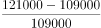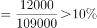，即增加了一成以上，正确；

D项：定位表格可知：2016年山东省服务业增加值为31669.03亿元，广东省为41816.37亿元。广东省服务业增加值的80%=41816.37×80%＞40000×80%=32000亿元＞31669.03亿元，错误。

故正确答案为C。

---

## 材料 2

        2016年，全国棉花产量534.3万吨，比2015年减产26.0万吨。

        播种面积减少是2016年我国棉花产量减少的主要原因。继2014、2015年后，2016年棉花播种面积继续减少。2016年全国棉花播种面积为3376.1千公顷，比2015年减少420.5千公顷。分地区看，新疆棉花播种面积比2015年减少99.1千公顷，下降约5.2%；其他省棉花播种面积减少321.3千公顷，下降约17%。

        从棉区看，黄河、长江流域棉区延续2015年减产较多的趋势。其中，黄河流域棉花播种面积减少147.8千公顷，下降约14.3%；单产每公顷增加63.3公斤，提高约6.0%；产量减少10.0万吨，下降约9.2%。长江流域棉花播种面积减少160.7千公顷，下降约19.8%；单产每公顷减少68.3公斤，下降约5.9%；产量减少23.0万吨，下降约24.6%。

        尽管我国最大的产棉区新疆棉花播种面积减少，但由于每公顷单产增加151.5公斤，棉花产量仍达到359.4万吨，比上年增加9.1万吨，增长约2.6%。新疆棉花产量占全国的比重进一步扩大到约67.3%，比上年提高约4.8个百分点。

### 第 6 题　qid 4658508 · 增长

2016年，全国棉花单位面积产量比上年约：

- **A**. 下降6.8%
- **B**. 下降3.9%
- **C**. 上升2.6%
- **D**. 上升7.2%　✅

**答案**：D

**官方解析**

根据题干“2016年······单位面积产量比上年约”，结合选项为“上升/下降+百分数”，可判定本题为平均数的增长率问题。定位文字材料第一、二段可得：2016年，全国棉花产量534.3万吨，比2015年减产26.0万吨；2016年全国棉花播种面积为3376.1千公顷，比2015年减少420.5千公顷。

方法一：根据公式：增长率，2016年全国棉花产量的同比增速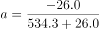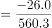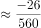，2016年全国棉花播种面积的同比增速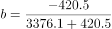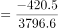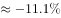。代入平均数的增长率计算公式：，2016年全国棉花单位面积产量的同比增速为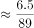，与D项最接近。

方法二：根据公式：单位面积产量，2016年全国棉花单位面积产量为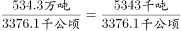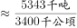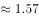吨/公顷，2015年全国棉花单位面积产量为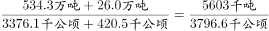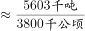吨/公顷。根据公式：增长率，2016年全国棉花单位面积产量同比增速为，与D项最接近。

故正确答案为D。

---

### 第 7 题　qid 4658517 · 综合

2015年，黄河流域的棉花单产为：

- **A**. 1118公斤/公顷
- **B**. 1092公斤/公顷
- **C**. 1055公斤/公顷　✅
- **D**. 1003公斤/公顷

**答案**：C

**官方解析**

根据题干“2015年······棉花单产为”，结合材料时间为2016年，可判定本题为基期计算问题。定位文字材料第三段可得：2016年黄河流域单产每公顷增加63.3公斤，提高约6.0%。根据公式：，可得2015年黄河流域的棉花单产量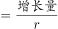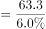公斤/公顷。

故正确答案为C。

---

### 第 8 题　qid 4658520 · 增长

2016年，黄河流域、长江流域和新疆三地之外的产棉地区棉花产量比上年：

- **A**. 减少6.8万吨
- **B**. 减少2.1万吨　✅
- **C**. 增加2.1万吨
- **D**. 增加6.8万吨

**答案**：B

**官方解析**

根据题干“2016年······棉花产量比上年”，结合选项带单位，可判定本题为增长量计算问题。定位文字材料第一段可得：2016年，全国棉花产量······比2015年减产26.0万吨；定位文字材料第三段可得：黄河流域棉花······产量减少10.0万吨······长江流域棉花······产量减少23.0万吨；定位文字材料第四段可得：（新疆）棉花产量······比上年增加9.1万吨。则2016年，黄河流域、长江流域和新疆三地之外的产棉地区棉花产量比上年增加-26.0-（-10.0）-（-23.0）-9.1=-2.1万吨，即减少2.1万吨。
故正确答案为B。

---

### 第 9 题　qid 4658521 · 增长

2016年，棉花播种面积同比降幅最大的是：

- **A**. 全国棉花播种面积
- **B**. 黄河流域棉花播种面积
- **C**. 新疆棉花播种面积
- **D**. 长江流域棉花播种面积　✅

**答案**：D

**官方解析**

根据题干“2016年······同比降幅最大的是”，可判定本题为一般增长率问题。定位文字材料第二段可得：2016年全国棉花播种面积为3376.1千公顷，比2015年减少420.5千公顷。分地区看，新疆棉花播种面积比2015年······下降约5.2%。定位文字材料第三段可得：黄河流域棉花播种面积······下降约14.3%······长江流域棉花播种面积······下降约19.8%。根据公式：增长率，可得2016年，全国棉花播种面积的同比增速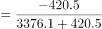。比较可知，2016年长江流域棉花播种面积同比降幅（19.8%）最大。

故正确答案为D。

---

### 第 10 题　qid 4658523 · 综合

不能从上述材料中推出的是：

- **A**. 2014-2016年，我国棉花播种面积逐年递减
- **B**. 2015年和2016年新疆棉花产量占全国的比重都大于60%
- **C**. 2015年和2016年新疆棉花播种面积占全国的比重都大于50%
- **D**. 2016年，黄河流域、长江流域棉区棉花播种面积和单产均减少　✅

**答案**：D

**官方解析**

A项：定位文字材料第二段可得，继2014、2015年后，2016年棉花播种面积继续减少，可推出2014-2016年，我国棉花播种面积逐年递减，正确；

B项：定位文字材料第四段可得，2016年新疆棉花产量占全国的比重约为67.3%，比上年提高约4.8个百分点，可推出2015年新疆棉花产量占全国的比重约为67.3%-4.8%=62.5%，故2015年和2016年新疆棉花产量占全国的比重都大于60%，正确；

C项：定位文字材料第二段可得，2016年全国棉花播种面积为3376.1千公顷，比2015年减少420.5千公顷，新疆棉花播种面积比2015年减少99.1千公顷，下降约5.2%。根据公式：基期量，可得2015年新疆棉花播种面积千公顷；根据公式：现期量=基期量+增长量，可得2016年新疆棉花播种面积=1905.8-99.1=1806.7千公顷；根据公式：基期量=现期量-增长量，可得2015年全国棉花播种面积=3376.1+420.5=3796.6千公顷；根据公式：比重，可得2015年和2016年新疆棉花播种面积占全国的比重分别为：、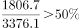，正确；

D项：定位文字材料第三段可得，2016年黄河流域棉花单产每公顷增加63.3公斤，提高约6.0%，可推出2016年黄河流域、长江流域棉区棉花播种面积和单产并非均减少，错误。

本题为选非题，故正确答案为D。

---

## 材料 3

        2016年，我国全年社会消费品零售总额332316亿元。按经营地统计，城镇消费品零售额285814亿元，增长10.4%；乡村消费品零售额46503亿元，增长10.9%。按消费类型统计，商品零售额296518亿元，增长10.4%；餐饮收入额35799亿元，增长10.8%。

        在限额以上企业商品零售额中，粮油、食品、饮料、烟酒类零售额比上年增长10.5%，服装、鞋帽、针纺织品类增长7.0%，化妆品类增长8.3%，金银珠宝类与上年持平，日用品类增长11.4%，家用电器和音像器材类增长8.7%，中西药品类增长12.0%，文化办公用品类增长11.2%，家具类增长12.7%，通讯器材类增长11.9%，建筑及装潢材料类增长14.0%，汽车类增长10.1%，石油及制品类增长1.2%。

        全年网上零售额51556亿元，比上年增长26.2%。其中，网上商品零售额41944亿元，增长25.6%，占社会消费品零售总额的比重为12.6%。在网上商品零售额中，吃类商品增长28.5%，穿类商品增长18.1%，用类商品增长28.8%。

### 第 11 题　qid 4658585 · 增长

2013-2016年，社会消费品零售总额同比增速最快的年份是：

- **A**. 2013年　✅
- **B**. 2014年
- **C**. 2015年
- **D**. 2016年

**答案**：A

**官方解析**

根据题干“2013-2016年······同比增速最快的年份是”，可判定本题为一般增长率问题。定位统计图可得：2012-2016年社会消费品零售总额分别为214433亿元、242843亿元、271896亿元、300931亿元、332316亿元。根据公式：增长率，可得2013-2016年社会消费品零售总额同比增速分别为：

2013年：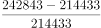；

2014年：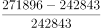；

2015年：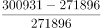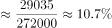；

2016年：。

则2013-2016年，社会消费品零售总额同比增速最快的年份是2013年。

故正确答案为A。

---

### 第 12 题　qid 4658586 · 增长

2016年，我国限额以上企业商品零售额，按增幅排序正确的是：

- **A**. 文化办公用品类＞通讯器材类＞日用品类
- **B**. 家具类＞中西药品类＞建筑及装潢材料类
- **C**. 汽车类＞化妆品类＞粮油、食品、饮料、烟酒类
- **D**. 家用电器和音像器材类＞服装、鞋帽、针纺织品类＞石油及制品类　✅

**答案**：D

**官方解析**

定位文字材料第二段，可得2016年限额以上企业商品零售额中各类商品同比增幅。代入选项验证，A项：文化办公用品类（11.2%）＜通讯器材类（11.9%），错误；B项：中西药品类（12.0%）＜建筑及装潢材料类（14.0%），错误；C项：化妆品类（8.3%）＜粮油、食品、饮料、烟酒类（10.5%），错误；D项：家用电器和音像器材类（8.7%）＞服装、鞋帽、针纺织品类（7.0%）＞石油及制品类（1.2%），正确。
故正确答案为D。

---

### 第 13 题　qid 4658629 · 比重

2015年，我国网上商品零售额占当年社会消费品零售总额的比重可用下列哪一图形表示？

- **A**. 

- **B**. 

　✅
- **C**. 

- **D**. 
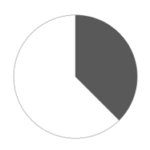

**答案**：B

**官方解析**

根据题干“2015年······占······的比重”，结合材料时间为2016年，可判定本题为基期比重问题。定位统计图，可得2015年社会消费品零售总额为300931亿元；定位文字材料第三段，可得2016年我国网上商品零售额41944亿元，增长25.6%。根据公式：基期量，2015年我国网上商品零售额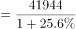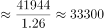亿元，则2015年我国网上商品零售额占当年社会消费品零售总额的比重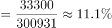，约占饼状图面积的，与B项最接近。

故正确答案为B。

---

### 第 14 题　qid 4658631 · 综合

如从2016年开始，社会消费品零售总额年增量保持不变，社会消费品零售总额首次超过40万亿元的年份是：

- **A**. 2017年
- **B**. 2018年
- **C**. 2019年　✅
- **D**. 2020年

**答案**：C

**官方解析**

根据题干“如从2016年开始······年增量保持不变······首次超过”，结合选项所求为2016年以后的时间，可判定本题为现期追赶问题。定位统计图可得：2015年和2016年社会消费品零售总额分别为300931亿元和332316亿元。根据公式：增长量=现期量-基期量，可得2016年社会消费品零售总额年增量=332316-300931=31385亿元；根据公式：现期量=基期量+n×增长量，可得332316+n×31385＞400000，解得n＞2.2，n为整数至少取3，即2019年首次超过40万亿元。
故正确答案为C。

---

### 第 15 题　qid 4658632 · 综合

不能从上述资料中推出的是：

- **A**. 2012-2016年，社会消费品零售总额超过140万亿元　✅
- **B**. 2015年，城镇消费品零售总额占当年社会消费品零售总额的80%以上
- **C**. 2016年，限额以上企业商品零售额中，并非所有品类都呈增长趋势
- **D**. 2016年，餐饮收入额占社会消费品零售总额的比重同比上升了不到0.4个百分点

**答案**：A

**官方解析**

A项：定位统计图，可知2012-2016年社会消费品零售总额分别为214433亿元、242843亿元、271896亿元、300931亿元、332316亿元。则2012-2016年，社会消费品零售总额为214433＋242843＋271896＋300931＋332316＜215000+243000+272000+301000+333000=1364000亿元=136.4万亿元＜140万亿元，错误；

B项：定位文字材料第一段可得，2016年城镇消费品零售额285814亿元，增长10.4%；定位统计图可得，2015年社会消费品零售总额为300931亿元。根据公式：基期量，则2015年城镇消费品零售额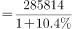亿元，则2015年城镇消费品零售总额占当年社会消费品零售总额比重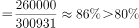，正确；

C项：定位文字材料第二段可得，2016年限额以上企业商品零售额中，金银珠宝类与上年持平。故2016年限额以上企业商品零售额中，并非所有品类都呈增长趋势，正确；

D项：定位文字材料第一段可得，2016年餐饮收入额35799亿元（A），增长10.8%（a）；定位统计图可得，2015年、2016年社会消费品零售总额分别为300931亿元、332316亿元（B）。根据公式：增长率，则2016年社会消费品零售总额同比增长率（b）；根据公式：两期比重差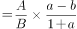，则2016年餐饮收入额占社会消费品零售总额的比重同比上升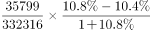，即上升不到0.4个百分点，正确。

本题为选非题，故正确答案为A。

---
