# 2021年四川省公务员录用考试《行测》题（网友回忆版）

> 资料分析 · 12 题 · 四川 2021

## 材料 1

        2019年，我国电信业务收入完成1.31万亿元，比上年增长。其中：固定数据及互联网业务收入完成2175亿元，比上年增长；移动数据及互联网业务收入6082亿元，比上年增长；固定增值业务收入1371亿元，比上年增长，其中，IPTV（网络电视）业务收入294亿元，比上年增长；物联网业务收入比上年增长。

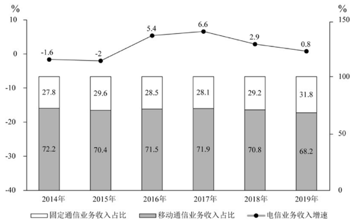

### 第 1 题　qid 3523607 · 综合

2018年我国电信业务收入约为多少万亿元？

- **A**. 1.09
- **B**. 1.15
- **C**. 1.26
- **D**. 1.30　✅

**答案**：D

**官方解析**

根据题干“2018年”“万亿元”，结合材料时间，可判定本题为基期计算问题。定位文字材料第一段“2019年，我国电信业务收入完成1.31万亿元，比上年增长”。结合公式基期量，可知2018年我国电信业务收入为，由于的绝对值，故可用化除为乘，则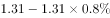万亿元。

故正确答案为D。

---

### 第 2 题　qid 3523608 · 增长

2015-2019年间，电信业务收入同比增速最高的年份，当年移动通信业务收入占比比上年：

- **A**. 上升了不到1个百分点　✅
- **B**. 上升了1个百分点以上
- **C**. 下降了不到1个百分点
- **D**. 下降了1个百分点以上

**答案**：A

**官方解析**

根据题干“······电信业务收入同比增速最高的年份，当年移动通信业务收入占比比上年”，结合选项与材料时间，可判定本题为两期比重计算问题。定位折线图找到增速最高的年份为2017年，定位柱形图找到2017年移动收入占比为，2016年移动收入占比为，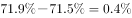，上升了0.4个百分点，即上升了不到1个百分点。

故正确答案为A。

---

### 第 3 题　qid 3523609 · 增长

2015-2018年间，固定通信业务收入同比增长的年份有几个？

- **A**. 1
- **B**. 2
- **C**. 3
- **D**. 4　✅

**答案**：D

**官方解析**

根据题干“固定通信业务收入同比增长的年份有几个”，结合材料中给出的固定通信业务收入占比和电信业务收入增速，可判定本题为两期比重问题。根据公式：现期量基期量和部分量整体量比重。

假设2014年电信业务收入为100，则2014年固定通信业务收入为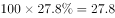，2015年固定通信业务收入为，则2015年固定通信业务收入同比增长。

假设2015年电信业务收入为100，则2015年固定通信业务收入为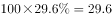，2016年固定通信业务收入为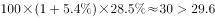，则2016年固定通信业务收入同比增长。

假设2016年电信业务收入为100，则2016年固定通信业务收入为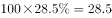，2017年固定通信业务收入为，则2017年固定通信业务收入同比增长。

假设2017年电信业务收入为100，则2017年固定通信业务收入为，2018年固定通信业务收入为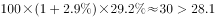，则2018年固定通信业务收入同比增长。

因此，2015-2018年固定通信业务收入同比增长的年份有4个。

故正确答案为D。

---

### 第 4 题　qid 3523610 · 比重

下列指标中，2019年的数值高于2018年的有几项？
①固定数据及互联网业务收入占电信业务收入比重
②移动数据及互联网业务收入占电信业务收入比重
③IPTV业务收入占固定增值业务收入比重

- **A**. 0
- **B**. 1
- **C**. 2　✅
- **D**. 3

**答案**：C

**官方解析**

根据题干“······2019年的数值高于2018年的有几项”，结合各项数值均为“······占······比重”，可判定本题为两期比重问题。定位文字材料可得：2019年，我国电信业务收入······比上年增长。其中：固定数据及互联网业务收入······比上年增长；移动数据及互联网业务收入······比上年增长；固定增值业务收入······比上年增长，其中，IPTV（网络电视）业务收入······比上年增长。根据两期比重结论：部分增长率整体增长率，则比重上升。

①固定数据及互联网业务收入的同比增长率（）电信业务收入的同比增长率（），则2019年的比重高于2018年，正确；

②移动数据及互联网业务收入的同比增长率（）电信业务收入的同比增长率（），则2019年的比重高于2018年，正确；

③IPTV（网络电视）业务收入的同比增长率（）固定增值业务收入的同比增长率（），则2019年的比重低于2018年，错误。

综上所述，2019年的数值高于2018年的有2项。

故正确答案为C。

---

### 第 5 题　qid 3523611 · 综合

不能从上述材料中推出的是：

- **A**. 2018年固定增值业务收入
- **B**. 2014-2018年电信业务总收入
- **C**. 2018年物联网业务收入的同比增长率　✅
- **D**. 2018年IPTV业务收入在全年电信业务收入中的占比

**答案**：C

**官方解析**

A项：定位文字材料可得：（2019年）固定增值业务收入1371亿元，比上年增长。根据公式：，则2018年固定增值业务收入为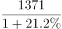亿元，可以推出，正确；

B项：定位文字材料可得：2019年，我国电信业务收入完成1.31万亿元，比上年增长。根据公式：，则2018年我国电信业务收入为万亿元。定位图形材料可得：2014-2018年电信业务收入的同比增速，同理可推出2017年、2016年、2015年、2014年的电信业务收入，进而可推出2014-2018年电信业务总收入，正确；

C项：材料中仅给出2019年物联网业务收入的同比增速，无法推出2018年物联网业务收入的同比增长率，错误；

D项：基期比重公式为，定位文字材料可得：2019年，我国电信业务收入完成1.31万亿元（），比上年增长（）；IPTV（网络电视）业务收入294亿元（），比上年增长（）。因此基期比重公式里的、、、四个量均有数据，可以推出2018年IPTV业务收入在全年电信业务收入中的占比，正确。

本题为选非题，故正确答案为C。

---

## 材料 2

        2017年全年，上海口岸货物进出口总额79211.40亿元，比上年增长。其中，进口33445.10亿元，增长；出口45766.30亿元，增长。全年上海关区货物进出口总额59690.24亿元，比上年增长。其中，进口24684.20亿元，增长；出口35006.04亿元，增长。

        全年上海市货物进出口总额32237.82亿元，比上年增长。其中，进口19117.51亿元，增长；出口13120.31亿元，增长。

### 第 6 题　qid 3523612 · 增长

2017年，上海口岸货物进出口总额比上年增加：

- **A**. 1万亿元以上　✅
- **B**. 0.7-1万亿元之间
- **C**. 0.4-0.7万亿元之间
- **D**. 不到0.4万亿元

**答案**：A

**官方解析**

根据题干“2017年，······比上年增加”，结合选项带单位，可判定本题为增长量计算问题。定位文字材料第一段可得：2017年全年，上海口岸货物进出口总额79211.40亿元，比上年增长。根据公式：增长量，则2017年上海口岸货物进出口总额同比增长量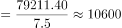亿元万亿元，即增加1万亿元以上。

故正确答案为A。

---

### 第 7 题　qid 3523613 · 增长

2017年，表中国家和地区自上海市货物进口额同比增速超过的有多少个？

- **A**. 2
- **B**. 3
- **C**. 4　✅
- **D**. 5

**答案**：C

**官方解析**

根据题干“2017年，······同比增速超过的有多少个”，可判定本题为一般增长率问题。各个国家和地区自上海市货物进口额，即上海市对其货物出口额。定位表格材料，可得2016年、2017年上海市对主要国家和地区货物出口额。根据公式：，可得2017年上海市对表中国家和地区货物出口额的同比增速分别为：

美国：，不符合；

欧盟：，符合；

东盟：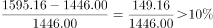，符合；

日本：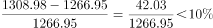，不符合；

中国香港：，不符合；

韩国：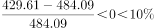，不符合；

中国台湾：，符合；

俄罗斯：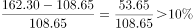，符合。

因此同比增速超过的有欧盟、东盟、中国台湾、俄罗斯，共4个。

故正确答案为C。

---

### 第 8 题　qid 3523614 · 综合

2017年，上海市对以下哪一个主要国家或地区实现的贸易顺差最大？

- **A**. 美国
- **B**. 欧盟
- **C**. 东盟
- **D**. 中国香港　✅

**答案**：D

**官方解析**

定位表格材料，可得2017年上海市对各个国家和地区货物进口额和出口额。根据贸易顺差额货物出口额货物进口额，则2017年上海市对各选项的贸易顺差额分别为：

A项：美国，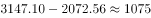亿元；

B项：欧盟，；

C项：东盟，；

D项：中国香港，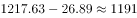亿元。

比较可知，2017年上海市对中国香港的贸易顺差最大。

故正确答案为D。

---

### 第 9 题　qid 3523615 · 综合

2017年全年，上海口岸货物进出口贸易顺差比同期上海关区顺差：

- **A**. 低不到0.3万亿元
- **B**. 低0.3万亿元以上
- **C**. 高不到0.3万亿元　✅
- **D**. 高0.3万亿元以上

**答案**：C

**官方解析**

定位文字材料第一段可知，2017年全年，上海口岸货物进口33445.10亿元，出口45766.30亿元；全年上海关区货物进口24684.20亿元，出口35006.04亿元。根据公式：进出口贸易顺差可得，2017年全年，上海口岸货物进出口贸易顺差亿元，上海关区货物进出口贸易顺差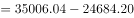亿元，故差值亿元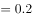万亿元，对应C项。

故正确答案为C。

---

### 第 10 题　qid 3523616 · 综合

能够从上述资料中推出的是：

- **A**. 2017年，上海关区月均货物进出口贸易额超过5000亿元
- **B**. 2017年，上海市自欧盟货物进口额占其进口总额的三成以上
- **C**. 2017年，上海市货物进口总额中自东盟进口额占比高于上年水平　✅
- **D**. 2017年，上海市自日本进口额同比增速慢于对日本出口额同比增速

**答案**：C

**官方解析**

A项：定位文字材料第一段可知，全年上海关区货物进出口总额59690.24亿元。根据公式：月均货物进出口贸易额可得，2017年上海关区月均货物进出口贸易额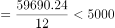亿元，错误；

B项：定位表格材料可知，2017年上海市自欧盟货物进口额为4488.51亿元；定位文字材料第二段可知，全年上海市货物进口19117.51亿元。则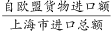，即上海市自欧盟货物进口额占其进口总额不到三成，错误；

C项：定位表格材料可知，上海市货物进口总额中自东盟进口额2016年为2069.86亿元，2017年为2642.73亿元；定位文字材料第二段可知，2017年全年上海市货物进口19117.51亿元，增长。根据两期比重比较口诀：当时，比重上升，即高于上年水平。则，，符合，正确；

D项：定位表格材料可知，上海市自日本进口额2016年为1941.73亿元，2017年为2224.75亿元；上海市对日本出口额2016年为1266.95亿元，2017年为1308.98亿元。根据公式：增长率可得，进口额的增长率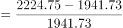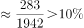，出口额的增长率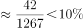，故2017年上海市自日本进口额同比增速快于对日本出口额同比增速，错误。

故正确答案为C。

---

## 材料 3

        2015年，我国汽车整车进口同比呈明显下降，共进口110.19万辆，同比下降22.73%。2015年，中国品牌轿车销售243.03万辆，同比下降12.5%，占轿车销售总量的20.7%，比上年同期下降1.7个百分点。

        2015年，中国品牌乘用车共销售873.76万辆，同比增长15.27%，占乘用车销售总量的41.32%，占有率比上年同期提升2.86个百分点。德系、日系、美系、韩系和法系乘用车分别销售399.82万辆、336.43万辆、259.57万辆、167.88万辆和72.93万辆。

        2015年12月，基本型乘用车产销量分别为120.29万辆和128.09万辆，环比增长0.21%和8.83%，同比增长4.50%和1.30%；运动型多用途乘用车（SUV）产销量分别为78.28万辆和79.40万辆，环比增长8.22%和10.86%，同比增长60.39%和60.73%；多功能乘用车（MPV）产销量分别24.88万辆和27.27万辆，环比增长13.01%和24.85%，同比增长13.53%和27.11%；交叉型乘用车产销量分别为8.65万辆和9.46万辆，环比增长-7.46%和3.31%，同比增长1.32%和2.87%。

        2015年新能源汽车生产340471辆，销售331092辆，同比分别增长3.3倍和3.4倍。其中，纯电动汽车产销分别完成254633辆和247482辆，同比分别增长4.2倍和4.5倍；插电式混合动力汽车产销分别完成85838辆和83610辆，同比增长1.9倍和1.8倍。

        新能源乘用车中，纯电动乘用车产销分别完成152172辆和146719辆，同比分别增长2.8倍和3倍；插电式混合动力乘用车产销分别完成62608辆和60663辆，同比均增长2.5倍。

        新能源商用车中，纯电动商用车产销分别完成102461辆和100763辆，同比分别增长10.4倍和10.6倍；插电式混合动力商用车产销分别完成23230辆和22947辆，同比增长91.1%和88.8%。

### 第 11 题　qid 3523619 · 综合

2014年，新能源汽车产量比销售量高约多少万辆?

- **A**. 0.1
- **B**. 0.2
- **C**. 0.3
- **D**. 0.4　✅

**答案**：D

**官方解析**

根据题干“2014年······比······高约多少万辆”，结合材料时间为2015年，可判定本题为基期和差问题。定位文字材料第4段可得：2015年新能源汽车生产340471辆，销售331092辆，同比分别增长3.3倍和3.4倍。根据公式:，则题干所求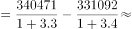79200-75200=4000辆=0.4万辆。

故正确答案为D。

---

### 第 12 题　qid 3523621 · 综合

关于2015年各类机动车产销状况，下列说法正确的是：

- **A**. 轿车销售总量超过1200万辆
- **B**. 纯电动商用车的销量大于产量
- **C**. 德系车销量占乘用车销售总量比重超过两成
- **D**. 纯电动乘用车产量占新能源乘用车产量的比重高于上年　✅

**答案**：D

**官方解析**

A项：定位文字材料第1段可得：2015年，中国品牌轿车销售243.03万辆，占轿车销售总量的20.7%。则2015年轿车销售总量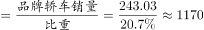万辆，未超过1200万辆，错误；

B项：定位文字材料第6段可得：2015年纯电动商用车产销分别完成102461辆和100763辆。则2015年纯电动商用车的销量（100763辆）小于产量（102461辆），错误；

C项：定位文字材料第2段可得：2015年，中国品牌乘用车共销售873.76万辆，占乘用车销售总量的41.32%。德系乘用车销售399.82万辆。则2015年乘用车销售总量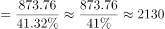万辆，2015年德系车销量占乘用车销售总量的比重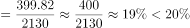，未超过两成，错误；

D项：定位文字材料第5段可得：2015年新能源乘用车中，纯电动乘用车产量同比增长2.8倍，插电式混合动力乘用车产量同比增长2.5倍。根据混合增长率结论：整体增速介于部分增速之间，即纯电动乘用车产量同比增速（2.8倍）＞新能源乘用车产量同比增速＞插电式混合动力乘用车产量同比增速（2.5倍），结合两期比重结论：部分增速大于整体增速，比重上升，故2015年纯电动乘用车产量占新能源乘用车产量的比重高于上年，正确。

故正确答案为D。

---
