# 2021年国家公务员录用考试《行测》题（副省级网友回忆版）

> 资料分析 · 20 题 · 国考 2021

## 材料 1

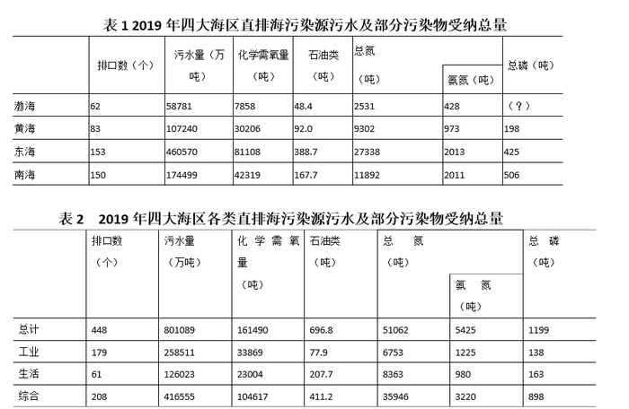

注：化学需氧量：废水、废水处理厂出水和污水中，能被强氧化剂氧化的物质的氧当量。化学需氧量越高，表示水中有机污染物越多，污染越严重。总氮：水中各种形态无机和有机氮的总量。氨氮：水中以游离氨和铵离子形式存在的氮，是总氮的组成部分之一。

### 第 1 题　qid 2719454 · 平均数

2019年，平均每个综合类直排海污染物排口排放污水量约是工业类的多少倍？

- **A**. 1.0
- **B**. 1.2
- **C**. 1.4　✅
- **D**. 1.6

**答案**：C

**官方解析**

根据题干“2019年，······约是······的多少倍”，结合材料时间2019年，可判定本题为现期倍数问题。定位表2可知，2019年综合类直排海污染物排口有208个，排放污水量416555万吨；工业类直排海污染物排口有179个，排放污水量258511万吨。根据平均每个直排海污染物排口排放污水量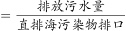，则平均每个综合类直排海污染物排口排放污水量为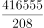万吨；平均每个工业类直排海污染物排口排放污水量为万吨，题干所求倍数为倍。

故正确答案为C。

---

### 第 2 题　qid 2719455 · 综合

表1中“（？）”处应当填入的数字最可能是：

- **A**. 60
- **B**. 70　✅
- **C**. 80
- **D**. 90

**答案**：B

**官方解析**

定位表2可知，2019年四大海区直排海污水中总磷污染物总量为1199吨；定位表1可知，黄海、东海、南海直排海污水中总磷污染物分别为198吨、425吨、506吨。则渤海直排海污水中总磷污染物为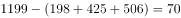吨，即应填入的数字为70。

故正确答案为B。

---

### 第 3 题　qid 2719457 · 平均数

2019年，平均每个直排海污染物排口排放石油类污染物的量最大的海区是：

- **A**. 东海　✅
- **B**. 南海
- **C**. 渤海
- **D**. 黄海

**答案**：A

**官方解析**

根据题干“2019年，平均每个直排海污染物排口排放石油类污染物······”，结合材料时间2019年，可判定本题为现期平均数问题。定位表1可知，2019年，渤海、黄海、东海、南海对应排口数分别为：62个、83个、153个、150个，石油类污染物分别为：48.4吨、92.0吨、388.7吨、167.7吨。根据平均每个直排海污染物排口排放石油类污染物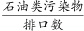，渤海、黄海、东海、南海平均每个直排海污染物排口排放石油类污染物分别为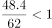、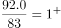、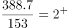、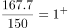。比较可知，平均数最大的海区是东海。

故正确答案为A。

---

### 第 4 题　qid 2719458 · 比重

2019年直排渤海的污染物中，氨氮占总氮的比重约比直排黄海的污染物中该比重：

- **A**. 低13个百分点
- **B**. 高13个百分点
- **C**. 低6个百分点
- **D**. 高6个百分点　✅

**答案**：D

**官方解析**

根据题干“2019年······氨氮占总氮的比重······”，结合材料时间2019年，可判定本题为现期比重问题。定位表1可知，2019年，渤海、黄海总氮受纳量分别为：2531吨、9302吨，氨氮受纳量分别为：428吨、973吨。2019年直排渤海的污染物中，氨氮占总氮的比重为；直排黄海的污染物中，氨氮占总氮的比重为。因此氨氮占总氮的比重在渤海与黄海的差值为，即高不足10个百分点，D项符合。

故正确答案为D。

---

### 第 5 题　qid 2719459 · 综合

关于2019年直排海污染源状况，不能从上述资料中推出的是：

- **A**. 
由综合类排口排放的总磷占所有排口排放总磷的以下

- **B**. 
平均每吨排往黄海的污水化学需氧量为四大海区中最高

- **C**. 
平均每个直排南海的污水排口日均污水排放量在3000-4000吨之间
　✅
- **D**. 
通过生活类排口排放的总氮量占所有排口总氮排放量的比重，高于通过生活类排口排的总磷量占所有排口总磷排放量的比重 

**答案**：C

**官方解析**

A项：根据表2可知，综合类排口排放的总磷为898吨，所有排口排放总磷为1199吨，占比为。正确；

B项：根据表1可知，四大海区平均每吨污水化学需氧量分别为：渤海：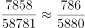；黄海：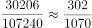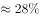；东海：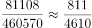；南海：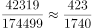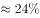。比较可知，黄海最高。正确；

C项：根据表1可知，2019年，南海排水口有150个，污水排放量为174499万吨，全年共有365天，则平均每个污水排口日均排放量为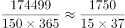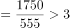万吨，并非在3000-4000吨之间。错误；

D项：根据表2可知，通过生活类排口排放的总氮量为8363吨，所有排口总氮排放量为51062吨，占比为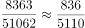；通过生活类排口排放的总磷量为163吨，所有排口总磷排放量为1199吨，占比为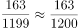，前者高于后者。正确。

本题为选非题，故正确答案为C。

---

## 材料 2

        2019年全国地铁运营线路长度达5181公里，占城轨交通运营线路总里程的。

        2019年末，我国城轨交通配属地铁列车6178列，全年实现地铁客运量227.76亿人次。

### 第 6 题　qid 2719383 · 增长

2014～2019年间，全国地铁运营线路长度同比增长以上的年份有几个？

- **A**. 1　✅
- **B**. 2
- **C**. 3
- **D**. 4

**答案**：A

**官方解析**

根据题干“······同比增长以上······”，可判定本题为一般增长率问题。定位柱状图可得2013~2019年间全国地铁运营线路长度。根据公式：增长率，同比增长以上，即现期量基期量基期量。2014年：；2015年：；2016年：；2017年：；2018年：；2019年：，因此2014年~2019年全国地铁运营线路长度同比增长以上的年份为2017年，有1个。

故正确答案为A。

---

### 第 7 题　qid 2719389 · 平均数

以下城市中，2019年末平均每条运营的地铁线路配属地铁列车数最多的是：

- **A**. 广州
- **B**. 武汉
- **C**. 成都　✅
- **D**. 南京

**答案**：C

**官方解析**

根据题干“2019年末平均每条运营的地铁线路配属地铁列车数······”，结合材料时间为2019年，可判定本题为现期平均数问题。定位表格可知，广州运营地铁线路条数为13条，配属地铁列车510列；武汉运营地铁线路条数为9条，配属地铁列车435列；成都运营地铁线路条数为7条，配属地铁列车410列；南京运营地铁线路条数为5条，配属地铁列车203列。

根据“平均每条运营的地铁线路配属地铁列车数”，则A项：广州为列；B项：武汉为列；C项：成都为列；D项：南京为列。故选项中2019年末平均每条运营的地铁线路配属地铁列车数最多的城市是成都。

故正确答案为C。

---

### 第 8 题　qid 2719387 · 比重

2019年，直辖市（北京、天津、上海、重庆）地铁客运量占全国地铁客运总量的比重在以下哪个范围内？

- **A**. 
不到
　✅
- **B**. 
～之间

- **C**. 
～之间

- **D**. 
超过

**答案**：A

**官方解析**

根据题干“2019年······占······的比重······”，结合材料时间为2019年，可判定本题为现期比重问题。定位文字材料第二段，2019年末，全年实现地铁客运量227.76亿人次。定位表格可知，北京、天津、上海、重庆的地铁客运量分别为39.4亿人次、4.7亿人次、38.7亿人次、6.1亿人次。代入公式：比重，则题干所求比重为。

故正确答案为A。

---

### 第 9 题　qid 2719390 · 平均数

表中所列2019年地铁客运量超过10亿人次的城市中，2019年平均每条地铁运营线路长度超过40公里的城市有几个？

- **A**. 1
- **B**. 2　✅
- **C**. 3
- **D**. 4

**答案**：B

**官方解析**

根据题干“2019年······平均每条地铁运营线路长度······”，结合材料时间是2019年，可判定本题为现期平均数问题。定位表格可得，2019年地铁客运量超过10亿人次的城市有：上海、北京、广州、武汉、深圳、成都、南京。其对应的平均每条地铁运营线路长度，分别为：上海公里/条；北京公里/条；广州公里/条；武汉公里/条；深圳公里/条；成都公里/条；南京公里/条。因此，符合题意的城市有上海、成都两个。

故正确答案为B。

---

### 第 10 题　qid 2719392 · 综合

能够从上述资料中推出的是：

- **A**. 
2019年全国城轨交通运营线路总里程不到6000公里

- **B**. 
2019年全国地铁运营线路长度相比2016年增量是2016年相比2013年增量的两倍以上

- **C**. 
表中2019年末地铁运营线路长度排名前3的城市地铁运营线路长度之和占全国总量的以上

- **D**. 
表中2019年平均每条运营线路客运量最少的城市，地铁客运量在表中各城市排前10位
　✅

**答案**：D

**官方解析**

A项，定位文字材料第一段“2019年全国地铁运营线路长度达5181公里，占城轨交通运营线路总里程的”，可得2019年全国城轨交通运营线路总里程为公里，错误。

B项，定位柱状图材料可知，2019年、2016年、2013年地铁运营线路长度分别为5181公里、3169公里、2073公里，因此，2019年全国地铁营运线路长度相比2016年的增量为公里，而2016年相比2013年的增量为公里。倍，错误。

C项，定位表格材料，2019年末地铁运营线路长度排前3的城市是上海、北京、广州，其运营长度分别为669.5公里、637.6公里，489.4公里，三者占全国的比重为，错误。

D项，定位表格材料，平均每条地铁运营线路客运量为。对运营线路条数相同的，我们只需要找客运量最小的即可。有4条运营线路的城市中，客运量最小的是苏州，平均客运量为亿人次/条；有5条运营线路的城市中，客运量最小的是天津，平均客运量为亿人次/条；有7条运营线路的城市中，客运量最小的是重庆，平均客运量为亿人次/条；观察其他城市的客运量都是大于运营线路条数，即平均客运量1亿人次/条。因此，平均每条地铁运营线路客运量最小的是重庆，其客运量6.1亿人次在表格城市中排名第10，排名在前10位，正确。

故正确答案为D。

---

## 材料 3

        截至2019年末，全国已有残疾人康复机构9775个，比2018年增长739个。2019年，1043.0万残疾儿童及持证残疾人得到基本康复服务，其中包括0～6岁残疾儿童18.1万人。

        截至2019年末，全国已竣工的各级残疾人综合服务设施2341个，总建设规模584.5万平方米，总投资183.1亿元；已竣工各级残疾人康复设施1006个，总建设规模414.2万平方米，总投资132.2亿元。

### 第 11 题　qid 2719394 · 增长

2016～2019年，全国残疾人康复机构数量同比增量最大的年份是：

- **A**. 2016年　✅
- **B**. 2017年
- **C**. 2018年
- **D**. 2019年

**答案**：A

**官方解析**

根据题干“2016~2019年，······同比增量最大的年份是”，可判定本题为增长量比较问题。定位文字材料第一段可知，2019年全国残疾人康复机构比2018年增长739个；定位图形材料1可得：2015~2018年全国残疾人康复机构数量分别为7111、7858、8334、9036个。根据增长量现期量基期量，各年份的增长量分别为：

2016年，个；

2017年，个；

2018年，个。可知同比增长量最大的年份是2016年。

故正确答案为A。

---

### 第 12 题　qid 2719396 · 比重

2019年末，提供肢体残疾康复服务的康复机构的数量占全国残疾人康复机构总数的比重，比提供精神残疾康复服务的康复机构的数量占全国残疾人康复机构总数的比重高约多少个百分点？

- **A**. 13
- **B**. 18
- **C**. 23　✅
- **D**. 28

**答案**：C

**官方解析**

根据题干“2019年末，······占······的比重，比······占······的比重高约多少个百分点”，结合材料所给时间为2019年，可判定本题为现期比重问题。定位图形材料1可得：2019年全国残疾人康复机构总数为9775个；定位图形材料2可得：提供肢体残疾康复服务的机构数量为4312个，提供精神残疾康复服务的机构数量为2022个。所求比重差。

故正确答案为C。

---

### 第 13 题　qid 2719397 · 综合

如提供视力残疾康复服务的残疾人康复机构中，同时提供听力言语残疾康复服务的机构比不提供该服务的机构多，则2019年末全国有多少家残疾人康复机构不提供以上两种康复服务中的任意一种？

- **A**. 不到7300家
- **B**. 7300～7600家之间　✅
- **C**. 7600～7900家之间
- **D**. 超过7900家

**答案**：B

**官方解析**

定位图形材料1可得：2019年全国残疾人康复机构总数为9775个；定位图形材料2可得：提供视力残疾康复服务的机构为1430个，提供听力言语残疾康复服务的机构为1669个。根据题干“提供视力残疾康复服务的残疾人康复机构中，同时提供听力言语残疾康复服务的机构比不提供该服务的机构多”，假设在提供视力残疾康复服务的机构中，不提供听力言语残疾康复服务的机构数为个，则提供的机构数为个，可得：，解得，即只提供视力残疾康复服务的机构为650个。因此2019年末不提供以上两种康复服务中的任意一种的机构数为个，在B项范围内。

故正确答案为B。

---

### 第 14 题　qid 2719399 · 平均数

截至2019年末，全国平均每个已竣工的残疾人综合服务设施建设规模约是已竣工残疾人康复设施的多少倍？

- **A**. 0.6　✅
- **B**. 0.8
- **C**. 1.2
- **D**. 1.7

**答案**：A

**官方解析**

根据题干“截至2019年末，······是······的多少倍”，结合材料数据时间是2019年，可判定此题为现期倍数问题。定位文字材料第二段可得，截至2019年末，全国已竣工的各级残疾人综合服务设施2341个，总建设规模584.5万平方米，已竣工各级残疾人康复设施1006个，总建设规模414.2万平方米。则截至2019年末，全国平均每个已竣工的残疾人综合服务设施建设规模是已竣工残疾人康复设施的倍数为：倍。

故正确答案为A。

---

### 第 15 题　qid 2719402 · 综合

能够从上述资料中推出的是：

- **A**. 
2019年，全国得到基本康复服务的0～6岁残疾儿童占得到基本康复服务的残疾儿童及持证残疾人的以上

- **B**. 
2015年，全国平均每月新增残疾人康复机构20家以上

- **C**. 
2019年末，全国残疾人康复机构中，超过提供孤独症儿童康复服务

- **D**. 
截至2019年末，全国已竣工的各级残疾人综合服务设施平均每平方米的投资额在3000～4000元之间
　✅

**答案**：D

**官方解析**

A项：定位文字材料第一段，2019年，1043.0万残疾儿童及持证残疾人得到基本康复服务，其中包括0~6岁残疾儿童18.1万人，则2019年，全国得到基本康复服务的0~6岁残疾儿童占比为，错误；

B项：定位图形材料1，2014年、2015年全国已有残疾人康复机构分别为6914个、7111个，可知2015年，平均每月新增残疾人康复机构为家，错误；

C项：定位文字材料第一段可得，2019年末，全国已有残疾人康复机构9775个，定位图形材料2可得，2019年末提供孤独症儿童康复服务机构2238个，则2019年末，提供孤独症儿童康复服务的机构占比为，错误；

D项：定位文字材料第二段，至2019年末，全国已竣工的各级残疾人综合服务设施2341个，总建设规模584.5万平方米，总投资183.1亿元。可知全国已竣工的各级残疾人综合服务设施平均每平方米的投资额为，在3000~4000元之间，正确。

故正确答案为D。

---

## 材料 4

        2020年1-2月，我国境内投资者共对全球147个国家和地区的1733家境外企业进行了非金融类直接投资，累计实现投资1078.6亿元人民币，同比增长。对外承包工程完成营业额1080亿元人民币，同比下降，新签合同额2150.3亿元人民币，同比增长。对外劳务合作派出各类劳务人员3.9万人，同比减少2.9万人，2月末在外各类劳务人员77.8万人。

        2020年1-2月，我国对外投资合作主要呈现以下特点：

        一是对“一带一路”投资合作增幅较大。2020年1-2月，我国企业对“一带一路”沿线的48个国家有新增投资，合计27.2亿美元，同比增长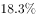。在“一带一路”沿线的59个国家新签对外承包工程合同额153.6亿美元，同比增长，完成营业额91.4亿美元。

        二是对外投资结构持续多元。2020年1-2月，对外投资主要流向租赁和商务服务业、批发和零售业、制造业和采矿业等传统投资领域，占对境外企业非金融类直接投资的比重分别为、、和。其中流向租赁和商务服务业的投资额同比增长，成为增速最高的领域。

        三是对外承包工程新签大项目增多。2020年1-2月，对外承包工程新签合同额在5000万美元以上的项目有115个，较去年同期增加29个，占新签合同总额的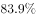。

### 第 16 题　qid 2719461 · 综合

2020年1-2月，我国境内投资者对每个当期内产生非金融类直接投资的境外企业的非金融类直接投资额均值约为多少亿元人民币？

- **A**. 1.6
- **B**. 1.3
- **C**. 0.8
- **D**. 0.6　✅

**答案**：D

**官方解析**

根据题干“2020年1-2月，······每个······均值约为多少亿元人民币”，可判定本题为现期平均数问题。定位文字资料第一段“2020年1-2月，我国境内投资者共对全球147个国家和地区的1733家境外企业进行了非金融类直接投资，累计实现投资1078.6亿元人民币，同比增长”，可得，累计实现投资额1078.6亿元人民币，境外企业数为1733家，故题干所求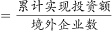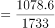亿元人民币。

故正确答案为D。

---

### 第 17 题　qid 2719462 · 综合

2019年1-2月，我国对外承包工程月均完成营业额比月均新签合同额：

- **A**. 高不到300亿元人民币
- **B**. 高300亿元人民币以上
- **C**. 低不到300亿元人民币　✅
- **D**. 低300亿元人民币以上

**答案**：C

**官方解析**

根据题干“2019年1-2月，······月均······”，结合材料时间为2020年1-2月，可判定本题为基期平均数问题。定位文字材料第一段，可知2020年1-2月，对外承包工程完成营业额1080亿元人民币，同比下降，新签合同额2150.3亿元人民币，同比增长。根据公式，可得2019年1-2月，我国对外承包工程月均完成营业额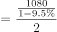，月均新签合同额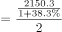，则题干所求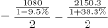亿元人民币，即2019年1-2月，我国对外承包工程月均完成营业额比月均新签合同额低不到300亿元人民币。

故正确答案为C。

---

### 第 18 题　qid 2719463 · 比重

2020年1-2月，租赁和商务服务业对外投资额占对境外企业非金融类直接投资额的比重比上年同期约：

- **A**. 上升了3个百分点
- **B**. 上升了12个百分点　✅
- **C**. 下降了3个百分点
- **D**. 下降了12个百分点

**答案**：B

**官方解析**

根据题干“2020年1-2月，······占······的比重比上年同期约”，结合选项为上升/下降百分点，可判定本题为两期比重差计算问题。定位材料第一段可得，2020年1-2月······累计实现投资（）1078.6亿元人民币，同比增长（）；定位材料第四段可得，2020年1-2月，对外投资主要流向租赁和商务服务业、批发和零售业、制造业和采矿业等传统投资领域，占对境外企业非金融类直接投资的比重分别为、、和。其中流向租赁和商务服务业的投资额同比增长（），成为增速最高的领域。

根据两期比重差计算公式：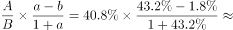，B项符合。

故正确答案为B。

---

### 第 19 题　qid 2719464 · 平均数

如2020年1-2月人民币与美元的汇率稳定为7元人民币兑换1美元，则同期对外承包工程新签合同额在5000万美元以上的项目的平均新签合同额在以下哪个范围内？

- **A**. 2亿美元以上　✅
- **B**. 1.5-2亿美元之间
- **C**. 1-1.5亿美元之间
- **D**. 0.5-1亿美元之间

**答案**：A

**官方解析**

根据题干“2020年1-2月······同期······的平均新签合同额在以下哪个范围内”，可判定本题为现期平均数计算问题。定位材料第一段可得，2020年1-2月······新签合同额2150.3亿元人民币；定位材料最后一段可得，2020年1-2月，对外承包工程新签合同额在5000万美元以上的项目有115个······，占新签合同总额的。根据题干可知，人民币与美元的汇率稳定为7元人民币兑换1美元，则对外承包工程新签合同额在5000万美元以上的项目合同总额为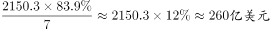，所求平均数为，在A项范围之内。

故正确答案为A。

---

### 第 20 题　qid 2719465 · 综合

能够从上述资料中推出的是：

- **A**. 2019年1-2月，我国境内投资者对境外企业非金融类直接投资额高于对外承包工程完成营业额
- **B**. 2019年1-2月，我国对外劳务合作月均派出各类劳务人员不到1万人
- **C**. 2020年1-2月，我国企业有新增投资的“一带一路”沿线国家中，我国企业平均对每个国家的新增投资额超过0.6亿美元
- **D**. 2020年1-2月，我国企业在“一带一路”沿线国家新签对外承包工程合同额同比增量超过30亿美元　✅

**答案**：D

**官方解析**

A项：定位文字材料第一段：2020年1-2月，我国境内投资者共对······境外企业进行了非金融类直接投资，累计实现投资1078.6亿元人民币，同比增长；对外承包工程完成营业额1080亿元人民币，同比下降。根据公式：，则2019年1-2月非金融类直接投资额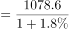，对外承包工程完成营业额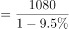，后者分子大且分母小，故前者后者，并非高于，错误；

B项：定位文字材料第一段：2020年1-2月，对外劳务合作派出各类劳务人员3.9万人，同比减少2.9万人。则2019年1-2月，我国对外劳务合作月均派出各类劳务人员为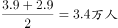，大于1万人，错误；

C项：定位文字材料第三段：2020年1-2月，我国企业对“一带一路”沿线的48个国家有新增投资，合计27.2亿美元。则我国企业平均对每个国家的新增投资额为，不到0.6亿美元，错误；

D项：定位文字材料第三段：2020年1-2月，在“一带一路”沿线的59个国家新签对外承包工程合同额153.6亿美元，同比增长。根据，所求同比增量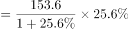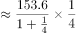，正确。

故正确答案为D。

---
