# 2021年国家公务员录用考试《行测》题（地市级网友回忆版）

> 资料分析 · 20 题 · 国考 2021

## 材料 1

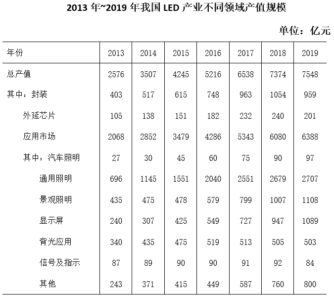

### 第 1 题　qid 2719362 · 增长

“十三五”（2016～2020年）最后一年我国LED产业总产值要实现比“十二五”（2011～2015年）最后一年翻番的目标，总产值至少要同比增长（    ）。

- **A**. 

- **B**. 
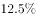
　✅
- **C**. 
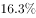

- **D**. 

**答案**：B

**官方解析**

由题干“总产值······同比增长”，结合选项都是百分数，可判定本题为一般增长率问题。定位表格，2015、2019年我国LED产业总产值分别为4245亿元、7548亿元。要实现2020年总产值比2015年翻番的目标，则2020年的总产值至少是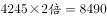亿元。根据公式：增长率，可得2020年总产值至少要比2019年增长，B项满足。

故正确答案为B。

---

### 第 2 题　qid 2719366 · 增长

2014～2019年间，我国LED产业封装、外延芯片和应用市场产值同比增速均超过的年份有几个？

- **A**. 1
- **B**. 2
- **C**. 3　✅
- **D**. 4

**答案**：C

**官方解析**

由题干“······同比增速均超过的年份······”，可判定本题为一般增长率问题。定位表格，2013~2019年，我国LED产业封装产值分别是403、517、615、748、963、1054、959亿元。根据公式：增长率=，可得2014年增长率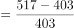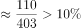，2015年增长率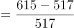，2016年增长率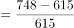，2017年增长率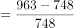，2018年增长率，2019年增长率。故LED产业封装产值增速超过的年份有2014、2015、2016、2017年，而2018、2019年排除。

2013~2017年，我国外延芯片产值分别是105、138、151、182、232亿元。根据公式：增长率=，可得2014年增长率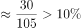，2015年增长率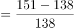，2016年增长率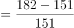，2017年增长率，故增速超过的年份有2014、2016、2017年，而2015年排除。

2013~2017年，我国应用市场产值分别是2068、2852、3479、4286、5343亿元。根据公式：增长率=，可得2014年增长率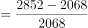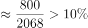，2016年增长率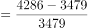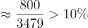，2017年增长率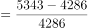。故增速均超过的年份有2014、2016、2017年，共计3年。

故正确答案为C。

---

### 第 3 题　qid 2719371 · 增长

在表中所列各类LED应用市场中，2013～2019年产值年均增速（以2013年为基期）最快的应用市场，2019年产值约占LED行业总产值的（    ）。

- **A**. 

　✅
- **B**. 

- **C**. 

- **D**. 

**答案**：A

**官方解析**

由题干“2019年······占······”，结合材料时间，可判定本题为现期比重问题。题干中要找出2013~2019年产值年均增速最快的应用市场，因年份差相同（以2013年为基期，年份差均为年），则只需比较。定位表格，各类LED应用市场产值的分别是：汽车照明，通用照明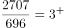，景观照明，显示屏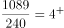，背光应用，信号及指示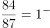，其他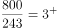。故年均增速最快的是显示屏。

2019年显示屏产值为1089亿元，LED行业总产值为7548亿元，则2019年其比重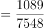，A项满足。

故正确答案为A。

---

### 第 4 题　qid 2719375 · 增长

以下折线图中，能准确反映2015～2018年间通用照明类LED应用市场产值同比增量变化趋势的是（    ）。

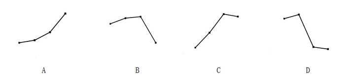

- **A**. A
- **B**. B　✅
- **C**. C
- **D**. D

**答案**：B

**官方解析**

根据题干“2015~2018年间······同比增量变化趋势”，可判定本题为增长量比较问题。定位统计表可得，2014~2018年间，通用照明类LED应用市场产值分别为1145、1551、2040、2551、2679亿元。根据增长量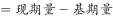，2015~2018年通用照明类LED应用市场产值同比增量分别为亿元、2040-1551=亿元、2551-2040=亿元、2679-2551=亿元，增长量为先上升后下降，且2017年增量最高、2018年增量最低，与B项变化趋势一致。

故正确答案为B。

---

### 第 5 题　qid 2719378 · 综合

关于2013～2019年我国LED产业，能够从上述资料中推出的是（    ）。

- **A**. 2016年总产值同比增量低于2015年
- **B**. 2019年封装产值占行业总产值比重高于5年前水平
- **C**. 7年间汽车照明应用累计产值规模超过500亿元
- **D**. 每年景观照明应用的产值均高于背光应用产值　✅

**答案**：D

**官方解析**

A项：定位统计表可得，2014~2016年，我国LED产业总产值分别为3507、4245、5216亿元，根据增长量，2015年LED产业总产值同比增量为亿元，2016年为亿元，2016年总产值同比增量高于2015年，错误；

B项：定位统计表可得，2019年，我国LED产业总产值为7548亿元，封装产值为959亿元；2014年总产值为3507亿元，封装产值为517亿元。2019年封装产值占行业总产值比重为，2014年所占比重为，可知2019年封装产值占行业总产值比重低于5年前水平，错误；

C项：定位统计表可得，2013~2019年，汽车照明产值分别为27、30、45、60、75、90、97亿元，累计产值规模为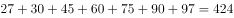亿元亿元，错误；

D项：定位统计表可得，2013~2019年景观照明应用产值分别为435、475、478、579、799、1007、1108亿元，背光应用产值分别为340、435、475、519、513、505、503亿元，每年景观照明应用产值均高于背光应用产值，正确。

故正确答案为D。

---

## 材料 2

        2019年全国地铁运营线路长度达5181公里，占城轨交通运营线路总里程的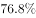。

        2019年末，我国城轨交通配属地铁列车6178列，全年实现地铁客运量227.76亿人次。

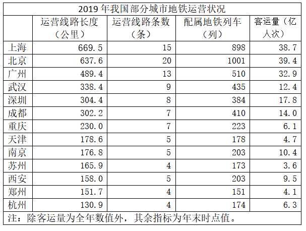

### 第 6 题　qid 2719383 · 增长

2014～2019年间，全国地铁运营线路长度同比增长以上的年份有几个？

- **A**. 1　✅
- **B**. 2
- **C**. 3
- **D**. 4

**答案**：A

**官方解析**

根据题干“······同比增长以上······”，可判定本题为一般增长率问题。定位柱状图可得2013~2019年间全国地铁运营线路长度。根据公式：增长率，同比增长以上，即现期量基期量基期量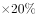。2014年：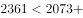；2015年：；2016年：；2017年：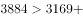；2018年：；2019年：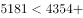，因此2014年~2019年全国地铁运营线路长度同比增长以上的年份为2017年，有1个。

故正确答案为A。

---

### 第 7 题　qid 2719387 · 比重

2019年，直辖市（北京、天津、上海、重庆）地铁客运量占全国地铁客运总量的比重在以下哪个范围内？

- **A**. 
不到
　✅
- **B**. 
～之间

- **C**. 
～之间

- **D**. 
超过

**答案**：A

**官方解析**

根据题干“2019年······占······的比重······”，结合材料时间为2019年，可判定本题为现期比重问题。定位文字材料第二段，2019年末，全年实现地铁客运量227.76亿人次。定位表格可知，北京、天津、上海、重庆的地铁客运量分别为39.4亿人次、4.7亿人次、38.7亿人次、6.1亿人次。代入公式：比重，则题干所求比重为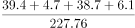。

故正确答案为A。

---

### 第 8 题　qid 2719389 · 平均数

以下城市中，2019年末平均每条运营的地铁线路配属地铁列车数最多的是：

- **A**. 广州
- **B**. 武汉
- **C**. 成都　✅
- **D**. 南京

**答案**：C

**官方解析**

根据题干“2019年末平均每条运营的地铁线路配属地铁列车数······”，结合材料时间为2019年，可判定本题为现期平均数问题。定位表格可知，广州运营地铁线路条数为13条，配属地铁列车510列；武汉运营地铁线路条数为9条，配属地铁列车435列；成都运营地铁线路条数为7条，配属地铁列车410列；南京运营地铁线路条数为5条，配属地铁列车203列。

根据“平均每条运营的地铁线路配属地铁列车数”，则A项：广州为列；B项：武汉为列；C项：成都为列；D项：南京为列。故选项中2019年末平均每条运营的地铁线路配属地铁列车数最多的城市是成都。

故正确答案为C。

---

### 第 9 题　qid 2719390 · 平均数

表中所列2019年地铁客运量超过10亿人次的城市中，2019年平均每条地铁运营线路长度超过40公里的城市有几个？

- **A**. 1
- **B**. 2　✅
- **C**. 3
- **D**. 4

**答案**：B

**官方解析**

根据题干“2019年······平均每条地铁运营线路长度······”，结合材料时间是2019年，可判定本题为现期平均数问题。定位表格可得，2019年地铁客运量超过10亿人次的城市有：上海、北京、广州、武汉、深圳、成都、南京。其对应的平均每条地铁运营线路长度，分别为：上海公里/条；北京公里/条；广州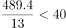公里/条；武汉公里/条；深圳公里/条；成都公里/条；南京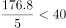公里/条。因此，符合题意的城市有上海、成都两个。

故正确答案为B。

---

### 第 10 题　qid 2719392 · 综合

能够从上述资料中推出的是：

- **A**. 
2019年全国城轨交通运营线路总里程不到6000公里

- **B**. 
2019年全国地铁运营线路长度相比2016年增量是2016年相比2013年增量的两倍以上

- **C**. 
表中2019年末地铁运营线路长度排名前3的城市地铁运营线路长度之和占全国总量的以上

- **D**. 
表中2019年平均每条运营线路客运量最少的城市，地铁客运量在表中各城市排前10位
　✅

**答案**：D

**官方解析**

A项，定位文字材料第一段“2019年全国地铁运营线路长度达5181公里，占城轨交通运营线路总里程的”，可得2019年全国城轨交通运营线路总里程为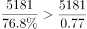公里，错误。

B项，定位柱状图材料可知，2019年、2016年、2013年地铁运营线路长度分别为5181公里、3169公里、2073公里，因此，2019年全国地铁营运线路长度相比2016年的增量为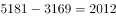公里，而2016年相比2013年的增量为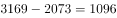公里。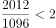倍，错误。

C项，定位表格材料，2019年末地铁运营线路长度排前3的城市是上海、北京、广州，其运营长度分别为669.5公里、637.6公里，489.4公里，三者占全国的比重为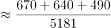，错误。

D项，定位表格材料，平均每条地铁运营线路客运量为。对运营线路条数相同的，我们只需要找客运量最小的即可。有4条运营线路的城市中，客运量最小的是苏州，平均客运量为亿人次/条；有5条运营线路的城市中，客运量最小的是天津，平均客运量为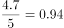亿人次/条；有7条运营线路的城市中，客运量最小的是重庆，平均客运量为亿人次/条；观察其他城市的客运量都是大于运营线路条数，即平均客运量1亿人次/条。因此，平均每条地铁运营线路客运量最小的是重庆，其客运量6.1亿人次在表格城市中排名第10，排名在前10位，正确。

故正确答案为D。

---

## 材料 3

        截至2019年末，全国已有残疾人康复机构9775个，比2018年增长739个。2019年，1043.0万残疾儿童及持证残疾人得到基本康复服务，其中包括0～6岁残疾儿童18.1万人。

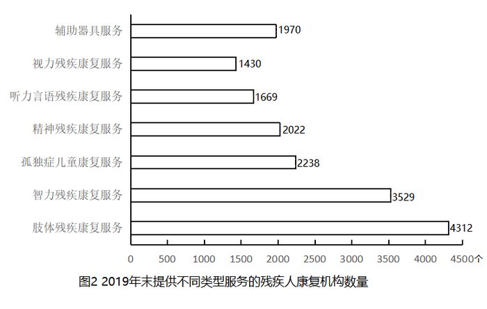

        截至2019年末，全国已竣工的各级残疾人综合服务设施2341个，总建设规模584.5万平方米，总投资183.1亿元；已竣工各级残疾人康复设施1006个，总建设规模414.2万平方米，总投资132.2亿元。

### 第 11 题　qid 2719394 · 增长

2016～2019年，全国残疾人康复机构数量同比增量最大的年份是：

- **A**. 2016年　✅
- **B**. 2017年
- **C**. 2018年
- **D**. 2019年

**答案**：A

**官方解析**

根据题干“2016~2019年，······同比增量最大的年份是”，可判定本题为增长量比较问题。定位文字材料第一段可知，2019年全国残疾人康复机构比2018年增长739个；定位图形材料1可得：2015~2018年全国残疾人康复机构数量分别为7111、7858、8334、9036个。根据增长量现期量基期量，各年份的增长量分别为：

2016年，个；

2017年，个；

2018年，个。可知同比增长量最大的年份是2016年。

故正确答案为A。

---

### 第 12 题　qid 2719396 · 比重

2019年末，提供肢体残疾康复服务的康复机构的数量占全国残疾人康复机构总数的比重，比提供精神残疾康复服务的康复机构的数量占全国残疾人康复机构总数的比重高约多少个百分点？

- **A**. 13
- **B**. 18
- **C**. 23　✅
- **D**. 28

**答案**：C

**官方解析**

根据题干“2019年末，······占······的比重，比······占······的比重高约多少个百分点”，结合材料所给时间为2019年，可判定本题为现期比重问题。定位图形材料1可得：2019年全国残疾人康复机构总数为9775个；定位图形材料2可得：提供肢体残疾康复服务的机构数量为4312个，提供精神残疾康复服务的机构数量为2022个。所求比重差。

故正确答案为C。

---

### 第 13 题　qid 2719397 · 综合

如提供视力残疾康复服务的残疾人康复机构中，同时提供听力言语残疾康复服务的机构比不提供该服务的机构多，则2019年末全国有多少家残疾人康复机构不提供以上两种康复服务中的任意一种？

- **A**. 不到7300家
- **B**. 7300～7600家之间　✅
- **C**. 7600～7900家之间
- **D**. 超过7900家

**答案**：B

**官方解析**

定位图形材料1可得：2019年全国残疾人康复机构总数为9775个；定位图形材料2可得：提供视力残疾康复服务的机构为1430个，提供听力言语残疾康复服务的机构为1669个。根据题干“提供视力残疾康复服务的残疾人康复机构中，同时提供听力言语残疾康复服务的机构比不提供该服务的机构多”，假设在提供视力残疾康复服务的机构中，不提供听力言语残疾康复服务的机构数为个，则提供的机构数为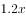个，可得：，解得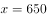，即只提供视力残疾康复服务的机构为650个。因此2019年末不提供以上两种康复服务中的任意一种的机构数为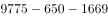个，在B项范围内。

故正确答案为B。

---

### 第 14 题　qid 2719399 · 平均数

截至2019年末，全国平均每个已竣工的残疾人综合服务设施建设规模约是已竣工残疾人康复设施的多少倍？

- **A**. 0.6　✅
- **B**. 0.8
- **C**. 1.2
- **D**. 1.7

**答案**：A

**官方解析**

根据题干“截至2019年末，······是······的多少倍”，结合材料数据时间是2019年，可判定此题为现期倍数问题。定位文字材料第二段可得，截至2019年末，全国已竣工的各级残疾人综合服务设施2341个，总建设规模584.5万平方米，已竣工各级残疾人康复设施1006个，总建设规模414.2万平方米。则截至2019年末，全国平均每个已竣工的残疾人综合服务设施建设规模是已竣工残疾人康复设施的倍数为：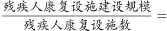倍。

故正确答案为A。

---

### 第 15 题　qid 2719402 · 综合

能够从上述资料中推出的是：

- **A**. 
2019年，全国得到基本康复服务的0～6岁残疾儿童占得到基本康复服务的残疾儿童及持证残疾人的以上

- **B**. 
2015年，全国平均每月新增残疾人康复机构20家以上

- **C**. 
2019年末，全国残疾人康复机构中，超过提供孤独症儿童康复服务

- **D**. 
截至2019年末，全国已竣工的各级残疾人综合服务设施平均每平方米的投资额在3000～4000元之间
　✅

**答案**：D

**官方解析**

A项：定位文字材料第一段，2019年，1043.0万残疾儿童及持证残疾人得到基本康复服务，其中包括0~6岁残疾儿童18.1万人，则2019年，全国得到基本康复服务的0~6岁残疾儿童占比为，错误；

B项：定位图形材料1，2014年、2015年全国已有残疾人康复机构分别为6914个、7111个，可知2015年，平均每月新增残疾人康复机构为家，错误；

C项：定位文字材料第一段可得，2019年末，全国已有残疾人康复机构9775个，定位图形材料2可得，2019年末提供孤独症儿童康复服务机构2238个，则2019年末，提供孤独症儿童康复服务的机构占比为，错误；

D项：定位文字材料第二段，至2019年末，全国已竣工的各级残疾人综合服务设施2341个，总建设规模584.5万平方米，总投资183.1亿元。可知全国已竣工的各级残疾人综合服务设施平均每平方米的投资额为，在3000~4000元之间，正确。

故正确答案为D。

---

## 材料 4

        2019年上半年，我国服务进出口总额达到26124.6亿元，同比增长。其中，出口总额9333.7亿元，同比增长；进口总额16790.8亿元，同比下降。服务进出口总额占对外贸易总额的比重达到，比2018年全年高出0.5个百分点。

        2019年全年，我国服务进出口总额54152.9亿元，同比增长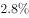。其中，出口总额19564.0亿元，同比增长；进口总额34588.9亿元，同比减少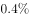。

        2019年上半年，我国知识密集型服务进出口额8923.9亿元，同比增长，其中，知识密集型服务出口额4674.1亿元，同比增长；进口额4249.8亿元，同比增长。从具体领域看，知识产权使用费出口同比增长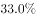；电信、计算机和信息服务出口同比增长，进口同比增长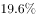；其他商业服务（含技术、专业和管理咨询服务、研发成果转让费及委托研发等）出口同比增长；金融服务出口同比增长，进口同比增长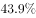。

        2019年全年，我国知识密集型服务进出口额18777.7亿元，同比增长，其中，知识密集型服务出口额9916.8亿元，同比增长；进口额8860.9亿元，同比增长。从具体领域看，个人文化娱乐服务，电信、计算机和信息服务，金融服务进出口总额分别同比增长、、。

### 第 16 题　qid 2719407 · 综合

2019年下半年，我国服务进出口贸易状况为：

- **A**. 顺差5000亿元以内
- **B**. 顺差5000亿元以上
- **C**. 逆差5000亿元以内
- **D**. 逆差5000亿元以上　✅

**答案**：D

**官方解析**

定位材料第一段和第二段，2019年上半年，我国服务出口总额9333.7亿元，进口总额16790.8亿元。2019年全年出口总额19564.0亿元，进口总额34588.9亿元。根据“2019年下半年2019年全年2019年上半年”可得，2019年下半年出口总额亿元，2019年下半年进口总额亿元。因进口额＞出口额，则为贸易逆差，排除A、B两项，差额亿元，即逆差5000亿元以上，D项满足。

故正确答案为D。

---

### 第 17 题　qid 2719411 · 综合

2019年上半年，我国知识密集型服务进出口额环比约：

- **A**. 
上升了
　✅
- **B**. 
上升了

- **C**. 
下降了

- **D**. 
下降了

**答案**：A

**官方解析**

根据题干“2019年上半年，······环比约”，结合选项为“上升下降了百分数”，可判定本题为一般增长率计算问题。定位材料第三段，2019年上半年，我国知识密集型服务进出口额8923.9亿元，同比增长；定位材料第四段，2019年全年，我国知识密集型服务进出口额18777.7亿元，同比增长。则2018年下半年进出口额2018年全年2018年上半年亿元。2019年上半年环比增长率，A项满足。

故正确答案为A。

---

### 第 18 题　qid 2719412 · 综合

2018年，我国对外贸易总额约为多少万亿元？

- **A**. 17
- **B**. 25
- **C**. 36　✅
- **D**. 48

**答案**：C

**官方解析**

根据题干“2018年，我国对外贸易总额约为”，结合材料第一段“服务进出口总额占对外贸易总额的比重达到，比2018年全年高出0.5个百分点”，可判定本题为基期比重问题。可得，2018年我国服务进出口总额占对外贸易总额的比重。根据材料第二段，2019年全年，我国服务进出口总额54152.9亿元，同比增长，则2018年我国服务进出口总额亿元。根据公式：整体，则2018年我国对外贸易总额万亿，与C项接近。

故正确答案为C。

---

### 第 19 题　qid 2719413 · 比重

2019年，我国知识密集型服务出口额占服务出口额比重：

- **A**. 仅上半年高于上年同期水平
- **B**. 仅下半年高于上年同期水平
- **C**. 上、下半年均高于上年同期水平　✅
- **D**. 上、下半年均低于上年同期水平

**答案**：C

**官方解析**

根据题目“2019年，······占······比重”，选项为高于或低于上年同期水平，判定本题为两期比重问题。根据材料第一、三段可得“2019年上半年，服务出口总额同比增长，知识密集型服务出口额同比增长”，结合两期比重比较结论“若部分量增速（）高于总量增速（），比重上升”，，则2019年上半年，知识密集型服务出口额占服务出口额比重高于上年同期水平，排除B、D两项。

根据材料第一、二段可得“2019年上半年，服务出口总额同比增长；2019年全年，服务出口总额同比增长”，结合混合增长率结论“居中不正中”，即全年增速应介于上、下半年增速之间，则下半年服务出口总额同比增速应小于；同理，根据材料第三、四段可得“2019年上半年，知识密集型服务出口额同比增长；2019年全年，知识密集型服务出口额同比增长”，则下半年知识密集型服务出口额同比增速应大于。再次结合两期比重比较的结论，（大于）（小于），则2019年下半年，知识密集型服务出口额占服务出口额比重高于上年同期水平，排除A项。

故正确答案为C。

---

### 第 20 题　qid 2719414 · 综合

能够从上述资料中推出的是：

- **A**. 2019年下半年，我国服务进口额同比为正增长
- **B**. 2019年上半年，电信、计算机和信息服务进出口总额占知识密集型服务进出口总额的比重高于上年同期水平　✅
- **C**. 2019年上半年，非知识密集型服务进出口贸易逆差低于7000亿元
- **D**. 2019年下半年，我国知识密集型服务出口额占服务出口额的比重低于知识密集型服务进口额占服务进口额的比重

**答案**：B

**官方解析**

A项：根据材料第一、二段可得“2019年上半年，服务进口总额16790.8亿元，同比下降；2019年全年，服务进口总额34588.9亿元，同比减少”，则2019年下半年，服务进口额为亿元；2018年下半年，服务进口额为，因，则2018年下半年，服务进口额亿元。即2019年下半年，服务进口额低于上年同期，并非正增长，错误；

B项：根据材料第三段可得“2019年上半年，知识密集型服务进出口额同比增长；电信、计算机和信息服务出口同比增长，进口同比增长”，结合混合增长率结论“居中不正中”，即进出口同比增速应介于进口和出口同比增速之间，则电信、计算机和信息服务进出口额同比增速应大于，小于。再结合两期比重比较结论“若部分量增速（）高于总量增速（），比重上升”，（大于），则比重高于上年同期水平，正确；

C项：根据材料第一、三段可得“2019年上半年，服务出口总额9333.7亿元，进口总额16790.8亿元；知识密集型服务出口额4674.1亿元，进口额4249.8亿元”，则2019年上半年，非知识密集型服务进口额为亿元，出口额为亿元，贸易逆差为12600-4600=8000&gt;7000亿元，错误；

D项：根据材料第一、二段可得“2019年上半年，服务出口总额9333.7亿元，进口总额16790.8亿元；2019年全年，服务出口总额19564.0亿元，进口总额34588.9亿元”，则2019年下半年，服务出口额为亿元，进口额为亿元。

根据材料第三、四段可得“2019年上半年，知识密集型服务出口总额4674.1亿元，进口总额4249.8亿元；2019年全年，知识密集型服务出口总额9916.8亿元，进口总额8860.9亿元”，则2019年下半年，知识密集型服务出口额为亿元，进口额为亿元。则2019年下半年，知识密集型服务出口额占服务出口额比重为，知识密集型服务进口额占服务进口额比重为，前者应高于后者，错误。

故正确答案为B。

---
