# 2021年宁夏公务员录用考试《行测》题（网友回忆版）

> 资料分析 · 15 题 · 宁夏 2021

## 材料 1

        2020年，我国规模以上互联网和相关服务企业（以下简称互联网企业）业务收入12838亿元，同比增长，增速低于上年同期8.9个百分点。

        2020年，互联网企业实现营业利润1187亿元，同比增长，增速低于上年同期3.7个百分点；得益于成本控制较好，营业成本仅增长，行业营业利润高出同期收入增速0.7个百分点。

        2020年，互联网企业信息服务收入共7068亿元，同比增长，增速低于上年同期11.2个百分点。互联网接入及相关服务收入447.5亿元，同比增长，增速低于上年同期20.8个百分点；互联网数据服务（包括云服务、大数据服务等）收入199.8亿元，同比增长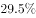，增速较上年同期提高3.9个百分点。

        2020年，东部地区互联网业务收入11227亿元，同比增长，增速较上年同期回落9个百分点，中部地区互联网业务收入448.1亿元，同比增长，增速较上年同期回落53.1个百分点。西部地区互联网业务收入497.2亿元，同比增长，增速较上年同期回落15.2个百分点。东北地区互联网业务收入47.1亿元，同比增长。

        2020年，互联网业务累计收入居前5名的广东（增长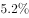）、北京（增长）、上海（增长）、浙江（增长）和江苏（增长）共完成互联网业务收入10706亿元，同比增长，增速超过全国平均水平2.6个百分点，占全国（扣除跨地区企业）比重达，占比较上年同期提高0.8个百分点。

### 第 1 题　qid 3522673 · 增长

2020年，互联网企业收入同比约增长了：

- **A**. 1187亿元
- **B**. 1309亿元
- **C**. 1426亿元　✅
- **D**. 1605亿元

**答案**：C

**官方解析**

根据题干“2020年，······同比约增长了”，结合选项有具体单位，可判定本题为增长量计算问题。定位文字材料第一段，“2020年，我国规模以上互联网和相关服务企业（以下简称互联网企业）业务收入12838亿元，同比增长”。代入公式：增长量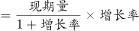，可得2020年，互联网企业收入同比增长量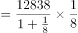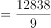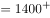亿元。

故正确答案为C。

---

### 第 2 题　qid 3522680 · 增长

2019年，互联网企业互联网接入及相关服务收入同比增速比同年信息服务收入同比增速：

- **A**. 高不到10个百分点　✅
- **B**. 高10个百分点以上
- **C**. 低不到10个百分点
- **D**. 低10个百分点以上

**答案**：A

**官方解析**

定位文字材料第三段，“2020年，互联网企业信息服务收入······同比增长，增速低于上年同期11.2个百分点。互联网接入及相关服务收入······同比增长，增速低于上年同期20.8个百分点”。因此，2019年，互联网接入及相关服务收入同比增速为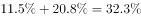；互联网企业信息服务收入同比增速为。，则2019年，互联网企业互联网接入及相关服务收入同比增速比同年信息服务收入同比增速高不到10个百分点。

故正确答案为A。

---

### 第 3 题　qid 3522683 · 比重

在东部、中部、西部和东北四个地区中，2019年和2020年互联网业务收入占全国比重均高于上年水平的地区有几个？

- **A**. 0
- **B**. 1　✅
- **C**. 2
- **D**. 3

**答案**：B

**官方解析**

根据题干“2019年和2020年······占全国比重均高于去年水平······”，可判定本题为两期比重比较问题。定位文字材料第一段，“2020年，我国······互联网企业收入······同比增长，增速低于上年同期8.9个百分点”，定位文字材料第四段，“2020年，东部地区互联网业务收入······同比增长，增速较上年同期回落9个百分点，中部地区······同比增长······。西部地区······同比增长······。东北地区······同比增长”。根据两期比重比较结论“部分增速快于整体增速，则比重上升”，比较可知：2020年互联网业务收入同比增速只有东部地区（）快于全国（），比重上升；2019年，东部地区互联网业务收入同比增速为，快于全国（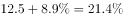），则2019年东部地区的比重也上升。因此，2019年和2020年互联网业务收入占全国比重均高于上年水平的地区有1个。

故正确答案为B。

---

### 第 4 题　qid 3522688 · 综合

2020年，东部地区除广东、北京、上海、浙江和江苏之外的省市互联网业务收入约比2019年：

- **A**. 
增长
　✅
- **B**. 
增长

- **C**. 
减少

- **D**. 
减少

**答案**：A

**官方解析**

根据题干“2020年······比2019年······”，结合选项为增长/减少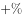，且东部地区广东、北京、上海、浙江、江苏其他东部地区，可判定本题为混合增长率问题。定位文字材料第四段可知：2020年，东部地区完成互联网业务收入11227亿元，同比增长；定位文字材料第五段可知：2020年，互联网业务累计收入居前5名的广东、北京、上海、浙江和江苏共完成互联网业务收入10706亿元，同比增长。则2020年，东部地区除广东、北京、上海、浙江、江苏的其他地区完成互联网业务收入亿元。令东部地区除广东、北京、上海、浙江、江苏的其他地区完成互联网业务收入同比增速为，根据线段法：距离与量成反比（一般用现期量近似代替基期量），可得：，即，解得，最接近A项。

故正确答案为A。

---

### 第 5 题　qid 3522689 · 增长

关于我国互联网企业业务状况，能够从上述资料中推出的有几条？

①2019年实现利润超过1000亿元

②2020年，互联网数据服务收入比2018年增长了不到

③2018年及2019年，中部地区互联网业务收入均低于西部地区

- **A**. 0
- **B**. 1
- **C**. 2
- **D**. 3　✅

**答案**：D

**官方解析**

①：定位文字材料第二段“2020年，互联网企业实现营业利润1187亿元，同比增长”。根据基期计算公式：基期量，可知2019年实现利润为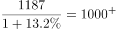亿元，正确；

②：定位文字材料第三段可知，2020年，互联网数据服务（包括云服务、大数据服务等）收入199.8亿元，同比增长，增速较上年同期提高3.9个百分点。则2019年增长率为，根据间隔增长率公式：，可知2020年互联网数据服务收入比2018年增长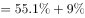，正确；

③：定位文字材料第四段可知，（2020年）中部地区互联网业务收入448.1亿元，同比增长3.4%，增速较上年同期回落53.1个百分点。西部地区互联网业务收入497.2亿元，同比增长6.9%，增速较上年同期回落15.2个百分点。则2019年中、西部地区互联网业务收入同比增速分别为3.4%+53.1%=56.5%、6.9%+15.2%=22.1%。根据公式：基期量=，可得2019年中、西部地区互联网业务收入分别为亿元、亿元，435亿元（中部）&lt;465亿元（西部），即2019年中部地区互联网业务收入低于西部地区；同理，2018年中、西部地区互联网业务收入分别为亿元、亿元，亿元（中部）&lt;亿元（西部），即2018年中部地区互联网业务收入低于西部地区，正确。

故正确答案为D。

---

## 材料 2

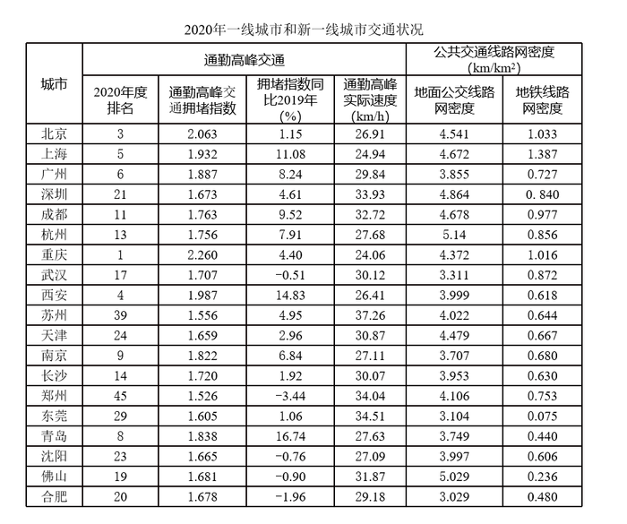

### 第 6 题　qid 3523503 · 综合

2019年，通勤高峰最拥堵的城市是：

- **A**. 北京
- **B**. 上海
- **C**. 重庆　✅
- **D**. 南京

**答案**：C

**官方解析**

根据题干“2019年······最拥堵的城市是”，可判定本题为基期比较问题。在表格材料中分别给出了现期量和增长率，根据基期量，得到四个城市的交通高峰拥堵指数，分别为北京、上海 、重庆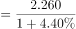 、南京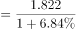，根据分数比较中的一大一小直接看，上海、重庆和南京三个城市中重庆的数据分子最大，并且分母最小，排除B、D两项。北京的数据直除首两位为20，重庆的数据直除首两位为21，因此C项更大，当选。

故正确答案为C。

---

### 第 7 题　qid 3523506 · 综合

如果小张从家里到公司的距离是20公里，并且都采用开车方式，2020年他在下列哪个城市居住高峰时段通勤用时最短？

- **A**. 广州
- **B**. 成都
- **C**. 苏州　✅
- **D**. 西安

**答案**：C

**官方解析**

在表格材料中分别给出了2020年广州、成都、苏州和西安的通勤高峰实际速度，四个数据分别为29.84km/h、32.72km/h、37.26km/h和26.41km/h。根据路程，距离一定的情况下，速度越大，通勤时间越短，C项速度最大，当选。

故正确答案为C。

---

### 第 8 题　qid 3523508 · 综合

2020年，小张在下列哪个新一线城市居住会感觉公共交通最便利？

- **A**. 合肥
- **B**. 成都　✅
- **C**. 郑州
- **D**. 长沙

**答案**：B

**官方解析**

在表格材料中分别给出了合肥、成都、郑州和长沙四个城市2020年公共交通线路网密度，四组数据分别为合肥3.029、0.480；成都4.678、0.977；郑州4.106、0.753和长沙3.953、0.630。通过直接观察数据我们发现成都的地面公交线路网密度4.678和地铁线路网密度0.977都是这四个城市中最大的，所以成都公共交通最便利。
故正确答案为B。

---

### 第 9 题　qid 3523510 · 综合

比较一线城市（北京、上海、广州、深圳），2019年通勤高峰交通拥堵程度由重到轻依次是：

- **A**. 北京、上海、广州、深圳
- **B**. 上海、北京、深圳、广州
- **C**. 深圳、北京、上海、广州
- **D**. 北京、广州、上海、深圳　✅

**答案**：D

**官方解析**

根据题干“2019年通勤高峰交通拥堵程度由重到轻······”，结合表格材料所给数据为2020年各城市通勤高峰交通拥堵指数及同比增速，可判定本题为基期比较问题。结合基期量可知，2019年北京：、上海：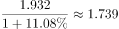、广州：、深圳：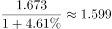。故2019年通勤高峰交通拥堵程度由重到轻依次是北京、广州、上海、深圳。

故正确答案为D。

---

### 第 10 题　qid 3523513 · 综合

根据资料，下列选项说法错误的是：

- **A**. 
2020年，在通勤高峰交通拥堵指数排名全国前10位的城市中，新一线城市占比达到
　✅
- **B**. 
如果只考虑交通拥堵情况，新一线城市中最宜居的是郑州

- **C**. 
假设2020年佛山的拥堵排名比上年下降4位，极有可能是该市增加了地面公交投入

- **D**. 
如果重庆要在2021年缓解交通拥堵，一个有效的办法是在通勤的高峰限制私家车出行

**答案**：A

**官方解析**

A项：定位表格材料，2020年通勤高峰交通拥堵指数排名全国前10位的新一线城市分别是重庆、西安、青岛、南京4个，占比为，不是。错误；

B项：定位表格材料，新一线城市中，通勤高峰交通拥堵指数最低的是郑州。正确；

C项：定位表格材料，佛山的拥堵排名比上年下降，且观察数据可得，佛山地面公交线路网密度的数据全国表现突出，由此推断极有可能是该市增加了地面公交投入。正确；

D项：定位表格材料，重庆通勤高峰实际速度较慢，由此可以推断应是高峰期私家车辆过多导致的，故高峰期限制私家车出行可能会缓解交通拥堵。正确。

本题为选非题，故正确答案为A。

备注：

1、北京、上海、广州、深圳不属于新一线城市。

2、本道题目题干表述不明确，采取优中选优的方式选择，A项必错，在考场上其余选项不确定是否必错的情况下可做跳过处理。

---

## 材料 3

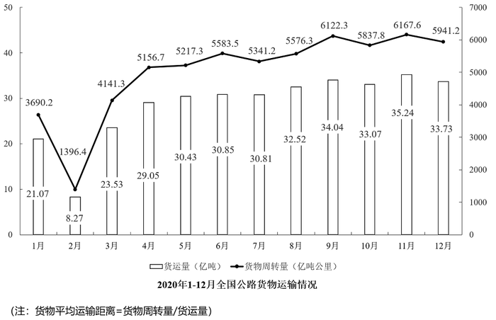

### 第 11 题　qid 3523536 · 综合

2020年下半年，全国公路货运量高于上月水平的月份有几个？

- **A**. 2
- **B**. 3　✅
- **C**. 4
- **D**. 5

**答案**：B

**官方解析**

定位柱状图可知：2020年下半年，全国公路货运量高于上月水平的月份有8月、9月、11月3个。
故正确答案为B。

---

### 第 12 题　qid 3523539 · 增长

2020年第二季度，全国货物周转量约比第一季度增长了：

- **A**. 

- **B**. 

- **C**. 

- **D**. 

　✅

**答案**：D

**官方解析**

根据“2020年第二季度······比第一季度增长了”，结合选项为百分数，可判定本题为一般增长率计算问题。定位折线图可知：2020年第一季度全国货物周转量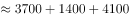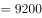亿吨公里；第二季度全国货物周转量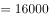亿吨公里。根据增长率，可得2020年第二季度，全国货物周转量约比第一季度增长了，与D项最接近。

故正确答案为D。

---

### 第 13 题　qid 3523540 · 综合

2020年，我国公路货物周转量累计达1万亿吨公里/2万亿吨公里/3万亿吨公里分别在：

- **A**. 3月  5月  7月
- **B**. 4月  6月  8月
- **C**. 4月  6月  7月　✅
- **D**. 3月  5月  8月

**答案**：C

**官方解析**

定位折线图：2020年，累计到4月我国公路货物周转量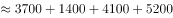亿吨公里万亿吨公里，即在4月我国公路货物周转量累计达1万亿吨公里（由上一小题可知2020年第一季度全国货物周转量约9200亿吨公里，不到1万亿吨公里），排除A、D两项；结合选项，B、C两项达到2万亿吨公里均在6月，不用计算；累计到7月，我国公路货物周转量1至4月5月6月7月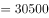亿吨公里万亿吨公里，即在7月我国公路货物周转量累计达3万亿吨公里。

故正确答案为C。

---

### 第 14 题　qid 3523541 · 平均数

2020年各季度公路货物平均运输距离最高的季度是：

- **A**. 第一季度
- **B**. 第二季度　✅
- **C**. 第三季度
- **D**. 第四季度

**答案**：B

**官方解析**

根据题干“2020年各季度公路货物平均运输距离最高的季度是”，根据备注可知，货物平均运输距离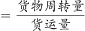，可判定本题为现期平均数比较问题。定位统计图可得，2020年各月份公路货物周转量与货运量，分别计算各季度货物平均运输距离进行比较即可。

第一季度：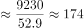公里；第二季度：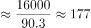公里；第三季度：公里；第四季度：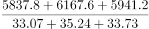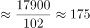公里。

比较可知，第二季度公路货物平均运输距离最高。

故正确答案为B。

---

### 第 15 题　qid 3523544 · 综合

关于2020年全国公路货物运输情况的描述，可以推出的是：

- **A**. 
2月份货运平均运输距离在170-175公里

- **B**. 
全年日均货运量多于1亿吨的月份有6个
　✅
- **C**. 
3月份货物周转量比2月份多以上

- **D**. 
全年月均货运量超过30亿吨

**答案**：B

**官方解析**

A项：定位统计图材料可得，2020年2月份公路货物周转量1396.4亿吨公里，货运量为8.27亿吨，货物平均运输距离公里，不在170-175公里范围内，错误；

B项：定位统计图材料可得，2020年1-12月货运量分别为21.07、8.27、23.53、29.05、30.43、30.85、30.81、32.52、34.04、33.07、35.24、33.73亿吨，2020年1-12月所对应的天数分别为31、29、31、30、31、30、31、31、30、31、30、31天，则日均货运量多于1亿吨的有6月、8月、9月、10月、11月、12月，共计6个月份，正确；

C项：定位统计图材料可得，2020年2月份公路货物周转量1396.4亿吨公里，3月份为4141.3亿吨公里，3月份货物周转量比2月份多，即不到，错误；

D项：定位统计图材料可得，2020年月均货运量为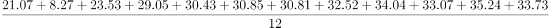亿吨，错误。

故正确答案为B。

---
