# 2021年山东省公务员录用考试《行测》试题（网友回忆版）

> 资料分析 · 15 题 · 山东 2021

## 材料 1

根据所给材料，回答76~80题。

        2019年，我国电信业务收入累计完成金额1.31万亿元，固定通信业务收入完成4161亿元，同比增长，在电信业务收入中所占比重较上年提高2.6个百分点；移动通信业务实现收入8942亿元，同比减少。2014~2019年，全国移动电话4G及非4G基站数变化情况如下图所示：

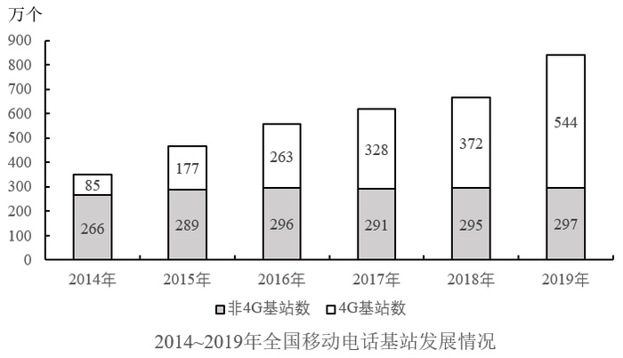

### 第 1 题　qid 2741706 · 综合

2019年电信业务收入比2018年：

- **A**. 增加了不到1000亿元　✅
- **B**. 增加了1000亿元以上
- **C**. 减少了不到1000亿元
- **D**. 减少了1000亿元以上

**答案**：A

**官方解析**

根据题干“2019年······比2018年”，结合选项“增加/减少单位”，可判定本题为增长量计算问题。定位文字材料可得：2019年，我国电信业务收入累计完成金额1.31万亿元，固定通信业务收入完成4161亿元，同比增长，移动通信业务实现收入8942亿元，同比减少。根据“电信业务收入固定通信业务收入移动通信业务收入”，则电信业务收入增长量固定通信业务收入增长量移动通信业务收入增长量。根据公式：增长量，可得所求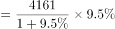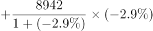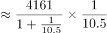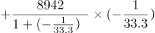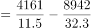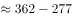亿元，即增加了不到1000亿元。

故正确答案为A。

---

### 第 2 题　qid 2741707 · 增长

2015~2019年，移动电话基站总量同比增速最快的年份是：

- **A**. 2015年　✅
- **B**. 2016年
- **C**. 2017年
- **D**. 2019年

**答案**：A

**官方解析**

根据题干“2015~2019年，移动电话基站总量同比增速最快的年份”，可判定本题为一般增长率比较问题。定位图形材料可得2014~2019年移动电话基站总量分别为：

2014年：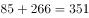万个；

2015年：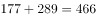万个；

2016年：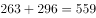万个；

2017年：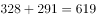万个；

2018年：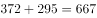万个；

2019年：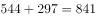万个。

代入公式：增长率，可得：

2015年：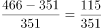；

2016年：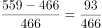；

2017年：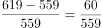；

2019年：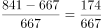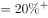。

比较可知，2015~2019年，移动电话基站总量同比增速最快的年份是2015年。

故正确答案为A。

---

### 第 3 题　qid 2741708 · 综合

2014~2019年，4G基站数占移动电话基站总量一半以上的年份有几个？

- **A**. 1
- **B**. 2
- **C**. 3　✅
- **D**. 4

**答案**：C

**官方解析**

根据题干“2014~2019年······占······总量一半以上······”，可判定本题为现期比重计算问题。定位图形材料可得：移动电话基站总量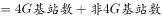，因此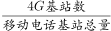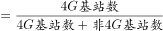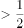，整理公式后可得：4G基站数非4G基站数。代入数据，符合要求的年份有：2017年（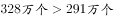），2018年（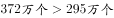），2019年（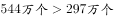），共3个年份。

故正确答案为C。

---

### 第 4 题　qid 2741710 · 增长

假设4G基站数保持2019年同比增量不变，且由于5G技术的快速普及，2020年开始每年非4G基站同比增量均为300万个。问哪一年4G基站数占移动电话基站总量的比重将下降到以下？

- **A**. 2021　✅
- **B**. 2022
- **C**. 2023
- **D**. 2024

**答案**：A

**官方解析**

根据题干“假设······保持2019年同比增量不变······哪一年······比重将下降到以下”，结合选项时间为2021~2024年，可判定本题为现期追赶计算问题。定位图形材料可知，2018年4G基站数为372万个；2019年4G基站数及非4G基站数分别为544万个、297万个。根据现期量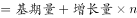，则4G基站数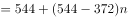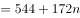，移动电话基站总量=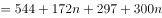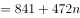。故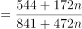，解得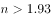，向上取整，，所以需经过2年，即在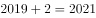年实现4G基站数占比下降到以下。

故正确答案为A。

---

### 第 5 题　qid 2741712 · 综合

能够从上述资料中推出的是：

- **A**. 2019年移动通信业务收入占电信业务收入的比重同比下降了2.9个百分点
- **B**. 2019年固定通信业务收入同比增长了400多亿元
- **C**. 2015~2019年间，非4G基站数量逐年递增
- **D**. 2015~2019年间，4G基站数同比增速和增量最大的年份不是同一个　✅

**答案**：D

**官方解析**

A项：定位文字材料，可知2019年我国固定通信业务收入在电信业务收入中所占比重较上年提高2.6个百分点。根据电信业务收入固定通信业务收入移动通信业务收入，则移动通信业务收入占电信业务收入的比重应同比下降2.6个百分点，错误；

B项：定位文字材料，可知2019年我国固定通信业务收入完成4161亿元，同比增长。根据增长量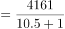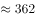亿元亿元，错误；

C项：定位图形材料，可得2015~2019年非4G基站数量分别为289万个、296万个、291万个、295万个、297万个，其中2017年（291万个）2016年（296万个），并非逐年递增，错误；

D项：定位图形材料，可得2014~2019年4G基站数的具体数值。根据增长量和柱状图的高度差，可得2019年的增长量最大。根据增长率，可直接比较，

2015年：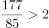；

2016年：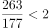；

2017年：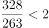；

2018年：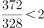；

2019年：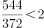。

可以看出，增长率最大的年份为2015年。故2015~2019年间，4G基站数同比增速和增量最大的年份不是同一个，正确。

故正确答案为D。

---

## 材料 2

        2019年，全国棉花产量588.9万吨，比上年减少21.3万吨。其中，新疆棉花产量500.2万吨，比上年减少10.8万吨；全国棉花种植面积为3339.2千公顷，比上年减少15.2千公顷。新疆的棉花种植面积比上年增加49.2千公顷。长江流域棉花种植面积比上年减少32.4千公顷，同比下降。黄河流域棉花种植面积比上年减少28.1千公顷，同比下降。

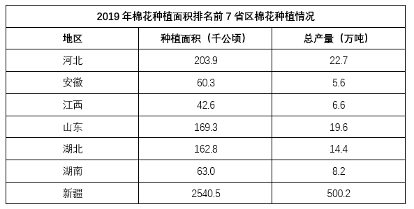

### 第 6 题　qid 2741672 · 比重

2019年新疆棉花产量占全国总产量的比重比上年：

- **A**. 上升了不到5个百分点　✅
- **B**. 上升了5个百分点以上
- **C**. 下降了不到5个百分点
- **D**. 下降了5个百分点以上

**答案**：A

**官方解析**

根据题干“2019年······占······比重比上年”，结合选项“上升/下降百分点”，判定本题为两期比重问题。

方法一：定位文字材料第一段：2019年，全国棉花产量588.9万吨，比上年减少21.3万吨。其中，新疆棉花产量500.2万吨，比上年减少10.8万吨。可得2019年新疆棉花产量占全国总产量的比重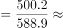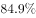，2018年该比重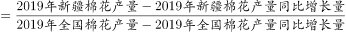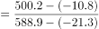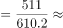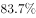，则2019年新疆棉花产量占全国总产量的比重比上年增长，即上升了1.2个百分点，对应A项。

方法二：定位文字材料第一段：2019年，全国棉花产量588.9万吨（），比上年减少21.3万吨。其中，新疆棉花产量500.2万吨（），比上年减少10.8万吨。根据公式：，可得2019年新疆棉花产量同比增长率（）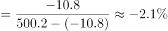；2019年全国棉花产量同比增长率（）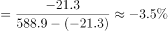。根据两期比重比较方法，（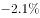）＞（），则比重上升，上升的幅度小于个百分点，对应A项。

故正确答案为A。

---

### 第 7 题　qid 2741673 · 综合

2018年除新疆外，全国其他地区棉花种植总面积在以下哪个范围内？

- **A**. 不到700千公顷
- **B**. 700-800千公顷之间
- **C**. 800-900千公顷之间　✅
- **D**. 900千公顷以上

**答案**：C

**官方解析**

根据题干“2018年······其他地区棉花种植总面积······”，结合材料时间是2019年，可判定本题为基期计算问题。定位文字材料可知：（2019年）全国棉花种植面积3339.2千公顷，比上年减少15.2千公顷；新疆的棉花种植面积比上年增加49.2千公顷。定位表格材料可知：2019年新疆的棉花种植面积是2540.5千公顷。2018年全国棉花种植面积千公顷；2018年新疆棉花种植面积千公顷；则2018年除新疆外，全国其他地区棉花种植总面积千公顷。只有C项符合。

故正确答案为C。

---

### 第 8 题　qid 2741676 · 综合

2018年长江流域棉花种植面积约是黄河流域棉花种植面积的多少倍？

- **A**. 0.5
- **B**. 0.8　✅
- **C**. 1.2
- **D**. 2.1

**答案**：B

**官方解析**

根据题干“2018年······是······多少倍”，结合材料已知2019年相关数据，可判定本题为基期倍数计算问题。定位文字材料可知：（2019年）长江流域棉花种植面积比上年减少32.4千公顷，同比下降，黄河流域棉花种植面积比上年减少28.1千公顷，同比下降。根据公式：增长率可得：基期量，因此2018年长江流域棉花种植面积；同理，2018年黄河流域棉花种植面积，所求倍数为。

故正确答案为B。

---

### 第 9 题　qid 2741677 · 综合

2019年棉花种植面积排名前7的省区中，棉花单产超过1吨/公顷的省区有几个？

- **A**. 5　✅
- **B**. 4
- **C**. 3
- **D**. 2

**答案**：A

**官方解析**

根据题干“2019年······棉花单产超过1吨/公顷”，且材料时间是2019年，可判定本题为现期平均数问题。定位表格材料，根据公式：可知，只需吨/公顷即可，则2019年棉花种植面积排名前7的省区棉花单产情况如下：

河北：吨/公顷；

安徽：吨/公顷；

江西：吨/公顷；

山东：吨/公顷；

湖北：吨/公顷；

湖南：吨/公顷；

新疆：吨/公顷。

因此棉花单产超过1吨/公顷的省区分别是河北、江西、山东、湖南和新疆，共5个。

故正确答案为A。

---

### 第 10 题　qid 2741684 · 综合

能够从上述材料中推出的是：

- **A**. 
2019年全国棉花产量降幅超过

- **B**. 
2019年除新疆、长江流域和黄河流域外，其余地区棉花种植面积同比下降
　✅
- **C**. 
2019年新疆棉花单产高于2018年水平

- **D**. 
2019年棉花种植面积排名前7的省区，棉花产量占全国总产量的-之间

**答案**：B

**官方解析**

A项：定位文字材料可得：2019年，全国棉花产量588.9万吨，比上年减少21.3万吨。故2019年全国棉花产量增长率，降幅为，小于，错误；

B项：定位文字材料可得：2019年，全国棉花种植面积比上年减少15.2千公顷；新疆的棉花种植面积比上年增加49.2千公顷，长江流域比上年减少32.4千公顷，黄河流域比上年减少28.1千公顷。根据“全国增长量新疆增长量长江流域增长量黄河流域增长量其他地区增长量”可得：其他地区增长量，解得其他地区增长量为-3.9千公顷，即棉花种植面积同比下降，正确；

C项：定位文字材料可得：2019年，新疆棉花产量500.2万吨，比上年减少10.8万吨；新疆的棉花种植面积比上年增加49.2千公顷。定位表格材料可得：2019年，新疆棉花种植面积2540.5千公顷。单产即单位面积产量，2019年为，2018年为，前者分子小且分母大，故2019年2018年，即单产低于2018年水平，错误；

D项：定位文字材料可得：2019年，全国棉花产量588.9万吨。定位表格材料可得：2019年棉花种植面积排名前7的省区的棉花产量。故所求比重，并非-之间，错误。

故正确答案为B。

---

## 材料 3

### 第 11 题　qid 2741671 · 增长

2019年A地区住宿和餐饮业社会消费品零售额同比增量约占社会消费品零售总额同比增量的？

- **A**. 

- **B**. 

　✅
- **C**. 

- **D**. 

**答案**：B

**官方解析**

根据题干“2019年A地区······约占······的”，结合选项为百分数，材料所给时间为2019年，可判定本题为现期比重计算问题。定位统计表材料可得，2019年A地区社会消费品零售总额6582.85亿元，同比增长；住宿和餐饮业社会消费品零售额828.11亿元，同比增长。则2019年A地区社会消费品零售总额同比增量为亿元，住宿和餐饮业社会消费品零售额同比增量为亿元，所求比重为，对应B项。

故正确答案为B。

---

### 第 12 题　qid 2741675 · 综合

2019年上半年，A地区社会消费品零售总额超过500亿元的月份有几个？

- **A**. 2　✅
- **B**. 3
- **C**. 4
- **D**. 5

**答案**：A

**官方解析**

定位统计图材料可得，2019年1-6月A地区社会消费品零售总额各月累计金额，由此可得：1月份为496亿元，2月份为亿元，3月份为亿元，4月份为亿元，5月份为亿元，6月份为亿元。超过500亿元的有5月份、6月份，共计2个月份。

故正确答案为A。

---

### 第 13 题　qid 2741678 · 增长

2019年12月，A地区社会消费品零售总额同比增速约为？

- **A**. 

- **B**. 

- **C**. 

　✅
- **D**. 

**答案**：C

**官方解析**

根据题干“2019年12月······同比增速约为”，结合材料中给出了2019年1-12月和1-11月的同比增速，可判定本题为混合增长率问题。定位统计表材料可得：2019年1-12月A地区社会消费品零售总额累计全额为6582.85亿元，同比增速为；定位统计图材料可得：2019年1-11月A地区社会消费品零售总额累计全额为5925亿元，同比增速为。

根据线段法（如下图所示），设2019年12月A地区社会消费品零售总额同比增速为，根据“距离与量成反比”可列式：，解得，与C项最接近。

故正确答案为C。

---

### 第 14 题　qid 2741682 · 增长

将2019年2-4季度按A地区社会消费品零售总额环比增速从低到高排列，以下正确的是：

- **A**. 3季度，2季度，4季度
- **B**. 2季度，3季度，4季度
- **C**. 4季度，3季度，2季度
- **D**. 3季度，4季度，2季度　✅

**答案**：D

**官方解析**

根据题干“将2019年2-4季度······环比增速从低到高排列”，可判定本题为一般增长率问题。定位材料可得，2019年A地区社会消费品零售总额分别是：1-3月为1433亿元，1-6月为3077亿元，1-9月为4779亿元，1-12月为6582.85亿元。则2019年A地区各季度的社会消费品零售总额分别是：1季度为1433亿元，2季度为亿元，3季度为亿元，4季度为亿元。根据公式：增长率，则2-4季度的增长率分别为：

2季度：；

3季度：；

4季度：，即2019年2-4季度按A地区社会消费品零售总额环比增速从低到高排列，顺序为3季度4季度2季度。

故正确答案为D。

---

### 第 15 题　qid 2741683 · 综合

关于A地区社会消费品零售总额情况，能够从上述资料中推出的是：

- **A**. 2019年批发和零售业月均社会消费品零售总额超过500亿元
- **B**. 2019年4季度社会消费品零售总额同比增速高于全年增速
- **C**. 2019年2季度各月社会消费品零售总额环比增量逐月递增
- **D**. 2018年2月社会消费品零售总额低于上月水平　✅

**答案**：D

**官方解析**

A项：定位统计表材料，2019年批发和零售业社会消费品零售总额为5754.74亿元，则平均每月的零售总额亿元，错误；

B项：定位统计图和统计表材料，2019年1-9月（前三季度）的社会消费品零售总额同比增速为，全年的同比增速为。根据混合增长率“居中但不中”可得：4季度同比增速全年同比增速（）＜前三季度同比增速（），即第4季度同比增速低于全年增速，错误；

C项：根据本篇第2题计算过程可得：2019年3-6月社会消费品零售总额分别为457亿元、490亿元、568亿元、586亿元。则4月环比增量亿元；5月环比增量亿元；6月环比增量亿元，环比增量非逐月递增，错误；

D项：2018年2月社会消费品零售总额2018年1~2月2018年1月，2018年1月。选项意为，则。后者分子大、分母小，为大分数。前者小于后者，正确。

故正确答案为D。

---
