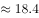
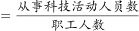
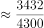
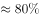
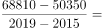
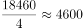

# 2021年广东省公务员录用考试《行测》题（乡镇卷）（网友回忆版）

> 资料分析 · 10 题 · 广东 2021

## 材料 1

        2019年G省共有农业科研和科技开发机构68个，职工人数4633人，其中1254人有高级职称，1148人有中级职称。全省共有农村科普示范基地554个、科普示范街道（乡镇）145个、科普示范社区（村）1341个。

### 第 1 题　qid 3019277 · 平均数

2019年G省平均每个农业科研和科技开发机构的高级职称人数最接近（    ）。

- **A**. 18.5　✅
- **B**. 20.5
- **C**. 22.5
- **D**. 24.5

**答案**：A

**官方解析**

根据题干“2019年G省平均每个······”，结合材料时间为2019年，可判定本题为现期平均数问题。定位文字材料可得：“2019年G省共有农业科研和科技开发机构68个······其中1254人有高级职称”。故平均每个农业科研和科技开发机构的高级职称人数，与A项最为接近。

故正确答案为A。

---

### 第 2 题　qid 3019279 · 比重

2018年，G省农业科研和科技开发机构从事科技活动人员数占职工人数比重约为（    ）。

- **A**. 

- **B**. 

- **C**. 

　✅
- **D**. 

**答案**：C

**官方解析**

根据题干“2018年，······占······比重约为”，结合表格材料2018年数据均已给出，可判定本题为现期比重问题。定位表格材料可得：2018年从事科技活动人员3432人，职工人数4289人。故从事科技活动人员数占职工人数比重。

故正确答案为C。

---

### 第 3 题　qid 3019280 · 平均数

2015-2019年，G省农业科研和科技开发机构课题投入经费平均每年增加（    ）万元。

- **A**. 3152
- **B**. 4615　✅
- **C**. 5517
- **D**. 7890

**答案**：B

**官方解析**

根据题干“2015-2019年，G省······平均每年增加······万元”，可判定本题为年均增长量计算问题。定位表格材料可得：2015年课题投入经费50350万元，2019年课题投入经费68810万元。根据公式：年均增长量，则2015-2019年，课题投入经费平均每年增加万元，与B项最为接近。

故正确答案为B。

---

### 第 4 题　qid 3019281 · 综合

2015-2019年，G省农业科研和科技开发机构发表科学论文篇数最多的一年是（    ）。

- **A**. 2015年
- **B**. 2016年
- **C**. 2017年　✅
- **D**. 2019年

**答案**：C

**官方解析**

定位表格材料可知，2015-2019年，G省农业科研和科技开发机构发表科学论文篇数依次为1519篇、1680篇、1891篇、1383篇、1862篇，因此发表科学论文篇数最多的一年为2017年。
故正确答案为C。

---

### 第 5 题　qid 3019283 · 综合

根据资料，下列关于G省的说法正确的是（    ）。

- **A**. 2019年科普示范社区（村）数是科普示范街道（乡镇）的十倍以上
- **B**. 2015-2019年农业科研和科技开发机构科技活动课题数逐年增加
- **C**. 2019年农业科研和科技开发机构国外发表科学论文比2015年多266篇　✅
- **D**. 2015-2019年，农业科研和科技开发机构科技论著每年都超过40种

**答案**：C

**官方解析**

A项：定位文字材料可得：2019年G省共有科普示范街道（乡镇）145个、科普示范社区（村）1341个。则两者的倍数关系为，不到十倍，错误；

B项：定位表格材料可得：2015-2019年农业科研和科技开发机构科技活动课题数依次为1688个、1813个、1918个、1631个、2286个，2018年科技活动课题数少于2017年，不满足逐年增加，错误；

C项：定位表格材料可得：2015年国外发表科学论文339篇，2019年国外发表科学论文605篇。两者相差篇，正确；

D项：定位表格材料可得：2015-2019年农业科研和科技开发机构科技论著依次为41种、49种、44种、43种、32种，2019年科技论著小于40种，错误。

故正确答案为C。

---

## 材料 2

        2020年上半年，我国农产品进出口总额达1159.0亿美元。农产品进口额为807.5亿美元，同比增长。受新冠肺炎疫情影响，我国农产品出口额同比下降，为351.5亿美元。

        在我国的农产品进口中，除大洋洲农产品进口额同比下降1.9个百分点外，其余各大洲的农产品进口额均有所增加；欧洲国家或地区农产品进口额增幅最大，达。农产品出口中，对亚洲国家或地区的出口额最高，达229.7亿美元，较2019年同期下降了3.7个百分点。

随着我国居民饮食结构的调整，居民对肉类食品的需求量逐年增加。2020年上半年畜类产品进口额同比增长，对农产品进口额的增长贡献超7成。我国农产品出口最多的两大类别分别是食用蔬菜和水、海产品，合计出口额达93.6亿美元，占农产品出口总额的。 

### 第 6 题　qid 3018837 · 增长

2020年上半年，我国农产品进出口额同比增长约：

- **A**. 

- **B**. 

- **C**. 

　✅
- **D**. 

**答案**：C

**官方解析**

根据题干“2020年上半年······同比增长约”，结合选项带百分号，且已知我国农产品进口额和出口额相关数据，可判定本题为混合增长率问题。定位文字材料第一段可得：2020年上半年，我国农产品进出口总额达1159.0亿美元。农产品进口额为807.5亿美元，同比增长。受新冠肺炎疫情影响，我国农产品出口额同比下降，为351.5亿美元。根据混合增长率口诀“混合增长率大小居中，偏向基期量大的一方（一般用现期量代替基期量）”可知，，即，排除A项。根据线段法“距离与量成反比（一般用现期量代替基期量计算）”可知：，解得，与C项最接近。

故正确答案为C。

---

### 第 7 题　qid 3018839 · 增长

2020年上半年，我国水、海产品出口额同比减少约（    ）亿美元。

- **A**. 6
- **B**. 8
- **C**. 10
- **D**. 12　✅

**答案**：D

**官方解析**

根据题干“2020年上半年······同比减少约（    ）亿美元”，可判定本题为增长量计算问题。定位表格材料可得：2020年上半年，我国水、海产品出口额为48.7亿美元，同比增长。根据公式：增长量，则2020年上半年，我国水、海产品出口额同比增长量亿美元，即减少约12亿美元。

故正确答案为D。

---

### 第 8 题　qid 3018841 · 综合

以下农产品类别中，2019年上半年我国进出口总额最高的是：

- **A**. 食用蔬菜　✅
- **B**. 禽类产品
- **C**. 饮料、酒及醋
- **D**. 咖啡、茶、马黛茶及调味香料

**答案**：A

**官方解析**

根据题干“2019年上半年······我国进出口总额最高的是”，结合材料已知2020年上半年相关数据，可判定本题为基期比较问题。定位表格材料可得：食用蔬菜，禽类产品，饮料、酒及醋，咖啡、茶、马黛茶及调味香料的进口额及同比增长率，出口额及同比增长率。根据进出口总额进口额出口额，基期量，可得2019年上半年我国下列农产品的进出口总额分别为：

食用蔬菜：亿美元；

禽类产品：亿美元；

饮料、酒及醋：亿美元；

咖啡、茶、马黛茶及调味香料：亿美元。

比较可知，2019年上半年我国进出口总额最高的农产品是食用蔬菜。

故正确答案为A。

---

### 第 9 题　qid 3018845 · 综合

2019年上半年，我国农产品进口额中欧洲国家或地区约占：

- **A**. 

- **B**. 

　✅
- **C**. 

- **D**. 

**答案**：B

**官方解析**

根据题干“2019年上半年······中······约占”，结合材料时间为2020年上半年，可判定本题为基期比重问题。定位文字材料第一段可得：农产品进口额同比增长（）；定位文字材料第二段可得：欧洲国家或地区农产品进口额增幅最大，达（）；定位饼状图材料可得：2020年上半年欧洲进口额占比为。根据公式：基期比重，其中即2020年上半年欧洲进口额占比为，则2019年上半年，欧洲国家或地区进口额占比为，与B项最接近。

故正确答案为B。

---

### 第 10 题　qid 3018847 · 综合

根据以上材料，关于我国2020年上半年农产品进出口情况，下列说法错误的是：

- **A**. 
畜类产品进口额为谷物进口额的6倍以上

- **B**. 
对亚洲国家或地区的出口额高于其农产品进口额

- **C**. 
六大洲中只有南美洲国家或地区的进口额超过160亿美元

- **D**. 
表格给出的农产品出口额合计约占我国农产品出口额的
　✅

**答案**：D

**官方解析**

A项：定位表格材料可得：2020年上半年畜类产品进口额为222.0亿美元，谷物进口额为33.9亿美元。，则畜类产品进口额为谷物进口额的6倍以上，正确；

B项：定位文字材料第一、二段可得：我国农产品进口额为807.5亿美元，农产品出口中，对亚洲国家或地区的出口额最高，达229.7亿美元；定位饼状图材料可得：2020年上半年亚洲进口额占比为。根据部分整体比重，则2020年上半年亚洲进口额约为亿美元＜出口额229.7亿美元，正确；

C项：定位文字材料第一段可得：农产品进口额为807.5亿美元；定位饼状图材料可得：2020年上半年六大洲进口额占比，其中南美洲进口额占比最大，为；亚洲进口额占比排名第二，为。根据部分整体比重，由于整体量相同，仅需确定占比第一、第二的大洲与160亿美元的关系即可。则南美洲进口额约为亿美元；根据B项解析可知，亚洲进口额约为亿美元，所以六大洲中只有南美洲国家或地区的进口额超过160亿美元，正确；

D项：定位文字材料第三段可得：我国农产品出口最多的两大类别分别是食用蔬菜和水、海产品，合计出口额达93.6亿美元，占农产品出口总额的；定位表格材料可得：2020年上半年表中各类别农产品的出口额。除食用蔬菜和水、海产品外，其余各类别农产品的出口额合计为5.5+11.7+12.4+10.1+22.9+20.46+12+12+10+23+20=83亿美元＞亿美元，则其占我国农产品出口额的比重，故表中各类别农产品的出口额合计占我国农产品出口额的比重＞26.6%+13.3%=39.9%，错误。

本题为选非题，故正确答案为D。

---
