# 2021年广东省公务员录用考试《行测》题（县级卷）（网友回忆版）

> 资料分析 · 15 题 · 广东 2021

## 材料 1

        智能机器人产业是G省战略性新兴产业之一。2020年前三季度，G省智能机器人产业纳入规模以上工业统计的法人单位共140家，完成总产值306.90亿元，占全部规模以上工业产值的，同比增长，增速高于全部规模以上工业产值32.8个百分点；前三季度平均用工人数3.12万人，同比增长。

        2020年前三季度，G省智能机器人产业实现营业收入326.62亿元，同比增长超，四大行业营业收入均实现正增长，经济效益好于全部规模以上工业企业。

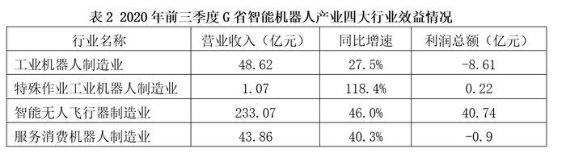

### 第 1 题　qid 3018796 · 增长

2020年前三季度，G省智能机器人产业中，四大行业总产值的同比增量排序正确的是（    ）。
①工业机器人制造业
②特殊作业工业机器人制造业
③智能无人飞行器制造业
④服务消费机器人制造业

- **A**. 
①③②④

- **B**. 
④②①③

- **C**. 
③④②①

- **D**. 
③①②④
　✅

**答案**：D

**官方解析**

根据题干“2020年前三季度······同比增量排序正确的是”，可判定本题为增长量比较问题。定位表1可得，2020年前三季度G省工业机器人制造业（①）总产值76.88亿元，同比增长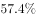；特殊作业工业机器人制造业（②）总产值2.77亿元，同比增长；智能无人飞行器制造业（③）总产值201.07亿元，同比增长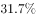；服务消费机器人制造业（④）总产值26.18亿元，同比增长。其中④的总产值同比增速为负，可知同比增长量为负值，应为四个行业中最低，排除B、C两项；观察A、D两项区别，只需比较①、③的同比增长量大小即可，①的同比增量为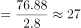亿元，③的同比增量为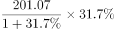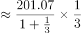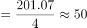亿元，③的同比增量①的同比增量，与D项顺序一致，排除A项。

故正确答案为D。

---

### 第 2 题　qid 3018805 · 平均数

2020年前三季度，G省下列行业中，平均每个企业产值最高的是（    ）。

- **A**. 工业机器人制造业
- **B**. 特殊作业工业机器人制造业
- **C**. 智能无人飞行器制造业　✅
- **D**. 服务消费机器人制造业

**答案**：C

**官方解析**

根据题干“2020年前三季度······平均每个企业产值最高的是”，结合材料时间为2020年前三季度，可判断本题为现期平均数比较问题。定位表1可得，2020年前三季度G省工业机器人制造业企业95个，总产值76.88亿元，平均产值为亿元；特殊作业工业机器人制造业企业4个，总产值2.77亿元，平均产值为亿元；智能无人飞行器制造业企业17个，总产值201.07亿元，平均产值为亿元；服务消费机器人制造业企业24个，总产值26.18亿元，平均产值为亿元。比较可知，智能无人飞行器制造业企业平均产值最高。

故正确答案为C。

---

### 第 3 题　qid 3018817 · 综合

2020年前三季度，G省智能机器人产业的总体利润率（利润率）约为（    ）。

- **A**. 

- **B**. 

- **C**. 

　✅
- **D**. 

**答案**：C

**官方解析**

根据题干“2020年前三季度······总体利润率（利润率）约为”，结合材料时间为2020年前三季度，可判定本题为现期比重计算问题。定位文字材料第二段可得，2020年前三季度，G省智能机器人产业实现营业收入326.62亿元；定位表2可得，2020年前三季度，G省智能机器人产业四大行业利润总额分别为-8.61亿元、0.22亿元、40.74亿元、-0.9亿元。则所求总体利润率为。

故正确答案为C。

---

### 第 4 题　qid 3018821 · 增长

2020年前三季度，G省工业机器人制造业营业收入同比增长约（    ）亿元。

- **A**. 5
- **B**. 10　✅
- **C**. 15
- **D**. 20

**答案**：B

**官方解析**

根据题干“2020年前三季度······同比增长约（    ）亿元”，可判定本题为增长量计算问题。定位表2，2020年前三季度，G省工业机器人制造业营业收入为48.62亿元，同比增长。由增长量，可得2020年前三季度，G省工业机器人制造业营业收入同比增长量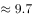亿元，与B项最为接近。

故正确答案为B。

---

### 第 5 题　qid 3018824 · 综合

根据所给资料，下列说法不正确的是（    ）。

- **A**. 
2020年前三季度，G省全部规模以上工业产值同比增长
　✅
- **B**. 
2019年前三季度，G省智能机器人产业营业收入超200亿元

- **C**. 
2019年前三季度，G省智能机器人产业平均用工人数为2.87万人

- **D**. 
2020年前三季度，G省智能机器人产业中利润率最高的行业是特殊作业工业机器人制造业

**答案**：A

**官方解析**

A项：定位文字材料第一段“2020年前三季度，G省智能机器人······完成总产值306.90亿元，占全部规模以上工业产值的，同比增长，增速高于全部规模以上工业产值32.8个百分点”。2020年前三季度，G省全部规模以上工业产值同比增长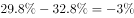，即同比下降，错误；

B项：定位表2，由基期量可得，2019年前三季度，工业机器人制造业营业收入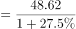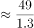亿元；特殊作业工业机器人制造业营业收入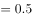亿元；智能无人飞行器制造业营业收入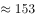亿元；服务消费机器人制造业营业收入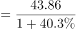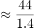亿元。则2019年前三季度，G省智能机器人产业营业收入2019年前三季度四大行业营业收入之和亿元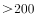亿元，正确；

C项：定位文字材料第一段“2020年前三季度，G省智能机器人产业······前三季度平均用工人数3.12万人，同比增长”。由基期量可得，2019年前三季度，G省智能机器人产业平均用工人数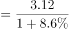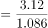万人，正确；

D项：定位表2可得，2020年前三季度，G省工业机器人制造业利润率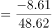；特殊作业工业机器人制造业利润率；智能无人飞行器制造业利润率；服务消费机器人制造业利润率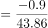。则利润率最高的行业是特殊作业工业机器人制造业，正确。

本题为选非题，故正确答案为A。

---

## 材料 2

        2020年上半年，我国农产品进出口总额达1159.0亿美元。农产品进口额为807.5亿美元，同比增长。受新冠肺炎疫情影响，我国农产品出口额同比下降，为351.5亿美元。

        在我国的农产品进口中，除大洋洲农产品进口额同比下降1.9个百分点外，其余各大洲的农产品进口额均有所增加；欧洲国家或地区农产品进口额增幅最大，达。农产品出口中，对亚洲国家或地区的出口额最高，达229.7亿美元，较2019年同期下降了3.7个百分点。

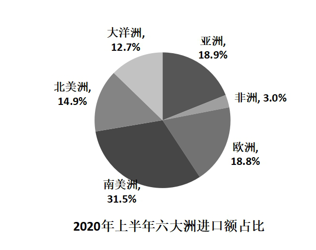

随着我国居民饮食结构的调整，居民对肉类食品的需求量逐年增加。2020年上半年畜类产品进口额同比增长，对农产品进口额的增长贡献超7成。我国农产品出口最多的两大类别分别是食用蔬菜和水、海产品，合计出口额达93.6亿美元，占农产品出口总额的。 

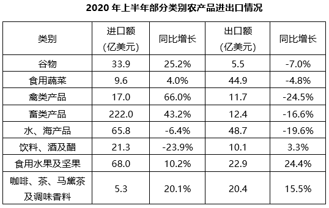

### 第 6 题　qid 3018837 · 增长

2020年上半年，我国农产品进出口额同比增长约：

- **A**. 

- **B**. 

- **C**. 

　✅
- **D**. 

**答案**：C

**官方解析**

根据题干“2020年上半年······同比增长约”，结合选项带百分号，且已知我国农产品进口额和出口额相关数据，可判定本题为混合增长率问题。定位文字材料第一段可得：2020年上半年，我国农产品进出口总额达1159.0亿美元。农产品进口额为807.5亿美元，同比增长。受新冠肺炎疫情影响，我国农产品出口额同比下降，为351.5亿美元。根据混合增长率口诀“混合增长率大小居中，偏向基期量大的一方（一般用现期量代替基期量）”可知，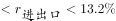，即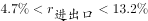，排除A项。根据线段法“距离与量成反比（一般用现期量代替基期量计算）”可知：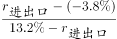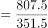，解得，与C项最接近。

故正确答案为C。

---

### 第 7 题　qid 3018839 · 增长

2020年上半年，我国水、海产品出口额同比减少约（    ）亿美元。

- **A**. 6
- **B**. 8
- **C**. 10
- **D**. 12　✅

**答案**：D

**官方解析**

根据题干“2020年上半年······同比减少约（    ）亿美元”，可判定本题为增长量计算问题。定位表格材料可得：2020年上半年，我国水、海产品出口额为48.7亿美元，同比增长。根据公式：增长量，则2020年上半年，我国水、海产品出口额同比增长量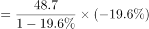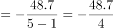亿美元，即减少约12亿美元。

故正确答案为D。

---

### 第 8 题　qid 3018841 · 综合

以下农产品类别中，2019年上半年我国进出口总额最高的是：

- **A**. 食用蔬菜　✅
- **B**. 禽类产品
- **C**. 饮料、酒及醋
- **D**. 咖啡、茶、马黛茶及调味香料

**答案**：A

**官方解析**

根据题干“2019年上半年······我国进出口总额最高的是”，结合材料已知2020年上半年相关数据，可判定本题为基期比较问题。定位表格材料可得：食用蔬菜，禽类产品，饮料、酒及醋，咖啡、茶、马黛茶及调味香料的进口额及同比增长率，出口额及同比增长率。根据进出口总额进口额出口额，基期量，可得2019年上半年我国下列农产品的进出口总额分别为：

食用蔬菜：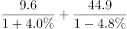亿美元；

禽类产品：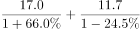亿美元；

饮料、酒及醋：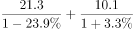亿美元；

咖啡、茶、马黛茶及调味香料：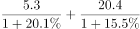亿美元。

比较可知，2019年上半年我国进出口总额最高的农产品是食用蔬菜。

故正确答案为A。

---

### 第 9 题　qid 3018845 · 综合

2019年上半年，我国农产品进口额中欧洲国家或地区约占：

- **A**. 

- **B**. 

　✅
- **C**. 

- **D**. 

**答案**：B

**官方解析**

根据题干“2019年上半年······中······约占”，结合材料时间为2020年上半年，可判定本题为基期比重问题。定位文字材料第一段可得：农产品进口额同比增长（）；定位文字材料第二段可得：欧洲国家或地区农产品进口额增幅最大，达（）；定位饼状图材料可得：2020年上半年欧洲进口额占比为。根据公式：基期比重，其中即2020年上半年欧洲进口额占比为，则2019年上半年，欧洲国家或地区进口额占比为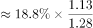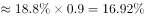，与B项最接近。

故正确答案为B。

---

### 第 10 题　qid 3018847 · 综合

根据以上材料，关于我国2020年上半年农产品进出口情况，下列说法错误的是：

- **A**. 
畜类产品进口额为谷物进口额的6倍以上

- **B**. 
对亚洲国家或地区的出口额高于其农产品进口额

- **C**. 
六大洲中只有南美洲国家或地区的进口额超过160亿美元

- **D**. 
表格给出的农产品出口额合计约占我国农产品出口额的
　✅

**答案**：D

**官方解析**

A项：定位表格材料可得：2020年上半年畜类产品进口额为222.0亿美元，谷物进口额为33.9亿美元。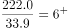，则畜类产品进口额为谷物进口额的6倍以上，正确；

B项：定位文字材料第一、二段可得：我国农产品进口额为807.5亿美元，农产品出口中，对亚洲国家或地区的出口额最高，达229.7亿美元；定位饼状图材料可得：2020年上半年亚洲进口额占比为。根据部分整体比重，则2020年上半年亚洲进口额约为亿美元＜出口额229.7亿美元，正确；

C项：定位文字材料第一段可得：农产品进口额为807.5亿美元；定位饼状图材料可得：2020年上半年六大洲进口额占比，其中南美洲进口额占比最大，为；亚洲进口额占比排名第二，为。根据部分整体比重，由于整体量相同，仅需确定占比第一、第二的大洲与160亿美元的关系即可。则南美洲进口额约为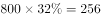亿美元；根据B项解析可知，亚洲进口额约为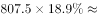亿美元，所以六大洲中只有南美洲国家或地区的进口额超过160亿美元，正确；

D项：定位文字材料第三段可得：我国农产品出口最多的两大类别分别是食用蔬菜和水、海产品，合计出口额达93.6亿美元，占农产品出口总额的；定位表格材料可得：2020年上半年表中各类别农产品的出口额。除食用蔬菜和水、海产品外，其余各类别农产品的出口额合计为5.5+11.7+12.4+10.1+22.9+20.46+12+12+10+23+20=83亿美元＞亿美元，则其占我国农产品出口额的比重，故表中各类别农产品的出口额合计占我国农产品出口额的比重＞26.6%+13.3%=39.9%，错误。

本题为选非题，故正确答案为D。

---

## 材料 3

        受疫情影响，2020年全国社会消费品零售总额391981亿元，同比下降，居家消费需求明显增长，“宅经济”带动新型消费模式加快发展。2020年，全国网上零售额比上年增长，增速比前三季度加快1.2个百分点。其中实物商品网上零售额增长，占社会消费品零售总额的比重为。在线上消费快速增长带动下，全年快递业务量超过830亿件，比上年增长超过。

        G省消费市场受新冠肺炎疫情冲击更为明显，2020年全省社会消费品零售总额40207亿元，同比下降。一季度，消费市场受疫情明显冲击，市场销售大幅下降。随着疫情防控形势不断好转及多项政策措施持续显效。市场主体加快复商复产，居民消费需求稳步释放。二季度市场销售降幅较一季度收窄10个百分点，三季度消费品零售总额与去年同期基本持平。四季度，社会消费品零售总额同比增长，整体回升态势明显。

        其中，G省城镇消费品零售额35904亿元，同比下降；农村消费品零售额4303亿元，同比下降。2020年12月城镇消费品零售额3480亿元，同比增长；农村消费品零售额436亿元，同比增长，消费情况明显回暖。 

### 第 11 题　qid 3018816 · 增长

2016年-2020年，G省社会消费品零售总额年均增长率约为（    ）。

- **A**. 

- **B**. 

　✅
- **C**. 

- **D**. 

**答案**：B

**官方解析**

根据题干“2016年-2020年，······年均增长率约为”，可判定本题为年均增长率问题。定位图形材料可得：2016年G省社会消费品零售总额为3.32万亿元，2020年为4.02万亿元。根据年均增长率计算公式：，可得，即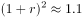，解得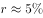。

故正确答案为B。

---

### 第 12 题　qid 3018822 · 比重

与2019年相比，2020年G省社会消费品零售总额占全国的比重（    ）。

- **A**. 增加了2.7个百分点
- **B**. 增加了0.27个百分点
- **C**. 下降了2.7个百分点
- **D**. 下降了0.27个百分点　✅

**答案**：D

**官方解析**

根据题干“与2019年相比，2020年······占全国的比重”，结合选项为“增加了/下降了······个百分点”，可判定本题为两期比重计算问题。定位文字材料第一段可得：2020年全国社会消费品零售总额391981亿元，同比下降；定位文字材料第二段可得：2020年G省社会消费品零售总额40207亿元，同比下降。根据两期比重结论：部分增长率（）总体增长率（），则2020年该比重下降，排除A、B两项；且具体数值应，即下降了不到2.5个百分点，只有D项符合，当选。

故正确答案为D。

---

### 第 13 题　qid 3018825 · 增长

与2019年相比，2020年全国实物商品网上零售额增长约（    ）万亿元。

- **A**. 1.26　✅
- **B**. 2.26
- **C**. 3.26
- **D**. 4.26

**答案**：A

**官方解析**

根据题干“与2019年相比，2020年······增长约（    ）万亿元”，可判定本题为增长量计算问题。定位文字材料第一段可得：2020年全国社会消费品零售总额391981亿元；实物商品网上零售额增长，占社会消费品零售总额的比重为。则2020年全国实物商品网上零售额总量比重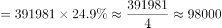亿元，故所求增长量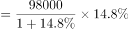亿元，即约1.23万亿元，与A项最为接近。

故正确答案为A。

---

### 第 14 题　qid 3018827 · 综合

根据以上资料，下列说法错误的是（    ）。

- **A**. 
2019年全国快递业务量少于650亿件

- **B**. 
2019年，G省城镇消费品零售额占全省社会消费品零售总额9成以上
　✅
- **C**. 
2020年12月，农村与城镇的消费品零售额均高于其他月份平均水平

- **D**. 
如果2019年全国各季度网上零售额相等，则2020年第四季度网上零售额同比增长率约为

**答案**：B

**官方解析**

A项：定位文字材料第一段可得：（2020年）全年快递业务量超过830亿件，比上年增长超过。根据公式：基期量，可知2019年全国快递业务量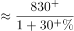，不能确定最后的结果到底为多少，不能确定是否正确；

B项：定位文字材料第二段可得：2020年全省社会消费品零售总额40207亿元，同比下降。定位文字材料第三段可得：G省城镇消费品零售额35904亿元，同比下降。则2019年G省城镇消费品零售额占全省社会消费品零售总额的比重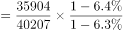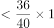，不到9成，错误；

C项：定位文字材料第三段可得：（2020年）G省城镇消费品零售额35904亿元，农村消费品零售4303亿元；2020年12月城镇消费品零售额3480亿元，农村消费品零售额436亿元。故1-11月城镇消费品零售额平均水平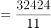亿元亿元；1-11月农村消费品零售额平均水平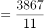亿元亿元，正确；

D项：定位文字材料第一段可得：2020年，全国网上零售额比上年增长，增速比前三季度加快1.2个百分点。设2019年全国各季度网上零售额均为，则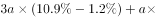第四季度增长率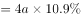，解得第四季度增长率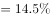，正确。

本题为选非题，故正确答案为B。

---

### 第 15 题　qid 3018834 · 综合

下列选项最有可能符合G省2020年各季度社会消费品零售情况的是（    ）。

- **A**. 

- **B**. 

- **C**. 
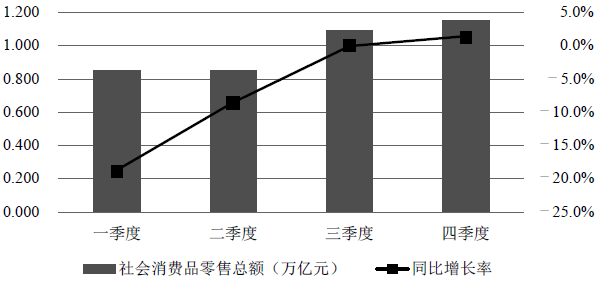
　✅
- **D**. 

**答案**：C

**官方解析**

定位文字材料第二段可得：（2020年）一季度······市场销售大幅下降······二季度市场销售降幅较一季度收窄10个百分点，三季度消费品零售总额与去年同期基本持平，四季度社会消费品零售总额同比增长。一季度同比增长率为，A项，B项在与中间，均不符合，排除A、B两项；二季度同比增长率为，C、D两项都符合；三季度同比增长率为，D项0，排除D项。只有C项符合，当选。

故正确答案为C。

---
