# 2021年广西区考公务员录用考试《行测》题（网友回忆版）

> 资料分析 · 10 题 · 广西 2021

## 材料 1

        2020年全年，汽车产销降幅收窄至以内。汽车产量为2522.5万辆，销量为2531.1万辆，同比分别下降和，降幅分别比2020年上半年收窄14.8和15.0个百分点。2020年全年，新能源汽车销量为136.7万辆，同比增长。

        2020年全年，汽车进口93.0万辆，同比下降，降幅较2020年上半年收窄21.1个百分点；进口金额467.0亿美元，同比下降，降幅较2020年上半年收窄25.8个百分点。全年汽车出口108万辆，同比下降，降幅较2020年上半年收窄10.4个百分点；出口金额157.4亿美元，同比下降，降幅较2020年上半年收窄8.3个百分点。

### 第 1 题　qid 3522666 · 综合

2020年上半年汽车销量降幅估计在：

- **A**. 10个百分点以内
- **B**. 10-12个百分点
- **C**. 12-14个百分点
- **D**. 15个百分点以上　✅

**答案**：D

**官方解析**

根据题干“2020年上半年汽车销量降幅······在”，可判定本题为一般增长率问题。定位材料第一段可得：2020年全年汽车销量下降，降幅比2020年上半年收窄15.0个百分点。故2020年上半年汽车销量降幅为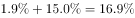，即降幅在15个百分点以上。

故正确答案为D。

---

### 第 2 题　qid 3522669 · 综合

2019年汽车产量约为：

- **A**. 2548万辆
- **B**. 2354万辆
- **C**. 2563万辆
- **D**. 2574万辆　✅

**答案**：D

**官方解析**

根据题干“2019年······约为”，结合材料所给时间为2020年，可判定本题为基期计算问题。定位材料第一段可得：2020年全年，汽车产量为2522.5万辆，同比下降。代入基期计算公式，基期量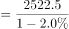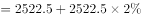万辆，与D项最接近。

故正确答案为D。

---

### 第 3 题　qid 3522676 · 比重

2019年新能源汽车销量占汽车总销量的比重为：

- **A**. 
不超过

- **B**. 
左右

- **C**. 
左右
　✅
- **D**. 
大于

**答案**：C

**官方解析**

根据题干“2019年······占······的比重为”，结合材料所给时间为2020年，可判定本题为基期比重问题。定位材料第一段可得：2020年全年，汽车销量为2531.1万辆，同比下降。2020年全年，新能源汽车销量为136.7万辆，同比增长。根据基期比重公式可得，，与C项最接近。

故正确答案为C。

---

### 第 4 题　qid 3522677 · 综合

根据上述资料可推出：

- **A**. 2019年上半年出口汽车70.9万辆
- **B**. 2020年生产的汽车在当年内全部售完
- **C**. 2020年上半年汽车产销降幅大致相同　✅
- **D**. 2020年汽车进口量与进口金额的变化幅度基本—致

**答案**：C

**官方解析**

A项：定位材料第二段“全年汽车出口108万辆，同比下降，降幅2020年上半年收窄10.4个百分点”，无2019年上半年汽车出口的相关数据，无法推出；

B项：定位材料第一段“汽车产量为2522.5万辆，销量为2531.1万辆······”虽然销量比产量高，但销售出去的汽车未必都是2020年生产的，无法推出；

C项：定位材料第一段“2020年全年，汽车产销降幅收窄至以内。汽车产量为2522.5万辆，销量为2531.1万辆，同比分别下降和，降幅分别比2020年上半年收窄14.8和15.0个百分点”可知2020年上半年汽车产量降幅为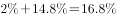，销量降幅为，故2020年上半年汽车产销降幅大致相同，可以推出；

D项：定位材料第二段“2020年全年，汽车进口93.0万辆，同比下降，降幅较2020年上半年收窄21.1个百分点；进口金额467.0亿美元，同比下降······”可知2020年汽车进口量变化幅度为，进口金额变化幅度为，二者差距较大，无法推出。

故正确答案为C。

---

### 第 5 题　qid 3522678 · 综合

下列选项说法错误的是：

- **A**. 2020年全年汽车产销降幅要小于2019年的降幅
- **B**. 2020年全年汽车的产量减少量要小于销量的减少量　✅
- **C**. 2020年全年新能源汽车的销售要好于其它类型汽车的销售
- **D**. 总体而言，2020年进口汽车平均价格要高于出口汽车平均价格

**答案**：B

**官方解析**

A项：定位材料第一段“2020年全年，汽车产销降幅收窄至以内”可知2020年降幅较2019年要收窄，即2020年的降幅小于2019年的降幅，正确；

B项：定位材料第一段“2020年全年······汽车产量为2522.5万辆，销量为2531.1万辆，同比分别下降和······”则2020年汽车产量的减少量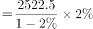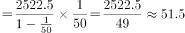万辆；2020年汽车销量的减少量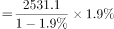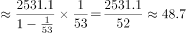万辆，因此2020年全年汽车的产量减少量要大于销量的减少量，错误；

C项：定位材料第一段“2020年全年，汽车产销降幅收窄至以内。汽车产量为2522.5万辆，销量为2531.1万辆，同比分别下降和······2020年全年，新能源汽车销量为136.7万辆，同比增长”可知2020年全年汽车销量下降，其中新能源汽车销量增长，根据混合增长率混合后要居中的原则，2020年除了新能源汽车外其它类型汽车销量为负增长，因此2020年全年新能源汽车的销售要好于其它类型汽车的销售，正确；

D项：定位材料第二段“2020年全年，汽车进口93.0万辆······进口金额467.0亿美元······全年汽车出口108万辆······出口金额157.4亿美元······”故2020年全年进口平均价格万美元/辆；出口平均价格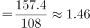万美元/辆，因此2020年汽车进口均价出口均价，正确。

本题为选非题，故正确答案为B。

备注：C选项中“好于”是一种口语化表述，不是十分严谨，但根据语意可推断其意为“新能源汽车销量的增速＞其它类型汽车”

---

## 材料 2

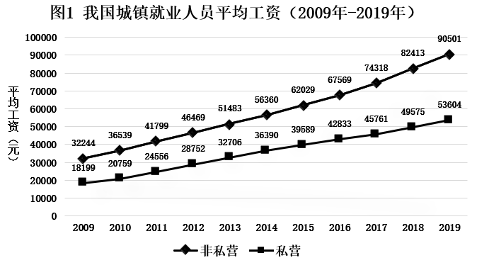

### 第 6 题　qid 3522682 · 平均数

2009年-2019年，城镇非私营单位和私营单位平均工资差额最大的年份是：

- **A**. 2009年
- **B**. 2013年
- **C**. 2016年
- **D**. 2019年　✅

**答案**：D

**官方解析**

定位图1可知，2009年-2019年我国城镇私营和非私营单位就业人员的平均工资。选项各年份对应的城镇非私营单位和私营单位平均工资差额计算如下：

A项（2009年）：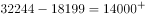元；

B项（2013年）：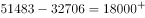元；

C项（2016年）：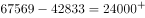元；

D项（2019年）：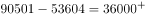元。

因此，平均工资差额最大的年份是2019年。

故正确答案为D。

---

### 第 7 题　qid 3522685 · 平均数

与2009年相比，2019年城镇非私营单位就业人员平均工资增长的倍数约为：

- **A**. 1.5倍
- **B**. 1.8倍　✅
- **C**. 2.8倍
- **D**. 3.2倍

**答案**：B

**官方解析**

根据题干“与2009相比，2019年······增长的倍数约为”，可判定本题为一般增长率计算问题。定位图1可知，2009年、2019年城镇非私营单位就业人员平均工资分别为32244元、90501元。根据增长率，所求增长率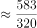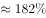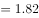倍，即增长的倍数约为1.8倍。

故正确答案为B。

---

### 第 8 题　qid 3522687 · 平均数

2019年城镇非私营单位工资低于当年非私营单位平均工资的行业有：

- **A**. 9个　✅
- **B**. 12个
- **C**. 15个
- **D**. 16个

**答案**：A

**官方解析**

定位折线图可知，2019年城镇非私营单位就业人员平均工资为90501元；定位统计表可知，2019年我国各行业城镇非私营单位就业人员的平均工资，故2019年城镇非私营单位工资低于当年非私营单位平均工资的行业有：农、林、牧、渔业，制造业，建筑业，批发和零售业，住宿和餐饮业，房地产业，租赁和商务服务业，水利、环境和公共设施管理业以及居民服务和其他服务业，一共9个行业。
故正确答案为A。

---

### 第 9 题　qid 3522690 · 增长

2009年-2019年，城镇私营单位平均工资年均增长率最高的是：

- **A**. 科学研究、技术服务和地质勘查业
- **B**. 信息传输、计算机服务和软件业　✅
- **C**. 金融业
- **D**. 建筑业

**答案**：B

**官方解析**

根据题干“······年均增长率最高”，可判定本题为年均增长率问题。定位统计表可知，2009年和2019年我国各行业城镇私营单位就业人员的平均工资。根据年均增长率公式：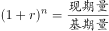可得，n（年份差：2009年-2019年）相同，只需比较即可，即越大，年均增长率越大。则科学研究、技术服务和地质勘查业：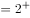；信息传输、计算机服务和软件业：；金融业：；建筑业：，故2009年-2019年信息传输、计算机服务和软件业的平均工资年均增长率最高。

故正确答案为B。

---

### 第 10 题　qid 3522692 · 综合

下列选项说法正确的是：

- **A**. 2009年-2019年，城镇私营单位平均工资年均增长速度快于非私营单位平均工资年均增长速度　✅
- **B**. 2009年-2019年，城镇非私营单位的各行业平均工资均高于私营单位相应行业的平均工资
- **C**. 2019年非私营采矿业的平均工资最接近全社会平均工资，所以该行业内部分配最公平
- **D**. 2019年城镇私营单位行业之间薪资差额最大的有3.6倍

**答案**：A

**官方解析**

A项：定位折线图可知，城镇非私营单位平均工资2009年为32244元，2019年为90501元；城镇私营单位平均工资2009年为18199元，2019年为53604元。根据年均增长率公式：可得，n（年份差：2009年-2019年）相同，只需比较即可，即越大，年均增长率越大。则非私营单位：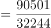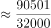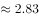；私营单位：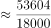，故2009年-2019年，城镇私营单位平均工资年均增长速度快于非私营单位，正确；

B项：定位统计表可知，2009年农、林、牧、渔业私营单位平均工资为14585元，非私营单位为14356元，非私营平均工资并非均高于私营，且题干要求的是2009年-2019年，但材料只给了2009年和2019年的数据，中间年份的平均工资无法得知，错误；

C项：材料中没有说明全社会的平均工资，且没有提及行业内部分配问题，故无法推出，错误；

D项：材料未给出2019年公共管理和社会组织的城镇私营单位平均工资，故不能确定2019年城镇私营单位行业的最高薪资和最低薪资，故无法推出，错误。

故正确答案为A。

---
