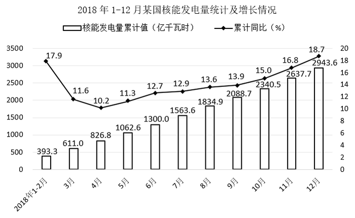

# 2021年度浙江省党政机关选调应届优秀大学毕业生《行测》题（网友回忆版）

> 资料分析 · 10 题 · 浙江 2021

## 材料 1

### 第 1 题　qid 5832470 · 综合

2018年12月，该国核能发电量比3月高多少亿千瓦时？

- **A**. 74.5
- **B**. 88.2　✅
- **C**. 97.6
- **D**. 105.3

**答案**：B

**官方解析**

定位统计图可得：2018年1-2月、3月、11月、12月该国核能发电量累计值分别为393.3亿千瓦时、611.0亿千瓦时、2637.7亿千瓦时、2943.6亿千瓦时。则题干所求=（2943.6-2637.7）-（611.0-393.3）=305.9-217.7=88.2亿千瓦时。
故正确答案为B。

---

### 第 2 题　qid 5832473 · 增长

2018年3~12月，该国核能发电量累计值同比增速最低的月份，其当月发电量同比约增加多少亿千瓦时？

- **A**. 5
- **B**. 8
- **C**. 13　✅
- **D**. 17

**答案**：C

**官方解析**

根据题干“2018年3~12月······同比约增加······亿千瓦时”，可判定本题为增长量计算问题。定位统计图可得：2018年3~12月，该国核能发电量累计值同比增速最低的月份为4月（10.2%）；2018年3月该国核能发电量累计值为611.0亿千瓦时，累计同比增速为11.6%；4月该国核能发电量累计值为826.8亿千瓦时。

方法一：2018年4月该国核能发电量同比增量=2018年4月累计发电量同比增量-2018年3月累计发电量同比增量。根据公式：增长量，可得题干所求亿千瓦时。

方法二：2018年4月该国核能发电量=826.8-611.0=215.8亿千瓦时。根据公式：基期量，可得2017年4月该国核能发电量亿千瓦时。根据公式：增长量=现期量-基期量，可得2018年4月该国核能发电量同比增加215.8-202.8=13亿千瓦时。

故正确答案为C。

---

### 第 3 题　qid 5832476 · 综合

2018年3~12月，该国核能发电量超过300亿千瓦时的有几个月？

- **A**. 1　✅
- **B**. 2
- **C**. 3
- **D**. 4

**答案**：A

**官方解析**

定位统计图可得2018年1~2月及3~12月各月该国核能发电量累计值。则2018年3~12月该国核能发电量分别为：3月，611.0-393.3=217.7亿千瓦时；4月，826.8-611.0=215.8亿千瓦时；5月，1062.6-826.8=235.8亿千瓦时；6月，1300.0-1062.6=237.4亿千瓦时；7月，1563.6-1300.0=263.6亿千瓦时；8月，1834.9-1563.6=271.3亿千瓦时；9月，2088.7-1834.9=253.8亿千瓦时；10月，2340.5-2088.7=251.8亿千瓦时；11月，2637.7-2340.5=297.2亿千瓦时；12月，2943.6-2637.7=305.9亿千瓦时。
综上，2018年3~12月该国核能发电量超过300亿千瓦时的只有12月，共1个。
故正确答案为A。

---

### 第 4 题　qid 5832479 · 综合

2017年，该国核能发电量累计值突破2000亿千瓦时是在几月份？

- **A**. 9月
- **B**. 10月　✅
- **C**. 11月
- **D**. 12月

**答案**：B

**官方解析**

根据“2017年······是在几月份”，结合材料时间为2018年，可判定本题为基期计算问题。定位统计图可得2018年9-12月各月该国核能发电量累计值及累计同比增速。根据公式：基期量，可得2017年9月该国核能发电量累计值亿千瓦时；2017年10月该国核能发电量累计值亿千瓦时，则2017年该国核能发电量累计值突破2000亿千瓦时是在10月份。

故正确答案为B。

---

### 第 5 题　qid 5832483 · 综合

能够从上述资料中推出的是（    ）。

- **A**. 2018年，该国核能发电量最高的季度是第三季度
- **B**. 2017年第二季度，该国核能发电量超过700亿千瓦时
- **C**. 2018年1~7月，该国核能发电量累计值同比增长了200多亿千瓦时
- **D**. 2018年4~12月，该国核能发电量环比下降的月份有3个　✅

**答案**：D

**官方解析**

A项：定位统计图可得，2018年3月、6月、9月、12月该国核能发电量累计值分别为611.0亿千瓦时、1300.0亿千瓦时、2088.7亿千瓦时、2943.6亿千瓦时。则2018年第一季度该国核能发电量为611.0亿千瓦时；2018年第二季度该国核能发电量为1300.0-611.0=689.0亿千瓦时；2018年第三季度该国核能发电量为2088.7-1300.0=788.7亿千瓦时；2018年第四季度该国核能发电量为2943.6-2088.7=854.9亿千瓦时。故核能发电量最高的季度是第四季度（854.9亿千瓦时），非第三季度，错误；

B项：定位统计图可得，2018年3月该国核能发电量累计值为611.0亿千瓦时、累计同比增速为11.6%；6月该国核能发电量累计值为1300.0亿千瓦时、累计同比增速为12.7%。根据公式：基期量，可得2017年第二季度该国核能发电量亿千瓦时，并非超过700亿千瓦时，错误；

C项：定位统计图可得，2018年7月该国核能发电量累计值为1563.6亿千瓦时，累计同比增速为12.9%。根据公式：增长量，可得所求亿千瓦时，非200多亿千瓦时，错误；

D项：根据本篇材料第三题的计算结果可知，2018年3-12月该国核能发电量分别为：3月217.7亿千瓦时；4月215.8亿千瓦时；5月235.8亿千瓦时；6月237.4亿千瓦时；7月263.6亿千瓦时；8月271.3亿千瓦时；9月253.8亿千瓦时；10月251.8亿千瓦时；11月297.2亿千瓦时；12月305.9亿千瓦时。综上，环比下降的月份有4月、9月、10月，共3个月，正确。

故正确答案为D。

---

## 材料 2

        2017年末，杭州市常住人口为946.8万人，比2016年末增加28.0万人，增幅3.05%。人口出生率为，比上年提高1.4个千分点，死亡率为，自然增长率达到。其中城镇人口为727.14万人，农村人口为219.66万人，农村人口占总人口的23.8%，与2016年相比，降低0.6个百分点。男性为482.11万人，占总人口的50.9%；女性为464.69万人，占总人口的49.1%。性别比（以女性为100，男性对女性的比例）为103.8，比2016年下降0.5个点。0~14岁的人口为116.64万人，占总人口的12.3%；15~64岁的人口为713.82万人，占总人口的75.4%；65岁及以上的人口为116.34万人，占总人口的12.3%。其中60岁及以上人口为180.2万人，占比为19.0%。

### 第 6 题　qid 5832499 · 综合

2016年末，杭州市男性人口约比女性人口多多少万人？

- **A**. 11
- **B**. 15
- **C**. 17
- **D**. 19　✅

**答案**：D

**官方解析**

根据题干“2016年末······比······多多少万人”，结合材料时间为2017年末，可判定本题为基期和差问题。定位文字材料可得：2017年末，杭州市常住人口为946.8万人，比2016年末增加28.0万人；性别比（以女性为100，男性对女性的比例）为103.8，比2016年下降0.5个点。根据公式：基期量=现期量-增长量，可得2016年末杭州市常住人口=946.8-28.0=918.8万人，2016年末男性对女性的性别比为103.8+0.5=104.3。则2016年末，杭州市男性人口比女性人口多万人，与D项最接近。

故正确答案为D。

---

### 第 7 题　qid 5832503 · 综合

2016年末，杭州市城镇常住人口约为多少万人？

- **A**. 220
- **B**. 695　✅
- **C**. 705
- **D**. 920

**答案**：B

**官方解析**

根据题干“2016年末······约多少万人”，结合材料给出2017年末杭州市常住人口数及农村人口占总人口比重，可判定本题为基期比重问题。根据本篇材料第1题计算结果可知，2016年末杭州市常住人口为918.8万人。定位文字材料可得：2017年末，农村人口占总人口的23.8%，与2016年相比，降低0.6个百分点。则2016年末农村人口占总人口的比重为23.8%+0.6%=24.4%，城镇人口占总人口的比重为1-24.4%=75.6%。根据公式：部分=整体×比重，则2016年末杭州市城镇常住人口万人，与B项最接近。

故正确答案为B。

---

### 第 8 题　qid 5832505 · 综合

2017年末，杭州各区、县（市）中，常住人口数量排在第五位的是（    ）。

- **A**. 富阳区　✅
- **B**. 江干区
- **C**. 临安区
- **D**. 西湖区

**答案**：A

**官方解析**

定位表格材料可知2017年末杭州各地区的常住人口数。常住人口数量排名前五位的分别为余杭区（147.6万人）、萧山区（145.4万人）、西湖区（83.1万人）、江干区（77.2万人）、富阳区(73.9万人)，即排在第五位的是富阳区。
故正确答案为A。

---

### 第 9 题　qid 5832506 · 综合

2017年各年龄段人口中，人数最多的约为人数最少的多少倍？

- **A**. 1.2
- **B**. 3.4
- **C**. 5.5
- **D**. 6.1　✅

**答案**：D

**官方解析**

根据题干“2017年······约为······的多少倍”，可判定本题为现期倍数问题。定位文字材料可得：2017年末杭州市0~14岁的人口为116.64万人，占总人口的12.3%；15~64岁的人口为713.82万人，占总人口的75.4%；65岁及以上的人口为116.34万人，占总人口的12.3%。其中60岁及以上人口为180.2万人，占比为19.0%。则2017年各年龄段人口中，人数最多的是15~64岁的人口、人数最少的是65岁及以上的人口。

方法一：故所求倍数，与D项最接近。

方法二：故所求倍数，与D项最接近。

故正确答案为D。

---

### 第 10 题　qid 5832508 · 增长

按照2017年的人口增长速度，哪一年杭州市常住人口突破1000万人？

- **A**. 2018
- **B**. 2019　✅
- **C**. 2020
- **D**. 2021

**答案**：B

**官方解析**

根据题干“按照2017年······增长速度，哪一年······突破1000万人”，可判定本题为现期追赶问题。定位文字材料可得：2017年末，杭州市常住人口为946.8万人，比2016年末增加28.0万人，增幅3.05%。根据公式：现期量，则，即，解得，即需要1年多，年份差n向上取整为2，则至少需要2年，即2017+2=2019年杭州市常住人口突破1000万人。

故正确答案为B。

---
