# 2021年新疆公务员录用考试《行测》试题（网友回忆版）

> 资料分析 · 10 题 · 新疆 2021

## 材料 1

        2018年第一季度，共有9586家星级饭店通过省级旅游主管部门审核，全国星级饭店第一季度的营业收入为487.11亿元，同比增长2.43%。餐饮收入为208.24亿元，客房收入为209.12亿元。

        第一季度全国50个重点旅游城市共有3636家星级饭店通过省级旅游主管部门数据审核，第一季度全国50个重点旅游城市星级饭店营业收入为320.19亿元。

### 第 1 题　qid 4628150 · 比重

2018年第一季度，全国哪类星级饭店的营业收入中，餐饮、客房收入占比最低？

- **A**. 五星级
- **B**. 四星级
- **C**. 三星级
- **D**. 二星级　✅

**答案**：D

**官方解析**

定位统计表可得：2018年第一季度全国二星级饭店的餐饮、客房收入比重，三星级饭店的餐饮、客房收入比重，四星级饭店的餐饮、客房收入比重，五星级饭店的餐饮、客房收入比重。因此，占比最低的是二星级饭店。

故正确答案为D。

---

### 第 2 题　qid 4628153 · 平均数

2018年第一季度，平均每家四星级及以上饭店月均营业收入：

- **A**. 低于300万元
- **B**. 在300-500万元之间　✅
- **C**. 在500-1000万元之间
- **D**. 超过1000万元

**答案**：B

**官方解析**

根据题干“2018年第一季度······平均每家······月均营业收入”，结合材料时间是2018年第一季度，可判定本题为现期平均数问题。定位统计表可得：2018年第一季度全国四星级饭店2401家，营业收入166.54亿元；五星级饭店827家，营业收入194.46亿元。故2018年第一季度平均每家四星级及以上饭店月均营业收入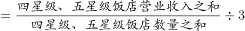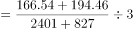亿元=375万元，在300-500万元之间。

故正确答案为B。

---

### 第 3 题　qid 4628156 · 平均数

已知2018年一季度全国三星级酒店平均客房收入为260.26元/间夜，问该季度平均每家三星级酒店订出客房：

- **A**. 不到2000间
- **B**. 2000-5000间之间　✅
- **C**. 5000-10000间之间
- **D**. 超过10000间

**答案**：B

**官方解析**

根据题干“已知2018年一季度······平均每家三星级酒店订出客房”，结合材料时间是2018年第一季度，可判定本题为现期平均数问题。定位统计表可得：2018年第一季度全国三星级饭店4613家，营业收入105.76亿元，客房收入比重41.58%；题干给出2018年一季度全国三星级酒店平均客房收入为260.26元/间夜。故2018年一季度平均每家三星级酒店订出客房数量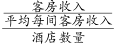间，介于2000-5000间之间。

故正确答案为B。

---

### 第 4 题　qid 4628159 · 综合

2018年第一季度全国50个重点旅游城市星级饭店营业收入为其他城市星级饭店营业收入的：

- **A**. 不到1.1倍
- **B**. 1.1-1.5倍之间
- **C**. 1.5-2倍之间　✅
- **D**. 2倍以上

**答案**：C

**官方解析**

根据题干“2018年第一季度······为······的”，结合材料时间为2018年第一季度，选项为多少倍，可判定本题为现期倍数问题。定位文字材料第一段可得，2018年第一季度，全国星级饭店第一季度的营业收入为487.11亿元；定位文字材料第二段可得，第一季度全国50个重点旅游城市星级饭店营业收入为320.19亿元。则2018年第一季度，其他城市星级饭店营业收入为487.11-320.19=166.92亿元，故所求倍数为倍，介于1.5-2倍之间。

故正确答案为C。

---

### 第 5 题　qid 4628161 · 综合

下列能够从上述资料中推出的是：

- **A**. 2017年第一季度，全国星级饭店营业收入超过480亿元
- **B**. 2018年第一季度，五星级饭店数量占全国星级饭店的一成以上
- **C**. 2018年第一季度，全国二星级饭店的客房收入比餐饮收入高2亿多元
- **D**. 2018年第一季度，全国50个重点旅游城市平均每家星级饭店营业收入高于全国平均水平　✅

**答案**：D

**官方解析**

A项：定位文字材料第一段可知，2018年第一季度，全国星级饭店的营业收入为487.11亿元，同比增长2.43%。根据公式：基期量，则2017年第一季度，全国星级饭店营业收入为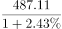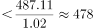亿元，小于480亿元，错误；

B项：定位统计表可知，2018年第一季度五星级饭店数量为827家；全国星级饭店数量为9586家。根据公式：比重，则2018年第一季度，五星级饭店数量占全国星级饭店的比重，不足一成，错误；

C项：定位统计表可知，2018年第一季度全国二星级饭店营业收入为20.16亿元，餐饮收入所占比重为30.17%，客房收入所占比重为37.35%。则2018年第一季度，全国二星级饭店的客房收入比餐饮收入高20.16×37.35%-20.16×30.17%=20.16×（37.35%-30.17%）=20.16×7.18%亿元，不足2亿元，错误；

D项：定位文字材料第一段可知，2018年第一季度，共有9586家星级饭店，全国星级饭店第一季度的营业收入为487.11亿元；定位文字材料第二段可知，第一季度全国50个重点旅游城市共有3636家星级饭店，营业收入为320.19亿元。则2018年第一季度，全国平均每家星级饭店营业收入为亿元；全国50个重点旅游城市平均每家星级饭店营业收入为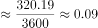亿元。故全国50个重点旅游城市平均每家星级饭店营业收入高于全国平均水平，正确。

故正确答案为D

---

## 材料 2

        2021年1-2月，全国进口天然气2080万吨，同比增长17.4%。中国天然气进口金额为7312.1百万美元，同比增长3.8%。

### 第 6 题　qid 4628163 · 综合

2021年1-2月，全国总共生产天然气约多少亿立方米？

- **A**. 324
- **B**. 336
- **C**. 348　✅
- **D**. 360

**答案**：C

**官方解析**

根据题干“2021年1-2月，全国总共生产天然气约多少亿立方米”，结合材料数据给出2021年1-2月全国天然气日均产量，可判定本题为现期平均数问题。定位统计图可得，2021年1-2月全国天然气日均产量为5.9亿立方米。根据全国天然气日均产量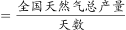，则2021年1-2月全国生产天然气总产量=1-2月日均产量×天数=5.9×（31+28）=5.9×59=348.1亿立方米，与C项最接近。

故正确答案为C。

---

### 第 7 题　qid 4628164 · 综合

2020年1-2月，全国月均进口天然气约多少万吨？

- **A**. 886　✅
- **B**. 1040
- **C**. 1561
- **D**. 1771

**答案**：A

**官方解析**

根据题干“2020年1-2月······月均······”，结合材料时间为2021年1-2月，可判定本题为基期平均数问题。定位文字材料可得：2021年1-2月，全国进口天然气2080万吨，同比增长17.4%。根据公式：，可得2020年1-2月，全国月均进口天然气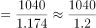万吨，与A项最接近。

故正确答案为A。

---

### 第 8 题　qid 4628165 · 综合

将2020年二季度按天然气产量高低进行排列，以下正确的是：

- **A**. 4月>5月=6月
- **B**. 4月>5月>6月　✅
- **C**. 5月>4月>6月
- **D**. 5月>4月=6月

**答案**：B

**官方解析**

定位统计图可得：2020年4月、5月、6月全国天然气日均产量分别为5.4亿立方米、5.1亿立方米、5.1亿立方米。则2020年二季度全国天然气产量分别为：4月=5.4×30=162亿立方米；5月=5.1×31=158.1亿立方米；6月=5.1×30=153亿立方米，故2020年二季度按天然气产量高低进行排列为4月＞5月＞6月。
故正确答案为B。

---

### 第 9 题　qid 4628167 · 增长

2020年下半年，天然气产量同比增量超过10亿立方米的月份有几个？

- **A**. 1
- **B**. 2
- **C**. 3
- **D**. 4　✅

**答案**：D

**官方解析**

根据题干“2020年下半年，······同比增量超过10亿立方米······”，可判定本题为增长量计算问题。定位统计图可得2020年7-12月全国天然气日均产量及同比增速。根据公式：增长量，可得2020年下半年，各月天然气产量同比增量情况如下：

7月：日均现期量4.6、日均增长率4.8%，增量为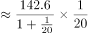亿立方米；

8月：日均现期量4.6、日均增长率3.7%，根据增量比较“大大则大”，8月份日均增量一定小于7月份日均增量，天数均为31天，所以8月份增量小于7月份增量，小于10亿立方米；

9月：日均现期量4.9、日均增长率7.6%，增量为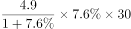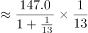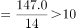亿立方米；

10月：日均现期量5.3、日均增长率11.9%，根据增量比较“大大则大”，10月份日均增量一定大于9月份日均增量，并且天数31大于9月30天，因此10月份增量大于9月份增量，大于10亿立方米；

11月：日均现期量5.6、日均增长率11.8%，同理，11月份增量大于9月份增量，大于10亿立方米；

12月：日均现期量6.0、日均增长率13.7%，同理，12月份增量大于9月份增量，大于10亿立方米；

则2020年下半年，天然气产量同比增量超过10亿立方米的月份有4个。

故正确答案为D。

---

### 第 10 题　qid 4628170 · 综合

不能从上述资料中推出的是：

- **A**. 2020年四季度，全国天然气产量比三季度增长了10%以上
- **B**. 2019年1～2月，全国天然气日均产量超过5亿立方米　✅
- **C**. 2021年1～2月，全国天然气进口金额同比增长额超过200百万美元
- **D**. 2020年二、三、四季度，全国天然气日均产量同比增速低于上月的月份超过一半

**答案**：B

**官方解析**

A项：定位统计图可知：2020年7月-12月各月全国天然气日均产量，可得2020年第三季全国天然气产量=4.6×31+4.6×31+4.9×30=432.2亿立方米，2020年第四季全国天然气产量=5.3×31+5.6×30+6.0×31=518.3亿立方米。根据公式：，故题干所求，正确；

B项：定位统计图可知：2020年1-2月全国天然气日均产量为5.2亿立方米，同比增速为8.0%。根据公式：，可得2019年1-2月全国天然气日均产量亿立方米&lt;5亿立方米，错误；

C项：定位文字材料可知：2021年1-2月中国天然气进口金额为7312.1百万美元，同比增长3.8%。根据公式：，可得2021年1-2月全国天然气进口金额同比增长额百万美元&gt;200百万美元，正确；

D项：定位统计图可知：2020年4月-12月全国天然气日均产量的同比增速低于上月的月份有5月、6月、7月、8月、11月，共5个。而2020年二、三、四季度总共有9个月，，即超过一半，正确。

本题为选非题，故正确答案为B。

---
