# 2021年新疆生产建设兵团行政执法类公务员考试《行测》题（网友回忆版）

> 资料分析 · 20 题 · 新疆 2021

## 材料 1

        2019年前三季度，全国居民人均可支配收入22882元，比上年同期名义增长8.8%。其中，城镇居民人均可支配收入31939元，增长（以下如无特别说明，均为同比名义增长）7.9%；农村居民人均可支配收入11622元，增长9.2%。

        前三季度，全国居民人均可支配收入中位数19882元，增长9.0%，中位数是平均数的86.9%。其中，城镇居民人均可支配收入中位数29304元，增长7.6%，是平均数的91.8%；农村居民人均可支配收入中位数10172元，增长10.0%，是平均数的87.5%。

        按收入来源分，前三季度，全国居民人均工资性收入13020元，增长8.6%；人均经营净收入3757元，增长9.3%；人均财产净收入1949元，增长12.3%；人均转移净收入4157元，增长7.2%。

        2019年前三季度，全国居民人均消费支出15464元，比上年同期名义增长8.3%。其中，城镇居民人均消费支出20379元，增长7.2%；农村居民人均消费支出9353元，增长9.5%。

        前三季度，全国居民人均食品烟酒消费支出4310元，增长6.1%；人均衣着消费支出962元，增长3.8%；人均居住消费支出3607元，增长10.3%；人均生活用品及服务消费支出926元，增长3.2%；人均交通通信消费支出2078元，增长7.6%；人均教育文化娱乐消费支出1766元，增长13.5%；人均医疗保健消费支出1414元，增长10.9%；人均其他用品及服务消费支出401元，增长11.1%。

### 第 1 题　qid 4004825 · 平均数

2018年前三季度，全国居民人均可支配收入是多少元？

- **A**. 20112.35
- **B**. 21031.25　✅
- **C**. 22314.56
- **D**. 27456.32

**答案**：B

**官方解析**

根据题干“2018年前三季度······是多少元”，结合材料时间为2019年前三季度，可判定本题为基期计算问题。定位文字材料第一段：2019年前三季度，全国居民人均可支配收入22882元，比上年同期名义增长。根据公式：基期量，可得2018年前三季度，全国居民人均可支配收入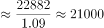元，与B项最接近。

故正确答案为B。

---

### 第 2 题　qid 4004829 · 增长

2019年前三季度，四种收入来源中收入同比增量最高的是：

- **A**. 人均工资性收入　✅
- **B**. 人均经营净收入
- **C**. 人均财产净收入
- **D**. 人均转移净收入

**答案**：A

**官方解析**

根据题干“2019年前三季度······同比增量最高的是”，可判定本题为增长量比较问题。定位文字材料第三段：（2019年）前三季度，全国居民人均工资性收入13020元，增长；人均经营净收入3757元，增长；人均财产净收入1949元，增长；人均转移净收入4157元，增长。全国居民人均工资性收入的现期量和增长率均大于人均转移净收入，由增长量比较口诀“大大则大”可知人均工资性收入同比增量大于人均转移净收入，排除D项。根据公式：增长量，可得人均工资性收入同比增量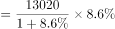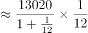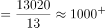元；人均经营净收入同比增量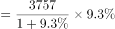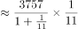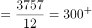元；人均财产净收入同比增量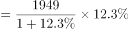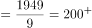元。则四种收入来源中收入同比增量最高的是人均工资性收入。

故正确答案为A。

---

### 第 3 题　qid 4004836 · 平均数

2019年前三季度，城镇居民人均可支配收入平均数约是农村居民人均可支配收入平均数的多少倍？

- **A**. 2.43
- **B**. 2.56
- **C**. 2.75　✅
- **D**. 2.91

**答案**：C

**官方解析**

方法一：根据题干“2019年前三季度······是······的多少倍”，结合材料时间为2019年前三季度，可判定本题为现期倍数问题。定位文字材料第一段：2019年前三季度······城镇居民人均可支配收入31939元······农村居民人均可支配收入11622元。则所求倍数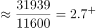，对应C项。

方法二：根据题干“2019年前三季度······是······的多少倍”，结合材料时间为2019年前三季度，可判定本题为现期倍数问题。定位文字材料第二段：（2019年前三季度）城镇居民人均可支配收入中位数29304元，增长，是平均数的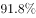；农村居民人均可支配收入中位数10172元，增长，是平均数的。则2019年前三季度城镇居民人均可支配收入平均数元；农村居民人均可支配收入平均数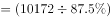元。则所求倍数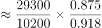，对应C项。

故正确答案为C。

---

### 第 4 题　qid 4004843 · 平均数

2019年前三季度，排名前三的人均消费支出约占总消费支出的比重为：

- **A**. 55%
- **B**. 60%
- **C**. 65%　✅
- **D**. 71%

**答案**：C

**官方解析**

根据题干“2019年前三季度······占······的比重”，结合材料时间为2019年前三季度，可判定本题为现期比重问题。定位材料第四段可知：2019年前三季度，全国居民人均消费支出15464元；定位材料第五段可知：2019年前三季度，排名前三的人均消费支出分别为人均食品烟酒消费支出4310元、人均居住消费支出3607元、人均交通通信消费支出2078元。根据公式：比重，可得2019年前三季度，排名前三的人均消费支出约占总消费支出的比重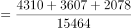，与C项最接近。

故正确答案为C。

---

### 第 5 题　qid 4004851 · 综合

根据以上资料，可以推出的是∶

- **A**. 2018年前三季度，全国居民人均消费支出高达2万元
- **B**. 2019年前三季度，全国居民人均经营净收入占全国居民人均可支配收入的20%以上
- **C**. 2019年前三季度，全国居民人均食品烟酒消费支出的增长量约为247.79元　✅
- **D**. 2019年前三季度，全国居民人均可支配收入比全国居民人均消费支出多7500元以上

**答案**：C

**官方解析**

A项：定位材料第四段，2019年前三季度，全国居民人均消费支出15464元，比上年同期名义增长。根据公式：基期量，可得2018年前三季度，全国居民人均消费支出元，错误；

B项：定位材料第一段，2019年前三季度，全国居民人均可支配收入22882元；定位材料第三段，按收入来源分，前三季度······人均经营净收入3757元。根据公式：比重，可得2019年前三季度，全国居民人均经营净收入占全国居民人均可支配收入的比重，错误；

C项：定位材料第五段，（2019年）前三季度，全国居民人均食品烟酒消费支出4310元，增长。根据公式：增长量，可得2019年前三季度，全国居民人均食品烟酒消费支出的增长量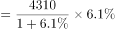元，与选项数字接近，正确；

D项：定位材料第一段，2019年前三季度，全国居民人均可支配收入22882元；定位材料第四段，2019年前三季度，全国居民人均消费支出15464元。则2019年前三季度，全国居民人均可支配收入比全国居民人均消费支出多元元，错误。

故正确答案为C。

---

## 材料 2

        2018年共进口木材11194.4万立方米（原木锯材合计，原木材积）金额210.9亿美元，同比分别增长3.2%和5.6%。数量增幅比上年同期下降了12.9个百分点，金额增幅下降了17.6个百分点。

        2018年进口木材及木制品总金额245.89亿美元（不含纸及纸制品），增长6.3%。出口总金额362.53亿美元，增长2%。2018年进口原木5974.9万立方米，金额101.08亿美元，分别增长7.9%和10.7%；进口锯材3674万立方米，金额101.08亿美元，分别下降1.7%和增长0.4%。

        2018年木家具进口金额9.24亿美元，增长3.6%，木框架坐具进口金额3.32亿美元，增长13.8%。刨花板2016年进口增幅41%，2017年增幅21%，2018年进口69.2万吨，为负增长（-2.7%）。2018年木制品出口金额仅增长2%。2018年木家具出口数量增长5.68%，金额负增长1.6%，木地板出口26.6万吨，3.85亿美元，分别下降24.8%和下降25.9%。胶合板出口1137.8万立方米，55.56亿美元，数量增长5%，金额增长9%，纤维板出口179万吨，38.35亿美元，数量下降14.9%，金额增长6.2%。木制品出口企业普遍效益下降。2018年进口针叶原木4159.7万立方米，金额57.86亿美元，同比分别增长8.8%和12.6%。

        针叶原木从新西兰进口1729.4万立方米，增长23.2%，俄罗斯795.3万立方米，下降10.1%。美国502.8万立方米，增长2.3%，澳大利亚413.4万立方米，下降3.7%。乌拉圭209万立方米，同比增长175.4%，从日本进口针叶原木92.3万立方米，同比增长23%。2018年进口针叶锯材2488万立方米，金额49.91亿美元，分别下降0.7%和增长2.3%。其中来自俄罗斯针叶锯材1567.4万立方米，增长9.7%，占进口针叶锯材63%，从加拿大进口417.4万立方米，大幅下降18.2%，占进口针叶锯材的17%。

### 第 6 题　qid 4004873 · 综合

2017年，针叶原木进口量排第四的是哪个国家？

- **A**. 俄罗斯
- **B**. 美国
- **C**. 澳大利亚　✅
- **D**. 乌拉圭

**答案**：C

**官方解析**

根据题干“2017年······排第四的······”，结合材料时间为2018年，可判定本题为基期比较问题。定位文字材料第四段可得：2018年，针叶原木从新西兰进口1729.4万立方米，增长；俄罗斯795.3万立方米，下降；美国502.8万立方米，增长；澳大利亚413.4万立方米，下降；乌拉圭209万立方米，同比增长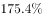；从日本进口针叶原木92.3万立方米，同比增长。根据公式：基期量，可知2017年针叶原木从各国的进口量分别为：新西兰：万立方米；俄罗斯：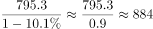万立方米；美国：万立方米；澳大利亚：万立方米；乌拉圭：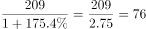万立方米，日本：万立方米。综上可知，2017年针叶原木从各国的进口量排前四的分别为：新西兰、俄罗斯、美国、澳大利亚，故针叶原木进口量排第四的是澳大利亚。

故正确答案为C。

---

### 第 7 题　qid 4004877 · 综合

2017年进口原木约是进口锯材的多少倍？

- **A**. 1.48　✅
- **B**. 1.63
- **C**. 1.74
- **D**. 1.85

**答案**：A

**官方解析**

根据题干“2017年······约是······多少倍”，结合材料时间为2018年，可判定本题为基期倍数问题。定位文字材料第二段可得：2018年进口原木5974.9万立方米（），金额101.08亿美元，分别增长（）和；进口锯材3674万立方米（），金额101.08亿美元，分别下降（）和增长。根据公式：基期倍数，可知所求倍数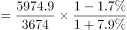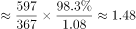。

故正确答案为A。

注：本题默认用进口量计算，若用进口额计算则无正确答案。

---

### 第 8 题　qid 4004885 · 比重

2017年从加拿大进口的针叶锯材占总进口的比重约为：

- **A**. 62.70%
- **B**. 40.25%
- **C**. 34.68%
- **D**. 20.37%　✅

**答案**：D

**官方解析**

根据题干“2017年······占······比重约”，结合材料时间为2018年，可判定本题为基期比重问题。定位文字材料第四段可得：2018年进口针叶锯材2488万立方米，金额49.91亿美元，分别下降（）和增长。从加拿大进口417.4万立方米，大幅下降（），占进口针叶锯材的（）。根据公式：基期比重，可知所求比重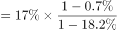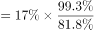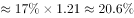，与D项最接近。

故正确答案为D。

---

### 第 9 题　qid 4004893 · 增长

2018年，下列三种产品出口金额增长值从大到小的顺序排列正确的是：

- **A**. 木地板、胶合板、纤维板
- **B**. 胶合板、纤维板、木地板　✅
- **C**. 木地板、纤维板、胶合板
- **D**. 胶合板、木地板、纤维板

**答案**：B

**官方解析**

根据题干“2018年······增长值从大到小的顺序排列······”，可判定本题为增长量比较问题。定位文字材料第三段可得：（2018年）木地板出口26.6万吨，3.85亿美元，分别下降和下降。胶合板出口1137.8万立方米，55.56亿美元，数量增长，金额增长，纤维板出口179万吨，38.35亿美元，数量下降，金额增长。胶合板出口金额（55.56亿美元）纤维板出口金额（38.35亿美元），胶合板出口金额增长率（）纤维板出口金额增长率（）。根据增长量比较口诀，大大则大，胶合板出口金额增长值纤维板出口金额增长值。又由于木地板出口金额的增长率为下降，其金额增长值为负数，排在最后。只有B项符合。

故正确答案为B。

---

### 第 10 题　qid 4004903 · 综合

可以根据上述资料推出的是：

- **A**. 2018年进口木材增长量小于340万立方米
- **B**. 2018年进口原木金额的增长值小于进口锯材金额的增长值
- **C**. 2018年木框架坐具进口金额约占木家具进口金额的35.93%　✅
- **D**. 2018年刨花板的进口数量比2017年多

**答案**：C

**官方解析**

A项：定位文字材料第一段可得：2018年共进口木材11194.4万立方米，同比增长。根据公式：增长量，可知2018年共进口木材增长量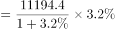万立方米，错误；

B项：定位文字材料第二段可得：2018年进口原木金额101.08亿美元，增长；进口锯材金额101.08亿美元，增长。由于进口原木金额与进口锯材金额相同，而进口原木金额增长率（）进口锯材金额增长率（），可知进口原木金额的增长值大于进口锯材金额的增长值，并非小于，错误；

C项：定位文字材料第三段可得：2018年木家具进口金额9.24亿美元，木框架坐具进口金额3.32亿美元。根据公式：比重，可知所求比重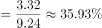，正确；

D项：定位文字材料第三段可得：刨花板2016年进口增幅，2017年增幅，2018年进口69.2万吨，为负增长（）。2018年刨花板进口数量增长率为负，可知2018年刨花板的进口数量比2017年少，错误。

故正确答案为C。

---

## 材料 3

        2019年农民工总量达到29077万人，比上年增加241万人，增长0.8%。其中，本地农民工11652万人，比上年增加82万人，增长0.7%；外出农民工17425万人，比上年增加159万人，增长0.9%。在外出农民工中，年末在城镇居住的进城农民工13500万人，与上年基本持平。

        在外出农民工中，在省内流动的农民工9917万人，比上年增加245万人，增长2.5%；跨省流动农民工7508万人，比上年减少86万人，下降1.1%。省内流动农民工占外出农民工的56.9%，所占比重比上年提高0.9个百分点。分地区看，除东北地区省内流动农民工占外出农民工的比重比上年下降3.4个百分点以外，东部、中部和西部地区省内流动农民工占比分别比上年提高0.1、1.4和1.2个百分点。

### 第 11 题　qid 4004923 · 综合

2018年外出农民工中，在省内流动农民工大约是跨省流动农民工的多少倍？

- **A**. 1.34
- **B**. 1.30
- **C**. 1.27　✅
- **D**. 1.37

**答案**：C

**官方解析**

根据题干“2018年······是······的多少倍”，结合材料时间为2019年，可判定本题为基期倍数问题。定位文字材料第二段可得：在外出农民工中，在省内流动的农民工9917万人，比上年增加245万人；跨省流动农民工7508万人，比上年减少86万人。故2018年外出农民工中，在省内流动农民工大约是跨省流动农民工的倍。

故正确答案为C。

---

### 第 12 题　qid 4004930 · 增长

2015-2019年期间，共出现几次农民工规模年增长人数高于400万人的情况？

- **A**. 0
- **B**. 1
- **C**. 2　✅
- **D**. 3

**答案**：C

**官方解析**

根据题干“······年增长人数高于400万人的情况”，可判定本题为增长量计算问题。定位图形材料可得：2015年我国农民工规模为27747万人，同比增长；2016-2019年我国农民工规模分别为28171万人、28652万人、28836万人、29077万人。根据公式：增长量，可知2015年农民工规模增长了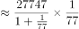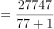万人。根据公式：增长量，可知2016年农民工规模增长了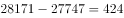万人，2017年农民工规模增长了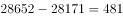万人，2018年农民工规模增长了万人，2019年农民工规模增长了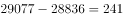万人。故农民工规模年增长人数高于400万人的只有2016年和2017年，共2次。

故正确答案为C。

---

### 第 13 题　qid 4004938 · 综合

2018年，中部地区外出农民工中，省内流动农民工约占∶

- **A**. 40.7%
- **B**. 39.4%　✅
- **C**. 39.6%
- **D**. 37.4%

**答案**：B

**官方解析**

根据题干“2018年······约占”，结合材料时间为2019年，且选项为百分数，可判定本题为基期比重问题。定位文字材料第二段可得：中部地区省内流动农民工占比比上年提高1.4个百分点。定位表格材料可得：2019年，中部地区省内流动农民工占比为。故2018年中部地区外出农民工中，省内流动农民工约占。

故正确答案为B。

---

### 第 14 题　qid 4004944 · 比重

2019年，中部地区跨省流动外出农民工数量占跨省流动外出农民工总量的比重比西部地区高多少？

- **A**. 14.80%　✅
- **B**. 15.80%
- **C**. 14.59%
- **D**. 15.10%

**答案**：A

**官方解析**

根据题干“2019年······比重比······高多少”，可判定本题为现期比重问题。定位表格材料可得：2019年，中部地区跨省流动外出农民工为3802万人，西部地区跨省流动外出农民工为2691万人，跨省流动外出农民工总量为7508万人。根据公式：比重，可知2019年中部地区跨省流动外出农民工数量占跨省流动外出农民工总量的比重比西部地区高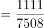。

故正确答案为A。

备注：比重一般只讨论两者的差值，不讨论两者变化的相对比值。本题考查的就是比重差，选项严谨表示应为百分点形式。

---

### 第 15 题　qid 4004950 · 综合

下列选项不能够从上述材料中推出的是：

- **A**. 2018年，东北地区省内流动农民工数量约占外出农民工总量的73.6%
- **B**. 2019年，本地农民工比外出农民工少5773万人
- **C**. 2019年，西部地区外出农民工工人数量比东部地区少763万人　✅
- **D**. 2018年，跨省流动农民工数量约占外出农民工总量的44%

**答案**：C

**官方解析**

A项：定位文字材料第二段可得，2019年东北地区省内流动农民工占外出农民工的比重比上年下降3.4个百分点；定位表格材料可得，2019年东北地区省内流动农民工占外出农民工的比重为。故2018年东北地区省内流动农民工数量约占外出农民工总量的，正确；

B项：定位文字材料第一段可得，2019年本地农民工11652万人，外出农民工17425万人。故2019年本地农民工比外出农民工少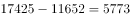万人，正确；

C项：定位表格材料可得，2019年西部地区外出农民工为5555万人，东部地区外出农民工为4792万人。故2019年西部地区外出农民工工人数量比东部地区多万人，并非少763万人，错误；

D项：定位文字材料第一段可得，2019年外出农民工17425万人，比上年增加159万人；定位文字材料第二段可得，2019年跨省流动农民工7508万人，比上年减少86万人。根据公式：比重，可知2018年跨省流动农民工数量约占外出农民工总量的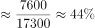，正确。

本题为选非题，故正确答案为C。

---

## 材料 4

        2018年H市粮食种植面积235.7千公顷，油料种植面积3.0千公顷，棉花种植面积0.02千公顷。在粮食种植面积中，玉米种植面积199.3千公顷，小麦种植面积4.7千公顷。全年粮食产量150.2万吨。其中，夏粮2.4万吨，秋粮147.9万吨。

        2018年H市完成邮电业务总量108.2亿元。其中，邮政业务总量40.8亿元，同比增长26.5%；电信业务总量67.4亿元，同比增长56.7%。年末移动电话用户达到341万户，其中，3G移动电话用户达到25.7万户，4G移动电话用户达到241.4万户。全市互联网接入用户89.9万户，其中，新增互联网用户23.8万户。

        2018年全年全市保费收入65.4亿元，增长0.7%。其中，寿险业务保费收入39.5亿元，下降5.1%；健康和意外险业务保费收入9.1亿元，增长21.6%，增速同比增加5个百分点；财产险业务保费收入3.4亿元，增长25.2%；车险业务保费收入13.3亿元，增长1.8%。全年支付各类赔款及给付21.2亿元，增长5.3%。其中，寿险业务保费赔付11.0亿元，增长1.4%；健康和意外险业务保费赔付3.0亿元，增长68.7%；财产险业务保费赔付0.9亿元，增长5.7%；车险业务保费赔付6.4亿元，下降5.0%。

### 第 16 题　qid 4004822 · 平均数

2018年H市平均每公顷的粮食产量约是：

- **A**. 5.34吨
- **B**. 5.87吨
- **C**. 6.12吨
- **D**. 6.37吨　✅

**答案**：D

**官方解析**

根据题干“2018年H市平均每公顷的粮食产量约是”，结合材料时间也是2018年，可判定本题为现期平均数计算问题。定位文字材料第一段可得：2018年H市粮食种植面积235.7千公顷······全年粮食产量150.2万吨。则2018年H市粮食的平均产量为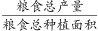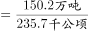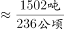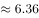吨/公顷，因此2018年H市平均每公顷的粮食产量约是6.36公顷，与D项最接近。

故正确答案为D。

---

### 第 17 题　qid 4004826 · 增长

2018年H市邮电业务总量同比增速在下列哪一个范围内？

- **A**. 23%—41%
- **B**. 41%—57%　✅
- **C**. 57%—71%
- **D**. 高于71%

**答案**：B

**官方解析**

根据题干“2018年H市邮电业务总量同比增速”，结合材料给出邮政业务总量及增速，电信业务总量及增速，且邮政业务总量电信业务总量邮电业务总量，可判定本题为混合增长率问题。定位文字材料第二段可得：邮政业务总量40.8亿元，同比增长；电信业务总量67.4亿元，同比增长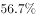。根据混合增长率口诀“混合居中不正中，偏向基期较大的”可知，邮电业务总量同比增速在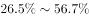之间，且更接近于电信业务总量增速，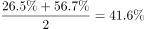，则邮电业务总量同比增速在之间，对应B项。

故正确答案为B。

---

### 第 18 题　qid 4004828 · 增长

2014年—2018年中年末移动电话用户数量同比增速大于3%的年份有几个？

- **A**. 1个
- **B**. 2个　✅
- **C**. 3个
- **D**. 4个

**答案**：B

**官方解析**

根据题干“2014年—2018年中······同比增速大于的年份有几个”，可判定本题为一般增长率问题。定位柱状图可得2014年—2018年各年年末移动电话用户数量，根据增长率计算各年增长率即可。2015年为负增长，增速小于；2016年：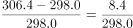；2017年：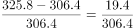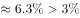；2018年：。同比增速大于的年份有2017年和2018年，共2个。

故正确答案为B。

注：本题题干表述有一定歧义，要求计算2014年—2018年每年的同比增速，但材料并未给出2013年相关数据，故2014年的同比增速无法计算。

---

### 第 19 题　qid 4004834 · 综合

2016年全年全市健康和意外险业务保费收入约为多少亿元？

- **A**. 7.5
- **B**. 6.9
- **C**. 6.4　✅
- **D**. 6.1

**答案**：C

**官方解析**

根据题干“2016年全年······约为多少亿元”，结合材料时间为2018年，与2016年间隔了2017年，可判定本题为间隔基期问题。定位文字材料第三段可得：2018年全年全市······健康和意外险业务保费收入9.1亿元，增长，增速同比增加5个百分点。代入间隔增长率计算公式：，相对于2016年，2018年健康和意外险业务保费收入增长了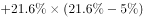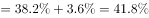，则2016年全年全市健康和意外险业务保费收入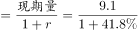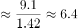亿元。

故正确答案为C。

---

### 第 20 题　qid 4004839 · 综合

下列不能从上述资料中推出的是：

- **A**. 2018年秋粮的产量约是夏粮的62倍
- **B**. 2017年邮政业务总量约占电信业务总量的75%
- **C**. 2017年寿险业务保费赔付金额约0.85亿元　✅
- **D**. 2018年全年保费收入同比增速高于10%的业务类型有2个

**答案**：C

**官方解析**

A项：定位文字材料第一段可得：2018年······夏粮2.4万吨，秋粮147.9万吨。则所求倍数为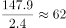倍，正确；

B项：定位文字材料第二段可得：2018年H市······邮政业务总量40.8亿元（），同比增长（）；电信业务总量67.4亿元（），同比增长（）。所求基期比重为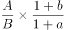，正确；

C项：定位文字材料第三段可得：2018年全年全市······寿险业务保费赔付11.0亿元，增长。则2017年寿险业务保费赔付金额为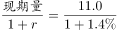亿元，远高于0.85亿元，错误；

D项：定位文字材料第三段可得，全年保费收入同比增速高于的业务类型有健康和意外险（）、财产险（）2个，正确。

本题为选非题，故正确答案为C。

备注：B项不严谨。两者属于并列关系，不应考查比重概念。

---
