# 2021年江苏省公务员录用考试《行测》题（B类）（网友回忆版）

> 资料分析 · 20 题 · 江苏 2021

## 材料 1

        党的十八大以来，我国居民收入水平持续较快增长，消费水平稳步提高，消费结构优化升级，生活质量明显提升，人民生活正阔步迈向全面小康。

        2019年，全国居民人均可支配收入30733元，比2000年增长4.4倍。全国居民人均消费支出21559元，比2012年增长，年均增长。其中，城镇居民人均消费支出28063元，比2012年增长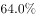；农村居民人均消费支出13328元，比2012年增长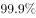。

        2019年全国居民恩格尔系数（人均食品支出占人均消费支出的比重）为，比2000年下降14.0个百分点。其中，城镇居民恩格尔系数为，农村居民恩格尔系数为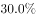，分别比2000年下降11.0和18.3个百分点。

        2019年，全国居民平均每百户拥有彩色电视机120.6台、洗衣机96.0台、电冰箱100.9台、空调115.6台、汽车35.3辆。城镇居民人均住房建筑面积为39.8平方米，比2002年增长；农村居民人均住房建筑面积为48.9平方米，比2000年增长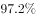。全国居民人均交通通信支出2862元，比2000年年均增长，占人均消费支出的比重较2000年提高6.1个百分点。全国居民人均医疗保健支出1902元，比2000年年均增长，占人均消费支出的比重较2000年提高2.9个百分点。

### 第 1 题　qid 2742010 · 增长

以2012年为基期，2019年我国农村居民人均消费支出的增幅比城镇居民：

- **A**. 高25.2个百分点
- **B**. 高35.9个百分点　✅
- **C**. 高41.3个百分点
- **D**. 高54.5个百分点

**答案**：B

**官方解析**

定位文字材料第二段可得，2019年“城镇居民人均消费支出28063元，比2012年增长；农村居民人均消费支出13328元，比2012年增长”，则以2012年为基期，2019年我国农村居民人均消费支出的增幅比城镇居民高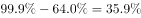，即高35.9个百分点。

故正确答案为B。

---

### 第 2 题　qid 2742015 · 平均数

下列饼图表示2000年全国居民人均消费支出结构（食品消费支出、交通通信支出、医疗保健支出、其他支出）的是：

- **A**. 
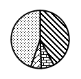
　✅
- **B**. 

- **C**. 
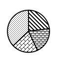

- **D**. 

**答案**：A

**官方解析**

根据题干“2000年全国居民人均消费支出结构”，结合材料时间为2019年，选项为饼状图，可判定本题为基期比重问题。定位文字材料第三段可得：2019年全国居民恩格尔系数（人均食品支出占人均消费支出的比重）为，比2000年下降14.0个百分点，则2000年食品消费支出占人均消费支出的比重，该占比介于和之间，通过观察选项，可排除B、C、D三项。

故正确答案为A。

备注：2000年居民交通通信支出占人均消费支出的比重：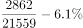；

2000年居民医疗保健支出占人均消费支出的比重：；

2000年其他支出占人均消费支出的比重：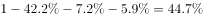。

在考场上建议直接用排除法，无需计算各部分占比。

---

### 第 3 题　qid 2742019 · 增长

按2001-2019年的年均增速估算，2021年全国居民人均医疗保健支出介于：

- **A**. 2320元和2370元之间
- **B**. 2370元和2420元之间
- **C**. 2420元和2470元之间　✅
- **D**. 2470元和2520元之间

**答案**：C

**官方解析**

根据题干“按2001-2019年的年均增速估算，2021年······”，可判定本题为现期计算问题。定位文字材料第四段可得：2019年，全国居民人均医疗保健支出1902元，比2000年年均增长，根据公式：现期，则2021年全国居民人均医疗保健支出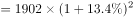元，在C项范围内。

故正确答案为C。

---

### 第 4 题　qid 2742026 · 比重

2019年城镇居民人口占总人口的比重约为：

- **A**. 

- **B**. 

- **C**. 
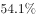

- **D**. 

　✅

**答案**：D

**官方解析**

根据题干“2019年······占······的比重约为”，结合材料时间为2019年，可判定本题为现期比重问题。定位文字材料第二段可得：2019年，全国居民人均消费支出21559元，其中，城镇居民人均消费支出28063元，农村居民人均消费支出13328元。人均消费支出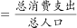，故可利用混合比例解题，根据线段法，距离与量成反比，

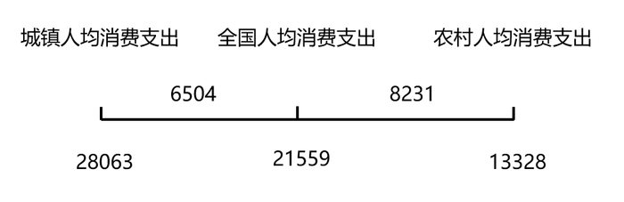

即城镇人口：农村人口，根据公式：比重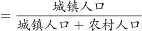，与D项最接近。

故正确答案为D。

---

### 第 5 题　qid 2742031 · 综合

能够从上述资料中推出的是：

- **A**. 2018年全国居民人均消费支出超过21000元
- **B**. 2018年全国城镇居民恩格尔系数降幅大于农村居民
- **C**. 2019年全国居民人均可支配收入比2000年增加24000元以上　✅
- **D**. 2019年全国农村居民人均住房建筑面积比城镇居民多10平方米以上

**答案**：C

**官方解析**

A项：定位文字材料第二段可得，2019年，全国居民人均消费支出21559元，比2012年增长，年均增长。材料并未给出2019年全国居民人均消费支出的同比增长率或增长量，无法计算出2018年全国居民人均消费支出，错误；

B项：定位文字材料第三段可得，2019年与2000年恩格尔系数的变化关系，材料并未给出2019年与2018年恩格尔系数的变化关系，故数据不足，无法推出，错误；

C项：定位文字材料第二段可得，2019年，全国居民人均可支配收入30733元，比2000年增长4.4倍。根据公式：增长量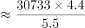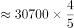元元，正确；

D项：定位文字材料第四段可得，2019年，城镇居民人均住房建筑面积为39.8平方米，农村居民人均住房建筑面积为48.9平方米。则2019年全国农村居民人均住房建筑面积比城镇居民多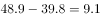平方米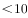平方米，错误。

故正确答案为C。

---

## 材料 2

        2019年江苏省金融信贷规模扩大，保险行业发展较快。全年保费收入3750.2亿元，比上年增长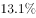。其中，财产险收入940.9亿元，增长；寿险收入2215.3亿元，增长；健康险收入508.8亿元，增长；意外伤害险收入85.2亿元，增长。全年保险赔付998.6亿元，比上年增长。其中，财产险赔付534.5亿元，增长；寿险赔付294.3亿元，下降，健康险赔付144.8亿元，增长；意外伤害险赔付25.0亿元，增长。年末金融机构人民币存贷款情况见下表。

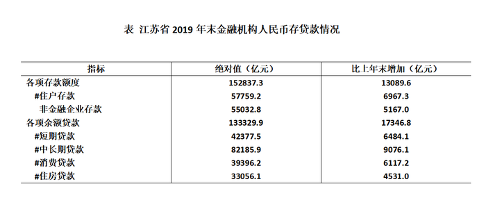

### 第 6 题　qid 2742047 · 增长

2019年保费收入占江苏省总保费收入比重同比增加的险种是：

- **A**. 寿险
- **B**. 财产险
- **C**. 健康险　✅
- **D**. 意外伤害

**答案**：C

**官方解析**

根据题干“······占······比重同比增加的险种是”，可判定本题为两期比重比较问题。根据两期比重比较结论：当部分增长率（）整体增长率（）时，比重上升。定位文字材料可得：（2019年江苏省）全年保费收入比上年增长；其中，财产险收入增长；寿险收入增长；健康险收入增长；意外伤害险收入增长。其中只有健康险的同比增速（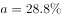）江苏省总保费收入的同比增速（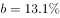），即比重同比增加。

故正确答案为C。

---

### 第 7 题　qid 2742051 · 增长

2019年末江苏省金融机构各项存款额度比上年末增长：

- **A**. 

- **B**. 

　✅
- **C**. 

- **D**. 

**答案**：B

**官方解析**

根据题干“2019年末······比上年末增长”，结合选项为百分数，可判定本题为一般增长率问题。定位表格材料可得：2019年末江苏省金融机构各项存款额度为152837.3亿元，比上年末增加13089.6亿元。根据公式：增长率，则2019年末江苏省金融机构各项存款额度比上年末增长，与B项最接近。

故正确答案为B。

---

### 第 8 题　qid 2742054 · 增长

下列人民币贷款种类中，2019年末江苏省金融机构贷款余额同比增速最慢的是：

- **A**. 消费贷款
- **B**. 住房贷款
- **C**. 短期贷款
- **D**. 中长期贷款　✅

**答案**：D

**官方解析**

根据题干“······同比增速最慢的是”，可判定本题为一般增长率比较问题。定位表格材料可得：2019年末江苏省金融机构消费贷款39396.2亿元，比上年末增加6117.2亿元；住房贷款33056.1亿元，比上年末增加4531.0亿元；短期贷款42377.5亿元，比上年末增加6484.1亿元；中长期贷款82185.9亿元，比上年末增加9076.1亿元。根据公式：增长率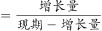，则2019年末江苏省金融机构各种类人民币贷款的同比增速为：

A项：消费贷款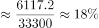；

B项：住房贷款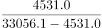；

C项：短期贷款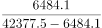；

D项：中长期贷款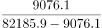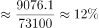。

则2019年末江苏省金融机构贷款余额同比增速最慢的是中长期贷款。

故正确答案为D。

---

### 第 9 题　qid 2742055 · 综合

2018年江苏省财产险收入与赔付之差为：

- **A**. 346.0亿元　✅
- **B**. 364.0亿元
- **C**. 396.6亿元
- **D**. 406.4亿元

**答案**：A

**官方解析**

根据题干“2018年······与······之差为”，结合材料已知2019年相关数据，可判定本题为基期和差问题。定位文字材料可知：（2019年）全年保费收入3750.2亿元，比上年增长。其中，财产险收入940.9亿元，增长；······全年保险赔付998.6亿元，比上年增长。其中，财产险赔付534.5亿元，增长。根据公式：基期量，2018年江苏省财产险收入与赔付之差为：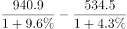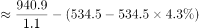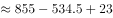亿元，与A项最为接近。

故正确答案为A。

---

### 第 10 题　qid 2742056 · 综合

能够从上述资料中推出的是：

- **A**. 2018年江苏省消费贷款增速大于住房贷款
- **B**. 2019年江苏省收入同比增幅最大的险种是寿险
- **C**. 2019年江苏省保险赔付总额不到保费总收入的四分之一
- **D**. 2018年末江苏省短期贷款余额不到中长期贷款余额的一半　✅

**答案**：D

**官方解析**

A项：定位表格材料，已知2019年的绝对值和比上年末增加的数据，可推出2018年的量，但无法推出2017年的数据，因此无法推出2018年对应增速，错误。

B项：定位文字材料可知：（2019年）全年保费收入3750.2亿元，比上年增长。其中，财产险收入940.9亿元，增长；寿险收入2215.3亿元，增长；健康险收入508.8亿元，增长；意外伤害险收入85.2亿元，增长。比较可知，2019年收入同比增幅最大的险种是健康险，错误。

C项：定位文字材料可知：（2019）全年保费收入3750.2亿元，比上年增长。······全年保险赔付998.6亿元，比上年增长。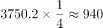亿元，998.6亿元940亿元，即保险赔付总额超过保费总收入的四分之一，错误。

D项：定位表格材料可知：2019年末江苏省短期贷款余额为42377.5亿元，比上年末增加6484.1亿元；2019年末江苏省中长期贷款余额为82185.9亿元，比上年末增加9076.1亿元。2018年末江苏省短期贷款余额为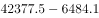亿元，中长期贷款余额为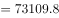亿元，，即2018年末江苏省短期贷款余额不到中长期贷款余额的一半，正确。

故正确答案为D。

---

## 材料 3

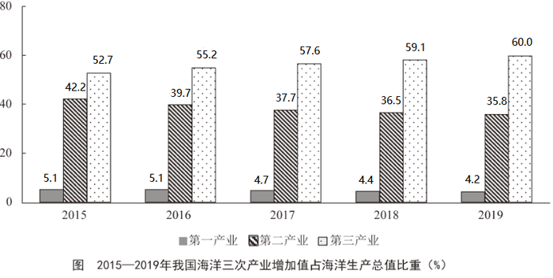

### 第 11 题　qid 2742212 · 增长

2019年我国海洋第一产业增加值为：

- **A**. 3880亿元
- **B**. 3755亿元　✅
- **C**. 3675亿元
- **D**. 3595亿元

**答案**：B

**官方解析**

根据题干“2019年我国海洋第一产业增加值为”，结合材料给出的2019年海洋生产总值以及海洋第一产业增加值占海洋生产总值的比重，可判定本题为现期比重问题。定位表格材料可得：2019年海洋生产总值89415亿元；定位图形材料可得：2019年海洋第一产业增加值占比为。则2019年我国海洋第一产业增加值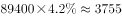亿元。

故正确答案为B。

---

### 第 12 题　qid 2742214 · 增长

2019年我国海洋相关产业产值增速：

- **A**. 
低于

- **B**. 
介于和之间
　✅
- **C**. 
高于

- **D**. 
介于和之间

**答案**：B

**官方解析**

根据题干“2019年我国海洋相关产业产值增速”，结合材料给出2019年海洋生产总值、海洋产业的增速，可判定本题为混合增长率问题。定位表格材料可得：2019年海洋生产总值增速为；海洋产业生产总值57315亿元，增速为；海洋相关产业生产总值32100亿元。设所求增速为，根据线段法口诀“距离与量成反比（一般用现期量代替基期量估算）”，可得：，化简为：，解得，在B项范围内。

故正确答案为B。

---

### 第 13 题　qid 2742215 · 综合

在我国主要海洋产业中，2019年产值年增量最大的是：

- **A**. 滨海旅游业　✅
- **B**. 海洋船舶工业
- **C**. 海洋油气业
- **D**. 海洋工程建筑业

**答案**：A

**官方解析**

根据题干“······2019年产值年增量最大的是”，可判定本题为增长量比较问题。定位表格，根据公式：增长量，可得选项各产业的增长量分别为：

A项：滨海旅游业：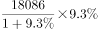；B项：海洋船舶工业：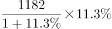；

C项：海洋油气业：；D项：海洋工程建筑业：。

A项与C、D两项对比，A项现期量大、增长率大，根据增长量比较“大大则大”，则A项增长量大于C、D两项，排除C、D两项。

A项：滨海旅游业：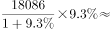；

B项：海洋船舶工业：；

可得A项增长量大于B项，A项增长量最大。

故正确答案为A。

---

### 第 14 题　qid 2742217 · 增长

2019年我国海洋第三产业增加值年增长率为：

- **A**. 

- **B**. 

- **C**. 

　✅
- **D**. 

**答案**：C

**官方解析**

根据题干“2019年······年增长率为”，可判定本题为一般增长率问题。定位表格材料，2019年我国海洋生产总值为89415亿元，同比增长，则2018年海洋生产总值。定位柱状图可得，2019年和2018年我国海洋第三产业增加值占海洋生产总值的比重分别为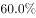和。

方法一：根据公式“部分量”，则2019年和2018年我国海洋第三产业增加值分别为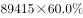、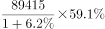。根据公式“增长率”，则2019年我国海洋第三产业增加值同比增长：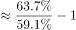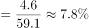。

方法二：根据公式“基期比重”，其中基期比重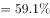，现期比重，，代入可得：，则：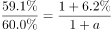，解得。

故正确答案为C。

---

### 第 15 题　qid 2742218 · 综合

能够从上述资料中推出的是：

- **A**. 
2018年，我国海洋科研教育管理服务业产值超过20000亿元

- **B**. 
在我国主要海洋产业中，2018年产值占比最大的是海洋渔业

- **C**. 
在我国主要海洋产业中，2019年产值增速高于的产业有3个
　✅
- **D**. 
2016—2019年，我国海洋第二产业增加值占海洋生产总值的比重有升有降

**答案**：C

**官方解析**

A项：定位表格材料，根据公式“基期量”，则2018年我国海洋科研教育管理服务业产值亿元，错误；

B项：定位表格材料，根据公式“基期量”，在我国主要海洋产业中，2019年滨海旅游业产值（18086亿元）远大于其他产业，（）部分差距不大，故2018年滨海旅游业产值最大。因我国主要海洋产业总产值一定，如果部分量大，占比则大，故2018年产值占比最大的是滨海旅游业，错误；

C项：定位表格材料，在我国主要海洋产业中，产值增速高于的产业有海洋生物医药业（）、海洋船舶工业（）、滨海旅游业（），共计3个，正确；

D项：定位图形材料，2016—2019年，我国海洋第二产业增加值占海洋生产总值的比重逐年降低，并非有升有降，错误；

故正确答案为C。

---

## 材料 4

        2019年末，我国80后、90后、00后人数分别为2.21亿人、2.08亿人、1.63亿人。

### 第 16 题　qid 2742201 · 综合

2019年末我国10后人数约为：

- **A**. 1.52亿人
- **B**. 1.63亿人　✅
- **C**. 1.88亿人
- **D**. 2.02亿人

**答案**：B

**官方解析**

根据题干“2019年末我国10后人数为······”，可判定本题为简单加减计算问题。2019年末我国10后人数即2010-2019年出生的人数，定位统计图材料可得，2010-2019年出生的人数为：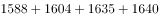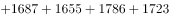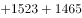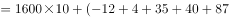万人亿人。

故正确答案为B。

---

### 第 17 题　qid 2742202 · 综合

2010-2019年，我国人口出生率的最小值与最大值相差：

- **A**. 1.53个千分点
- **B**. 2.47个千分点　✅
- **C**. 2.96个千分点
- **D**. 3.68个千分点

**答案**：B

**官方解析**

根据题干“2010-2019年，我国人口出生率的最小值与最大值相差”，可判定本题为简单加减计算问题。定位统计图材料可得，人口出生率最大的年份为2016年，出生率为，出生率最小的年份为2019年，出生率为，其差值为，即2.47个千分点。

故正确答案为B。

---

### 第 18 题　qid 2742204 · 增长

2011-2019年，我国人口出生率同比增加的年份数有：

- **A**. 4个　✅
- **B**. 5个
- **C**. 6个
- **D**. 7个

**答案**：A

**官方解析**

定位统计图材料可得：2010-2019年，我国人口出生率分别为、、、、、、、、、。人口出生率高于上年的有2011年、2012年、2014年和2016年，共4个。

故正确答案为A。

---

### 第 19 题　qid 2742205 · 增长

2011-2019年，我国出生人口增长率最高的年份是：

- **A**. 2012年
- **B**. 2014年
- **C**. 2016年　✅
- **D**. 2018年

**答案**：C

**官方解析**

根据题干“2011-2019年，我国出生人口增长率最高的年份是”，可判定本题为一般增长率问题。定位统计图材料可知，2010-2019年每年出生人口的数据，根据公式：增长率，可知选项各年份的增长率如下：

2012年：；

2014年：；

2016年：；

2018年：。

则我国出生人口增长率最高的年份是2016年。

故正确答案为C。

---

### 第 20 题　qid 2742206 · 综合

能够从上述资料中推出的是：

- **A**. 
2011至2019年，我国出生人口的年均增长率为正

- **B**. 
2011至2019年，我国出生人口和出生率变化方向一致

- **C**. 
2019年末，我国1980年以后出生人口占总人口的比重超过

- **D**. 
2011至2019年，我国出生人口有四年连续上升和三年连续下降
　✅

**答案**：D

**官方解析**

A项：定位统计图材料可得，2019年和2010年的出生人口分别为1465万人和1588万人，根据公式：增长量，故年均增长率，错误；

B项：定位统计图材料可知，2013年出生人口（1640万人）2012年（1635万人），出生人口上升，但2013年出生率（）2012年（），出生率下降，故2013年我国出生人口和出生率变化方向不一致，错误；

C项：定位文字材料和统计图材料可得，2019年末，我国80后、90后、00后人数分别为2.21亿人、2.08亿人、1.63亿人，由本篇资料第1题可知，10后出生人口为1.63亿人；2019年出生人口和出生率分别为1465万人和，根据比重公式，所求比重，错误；

D项：定位统计图材料可知，2011-2014年这四年，出生人口连续上升，2017-2019年这三年，出生人口连续下降，正确。

故正确答案为D。

---
