# 2021年江苏省公务员录用考试《行测》题（C类）（网友回忆版）

> 资料分析 · 20 题 · 江苏 2021

## 材料 1

        2019年末，我国80后、90后、00后人数分别为2.21亿人、2.08亿人、1.63亿人。

### 第 1 题　qid 2742201 · 综合

2019年末我国10后人数约为：

- **A**. 1.52亿人
- **B**. 1.63亿人　✅
- **C**. 1.88亿人
- **D**. 2.02亿人

**答案**：B

**官方解析**

根据题干“2019年末我国10后人数为······”，可判定本题为简单加减计算问题。2019年末我国10后人数即2010-2019年出生的人数，定位统计图材料可得，2010-2019年出生的人数为：万人亿人。

故正确答案为B。

---

### 第 2 题　qid 2742202 · 综合

2010-2019年，我国人口出生率的最小值与最大值相差：

- **A**. 1.53个千分点
- **B**. 2.47个千分点　✅
- **C**. 2.96个千分点
- **D**. 3.68个千分点

**答案**：B

**官方解析**

根据题干“2010-2019年，我国人口出生率的最小值与最大值相差”，可判定本题为简单加减计算问题。定位统计图材料可得，人口出生率最大的年份为2016年，出生率为，出生率最小的年份为2019年，出生率为，其差值为，即2.47个千分点。

故正确答案为B。

---

### 第 3 题　qid 2742204 · 增长

2011-2019年，我国人口出生率同比增加的年份数有：

- **A**. 4个　✅
- **B**. 5个
- **C**. 6个
- **D**. 7个

**答案**：A

**官方解析**

定位统计图材料可得：2010-2019年，我国人口出生率分别为、、、、、、、、、。人口出生率高于上年的有2011年、2012年、2014年和2016年，共4个。

故正确答案为A。

---

### 第 4 题　qid 2742205 · 增长

2011-2019年，我国出生人口增长率最高的年份是：

- **A**. 2012年
- **B**. 2014年
- **C**. 2016年　✅
- **D**. 2018年

**答案**：C

**官方解析**

根据题干“2011-2019年，我国出生人口增长率最高的年份是”，可判定本题为一般增长率问题。定位统计图材料可知，2010-2019年每年出生人口的数据，根据公式：增长率，可知选项各年份的增长率如下：

2012年：；

2014年：；

2016年：；

2018年：。

则我国出生人口增长率最高的年份是2016年。

故正确答案为C。

---

### 第 5 题　qid 2742206 · 综合

能够从上述资料中推出的是：

- **A**. 
2011至2019年，我国出生人口的年均增长率为正

- **B**. 
2011至2019年，我国出生人口和出生率变化方向一致

- **C**. 
2019年末，我国1980年以后出生人口占总人口的比重超过

- **D**. 
2011至2019年，我国出生人口有四年连续上升和三年连续下降
　✅

**答案**：D

**官方解析**

A项：定位统计图材料可得，2019年和2010年的出生人口分别为1465万人和1588万人，根据公式：增长量，故年均增长率，错误；

B项：定位统计图材料可知，2013年出生人口（1640万人）2012年（1635万人），出生人口上升，但2013年出生率（）2012年（），出生率下降，故2013年我国出生人口和出生率变化方向不一致，错误；

C项：定位文字材料和统计图材料可得，2019年末，我国80后、90后、00后人数分别为2.21亿人、2.08亿人、1.63亿人，由本篇资料第1题可知，10后出生人口为1.63亿人；2019年出生人口和出生率分别为1465万人和，根据比重公式，所求比重，错误；

D项：定位统计图材料可知，2011-2014年这四年，出生人口连续上升，2017-2019年这三年，出生人口连续下降，正确。

故正确答案为D。

---

## 材料 2

        国家统计局采用定基指数方法，以2014年为100，根据第四次全国经济普查数据修订结果以及部分指标最新数据，将5个分类指标的权重均设定为0.2，对2015-2019年我国经济发展新动能总指数进行测算，结果见下表。

注：分类指数对总指数增长的贡献率计算公式为

### 第 6 题　qid 2741956 · 增长

2019年我国网络经济指数对总指数增长的贡献率为：

- **A**. 

- **B**. 

- **C**. 

- **D**. 
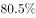
　✅

**答案**：D

**官方解析**

根据题干“2019年······对总指数增长的贡献率······”，可判定本题为现期比重问题。定位表格材料可知：“2019年网络经济报告期指数856.5，报告期总指数332.0；2018年网络经济报告期指数603.0，报告期总指数269.0”。结合文字材料“5个分类指数的权重均设定为0.2”可得，网络经济指数的权重为0.2。将数据代入注释中公式：贡献率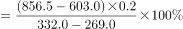。

故正确答案为D。

---

### 第 7 题　qid 2741959 · 增长

2015-2019年我国经济发展新动能总指数值比上年增加最多的年份是：

- **A**. 2016年
- **B**. 2017年
- **C**. 2018年　✅
- **D**. 2019年

**答案**：C

**官方解析**

根据题干“2015-2019年······比上年增加最多······”，可判定本题为增长量比较问题。定位表格材料可得：“2015-2019年我国经济发展新动能总指数分别为124.8、159.1、204.1、269.0、332.0。”根据公式增长量可得：

2016年增量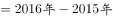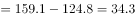；

2017年增量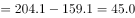；

2018年增量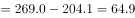；

2019年增量；

比较可知，2018年经济发展新动能总指数增加最多。

故正确答案为C。

---

### 第 8 题　qid 2741961 · 增长

在5个分类指数中，2019年对总指数增长的贡献率大于2018年的有：

- **A**. 1个
- **B**. 2个　✅
- **C**. 3个
- **D**. 4个

**答案**：B

**官方解析**

根据题干“······2019年对总指数增长的贡献率大于2018年的有”，结合备注分类指数对总指数增长的贡献率计算公式，可判定本题为比值比较问题。定位文字材料可得各分类指标的权重均为0.2，定位表格材料可得每年各类分类指数和总指数的具体值，根据贡献率，因为两年各分类指数的权重没变，故只需比较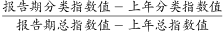即可。

经济活力：2019年：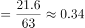，2018年：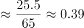，；

创新驱动：2019年：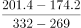，2018年：，；

网络经济：2019年：，2018年：，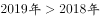；

转型升级：2019年：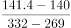，2018年：，；

知识能力：2019年：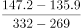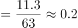，2018年：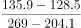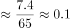，。

因此，2019年对总指数增长的贡献率大于2018年的共有网络经济和知识能力2个。

故正确答案为B。

---

### 第 9 题　qid 2741963 · 综合

2016-2018年指数值累计增量最多和最少的分类指数分别是：

- **A**. 网络经济指数、知识能力指数　✅
- **B**. 经济活力指数、转型升级指数
- **C**. 网络经济指数、转型升级指数
- **D**. 经济活力指数、知识能力指数

**答案**：A

**官方解析**

根据题干“2016-2018年······累计增量最多和最少······”，可判定本题为增长量比较问题。定位表格材料，可知2015-2018年各种指数的具体值。根据增长量，则累计增长量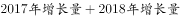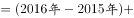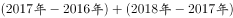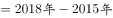。代入数据可得：

经济活力的累计增量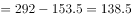；

网络经济的累计增量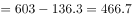；

转型升级的累计增量；

知识能力的累计增量。

比较发现，网络经济指数累计增长最多；知识能力指数累计增长最少。

故正确答案为A。

---

### 第 10 题　qid 2741965 · 综合

能够从上述资料中推出的是：

- **A**. 
2015-2019年我国创新驱动指数平均增量为40.3

- **B**. 
2016年我国知识能力指数对总指数增长的贡献率大于2015年

- **C**. 
2015-2019年我国经济发展新动能总指数年均增速超过
　✅
- **D**. 
2015-2019年我国转型升级指数每年的增速在5个分类指数中都是最慢的

**答案**：C

**官方解析**

A项：定位表格材料，可知2019年我国创新驱动指数为201.4，定位文字材料，可知2014年指数为100。根据年均增长量，则2015-2019年我国创新驱动指数平均增量为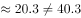，错误；

B项：根据贡献率，因为两年的权重没变，故只需比较即可。2016年：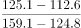2015年：，错误；

C项：2019年我国经济发展新动能总指数332，2014年总指数为100，根据年均增长率公式可得，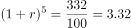。当年均增速为时，代入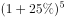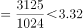，故2015-2019年我国经济发展新动能总指数年均增速应超过，正确；

D项：定位表格材料，可知5类指数每年的增速，发现2018年转型升级指数的增速（）经济活力指数的增速（），所以2015-2019年我国转型升级指数每年的增速并不都是最慢的，错误。

故正确答案为C。

---

## 材料 3

### 第 11 题　qid 2742212 · 增长

2019年我国海洋第一产业增加值为：

- **A**. 3880亿元
- **B**. 3755亿元　✅
- **C**. 3675亿元
- **D**. 3595亿元

**答案**：B

**官方解析**

根据题干“2019年我国海洋第一产业增加值为”，结合材料给出的2019年海洋生产总值以及海洋第一产业增加值占海洋生产总值的比重，可判定本题为现期比重问题。定位表格材料可得：2019年海洋生产总值89415亿元；定位图形材料可得：2019年海洋第一产业增加值占比为。则2019年我国海洋第一产业增加值亿元。

故正确答案为B。

---

### 第 12 题　qid 2742214 · 增长

2019年我国海洋相关产业产值增速：

- **A**. 
低于

- **B**. 
介于和之间
　✅
- **C**. 
高于

- **D**. 
介于和之间

**答案**：B

**官方解析**

根据题干“2019年我国海洋相关产业产值增速”，结合材料给出2019年海洋生产总值、海洋产业的增速，可判定本题为混合增长率问题。定位表格材料可得：2019年海洋生产总值增速为；海洋产业生产总值57315亿元，增速为；海洋相关产业生产总值32100亿元。设所求增速为，根据线段法口诀“距离与量成反比（一般用现期量代替基期量估算）”，可得：，化简为：，解得，在B项范围内。

故正确答案为B。

---

### 第 13 题　qid 2742215 · 综合

在我国主要海洋产业中，2019年产值年增量最大的是：

- **A**. 滨海旅游业　✅
- **B**. 海洋船舶工业
- **C**. 海洋油气业
- **D**. 海洋工程建筑业

**答案**：A

**官方解析**

根据题干“······2019年产值年增量最大的是”，可判定本题为增长量比较问题。定位表格，根据公式：增长量，可得选项各产业的增长量分别为：

A项：滨海旅游业：；B项：海洋船舶工业：；

C项：海洋油气业：；D项：海洋工程建筑业：。

A项与C、D两项对比，A项现期量大、增长率大，根据增长量比较“大大则大”，则A项增长量大于C、D两项，排除C、D两项。

A项：滨海旅游业：；

B项：海洋船舶工业：；

可得A项增长量大于B项，A项增长量最大。

故正确答案为A。

---

### 第 14 题　qid 2742217 · 增长

2019年我国海洋第三产业增加值年增长率为：

- **A**. 

- **B**. 

- **C**. 

　✅
- **D**. 

**答案**：C

**官方解析**

根据题干“2019年······年增长率为”，可判定本题为一般增长率问题。定位表格材料，2019年我国海洋生产总值为89415亿元，同比增长，则2018年海洋生产总值。定位柱状图可得，2019年和2018年我国海洋第三产业增加值占海洋生产总值的比重分别为和。

方法一：根据公式“部分量”，则2019年和2018年我国海洋第三产业增加值分别为、。根据公式“增长率”，则2019年我国海洋第三产业增加值同比增长：。

方法二：根据公式“基期比重”，其中基期比重，现期比重，，代入可得：，则：，解得。

故正确答案为C。

---

### 第 15 题　qid 2742218 · 综合

能够从上述资料中推出的是：

- **A**. 
2018年，我国海洋科研教育管理服务业产值超过20000亿元

- **B**. 
在我国主要海洋产业中，2018年产值占比最大的是海洋渔业

- **C**. 
在我国主要海洋产业中，2019年产值增速高于的产业有3个
　✅
- **D**. 
2016—2019年，我国海洋第二产业增加值占海洋生产总值的比重有升有降

**答案**：C

**官方解析**

A项：定位表格材料，根据公式“基期量”，则2018年我国海洋科研教育管理服务业产值亿元，错误；

B项：定位表格材料，根据公式“基期量”，在我国主要海洋产业中，2019年滨海旅游业产值（18086亿元）远大于其他产业，（）部分差距不大，故2018年滨海旅游业产值最大。因我国主要海洋产业总产值一定，如果部分量大，占比则大，故2018年产值占比最大的是滨海旅游业，错误；

C项：定位表格材料，在我国主要海洋产业中，产值增速高于的产业有海洋生物医药业（）、海洋船舶工业（）、滨海旅游业（），共计3个，正确；

D项：定位图形材料，2016—2019年，我国海洋第二产业增加值占海洋生产总值的比重逐年降低，并非有升有降，错误；

故正确答案为C。

---

## 材料 4

        2019年全球太空经济规模增至3660亿美元，较2018年增长，其中全球卫星产业收入为2707亿美元。在全球卫星产业收入中，卫星制造业的收入为125亿美元，较上年减少70亿美元；卫星发射服务业的收入为49亿美元，较上年下降；卫星通信服务业的收入为1230亿美元，较上年减少35亿美元；地面设备制造业的收入为1303亿美元，较上年增长。

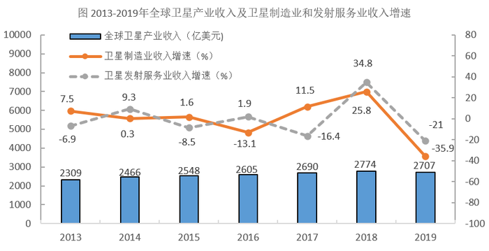

### 第 16 题　qid 2742018 · 比重

2019年全球卫星制造业收入占卫星产业收入的比重为：

- **A**. 

- **B**. 

- **C**. 

- **D**. 

　✅

**答案**：D

**官方解析**

根据题干“2019年······占······的比重为”，结合材料时间为2019年，可判定本题为现期比重问题。定位文字材料可知，2019年，全球卫星产业收入为2707亿美元。在全球卫星产业收入中，卫星制造业的收入为125亿美元。根据公式：比重，则2019年全球卫星制造业收入占卫星产业收入的比重。

故正确答案为D。

---

### 第 17 题　qid 2742028 · 增长

2014-2019年全球卫星产业收入增长最快的年份是：

- **A**. 2014年　✅
- **B**. 2015年
- **C**. 2017年
- **D**. 2018年

**答案**：A

**官方解析**

根据题干“增长最快的年份是”，可判定本题为一般增长率的比较问题。定位图形材料，2013-2019全球卫星产业收入均已给出。根据公式：增长率，代入数据如下所示：

A项：2014年全球卫星产业收入增长率；

B项：2015年全球卫星产业收入增长率；

C项：2017年全球卫星产业收入增长率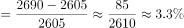；

D项：2018年全球卫星产业收入增长率。

因此，全球卫星产业收入增长最快的年份是2014年。

故正确答案为A。

---

### 第 18 题　qid 2742033 · 增长

以2012年为基期，2019年全球卫星制造业、卫星发射服务业的收入增长情况分别是：

- **A**. 负增长、正增长
- **B**. 负增长、负增长　✅
- **C**. 正增长、负增长
- **D**. 正增长、正增长

**答案**：B

**官方解析**

根据题干“增长情况分别是”，结合材料数据给出了各个年份的增长率，可判定本题为一般增长率的计算问题。定位图形材料，2013-2019年全球卫星制造业及卫星发射服务业的收入增长率均已给出。根据公式：增长率，故若现期量基期量，则呈正增长，若现期量基期量，则呈负增长。根据公式：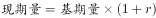，则以2012年为基期时，2019年全球卫星制造业收入2012年全球卫星制造业收入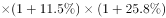

2012年全球卫星制造业收入2012年全球卫星制造业收入，2012年全球卫星制造业收入2019年全球卫星制造业收入，呈负增长；2019年全球卫星发射服务业收入2012年全球卫星发射服务业收入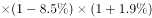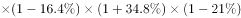2012年全球卫星发射服务业收入2012年全球卫星发射服务业收入，2012年全球卫星发射服务业收入2019年全球卫星发射服务业收入，呈负增长。因此，两者收入增长情况均呈负增长。

故正确答案为B。

---

### 第 19 题　qid 2742037 · 增长

2014-2019年全球卫星产业收入增速大于卫星发射服务业的年份数有：

- **A**. 2个
- **B**. 3个
- **C**. 4个　✅
- **D**. 5个

**答案**：C

**官方解析**

根据题干“2014-2019年······增速大于······的年份数有”，可判定本题为一般增长率的比较问题。定位图形材料可得：2013-2019年全球卫星产业收入以及2014-2019年卫星发射服务业收入增速。根据公式：增长率，2014-2019年的增长率比较如下：

2014年：全球卫星产业收入增速卫星发射服务业收入增速；

2015年：全球卫星产业收入增速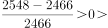卫星发射服务业收入增速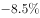；

2016年：全球卫星产业收入增速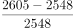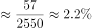卫星发射服务业收入增速；

2017年：全球卫星产业收入增速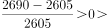卫星发射服务业收入增速；

2018年：全球卫星产业收入增速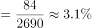卫星发射服务业收入增速；

2019年：全球卫星产业收入增速卫星发射服务业收入增速。

满足要求的年份分别是2015年、2016年、2017年和2019年，共4个年份。

故正确答案为C。

---

### 第 20 题　qid 2742042 · 综合

关于2019年全球卫星产业，能够从上述资料中推出的是：

- **A**. 
卫星产业收入增速为
　✅
- **B**. 
卫星发射服务业收入比2017年提高13.8个百分点

- **C**. 
卫星产业收入占全球太空经济的比重同比上升3.0个百分点

- **D**. 
卫星通信服务业收入的同比增加额与地面设备制造业相差16亿美元

**答案**：A

**官方解析**

A项：根据本篇材料第4题的计算结果，2019年全球卫星产业收入增速为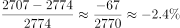，正确；

B项：定位图形材料可得：2018年卫星发射服务业收入增速为，2019年增速为。则所求间隔增长率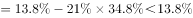，即2019年比2017年提高不到，错误；

C项：根据本篇材料第4题的计算结果，2019年全球卫星产业收入增速为；定位文字材料可得：2019年全球太空经济规模较2018年增长。根据两期比重比较结论，部分量增长率（）小于总量增长率（），2019年比重下降，并非同比上升，错误；

D项：定位文字材料可得：2019年，卫星通信服务业较上年减少35亿美元；地面设备制造业的收入为1303亿美元，较上年增长。则地面设备制造业收入的同比增长量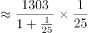亿美元，两者相差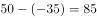亿美元，并非16亿美元，错误。

故正确答案为A。

---
