# 2021年江西省公务员录用考试《行测》题（网友回忆版）

> 资料分析 · 20 题 · 江西 2021

## 材料 1

### 第 1 题　qid 3523365 · 综合

2019年6月下旬，价格按从高到低排列居于第六位的生产资料是：

- **A**. 苯乙烯　✅
- **B**. 聚乙烯
- **C**. 聚丙烯
- **D**. 涤纶长丝

**答案**：A

**官方解析**

根据题干“2019年6月下旬，价格按从高到低排列居于第六位······”，结合材料时间为2019年7月上旬，可判定本题为基期比较问题。根据公式，基期量，定位表格材料可得：第1名是电解铜，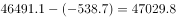元/吨；第2名是锌锭，元/吨；第3名是铅锭，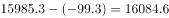元/吨；第4名是铝锭，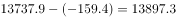元/吨；第5名是顺丁胶，元/吨；第6名是苯乙烯，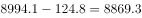元/吨。

故正确答案为A。

---

### 第 2 题　qid 3523366 · 综合

2019年7月上旬，价格环比涨幅超过的生产资料有：

- **A**. 6种
- **B**. 7种
- **C**. 8种　✅
- **D**. 9种

**答案**：C

**官方解析**

根据题干“2019年7月上旬，价格环比涨幅超过的生产资料有”，可判定本题为一般增长率计算问题。根据公式，增长率。定位表格数据，可知2019年7月上旬：螺纹钢价格环比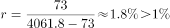；线材价格环比；热轧普通薄板价格环比；纯苯价格环比；苯乙烯价格环比；聚乙烯价格环比；聚丙烯价格环比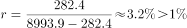；涤纶长丝价格环比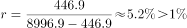；共8个增长率大于，其余种类增长率均小于。

故正确答案为C。

---

### 第 3 题　qid 3523367 · 综合

2019年6月下旬，电解铜的价格约是无缝钢管的：

- **A**. 9.5倍
- **B**. 9.8倍
- **C**. 10.1倍　✅
- **D**. 10.4倍

**答案**：C

**官方解析**

根据题干“2019年6月下旬······”，材料给的时间是2019年7月上旬，并结合选项，可判定本题为基期倍数问题。根据基期倍数定义，定位表格数据，可得基期倍数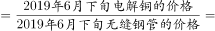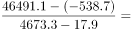倍。

故正确答案为C。

---

### 第 4 题　qid 3523369 · 综合

按照2019年7月上旬的环比涨跌幅，2019年7月中旬聚乙烯的价格约为：

- **A**. 7929.1元/吨
- **B**. 8031.5元/吨
- **C**. 8134.3元/吨
- **D**. 8236.9元/吨　✅

**答案**：D

**官方解析**

根据题干“按照2019年7月上旬的环比涨跌幅，2019年7月中旬聚乙烯的价格约为”，结合选项单位为元/吨，可判定本题为现期计算问题。定位表格数据：2019年7月上旬聚乙烯的价格为8081.7元/吨，比上期价格上涨152.6元/吨，则2019年7月上旬环比涨幅为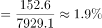，因此2019年7月中旬聚乙烯的价格为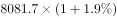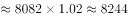元/吨，与D项最接近。

秒杀技巧：2019年7月上旬聚乙烯的价格为8081.7元/吨，比上期价格上涨152.6元/吨，按照2019年7月上旬环比涨跌幅，因基期量变大，则2019年7月中旬的增长量应大于152.6元/吨，因此2019年7月中旬聚乙烯的价格元/吨元/吨，即2019年7月中旬聚乙烯的价格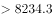元/吨，只有D项符合。

故正确答案为D。

---

### 第 5 题　qid 3523370 · 综合

能够从上述资料中推出的是：

- **A**. 2019年6月下旬，烧碱的价格比甲醇低1401元/吨
- **B**. 2019年7月上旬，黑色金属中的线材价格环比涨幅最快
- **C**. 2019年6月下旬，铝锭、铅锭、锌锭三者的价格之和比电解铜高2948.9元/吨
- **D**. 2019年7月上旬，化工产品中按价格从高到低排名前三位的是顺丁胶，涤纶长丝，苯乙烯　✅

**答案**：D

**官方解析**

A项：定位表格材料，2019年6月下旬，烧碱的价格比甲醇低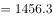元/吨（可利用尾数法判定），并非低1401元/吨，错误；

B项：环比涨幅的比较，需要比较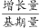。结合材料中给出的数据和增长率比较技巧，直接比较的大小即可。2019年7月上旬，螺纹钢该数据线材该数据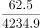，说明螺纹钢价格环比涨幅大于线材价格环比涨幅，而非黑色金属中的线材价格环比涨幅最快，错误；

C项：定位表格材料，2019年6月下旬，铝锭、铅锭、锌锭三者的价格之和为元/吨，电解铜价格为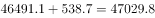元/吨，铝锭、铅锭、锌锭三者的价格之和比电解铜高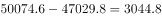元/吨（可利用尾数法判定），并非高2948.9元/吨，错误；

D项：定位表格材料，2019年7月上旬，化工产品中按价格从高到低排名前三位的是顺丁胶（10505.0元/吨），涤纶长丝（8996.9元/吨），苯乙烯（8994.1元/吨），正确。

故正确答案为D。

---

## 材料 2

        截至2019年3月31日，证券业协会对证券公司2019年第一季度经营数据进行了统计，131家证券公司当期实现营业收入1018.94亿元，同比增长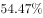。

        其中，各主营业务收入分别为代理买卖证券业务净收入（含席位租赁）221.49亿元，同比增长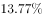；证券承销与保荐业务净收入66.73亿元，同比增长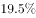；财务顾问业务净收入20.95亿元，同比增长；投资咨询业务净收入7.15亿元，同比增长；资产管理业务净收入57.33亿元，同比下降；证券投资收益（含公允价值变动）514.05亿元，同比增长；利息净收入69.04亿元，同比增长；当期实现净利润440.16亿元，同比增长；119家公司实现盈利，同比增长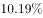。

        2019年第一季度，131家证券公司总资产为7.05万亿元，比上年一季度同期增加0.64万亿元；净资产为1.94万亿元，比上年一季度同期增加0.05万亿元；净资本为1.62万亿元，比上年一季度同期增加0.02万亿元。

        另外，2019年第一季度131家证券公司客户交易结算资金余额（含信用交易资金）1.50万亿元，比上年一季度同期增加0.32万亿元；受托管理资金本金总额14.11万亿元，比上年一季度同期下降2.82万亿元。

### 第 6 题　qid 3522370 · 综合

2018年第一季度，131家证券公司资产管理业务净收入与同期利息净收入相比约：

- **A**. 少了2.0亿元
- **B**. 多了2.0亿元　✅
- **C**. 少了3.1亿元
- **D**. 多了3.1亿元

**答案**：B

**官方解析**

根据题干“2018年第一季度······业务净收入与······利息净收入相比约”，结合选项为“多了/少了······亿元”，材料时间为2019年第一季度，可判定本题为基期和差问题。定位文字材料第二段可得“资产管理业务净收入57.33亿元，同比下降······利息净收入69.04亿元，同比增长”。根据基期量，则2018年第一季度，131家证券公司资产管理业务净收入与同期利息净收入的差值为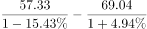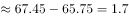亿元，与B项最接近。

故正确答案为B。

---

### 第 7 题　qid 3522362 · 平均数

131家证券公司中，平均每家证券公司在2018年第一季度实现营业收入约为：

- **A**. 659.4亿元
- **B**. 5.0亿元　✅
- **C**. 669.5亿元
- **D**. 6.0亿元

**答案**：B

**官方解析**

根据题干“······平均每家证券公司在2018年第一季度实现营业收入约为”，结合材料时间为2019年第一季度，可判定本题为基期平均数问题。定位文字材料第一段可得，2019年第一季度，131家证券公司当期实现营业收入1018.94亿元，同比增长。根据基期量，则2018年一季度，平均每家证券公司实现营业收入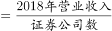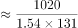亿元。

故正确答案为B。

---

### 第 8 题　qid 3522358 · 综合

2018年第一季度，131家证券公司代理买卖证券业务净收入（含席位租赁）约为：

- **A**. 184.6亿元
- **B**. 190.1亿元
- **C**. 194.7亿元　✅
- **D**. 204.2亿元

**答案**：C

**官方解析**

根据题干“2018年第一季度······代理买卖证券业务净收入（含席位租赁）约为”，结合材料时间为2019年第一季度，可判定本题为基期计算问题。定位文字材料第二段可得“代理买卖证券业务净收入（含席位租赁）221.49亿元，同比增长”。根据基期量，故2018年第一季度，131家证券公司代理买卖证券业务净收入（含席位租赁）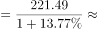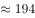亿元，与C项最接近。

故正确答案为C。

---

### 第 9 题　qid 3522366 · 增长

2019年第一季度，131家证券公司总资产的同比增速约为：

- **A**. 

- **B**. 

　✅
- **C**. 

- **D**. 

**答案**：B

**官方解析**

根据题干“2019年第一季度······同比增速约为”，可判定本题为一般增长率问题。定位文字材料第三段可得“2019年第一季度，131家证券公司总资产为7.05万亿元，比上年一季度同期增加0.64万亿元”。根据增长率，则2019年第一季度，131家证券公司总资产的同比增速。

故正确答案为B。

---

### 第 10 题　qid 3522377 · 综合

关于证券公司2019年第一季度经营数据，下列说法正确的是：

- **A**. 
131家证券公司总资产比净资产少了4.11亿元

- **B**. 
131家证券公司财务顾问业务净收入的同比增长率为

- **C**. 
131家证券公司净资产的同比增长金额低于净资本的同比增长金额

- **D**. 
131家证券公司资产管理业务净收入占当期实现营业收入的比重约为
　✅

**答案**：D

**官方解析**

A项：定位文字材料第三段可得，2019年第一季度，131家证券公司总资产为7.05万亿元，净资产为1.94万亿元。故131家证券公司总资产比净资产多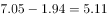万亿元，非少了4.11亿元，错误；

B项：定位文字材料第二段可得，财务顾问业务净收入同比增长，故增长率不是，错误；

C项：定位文字材料第三段可得，2019年第一季度，131家证券公司净资产为1.94万亿元，比上年一季度同期增加0.05万亿元；净资本为1.62万亿元，比上年一季度同期增加0.02万亿元。0.05万亿元0.02万亿元，故131家证券公司净资产的同比增长金额高于净资本的同比增长金额，错误；

D项：定位文字材料第一段和第二段可得，2019年第一季度，131家证券公司当期实现营业收入1018.94亿元，资产管理业务净收入57.33亿元。则131家证券公司资产管理业务净收入占当期实现营业收入的比重，正确。

故正确答案为D。

---

## 材料 3

        截至2019年12月31日，中国共产党党员总数为9191.6万名，同比增长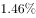。在党员的性别、民族和学历上，女党员2559.9万名，少数民族党员680.3万名，大专及以上学历党员4661.5万名。在党员的入党时间上，新中国成立前入党的17.4万名，新中国成立后至党的十一届三中全会前入党的1550.9万名，党的十一届三中全会后至党的十八大前入党的6127.7万名，党的十八大以来入党的1495.6万名。在党员的职业上，工人（含工勤技能人员）644.5万名，农牧渔民2556.1万名，企事业单位、社会组织专业技术人员1440.3万名，企事业单位、社会组织管理人员1010.4万名，党政机关工作人员767.8万名，学生196.0万名，其他职业人员710.4万名，离退休人员1866.1万名。

        2019年共发展党员234.4万名，比上年增长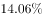。其中，发展女党员99.4万名，占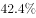；发展少数民族党员23.6万名，占；发展35岁及以下党员188.3万名，占；发展具有大专及以上学历的党员106.8万名，占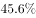。发展党员的职业上，工人（含工勤技能人员）14.3万名，企事业单位、社会组织专业技术人员31.6万名，企事业单位、社会组织管理人员25.3万名，农牧渔民42.4万名，党政机关工作人员13.4万名，学生84.4万名，其他职业人员22.9万名。

### 第 11 题　qid 3522352 · 比重

若阴影部分代表大专及以上学历党员人数，那么下列哪幅图最能反映截至2019年12月31日大专及以上学历党员占党员总数的比例？

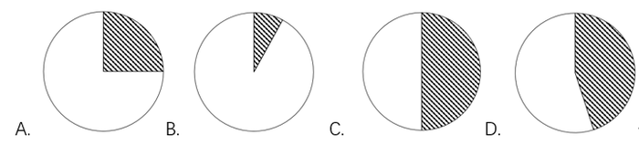

- **A**. A
- **B**. B
- **C**. C　✅
- **D**. D

**答案**：C

**官方解析**

根据题干“······2019年12月31日······占······的比例”，结合材料时间为2019年12月31日，可判定本题为现期比重问题。定位文字材料第一段可得“截至2019年12月31日，中国共产党党员总数为9191.6万名，······大专及以上学历党员4661.5万名。”故2019年12月31日大专及以上学历党员占党员总数的比例。结合饼状图，阴影部分代表大专及以上学历党员人数，所占比例约等于一半，C项满足。

故正确答案为C。

---

### 第 12 题　qid 3522356 · 综合

截至2019年12月31日，新中国成立后至党的十八大前入党的人数约是其余时间入党人数的：

- **A**. 3.8倍
- **B**. 4.1倍
- **C**. 4.6倍
- **D**. 5.1倍　✅

**答案**：D

**官方解析**

根据题干“2019年12月31日······是······”，结合选项求倍数，且材料时间为2019年12月31日，可判定本题为现期倍数问题。定位文字材料第一段可得“在党员的入党时间上，新中国成立前入党的17.4万名，新中国成立后至党的十一届三中全会前入党的1550.9万名，党的十一届三中全会后至党的十八大前入党的6127.7万名，党的十八大以来入党的1495.6万名。”则新中国成立后至党的十八大前入党的人数为，其余时间入党人数为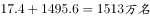，故新中国成立后至党的十八大前入党的人数约是其余时间入党人数的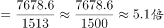。

故正确答案为D。

---

### 第 13 题　qid 3522363 · 比重

2018年，发展党员数占同期党员总数的比例约为：

- **A**. 

- **B**. 

　✅
- **C**. 

- **D**. 

**答案**：B

**官方解析**

根据题干“2018年······占······的比例约为”，结合材料时间为2019年，可判定本题为基期比重问题。定位文字材料第一段可得“截至2019年12月31日，中国共产党党员总数为9191.6万名（B），同比增长（b）”，定位文字材料第二段可得“2019年共发展党员234.4万名（A），比上年增长（a）”。根据基期比重公式可得：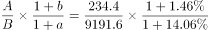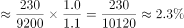。

故正确答案为B。

---

### 第 14 题　qid 3522360 · 比重

截至2019年12月31日，资料所列8种党员职业类型中，党员人数占比不低于的有：

- **A**. 3类　✅
- **B**. 4类
- **C**. 5类
- **D**. 6类

**答案**：A

**官方解析**

根据题干“2019年12月31日······占比不低于······”，结合材料时间为2019年12月31日，可判定本题为现期比重问题。定位文字材料第一段可得“中国共产党党员总数为9191.6万名，…在党员的职业上，工人（含工勤技能人员）644.5万名，农牧渔民2556.1万名，企事业单位、社会组织专业技术人员1440.3万名，企事业单位、社会组织管理人员1010.4万名，党政机关工作人员767.8万名，学生196.0万名，其他职业人员710.4万名，离退休人员1866.1万名。”则2019年12月31日中国共产党党员总数的。故党员人数占比不低于的有农牧渔民2556.1万名，企事业单位、社会组织专业技术人员1440.3万名，离退休人员1866.1万名，共3类。

故正确答案为A。

---

### 第 15 题　qid 3522369 · 综合

不能从上述资料中推出的是：

- **A**. 
2019年发展的党员人数中，学生党员占比超过

- **B**. 
截至2019年12月31日，55岁以下党员占党员总数的比不超过

- **C**. 
截至2019年12月31日，61岁及以上的党员人数中，新中国成立前入党的不超过

- **D**. 
截至2019年12月31日，从事农牧渔民职业的党员人数与工人（含工勤技能人员）党员人数之比超过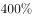
　✅

**答案**：D

**官方解析**

A项：定位文字材料第二段：“2019年共发展党员234.4万名，……发展学生84.4万名”，则2019年发展的党员人数中，学生党员占比为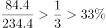，说法正确，排除；

B项：定位图1，截至2019年12月31日，55岁以上党员人数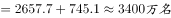，则55岁及以下党员占党员总数的比55岁以上党员占党员总数的比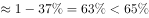，故55岁以下党员占党员总数的比不超过，说法正确，排除；

C项：定位文字材料第一段，新中国成立前入党的17.4万名；定位图1，截至2019年12月31日61岁以上党员人数为2657.7万名。而截至2019年12月31日，新中国成立前入党的人员都已满61岁。故61岁及以上的党员人数中，新中国成立前入党的人数占比为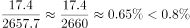，说法正确，排除；

D项：定位文字材料第一段：“在党员的职业上，工人（含工勤技能人员）644.5万名，农牧渔民2556.1万名”，则从事农牧渔民职业的党员人数与工人（含工勤技能人员）党员人数之比为，说法错误，当选。

本题为选非题，故正确答案为D。

---

## 材料 4

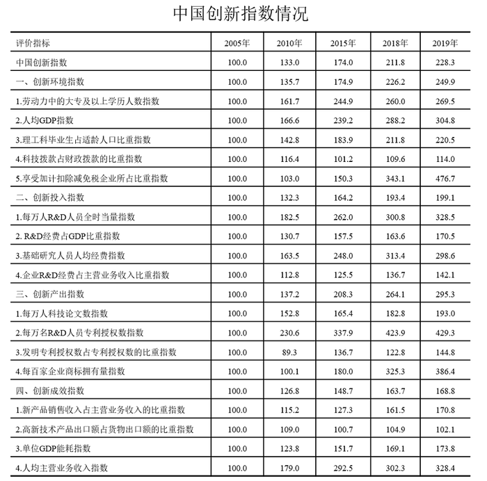

### 第 16 题　qid 3522350 · 增长

2019年中国创新指数比2010年约增长：

- **A**. 

- **B**. 
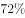
　✅
- **C**. 

- **D**. 

**答案**：B

**官方解析**

根据题干“······约增长”，结合选项为百分数，可判定本题为一般增长率问题。定位表格材料可得：2019年中国创新指数为228.3，2010年为133.0。故2019年中国创新指数相对于2010年的增长率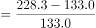。

故正确答案为B。

---

### 第 17 题　qid 3522353 · 增长

在2019年中国创新环境指数中，下列评价指标同比增速最慢的是：

- **A**. 人均GDP指数
- **B**. 科技拨款占财政拨款的比重指数
- **C**. 理工科毕业生占适龄人口比重指数
- **D**. 劳动力中的大专及以上学历人数指数　✅

**答案**：D

**官方解析**

根据题干“······同比增速最慢的是”，可判定本题为一般增长率问题。根据增长率，定位表格材料可得：

人均GDP指数同比增速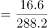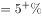；

科技拨款占财政拨款的比重指数同比增速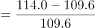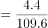；

理工科毕业生占适龄人口比重指数同比增速；

劳动力中的大专及以上学历人数指数同比增速。

可见增速最慢的是劳动力中的大专及以上学历人数指数。

故正确答案为D。

---

### 第 18 题　qid 3522774 · 综合

下列关于2018年评价指标指数大小排序正确的是：

- **A**. 
单位GDP能耗指数人均主营业务收入指数人均GDP指数

- **B**. 
人均GDP指数每万人人员全时当量指数每万人科技论文数指数

- **C**. 
每万人科技论文数指数每百家企业商标拥有量指数单位GDP能耗指数

- **D**. 
基础研究人员人均经费指数每万人科技论文数指数单位GDP能耗指数
　✅

**答案**：D

**官方解析**

根据题干“2018年评价指标指数”，定位表格材料倒数第二列可得：单位GDP能耗指数为169.1；人均主营业务收入指数为302.3；人均GDP指数为288.2；每万人人员全时当量指数为300.8；每万人科技论文数指数为182.8；每百家企业商标拥有量指数为325.3；基础研究人员人均经费指数为313.4。可以看出，D项基础研究人员人均经费指数（313.4）每万人科技论文数指数（182.8）单位GDP能耗指数（169.1）排序正确。

故正确答案为D。

---

### 第 19 题　qid 3522359 · 增长

相比于2015年，2018年创新投入指数4个评价指标中增幅在与之间的有：

- **A**. 1个　✅
- **B**. 2个
- **C**. 3个
- **D**. 4个

**答案**：A

**官方解析**

根据题干“······增幅······”，可判定本题为一般增长率问题。根据增长率，定位表格材料可得，相比于2015年，2018年创新投入指数4个评价指标的增长率分别为：

每万人人员全时当量指数：；

经费占GDP比重指数：；

基础研究人员人均经费指数：；

企业经费占主营业务收入比重指数：。

可见增幅在与之间的仅有基础研究人员人均经费指数，共1个。

故正确答案为A。

---

### 第 20 题　qid 3522368 · 综合

能够从上述资料中推出的是：

- **A**. 
2010年创新产出指数4个评价指标中超过150的有3个

- **B**. 
2019年创新成效指数4个评价指标中有2个同比增速高于

- **C**. 
2019年人均GDP指数同比增速高于每万人科技论文数指数同比增速
　✅
- **D**. 
2018年每万名人员专利授权数指数在表中同期全部评价指标指数中位居第二

**答案**：C

**官方解析**

A项：2010年创新产出指数中，超过150的评价指标只有每万人科技论文数指数（152.8）、每万人人员专利授权数指数（230.6）2个，错误；

B项：2019年创新成效指数的评价指标中，新产品销售收入占主营业务收入的比重指数的同比增速；高新技术产品出口额占货物出口额的比重指数中，2019年的为102.1，小于2018年的104.9，增长率为负数，同比增速；单位GDP能耗指数的同比增速；人均主营业务收入指数的同比增速，故只有1个指标同比增速高于，错误；

C项：2019年人均GDP指数的同比增速，每万人科技论文数指数的同比增速，故2019年人均GDP指数的同比增速高于每万人科技论文数指数的同比增速，正确；

D项：2018年每万名人员专利授权数指数为423.9，在2018年全部评价指标指数位列第一，并非第二，错误。

故正确答案为C。

---
