# 2021年浙江省公务员录用考试《行测》题（B类）（网友回忆版）

> 资料分析 · 16 题 · 浙江 2021

## 材料 1

2017年，国内旅游市场高速增长，入出境市场平稳发展，供给侧结构性改革成效明显。国内旅游人数50.01亿人次，比上年同期增长；入出境旅游总人数2.7亿人次，增长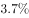；全年实现旅游总收入5.40万亿元，增长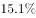；全年全国旅游业对GDP的综合贡献为9.13万亿元，占GDP总量的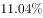；旅游直接就业2825万人，旅游直接和间接就业7990万人，占全国就业总人口的。

一、全年国内旅游收入增长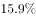

2017年，国内旅游人数50.01亿人次，比上年同期增长。其中，城镇居民36.77亿人次，增长；农村居民13.24亿人次，增长。国内旅游收入4.57万亿元，增长。其中，城镇居民花费3.77万亿元，增长；农村居民花费0.80万亿元，增长。

二、全年入境过夜旅游人数增长

2017年，入境旅游人数13948万人次，比上年同期增长。其中，外国人2917万人次，增长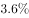；香港同胞7980万人次，下降；澳门同胞2465万人次，增长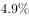；台湾同胞587万人次，增长。入境旅游人数按照入境方式分，船舶占，飞机占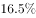，火车占，汽车占，其他占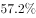。

2017年，入境过夜旅游人数6074万人次，比上年同期增长。其中，外国人2248万人次，增长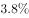；香港同胞2775万人次，增长；澳门同胞522万人次，增长；台湾同胞529万人次，增长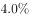。

三、全年国际旅游收入达1234亿美元

2017年，国际旅游收入1234亿美元，比上年同期增长。其中，外国人在华花费695亿美元，增长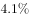；香港同胞在内地花费301亿美元，下降；澳门同胞在内地花费83亿美元，增长；台湾同胞在大陆花费155亿美元，增长。

四、全年入境外国游客亚洲占，以观光休闲为目的游客占

2017年，入境外国游客人数4294万人次，亚洲占，美洲占，欧洲占，大洋洲占，非洲占。其中，按照年龄分，14岁以下人数占，15—24岁占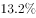，25—44岁占，45—64岁占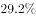，65岁以上占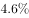；按性别分，男占，女占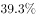；按目的分，会议/商务占，观光休闲占，探亲访友占，服务员工占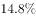，其他占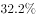。

2017年，按入境旅游人数排序，我国主要客源市场前17位国家如下：缅甸、越南、韩国、日本、俄罗斯、美国、蒙古、马来西亚、菲律宾、新加坡、印度、加拿大、泰国、澳大利亚、印度尼西亚、德国、英国。

五、全年中国公民出境旅游人数达13051万人次

2017年，中国公民出境旅游人数13051万人次，比上年同期增长。

### 第 1 题　qid 2776158 · 综合

2017年，全国入境旅游人数较出境旅游人数多多少万人次？

- **A**. 892
- **B**. 895
- **C**. 897　✅
- **D**. 903

**答案**：C

**官方解析**

定位文字材料第二部分：2017年，入境旅游人数13948万人次；文字材料第五部分：2017年，中国公民出境旅游人数13051万人次。则2017年，全国入境旅游人数较出境旅游人数多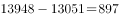万人次。

故正确答案为C。

---

### 第 2 题　qid 2776159 · 综合

2016年，全国国内旅游人数约为入出境旅游总人数的多少倍？

- **A**. 17　✅
- **B**. 19
- **C**. 21
- **D**. 23

**答案**：A

**官方解析**

根据题干“2016年······为······的多少倍”，结合材料时间是2017年，可判定本题为基期倍数问题。定位文字材料第一段：2017年，······国内旅游人数50.01亿人次，比上年同期增长；入出境旅游总人数2.7亿人次，增长。根据公式：基期倍数，可得2016年，全国国内旅游人数约为入出境旅游总人数的倍数，满足条件的只有A项。

故正确答案为A。

---

### 第 3 题　qid 2776160 · 平均数

2017年，城镇居民平均每人次旅游消费比农村居民约多多少元？

- **A**. 382
- **B**. 395
- **C**. 406
- **D**. 421　✅

**答案**：D

**官方解析**

根据题干“2017年······平均每人次旅游消费······”，结合材料时间是2017年，可判定本题为现期平均数问题。定位文字材料第一部分：2017年，······城镇居民36.77亿人次，······；农村居民13.24亿人次，······城镇居民花费3.77万亿元，······农村居民花费0.80万亿元。根据平均每人次旅游消费，则2017年，城镇居民平均每人次旅游消费比农村居民多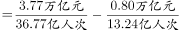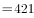元。

故正确答案为D。

---

### 第 4 题　qid 2776161 · 综合

根据上述材料，以下分析不正确的是：

- **A**. 
2017年，入境外国游客人数：亚洲欧洲美洲大洋洲非洲

- **B**. 
2017年，入境旅游人数按入境方式分：其他方式汽车飞机船舶火车

- **C**. 
2017年，入境过夜旅游人数同比增速：澳门同胞台湾同胞外国人香港同胞

- **D**. 
2017年，主要客源市场国家按入境旅游人数：日本俄罗斯马来西亚印度尼西亚印度
　✅

**答案**：D

**官方解析**

A项：定位文字材料第四部分第一段：2017年，入境外国游客人数4294万人次，亚洲占，美洲占，欧洲占，大洋洲占，非洲占。根据公式：部分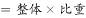，可知入境外国游客人数占比越高，则对应的人数越多，故亚洲（）欧洲（）美洲（）＞大洋洲（）非洲（），正确；

B项：定位文字材料第二部分第一段：入境旅游人数按照入境方式分，船舶占，飞机占，火车占，汽车占，其他占。根据公式：部分，可知入境旅游方式占比越高，则对应的人数越多，故其他方式（）汽车（）飞机（）船舶（）火车（），正确；

C项：定位文字材料第二部分第二段：2017年，入境过夜旅游人数6074万人次，比上年同期增长。其中，外国人增长；香港同胞增长；澳门同胞增长；台湾同胞增长。可知：澳门同胞（）台湾同胞（）外国人（）香港同胞（），正确；

D项：定位文字材料第四部分第二段：2017年，按入境旅游人数排序，我国主要客源市场前17位国家如下：······日本、俄罗斯······马来西亚······印度······印度尼西亚······。可得入境旅游人数：印度尼西亚印度，错误。

本题为选非题，故正确答案为D。

---

### 第 5 题　qid 2776163 · 综合

根据上述材料，以下说法正确的是：

- **A**. 
2017年，全国就业总人口超过8亿人

- **B**. 
2017年，国际旅游收入五成以上由外国人在华花费实现
　✅
- **C**. 
2017年，香港同胞在内地花费比台湾同胞在大陆花费多一倍以上

- **D**. 
2017年，入境外国游客中，44岁以下年龄段游客人数占以上

**答案**：B

**官方解析**

A项：定位文字材料第一段：2017年，······旅游直接和间接就业7990万人，占全国就业总人口的。根据公式：整体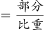，可得全国就业总人口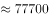万人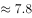亿人8亿人，错误；

B项：定位文字材料第三部分第一段：2017年，国际旅游收入1234亿美元······其中，外国人在华花费695亿美元。根据公式：比重，可知外国人在华花费占比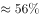，超过五成，正确；

C项：定位文字材料第三部分第一段：2017年，国际旅游收入1234亿美元······其中，香港同胞在内地花费301亿美元······台湾同胞在大陆花费155亿美元。故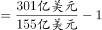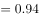，即多不到一倍，错误；

D项：定位文字材料第四部分第一段：2017年，······按照年龄分，14岁以下人数占，15—24岁占，25—44岁占。可得：44岁以下年龄段游客人数占比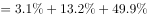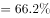，错误。

故正确答案为B。

---

## 材料 2

8月份，规模以上工业原煤生产增速回升，煤炭进口保持较高水平；原油生产增速由负转正，进口继续增加；天然气生产保持较快增长，进口持续高速增长；电力生产加快。

一、原煤生产增速回升，煤炭进口保持较高水平，市场价格小幅波动

8月份，原煤产量3.0亿吨，同比增长，上月为下降；日均产量957万吨，环比增加49万吨。1—8月份，原煤产量22.8亿吨，同比增长。

8月份，煤炭主产区生产均开始回升。其中，内蒙古同比增长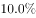，上月为下降；山西同比下降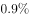，降幅较上月收窄2.2个百分点；陕西同比增长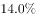，增速较上月加快7.6个百分点；新疆同比增长，上月为下降。

8月份，煤炭进口2868万吨，比上月略降33万吨，但仍保持较高水平，同比增长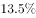。1—8月份，煤炭进口2.0亿吨，同比增长。

8月底，秦皇岛5500大卡煤炭综合交易价格为573元/吨，比7月底下降3元；5000大卡煤炭价格为510元/吨，比7月底下降17元；4500大卡煤炭价格为456元/吨，比7月底下降12元。

二、原油生产增速由负转正，进口持续增加

8月份，原油生产1600万吨，同比增长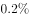，上月为下降，为2015年11月以来首次正增长；日均产量51.6万吨，环比增加0.5万吨。1—8月份，原油产量12595万吨，同比下降。

原油进口持续增加，8月份进口原油3838万吨，比上月增加236万吨，同比增长。1—8月份，进口原油29919万吨，同比增长。

国际原油价格震荡上行，截至8月底，布伦特原油现货离岸价格为76.94美元/桶，比7月底上涨2.78美元/桶。

三、原油加工量增速有所放缓

8月份，原油加工量5031万吨，同比增长，增速比上月回落6.0个百分点；日均加工162.3万吨，环比减少1.4万吨。1—8月，原油加工量40041万吨，同比增长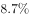。

四、天然气生产保持较快增长，进口持续高速增长

8月份，天然气产量129亿立方米，同比增长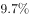，增速比上月回落0.8个百分点；日均生产4.2亿立方米，与上月基本持平。1—8月份，天然气产量1040亿立方米，同比增长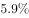。

天然气进口持续高速增长。8月份，进口天然气777万吨（1吨约为1380立方米），比上月增加39万吨，同比增长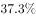。1—8月份，进口天然气5718万吨，同比增长。

五、电力生产加快

8月份，发电量6404.9亿千瓦时，同比增长，增速比上月加快1.6个百分点；日均发电206.6亿千瓦时，再创新高。1—8月份，发电量同比增长，比去年同期加快1.2个百分点。

8月份，除风电外，其他品种电力生产同比增速较7月份均有所加快。其中火电同比增长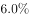，比上月加快1.7个百分点；水电增长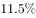，加快5.5个百分点；核电增长，加快2.7个百分点；太阳能发电增长，加快1.3个百分点。

因台风、降雨等气候因素影响，8月份风电大幅减少，增速比上月回落24.1个百分点，同比增长。

### 第 6 题　qid 2776073 · 增长

本年度8月份，进口天然气环比增长约：

- **A**. 

　✅
- **B**. 

- **C**. 
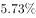

- **D**. 
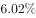

**答案**：A

**官方解析**

根据题干“······环比增长约”，结合选项是百分数，可判定本题为一般增长率计算问题。定位文字材料第四部分第二段可知：8月份，进口天然气777万吨（1吨约为1380立方米），比上月增加39万吨，同比增长。根据增长率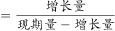，可知本年度8月份，进口天然气环比增长率为：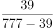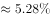。

故正确答案为A。

---

### 第 7 题　qid 2776077 · 综合

本年度上半年，煤炭进口量约为多少万吨？

- **A**. 14198
- **B**. 14231　✅
- **C**. 14264
- **D**. 14297

**答案**：B

**官方解析**

定位文字材料第一部分第三段可知：8月份，煤炭进口2868万吨，比上月略降33万吨，但仍保持较高水平，同比增长。1—8月份，煤炭进口2.0亿吨，同比增长。本年度7月份，煤炭进口量为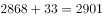万吨。则本年度上半年，即1—6月份，煤炭进口量（1—8月份煤炭进口量）8月份煤炭进口量7月份煤炭进口量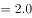亿吨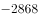万吨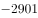万吨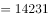万吨。

（注意：选项尾数各不相同，可用尾数法快速锁定答案。）

故正确答案为B。

---

### 第 8 题　qid 2776079 · 综合

本年度8月底，秦皇岛煤炭综合交易价格较7月底降幅最大的和最小的分别是：

- **A**. 5500大卡煤炭和5000大卡煤炭
- **B**. 5000大卡煤炭和4500大卡煤炭
- **C**. 4500大卡煤炭和5500大卡煤炭
- **D**. 5000大卡煤炭和5500大卡煤炭　✅

**答案**：D

**官方解析**

根据题干“······降幅最大的和最小的······”，可判定本题为一般增长率比较问题。定位文字材料第一部分第四段可知：8月底，秦皇岛5500大卡煤炭综合交易价格为573元/吨，比7月底下降3元；5000大卡煤炭价格为510元/吨，比7月底下降17元；4500大卡煤炭价格为456元/吨，比7月底下降12元。根据增长率，8月底，秦皇岛5500大卡煤炭综合交易价格较7月底的增长率为；5000大卡煤炭价格较7月底的增长率为；4500大卡煤炭价格较7月底的增长率为。比较可知8月底，秦皇岛煤炭综合交易价格环比降幅最大的是5000大卡煤炭，最小的是5500大卡煤炭。

故正确答案为D。

---

### 第 9 题　qid 2776088 · 综合

以下关于煤炭主产区生产情况的说法正确的是：

- **A**. 
本年度8月份，各主产区产量同比均实现了增长

- **B**. 
本年度7月份，山西产区生产煤炭量同比增长

- **C**. 
本年度7、8月份，同时实现同比增长的只有陕西产区
　✅
- **D**. 
本年度7月份，各主产区生产煤炭量同比降幅：内蒙古山西新疆

**答案**：C

**官方解析**

A项：定位文字材料第一部分第二段，“8月份，煤炭主产区生产均开始回升。其中······山西同比下降”，并非所有产区均实现了增长，错误；

B项：定位文字材料第一部分第二段，“8月份······山西同比下降，降幅较上月收窄2.2个百分点”，则7月份，山西产区生产煤炭量同比增长率为：，错误；

C项：定位文字材料第一部分第二段，“8月份······陕西同比增长，增速较上月加快7.6个百分点”，则陕西产区8月份增长率为，7月份增长率为，即陕西产区7、8月份同时实现同比增长，所列其他煤炭主产区均不满足，正确；

D项：定位文字材料第一部分第二段，“8月份，煤炭主产区生产均开始回升。其中，内蒙古同比增长，上月为下降；山西同比下降，降幅较上月收窄2.2个百分点；陕西同比增长，增速较上月加快7.6个百分点；新疆同比增长，上月为下降”，故7月份，内蒙古产区降幅为；山西产区降幅为；新疆产区降幅为。即同比降幅的大小排序是新疆山西内蒙古，错误。

故正确答案为C。

---

### 第 10 题　qid 2776091 · 综合

根据上述材料，下列描述不正确的是：

- **A**. 
本年度1—8月份，我国原油进口量高于原油生产量

- **B**. 
本年度8月份，原煤、天然气、电力的生产同比均增长

- **C**. 
本年度8月份，除风电外其他品种电力生产同比增长幅度：核电太阳能水电火电

- **D**. 
本年度8月份，天然气产量与天然气进口量相差悬殊，表明我国对进口天然气依赖度较低
　✅

**答案**：D

**官方解析**

A项：定位文字材料第二部分第一段和第二段，“1—8月份，原油产量12595万吨，同比下降······1—8月份，进口原油29919万吨，同比增长”，1—8月份，原油进口量为29919万吨，原油生产量为12595万吨，故1—8月份，原油进口量高于原油生产量，正确。

B项：定位文字材料第一部分第一段，“8月份，原煤产量3.0亿吨，同比增长，上月为下降”，定位文字材料第四部分第一段，“ 8月份，天然气产量129亿立方米，同比增长，增速比上月回落0.8个百分点”，定位文字材料第五部分第一段，“ 8月份，发电量6404.9亿千瓦时，同比增长，增速比上月加快1.6个百分点”，故8月份，原煤产量的同比增长率为，天然气产量的同比增长率为，发电量的同比增长率为，同比增速均为正，均增长，正确。

C项：定位文字材料第五部分第二段，“8月份，除风电外，其他品种电力生产同比增速较7月份均有所加快。其中火电同比增长，比上月加快1.7个百分点；水电增长，加快5.5个百分点；核电增长，加快2.7个百分点；太阳能发电增长，加快1.3个百分点”，故8月份，火电发电量的同比增长率为，水电发电量的同比增长率为，核电发电量的同比增长率为，太阳能发电量的同比增长率为。同比增长幅度的大小排序是核电太阳能水电火电，正确。

D项：定位文字材料第四部分第一段和第二段，“8月份，天然气产量129亿立方米······8月份，进口天然气777万吨（1吨约为1380立方米）”，则8月份，天然气进口量为亿立方米，天然气进口量与天然气产量相差不大，故我国对进口天然气依赖较大，错误。

本题为选非题，故正确答案为D。

---

## 材料 3

### 第 11 题　qid 2776063 · 综合

2015年S省“四上”企业总计负债约多少万亿元？

- **A**. 9
- **B**. 12
- **C**. 14　✅
- **D**. 16

**答案**：C

**官方解析**

根据注释“‘四上’企业包含表中所列6个一级分类”，定位表格材料可知，2015年S省“四上”企业的负债分别为56888.8亿元、9846.8亿元、35200.6亿元、12584.6亿元、888.9亿元、26358.9亿元。故总计负债亿元，即14.2万亿元，与C项最为接近。

故正确答案为C。

---

### 第 12 题　qid 2776069 · 倍数

2015年S省规模以上工业企业所有者权益约是限额以上批发和零售业企业的几倍？

- **A**. 2
- **B**. 4
- **C**. 7
- **D**. 10　✅

**答案**：D

**官方解析**

根据题干“2015年······是······的几倍”，结合材料时间为2015年，可判定本题为现期倍数问题。定位表格材料可得，规模以上工业企业资产总计为107061.7亿元、负债总计为56888.8亿元，限额以上批发和零售业企业资产总计为17536.8亿元、负债总计为12584.6亿元。根据注释“所有者权益”，可得所求倍数。

故正确答案为D。

---

### 第 13 题　qid 2776076 · 综合

2015年S省规模以上服务业企业中，资产负债率高于的行业有几个？

- **A**. 3　✅
- **B**. 4
- **C**. 5
- **D**. 6

**答案**：A

**官方解析**

根据题干“2015年······资产负债率高于的行业有几个”，可判定本题为比值比较问题。根据注释“资产负债率”，定位表格材料可得，规模以上各服务业企业资产负债率分别为：交通运输、仓储和邮政业：；信息传输、软件和信息技术服务业：；租赁和商务服务业：；科学研究和技术服务业：；水利、环境和公共设施管理业：；居民服务、修理和其他服务业：；教育：；卫生和社会工作：；文化、体育和娱乐业：；房地产服务业：。故有居民服务、修理和其他服务业，卫生和社会工作，房地产服务业共3个行业资产负债率高于。

故正确答案为A。

---

### 第 14 题　qid 2776084 · 比重

2015年S省交通运输、仓储和邮政业所有者权益占规模以上服务业企业所有者权益的比重在以下哪个范围内？

- **A**. 
以下

- **B**. 

　✅
- **C**. 

- **D**. 
以上

**答案**：B

**官方解析**

根据题干“2015年······占······的比重在以下哪个范围内”，可判定本题为现期比重计算问题。定位表格材料可得：2015年S省交通运输、仓储和邮政业资产总计9600.7亿元，负债总计5651.2亿元；规模以上服务业企业资产总计46939.4亿元，负债总计26358.9亿元。根据注释“所有者权益”，可得所求占比，在B项范围内。

故正确答案为B。

---

### 第 15 题　qid 2776090 · 综合

关于2015年S省“四上”企业的资产及负债状况，能够从上述材料中推出的是：

- **A**. 
限额以上住宿和餐饮业企业资产负债率超过

- **B**. 
房地产开发企业负债是资质等级建筑业企业的3倍多
　✅
- **C**. 
规模以上服务业企业中，资产最少的行业其负债也最少

- **D**. 
租赁和商务服务业资产占规模以上服务业企业的七成以上

**答案**：B

**官方解析**

A项：定位表格材料可得：限额以上住宿和餐饮业企业资产总计1211.0亿元，负债总计888.9亿元。根据注释可得，所求资产负债率，并非超过，不能推出，排除；

B项：定位表格材料可得：房地产开发企业负债总计35200.6亿元；资质等级建筑业企业负债总计9846.8亿元。则前者是后者的倍数，可以推出，当选；

C项：定位表格材料可得：规模以上服务业企业中，资产最少的行业是居民服务、修理和其他服务业（132.6亿元），其负债（87.2亿元）教育负债（68.4亿元），并非最少，不能推出，排除；

D项：定位表格材料可得：租赁和商务服务业资产总计27332.3亿元；规模以上服务业企业资产总计46939.4亿元。则前者占后者的比重，不到七成，不能推出，排除。

故正确答案为B。

---

### 第 16 题　qid 2776065 · 增长

某企业在“十二五”期间第一年的营业额比上一年增长了1.5亿元，且往后每年的营业额增量都保持1.5亿元不变。已知该企业在“十四五”期间的营业额将是“十二五”和“十三五”期间营业额之和的。问该企业在“十二五”到“十四五”期间的总营业额在以下哪个范围内？

- **A**. 不到300亿元
- **B**. 300~330亿元
- **C**. 330~360亿元　✅
- **D**. 超过360亿元

**答案**：C

**官方解析**

根据题干可知，每年增量都为1.5亿元，则营业额是公差为1.5亿的等差数列。“十二五”期间（2011-2015），第一年是2011年，即为等差数列的首项，设2011年的营业额为。根据等差数列通项公式：，则“十三五”期间（2016-2020），2020年的营业额；“十四五”期间（2021-2025），2021年的营业额，2025年的营业额。

根据等差数列求和公式：；可得，“十二五”至“十三五”期间的营业额总和为；“十四五”期间的营业额总和为，由题干可知，，解得。

则该企业在“十二五”至“十四五”期间的营业额总和为亿元。

故正确答案为C。

---
