# 2021年海南省公务员录用考试《行测》题（网友回忆版）

> 资料分析 · 15 题 · 海南 2021

## 材料 1

某公司全年销售甲、乙、丙、丁四种产品的销量，单位成本和销售单价如下：

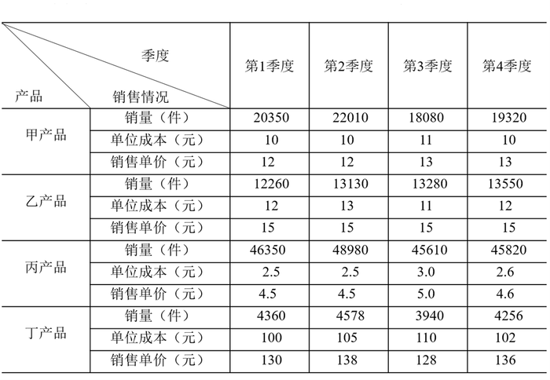

### 第 1 题　qid 3523453 · 综合

某公司全年销量最大的是：

- **A**. 甲产品
- **B**. 乙产品
- **C**. 丙产品　✅
- **D**. 丁产品

**答案**：C

**官方解析**

定位表格材料可得：甲产品第1—4季度销量分别为20350件、22010件、18080件、19320件；乙产品第1—4季度销量分别为12260件、13130件、13280件、13550件；丙产品第1—4季度销量分别为46350件、48980件、45610件、45820件；丁产品第1—4季度销量分别为4360件、4578件、3940件、4256件。比较发现，丙产品每个季度的销量在四种产品中都是最大的，根据全年销量第1季度第2季度第3季度第4季度，可得丙产品全年销量最大。

故正确答案为C。

---

### 第 2 题　qid 3523455 · 综合

某公司全年销售价格波动绝对值最大的是：

- **A**. 甲产品
- **B**. 乙产品
- **C**. 丙产品
- **D**. 丁产品　✅

**答案**：D

**官方解析**

定位表格材料可得：甲产品销售单价的最大值和最小值分别为13元、12元；乙产品4个季度销售单价都是15元；丙产品销售单价的最大值和最小值分别为5.0元、4.5元；丁产品销售单价的最大值和最小值分别为138元、128元；根据波动的绝对值最大值最小值，可得甲产品销售价格波动的绝对值为，乙产品为0，丙产品为，丁产品为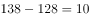。故全年销售价格波动绝对值最大的是丁产品。

故正确答案为D。

备注：波动在数学理论上应该算方差，结合公考一贯的命题思路，不涉及复杂计算，可以将波动理解为变化，变化的绝对值最大，即差值最大。

---

### 第 3 题　qid 3523456 · 比重

对于某公司丁产品，季度销售总额占全年销售总额比重最大的是：

- **A**. 第1季度
- **B**. 第2季度　✅
- **C**. 第3季度
- **D**. 第4季度

**答案**：B

**官方解析**

根据题干“······季度销售总额占全年销售总额比重最大的是”，可判定本题为现期比重问题。定位表格材料可得：丁产品第1—4季度销量分别为4360件、4578件、3940件、4256件；销售单价分别为130元、138元、128元、136元。比较发现，第2季度销量和销售单价在4个季度里都是最大的，根据销售总额销售单价销量可得，丁产品第2季度的销售总额最大。再根据比重，整体相同，部分越大，比重越大；全年销售总额相同，丁产品第2季度的销售总额最大，故第2季度销售总额占的比重最大。

故正确答案为B。

---

### 第 4 题　qid 3523487 · 综合

以下图形中，能够表示某公司甲产品四个季度销售利润趋势的是：

- **A**. 

- **B**. 

- **C**. 

　✅
- **D**. 

**答案**：C

**官方解析**

定位表格材料，甲产品四个季度的销量分别为20350件、22010件、18080件、19320件，单位成本分别为10元、10元、11元、10元，销售单价分别为12元、12元、13元、13元。根据利润总额单件利润销量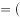销售单价单位成本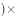销量，可知甲产品四个季度的利润总额分别为元、元、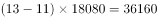元、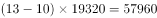元，趋势为上升、下降、上升，符合此规律的只有C项。

故正确答案为C。

---

### 第 5 题　qid 3523488 · 综合

根据资料，下列选项说法正确的是：

- **A**. 在四种产品中，甲产品的利润率最高
- **B**. 乙产品的销量在四个季度有升有降
- **C**. 由于丙产品每季度单位产品利润没有变化，所以每个季度的利润总额也没有发生变化
- **D**. 在四种产品中，销售总额占全年全公司销售总额比重最大的是丁产品　✅

**答案**：D

**官方解析**

A项：定位表格材料，甲产品四个季度的单位成本依次为10元、10元、11元、10元，销售单价依次为12元、12元、13元、13元，丙产品四个季度的单位成本依次为2.5元、2.5元、3.0元、2.6元，销售单价依次为4.5元、4.5元、5.0元、4.6元。由利润率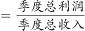得，甲产品四个季度的利润率分别为、、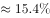、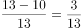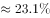，甲产品全年的利润率可以看成四个季度利润率的混合，根据总体混合居中，甲产品全年的利润率应介于~之间。同理，丙产品四个季度的利润率分别为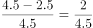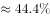、、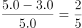、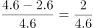，则丙产品的利润率应介于~之间，则丙产品的利润率大于甲产品的利润率，甲产品的利润率并非最高，错误；

B项：定位表格材料，乙产品四个季度的销量分比为12660件、13130件、13280件、13550件，可知乙产品的销量在四个季度中均为上升，错误；

C项：定位表格材料，丙产品第1季度、第2季度的销量分别为46350件、48980件，单位成本分别为2.5元、2.5元，销售单价分别为4.5元、4.5元，根据利润总额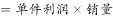，虽然单位利润不变，但销量变化，所以第1季度、第2季度的利润总额是不一样的，错误；

D项：根据比重，整体（全年全公司销售总额）相同，只需比较部分（各产品销售总额）即可，再根据销售总额，定位表格材料，可知甲产品的销售总额为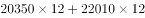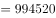元，乙产品的销售总额为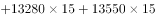元，丙产品的销售总额为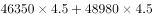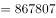元，丁产品的销售总额为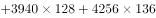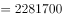元，则丁产品的销售总额最大，故占比也最高，正确。

故正确答案为D。

---

## 材料 2

### 第 6 题　qid 3523503 · 综合

2019年，通勤高峰最拥堵的城市是：

- **A**. 北京
- **B**. 上海
- **C**. 重庆　✅
- **D**. 南京

**答案**：C

**官方解析**

根据题干“2019年······最拥堵的城市是”，可判定本题为基期比较问题。在表格材料中分别给出了现期量和增长率，根据基期量，得到四个城市的交通高峰拥堵指数，分别为北京、上海 、重庆 、南京，根据分数比较中的一大一小直接看，上海、重庆和南京三个城市中重庆的数据分子最大，并且分母最小，排除B、D两项。北京的数据直除首两位为20，重庆的数据直除首两位为21，因此C项更大，当选。

故正确答案为C。

---

### 第 7 题　qid 3523506 · 综合

如果小张从家里到公司的距离是20公里，并且都采用开车方式，2020年他在下列哪个城市居住高峰时段通勤用时最短？

- **A**. 广州
- **B**. 成都
- **C**. 苏州　✅
- **D**. 西安

**答案**：C

**官方解析**

在表格材料中分别给出了2020年广州、成都、苏州和西安的通勤高峰实际速度，四个数据分别为29.84km/h、32.72km/h、37.26km/h和26.41km/h。根据路程，距离一定的情况下，速度越大，通勤时间越短，C项速度最大，当选。

故正确答案为C。

---

### 第 8 题　qid 3523508 · 综合

2020年，小张在下列哪个新一线城市居住会感觉公共交通最便利？

- **A**. 合肥
- **B**. 成都　✅
- **C**. 郑州
- **D**. 长沙

**答案**：B

**官方解析**

在表格材料中分别给出了合肥、成都、郑州和长沙四个城市2020年公共交通线路网密度，四组数据分别为合肥3.029、0.480；成都4.678、0.977；郑州4.106、0.753和长沙3.953、0.630。通过直接观察数据我们发现成都的地面公交线路网密度4.678和地铁线路网密度0.977都是这四个城市中最大的，所以成都公共交通最便利。
故正确答案为B。

---

### 第 9 题　qid 3523510 · 综合

比较一线城市（北京、上海、广州、深圳），2019年通勤高峰交通拥堵程度由重到轻依次是：

- **A**. 北京、上海、广州、深圳
- **B**. 上海、北京、深圳、广州
- **C**. 深圳、北京、上海、广州
- **D**. 北京、广州、上海、深圳　✅

**答案**：D

**官方解析**

根据题干“2019年通勤高峰交通拥堵程度由重到轻······”，结合表格材料所给数据为2020年各城市通勤高峰交通拥堵指数及同比增速，可判定本题为基期比较问题。结合基期量可知，2019年北京：、上海：、广州：、深圳：。故2019年通勤高峰交通拥堵程度由重到轻依次是北京、广州、上海、深圳。

故正确答案为D。

---

### 第 10 题　qid 3523513 · 综合

根据资料，下列选项说法错误的是：

- **A**. 
2020年，在通勤高峰交通拥堵指数排名全国前10位的城市中，新一线城市占比达到
　✅
- **B**. 
如果只考虑交通拥堵情况，新一线城市中最宜居的是郑州

- **C**. 
假设2020年佛山的拥堵排名比上年下降4位，极有可能是该市增加了地面公交投入

- **D**. 
如果重庆要在2021年缓解交通拥堵，一个有效的办法是在通勤的高峰限制私家车出行

**答案**：A

**官方解析**

A项：定位表格材料，2020年通勤高峰交通拥堵指数排名全国前10位的新一线城市分别是重庆、西安、青岛、南京4个，占比为，不是。错误；

B项：定位表格材料，新一线城市中，通勤高峰交通拥堵指数最低的是郑州。正确；

C项：定位表格材料，佛山的拥堵排名比上年下降，且观察数据可得，佛山地面公交线路网密度的数据全国表现突出，由此推断极有可能是该市增加了地面公交投入。正确；

D项：定位表格材料，重庆通勤高峰实际速度较慢，由此可以推断应是高峰期私家车辆过多导致的，故高峰期限制私家车出行可能会缓解交通拥堵。正确。

本题为选非题，故正确答案为A。

备注：

1、北京、上海、广州、深圳不属于新一线城市。

2、本道题目题干表述不明确，采取优中选优的方式选择，A项必错，在考场上其余选项不确定是否必错的情况下可做跳过处理。

---

## 材料 3

### 第 11 题　qid 3523536 · 综合

2020年下半年，全国公路货运量高于上月水平的月份有几个？

- **A**. 2
- **B**. 3　✅
- **C**. 4
- **D**. 5

**答案**：B

**官方解析**

定位柱状图可知：2020年下半年，全国公路货运量高于上月水平的月份有8月、9月、11月3个。
故正确答案为B。

---

### 第 12 题　qid 3523539 · 增长

2020年第二季度，全国货物周转量约比第一季度增长了：

- **A**. 

- **B**. 

- **C**. 

- **D**. 

　✅

**答案**：D

**官方解析**

根据“2020年第二季度······比第一季度增长了”，结合选项为百分数，可判定本题为一般增长率计算问题。定位折线图可知：2020年第一季度全国货物周转量亿吨公里；第二季度全国货物周转量亿吨公里。根据增长率，可得2020年第二季度，全国货物周转量约比第一季度增长了，与D项最接近。

故正确答案为D。

---

### 第 13 题　qid 3523540 · 综合

2020年，我国公路货物周转量累计达1万亿吨公里/2万亿吨公里/3万亿吨公里分别在：

- **A**. 3月  5月  7月
- **B**. 4月  6月  8月
- **C**. 4月  6月  7月　✅
- **D**. 3月  5月  8月

**答案**：C

**官方解析**

定位折线图：2020年，累计到4月我国公路货物周转量亿吨公里万亿吨公里，即在4月我国公路货物周转量累计达1万亿吨公里（由上一小题可知2020年第一季度全国货物周转量约9200亿吨公里，不到1万亿吨公里），排除A、D两项；结合选项，B、C两项达到2万亿吨公里均在6月，不用计算；累计到7月，我国公路货物周转量1至4月5月6月7月亿吨公里万亿吨公里，即在7月我国公路货物周转量累计达3万亿吨公里。

故正确答案为C。

---

### 第 14 题　qid 3523541 · 平均数

2020年各季度公路货物平均运输距离最高的季度是：

- **A**. 第一季度
- **B**. 第二季度　✅
- **C**. 第三季度
- **D**. 第四季度

**答案**：B

**官方解析**

根据题干“2020年各季度公路货物平均运输距离最高的季度是”，根据备注可知，货物平均运输距离，可判定本题为现期平均数比较问题。定位统计图可得，2020年各月份公路货物周转量与货运量，分别计算各季度货物平均运输距离进行比较即可。

第一季度：公里；第二季度：公里；第三季度：公里；第四季度：公里。

比较可知，第二季度公路货物平均运输距离最高。

故正确答案为B。

---

### 第 15 题　qid 3523544 · 综合

关于2020年全国公路货物运输情况的描述，可以推出的是：

- **A**. 
2月份货运平均运输距离在170-175公里

- **B**. 
全年日均货运量多于1亿吨的月份有6个
　✅
- **C**. 
3月份货物周转量比2月份多以上

- **D**. 
全年月均货运量超过30亿吨

**答案**：B

**官方解析**

A项：定位统计图材料可得，2020年2月份公路货物周转量1396.4亿吨公里，货运量为8.27亿吨，货物平均运输距离公里，不在170-175公里范围内，错误；

B项：定位统计图材料可得，2020年1-12月货运量分别为21.07、8.27、23.53、29.05、30.43、30.85、30.81、32.52、34.04、33.07、35.24、33.73亿吨，2020年1-12月所对应的天数分别为31、29、31、30、31、30、31、31、30、31、30、31天，则日均货运量多于1亿吨的有6月、8月、9月、10月、11月、12月，共计6个月份，正确；

C项：定位统计图材料可得，2020年2月份公路货物周转量1396.4亿吨公里，3月份为4141.3亿吨公里，3月份货物周转量比2月份多，即不到，错误；

D项：定位统计图材料可得，2020年月均货运量为亿吨，错误。

故正确答案为B。

---
