# 2021年湖北省选调生招录考试综合知识和行政职业能力测验试卷（网友回忆版）

> 资料分析 · 11 题 · 湖北 2021

## 材料 1

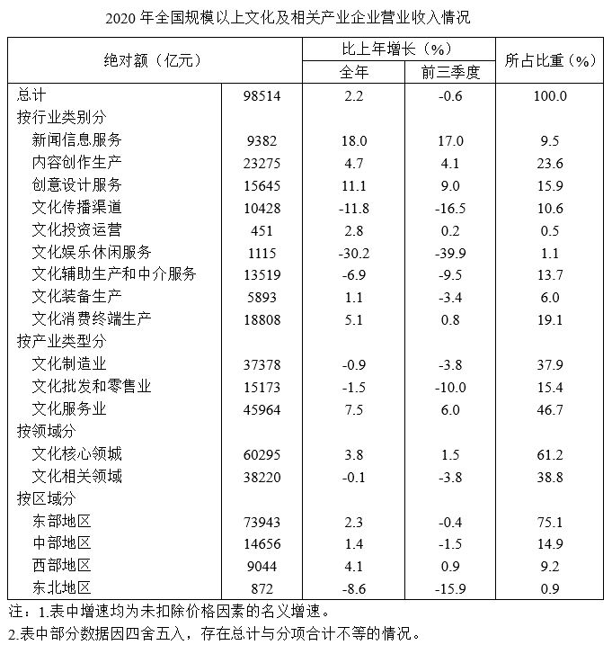

### 第 1 题　qid 5519033 · 综合

2019年全国规模以上文化及相关产业企业营业收入为多少亿元？

- **A**. 96346
- **B**. 96393　✅
- **C**. 100681
- **D**. 100730

**答案**：B

**官方解析**

根据题干“2019年······为多少亿元”，结合材料时间为2020年，可判定本题为基期计算问题。定位统计表可得：2020年全国规模以上文化及相关产业企业营业收入98514亿元，比上年增长2.2%。根据公式：基期量，则所求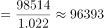亿元。

注：本题由于选项差距很小，故需要精确计算。

故正确答案为B。

---

### 第 2 题　qid 5519035 · 比重

2019年全国规模以上文化及相关产业企业营业收入中，文化核心领域收入所占比重区间为（    ）。

- **A**. 50%~59%
- **B**. 60%~69%　✅
- **C**. 70%~79%
- **D**. 80%~89%

**答案**：B

**官方解析**

根据题干“2019年······中······所占比重区间为”，结合材料时间为2020年，可判定本题为基期比重问题。定位统计表可得：2020年全国规模以上文化及相关产业企业营业收入比上年增长2.2%（b），文化核心领域收入比上年增长3.8%（a），所占比重61.2%（）。根据公式：基期比重，则题干所求，在B项范围内。

故正确答案为B。

---

### 第 3 题　qid 5519037 · 增长

按行业类别分，2020年全国规模以上文化及相关产业企业营业收入绝对额同比实现正增长的行业类别个数为：

- **A**. 6　✅
- **B**. 7
- **C**. 8
- **D**. 9

**答案**：A

**官方解析**

定位统计表可得，2020年全国规模以上文化及相关产业企业营业收入绝对额同比实现正增长的行业有：新闻信息服务（18.0%）、内容创作生产（4.7%）、创意设计服务（11.1%）、文化投资运营（2.8%）、文化装备生产（1.1%）、文化消费终端生产（5.1%），共6个。
故正确答案为A。

---

### 第 4 题　qid 5519044 · 综合

2019年全国规模以上文化及相关产业企业营业收入中，以下行业类别营业收入绝对额的大小关系正确的是：

- **A**. 创意设计服务>文化传播渠道>文化辅助生产和中介服务
- **B**. 创意设计服务>文化辅助生产和中介服务>文化传播渠道
- **C**. 文化辅助生产和中介服务>创意设计服务>文化传播渠道　✅
- **D**. 文化传播渠道>创意设计服务>文化辅助生产和中介服务

**答案**：C

**官方解析**

根据题干“2019年······以下行业类别营业收入绝对额的大小关系······”，结合材料时间为2020年，可判定本题为基期比较问题。定位统计表可得，2020年创意设计服务营业收入15645亿元，同比增速为11.1%，文化传播渠道营业收入10428亿元，同比增速为-11.8%，文化辅助生产和中介服务营业收入13519亿元，同比增速为-6.9%。根据公式：基期量可知，2019年创意设计服务营业收入亿元，文化传播渠道营业收入亿元，文化辅助生产和中介服务营业收入亿元。从大到小排序为：文化辅助生产和中介服务&gt;创意设计服务&gt;文化传播渠道。

故正确答案为C。

---

### 第 5 题　qid 5519051 · 综合

对于2020年全国规模以上文化及相关产业企业营业收入，能够从上述资料中推出的是：

- **A**. 按行业类别分，服务类的营业收入比重不超过40%
- **B**. 按产业类型分，文化制造与文化服务业营业收入差距相比上年进一步减小
- **C**. 按行业类别分，内容创作生产营业收入增长的绝对额最多
- **D**. 按区域分，西部地区相比上年增长率最大　✅

**答案**：D

**官方解析**

A项：定位统计表可得，2020年，按行业类别分，新闻信息服务营业收入占比9.5%、创意设计服务营业收入占比15.9%、文化娱乐休闲服务营业收入占比1.1%，文化辅助生产和中介服务营业收入占比13.7%。则服务类的营业收入比重为9.5%＋15.9%＋1.1%＋13.7%=40.2%&gt;40%，错误；

B项：定位统计表可得，2020年，文化制造业营业收入37378亿元，同比增速为-0.9%，文化服务业营业收入45964亿元，同比增速为7.5%。2020年文化制造与文化服务业营业收入差距为45964-37378=8586亿元，2019年差距为亿元＜2020年差距（8586亿元），则2020年收入差距相比上年进一步增大，错误；

C项：定位统计表可得，2020年，新闻信息服务营业收入9382亿元，同比增速为18.0%，内容创作生产营业收入23275亿元，同比增速为4.7%。根据公式：增长量，可得新闻信息服务营业收入的同比增量亿元；内容创作生产营业收入的同比增量亿元。内容创作生产营业收入增长的绝对额（1058亿元）&lt;新闻信息服务营业收入增长的绝对额（1422亿元），错误；

D项：定位统计表可得，2020年，东部、中部、西部、东北地区营业收入的同比增速分别为2.3%、1.4%、4.1%、-8.6%。西部地区相比上年增长率最大，正确。

故正确答案为D。

---

## 材料 2

        2020年1~12月，中国新能源汽车市场共计72家动力电池企业实现装车配套，其中排名前3家、前5家、前10家的企业动力电池装车量分别占总装车量的71.3%、82.1%和91.8%。

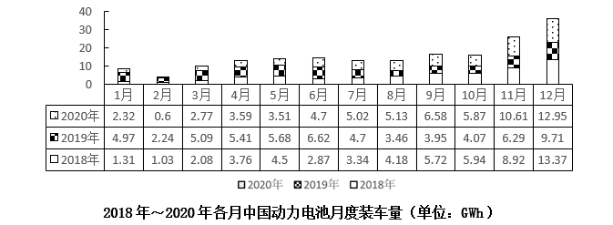

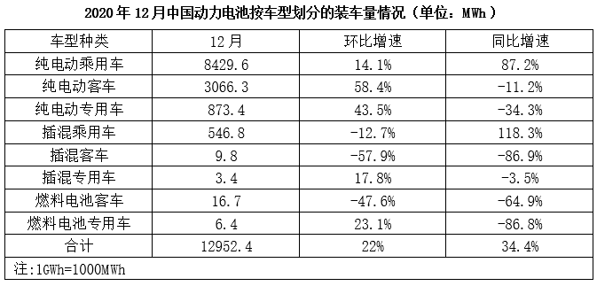

### 第 6 题　qid 5519058 · 综合

2020年我国新能源汽车市场实现装车配套的动力电池企业中，排名第6~10的企业，其动力电池装车总量是排名前五企业的：

- **A**. 17%
- **B**. 15%
- **C**. 12%　✅
- **D**. 9%

**答案**：C

**官方解析**

根据题干“2020年······是······的”，结合选项为百分数，可判定本题为比值计算问题。定位文字材料可得：2020年我国新能源汽车市场实现装车配套的动力电池企业中，排名前5家、前10家的企业动力电池装车量分别占总装车量的82.1%和91.8%。则题干所求。

故正确答案为C。

---

### 第 7 题　qid 5519061 · 增长

2018~2020年间，12月份动力电池装车量的环比增速超过50%的年度有几个？

- **A**. 0个
- **B**. 1个　✅
- **C**. 2个
- **D**. 3个

**答案**：B

**官方解析**

根据题干“······环比增速超过50%的年度有几个”，可判定本题为一般增长率问题。定位图形材料可知2018~2020年各年11月份、12月份的动力电池装车量。根据公式：增长率，则2018~2020年间，12月份动力电池装车量的环比增速分别为：

2018年，；

2019年，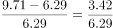；

2020年，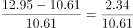。

综上，环比增速超过50%的年度仅有2019年，共1个。

故正确答案为B。

---

### 第 8 题　qid 5519064 · 综合

2019年12月，我国插混客车的日均动力电池装车量约为（    ）。

- **A**. 2.4MWh　✅
- **B**. 2.6MWh
- **C**. 2.8MWh
- **D**. 3.1MWh

**答案**：A

**官方解析**

根据题干“2019年12月······日均······约为”，结合材料给出2020年12月相关数据，可判定本题为基期平均数问题。定位表格材料可得：2020年12月，我国插混客车动力电池装车量为9.8MWh，同比增速为-86.9%。根据公式：基期量，可得2019年12月我国插混客车动力电池装车量MWh，12月有31天，则题干所求MWh。

故正确答案为A。

---

### 第 9 题　qid 5519067 · 增长

2020年1~12月，我国动力电池装车量同比差值最大的月份，装车量同比增长近（    ）。

- **A**. 七成　✅
- **B**. 六成
- **C**. 五成
- **D**. 四成

**答案**：A

**官方解析**

根据题干“2020年1~12月······同比增长近”，结合选项为成数，可判定本题为一般增长率问题。定位图形材料可得2019年1~12月和2020年1~12月我国动力电池月度装车量。则2020年1~12月我国动力电池装车量同比差值分别为：1月，4.97-2.32=2.65GWh；2月，2.24-0.6=1.64GWh；3月，5.09-2.77=2.32GWh；4月，5.41-3.59=1.82GWh；5月，5.68-3.51=2.17GWh；6月，6.62-4.7=1.92GWh；7月，5.02-4.7=0.32GWh；8月，5.13-3.46=1.67GWh；9月，6.58-3.95=2.63GWh；10月，5.87-4.07=1.8GWh；11月，10.61-6.29=4.32GWh；12月，12.95-9.71=3.24GWh。比较可知，2020年11月同比差值最大，根据公式：增长率，可得2020年11月我国动力电池装车量同比增长率，即增长近七成。

故正确答案为A。

---

### 第 10 题　qid 5519072 · 综合

据所给资料推断，下列表述正确的是（    ）。

- **A**. 2020年下半年，我国动力电池装车量月平均增长约1.3GWh
- **B**. 2018～2020年各年中，我国动力电池的装车量都是逐季度递增
- **C**. 2020年12月我国动力电池装车量同比递增主要归功于插混乘用车
- **D**. 2020年12月我国动力电池装车量中纯电动车电池装车量占比超95%　✅

**答案**：D

**官方解析**

A项：定位图形材料可得2020年6-12月我国动力电池装车量。根据公式：增长量=现期量-基期量，由于2020年下半年为7月1日-12月31日，则现期为12月末，基期为7月初（即6月末）。则2020年下半年，我国动力电池装车量月均增长量GWh，错误；

B项：定位图形材料可得2018~2020年我国动力电池月度装车量。则2019年二季度我国动力电池装车量=5.41+5.68+6.62=17.71GWh，三季度我国动力电池装车量=4.7+3.46+3.95=12.11GWh，比较可知，我国动力电池的装车量并非逐季度递增，错误；

C项：定位表格材料可得，2020年12月我国插混乘用车动力电池装车量为546.8MWh，同比增长118.3%；纯电动乘用车动力电池装车量为8429.6MWh，同比增长87.2%。根据公式：增长量，则2020年12月插混乘用车动力电池装车量同比增量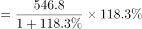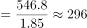MWh，纯电动乘用车同比增量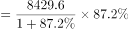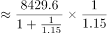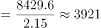MWh，前者低于后者，则2020年12月我国动力电池装车量同比递增并非主要归功于插混乘用车，错误；

D项：定位表格材料可得，2020年12月我国动力电池装车量为12952.4MWh，其中，纯电动乘用车动力电池装车量为8429.6MWh，纯电动客车动力电池装车量为3066.3MWh，纯电动专用车动力电池装车量为873.4MWh。根据公式：比重，则2020年12月我国动力电池装车量中纯电动车电池装车量占比，正确。

故正确答案为D。

注：A项，在题干无明确说明的情况下一般问与“月”相关默认为“环比”；与“年”相关默认为“同比”。

---

### 第 11 题　qid 5518365 · 增长

某企业2020年营业收入比上年降低了10%，但国家减税降费政策使成本比上年降低了20%。若2019年该企业的利润率为20%，则2020年该企业的利润率为多少？

- **A**. 25%
- **B**. 30%
- **C**. 35%　✅
- **D**. 40%

**答案**：C

**官方解析**

赋值该企业2019年的成本为100，根据题干条件可列表如下：

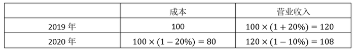

根据公式“利润率”，则2020年该企业的利润率。

故正确答案为C。

---
