# 2021年重庆市选调优秀大学生到基层工作考试《行测》题

> 资料分析 · 10 题 · 选调 2021

## 材料 1

        2017年，M省固定资产投资（不含农户）31328.1亿元，比上年增长13.1%。其中，民间投资18759.6亿元，增长14.5%，占固定资产投资的比重为59.9%。分经济类型看，国有投资10395.0亿元，增长12.3%；非国有投资20933.0亿元，增长13.6%。分投资方向看，民生投资3015.9亿元，增长12.8%；生态投资1402.5亿元，增长12.5%；基础设施投资8517.4亿元，增长15.9%；高新技术产业投资2213.0亿元，增长24.7%；工业技改投资6130.2亿元，增长3.9%；战略性新兴产业投资7258.4亿元，增长13.5%。分区域看，A地区投资12395.3亿元，增长13.2%；B地区投资7110.4亿元，增长13.5%；C地区投资5232.7亿元，增长13.8%；D地区投资6429.4亿元，增长14.0%。施工项目共有58178个，比上年增长16.4%。其中，新开工项目43966个，增长7.5%。投产项目42862个，增长28.4%。2017年，M省房地产开发投资3426.1亿元，比上年增长15.9%，其中，住宅投资2194.4亿元，增长17.3%。商品房销售面积8532.3万平方米，增长5.5%，其中，住宅销售面积7368.3万平方米，增长2.5%。商品房销售额4460.7亿元，增长18.9%，其中，住宅销售额3570.8亿元，增长14.7%。年末商品房待售面积2015.5万平方米，下降30.5%，比上年末减少886.0万平方米。

### 第 1 题　qid 4674806 · 综合

2016年M省固定资产投资（不含农户）约为（    ）亿元。

- **A**. 27699.5　✅
- **B**. 31328.1
- **C**. 27712.2
- **D**. 28233.6

**答案**：A

**官方解析**

根据题干“2016年······约为······亿元”，结合材料时间为2017年，可判定本题为基期计算问题。定位文字材料可得：2017年，M省固定资产投资（不含农户）31328.1亿元，比上年增长13.1%。根据公式：基期量，则2016年M省固定资产投资（不含农户）亿元，对应A项。

故正确答案为A。

---

### 第 2 题　qid 4674807 · 比重

2016年M省固定资产投资（不含农户）中，民间投资占比约为（    ）。

- **A**. 59.76%
- **B**. 62.18%
- **C**. 59.15%　✅
- **D**. 33.58%

**答案**：C

**官方解析**

根据题干“2016年······中······占比约为”，结合材料时间为2017年，可判定本题为基期比重计算问题。定位文字材料可得：2017年，M省固定资产投资（不含农户）31328.1亿元（B），比上年增长13.1%（b）。其中，民间投资18759.6亿元（A），增长14.5%（a），占固定资产投资的比重为59.9%（）。根据公式：基期比重，则所求比重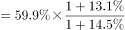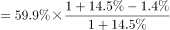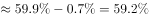，与C项最接近。

故正确答案为C。

---

### 第 3 题　qid 4674808 · 增长

2017年M省固定资产投资（不含农户）中，基础设施投资同比增量约为（    ）亿元。

- **A**. 1150
- **B**. 1168　✅
- **C**. 1263
- **D**. 1190

**答案**：B

**官方解析**

根据题干“2017年······同比增量约为（    ）亿元”，可判定本题为增长量计算问题。定位文字材料可得：2017年，基础设施投资8517.4亿元，增长15.9%。根据公式：增长量，则2017年M省固定资产投资（不含农户）中，基础设施投资同比增量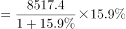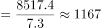亿元，与B项最接近。

故正确答案为B。

---

### 第 4 题　qid 4674810 · 增长

2017年M省固定资产投资（不含农户）中，从投资方向看，下列增幅最小的是：

- **A**. 民生投资
- **B**. 生态投资
- **C**. 基础设施投资
- **D**. 工业技改投资　✅

**答案**：D

**官方解析**

定位文字材料可得：2017年，M省固定资产投资（不含农户）31328.1亿元，分投资方向看，民生投资3015.9亿元，增长12.8%；生态投资1402.5亿元，增长12.5%；基础设施投资8517.4亿元，增长15.9%；工业技改投资6130.2亿元，增长3.9%。比较可知，增幅最小的为工业技改投资（3.9%）。
故正确答案为D。

---

### 第 5 题　qid 4674811 · 增长

以下描述中不正确的个数有（    ）。
（1）2017年M省房地产开发投资增量比住宅投资增量多100亿元以上
（2）2016年M省固定资产投资（不含农户）中，高新技术产业投资增速最大
（3）2017年M省固定资产投资（不含农户）中，分区域看，A地区投资增长率最快
（4）2017年M省每平方米商品房销售均价低于6000元

- **A**. 1个
- **B**. 2个　✅
- **C**. 3个
- **D**. 4个

**答案**：B

**官方解析**

（1）定位文字材料可得：2017年M省房地产开发投资3426.1亿元，比上年增长15.9%，其中，住宅投资2194.4亿元，增长17.3%。根据公式：增长量，则2017年M省房地产开发投资增量比住宅投资增量多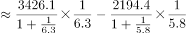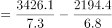亿元，正确；

（2）材料中只给出了2017年M省固定资产投资（不含农户）中各产业投资的现期量和同比增速，故无法比较2016年M省固定资产投资（不含农户）中各产业投资的同比增速，错误；

（3）定位文字材料可得：2017年M省固定资产投资（不含农户）31328.1亿元，分区域看，A地区投资12395.3亿元，增长13.2%；B地区投资7110.4亿元，增长13.5%；C地区投资5232.7亿元，增长13.8%；D地区投资6429.4亿元，增长14.0%。比较可知，A地区投资增长率（13.2%）最慢，错误；

（4）定位文字材料可得：2017年M省商品房销售面积8532.3万平方米，商品房销售额4460.7亿元。则2017年M省每平方米商品房销售均价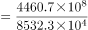元/平方米元/平方米，正确。

综上所述，不正确的有（2）（3），共2个。

故正确答案为B。

---

## 材料 2

        某市学生招生毕业均在9月份，2019年末有普通高校2所，普通本专科（不含成人）在校生22555人。高考文理本科达线率为50.14%。各类中等职业教育（不含技工学校）16所，在校生16079人。普通高中19所，在校生20387人，高中阶段毛入学率108.51%。普通初中101所，在校生33552人，初中阶段适龄人口入学率100%。小学129所，在校生68523人，小学学龄儿童入学率100%。幼儿园176所，在校生36719人，学前三年毛入园率102.01%。特殊教育学校2所，在校生112人。

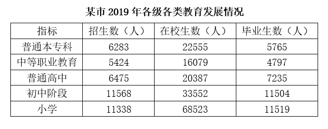

### 第 6 题　qid 4674812 · 综合

2019年末该市每所小学约有多少人？

- **A**. 531　✅
- **B**. 332
- **C**. 1073
- **D**. 1005

**答案**：A

**官方解析**

根据题干“2019年末······每所小学约有多少人”，可判定本题为现期平均数问题。定位文字材料可得，2019年末该市小学129所，在校生68523人。根据公式：平均数，则每所小学人数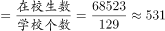人。

故正确答案为A。

---

### 第 7 题　qid 4674813 · 综合

该市高校毕业生数比招生数少：

- **A**. 508人
- **B**. 627人
- **C**. 8.24%　✅
- **D**. 8.99%

**答案**：C

**官方解析**

根据题干“······毕业生数比招生数少”，结合选项为多少人及百分数，可判定本题为简单加减计算及增长率计算问题。定位表格材料可得，2019年该市普通本专科（高校）招生数6283人，毕业生数5765人，则毕业生数比招生数少6283-5765=518人，排除A、B两项；毕业生数比招生数少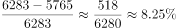，与C项最接近。

故正确答案为C。

---

### 第 8 题　qid 4674814 · 综合

2019年初该市普通高中在校生数是多少人？

- **A**. 20387
- **B**. 33552
- **C**. 19627
- **D**. 21147　✅

**答案**：D

**官方解析**

定位文字及表格材料可得，2019年末该市普通高中在校生20387人，2019年普通高中招生数6475人，毕业生数7235人，则2019年初在校生数=2019年末在校生数-2019年招生数+2019年毕业生数=20387-6475+7235=21147人。
故正确答案为D。

---

### 第 9 题　qid 4674815 · 综合

2019年末该市各类教育在校生人数共有多少人？

- **A**. 197927　✅
- **B**. 212365
- **C**. 186524
- **D**. 201386

**答案**：A

**官方解析**

定位文字材料可得，2019年末该市普通本专科（不含成人）在校生22555人，各类中等职业教育（不含技工学校）在校生16079人，普通高中在校生20387人，普通初中在校生33552人，小学在校生68523人，幼儿园在校生36719人，特殊教育学校在校生112人，则各类教育在校生共有22555+16079+20387+33552+68523+36719+112=197927人。
（可通过计算尾数为7，快速排除B、C、D三项。）
故正确答案为A。

---

### 第 10 题　qid 4674816 · 综合

下列说法正确的是：

- **A**. 2019年末该市各类在校生人数最少的是中等职业教育学校
- **B**. 2019年该市小学毕业生数比普通本专科毕业生数约多2倍
- **C**. 根据表格资料，毕业生数与招生数相差最多的是普通本专科
- **D**. 2019年末该市各类教育共有445所　✅

**答案**：D

**官方解析**

A项：定位文字材料可得，2019年末该市各类中等职业教育（不含技工学校）在校生16079人，特殊教育学校在校生112人，在校生人数最少的是特殊教育学校，不是中等职业教育学校，错误；

B项：定位表格材料可得，2019年该市小学毕业生数11519人，普通本专科毕业生数5765人，前者比后者多倍，错误；

C项：定位表格材料可得，2019年该市普通本专科招生数6283人，毕业生数5765人，毕业生数与招生数相差6283-5765=518人；中等职业教育招生数5424人，毕业生数4797人，毕业生数与招生数相差5424-4797=627人＞518人，则相差最多的不是普通本专科，错误；

D项：定位文字材料可得，2019年末该市有普通高校2所，各类中等职业教育（不含技工学校）16所，普通高中19所，普通初中101所，小学129所，幼儿园176所，特殊教育学校2所，则各类教育共有2+16+19+101+129+176+2=445所，正确。

故正确答案为D。

---
