# 2022年上海市公务员录用考试《行测》题（B类）（网友回忆版）

> 资料分析 · 3 题 · 上海 2022

## 材料 1

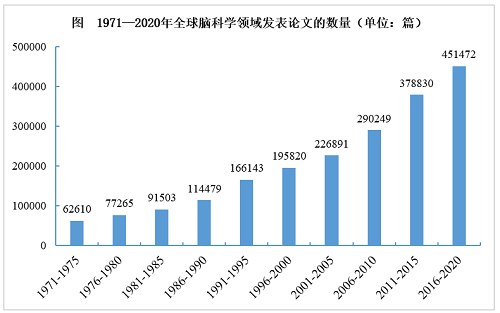

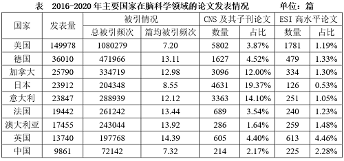

### 第 1 题　qid 4651934 · 增长

1976至2020年期间，全球脑科学领域五年论文发表量的同比增长量最多的是：

- **A**. 1991-1995
- **B**. 2006-2010
- **C**. 2011-2015　✅
- **D**. 2016-2020

**答案**：C

**官方解析**

根据题干“1976至2020年期间······同比增长量最多”，判定本题为增长量比较问题。定位统计图，可知各时间段全球脑科学领域五年论文发表量。根据公式：增长量=现期量-基期量，可得下列年份全球脑科学领域五年论文发表量的增长量分别为

1991-1995年：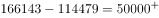篇；

2006-2010年：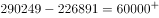篇；

2011-2015年：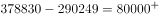篇；

2016-2020年：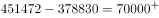篇。

则增长量最多为2011-2015年。

故正确答案为C。

---

### 第 2 题　qid 4651953 · 增长

下列选项中，图（    ）展示了2001-2020年间全球脑科学领域发表论文数量的同比增长情况。

- **A**. 
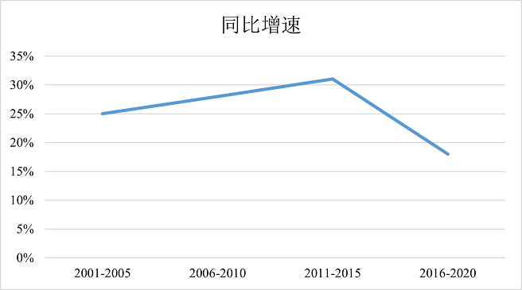

- **B**. 
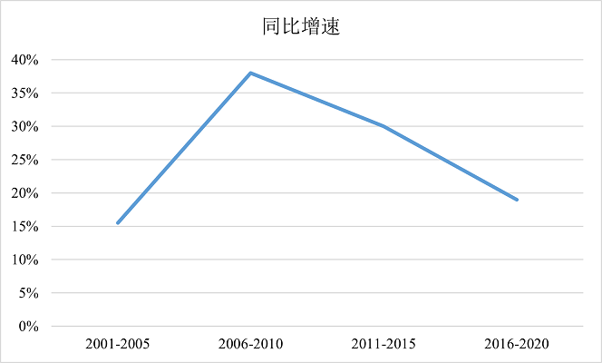

- **C**. 
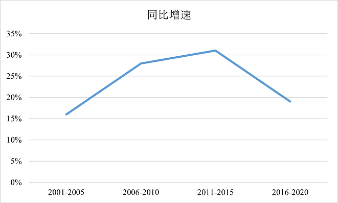
　✅
- **D**. 
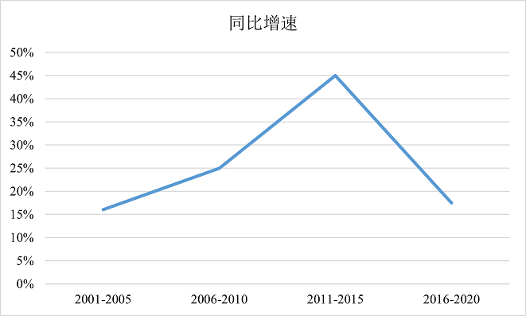

**答案**：C

**官方解析**

根据题干“2001-2020年间······同比增长情况”，结合选项为图表且数据都为百分数，可判定本题为一般增长率问题。定位统计图，可知各时间段全球脑科学领域发表论文的数量。代入公式：增长率，则2001-2005年、2006-2010年、2011-2015年、2016-2020年全球脑科学领域发表论文数量的同比增长率分别为

2001-2005年：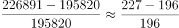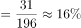；

2006-2010年：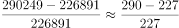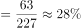；

2011-2015年：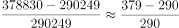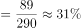；

2016-2020年：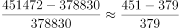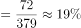。

结合选项，只有C项符合。

故正确答案为C。

---

### 第 3 题　qid 4651954 · 增长

按照全球脑科学领域论文发表量上个五年的同比增速预测，2021-2025年我国在脑科学领域的论文发表数量约为（    ）万篇。

- **A**. 1.2　✅
- **B**. 2.1
- **C**. 8.6
- **D**. 9.4

**答案**：A

**官方解析**

根据题干“按······同比增速预测······2021-2025年······发表数量约为······万篇“，判定本题为现期追赶问题。定位统计图可知：2016-2020年全球脑科学领域发表论文的数量为451472篇，2011-2015年为378830篇，则2016-2020年全球脑科学领域论文发表量的同比增长率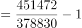。定位表统计表可知：2016-2020年我国在脑科学领域的论文发表量为9861篇，代入公式：现期量=基期量×（1+增长率），则题干所求为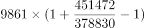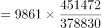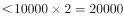篇，即小于2万篇，只有A项符合。

故正确答案为A。

---
