# 2022年北京市公务员录用考试《行测》题（网友回忆版）

> 资料分析 · 20 题 · 北京 2022

## 材料 1

### 第 1 题　qid 4652159 · 综合

2020年该行业销售费用约是管理、财务费用之和的多少倍？

- **A**. 2.5　✅
- **B**. 2.9
- **C**. 3.4
- **D**. 4.0

**答案**：A

**官方解析**

根据题干“2020年······约是······的多少倍”，结合材料时间为2020年，可判定本题为现期倍数问题。定位表格材料可得：2020年1-12月该行业销售费用为4635.6亿元，管理费用为1575.1亿元，财务费用为250.2亿元。则所求倍数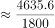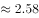倍，最接近A项。

故正确答案为A。

---

### 第 2 题　qid 4652166 · 比重

以下饼图中，最能准确反映2020年7月该行业销售（用白色表示）、管理（用灰色表示）和财务（用黑色表示）费用占比关系的是：

- **A**. 

　✅
- **B**. 

- **C**. 

- **D**. 

**答案**：A

**官方解析**

根据题干“······2020年7月······占比关系······”，结合材料时间为2020年，可判定本题为现期比重问题。定位表格材料可知，2020年1-6月与1-7月销售、管理和财务费用累计值。2020年7月值＝2020年1-7月累计值2020年1-6月累计值，则2020年7月销售费用为2429.5-2064.5=365亿元，管理费用为809.3-687.6=121.7亿元，财务费用为123.7-102.0=21.7亿元。管理费用远大于财务费用，排除C、D两项；销售费用占比，排除B项。

故正确答案为A。

---

### 第 3 题　qid 4652169 · 综合

在该行业销售费用、管理费用和财务费用三项费用中，2020年前7个月费用额不到全年总额一半的有几项？

- **A**. 0
- **B**. 1　✅
- **C**. 2
- **D**. 3

**答案**：B

**官方解析**

根据题干“······2020年前7个月······不到全年总额一半的有几项”，结合材料时间为2020年，可判定本题为现期比重问题。根据公式：比重，定位表格材料可得，2020年前7个月该行业销售费用、管理费用和财务费用占全年总额的比重分别为：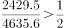、、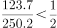，符合题意的共有1项。

故正确答案为B。

---

### 第 4 题　qid 4652171 · 综合

2020年下半年该行业财务费用最高的月份是：

- **A**. 9月
- **B**. 10月
- **C**. 11月　✅
- **D**. 12月

**答案**：C

**官方解析**

定位表格材料可得：2020年1-8月、1-9月、1-10月、1-11月、1-12月该行业财务费用分别为148.5亿元、174.5亿元、198.2亿元、225.3亿元、250.2亿元。则9月、10月、11月、12月该行业财务费用分别如下：

9月财务费用=1-9月财务费用1-8月财务费用=174.5-148.5=26.0亿元；

10月财务费用=1-10月财务费用1-9月财务费用=198.2-174.5=23.7亿元；

11月财务费用=1-11月财务费用1-10月财务费用=225.3-198.2=27.1亿元；

12月财务费用=1-12月财务费用1-11月财务费用=250.2-225.3=24.9亿元。

则2020年下半年该行业财务费用最高的月份是11月。

故正确答案为C。

---

### 第 5 题　qid 4652176 · 综合

关于2020年该行业销售、管理和财务费用，能够用上述资料中推出的是：

- **A**. 二季度销售费用低于一季度水平
- **B**. 四季度每个月的销售费用都超过400亿元
- **C**. 管理费用累计超过1000亿元是在第四季度
- **D**. 二季度各月，财务费用逐月递减　✅

**答案**：D

**官方解析**

A项：定位表格材料可得，1-3月累计销售费用为973.2亿元；1-6月累计销售费用为2064.5亿元。则二季度销售费用=1-6月累计销售费用1-3月累计销售费用=2064.5-973.2=1091.3亿元＞973.2亿元，故二季度销售费用高于一季度水平，错误；

B项：定位表格材料可得，1-9月累计至1-12月累计销售费用分别为：3297.9亿元、3674.3亿元、4107.1亿元、4635.6亿元。则10月销售费用=1-10月累计销售费用1-9月累计销售费用=3674.3-3297.9=376.4亿元＜400亿元，四季度每个月的销售费用并非都超过400亿元，错误；

C项：定位表格材料可得，1-9月累计管理费用为1070.9亿元＞1000亿元，故管理费用累计超过1000亿元在第三季度，并非第四季度，错误；

D项：定位表格材料可得，1-3月累计至1-6月累计财务费用分别为：49.6亿元、70.6亿元、88.2亿元、102.0亿元，故4月财务费用=1-4月累计财务费用1-3月累计财务费用=70.6-49.6=21亿元，同理，5月财务费用=88.2-70.6=17.6亿元，6月财务费用=102.0-88.2=13.8亿元。观察发现：二季度各月财务费用逐月递减，正确。

故正确答案为D。

---

## 材料 2

        2020年末S省就业人口4750.9万人，占常住人口总数的59.01%，与2019年末相比，就业人口占常住人口总数的比重下降0.24个百分点。

        2020年末S省第一产业、第二产业和第三产业的就业人口数量分别为764.89万人、2033.39万人、1952.62万人，与2019年末相比，第一、第二产业就业人口比重分别下降0.7个、0.1个百分点，第三产业就业人口比重上升0.8个百分点。

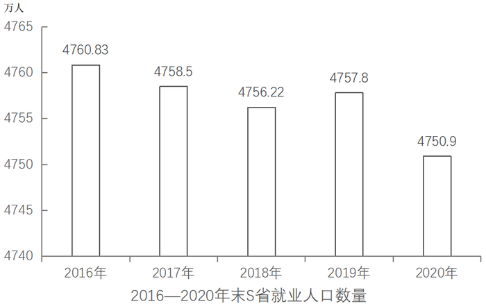

### 第 6 题　qid 4652179 · 综合

2019年末S省常住人口总数约为多少万人？

- **A**. 7910
- **B**. 8030　✅
- **C**. 8096
- **D**. 8199

**答案**：B

**官方解析**

根据题干“2019年末······约为多少万人”，结合材料给出2019年末S省就业人口与比重的相关数据，可判定本题为现期比重问题。定位文字材料第一段可知：2020年末S省就业人口占常住人口总数的59.01%，与2019年末相比，就业人口占常住人口总数的比重下降0.24个百分点；定位图形材料可知：2019年末S省就业人口数量为4757.8万人。根据公式：整体，可得2019年末S省常住人口总数为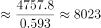万人，与B项最接近。

故正确答案为B。

---

### 第 7 题　qid 4652182 · 比重

2020年末S省第二产业就业人口在就业人口中的占比比第三产业约高：

- **A**. 0.5个百分点
- **B**. 1.7个百分点　✅
- **C**. 3.5个百分点
- **D**. 5.1个百分点

**答案**：B

**官方解析**

根据题干“2020年末······占比······”，结合材料时间为2020年末，可判定本题为现期比重问题。定位文字材料第一段可知：2020年末S省就业人口4750.9万人；定位文字材料第二段可知：2020年末S省第二产业和第三产业的就业人口数量分别为2033.39万人和1952.62万人。根据公式：比重，可得2020年末S省第二产业就业人口在就业人口中的占比与第三产业占比的差值为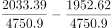，即高1.7个百分点。

故正确答案为B。

---

### 第 8 题　qid 4652186 · 增长

2020年末S省第一产业就业人口同比：

- **A**. 减少了不到50万人　✅
- **B**. 减少了50万人以上
- **C**. 增加了不到50万人
- **D**. 增加了50万人以上

**答案**：A

**官方解析**

根据题干“2020年末······同比”，结合选项为增加/减少+单位，可判定本题为增长量计算问题。定位文字材料第二段可知：2020年末S省第一产业的就业人口数量为764.89万人，与2019年末相比，就业人口比重下降0.7个百分点；定位图形材料可知：2019年末、2020年末S省就业人口数量分别为4757.8万人、4750.9万人。根据公式：比重，可得2020年末S省第一产业的就业人口数量占就业人口的比重，则2019年末S省第一产业的就业人口数量占就业人口的比重＝16.1%+0.7%=16.8%。根据公式：部分＝整体×比重，可得2019年末S省第一产业的就业人口数量为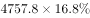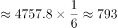万人。则2020年末S省第一产业就业人口同比减少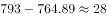万人，即减少了不到50万人。

故正确答案为A。

---

### 第 9 题　qid 4652190 · 综合

2020年末S省未就业常住人口数量约为第三产业就业人口的多少倍？

- **A**. 1.4
- **B**. 1.5
- **C**. 1.7　✅
- **D**. 1.9

**答案**：C

**官方解析**

根据题干“2020年末S省······为······的多少倍”，可判定本题为现期倍数问题。定位文字材料第一段可知：2020年末S省就业人口4750.9万人，占常住人口总数的59.01%；定位文字材料第二段可知：2020年末S省第三产业的就业人口数量为1952.62万人。根据：整体，可得2020年末S省常住人口总数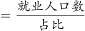万人，则2020年末S省未就业常住人口数量=常住人口总数-就业人口数万人。因此所求倍数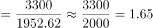，与C项最接近。

故正确答案为C。

---

### 第 10 题　qid 4652192 · 综合

能够从上述资料中推出的是：

- **A**. 2020年末S省第一产业就业人口占就业人口的15%以下
- **B**. 2018年末S省就业人口同比增量低于上年同期数值
- **C**. 2019年末S省就业人口数量较上年增长0.1%以上
- **D**. 2020年末S省第二产业就业人口比上年减少0.1%以上　✅

**答案**：D

**官方解析**

A项：定位文字材料可知：2020年末S省就业人口4750.9万人，第一产业的就业人口数量为764.89万人。根据公式：比重，可得2020年末S省第一产业就业人口占就业人口的比重为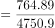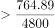，错误；

B项：定位图形材料可知：2016—2018年末S省就业人口数量分别为4760.83万人、4758.5万人、4756.22万人。根据公式：增长量=现期量-基期量，可得2018年末S省就业人口同比增量=4756.22-4758.5=-2.28万人，2017年末S省就业人口同比增量=4758.5-4760.83=-2.33万人。-2.28&gt;-2.33，即2018年末S省就业人口同比增量高于上年同期数值，错误；

C项：定位图形材料可知：2018、2019年末S省就业人口数量分别为4756.22万人、4757.8万人，则所求增长率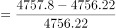，错误；

D项：定位图形材料可知：2019、2020年末S省就业人口数量分别为4757.8万人、4750.9万人，则2020年末S省就业人口同比增长率为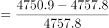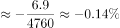。定位文字材料可知：第二产业就业人口所占比重下降，根据两期比重比较结论“当部分增长率＜整体增长率时，比重下降”，则2020年末S省第二产业就业人口同比增长率＜S省就业人口同比增长率（-0.14%），即2020年末S省第二产业就业人口比上年减少0.1%以上，正确。

故正确答案为D。

---

## 材料 3

        2019年A市专利密集型产业实现增加值6918.8亿元，比上年增长9.6%，分别高于战略性新兴产业、高技术产业增加值增速2.3个和1.7个百分点；专利密集型产业增加值占GDP的比重为19.5%，比上年提高0.4个百分点。

        2019年专利密集型产业发明专利申请量占专利申请总量的比重为66%，比规模以上重点企业高5.1个百分点。专利密集型产业每亿元R&amp;D经费产生的发明专利申请量为73.1件，比规模以上重点企业高3.6件；企业户均拥有有效发明专利15.6件，是规模以上重点企业的2.2倍。从成果转化看，已被成功实施的发明专利数为5.2万件，占有效发明专利数的58.4%。

        在专利密集型产业中，2019年信息通信技术服务业实现营业收入10198.5亿元，增速达41.3%；实现利润197.6亿元，比上年增长1倍；单位企业实现营业收入12亿元，是专利密集型产业平均水平的3.3倍。

        在专利密集型产业中，2019年医药医疗产业营业收入、利润分别增长13.7%和5%；收入利润率达到17%，高于专利密集型产业平均水平4.1个百分点；单位企业营业收入、利润分别为4.5亿元和0.76亿元。

### 第 11 题　qid 4652174 · 增长

2019年A市专利密集型产业实现增加值比上年约增长多少亿元？

- **A**. 413
- **B**. 502
- **C**. 606　✅
- **D**. 698

**答案**：C

**官方解析**

根据题干“······比上年约增长多少亿元”，可判定本题为增长量计算问题。定位文字材料第一段可知：2019年A市专利密集型产业实现增加值6918.8亿元，比上年增长9.6%。代入公式：增长量，可得2019年A市专利密集型产业实现增加值比上年增长了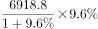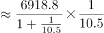亿元，与C项最接近。

故正确答案为C。

---

### 第 12 题　qid 4652175 · 比重

现已知2019年A市①专利密集型产业专利申请总量、②专利密集型产业R&D经费占专利密集型产业实现增加值的比重。如果想得到当年A市专利密集型产业发明专利申请量的数值，下列说法正确的是：

- **A**. 补充①可以得到，补充②不可以得到
- **B**. 补充①不可以得到，补充②可以得到
- **C**. 补充①和②中任一条可以得到　✅
- **D**. ①和②两条相加才可以得到

**答案**：C

**官方解析**

根据题干“2019年······占······的比重······得到当年A市专利密集型产业发明专利申请量”，结合材料给出“专利密集型产业发明专利申请量占······的比重”，可判定本题为现期比重计算问题。定位文字材料第一段可得：2019年A市专利密集型产业实现增加值6918.8亿元；定位文字材料第二段可得：2019年专利密集型产业发明专利申请量占专利申请总量的比重为66%，专利密集型产业每亿元R&amp;D经费产生的发明专利申请量为73.1件。

令条件①所述量为A件，根据部分=总体×比重，可得A市专利密集型产业发明专利申请量=A×66%件。

令条件②所述比重为m，根据部分=总体×比重，可得A市专利密集型产业R&amp;D经费为6918.8m亿元；由于专利密集型产业每亿元R&amp;D经费产生的发明专利申请量，故发明专利申请量为73.1×6918.8m件。

补充①和②中任意一条都可以得到。

故正确答案为C。

---

### 第 13 题　qid 4652178 · 平均数

2019年A市专利密集型产业企业户均拥有已被成功实施的发明专利约多少件？

- **A**. 9　✅
- **B**. 10
- **C**. 11
- **D**. 12

**答案**：A

**官方解析**

根据题干“2019年······户均······”，可判定本题为现期平均数问题。定位文字材料第二段可得：2019年A市专利密集型产业企业户均拥有有效发明专利15.6件，已被成功实施的发明专利数为5.2万件，占有效发明专利数的58.4%。根据公式：平均数，可得户均拥有已被成功实施的发明专利数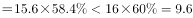件，只有A项符合。

故正确答案为A。

---

### 第 14 题　qid 4652180 · 综合

在专利密集型产业中，2019年A市信息通信技术服务业单位企业实现利润额约为多少亿元？

- **A**. 0.18
- **B**. 0.23　✅
- **C**. 0.35
- **D**. 0.59

**答案**：B

**官方解析**

根据题干“······2019年······单位企业实现利润额约为多少亿元”，结合材料时间为2019年，可判定本题为现期平均数问题。定位文字材料第三段可知，（A市）2019年信息通信技术服务业实现营业收入10198.5亿元，实现利润197.6亿元；单位企业实现营业收入12亿元。根据个数，则2019年A市有信息通信技术服务业企业数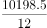家；根据平均数，则2019年A市信息通信技术服务业单位企业实现利润额为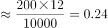亿元，与B项最接近。

故正确答案为B。

---

### 第 15 题　qid 4652181 · 综合

关于A市专利密集型产业发展状况，能够从上述资料中推出的是：

- **A**. 2018年增加值占全市GDP比重为19.9%
- **B**. 2019年发明专利申请量比非发明专利申请量高一倍以上
- **C**. 2018年信息通信技术服务业实现利润超过100亿元
- **D**. 2019年医药医疗产业利润占营业收入的比重低于上年水平　✅

**答案**：D

**官方解析**

A项：定位文字材料第一段可得：2019年A市专利密集型产业增加值占GDP的比重为19.5%，比上年提高0.4个百分点。故2018年A市专利密集型产业增加值占GDP的比重为19.5%-0.4%=19.1%，错误；

B项：定位文字材料第二段可得：2019年专利密集型产业发明专利申请量占专利申请总量的比重为66%。则2019年非发明专利申请量占专利申请总量的比重为1-66%=34%；故所求为倍，即2019年发明专利申请量比非发明专利申请量高不到一倍，错误；

C项：定位文字材料第三段可得：2019年信息通信技术服务业实现利润197.6亿元，比上年增长1倍。故2018年信息通信技术服务业实现利润为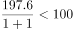亿元，错误；

D项：定位文字材料第四段可得：2019年医药医疗产业营业收入、利润分别增长13.7%（b）和5%（a）。5%&lt;13.7%，结合两期比重比较结论“部分增长率（a）＜总体增长率（b），比重下降”，可得2019年医药医疗产业利润占营业收入的比重低于上年水平，正确。

故正确答案为D。

---

## 材料 4

        耐磨材料可分为金属耐磨材料、陶瓷耐磨材料和树脂耐磨材料，2014—2020年各类耐磨材料的消费量如下表所示：

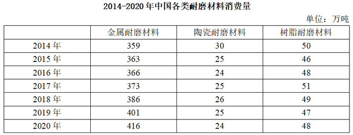

### 第 16 题　qid 4652165 · 综合

2020年中国耐磨材料的产量比消费量：

- **A**. 高不到20万吨　✅
- **B**. 高20万吨以上
- **C**. 低不到20万吨
- **D**. 低20万吨以上

**答案**：A

**官方解析**

定位统计图可得：2020年中国耐磨材料的产量为506.5万吨。定位统计表可得：2020年中国各类耐磨材料的消费量：金属耐磨材料416万吨、陶瓷耐磨材料24万吨、树脂耐磨材料48万吨。由于耐磨材料分为金属耐磨材料、陶瓷耐磨材料和树脂耐磨材料三类，则2020年中国耐磨材料的消费量=416+24+48=488万吨。故题干所求量=506.5-488=18.5万吨。
故正确答案为A。

---

### 第 17 题　qid 4652201 · 综合

2018—2020年中国耐磨材料市场规模总计比2014—2016年高约多少亿元？

- **A**. 256
- **B**. 286　✅
- **C**. 316
- **D**. 346

**答案**：B

**官方解析**

定位统计图可得：2018—2020年中国耐磨材料市场规模分别为484.9亿元、540.0亿元、552.3亿元；2014—2016年分别为429.9亿元、426.9亿元、434.0亿元。则2018—2020年市场规模总计为484.9+540.0+552.3=1577.2亿元；2014—2016年市场规模总计为429.9+426.9+434.0=1290.8亿元。所求差值为1577.2-1290.8=286.4亿元，与B项最接近。
故正确答案为B。

---

### 第 18 题　qid 4652202 · 综合

2015—2020年中国金属、陶瓷、树脂耐磨材料消费量均高于上年水平的年份有几个？

- **A**. 1　✅
- **B**. 2
- **C**. 3
- **D**. 4

**答案**：A

**官方解析**

定位统计表，查找2015—2020年数据通过比较可知：中国金属耐磨材料消费量逐年递增；中国陶瓷耐磨材料消费量高于上年水平的年份有2017年、2018年；2017年、2018年中国树脂耐磨材料消费量高于上年水平的年份有2017年，故满足条件的年份有：2017年，共1个。
故正确答案为A。

---

### 第 19 题　qid 4652203 · 增长

将①金属耐磨材料、②陶瓷耐磨材料和③树脂耐磨材料按2014—2020年消费量年均增速（以2014年为基础）从高到低排列，以下正确的是：

- **A**. ①②③
- **B**. ③②①
- **C**. ②③①
- **D**. ①③②　✅

**答案**：D

**官方解析**

根据题干“······年均增速（以2014年为基础）从高到低排列······”，可判定本题为年均增长率问题。根据年均增长率公式：（n为年份差），当年份差相同时，直接比较即可。定位表格材料可知：金属耐磨材料、陶瓷耐磨材料、树脂耐磨材料2014年消费量分别为359万吨、30万吨、50万吨；2020年消费量分别为416万吨、24万吨、48万吨。金属耐磨材料的，陶瓷耐磨材料的，树脂耐磨材料的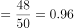。则年均增速由高到低排序为：①金属耐磨材料、③树脂耐磨材料、②陶瓷耐磨材料，对应D项。

故正确答案为D。

---

### 第 20 题　qid 4652204 · 综合

能够从上述材料中推出的是：

- **A**. 2014—2020年中国耐磨材料产量逐年递增
- **B**. 2020年中国耐磨材料市场规模同比增速快于产量同比增速
- **C**. 2019年中国金属耐磨材料消费量占耐磨材料总消费量的比重同比上升　✅
- **D**. 2015年中国耐磨材料总消费量高于上年水平

**答案**：C

**官方解析**

A项：定位图形材料可知，2015年、2014年中国耐磨材料产量分别为443.3万吨、449.9万吨，443.3＜449.9，不满足逐年递增，错误；

B项：定位图形材料可知，2020年、2019年中国耐磨材料市场规模分别为552.3亿元、540.0亿元；产量分别为506.5万吨、490.9万吨。根据公式：增长率，可得：2020年中国耐磨材料市场规模同比增长率为：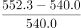，2020年中国耐磨材料产量同比增长率为：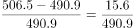，，即2020年中国耐磨材料市场规模同比增速慢于产量同比增速，错误；

C项：定位表格材料可知，2019年、2018年中国金属耐磨材料消费量分别为401万吨、386万吨；耐磨材料总消费量分别为401+25+47=473万吨、386+26+49=461万吨。根据公式：增长率，可得2019年中国金属耐磨材料消费量同比增长率为：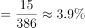（a），2019年中国耐磨材料总消费量同比增长率为：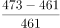（b），a＞b，根据两期比重结论，判断比重上升，即2019年中国金属耐磨材料消费量占耐磨材料总消费量的比重同比上升，正确；

D项：定位表格材料可知，2015年中国耐磨材料总消费量为：363+25+46=434万吨，2014年中国耐磨材料总消费量为：359+30+50=439万吨，434＜439，即2015年中国耐磨材料总消费量低于上年水平，错误。

故正确答案为C。

---
