# 2022年吉林省公务员录用考试《行测》题（网友回忆版）

> 资料分析 · 10 题 · 吉林 2022

## 材料 1

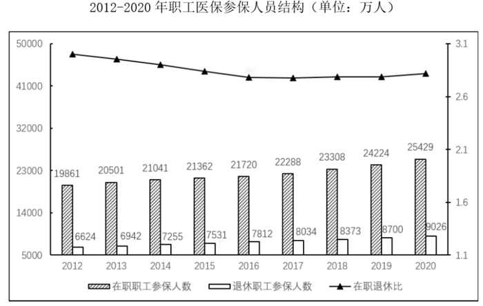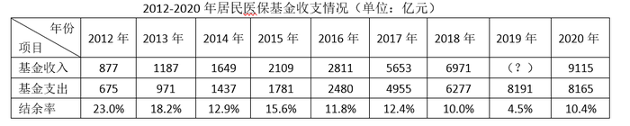

### 第 1 题　qid 5102167 · 综合

2019年，职工医保参保人数共：

- **A**. 30322万人
- **B**. 31681万人
- **C**. 32924万人　✅
- **D**. 34455万人

**答案**：C

**官方解析**

定位统计图可知，2019年在职职工医保参保人数为24224万人，退休职工医保参保人数为8700万人，则2019年职工医保参保人数为在职职工医保参保人数与退休职工医保参保人数之和：24224+8700=32924万人。
故正确答案为C。

---

### 第 2 题　qid 5102170 · 综合

表中（？）处应填入的数字是：

- **A**. 7822
- **B**. 8559
- **C**. 8577　✅
- **D**. 8898

**答案**：C

**官方解析**

表中“？”为2019年基金收入，结合材料给出2019年基金支出以及结余率，可判定本题为现期比重问题。定位统计表，2019年基金支出为8191亿元，结余率为4.5%。根据公式结余率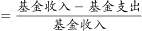，将数据代入公式可得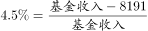，则基金收入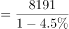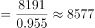，与C项最接近。

故正确答案为C。

---

### 第 3 题　qid 5102280 · 综合

2012—2020年中，在职退休比最接近3的是：

- **A**. 2020年
- **B**. 2019年
- **C**. 2013年
- **D**. 2012年　✅

**答案**：D

**官方解析**

方法一：根据题干“2012—2020年中，在职退休比······”，可判定本题为比值计算问题。定位统计图可得2012—2020年在职职工参保人数与退休职工参保人数。根据在职退休比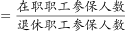，可得各年份在职退休比分别为：

A项，2020年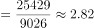；

B项，2019年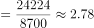；

C项，2013年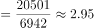；

D项，2012年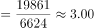。

在职退休比最接近3的是2012年。

方法二：定位统计图折线数据，观察可知2012、2013、2019、2020年在职退休比最接近3的是2012年。

故正确答案为D。

---

### 第 4 题　qid 5102166 · 增长

假设2021年居民医保基金收入同比增速与2020年相同，那么，2021年居民医保基金收入约为：

- **A**. 9598亿元
- **B**. 9689亿元　✅
- **C**. 9727亿元
- **D**. 9873亿元

**答案**：B

**官方解析**

根据题干“假设2021年······同比增速与2020年相同······2021年······约为”，结合材料时间为2012-2020年，可判定本题为现期计算问题。定位统计表可得：2019年居民医保基金支出和结余率分别为8191亿元和4.5%，2020年基金收入为9115亿元。根据结余率，则有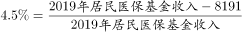，解得2019年居民医保基金收入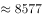亿元（也可结合本篇材料第3题得出此数据）。根据公式：增长率、现期量=基期量×（1+增长率）。则2021年居民医保基金收入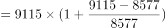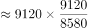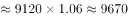亿元，与B项最接近。

故正确答案为B。

---

### 第 5 题　qid 5102175 · 增长

能够从上述资料中推出的有：
①2017年职工医保在职退休比高于2016年
②2020年居民医保参保人数比上年略有增加
③2012—2020年间，职工医保参保人数持续增加
④2012—2020年间，居民医保基金支出增长金额最快的是2017年

- **A**. 1
- **B**. 2　✅
- **C**. 3
- **D**. 4

**答案**：B

**官方解析**

①：定位统计图可得：2017年职工医保在职退休比相较于2016年有所下降，故2017年退休比＜2016年退休比，错误；

②：材料所给数据均为职工医保参保人数，未出现居民医保参保人数相关数据，故无法推出，错误；

③：定位统计图可得：在职职工参保人数和退休职工参保人数2012年-2020年每年均在增加，故职工医保参保总人数也持续增加，正确；

④：定位统计表可得2012-2020年的数据，根据公式：增长率，

2013年，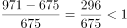；

2014年，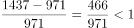；

2015年，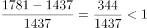；

2016年，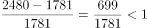；

2017年，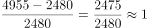；

2018年，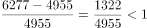；

2019年，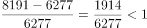；

2020年，基金支出较上年下降，增长率&lt;0。故2017年增速最快，正确；

综上所述，只有③④正确，共2项。

故正确答案为B。

【备注】根据历年真题教研，对于④的问法，如果材料有2011年数据，需要计算2012年的增速，但如果材料没有2011年的数据，则不用计算。因此判定④正确。

---

## 材料 2

        2020年，由软件产品、信息技术服务、信息安全产品和服务、嵌入式系统软件四大业务形态构成的我国软件和信息技术服务业持续恢复，收入保持较快增长，信息技术服务加快云化发展，软件应用服务化、平台化趋势明显。

        2020年，软件产品实现收入22758亿元，同比增长10.1%，占全行业比重为27.9%。其中，工业软件产品实现收入1974亿元，增长11.2%，为支撑工业领域的自主可控发展发挥重要作用。

        2020年，信息技术服务实现收入49868亿元，同比增长15.2%，增速高出全行业平均水平1.9个百分点，占全行业收入比重为61.1%。其中，电子商务平台技术服务收入9095亿元，同比增长10.5%；云服务、大数据服务共实现收入4116亿元，同比增长11.1%。

        2020年，信息安全产品和服务实现收入1498亿元，同比增长10.0%，增速较上年回落2.4个百分点。

        2020年嵌入式系统软件实现收入7492亿元，同比增长12.0%，增速较上年提高4.2个百分点，占全行业收入比重为9.2%。嵌入式系统软件已成为产品和装备数字化改造、各领域智能化增值的关键性带动技术。

### 第 6 题　qid 5102378 · 比重

2020年电子商务平台技术服务收入占全行业收入的比重约为：

- **A**. 7.6%
- **B**. 11.1%　✅
- **C**. 15.3%
- **D**. 18.2%

**答案**：B

**官方解析**

根据题干“2020年······占······的比重约为”，结合材料时间是2020年，可判定本题为现期比重问题。定位文字材料第二段、第三段可知：2020年，软件产品实现收入22758亿元，同比增长10.1%，占全行业比重为27.9%；电子商务平台技术服务收入9095亿元。根据公式：比重，则2020年全行业收入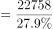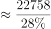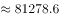亿元，故题干所求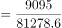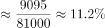，与B项最接近。

故正确答案为B。

---

### 第 7 题　qid 5102381 · 增长

2019年嵌入式系统软件同比增速相较于信息安全产品和服务同比增速：

- **A**. 快2.0%
- **B**. 快8.6%
- **C**. 慢4.6%　✅
- **D**. 慢7.5%

**答案**：C

**官方解析**

根据题干“2019年······同比增速相较于······同比增速”，可判定本题为一般增长率问题。定位材料第五段，2020年嵌入式系统软件实现收入7492亿元，同比增长12.0%，增速较上年提高4.2个百分点，则2019年嵌入式系统软件同比增速为12.0%-4.2%=7.8%；定位材料第四段，2020年信息安全产品和服务实现收入1498亿元，同比增长10.0%，增速较上年回落2.4个百分点，则2019年信息安全产品和服务同比增速为10.0%+2.4%=12.4%，二者相差：7.8%-12.4%=-4.6%，即慢4.6%。
故正确答案为C。

---

### 第 8 题　qid 5102379 · 增长

2020年四大业务形态收入同比增速高于全行业平均水平的有：

- **A**. 1个　✅
- **B**. 2个
- **C**. 3个
- **D**. 4个

**答案**：A

**官方解析**

定位文字材料第二段可知：2020年软件产品收入同比增长10.1%；定位文字材料第三段可知：2020年信息技术服务收入同比增长15.2%，增速高出全行业平均水平1.9个百分点，可得2020年全行业平均水平同比增速为15.2%-1.9%=13.3%；定位文字材料第四段可知：2020年信息安全产品和服务收入同比增长10.0%；定位文字材料第五段可知：2020年嵌入式系统软件收入7492亿元，同比增长12.0%。四大业务形态收入同比增速高于全行业平均水平的为信息技术服务(15.2%)，有1个。
故正确答案为A。

---

### 第 9 题　qid 5102380 · 综合

2019年全行业实现收入约为：

- **A**. 7.2万亿元　✅
- **B**. 7.4万亿元
- **C**. 8.2万亿元
- **D**. 8.4万亿元

**答案**：A

**官方解析**

根据题干“2019年······约为”，结合材料时间为2020年，可判定本题为基期计算问题。定位文字材料第三段可得：2020年，信息技术服务实现收入49868亿元，同比增长15.2%，增速高出全行业平均水平1.9个百分点，占全行业收入比重为61.1%。根据公式：整体量，则2020年全行业实现收入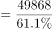亿元，同比增速=15.2%-1.9%=13.3%。根据公式：基期量，则2019年全行业实现收入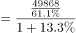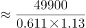亿元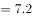万亿元。

故正确答案为A。

---

### 第 10 题　qid 5102383 · 综合

下列选项不能从上述资料推出的是：

- **A**. 2019年信息安全产品和服务实现收入约为1361.8亿元
- **B**. 2019年信息安全产品和服务占全行业收入比重最低
- **C**. 2020年信息安全产品和服务占全行业收入比重为2.8%　✅
- **D**. 2019年信息技术服务收入占全行业收入比重低于61.1%

**答案**：C

**官方解析**

A项：定位文字材料第四段可得：2020年，信息安全产品和服务实现收入1498亿元，同比增长10.0%。根据公式：基期量，则2019年信息安全产品和服务实现收入为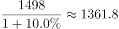亿元，正确；

B项：定位文字材料可知2020年软件产品、信息技术服务、信息安全产品和服务、嵌入式系统软件的实现收入及同比增长率。根据公式：比重，整体量一致，比较比重的大小，只需比较部分量的大小即可。根据公式：基期量，则2019年软件产品、信息技术服务、信息安全产品和服务、嵌入式系统软件的实现收入分别为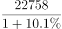亿元、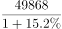亿元、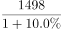亿元、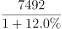亿元。分母（1+增长率）相差不大，现期量最小的是信息安全产品和服务，则其基期量最小，占全行业收入比重最低，正确；

C项：定位文字材料第一段可知：软件产品、信息技术服务、信息安全产品和服务、嵌入式系统软件四大业务形态构成我国软件和信息技术服务业。定位文字材料第二、三、五段可知2020年软件产品、信息技术服务、嵌入式系统软件实现收入占全行业收入的比重分别是27.9%、61.1%、9.2%。因此，2020年信息安全产品和服务占全行业收入比重为1-27.9%-61.1%-9.2%=1.8%，错误；

D项：定位文字材料第三段可得：2020年，信息技术服务实现收入同比增长15.2%，增速高出全行业平均水平1.9个百分点，占全行业收入比重为61.1%。根据两期比重比较口诀“部分增长率大于整体增长率，则比重上升”。部分增长率（15.2%）大于整体增长率（15.2%-1.9%），比重上升，即2019年信息技术服务收入占全行业收入比重低于61.1%，正确。

本题为选非题，故正确答案为C。

---
