# 2022年四川下半年公务员录用考试《行测》试题（网友回忆版）

> 资料分析 · 15 题 · 四川 2022

## 材料 1

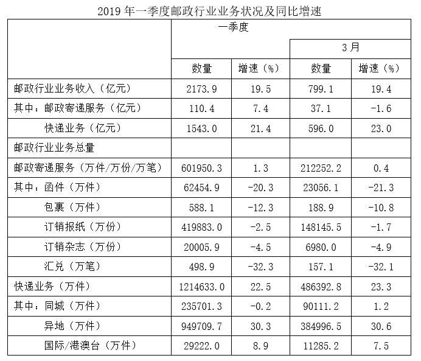

### 第 1 题　qid 5408619 · 综合

2019年3月，订销报纸数量约是订销杂志数量的多少倍？

- **A**. 21　✅
- **B**. 22
- **C**. 23
- **D**. 24

**答案**：A

**官方解析**

根据题干“2019年3月······是······多少倍”，可判定本题为现期倍数问题。定位统计表可得：2019年3月，订销报纸数量为148145.5万份，订销杂志数量为6980.0万份。则2019年3月，订销报纸数量是订销杂志数量的倍。

故正确答案为A。

---

### 第 2 题　qid 5408626 · 综合

2018年1~2月，我国邮政寄递服务的收入约为多少亿元？

- **A**. 44
- **B**. 65　✅
- **C**. 82
- **D**. 103

**答案**：B

**官方解析**

根据题干“2018年1~2月······收入约为多少亿元”，结合材料时间为2019年一季度和2019年3月，可判定本题为基期和差问题。定位统计表可得：2019年一季度，我国邮政寄递服务110.4亿元，同比增速为7.4%；2019年3月，我国邮政寄递服务37.1亿元，同比增速为-1.6%。根据公式：基期量，可得2018年1~2月我国邮政寄递服务的收入亿元，与B项最接近。

故正确答案为B。

---

### 第 3 题　qid 5408635 · 综合

2019年1~2月，我国包裏寄递量比去年同期：

- **A**. 下降了不到10%
- **B**. 下降了10%以上　✅
- **C**. 上升了不到10%
- **D**. 上升了10%以上

**答案**：B

**官方解析**

根据题干“2019年1~2月······比去年同期”，选项为“上升/下降+%”，结合材料给出2019年一季度和2019年3月我国包裏寄递量及其同比增速，可判定本题为混合增长率问题。定位统计表可得：2019年一季度，我国包裏寄递量为588.1万件，同比增速为-12.3%；2019年3月，我国包裏寄递量为188.9万件，同比增速为-10.8%。根据混合增长率口诀“混合后居中”，可知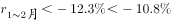，在B项范围内。

故正确答案为B。

---

### 第 4 题　qid 5408641 · 比重

在①同城快递、②异地快递和③国际/港澳台快递中，2019年3月业务量占一季度比重高于2018年3月业务量占一季度比重的是：

- **A**. 仅①
- **B**. 仅③
- **C**. 仅①和②　✅
- **D**. 仅②和③

**答案**：C

**官方解析**

根据题干“······2019年3月······占一季度比重高于2018年3月······占一季度比重的是”，可判定本题为两期比重比较问题。定位统计表可得同城快递、异地快递和国际/港澳台快递2019年3月业务量的同比增速（a）和一季度业务量的同比增速（b）。根据两期比重比较结论：若部分增长率（a）＞整体增长率（b），则比重上升，因①同城快递1.2%＞-0.2%，②异地快递30.6%＞30.3%，③国际/港澳台快递7.5%＜8.9%，则仅①和②满足要求。
故正确答案为C。

---

### 第 5 题　qid 5408644 · 综合

关于我国邮政行业发展状况，能够从上述资料中推出的是：

- **A**. 2018年3月，快递业务收入高于500亿元
- **B**. 2019年3月，快递业务量高于同年1~2月平均水平　✅
- **C**. 2019年一季度，平均每件邮政寄递服务产生的收入高于2元
- **D**. 2019年一季度，函件、包裹和汇兑的业务量之和占邮政寄递服务业务量的20%以上

**答案**：B

**官方解析**

A项：定位统计表可得：2019年3月，快递业务收入为596.0亿元，同比增速为23.0%。根据公式：基期量，可得2018年3月快递业务收入为亿元，错误；

B项：定位统计表可得：2019年一季度，快递业务量为1214633.0万件；2019年3月，快递业务量为486392.8万件。则2019年1~2月，快递业务量平均水平为万件&lt;486392.8万件，故2019年3月，快递业务量高于同年1~2月平均水平，正确；

C项：定位统计表可得：2019年一季度，邮政寄递服务收入为110.4亿元，邮政寄递服务业务量为601950.3万件。平均每件邮政寄递服务产生的收入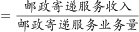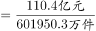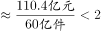元/件，错误；

D项：定位统计表可得2019年一季度，函件、包裹和汇兑的业务量以及邮政寄递服务业务量。根据公式：比重，可得，故2019年一季度，函件、包裹和汇兑的业务量之和不到邮政寄递服务业务量的20%，错误。

故正确答案为B。

（备注：表格中邮政寄递服务量单位为万件/万份/万笔，C项所求为平均每件邮政寄递服务产生的收入，此处应为出题人统一用每件指代各类不同单位总数）

---

## 材料 2

        2019年，A市居民人均可支配收入28920元，比上年增长9.6%。按常住地分，城镇居民人均可支配收入37939元；农村居民人均可支配收入15133元。全市居民人均消费支出20774元，比上年增长7.9%。按常住地分，城镇居民人均消费支出25785元；农村居民人均消费支出13112元。全市居民恩格尔系数为32.1%，比上年下降0.2个百分点。其中城镇为31.2%，农村为34.9%。

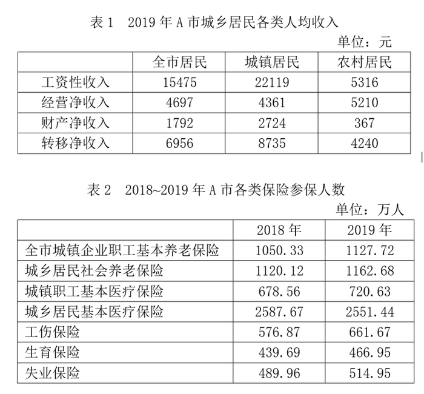

### 第 6 题　qid 5408647 · 增长

2019年，A市居民人均可支配收入同比增量约是同期人均消费支出同比增量的多少倍？

- **A**. 1.1
- **B**. 1.4
- **C**. 1.7　✅
- **D**. 2.2

**答案**：C

**官方解析**

根据“2019年······是······的多少倍”，可判定本题为现期倍数问题。定位文字材料可得：2019年，A市居民人均可支配收入28920元，比上年增长9.6%。全市居民人均消费支出20774元，比上年增长7.9%。根据公式：增长量，则2019年A市居民人均可支配收入同比增量，同期人均消费支出同比增量。所求倍数，与C项最接近。

故正确答案为C。

---

### 第 7 题　qid 5408648 · 比重

2019年，A市城镇常住居民工资性收入占可支配收入的比重比农村常住居民的这一比重：

- **A**. 低不到10个百分点
- **B**. 低10个百分点以上
- **C**. 高不到10个百分点
- **D**. 高10个百分点以上　✅

**答案**：D

**官方解析**

根据题干“2019年······的比重······”，可判定本题为现期比重问题。定位文字材料可得：2019年，A市按常住地分，城镇居民人均可支配收入37939元；农村居民人均可支配收入15133元。定位表1可得：2019年，A市城镇居民人均工资性收入22119元；农村居民人均工资性收入5316元。根据公式：现期比重，则2019年A市城镇常住居民工资性收入占可支配收入的比重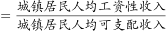，同理，农村常住居民工资性收入所占比重。故2019年A市城镇常住居民工资性收入占可支配收入的比重比农村常住居民高约58%-35%=23%，即高10个百分点以上。

故正确答案为D。

---

### 第 8 题　qid 5408650 · 综合

2019年，A市城镇企业职工基本养老保险及城乡居民社会养老保险总参保人数比2018年多：

- **A**. 不到50万人
- **B**. 50~100万人之间
- **C**. 100~150万人之间　✅
- **D**. 150万人以上

**答案**：C

**官方解析**

根据题干“2019年······比2018年多”，结合选项单位为“人”，可判定本题为增长量计算问题。定位表2可得：A市城镇企业职工基本养老保险，2018年参保人数为1050.33万人，2019年参保人数为1127.72万人；A市城乡居民社会养老保险，2018年参保人数为1120.12万人，2019年参保人数为1162.68万人。根据公式：增长量=现期量-基期量，则2019年A市城镇企业职工基本养老保险及城乡居民社会养老保险总参保人数比2018年多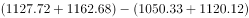万人，在C项范围内。

故正确答案为C。

---

### 第 9 题　qid 5408651 · 增长

将2019年A市①工伤保险、②生育保险和③失业保险按参保人数同比增速从高到低的顺序排列，以下正确的是：

- **A**. ①②③　✅
- **B**. ①③②
- **C**. ②③①
- **D**. ②①③

**答案**：A

**官方解析**

根据题干“2019年······同比增速从高到低······”，可判定本题为一般增长率比较问题。定位表2可得：2018-2019年，A市工伤保险参保人数分别为576.87万人、661.67万人；生育保险参保人数分别为439.69万人、466.95万人；失业保险参保人数分别为489.96万人、514.95万人。根据公式：增长率，则2019年，工伤保险参保人数同比增速为；生育保险参保人数同比增速为；失业保险参保人数同比增速为。则三者按参保人数同比增速从高到低的顺序排列为：①＞②＞③。

故正确答案为A。

---

### 第 10 题　qid 5408652 · 比重

以下饼图中，最能准确反映2019年A市全市居民工资性收入（白色）、经营净收入（灰色）、财产净收入（黑色）和转移净收入（斜线）占可支配收入比重关系的是：

- **A**. 

- **B**. 

- **C**. 

- **D**. 

　✅

**答案**：D

**官方解析**

根据题干“······2019年······占······比重关系”，可判定本题为现期比重问题。定位表1可得：2019年，A市全市居民工资性收入为15475元，经营净收入为4697元，财产净收入为1792元，转移净收入为6956元。财产净收入最小，则黑色扇形面积最小，排除A、B两项。，则白色扇形面积应为斜线扇形面积的2倍多，排除C项。

故正确答案为D。

---

## 材料 3

        2020年末，全国共有艺术表演团体17581个，比上年末减少214个；从业人员43.69万人，增加2.44万人。其中各级文化和旅游部门所属艺术表演团体2060个，占11.7%，从业人员10.75万人，占24.6%。

        2020年，全国艺术表演团体共演出225.61万场，比上年下降24.0%；国内观众8.93亿人次，下降27.4%；演出收入86.63亿元，下降31.7%。

        2020年，全国文化和旅游部门所属艺术表演团体共组织政府采购公益演出13.38万场，比上年下降14.9%；观众0.86亿人次，下降27.9%。

        2020年末，全国公共图书馆实际使用房屋建筑面积1785.77万平方米，比上年末增长12.2%；全国图书总藏量117929.99万册，增长6.1%；阅览室坐席数126.47万个，增长6.2%；计算机226234台，增加419台；其中供读者使用的电子阅览终端143714台，减少2022台。

        2020年末，全国共有群众文化机构43687个，比上年末减少386个。其中乡镇综合文化站32825个，减少705个。年末全国群众文化机构从业人员185076人，比上年末减少4992人。其中具有高级职称的人员7075人，具有中级职称人员17969人。

### 第 11 题　qid 5408630 · 平均数

2020年末，平均每个各级文化和旅游部门所属艺术表演团体的从业人数约是全国所有艺术表演团体的多少倍？

- **A**. 0.5
- **B**. 0.8
- **C**. 1.3
- **D**. 2.1　✅

**答案**：D

**官方解析**

根据题干“2020年末，平均每个······约是······的多少倍”，可判定本题为现期倍数问题。定位文字材料第一段可得：2020年末，全国共有艺术表演团体17581个，从业人员43.69万人；其中各级文化和旅游部门所属艺术表演团体2060个，从业人员10.75万人。根据平均每个······团体的从业人数，则2020年末，平均每个各级文化和旅游部门所属艺术表演团体的从业人数约是全国所有艺术表演团体的倍，对应D项。

故正确答案为D。

---

### 第 12 题　qid 5408634 · 平均数

2020年，全国艺术表演团体平均每场演出创造收入比上年：

- **A**. 减少了不到1000元　✅
- **B**. 减少了1000元以上
- **C**. 增加了不到1000元
- **D**. 增加了1000元以上

**答案**：A

**官方解析**

根据题干“2020年······平均每场演出创造收入比上年”，结合选项为“增加/减少+元”，可判定本题为平均数的增长量问题。定位文字材料第二段可得：2020年，全国艺术表演团体共演出225.61万场（B），比上年下降24.0%（b）；演出收入86.63亿元（A），下降31.7%（a）。根据公式：平均数的增长量，故2020年，全国艺术表演团体平均每场演出创造收入的同比增长量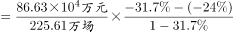元/场，即比上年减少了不到1000元。

故正确答案为A。

---

### 第 13 题　qid 5408638 · 比重

2020年，全国群众文化机构从业人员中，中高级职称从业人员占比约为：

- **A**. 8%
- **B**. 14%　✅
- **C**. 27%
- **D**. 38%

**答案**：B

**官方解析**

根据题干“2020年······中······占比约为”，可判定本题为现期比重问题。定位文字材料最后一段可得：2020年末，全国群众文化机构从业人员185076人，其中具有高级职称的人员7075人，具有中级职称人员17969人。根据公式：比重，所求比重为，对应B项。

故正确答案为B。

---

### 第 14 题　qid 5408642 · 增长

2020年，全国供读者使用的电子阅览终端数量同比增速约为：

- **A**. 3.4%
- **B**. 2.7%
- **C**. -1.4%　✅
- **D**. -2.8%

**答案**：C

**官方解析**

根据题干“2020年······同比增速约为”，可判定本题为一般增长率问题。定位文字材料第四段可得：2020年末，全国供读者使用的电子阅览终端143714台，减少2022台。根据公式：增长率，则2020年，全国供读者使用的电子阅览终端数量同比增速为，对应C项。

故正确答案为C。

---

### 第 15 题　qid 5408643 · 平均数

以下信息中，能够从上述资料中推出的有几条？
①2019年末全国各级文化和旅游部门所属艺术表演团体数
②2019年全国平均每场政府采购公益演出的观众数量
③2019年全国艺术表演团体平均每场演出收入
④2019年末全国群众文化机构个数

- **A**. 1
- **B**. 2
- **C**. 3　✅
- **D**. 4

**答案**：C

**官方解析**

①：定位文字材料第一段“2020年末，各级文化和旅游部门所属艺术表演团体2060个，占11.7%”。材料并未给出2019年末各级文化和旅游部门所属艺术表演团体的相关数据，无法推出；

②：定位文字材料第三段“2020年，全国文化和旅游部门所属艺术表演团体共组织政府采购公益演出13.38万场（B），比上年下降14.9%（b），观众0.86亿人次（A），下降27.9%（a）”。根据基期平均数可得，2019年全国平均每场政府采购公益演出的观众数量为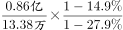人次，可以推出；

③：定位文字材料第二段“2020年，全国艺术表演团体共演出225.61万场（B），比上年下降24.0%（b）；演出收入86.63亿元（A），下降31.7%（a）”。根据基期平均数可得，2019年全国艺术表演团体平均每场演出收入为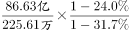元，可以推出；

④：定位文字材料最后一段“2020年末，全国共有群众文化机构43687个，比上年末减少386个”。根据基期量=现期量-增长量可得，2019年末全国群众文化机构个数为43687-（-386）个，可以推出。

综上可知，可以推出的有②③④，共3条。

故正确答案为C。

---
