# 2022年四川省公务员录用考试《行测》题（网友回忆版）

> 资料分析 · 15 题 · 四川 2022

## 材料 1

        2020年我国数字经济规模达到39.2万亿元，保持9.7%的高位增长，占GDP比重为38.6%，同比提升2.4个百分点。

        产业数字化发展深入推进，2020年我国服务业、工业、农业数字经济占行业增加值比重分别为40.7%、21.0%和8.9%。

        2020年，数字经济规模超过1万亿元的省份有广东、江苏、山东、浙江、上海、北京、福建、湖北、四川、河南、河北、湖南和安徽；另有8个省份超过5000亿元；从GDP占比看，北京、上海领先，分别达到55.9%和55.1%；从增速上看，贵州、重庆、福建数字经济增速位列前三，增速超过15%。

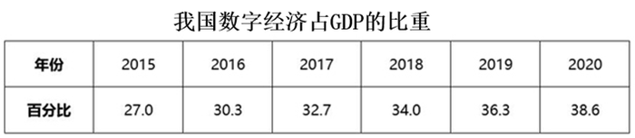

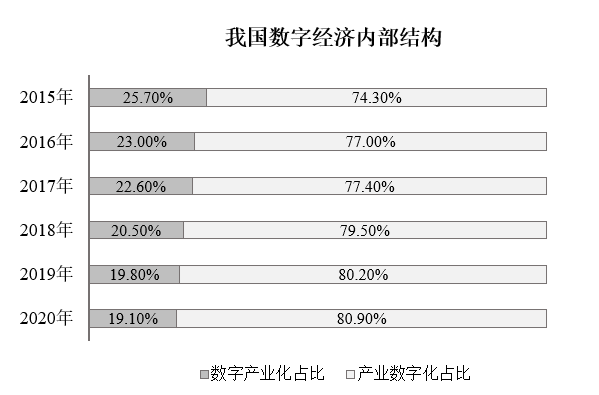

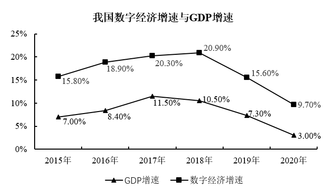

### 第 1 题　qid 4817755 · 综合

2020年，数字经济规模超过5000亿元的省份有多少个？

- **A**. 8
- **B**. 11
- **C**. 16
- **D**. 21　✅

**答案**：D

**官方解析**

定位文字资料第三段可得：2020年，数字经济规模超过1万亿元的省份有广东、江苏、山东、浙江、上海、北京、福建、湖北、四川、河南、河北、湖南和安徽；另有8个省份超过5000亿元。可知超过5000亿元的省份共有13+8=21个。
故正确答案为D。

---

### 第 2 题　qid 4817765 · 比重

数字产业化占GDP比重最大的年份是：

- **A**. 2015年
- **B**. 2017年　✅
- **C**. 2019年
- **D**. 2020年

**答案**：B

**官方解析**

根据题干“······占······比重最大的年份是”，可判定本题为现期比重问题。定位统计表可得：2015年、2017年、2019年、2020年数字经济占GDP的比重；定位统计图1可得：2015年、2017年、2019年、2020年数字产业化占数字经济的比重。根据公式：比重，可得数字产业化占GDP的比重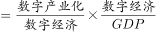。

2015年的比重为：；

2017年的比重为：；

2019年的比重为：；

2020年的比重为：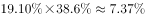。

综上所述，数字产业化占GDP比重最大的年份是2017年。

故正确答案为B。

---

### 第 3 题　qid 4817772 · 增长

2015-2020年，数字经济增速与GDP增速之差超过8.5%的年份有多少个？

- **A**. 3
- **B**. 4　✅
- **C**. 5
- **D**. 6

**答案**：B

**官方解析**

定位统计图2可得：2015-2020年，数字经济增速分别为15.80%、18.90%、20.30%、20.90%、15.60%、9.70%；GDP增速分别为7.00%、8.40%、11.50%、10.50%、7.30%、3.00%。故各年份数字经济增速与GDP增速之差分别为：
2015年：15.80%-7.00%=8.8%＞8.5%；
2016年：18.90%-8.40%=10.5%＞8.5%；
2017年：20.30%-11.50%=8.8%＞8.5%；
2018年：20.90%-10.50%=10.4%＞8.5%；
2019年：15.60%-7.30%=8.3%＜8.5%；
2020年：9.70%-3.00%=6.7%＜8.5%。
比较可知，2015-2020年，数字经济增速与GDP增速之差超过8.5%的年份有2015年、2016年、2017年、2018年，共4个。
故正确答案为B。

---

### 第 4 题　qid 4817783 · 增长

2020年，产业数字化规模同比增长约：

- **A**. 9.2%
- **B**. 9.8%
- **C**. 10%
- **D**. 10.7%　✅

**答案**：D

**官方解析**

根据题干“2020年······同比增长约”，结合选项为百分数，可判定本题为一般增长率问题。定位文字材料第一段可得：2020年我国数字经济规模达到39.2万亿元，保持9.7%的高位增长。定位统计图1可得：我国数字经济内部结构中，2019年产业数字化占比为80.20%，2020年产业数字化占比为80.90%。根据公式：部分=整体×比重、增长率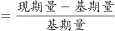，可得2020年产业数字化规模同比增长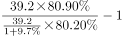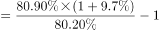。

故正确答案为D。

---

### 第 5 题　qid 4817786 · 综合

不能从上述资料中推出的是：

- **A**. 2020年北京市数字经济规模全国领先　✅
- **B**. 2020年数字经济增速是GDP增速的3倍多
- **C**. 2020年数字经济内部结构大约呈现“二八”比例分布
- **D**. 2020年农业、工业和服务业数字经济渗透水平大约逐次倍增

**答案**：A

**官方解析**

A项：定位文字材料第三段，2020年，数字经济规模超过1万亿元的省份有广东、江苏、山东、浙江、上海、北京、福建、湖北、四川、河南、河北、湖南和安徽；另有8个省份超过5000亿元；从GDP占比看，北京、上海领先，分别达到55.9%和55.1%。因为北京和其他地区的GDP未知，尽管北京数字经济在GDP中的占比最高，但并不能推出北京数字经济规模最大，错误；

B项：定位统计图2，2020年我国数字经济增速和GDP增速分别为9.70%、3.00%。则2020年数字经济增速是GDP增速的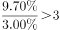倍，正确；

C项：定位统计图1，2020年我国数字经济内部结构中数字产业化占比和产业数字化占比分别为19.10%、80.90%。则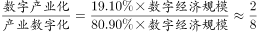，大约呈现“二八”比例分布，正确；

D项：定位文字材料第二段，2020年我国服务业、工业、农业数字经济占行业增加值比重分别为40.7%、21.0%和8.9%。题干表述中的“渗透水平”即所占比重，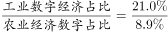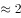倍，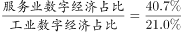倍，

本题为选非题，故正确答案为A。

---

## 材料 2

        2018年某省规模以上企业就业人员年平均工资为62484元，比上年增长10.1%。其中，中层及以上管理人员增长9.7%；专业技术人员增长20.7%；办事人员和有关人员增长5.7%；社会生产服务和生活服务人员增长8.5%；生产制造及有关人员增长9.7%。

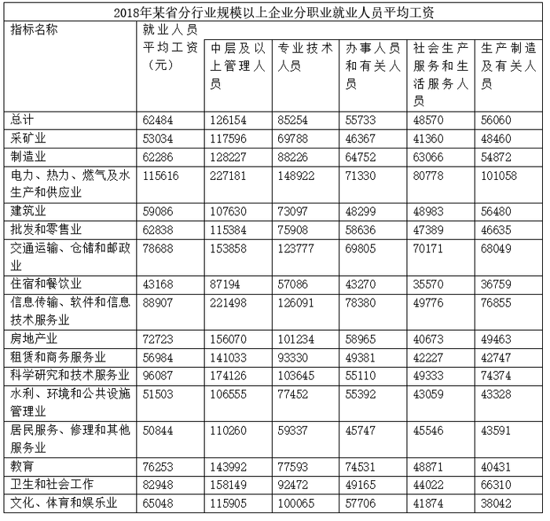

### 第 6 题　qid 4817764 · 增长

2018年，该省规模以上企业就业人员年平均工资同比增速最快的职业类型是：

- **A**. 专业技术人员　✅
- **B**. 中层及以上管理人员
- **C**. 社会生产服务和生活服务人员
- **D**. 生产制造及有关人员

**答案**：A

**官方解析**

定位文字材料可知：2018年，该省规模以上企业中层及以上管理人员的年平均工资增长9.7%；专业技术人员增长20.7%；社会生产服务和生活服务人员增长8.5%；生产制造及有关人员增长9.7%。因此同比增速最快的职业类型是专业技术人员。
故正确答案为A。

---

### 第 7 题　qid 4817767 · 平均数

表中2018年平均工资最高的行业，其规模以上企业专业技术人员平均工资约是生产制造及有关人员的多少倍？

- **A**. 1.3
- **B**. 1.5　✅
- **C**. 1.7
- **D**. 1.9

**答案**：B

**官方解析**

根据题干“表中2018年······约是······的多少倍”，可判定本题为现期倍数问题。定位表格材料可得：2018年平均工资最高的行业为电力、热力、燃气及水生产和供应业，其规模以上企业专业技术人员平均工资为148922元，生产制造及有关人员为101058元。则所求倍数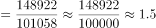倍。

故正确答案为B。

---

### 第 8 题　qid 4817769 · 平均数

2018年，该省规模以上企业中层及以上管理人员平均工资低于全省同类人员平均水平的行业有几个？

- **A**. 6
- **B**. 7　✅
- **C**. 8
- **D**. 9

**答案**：B

**官方解析**

定位表格材料可得，2018年该省规模以上企业中层及以上管理人员平均工资为126154元，低于全省同类人员平均水平的行业有采矿业（117596元）、建筑业（107630元）、批发和零售业（115384元）、住宿和餐饮业（87194元）、水利、环境和公共设施管理业（106555元）、居民服务、修理和其他服务业（110260元）、文化、体育和娱乐业（115905元），共7个。
故正确答案为B。

---

### 第 9 题　qid 4817775 · 增长

如2018年该省规模以上企业各行业各职业就业人员平均工资同比增速均与全省规模以上企业同职业人员总体水平相同，则2017年规模以上教育业企业专业技术人员平均工资比该行业办事人员和有关人员：

- **A**. 低4000元以上　✅
- **B**. 低不到4000元
- **C**. 高不到4000元
- **D**. 高4000元以上

**答案**：A

**官方解析**

根据题干“2017年······比······”，结合选项为低/高······元，且材料时间为2018年，可判定本题为基期和差问题。定位文字材料可得：2018年该省规模以上企业专业技术人员年平均工资增长20.7%，办事人员和有关人员增长5.7%。定位表格材料可得：2018年该省规模以上教育业企业专业技术人员平均工资77593元，办事人员和有关人员平均工资74531元。由于2018年该省规模以上企业各行业各职业就业人员平均工资同比增速均与全省规模以上企业同职业人员总体水平相同，根据公式：基期量，则2017年该省规模以上教育业企业专业技术人员平均工资与该行业办事人员和有关人员的差值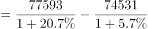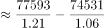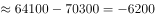元，在A项范围内。

故正确答案为A。

---

### 第 10 题　qid 4817780 · 平均数

关于该省规模以上企业就业人员平均工资，能够从上述资料中推出的是：

- **A**. 2017年生产制造及有关人员平均工资不到5万元
- **B**. 2018年信息传输、软件和信息技术服务业中层以上管理人员平均工资为各行业中最高
- **C**. 表中有3个行业办事人员和有关人员2018年平均工资超过同行业所有就业人员同期平均工资　✅
- **D**. 2018年房地产业中层及以上管理人员平均工资是该行业社会生产服务和生活服务人员的4倍以上

**答案**：C

**官方解析**

A项：定位文字材料可得：2018年生产制造及有关人员平均工资同比增长9.7%；定位表格材料可得：2018年生产制造及有关人员平均工资为56060元。根据公式：基期量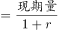，则2017年生产制造及有关人员平均工资为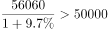元，错误；

B项：定位表格材料可得：2018年信息传输、软件和信息技术服务业中层及以上管理人员平均工资为221498元，低于2018年电力、热力、燃气及水生产和供应业中层及以上管理人员平均工资（227181元），并非行业最高，错误；

C项：定位表格材料可得：2018年，制造业办事人员和有关人员年平均工资（64752元）超过该行业所有就业人员同期平均工资（62286元）；住宿和餐饮业办事人员和有关人员年平均工资（43270元）超过该行业所有就业人员同期平均工资（43168元）；水利、环境和公共设施管理业办事人员和有关人员年平均工资（55392元）超过该行业所有就业人员同期平均工资（51503元），共3个行业，正确；

D项：定位表格材料可得：2018年房地产业，中层及以上管理人员平均工资为156070元，社会生产服务和生活服务人员平均工资为40673元。前者是后者的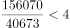倍，错误。

故正确答案为C。

---

## 材料 3

        2019年，我国快递业务量为635.2亿件，其中东部、中部、西部地区分别完成业务量506.3亿件、81.9亿件和47亿件。全年快递业务收入7497.8亿元，其中东部、中部、西部地区的业务收入所占比重分别为80.2%、11.3%和8.5%。东部、中部、西部地区业务收入占全国比重分别比上年上升0.2个百分点、上升0.1个百分点和下降0.3个百分点。

        2016-2018年，我国快递业务收入分别为3974.4亿元、4957.1亿元、6038.4亿元。

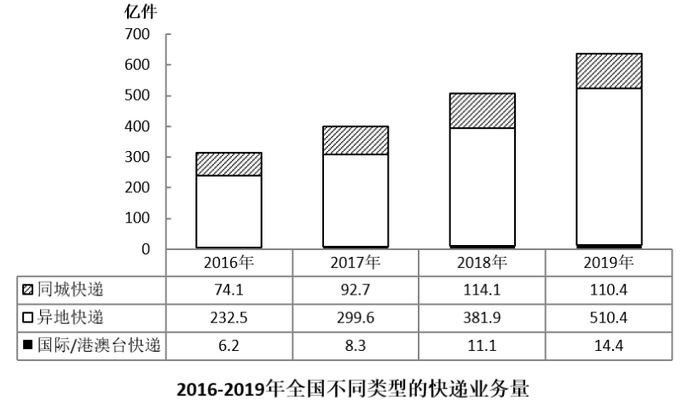

### 第 11 题　qid 4817773 · 增长

2017-2019年，我国快递业务收入同比增速超过20%的年份有几个？

- **A**. 0
- **B**. 1
- **C**. 2
- **D**. 3　✅

**答案**：D

**官方解析**

根据题干“2017-2019年，······同比增速超过20%的年份有几个”，可判定本题为一般增长率问题。定位文字材料第一、二段可得：2019年全年快递业务收入7497.8亿元；2016-2018年，我国快递业务收入分别为3974.4亿元、4957.1亿元、6038.4亿元。根据公式：增长率，可得2017-2019年，我国快递业务收入同比增速分别为：

2017年：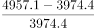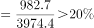；

2018年：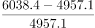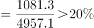；

2019年：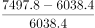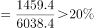。

则2017-2019年，我国快递业务收入同比增速超过20%的年份有3个。

故正确答案为D。

---

### 第 12 题　qid 4817779 · 平均数

2019年，中部地区平均每件快递产生的快递业务收入约是西部地区的多少倍？

- **A**. 0.5
- **B**. 0.8　✅
- **C**. 1.3
- **D**. 2.1

**答案**：B

**官方解析**

根据题干“2019年······是······的多少倍”，可判定本题为现期倍数问题。定位文字材料第一段可得：2019年，我国中部、西部地区分别完成业务量81.9亿件和47亿件。全年快递业务收入7497.8亿元，其中中部、西部地区的业务收入所占比重分别为11.3%和8.5%。根据公式：地区快递业务收入=全国快递业务收入×地区占比，则所求倍数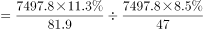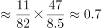，与B项最接近。

故正确答案为B。

---

### 第 13 题　qid 4817782 · 增长

将①同城快递、②异地快递、③国际/港澳台快递按2016-2019年业务量年均增速（以2016年为基期）从高到低排列，以下正确的是：

- **A**. ①②③
- **B**. ①③②
- **C**. ③①②
- **D**. ③②①　✅

**答案**：D

**官方解析**

根据题干“······年均增速（以2016年为基期）从高到低排列······”，可判定本题为年均增长率问题。定位统计图可知，2016年同城快递、异地快递和国际/港澳台快递业务量分别为74.1亿件、232.5亿件、6.2亿件；2019年同城快递、异地快递和国际/港澳台快递业务量分别为110.4亿件、510.4亿件、14.4亿件。根据年均增长率公式：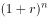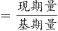（n为年份差），当年份差n相同时，比较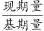即可。同城快递：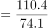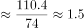；异地快递：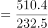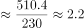；国际/港澳台快递：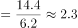，则年均增速从高到低的顺序为：③国际/港澳台快递、②异地快递、①同城快递，对应D项。

故正确答案为D。

---

### 第 14 题　qid 4817785 · 增长

如保持2019年同比增量不变，则全国异地快递业务量将在哪一年首次达到同城快递业务量的10倍以上？

- **A**. 2021年
- **B**. 2022年
- **C**. 2023年　✅
- **D**. 2024年

**答案**：C

**官方解析**

根据题干“如保持2019年同比增量不变，······哪一年首次达到同城快递业务量的10倍以上”，可判定本题为现期量计算问题。结合图形材料可得：2018年、2019年同城快递业务量依次为114.1亿件、110.4亿件，2019年同比增量为110.4-114.1=-3.7亿件；2018年、2019年异地快递业务量依次为381.9亿件、510.4亿件，2019年同比增量为510.4-381.9=128.5亿件。假设n年后异地快递业务量首次达到同城快递业务量的10倍以上，即510.4+128.5n＞10×（110.4-3.7n），整理得：165.5n＞593.6，即n＞3.5，n取值为4，题目所求年份为2019+4=2023年。
故正确答案为C。

---

### 第 15 题　qid 4817789 · 综合

不能从上述资料中推出的是：

- **A**. 2019年我国快递业务收入增速同比上升
- **B**. 2019年东部地区快递业务收入增量大于中部地区
- **C**. 2016-2019年我国年均快递业务收入超过5800亿元　✅
- **D**. 2019年我国异地快递业务量占快递业务总量的比重超过80%

**答案**：C

**官方解析**

A项：定位文字材料第一段及第二段可得，2017年、2018年、2019年我国快递业务收入分别为4957.1亿元、6038.4亿元、7497.8亿元。根据公式：增长率，则2019年我国快递业务收入增速为：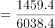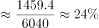，2018年增速为：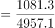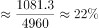，增速同比上升，正确；

B项：定位文字材料第一段及第二段可得，2019年我国东部地区快递业务收入=7497.8×80.2%，中部地区快递业务收入=7497.8×11.3%。2018年我国东部地区快递业务收入=6038.4×（80.2%-0.2%）=6038.4×80%，中部地区快递业务收入=6038.4×（11.3%-0.1%）=6038.4×11.2%。则2019年我国东部地区快递业务收入增量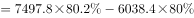亿元；2019年我国中部地区快递业务收入增量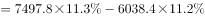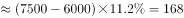亿元。东部地区快递业务收入增量大于中部地区，正确；

C项：定位文字材料第一段及第二段可得，2016年、2017年、2018年、2019年我国快递业务收入分别为3974.4亿元、4957.1亿元、6038.4亿元、7497.8亿元。则2016-2019年的年均快递业务收入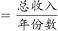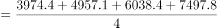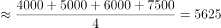亿元，未超过5800亿元，错误；

D项：定位文字材料第一段及图表可得，2019年我国快递业务量为635.2亿件，其中异地快递业务量510.4亿件，则异地快递业务量占快递业务总量的比重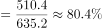，超过80%，正确。

本题为选非题，故正确答案为C。

---
