# 2022年国家公务员录用考试《行测》题（副省级网友回忆版）

> 资料分析 · 20 题 · 国考 2022

## 材料 1

        2021年1-2月，J省发电量为167亿千瓦时，其中风力发电量为17.4亿千瓦时。

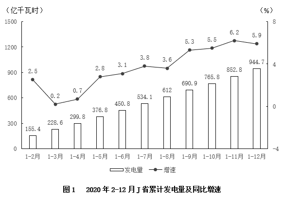

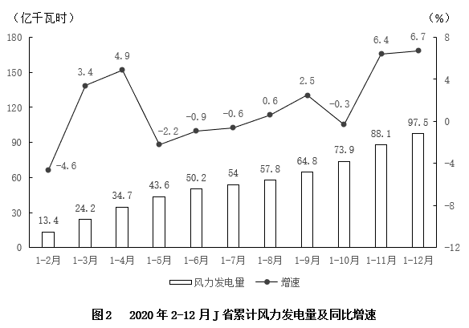

### 第 1 题　qid 4639483 · 综合

2020年第二季度，J省除风力发电之外的发电量在以下哪个范围内？

- **A**. 不到200亿千瓦时　✅
- **B**. 在200亿~215亿千瓦时
- **C**. 在215亿~230亿千瓦时
- **D**. 超过230亿千瓦时

**答案**：A

**官方解析**

定位图1可得：2020年1-3月J省累计发电量为228.6亿千瓦时，1-6月为450.8亿千瓦时。定位图2可得：2020年1-3月J省累计风力发电量为24.2亿千瓦时，1-6月为50.2亿千瓦时。则2020年第二季度J省除风力发电之外的发电量=（450.8-228.6）-（50.2-24.2）=222.2-26=亿千瓦时，在A项范围内。

故正确答案为A。

---

### 第 2 题　qid 4639489 · 增长

2021年1-2月J省累计发电量同比增速比同期风力发电量同比增速：

- **A**. 高不到10个百分点
- **B**. 低不到10个百分点
- **C**. 高10个百分点以上
- **D**. 低10个百分点以上　✅

**答案**：D

**官方解析**

根据题干“2021年1-2月······同比增速比······同比增速”，可判定本题为一般增长率问题。定位文字材料可得：2021年1-2月J省发电量为167亿千瓦时，其中风力发电量为17.4亿千瓦时。定位图1、图2可得：2020年1-2月J省累计发电量为155.4亿千瓦时，风力发电量为13.4亿千瓦时。根据公式：增长率，则题干所求，即低20个百分点以上，在D项范围内。

故正确答案为D。

---

### 第 3 题　qid 4639490 · 增长

2020年3-12月，J省当月发电量同比增速快于当月累计发电量同比增速的月份有几个？

- **A**. 5
- **B**. 6
- **C**. 7　✅
- **D**. 8

**答案**：C

**官方解析**

根据题干“2020年3-12月······当月发电量同比增速快于当月累计发电量同比增速······”，结合材料给出各月累计发电量同比增速，可判定本题为混合增长率问题。定位图1可得2020年2-12月J省各月累计发电量同比增速。当月累计发电量=上月累计发电量+当月发电量，要求当月发电量同比增速快于当月累计发电量同比增速，根据“整体增速介于两部分增速之间”，可得当月发电量同比增速＞当月累计发电量同比增速＞上月累计发电量同比增速，即当月累计发电量同比增速＞上月累计发电量同比增速时满足条件。则满足题意的有4月、5月、6月、7月、9月、10月、11月，共7个月。
故正确答案为C。

---

### 第 4 题　qid 4639492 · 综合

将2020年四个季度按J省风力发电量由高到低的顺序排列，以下正确的是：

- **A**. 第三季度、第一季度、第二季度、第四季度
- **B**. 第四季度、第二季度、第一季度、第三季度　✅
- **C**. 第四季度、第三季度、第一季度、第二季度
- **D**. 第三季度、第一季度、第四季度、第二季度

**答案**：B

**官方解析**

定位图2可得：2020年1-3月（第一季度）J省累计风力发电量为24.2亿千瓦时，1-6月为50.2亿千瓦时，1-9月为64.8亿千瓦时，1-12月为97.5亿千瓦时。则第二季度（4-6月）J省风力发电量=50.2-24.2=26亿千瓦时；第三季度（7-9月）J省风力发电量亿千瓦时；第四季度（10-12月）J省风力发电量亿千瓦时，由高到低排列为第四季度、第二季度、第一季度、第三季度。

故正确答案为B。

---

### 第 5 题　qid 4639494 · 综合

以下折线图反映了2020年哪个时间段内J省单月发电量的变化趋势？

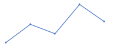

- **A**. 3-7月
- **B**. 4-8月　✅
- **C**. 5-9月
- **D**. 6-10月

**答案**：B

**官方解析**

定位图1可得2020年2-12月J省累计发电量，则3月发电量亿千瓦时；4月发电量亿千瓦时；5月发电量=376.8-299.8=77亿千瓦时；6月发电量=450.8-376.8=74亿千瓦时；7月发电量亿千瓦时；8月发电量亿千瓦时；9月发电量亿千瓦时；10月发电量亿千瓦时。折线图趋势为上升-下降-上升-下降，且时间段内的第4个月发电量最大，只有4-8月的单月发电量满足该变化趋势。

故正确答案为B。

---

## 材料 2

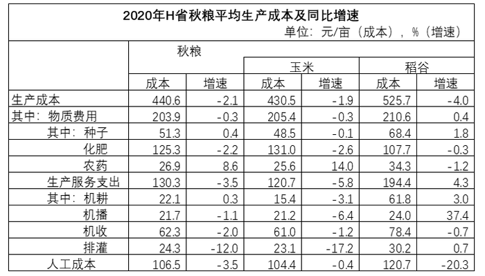

        2020年，H省秋粮玉米和稻谷的市场平均交易价格分别为2.34元/公斤和2.74元/公斤，分别比上年上涨28.6%和8.7%。按此价格测算，2020年全省农户种植玉米、稻谷扣除成本前的产值分别为957.1元/亩、1520.7元/亩，分别比上年增长33.4%、8.9%。

### 第 6 题　qid 4637423 · 平均数

2019年，H省秋粮稻谷的平均生产成本约为多少元/亩？

- **A**. 439
- **B**. 450
- **C**. 533
- **D**. 548　✅

**答案**：D

**官方解析**

根据题干“2019年······约为多少元/亩”，结合材料时间为2020年，可判定本题为基期计算问题。定位表格材料可得：2020年H省秋粮稻谷平均生产成本为525.7元/亩，同比增速为-4.0%。根据公式：基期量，可知2019年H省秋粮稻谷的平均生产成本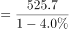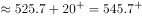元/亩，与D项最接近。

故正确答案为D。

---

### 第 7 题　qid 4637425 · 增长

将2020年H省秋粮机耕、机播、机收、排灌成本按同比增量从高到低的顺序排列，以下正确的是：

- **A**. 机收、排灌、机耕、机播
- **B**. 机耕、机播、机收、排灌　✅
- **C**. 机耕、机播、排灌、机收
- **D**. 机收、排灌、机播、机耕

**答案**：B

**官方解析**

根据题干“将2020年······同比增量从高到低的顺序······”，可判定本题为增长量比较问题。定位表格材料可得，2020年H省秋粮机耕成本、增速分别为22.1元/亩，0.3%；机播成本、增速分别为21.7元/亩，-1.1%；机收成本、增速分别为62.3元/亩，-2.0%；排灌成本、增速分别为24.3元/亩，-12.0%。根据机耕成本增长，其余成本均下降，则机耕成本同比增量最高，排除A、D两项。根据公式：增长量，可得机收成本同比增量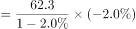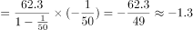；排灌成本同比增量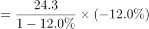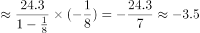；排灌成本同比增量（-3.5）&lt;机收成本同比增量（-1.3），排除C项。

故正确答案为B。

---

### 第 8 题　qid 4637426 · 综合

2020年，H省秋粮玉米和稻谷的亩产与上年相比：

- **A**. 仅稻谷亩产高于上年水平
- **B**. 仅玉米亩产高于上年水平
- **C**. 两者亩产均高于上年水平　✅
- **D**. 两者亩产均低于上年水平

**答案**：C

**官方解析**

根据题干“2020年······亩产与上年相比”，结合材料给出了每亩产值和平均交易价格，可判定本题为两期平均数比较问题。根据平均交易价格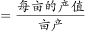，则有：亩产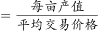。定位文字材料可知：2020年，H省秋粮玉米和稻谷的市场平均交易价格·······分别比上年上涨28.6%和8.7%（b）。按此价格测算，2020年全省农户种植玉米、稻谷扣除成本前的产值·······分别比上年增长33.4%、8.9%（a）。根据两期平均数比较理论，当a&gt;b时，平均数提高，即2020年H省秋粮玉米和稻谷的亩产均高于上年水平。

故正确答案为C。

---

### 第 9 题　qid 4637428 · 平均数

如种植收益=产值-生产成本，则2020年H省秋粮稻谷平均每亩的种植收益约是玉米的多少倍？

- **A**. 1.9　✅
- **B**. 1.6
- **C**. 0.7
- **D**. 0.5

**答案**：A

**官方解析**

根据题干“······2020年······是······的多少倍”，结合材料时间为2020年，可判定本题为现期倍数问题。定位统计表可得：2020年H省秋粮玉米和稻谷的平均生产成本分别为430.5元/亩和525.7元/亩；定位文字材料可得：2020年全省农户种植玉米、稻谷扣除成本前的产值分别为957.1元/亩、1520.7元/亩。根据题干条件“种植收益=产值-生产成本”，则所求倍数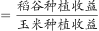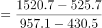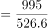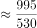。

故正确答案为A。

---

### 第 10 题　qid 4637429 · 平均数

2020年，H省农民老王在承包地中种植秋粮玉米，按全省平均生产成本估算，他在种子和农药上需要花费2000元。如亦按全省平均生产成本估算，他需要花费的人工成本在以下哪个范围内？

- **A**. 不到2000元
- **B**. 2000—2500元之间
- **C**. 2500—3000元之间　✅
- **D**. 超过3000元

**答案**：C

**官方解析**

根据题干“2020年······按全省平均生产成本估算······人工成本······”，结合材料与题干给出玉米种子和农药的平均生产成本与总成本的数据，可判定本题为现期平均数问题。定位表格材料可得：2020年，H省秋粮玉米种子的平均生产成本为48.5元/亩；农药的平均生产成本为25.6元/亩；玉米的人工成本为104.4元/亩。由材料可知：平均生产成本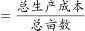，则老王承包土地的总亩数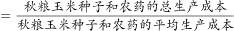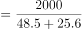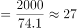亩。故按全省平均生产成本估算，老王需要花费的人工成本为元，在2500—3000元之间。

故正确答案为C。

---

## 材料 3

        2020年1-6月，全国电池制造业主要产品中，锂离子电池产量71.5亿只，同比增长1.3%；铅酸蓄电池产量9635.6万千伏安时，同比增长6.1%；原电池及原电池组（非扣式）产量178.2亿只，同比下降0.7%。

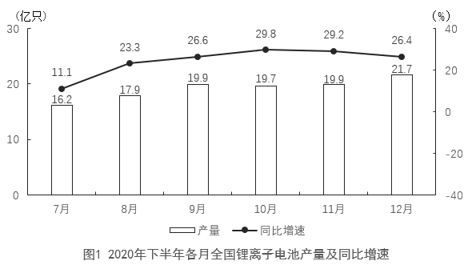

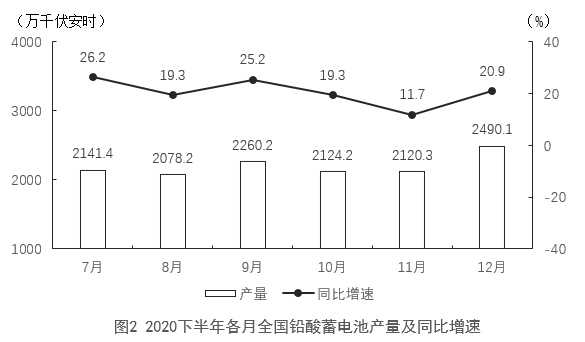

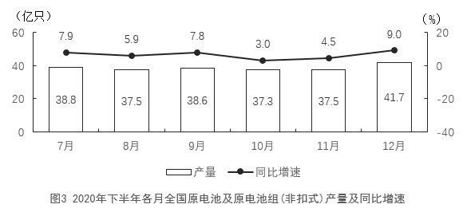

### 第 11 题　qid 4639650 · 综合

2019年上半年，全国铅酸蓄电池月均产量约为多少亿千伏安时？

- **A**. 0.13
- **B**. 0.14
- **C**. 0.15　✅
- **D**. 0.16

**答案**：C

**官方解析**

根据题干“2019年上半年······月均产量约为······”，结合材料时间为2020年1-6月，可判定本题为基期平均数问题。定位文字材料可得，2020年1-6月······铅酸蓄电池产量9635.6万千伏安时，同比增长6.1%。根据公式：基期量，则2019年上半年全国铅酸蓄电池月均产量万千伏安时亿千伏安时。

故正确答案为C。

---

### 第 12 题　qid 4639653 · 增长

2020年四季度，全国锂离子电池产量约比三季度增长了多少亿只？

- **A**. 5
- **B**. 7　✅
- **C**. 9
- **D**. 11

**答案**：B

**官方解析**

根据题干“2020年四季度······约比三季度增长了多少亿只”，可判定本题为增长量计算问题。定位统计图1可得：2020年7-12月各月全国锂离子电池产量分别为16.2亿只、17.9亿只、19.9亿只、19.7亿只、19.9亿只、21.7亿只。根据公式：增长量=现期量-基期量，则2020年四季度，全国锂离子电池产量比三季度增长了（19.7+19.9+21.7）-（16.2+17.9+19.9）=7.3亿只，与B项最接近。
故正确答案为B。

---

### 第 13 题　qid 4639655 · 比重

2020年下半年，全国原电池及原电池组（非扣式）产量占全年产量的比重在以下哪个范围内？

- **A**. 不到55%
- **B**. 55%~60%　✅
- **C**. 60%~65%
- **D**. 超过65%

**答案**：B

**官方解析**

根据题干“2020年下半年······占全年······的比重······”，结合材料时间为2020年，可判定本题为现期比重问题。定位文字材料可得：2020年1-6月全国原电池及原电池组（非扣式）产量178.2亿只；定位图3可得：2020年7-12月各月全国原电池及原电池组（非扣式）产量分别为38.8亿只、37.5亿只、38.6亿只、37.3亿只、37.5亿只、41.7亿只。根据公式：比重，则2020年下半年全国原电池及原电池组（非扣式）产量占全年产量的比重，在B项范围内。

故正确答案为B。

---

### 第 14 题　qid 4639657 · 增长

2020年下半年，全国锂离子电池产量同比增速快于铅酸蓄电池产量同比增速的月份有几个？

- **A**. 2
- **B**. 3
- **C**. 4
- **D**. 5　✅

**答案**：D

**官方解析**

定位图1、图2可得，2020年7-12月各月全国锂离子电池产量的同比增速和铅酸蓄电池产量的同比增速。比较可知，2020年下半年，全国锂离子电池产量同比增速快于铅酸蓄电池产量同比增速的月份有：8月（23.3%＞19.3%）、9月（26.6%＞25.2%）、10月（29.8%＞19.3%）、11月（29.2%＞11.7%）、12月（26.4%＞20.9%），共5个。
故正确答案为D。

---

### 第 15 题　qid 4639661 · 综合

能够从上述资料中推出的是：

- **A**. 2020年上半年，全国锂离子电池产量同比增长了不到1亿只　✅
- **B**. 2020年下半年，全国锂离子电池产量和原电池及原电池组（非扣式）产量最低的月份在同一个季度
- **C**. 2020年12月，全国铅酸蓄电池当年累计产量首次超过2亿千伏安时
- **D**. 2020年12月，全国锂离子电池产量环比增速快于同期铅酸蓄电池产量环比增速

**答案**：A

**官方解析**

A项：定位文字材料可得，2020年1-6月，全国锂离子电池产量71.5亿只，同比增长1.3%。根据公式：增长量，则2020年上半年，全国锂离子电池产量的同比增长量亿只，正确；

B项：定位图1和图3可得2020年下半年各月全国锂离子电池产量和原电池及原电池组（非扣式）产量。比较可知，2020年下半年全国锂离子电池产量最低的月份在7月（16.2亿只），为第三季度；原电池及原电池组（非扣式）产量最低的月份在10月（37.3亿只），为第四季度。非同一季度，错误；

C项：定位文字材料可得，2020年1-6月，全国铅酸蓄电池产量9635.6万千伏安时；定位图2可得，2020年下半年各月全国铅酸蓄电池产量分别为2141.4万千伏安时、2078.2万千伏安时、2260.2万千伏安时、2124.2万千伏安时、2120.3万千伏安时、2490.1万千伏安时。则2020年11月全国铅酸蓄电池当年累计产量为9635.6+2141.4+2078.2+2260.2+2124.2+2120.3＞9600+2100+2000+2200+2100+2100=20100万千伏安时＞20000万千伏安时=2亿千伏安时，故12月全国铅酸蓄电池当年累计产量并非首次超过2亿千伏安时，错误；

D项：定位图1可得，2020年11月和12月全国锂离子电池产量分别为19.9亿只和21.7亿只；定位图2可得，2020年11月和12月全国铅酸蓄电池产量分别为2120.3万千伏安时和2490.1万千伏安时。根据公式：增长率，则2020年12月全国锂离子电池产量的环比增速，2020年12月全国铅酸蓄电池产量的环比增速。前者慢于后者，错误。

故正确答案为A。

---

## 材料 4

        2020年12月，C市天然气用量为9.67亿立方米，同比增长11.66%。从供应结构看：中石油供应7.22亿立方米，同比增长7.44%；中石化供应2.45亿立方米，同比增长26.29%。从用气结构看：民用气为3.98亿立方米，同比增长16.72%；CNG用气0.64亿立方米，同比下降7.25%；工业用气5.05亿立方米，同比增长10.75%。

        2020年，C市天然气用量为107.47亿立方米，同比增长3.83%。其中，中石油供应73.96亿立方米，同比增长1.72%；中石化供应33.51亿立方米，同比增长8.8%。从用气结构看：民用气为33.75亿立方米，同比增长5.4%；CNG用气6.99亿立方米，同比下降13.92%；工业用气66.73亿立方米，同比增长5.3%。

        2021年2月，C市天然气用量为9.31亿立方米，同比增长21.38%。从供应结构看：中石油供应6.7亿立方米，同比增长25.23%；中石化供应2.61亿立方米，同比增长12.5%。从用气结构看：民用气为3.56亿立方米，同比增长16.34%；CNG用气0.52亿立方米，同比增长205.88%；工业用气5.23亿立方米，同比增长17.79%。

        2021年1—2月，C市天然气用量为19.21亿立方米，同比增长12.8%。其中，中石油供应14.23亿立方米，同比增长18.88%；中石化供应4.98亿立方米，同比下降1.58%。从用气结构看：民用气为7.78亿立方米，同比增长12.75%；CNG用气1.14亿立方米，同比增长44.3%；工业用气10.29亿立方米，同比增长10.17%。

### 第 16 题　qid 4637442 · 综合

2021年1月，C市天然气用量比上月：

- **A**. 增加了0.2亿立方米以上　✅
- **B**. 减少了不到0.2亿立方米
- **C**. 减少了0.2亿立方米以上
- **D**. 增加了不到0.2亿立方米

**答案**：A

**官方解析**

根据题干“2021年1月······比上月”，结合选项带单位，可判定本题为增长量计算问题。定位文字材料第一、三、四段可得：2020年12月，C市天然气用量为9.67亿立方米；2021年2月，C市天然气用量为9.31亿立方米；2021年1—2月，C市天然气用量为19.21亿立方米。则2021年1月C市天然气用量=2021年1—2月C市天然气用量-2021年2月C市天然气用量=19.21-9.31=9.9亿立方米。故2021年1月C市天然气用量比上月（2020年12月）增加了亿立方米0.2亿立方米。

故正确答案为A。

---

### 第 17 题　qid 4637445 · 比重

2020年，中石化供气量占C市天然气用量的比重比上年：

- **A**. 减少了不到3个百分点
- **B**. 增加了不到3个百分点　✅
- **C**. 减少了3个百分点以上
- **D**. 增加了3个百分点以上

**答案**：B

**官方解析**

根据题干“2020年······占······的比重比上年”，结合选项为增加/减少+百分点，可判定本题为两期比重计算问题。定位文字材料第二段可得：2020年，C市天然气用量为107.47亿立方米（B），同比增长3.83%（b）。中石化供应33.51亿立方米（A），同比增长8.8%（a）。根据公式：两期比重差，则2020年与上年的比重差值为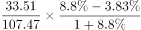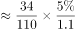，即增加了不到1.5个百分点，只有B项符合。

故正确答案为B。

---

### 第 18 题　qid 4637447 · 综合

2019—2020年，C市CNG用气总量约为多少亿立方米？

- **A**. 15　✅
- **B**. 17
- **C**. 11
- **D**. 13

**答案**：A

**官方解析**

根据题干“2019—2020年······约为多少亿立方米”，结合材料中只给出了2020年的数据，可判定本题为基期计算问题。定位文字材料第二段可得：2020年，C市天然气用量为107.47亿立方米，同比增长3.83%。其中······CNG用气6.99亿立方米，同比下降13.92%。根据公式：基期量，则2019年C市CNG用气量为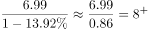亿立方米，故2019—2020年，C市CNG用气总量为亿立方米，与A项最接近。

故正确答案为A。

---

### 第 19 题　qid 4637459 · 比重

以下哪个饼图最能准确反映2021年1—2月C市天然气用量中，民用气（白色）、CNG用气（黑色）和工业用气（斜线）的占比关系？

- **A**. 

- **B**. 

- **C**. 

- **D**. 

　✅

**答案**：D

**官方解析**

根据题干“以下哪个饼图最能准确反映2021年1—2月······的占比关系”，结合材料时间为2021年，可判定本题为现期比重问题。定位文字材料第四段可得“2021年1—2月，C市天然气用量为19.21亿立方米······从用气结构看：民用气为7.78亿立方米；CNG用气1.14亿立方米；工业用气10.29亿立方米”。因此，民用气占比为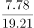，观察图形，A、B两项民用气占比大于50%，C项民用气占比小于25%，均不满足，排除A、B、C三项，D项当选。

故正确答案为D。

---

### 第 20 题　qid 4637465 · 综合

以下柱状图反映了C市天然气2020年12月—2021年2月间哪一数值的变化趋势？

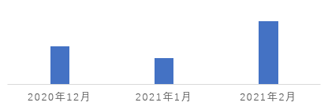

- **A**. 中石油供气量
- **B**. 中石化供气量　✅
- **C**. 民用气用量
- **D**. 工业用气用量

**答案**：B

**官方解析**

定位文字材料第一段可知，2020年12月，中石油供应7.22亿立方米，中石化供应2.45亿立方米，民用气为3.98亿立方米，工业用气5.05亿立方米。定位文字材料第三段可知，2021年2月，中石油供应6.7亿立方米，中石化供应2.61亿立方米，民用气为3.56亿立方米，工业用气5.23亿立方米。定位文字材料第四段可知，2021年1—2月，中石油供应14.23亿立方米，中石化供应4.98亿立方米，民用气为7.78亿立方米，工业用气10.29亿立方米。所以2021年1月，中石油供应=14.23-6.7=7.53亿立方米，中石化供应=4.98-2.61=2.37亿立方米，民用气=7.78-3.56=4.22亿立方米，工业用气=10.29-5.23=5.06亿立方米。观察发现，图中数据的变化趋势是先下降，再上升，满足变化趋势的只有中石化供气量。
故正确答案为B。

---
