# 2022年国家公务员录用考试《行测》题（行政执法卷网友回忆版）

> 资料分析 · 20 题 · 国考 2022

## 材料 1

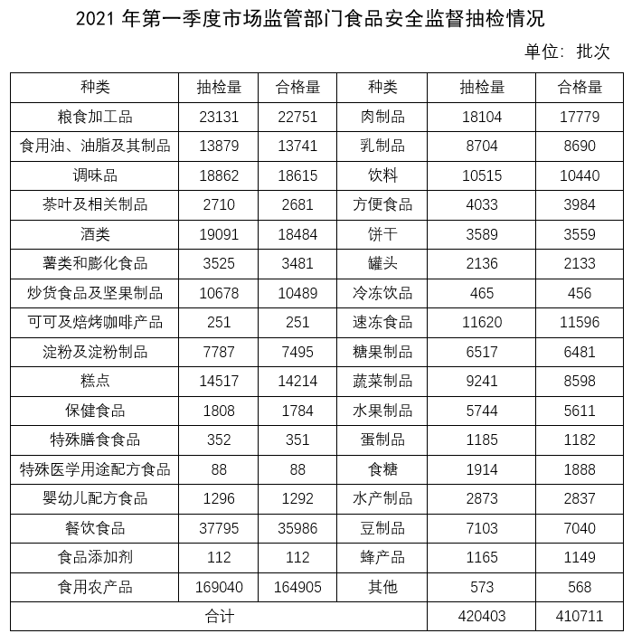

### 第 1 题　qid 4637198 · 综合

表中所列食品类别中，2021年第一季度所有抽检样本全部合格的有几类？

- **A**. 2
- **B**. 3　✅
- **C**. 4
- **D**. 5

**答案**：B

**官方解析**

定位表格材料可得，抽检量与合格量相等的种类有“可可及焙烤咖啡产品”、“特殊医学用途配方食品”、“食品添加剂”，共3类。
故正确答案为B。

---

### 第 2 题　qid 4637199 · 综合

2021年第一季度市场监管部门食品安全监督抽检的总体不合格率在以下哪个范围内？

- **A**. 不到1%
- **B**. 1%～2%之间
- **C**. 2%～3%之间　✅
- **D**. 3%以上

**答案**：C

**官方解析**

根据题干“2021年第一季度······的总体不合格率······”，结合材料给出2021年第一季度抽检量和合格量，可判定本题为现期比重问题。定位表格材料可知，2021年第一季度的总抽检量为420403批次，总合格量为410711批次。代入公式：不合格率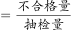，则抽检的总体不合格率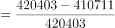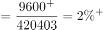，在C项范围。

故正确答案为C。

---

### 第 3 题　qid 4637200 · 综合

2021年第一季度市场监管部门食品安全监督抽检量最多的3个食品类别，同期抽检不合格量约是其余所有类别抽检不合格量的多少倍？

- **A**. 0.5
- **B**. 0.8
- **C**. 1.3
- **D**. 1.9　✅

**答案**：D

**官方解析**

根据题干“2021年第一季度······是······的多少倍”，结合材料时间为2021年第一季度，可判定本题为现期倍数计算问题。定位表格材料可知，2021年第一季度市场监管部门食品安全监督抽检量最多的3个食品类别分别是食用农产品（169040批次）、餐饮食品（37795批次）、粮食加工品（23131批次），且食用农产品合格量为164905批次、餐饮食品合格量为35986批次、粮食加工品合格量为22751批次，同期抽检的所有食品合计抽检量为420403批次，合格量为410711批次。则食用农产品、餐饮食品、粮食加工品不合格量之和=（169040-164905）+（37795-35986）+（23131-22751）批次，同期抽检的所有食品不合格量=420403-410711批次。所以题干所求倍。

故正确答案为D。

---

### 第 4 题　qid 4637202 · 综合

将①肉制品、②乳制品和③蛋制品按2021年第一季度市场监管部门食品安全监督抽检合格率从高到低排列，以下正确的是：

- **A**. ①②③
- **B**. ①③②
- **C**. ③②①
- **D**. ②③①　✅

**答案**：D

**官方解析**

根据题干“······2021年第一季度······抽检合格率从高到低······”，结合材料给出抽检量和合格量，可判定本题为现期比重比较问题。定位表格材料可得：2021年第一季度肉制品抽检量为18104批次、合格量为17779批次，乳制品抽检量为8704批次、合格量为8690批次，蛋制品抽检量为1185批次、合格量为1182批次，则①肉制品抽检合格率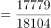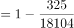②乳制品抽检合格率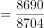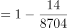，③蛋制品抽检合格率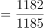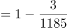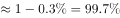，三者按从高到低排列为②③①。

故正确答案为D。

---

### 第 5 题　qid 4637204 · 倍数

关于2021年第一季度市场监管部门食品安全监督情况，以下信息能够从上述资料中推出的有几项？
①蔬菜、水果制品的总体抽检合格率高于95%
②样品抽检量超过1万批次的食品类别有12个
③糕点类食品的抽检合格量是不合格量的50倍以上

- **A**. 0项　✅
- **B**. 1项
- **C**. 2项
- **D**. 3项

**答案**：A

**官方解析**

①： 定位统计表可知，蔬菜制品的抽检量为9241，合格量为8598；水果制品的抽检量为5744，合格量为5611。根据合格率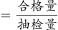，则蔬菜，水果制品的总体抽检合格率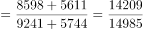。故蔬菜，水果制品的总体抽检合格率并非高于95%，错误；

②：定位统计表可知，样品抽检量超过1万批次的食品类别有：粮食加工品，食用油、油脂及其制品，调味品，酒类，炒货食品及坚果制品，糕点，餐饮食品，食用农产品，肉制品，饮料，速冻食品，共11个，错误；

③：定位统计表可知，糕点类食品的抽检量为14517，合格量为14214，则抽检不合格量为：14517-14214=303，因为14214&lt;303×50=15150，因此糕点类食品的抽检合格量不到不合格量的50倍，错误。

故正确答案为A。

---

## 材料 2

        2020年12月，全国“12369环保举报联网管理平台”共接到环保举报31156件，环比下降23.2%，同比下降10.3%，其中，受理量23792件，较11月减少6316件；因举报线索不详或不属于生态环境部门职责范围而未受理7364件，较11月减少3119件。

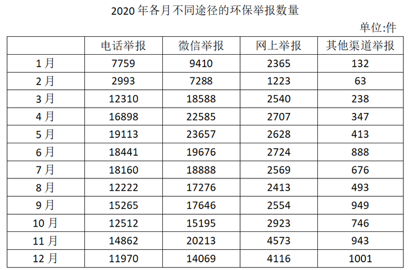

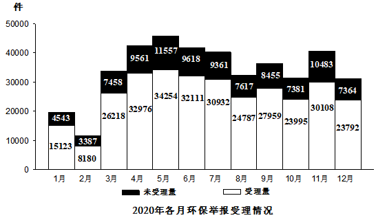

### 第 6 题　qid 4637127 · 综合

2020年1月，全国“12369环保举报联网管理平台”接到环保举报件数比上个月：

- **A**. 下降了不到30%
- **B**. 下降了30%以上　✅
- **C**. 上升了不到30%
- **D**. 上升了30%以上

**答案**：B

**官方解析**

根据题干“2020年1月······比上个月”，结合选项为百分数，可判定本题为一般增长率计算问题。定位文字材料可得：2020年12月，全国“12369环保举报联网管理平台”共接到环保举报31156件，环比下降23.2%，同比下降10.3%。根据公式：基期量，则2019年12月，全国“12369环保举报联网管理平台”共接到环保举报件数为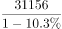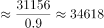件；定位柱状图可得：2020年1月，全国“12369环保举报联网管理平台”接到环保举报件数中未受理量为4543件，受理量为15123件。则2020年1月，全国“12369环保举报联网管理平台”接到环保举报件数为4543+15123=19666件。根据公式：增长率，则所求增长率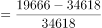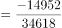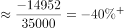，即下降了30%以上，对应B项。

故正确答案为B。

---

### 第 7 题　qid 4637133 · 比重

2020年1～4月，通过微信举报的件数占当月环保举报件数比重最高的月份是：

- **A**. 1月
- **B**. 2月　✅
- **C**. 3月
- **D**. 4月

**答案**：B

**官方解析**

根据题干“2020年1～4月······占······比重”，结合材料时间为2020年各月，可判定本题为现期比重问题。定位表格材料可得：2020年1～4月，各月通过微信举报的件数分别为9410件、7288件、18588件、22585件。通过微信举报的件数占当月环保举报件数比重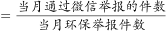，由环保举报件数=受理量+未受理量，定位统计图可得：2020年1～4月，各月环保举报件数分别为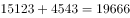件、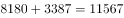件、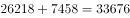件、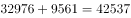件。故2020年1～4月，各月通过微信举报的件数占当月环保举报件数比重分别为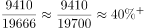、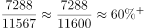、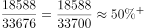、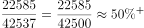，即2月通过微信举报的件数占当月环保举报件数比重最高。

故正确答案为B。

---

### 第 8 题　qid 4637135 · 综合

2020年下半年，环保举报的受理率超过75%的月份有几个？

- **A**. 3
- **B**. 4
- **C**. 5　✅
- **D**. 6

**答案**：C

**官方解析**

根据题干“2020年下半年······受理率······”，结合材料时间为2020年各月，可判定本题为现期比重问题。根据受理率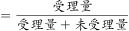，2020年下半年为2020年7~12月，定位统计图可得：

2020年7月，环保举报的受理率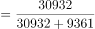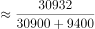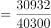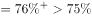；

2020年8月，环保举报的受理率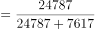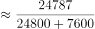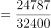；

2020年9月，环保举报的受理率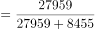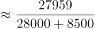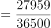；

2020年10月，环保举报的受理率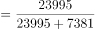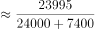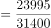；

2020年11月，环保举报的受理率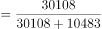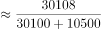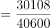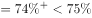；

2020年12月，环保举报的受理率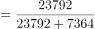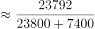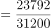。

故2020年下半年，环保举报的受理率超过75%的月份有7月、8月、9月、10月和12月，共5个月份。

故正确答案为C。

---

### 第 9 题　qid 4637137 · 综合

如同一个月内各类举报的受理率彼此相同，则2020年12月通过电话的环保举报被受理的件数在以下哪个范围内？

- **A**. 低于7501件
- **B**. 7501～8500件之间
- **C**. 8501～9500件之间　✅
- **D**. 高于9500件

**答案**：C

**官方解析**

根据题干“2020年12月······件数在以下哪个范围内”，结合材料给出通过电话的环保举报数量及举报量与受理量，可判定本题为现期比重问题。定位文字材料可得：2020年12月，全国“12369环保举报联网管理平台”共接到环保举报31156件······受理量23792件。根据公式：受理率，则2020年12月的受理率。定位表格材料可得：2020年12月，通过电话的环保举报数量为11970件。根据公式：受理量=受理率×举报量，由“同一个月内各类举报的受理率彼此相同”，则2020年12月通过电话的环保举报被受理的件数=受理率×电话举报数量件，在8501~9500件之间。

故正确答案为C。

---

### 第 10 题　qid 4637138 · 综合

以下折线图反映了2020年第二季度各月哪类环保举报件数环比增量的变化趋势？

- **A**. 电话举报
- **B**. 微信举报
- **C**. 网上举报
- **D**. 其他渠道举报　✅

**答案**：D

**官方解析**

根据题干“······环比增量的变化趋势”，可判定本题为增长量比较问题。定位表格材料可得：2020年3~6月各途径的环保举报数量。观察折线图，该类途径第二季度各月环比增量应符合：6月增量＞4月增量＞5月增量。

根据公式：增长量=现期量-基期量，则2020年第二季度各途径的环保举报件数的环比增量如下：

电话举报：4月，件；5月，件；6月，18441-19113＜0件。4月增量＞5月增量＞6月增量，不符合；

微信举报：4月，件；5月，件；6月，19676-23657＜0件。4月增量＞5月增量＞6月增量，不符合；

网上举报：4月，件；5月，2628-2707＜0件；6月，件。4月增量＞6月增量＞5月增量，不符合；

其他渠道举报：4月，件；5月，件；6月，件。6月增量＞4月增量＞5月增量，变化趋势恰好与折线图相符合。

故正确答案为D。

---

## 材料 3

### 第 11 题　qid 4637154 · 综合

2019年，中国IC先进封装市场规模约为多少亿元?

- **A**. 235
- **B**. 252
- **C**. 279
- **D**. 296　✅

**答案**：D

**官方解析**

根据题干“2019年，中国IC先进封装市场规模约为多少亿元”，结合材料给出2019年中国IC封装市场规模以及IC先进封装市场规模的占比，可判定本题为现期比重问题。定位统计图可得：2019年中国IC封装市场规模为2349.7亿元，IC先进封装市场规模占比为12.58%。根据公式：部分=整体×比重，则2019年中国IC先进封装市场规模亿元，只有D项满足。

故正确答案为D。

---

### 第 12 题　qid 4637156 · 综合

“十三五”（2016-2020年）期间，中国IC封装市场总规模：

- **A**. 不到1.0万亿元
- **B**. 在1.0~1.1万亿元之间　✅
- **C**. 在1.1~1.2万亿元之间
- **D**. 超过1.2万亿元

**答案**：B

**官方解析**

定位统计图可得，2016-2020年中国IC封装市场规模分别为1564.3、1889.7、2193.9、2349.7、2478.9亿元。则“十三五”期间IC封装市场总规模为1564.3+1889.7+2193.9+2349.7+2478.92000×5+（-440-110+190+350+480）=10470亿元=1.047万亿元，在B项范围之内。

故正确答案为B。

---

### 第 13 题　qid 4637157 · 增长

2012~2020年，中国IC封装市场中IC先进封装市场规模占比同比提升1个百分点以上的年份有几个？

- **A**. 2　✅
- **B**. 3
- **C**. 4
- **D**. 5

**答案**：A

**官方解析**

定位统计图，可知2011-2020年中国IC封装市场中IC先进封装市场规模占比，则其占比同比提升1个百分点以上的有2012年（5.65%-4.12%＞1%）、2015年（9.91%-7.37%＞1%），共2年。
故正确答案为A。

---

### 第 14 题　qid 4637158 · 增长

2012~2020年，中国IC封装市场规模同比增量最大的年份是:

- **A**. 2016年
- **B**. 2017年　✅
- **C**. 2018年
- **D**. 2019年

**答案**：B

**官方解析**

根据题干“······同比增量最大的年份是”，可判定本题为增长量比较问题。定位统计图可得：中国IC封装市场规模2015年、2016年、2017年、2018年、2019年分别是1384.0亿元、1564.3亿元、1889.7亿元、2193.9亿元、2349.7亿元。根据公式：增长量=现期量-基期量，则2016-2019年中国IC封装市场规模的同比增长量分别为：

2016年：亿元；

2017年：亿元；

2018年：亿元；

2019年：亿元。

比较可知，中国IC封装市场规模同比增长量最大的年份是2017年。

故正确答案为B。

---

### 第 15 题　qid 4637160 · 增长

已知2020年中国IC封装市场规模同比增长x亿元，IC封装市场中IC先进封装市场规模占比同比增长y个百分点，而2020年往后中国IC封装市场规模及IC先进封装市场规模占比每年都分别同比增长x亿元和y个百分点，则到“十四五”最后一年（2025年），中国IC先进封装市场规模将达到多少亿元?

- **A**. 433
- **B**. 469
- **C**. 521　✅
- **D**. 575

**答案**：C

**官方解析**

根据题干“······‘十四五’最后一年（2025年）······将达到多少亿元”，可判定本题为现期计算问题。定位统计图可得：2020年、2019年IC封装市场规模分别为2478.9亿元、2349.7亿元；IC先进封装市场规模占比分别为13.26%、12.58%。则x=2478.9-2349.7=129.2亿元；y=13.26%-12.58%=0.68%，即0.68个百分点。根据公式：现期量=基期量+增长量×n，则2025年IC封装市场规模=2478.9+129.2×5=3124.9亿元，IC先进封装市场规模占比=13.26%+0.68%×5=16.66%。根据公式：部分=总体×比重，则2025年中国IC先进封装市场规模将达到亿元。

故正确答案为C。

---

## 材料 4

        2021年1-5月，全国共破获电信网络诈骗案件11.4万起，打掉犯罪团伙1.4万个，抓获犯罪嫌疑人15.4万名，同比分别上升60.4%、80.6%和146.5%。2021年5月，全国共立电信网络诈骗案件8.46万起，与4月相比下降14.3%。

        2021年1-5月，全国拦截诈骗电话6.1亿次，拦截诈骗短信9.1亿条，封堵诈骗网址82.1万个。1-5月公安部日均下发预警指令5.2万条。

        2021年1-5月，全国共成功劝阻771万名群众免于受骗，紧急止付涉案资金2654亿元，为群众挽回经济损失991亿元。

        2021年1-5月，全国公安机关捣毁境内诈骗窝点6500余个，共破获被骗百万元以上案件881起，同比上升160.5%，先后组织20余次集中收网行动，抓获犯罪嫌疑人2421名，打掉技术开发平台、网络引流推广、虚拟货币洗钱等团伙380余个。

        2020年10月至2021年5月，全国公安机关会同检察、法院、通讯、金融等部门，共打掉“两卡”违法犯罪团伙1.5万个，缴获涉诈电话卡373.3万张，银行卡56.6万张，惩戒“两卡”失信人员17.3万名，整治违规行业网点，机构1.8万家。

### 第 16 题　qid 4637139 · 平均数

2020年1-5月，全国平均每月打掉电信网络诈骗犯罪团伙：

- **A**. 不到1000个
- **B**. 1000～2000个之间　✅
- **C**. 2000～4000个之间
- **D**. 4000个以上

**答案**：B

**官方解析**

根据题干“2020年1-5月······平均每月······”，结合材料时间为2021年，可判定本题为基期平均数问题。定位文字材料第一段可得：2021年1-5月，全国打掉犯罪团伙1.4万个，同比上升80.6%。根据公式：基期量，可得2020年1-5月全国打掉电信网络诈骗犯罪团伙个数。则2020年1-5月，全国平均每月打掉电信网络诈骗犯罪团伙个数，属于B项的范围。

故正确答案为B。

---

### 第 17 题　qid 4637140 · 综合

2021年4-5月，全国共立电信网络诈骗案件约多少万起？

- **A**. 12
- **B**. 14
- **C**. 16
- **D**. 18　✅

**答案**：D

**官方解析**

根据题干“2021年4-5月······约多少万起”，结合材料时间为2021年5月，可判定本题为基期计算问题。定位文字材料第一段可得：2021年5月，全国共立电信网络诈骗案件8.46万起，与4月相比下降14.3%。根据公式：基期量，则2021年4月全国共立电信网络诈骗案件万起。故2021年4-5月，全国共立电信网络诈骗案件=8.46＋9.87=18.33万起，与D项最接近。

故正确答案为D。

---

### 第 18 题　qid 4637142 · 平均数

2021年1-5月，全国平均每天拦截诈骗短信约多少万条？

- **A**. 545
- **B**. 571
- **C**. 603　✅
- **D**. 659

**答案**：C

**官方解析**

根据题干“2021年1-5月······平均每天······”，结合材料时间为2021年1-5月，可判定本题为现期平均数问题。定位文字材料第二段可得：2021年1-5月，全国拦截诈骗短信9.1亿条。2021年1-5月共计31+28+31+30+31=151天，则平均每天拦截诈骗短信万条。

故正确答案为C。

---

### 第 19 题　qid 4637143 · 综合

2021年1-5月，全国紧急止付涉案资金金额约是为群众挽回经济损失金额的多少倍？

- **A**. 2.7　✅
- **B**. 2.4
- **C**. 2.1
- **D**. 1.8

**答案**：A

**官方解析**

根据题干“2021年1-5月······是······的多少倍”，结合材料时间为2021年1-5月，可判定本题为现期倍数问题。定位文字材料第三段可得：2021年1-5月，全国紧急止付涉案资金2654亿元，为群众挽回经济损失991亿元，则题目所求倍数倍。

故正确答案为A。

---

### 第 20 题　qid 4637144 · 平均数

以下信息中，能够从上述资料中推出的有几项？
①2020年1-5月，全国抓获电信网络诈骗犯罪嫌疑人10万名以上
②2021年1-5月，全国公安机关破获被骗百万元以上案件比去年同期多500件以上
③2020年10月-2021年5月，每打掉1个“两卡”违法犯罪团伙，平均缴获的电话卡和银行卡总量就在300张以上

- **A**. 0项
- **B**. 1项　✅
- **C**. 2项
- **D**. 3项

**答案**：B

**官方解析**

①：定位文字材料第一段可得：2021年1-5月，全国共破获电信网络诈骗案件······抓获犯罪嫌疑人15.4万名，同比分别上升······146.5%。根据公式：基期量，则2020年1-5月，全国抓获电信网络诈骗犯罪嫌疑人 万名万名，错误；

②：定位文字材料第四段可得：2021年1-5月，全国公安机关共破获被骗百万元以上案件881起，同比上升160.5%。根据公式：增长量，则2021年1-5月，全国公安机关破获被骗百万元以上案件同比增长量起，正确；

③：定位文字材料第五段可得：2020年10月至2021年5月，全国公安机关会同检察、法院、通讯、金融等部门，共打掉“两卡”违法犯罪团伙1.5万个，缴获涉诈电话卡373.3万张，银行卡56.6万张。则题目所求平均数张，错误。

综上所述，只有②正确，共1项。

故正确答案为B。

---
