# 2022年天津市公务员录用考试《行测》试题（网友回忆版）

> 资料分析 · 15 题 · 天津 2022

## 材料 1

        2021年1～9月，我国机床工具进出口总额242.6亿美元，同比增长32.8%。其中，机床工具商品进口105.2亿美元，同比增长23.7%；出口137.4亿美元，同比增长40.8%。

        从进口来源来看，2021年1～9月进口来源前三位分别是：日本34.5亿美元，同比增长37.8%；德国 22.2亿美元，同比增长11.0%；中国台湾14.3亿美元，同比增长36.1%。

        从出口去向来看，2021年1～9月出口去向前三位分别是：美国17.5亿美元，同比增长27.4%；越南10.5亿美元，同比增长35.4%；印度8.8亿美元，同比增长67.8%。

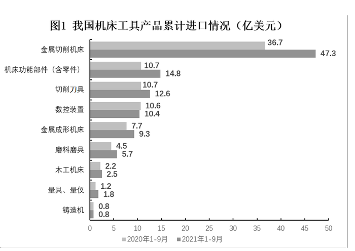

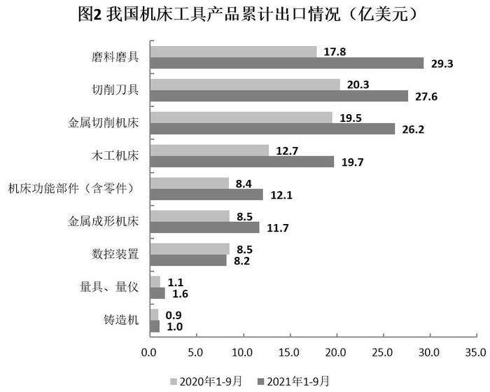

### 第 1 题　qid 5104795 · 综合

2020年1～9月，我国机床工具贸易状况为：

- **A**. 顺差10亿美元以上　✅
- **B**. 顺差不到10亿美元
- **C**. 逆差10亿美元以上
- **D**. 逆差不到10亿美元

**答案**：A

**官方解析**

根据题干“2020年1～9月，我国机床工具贸易状况为”，结合材料时间为2021年1～9月，可判定本题为基期和差问题。定位文字材料第一段可得：2021年1～9月······机床工具商品进口105.2亿美元，同比增长23.7%；出口137.4亿美元，同比增长40.8%。根据公式：基期量，则2020年1～9月我国机床工具贸易状况：出口额-进口额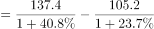亿美元，即2020年1～9月的贸易状况为顺差10亿美元以上。

故正确答案为A。

---

### 第 2 题　qid 5104800 · 增长

2021年1～9月，我国机床工具对美国出口额同比约增长多少亿美元？

- **A**. 1.9
- **B**. 2.3
- **C**. 3.1
- **D**. 3.8　✅

**答案**：D

**官方解析**

根据题干“2021年1～9月，······同比约增长多少亿美元”，可判定本题为增长量计算问题。定位文字材料第三段可得：2021年1～9月，我国机床工具对美国出口额为17.5亿美元，同比增长27.4%。根据公式：增长量，则2021年1～9月，我国机床工具对美国出口额同比增长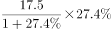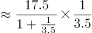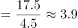亿美元，与D项最接近。

故正确答案为D。

---

### 第 3 题　qid 5104804 · 比重

2020年1～9月，进口额占机床工具进口额比重超过10%的机床工具产品有几种？

- **A**. 1
- **B**. 2
- **C**. 3
- **D**. 4　✅

**答案**：D

**官方解析**

方法一：根据题干“2020年1～9月······占······比重超过10%的机床工具产品有几种”，结合材料时间为2021年1～9月，可判定本题为基期比重问题。定位文字材料第一段可得：2021年1～9月，机床工具商品进口105.2亿美元，同比增长23.7%。根据公式：基期量，则2020年1～9月机床工具商品进口额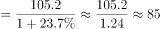亿美元。根据公式：比重，若比重超过10%，则部分＞整体×10%，即各类机床工具产品进口额＞85×10%=8.5亿美元。定位图1可得，2020年1～9月满足条件的机床工具产品有金属切削机床（36.7亿美元）、机床功能部件（含零件）（10.7亿美元）、切削刀具（10.7亿美元）、数控装置（10.6亿美元），共4种。

方法二：根据题干“2020年1～9月······占······比重超过10%的机床工具产品有几种”，结合材料给出2020年1-9月各类型机床工具进口额，可判定本题为基期比重问题。定位图1可知2020年1-9月各类型机床工具进口额，则2020年1-9月机床工具进口额为36.7+10.7+10.7+10.6+7.7+4.5+2.2+1.2+0.8=85.1亿美元。根据公式：比重，若比重超过10%，则部分＞整体×10%，即各类机床工具产品进口额＞85.1×10%=8.51亿美元，满足条件的有金属切削机床（36.7亿美元）、机床功能部件（含零件）（10.7亿美元）、切削刀具（10.7亿美元）、数控装置（10.6亿美元），共4种。

故正确答案为D。

---

### 第 4 题　qid 5104806 · 综合

2021年1～9月，下列产品中我国对外贸易顺差最大的是：

- **A**. 金属切削机床
- **B**. 磨料磨具　✅
- **C**. 切削刀具
- **D**. 机床功能部件（含零件）

**答案**：B

**官方解析**

定位统计图1可得，2021年1～9月，我国金属切削机床、磨料磨具、切削刀具以及机床功能部件（含零件）进口额分别为47.3亿美元、5.7亿美元、12.6亿美元、14.8亿美元；定位统计图2可得，2021年1～9月，我国金属切削机床、磨料磨具、切削刀具以及机床功能部件（含零件）出口额分别为26.2亿美元、29.3亿美元、27.6亿美元、12.1亿美元。则我国对外贸易实现顺差的有：磨料磨具，29.3-5.7=23.6亿美元；切削刀具，27.6-12.6=15亿美元。比较可知，2021年1～9月，我国对外贸易顺差最大的产品是磨料磨具（23.6亿美元）。
故正确答案为B。

---

### 第 5 题　qid 5104810 · 综合

能够从上述资料中推出的是：

- **A**. 2021年1～9月，我国机床工具自日本进口同比增量是德国增量的5倍多
- **B**. 2021年1～9月，进口额同比增速最高的机床工具产品类型是金属切削机床
- **C**. 2021年1～9月，进出口总额超过30亿美元的机床工具产品有3种　✅
- **D**. 2020年1～9月，我国机床工具对印度出口额不到5亿美元

**答案**：C

**官方解析**

A项：定位文字材料第二段，2021年1～9月，我国机床工具从日本进口额为34.5亿美元，同比增长37.8%；从德国进口额为22.2亿美元，同比增长11.0%。根据公式：增长量，可得从日本进口额同比增量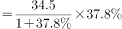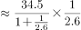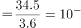亿美元；从德国进口额同比增量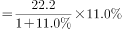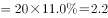亿美元。故2021年1～9月，我国机床工具自日本进口同比增量是德国增量的＜5倍，错误；

B项：定位图1可知2020年1-9月和2021年1-9月我国机床工具产品的累计进口额。根据公式：增长率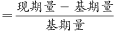，则金属切削机床同比增速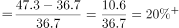；量具、量仪同比增速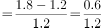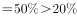。故2021年1～9月，进口额同比增速最高的机床工具产品类型不是金属切削机床，错误；

C项：定位图1和图2可知2021年1-9月我国机床工具产品的累计进口额和出口额。金属切削机床进出口总额＝47.3＋26.2&gt;30亿美元；机床功能部件（含零件）进出口总额＝14.8＋12.1&lt;30亿美元；切削刀具进出口总额＝12.6＋27.6&gt;30亿美元；数控装置进出口总额＝10.4＋8.2&lt;30亿美元；金属成形机床进出口总额＝9.3＋11.7&lt;30亿美元；磨料磨具进出口总额＝5.7＋29.3&gt;30亿美元；木工机床进出口总额＝2.5＋19.7＝&lt;30亿美元；量具、量仪进出口总额＝1.8＋1.6&lt;30亿美元；铸造机进出口总额＝0.8＋1.0&lt;30亿美元。故2021年1～9月，进出口总额超过30亿美元的机床工具产品有金属切削机床、切削刀具、磨料磨具，共3种，正确；

D项：定位文字材料第三段，2021年1～9月，我国机床工具对印度出口额为8.8亿美元，同比增长67.8%。根据公式：基期量，则2020年1～9月，我国机床工具对印度出口额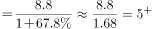亿美元＞5亿美元，错误。

故正确答案为C。

---

## 材料 2

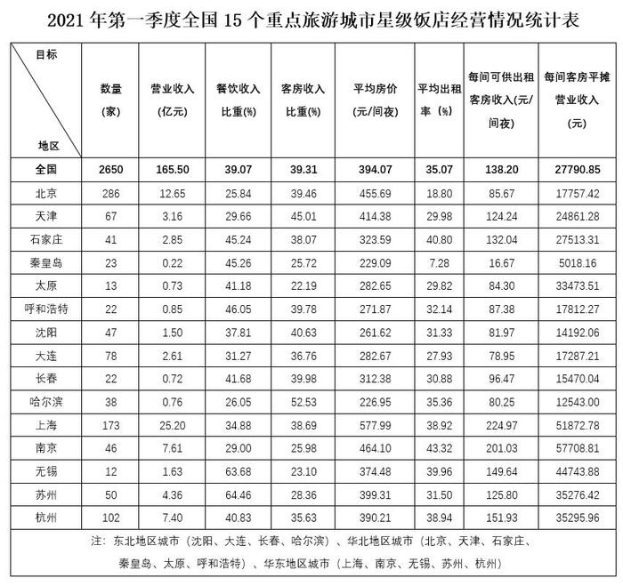

### 第 6 题　qid 5104850 · 平均数

2021年第一季度15个重点旅游城市中，星级饭店平均房价高于全国平均房价的有几个？

- **A**. 3
- **B**. 4
- **C**. 5　✅
- **D**. 6

**答案**：C

**官方解析**

定位统计表，2021年第一季度全国星级饭店平均房价为394.07元/间夜，15个重点旅游城市星级饭店平均房价高于全国平均房价的有：北京（455.69元/间夜）、天津（414.38元/间夜）、上海（577.99元/间夜）、南京（464.1元/间夜）、苏州（399.31元/间夜），共5个。
故正确答案为C。

---

### 第 7 题　qid 5104851 · 平均数

2021年第一季度15个重点旅游城市中，华北地区星级饭店平均营业收入最高的城市为：

- **A**. 石家庄　✅
- **B**. 天津
- **C**. 太原
- **D**. 北京

**答案**：A

**官方解析**

根据题干“2021年第一季度······平均营业收入最高的城市为”，可判定本题为现期平均数比较问题。定位统计表可知，2021年第一季度15个重点旅游城市中，石家庄、天津、太原、北京的星级饭店的营业收入与数量。根据公式：饭店平均营业收入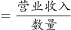，则这4个重点旅游城市的星级饭店平均营业收入如下：

石家庄：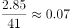亿元/家；天津：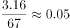亿元/家；太原：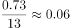亿元/家；北京：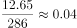亿元/家。则华北地区星级饭店平均营业收入最高的城市为石家庄。

故正确答案为A。

---

### 第 8 题　qid 5104853 · 平均数

2021年第一季度15个重点旅游城市中，高于全国平均出租率的城市的星级饭店平均数量约为多少家？

- **A**. 60
- **B**. 64
- **C**. 69　✅
- **D**. 72

**答案**：C

**官方解析**

根据题干“2021年第一季度······平均数量约为多少家”，可判定本题为现期平均数问题。定位统计表可得：2021年第一季度全国平均出租率为35.07%，以及15个重点旅游城市星级饭店的平均出租率。其中高于35.07%的城市有：石家庄（40.8%）、哈尔滨（35.36%）、上海（38.92%）、南京（43.32%）、无锡（39.96%）、杭州（38.94%），共6个城市。相应的星级饭店数量分别为：41家、38家、173家、46家、12家、102家。星级饭店的平均数量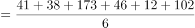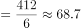家，与C项最接近。

故正确答案为C。

---

### 第 9 题　qid 5104855 · 倍数

2021年第一季度15个重点旅游城市中，华东地区星级饭店的餐饮收入比重约是东北地区的几倍？

- **A**. 1.15　✅
- **B**. 1.28
- **C**. 1.36
- **D**. 1.51

**答案**：A

**官方解析**

根据题干“······约是······的几倍”，可判定本题为现期倍数问题。定位统计表可得：2021年第一季度华东地区星级饭店的营业收入及餐饮收入比重依次为上海25.20亿元、34.88%，南京7.61亿元、29.00%，无锡1.63亿元、63.68%，苏州4.36亿元、64.46%，杭州7.40亿元、40.83%；东北地区依次为沈阳1.50亿元、37.81%，大连2.61亿元、31.27%，长春0.72亿元、41.68%，哈尔滨0.76亿元、26.05%。根据公式：比重，则华东地区星级饭店的餐饮收入比重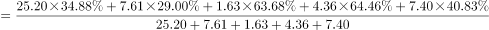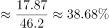；东北地区星级饭店的餐饮收入比重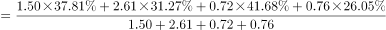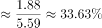，故华东地区约是东北地区的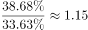倍。

故正确答案为A。

备注：由于正确算法计算量几乎无法笔算，考虑出题人可能按照比重的平均数计算此题：华东地区星级饭店餐饮收入比重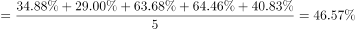，东北地区星级饭店的餐饮收入比重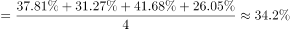，如此计算华东地区约是东北地区的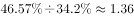倍，对应C项。但从数学角度，C项算法并非科学算法。

---

### 第 10 题　qid 5104856 · 平均数

2021年第一季度15个重点旅游城市中，下列哪座城市星级饭店的每间可供出租客房收入，既低于华东地区的平均水平又高于全国平均水平？

- **A**. 上海
- **B**. 南京
- **C**. 苏州
- **D**. 杭州　✅

**答案**：D

**官方解析**

根据题干“2021年第一季度······每间可供出租客房收入，既低于华东地区的平均水平又高于全国平均水平”，结合材料时间为2021年第一季度，可判定本题为现期平均数问题。定位统计表可知，全国每间可供出租客房收入为138.2元/间夜；华东地区城市星级饭店的每间可供出租客房收入分别为：上海（224.97元/间夜）、南京（201.03元/间夜）、无锡（149.64元/间夜）、苏州（125.8元/间夜）、杭州（151.93元/间夜），则华东地区的平均值为：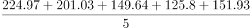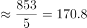元/间夜。既低于华东地区的平均水平又高于全国平均水平，只有D项满足。

故正确答案为D。 

---

## 材料 3

        2022年1月末，我国人民币贷款余额196.65万亿元，同比增长11.5%，增速分别比上月末和上年同期低0.1个和1.2个百分点。1月份我国人民币贷款增加3.98万亿元，同比多增3944亿元。分部门看，住户贷款增加8430亿元；企（事）业单位贷款增加3.36万亿元，其中，短期贷款增加1.01万亿元，中长期贷款增加2.1万亿元，票据融资增加1788亿元。2022年1月末，我国外币贷款余额9308亿美元，同比增长2%。1月份外币贷款增加181亿美元，同比少增269亿美元。

        2022年1月末，我国人民币存款余额236.07万亿元，同比增长9.2%，增速分别比上月末和上年同期低0.1个和1.2个百分点，1月份人民币存款增加3.83万亿元，同比多增2627亿元，其中，住户存款增加5.41万亿元，非金融企业存款减少1.4万亿元，财政性存款增加5849亿元。1月末，外币存款余额1.02万亿美元，同比增长9%。1月份外币存款增加272亿美元，同比少增228亿美元。

        2022年1月份，我国银行间人民币市场以拆借、现券和回购方式合计日均成交6.31万亿元，日均成交同比增长18%。其中，同业拆借日均成交同比增长9.3%，现券日均成交同比增长22.9%，质押式回购日均成交同比增长18.2%。

### 第 11 题　qid 5104866 · 综合

2021年1月末，我国人民币贷款余额约为多少万亿元？

- **A**. 180
- **B**. 176　✅
- **C**. 160
- **D**. 156

**答案**：B

**官方解析**

根据题干“2021年1月末······约为多少万亿元”，结合材料时间为2022年1月末，可判定本题为基期计算问题。定位文字材料可知：2022年1月末，我国人民币贷款余额196.65万亿元，同比增长11.5%。根据公式：基期量，则2021年1月末我国人民币贷款余额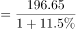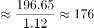万亿元。

故正确答案为B。

---

### 第 12 题　qid 5104867 · 比重

2022年1月份，我国企（事）业单位贷款增加额占人民币贷款增加额的比重比住户贷款所占比重高约多少个百分点？

- **A**. 30
- **B**. 40
- **C**. 50
- **D**. 60　✅

**答案**：D

**官方解析**

根据题干“2022年1月份······占······的比重比······所占比重高约多少个百分点”，结合材料时间是2022年1月，可判定本题为现期比重问题。定位文字材料可得：2022年1月份，我国人民币贷款增加3.98万亿元；分部门看，住户贷款增加8430亿元；企（事）业单位贷款增加3.36万亿元。根据公式：比重，8430亿元=0.843万亿元，则所求比重差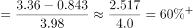，对应D项。

故正确答案为D。

---

### 第 13 题　qid 5104870 · 增长

2022年1月末，我国本外币存款余额同比增速在以下哪个范围内？

- **A**. 低于5%
- **B**. 5%到10%之间　✅
- **C**. 10%～19%之间
- **D**. 高于19%

**答案**：B

**官方解析**

根据题干“2022年1月末，我国本外币存款余额同比增速······”，结合材料给出2022年1月末我国人民币和外币存款余额的增长率，可判定本题为混合增长率问题。定位文字材料可知：2022年1月末，我国人民币存款余额同比增长9.2%；外币存款余额同比增长9%。由于本外币存款余额=人民币存款余额+外币存款余额，根据混合增长率口诀：混合居中但不正中，可知2022年1月末我国本外币存款余额同比增速在9%～9.2%范围内，符合B项的范围。
故正确答案为B。

---

### 第 14 题　qid 5104872 · 比重

2022年1月，我国银行间人民币市场同业拆借、现券、质押式回购日均成交量所占三者合计的比重高于上年同期的是：

- **A**. 仅现券
- **B**. 仅现券和质押式回购　✅
- **C**. 仅同业拆借和质押式回购
- **D**. 同业拆借、现券、质押式回购

**答案**：B

**官方解析**

根据题干“2022年1月······比重高于上年同期的是”，可判定本题为两期比重问题。定位文字材料可得：2022年1月份，我国银行间人民币市场以拆借、现券和回购方式合计······日均成交同比增长18%（b）。其中，同业拆借日均成交同比增长9.3%（），现券日均成交同比增长22.9%（），质押式回购日均成交同比增长18.2%（）。根据两期比重比较结论：当部分增长率a＞整体增长率b时，比重上升。其中满足a＞b的有：现券（22.9%）和质押式回购（18.2%）。

故正确答案为B。

---

### 第 15 题　qid 5104875 · 综合

能够从上述资料中推出的是：

- **A**. 2022年1月末，我国票据融资增加额占企（事）业贷款增加额的比重不足5%
- **B**. 2022年1月，我国住户存款增加额是财政性存款增加额的10倍以上
- **C**. 2021年1月末，我国外币贷款增加超过500亿美元
- **D**. 2021年12月末，我国人民币存款余额的同比增速比2021年1月末我国人民币存款余额的同比增速低1.1个百分点　✅

**答案**：D

**官方解析**

A项：定位文字资料可得：2022年1月末，我国企（事）业单位贷款增加3.36万亿元，票据融资增加1788亿元。根据公式：比重，则所求为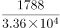，错误；

B项：定位文字资料可得：2022年1月末，我国住户存款增加5.41万亿元，财政性存款增加5849亿元。则所求倍数为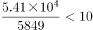倍，错误；

C项：定位文字资料可得：2022年1月份，我国外币贷款增加181亿美元，同比少增269亿美元。则2021年1月份，我国外币贷款增加181+269&lt;200+300=500亿美元，错误；

D项：定位文字资料可得：2022年1月末，我国人民币存款余额236.07万亿元，同比增长9.2%，增速分别比上月末和上年同期低0.1个和1.2个百分点。则所求为（9.2%+0.1%）-（9.2%+1.2%）=-1.1%，即低1.1个百分点，正确。

故正确答案为D。

---
