# 2022年山东省公务员录用考试《行测》试题（网友回忆版）

> 资料分析 · 15 题 · 山东 2022

## 材料 1

        2018年我国全年规模以上港口完成货物吞吐量133亿吨，同比增长2.7%，其中外贸货物吞吐量42亿吨，同比增长2.0%。规模以上港口集装箱吞吐量24955万标准箱，同比增长5.2%。

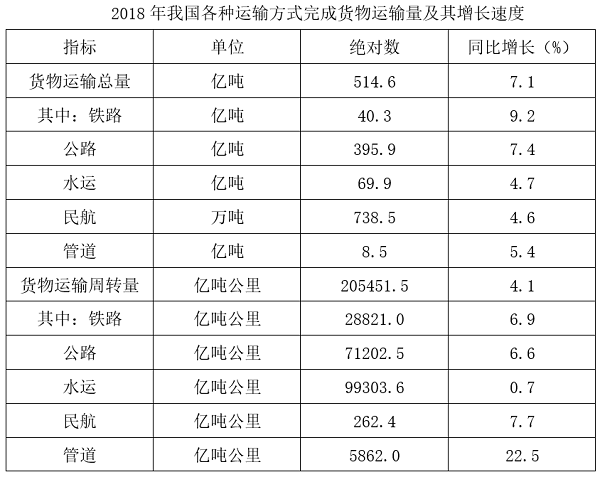

### 第 1 题　qid 4662436 · 综合

2017年我国公路货物运输周转量为铁路的：

- **A**. 不到100%
- **B**. 100%-200%之间
- **C**. 200%-300%之间　✅
- **D**. 超过300%

**答案**：C

**官方解析**

根据题干“2017年······为······的”，结合材料时间为2018年，且选项为百分数，可判定本题为基期倍数问题。定位表格材料可得：2018年，我国公路货物运输周转量为71202.5亿吨公里，同比增长6.6%；我国铁路货物运输周转量为28821.0亿吨公里，同比增长6.9%。根据基期倍数计算公式：，可得2017年我国公路货物运输周转量为铁路的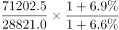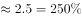，即在200%-300%之间。

故正确答案为C。

---

### 第 2 题　qid 4662440 · 增长

2018年我国各种运输方式货物运输总量同比增量从高到低排序正确的是：

- **A**. 民航、公路、水运、铁路
- **B**. 公路、铁路、水运、民航　✅
- **C**. 公路、水运、铁路、民航
- **D**. 民航、公路、铁路、水运

**答案**：B

**官方解析**

根据题干“······同比增量从高到低排序正确的是”，可判定本题为增长量比较问题。定位表格材料可知：2018年铁路货物运输总量为40.3亿吨，同比增长9.2%；公路货物运输总量为395.9亿吨，同比增长7.4%；水运货物运输总量为69.9亿吨，同比增长4.7%；民航货物运输总量为738.5万吨，同比增长4.6%。由于民航单位为万吨，铁路、公路、水运单位均为亿吨，民航的现期量和增长率均小于铁路、公路、水运，由增长量比较“大大则大”可知，民航的同比增量最小，排除A、D两项。B、C两项中比较铁路和水运即可，已知现期量和增长率，可代入公式：增长量。铁路同比增量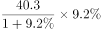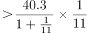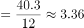亿吨，水运同比增量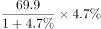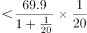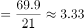亿吨，故铁路同比增量＞水运同比增量，排除C项。

故正确答案为B。

---

### 第 3 题　qid 4662441 · 增长

2018年我国全年规模以上港口完成非外贸货物吞吐量同比增速：

- **A**. 低于1.5%
- **B**. 在1.5%-2.5%之间
- **C**. 在2.5%-3.5%之间　✅
- **D**. 高于3.5%

**答案**：C

**官方解析**

根据题干“2018年······非外贸货物吞吐量同比增速”，结合材料中给出了2018年我国规模以上港口完成货物吞吐量的增速及外贸货物吞吐量的增速，且存在货物吞吐量=外贸货物吞吐量+非外贸货物吞吐量，可判定本题为混合增长率问题。定位文字材料可得：2018年我国全年规模以上港口完成货物吞吐量133亿吨，同比增长2.7%，其中外贸货物吞吐量42亿吨，同比增长2.0%。根据混合增长率口诀“混合增长率大小居中，偏向基期量大的一方（一般用现期量代替基期量）”可知，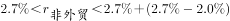，即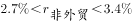。观察选项，只有C项符合。

故正确答案为C。

---

### 第 4 题　qid 4662447 · 平均数

已知货物平均运输距离（公里）=货物运输周转量÷货物运输总量。在①铁路、②公路、③水运和④民航四种运输方式中，2018年我国货物平均运输距离高于2017年水平的是：

- **A**. 仅①和②
- **B**. 仅③和④
- **C**. 仅①、②和③
- **D**. 仅④　✅

**答案**：D

**官方解析**

由题干“2018年······平均运输距离高于2017年水平的是”，可判定本题为两期平均数的比较问题。货物平均运输距离（公里）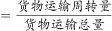。根据两期平均数结论：分子增速大于分母增速，则平均数相比去年上升。定位表格，四种运输方式中，只有民航货物运输周转量增速（7.7%）＞民航货物运输总量增速（4.6%），2018年我国货物平均运输距离高于2017年水平的只有民航。

故正确答案为D。

---

### 第 5 题　qid 4662450 · 综合

能够从上述资料中推出的是：

- **A**. 2017年我国全年货物运输总量大于500亿吨
- **B**. 2017年我国规模以上港口集装箱吞吐量超过2.2亿标准箱　✅
- **C**. 2018年我国水运货物运输周转量同比增长超过1000亿吨公里
- **D**. 2018年我国公路货物运输量占货物运输总量的比重超过八成

**答案**：B

**官方解析**

A项：定位统计表可知：2018年我国全年货物运输总量为514.6亿吨，同比增长7.1%。根据公式：基期量，则2017年我国全年货物运输总量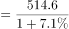亿吨，错误；

B项：定位文字材料可知：（2018年我国）规模以上港口集装箱吞吐量24955万标准箱，同比增长5.2%。根据公式：基期量，则2017年我国规模以上港口集装箱吞吐量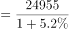万标准箱亿标准箱&gt;2.2亿标准箱，正确；

C项：定位统计表可知：2018年我国水运货物运输周转量为99303.6亿吨公里，同比增长0.7%。根据公式：增长量，则2018年我国水运货物运输周转量的同比增长量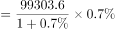亿吨公里&lt;1000亿吨公里，错误；

D项：定位统计表可知：2018年我国公路货物运输量为395.9亿吨，货物运输总量为514.6亿吨。根据公式：比重，则2018年我国公路货物运输量占货物运输总量的比重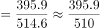，即比重不到八成，错误。

故正确答案为B。 

---

## 材料 2

        数据显示，我国近10年养老相关企业注册量逐年攀升。2020年注册量达5.09万家，同比增长22%。2021年1-3季度共注册3.92万家养老相关企业，同比增长16%。

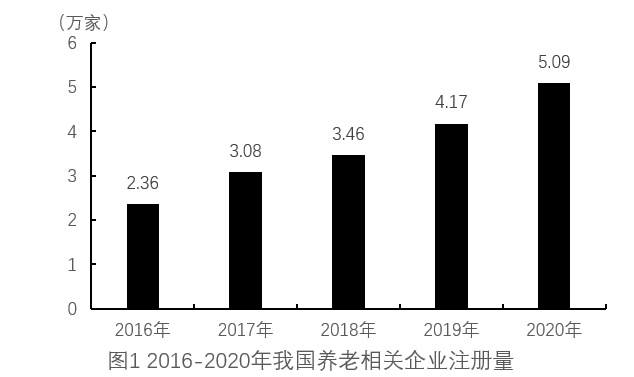

        从地区来看，2021年9月月末，江苏省是我国养老相关企业数量最多的省份，占全国总量的9%，山东、广东排名第二、第三位。

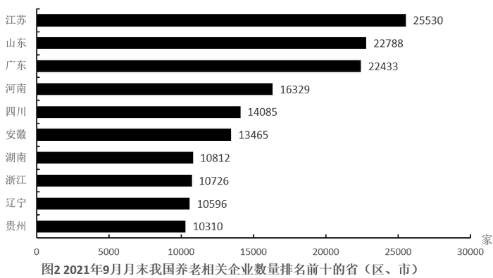

        从城市分布来看，2021年9月月末，广州市拥有的养老相关企业数量最多，共7763家，占广东省总量的34.6%。

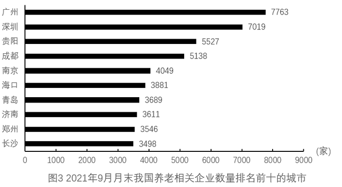

### 第 6 题　qid 4663213 · 增长

如果2021年我国第4季度注册养老相关企业的同比增长幅度与1-3季度相同，则2021年我国养老相关企业注册量约为多少万家？

- **A**. 5.23
- **B**. 5.45
- **C**. 5.68
- **D**. 5.90　✅

**答案**：D

**官方解析**

根据题干“······2021年······约为多少万家”，可判定本题为现期计算问题。定位文字材料第一段可知：2020年我国养老相关企业注册量达5.09万家，2021年1-3季度共注册3.92万家养老相关企业，同比增长16%。结合题干“2021年我国第4季度注册养老相关企业的同比增长幅度与1-3季度相同”，则2021年全年我国养老相关企业注册量的同比增速为16%。根据公式：现期量=基期量×（1+增长率），可得2021年我国养老相关企业注册量=5.09×(1+16%)&gt;5×(1+16%)=5.80万家，只有D项符合。
故正确答案为D。

---

### 第 7 题　qid 4663214 · 增长

2017-2020年，我国养老相关企业注册量增速最快的年份是：

- **A**. 2017　✅
- **B**. 2018
- **C**. 2019
- **D**. 2020

**答案**：A

**官方解析**

根据题干“2017-2020年······增速最快的年份是”，可判定本题为一般增长率比较问题。定位图1可得：2016-2020年我国养老相关企业注册量分别为2.36万家、3.08万家、3.46万家、4.17万家、5.09万家。根据公式：增长率，可得2017-2020年我国养老相关企业注册量增速分别为：

2017年：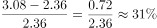；

2018年：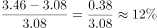；

2019年：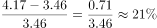；

2020年：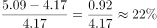。

则2017-2020年，我国养老相关企业注册量增速最快的年份是2017年。

故正确答案为A。

---

### 第 8 题　qid 4663216 · 综合

2021年9月月末，我国养老相关企业的数量约为多少万家？

- **A**. 26.3
- **B**. 28.4　✅
- **C**. 31.2
- **D**. 33.7

**答案**：B

**官方解析**

根据题干“2021年9月月末，我国养老相关企业的数量约为多少万家”，结合材料给出2021年9月月末江苏省养老相关企业的数量及其占比，可判定本题为现期比重问题。定位文字材料第二段可得：2021年9月月末，江苏省养老相关企业数量占全国总量的9%；定位图2可得：2021年9月月末，江苏省养老相关企业数量为25530家。根据公式：整体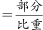，则2021年9月月末，我国养老相关企业的数量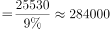家=28.4万家。

故正确答案为B。

---

### 第 9 题　qid 4663217 · 综合

2021年9月月末，广州市养老相关企业数量比青岛市约多多少倍？

- **A**. 1.1　✅
- **B**. 1.4
- **C**. 2.1
- **D**. 2.4

**答案**：A

**官方解析**

根据题干“2021年9月月末······比······多多少倍”，可判定本题为现期倍数问题。定位图3可得：（2021年9月月末）广州市、青岛市养老相关企业数量分别为7763家、3689家。故2021年9月月末，广州市养老相关企业数量比青岛市多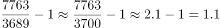倍。

故正确答案为A。

---

### 第 10 题　qid 4663218 · 综合

能够从上述资料中推出的是：

- **A**. 2014年我国养老相关企业的注册量低于2013年
- **B**. 2021年9月月末，北京市养老相关企业数量高于辽宁省
- **C**. 2021年9月月末，贵阳市养老相关企业数量超过省内其他地区的总和　✅
- **D**. 2021年9月月末，我国养老相关企业数量排名前十的城市来自9个省

**答案**：C

**官方解析**

A项：定位文字材料第一段，我国近10年养老相关企业注册量逐年攀升，2013年、2014年均在近10年之内，故2014年我国养老相关企业的注册量高于2013年，错误；
B项：定位统计图2，2021年9月月末辽宁省养老相关企业数量为10596家，北京市并未排进全国前十，故2021年9月月末北京市养老相关企业数量低于辽宁省，错误；
C项：定位统计图2和统计图3，2021年9月月末贵阳市、贵州省养老相关企业数量分别为5527家、10310家，则除贵阳市外贵州省内其他地区养老相关企业数量总和10310-5527=4783家＜贵阳市（5527家），正确；
D项：定位统计图3，我国养老相关企业数量排名前十的城市分别来自于：广东省（广州市、深圳市），贵州省（贵阳市），四川省（成都市），江苏省（南京市），海南省（海口市），山东省（青岛市、济南市），河南省（郑州市），湖南省（长沙市），共8个省，错误。
故正确答案为C。

---

## 材料 3

        2020年某市实现社会消费品零售总额833.82亿元，同比增长7.0%。按消费形态分，批发和零售业实现713.67亿元，同比增长6.1%；住宿和餐饮业实现120.15亿元，同比增长12.3%。按经营所在地分，城镇实现653.54亿元，同比增长7.2%；乡镇实现180.28亿元，同比增长5.9%。

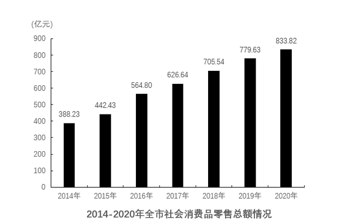

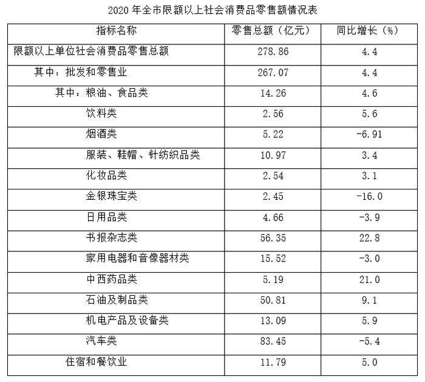

### 第 11 题　qid 4663219 · 增长

2020年该市批发和零售业占社会消费品零售总额的百分比比上年约：

- **A**. 下降了0.7个百分点　✅
- **B**. 下降了1.5个百分点
- **C**. 上升了0.7个百分点
- **D**. 上升了1.5个百分点

**答案**：A

**官方解析**

根据题干“2020年······占······百分比比上年约”，结合选项为“上升/下降+百分点”，可判定本题为两期比重问题。定位文字材料可得：2020年该市实现社会消费品零售总额833.82亿元（B），同比增长7.0%（b）；批发和零售业实现713.67亿元（A），同比增长6.1%（a）。根据公式：两期比重差，则所求比重差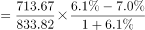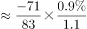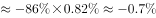，即约下降了0.7个百分点。

故正确答案为A。

---

### 第 12 题　qid 4663220 · 增长

以下折线图中，能准确反映该市2015-2018年社会消费品零售总额同比增量变化趋势的是：

- **A**. 

- **B**. 

- **C**. 

- **D**. 

　✅

**答案**：D

**官方解析**

根据题干“······2015-2018年······同比增量变化趋势······”，可判定本题为增长量比较问题。定位统计图可得：2014-2018年全市社会消费品零售总额分别为388.23亿元、442.43亿元、564.80亿元、626.64亿元、705.54亿元。根据公式：增长量=现期量-基期量，可得该市2015-2018年社会消费品零售总额同比增量分别为：
2015年：442.43-388.23=54.20亿元；
2016年：564.80-442.43=122.37亿元；
2017年：626.64-564.80=61.84亿元；
2018年：705.54-626.64=78.90亿元；
同比增量为先上升后下降再上升，且2015年同比增量最低、2016年同比增量最高，与D项变化趋势一致。
故正确答案为D。

---

### 第 13 题　qid 4663221 · 综合

2019年，该市城镇消费品零售总额是乡村消费品零售总额的：

- **A**. 不到2倍
- **B**. 2倍-3倍
- **C**. 3倍-4倍　✅
- **D**. 超过4倍

**答案**：C

**官方解析**

根据题干“2019年······是······的”，结合选项为倍数且材料时间为2020年，可判定本题为基期倍数问题。定位文字材料第一段可得：2020年城镇实现消费品零售总额653.54亿元（A），同比增长7.2%（a）；乡镇实现消费品零售总额180.28亿元（B），同比增长5.9%（b）。根据公式：基期倍数，则所求倍数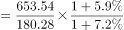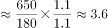，即2019年，该市城镇消费品零售总额是乡村消费品零售总额的3倍-4倍。

故正确答案为C。

---

### 第 14 题　qid 4663222 · 增长

2020年，该市限额以上单位批发和零售业中零售额同比增量最多的商品是：

- **A**. 书报杂志类　✅
- **B**. 石油及制品类
- **C**. 机电产品及设备类
- **D**. 中西药品类

**答案**：A

**官方解析**

根据题干“2020年······同比增量最多的商品是”，可判定本题为增长量比较问题。根据选项，定位统计表可得：2020年全市限额以上单位批发和零售业中书报杂志类、石油及制品类、机电产品及设备类、中西药品类商品的零售额分别为56.35亿元、50.81亿元、13.09亿元、5.19亿元，同比增长率分别为22.8%、9.1%、5.9%、21.0%。根据增长量比较口诀“大大则大”（现期大且增长率大，则增长量大），A项书报杂志类的现期量和增长率均大于其他选项，故2020年该市限额以上单位批发和零售业中零售额同比增量最多的商品是书报杂志类。
故正确答案为A。

---

### 第 15 题　qid 4663224 · 综合

能够从上述资料中推出的是：

- **A**. 2019年全市限额以上住宿和餐饮业零售额超过110亿元
- **B**. 2018-2020年，全市社会消费品零售总额超过2500亿元
- **C**. 2020年全市限额以上批发和零售业中，有6类商品的销售额低于上年水平
- **D**. 2020年全市限额以下单位社会消费品零售总额同比增速超过7%　✅

**答案**：D

**官方解析**

A项：定位统计表，2020年全市限额以上住宿和餐饮业零售额为11.79亿元，同比增长5.0%。根据公式：基期量，故2019年全市限额以上住宿和餐饮业零售额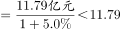亿元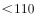亿元，错误；

B项：定位统计图，2018-2020年全市社会消费品零售总额分别为：705.54亿元、779.63亿元、833.82亿元。则2018-2020年全市社会消费品零售总额=705.54+779.63+833.82＜710+780+840=2330亿元＜2500亿元，错误；

C项：定位统计表可得2020年全市限额以上批发和零售业中各类商品零售额的同比增速，并非销售额的同比增速，无法判断是否有6类商品的销售额低于上年水平，错误；

D项：定位文字材料及统计表，2020年全市实现社会消费品零售总额同比增长7.0%；2020年全市限额以上单位社会消费品零售总额同比增长4.4%。由社会消费品零售总额=限额以上+限额以下，根据混合增长率结论：整体增速介于部分增速之间，即4.4%＜7.0%＜2020年全市限额以下单位社会消费品零售总额同比增速，正确。

故正确答案为D。

备注：选项C中，即使将“销售额”等同于“零售额”，定位统计表可得：2020年全市限额以上批发和零售业中各类商品零售额低于上年水平的有：烟酒类（-6.91%）、金银珠宝类（-16.0%）、日用品类（-3.9%）、家用电器和音像器材类（-3.0%）、汽车类（-5.4%），共5类，并非6类，依然错误。

---
